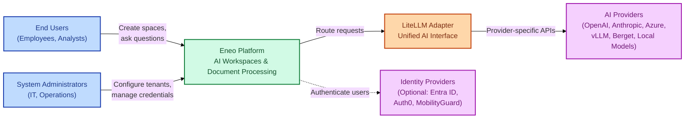
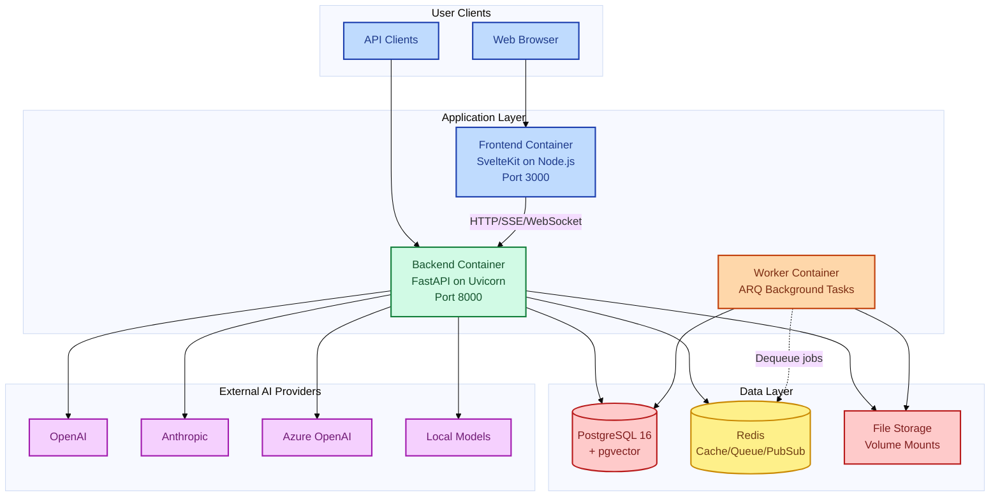
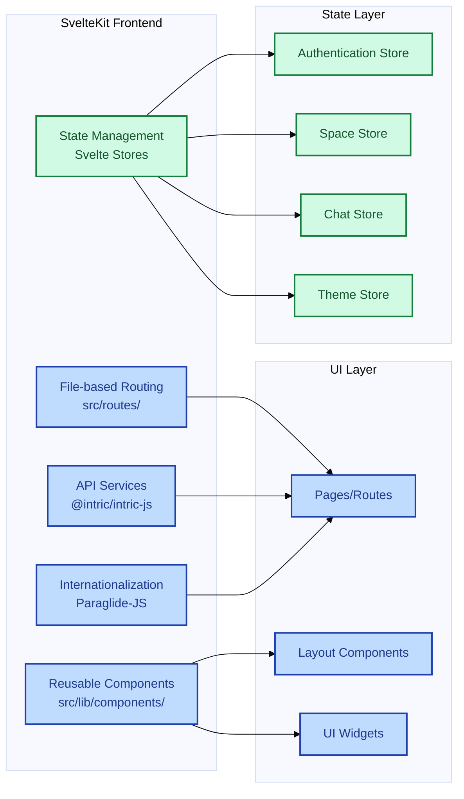
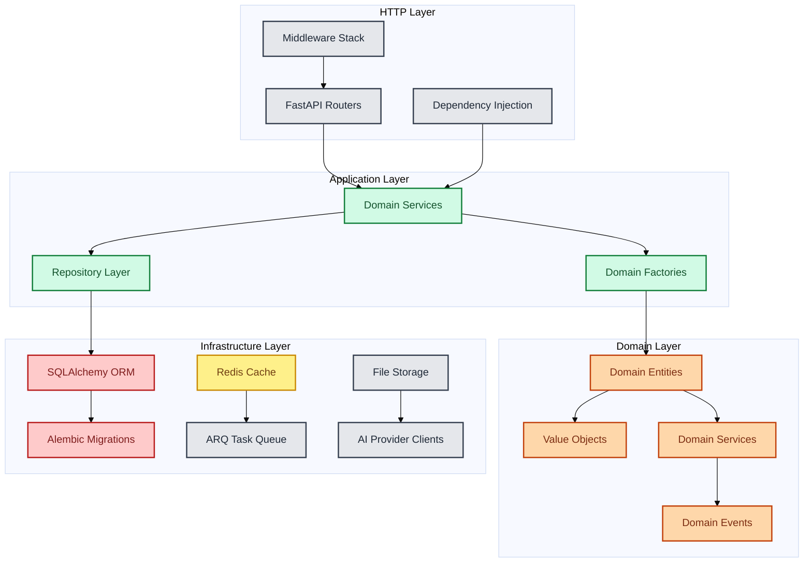
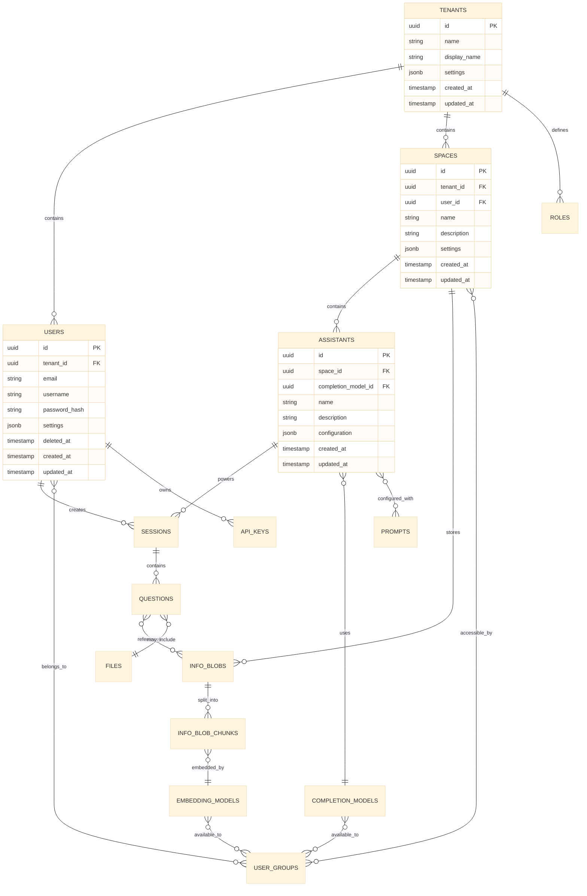
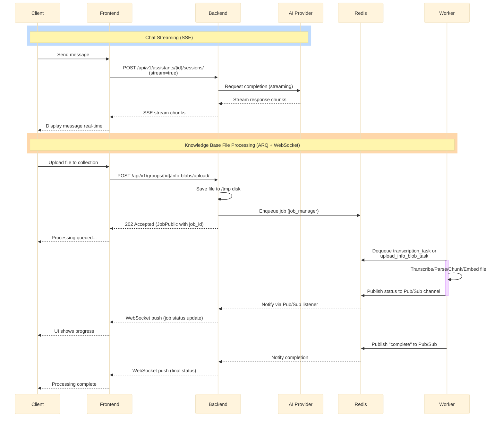
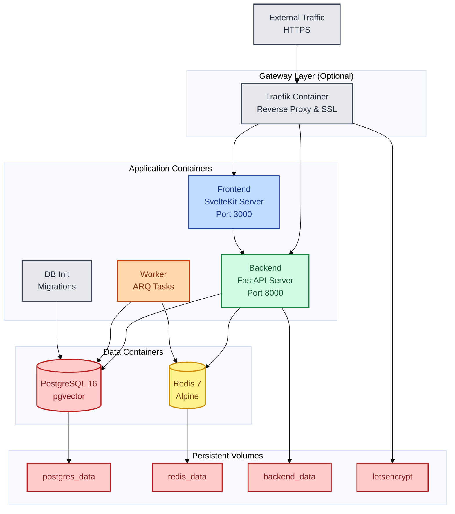

# Architecture Guide

This guide covers Eneo's technical architecture, design patterns, and system components.

---

## System Overview

Eneo uses a microservices architecture with domain-driven design principles for scalability, maintainability, and democratic AI governance.

### Core Principles

- **Domain-Driven Design** - Business logic organized by domain boundaries
- **Event-Driven Architecture** - Asynchronous processing via Redis pub/sub
- **API-First Design** - OpenAPI specification with auto-generated documentation
- **Multi-Tenancy** - Secure isolation between organizations
- **Real-Time Communication** - WebSockets and Server-Sent Events
- **Security by Design** - Built-in compliance and access control

---

## System Context (C4 Level 1)

The Eneo system serves public sector organizations by providing AI-powered collaborative workspaces. This diagram shows how Eneo interacts with its users and external systems.



---

## High-Level Architecture (C4 Level 2)

This diagram shows the core deployable containers and their interactions. Note: Traefik reverse proxy shown here is part of the production deployment example (see [DEPLOYMENT.md](./DEPLOYMENT.md)) and can be replaced with other solutions like Nginx, Kubernetes Ingress, etc.

<details>
<summary>View complete system architecture</summary>



**Key Components:**
- **Frontend**: Serves the web UI and proxies API requests
- **Backend**: FastAPI application with domain services (authentication, spaces, assistants, files, AI integration)
- **Worker**: ARQ processes background tasks (file processing, web crawling, transcription, document embedding)
- **PostgreSQL**: Primary database with pgvector for semantic search
- **Redis**: Caching, job queue, and pub/sub messaging

</details>

---

## Domain-Driven Design Structure

Eneo implements DDD patterns with clear domain boundaries and consistent architectural patterns.

### Domain Organization

```
backend/src/intric/
├── assistants/           # AI Assistant Management Domain
├── spaces/              # Collaborative Workspaces Domain
├── users/               # User Management Domain
├── completion_models/   # AI Model Integration Domain
├── embedding_models/    # Vector Search Domain
├── files/               # Document Processing Domain
├── sessions/            # Conversation Management Domain
├── authentication/     # Security and Access Control Domain
├── groups_legacy/       # User Groups Domain (Legacy)
├── tenants/            # Multi-tenancy Domain
└── workflows/          # Business Process Automation Domain
```

### Domain Pattern Structure

Each domain follows a consistent layered architecture:

<details>
<summary>View domain structure pattern</summary>

```
domain_name/
├── api/                           # Presentation Layer
│   ├── domain_models.py          # Pydantic schemas for API
│   ├── domain_router.py          # FastAPI route definitions
│   └── domain_assembler.py       # Domain-to-API transformation
├── application/                   # Application Layer
│   └── domain_service.py         # Business logic and use cases
├── domain/                        # Domain Layer
│   ├── domain.py                 # Domain entities and value objects
│   └── domain_repo.py            # Repository interfaces
├── infrastructure/               # Infrastructure Layer
│   └── domain_repo_impl.py       # Repository implementations
├── domain_factory.py             # Domain object creation
└── __init__.py
```

**Layer Responsibilities:**
- **API Layer**: HTTP request/response handling, data validation
- **Application Layer**: Business use cases, orchestration
- **Domain Layer**: Core business logic, entities, rules
- **Infrastructure Layer**: Database access, external services

</details>

---

## Frontend Architecture (C4 Level 3)

Deep dive into the SvelteKit frontend container showing components, state management, and data flow. This diagram illustrates how the frontend is organized using Svelte 5's reactive patterns and how it communicates with backend services.

<details>
<summary>View SvelteKit application structure</summary>



</details>

### Key Frontend Technologies

- **Framework**: SvelteKit with TypeScript
- **Package Manager**: bun with workspace support
- **UI Components**: Custom component library (@intric/ui)
- **Styling**: Tailwind CSS v4
- **API Client**: Type-safe client (@intric/intric-js)
- **State Management**: Svelte stores with reactive updates
- **Internationalization**: Paraglide-JS for Swedish/English
- **Build Tool**: Vite for development and production builds

---

## Backend Architecture (C4 Level 3)

Deep dive into the FastAPI backend container showing the layered architecture with HTTP handling, domain services, domain entities, and infrastructure components. This demonstrates how Eneo implements domain-driven design principles with clear separation of concerns across layers.

### FastAPI Application Structure

<details>
<summary>View backend architecture diagram</summary>



</details>

### Core Backend Components

**Framework Stack:**
- **FastAPI**: Modern async web framework
- **SQLAlchemy**: ORM with async support
- **Alembic**: Database migration management
- **Pydantic**: Data validation and serialization
- **ARQ**: Async Redis Queue for background tasks

**Architecture Patterns:**
- **Repository Pattern**: Data access abstraction
- **Factory Pattern**: Complex object creation
- **Dependency Injection**: Service composition
- **Event Sourcing**: Domain event handling
- **CQRS**: Command Query Responsibility Segregation

---

## Data Architecture

This section describes how Eneo manages data across PostgreSQL, Redis, and file storage, with particular emphasis on multi-tenancy and vector search capabilities.

### Database Design

The entity relationship diagram shows the core entities and their relationships. The database is organized around tenant isolation, ensuring complete data separation between organizations while maintaining referential integrity.

<details>
<summary>View database schema overview</summary>



</details>

### Key Data Patterns

**Multi-tenancy:**
- All entities include `tenant_id` for data isolation
- Row-level security ensures tenant separation
- UUID primary keys prevent enumeration attacks

**Soft Deletes:**
- Users support soft deletion with `deleted_at` timestamp
- Maintains referential integrity while hiding deleted records

**Audit Trails:**
- All entities include `created_at` and `updated_at` timestamps
- Database triggers maintain accurate timestamps
- Comprehensive logging for compliance requirements

**Vector Storage:**
- PostgreSQL with pgvector extension for semantic search
- Embeddings stored alongside metadata in `info_blob_chunks`
- Efficient similarity search with indexing strategies

---

## Multi-Tenancy Architecture

Eneo supports enterprise multi-tenancy with complete data isolation, per-tenant identity providers, and encrypted credential management.

### Tenant Isolation

**Database Level:**
- All entities include `tenant_id` for row-level security
- PostgreSQL policies enforce tenant separation
- UUID primary keys prevent enumeration

**Authentication Modes:**

- **Single-Tenant (Default)** - Shared IdP via `OIDC_DISCOVERY_ENDPOINT`
- **Multi-Tenant Federation** - Per-tenant IdPs (Entra ID, MobilityGuard, Auth0, Okta), encrypted with Fernet, enabled via `FEDERATION_PER_TENANT_ENABLED=true`

**Federation Configuration:**
```bash
# Example: Entra ID for a municipality
PUT /api/v1/sysadmin/tenants/{tenant_id}/federation
{
  "provider": "entra_id",
  "discovery_endpoint": "https://login.microsoftonline.com/{tenant-id}/v2.0/.well-known/openid-configuration",
  "client_id": "...",
  "client_secret": "...",  # Encrypted at rest
  "allowed_domains": ["municipality.gov"]
}

# Example: MobilityGuard
PUT /api/v1/sysadmin/tenants/{tenant_id}/federation
{
  "provider": "mobilityguard",
  "discovery_endpoint": "https://login.mobilityguard.com/.well-known/openid-configuration",
  "client_id": "...",
  "client_secret": "...",
  "allowed_domains": ["municipality.se"]
}
```

**Credential Management:**

- **Shared Mode** (`TENANT_CREDENTIALS_ENABLED=false`) - All tenants use global API keys
- **Strict Mode** (`TENANT_CREDENTIALS_ENABLED=true`) - Each tenant configures encrypted credentials

Supported providers: OpenAI, Anthropic, Azure, vLLM, Berget, Mistral. All credentials encrypted with Fernet using `ENCRYPTION_KEY`. Additional encrypted data includes crawler HTTP auth and custom integration secrets.

Configure via: `PUT /api/v1/sysadmin/tenants/{tenant_id}/credentials/{provider}`

**See Also:**
- [Federation Per Tenant](./FEDERATION_PER_TENANT.md) - IdP architecture
- [Multi-Tenant Credentials](./MULTI_TENANT_CREDENTIALS.md) - Detailed credential management
- [Multi-Tenant OIDC Setup](./MULTITENANT_OIDC_SETUP_GUIDE.md) - Provisioning guide

### Observability & Debugging

**OIDC Debug Toggle:**

Enable verbose authentication logging without redeployment for troubleshooting:

```bash
POST /api/v1/sysadmin/observability/oidc-debug/
{
  "enabled": true,
  "duration_minutes": 10,
  "reason": "Investigating login issue #452"
}
```

**Workflow:** Enable toggle → Reproduce issue → Capture `correlationId` from UI → Filter logs: `journalctl | jq 'select(.correlation_id=="abc123")'` → Identify misconfiguration → Disable toggle

**See Also:** [Multi-Tenant OIDC Setup Guide](./MULTITENANT_OIDC_SETUP_GUIDE.md#3-runtime-debugging-correlation-id-based)

---

## Real-Time Communication

Eneo uses Server-Sent Events (SSE) for streaming AI responses and WebSockets for general-purpose real-time updates.

### Communication Patterns

The sequence diagram below illustrates two key flows: (1) synchronous AI chat with streaming responses via SSE, and (2) asynchronous file processing with status updates via WebSocket.

<details>
<summary>View real-time architecture</summary>



</details>

### Real-Time Technologies

**Server-Sent Events (SSE):**
- Real-time AI response streaming
- Unidirectional server-to-client communication
- Automatic reconnection and error handling
- Browser-native support with EventSource API

**WebSockets:**
- Bidirectional real-time communication
- Background task status updates
- File upload progress tracking
- System-wide notifications

**Redis Pub/Sub:**
- Message broker for real-time events
- Scalable across multiple backend instances
- Event distribution to connected clients
- Persistent connection management

---

## AI Integration

### Multi-Provider Architecture

Eneo supports multiple AI providers through a unified interface, allowing organizations to choose providers based on their needs, compliance requirements, and budget.

**Supported Providers:**
- **OpenAI**: GPT models for general-purpose AI
- **Anthropic**: Claude models for advanced reasoning
- **Azure OpenAI**: Enterprise-grade OpenAI models
- **Local Models**: Self-hosted models for data sovereignty

**Key Features:**
- **Provider Switching**: Change AI providers without code changes
- **Cost Optimization**: Automatic model selection based on cost/performance
- **Fallback Support**: Automatic failover if primary provider is unavailable
- **Usage Tracking**: Monitor costs and performance across providers

---

## Background Processing

### ARQ Task System

Eneo uses ARQ (Async Redis Queue) for handling time-intensive operations that shouldn't block user interactions.

**Common Background Tasks:**
- **File Processing**: Document parsing, image analysis, audio transcription
- **AI Operations**: Embedding generation, batch completions
- **Web Crawling**: Website content extraction and indexing
- **Maintenance**: Database optimization, cache management

**Benefits:**
- **Non-blocking**: Users get immediate responses while processing happens in background
- **Scalable**: Add more worker containers as workload increases
- **Reliable**: Tasks are persisted in Redis and retried on failure
- **Prioritized**: Critical tasks processed before routine maintenance

---

## Security

### Security by Design

Eneo implements security at every layer to protect sensitive public sector data and ensure compliance with European regulations.

**Authentication & Access Control:**
- **JWT Authentication**: Secure token-based sessions
- **Role-Based Access**: Granular permissions by user role
- **Multi-Tenancy**: Complete data isolation between organizations
- **API Keys**: Secure service-to-service authentication

**Data Protection:**
- **Encryption**: AES-256 for data at rest, TLS 1.3 in transit
- **Tenant Data Encryption**: Fernet encryption for tenant credentials and federation configs
- **Password Security**: Bcrypt hashing with secure salts
- **Audit Trails**: All actions logged for compliance
- **Data Retention**: Automatic deletion per policy

**Multi-Tenant Security:**
- Database isolation with row-level security
- Encrypted credentials (Fernet) for LLM keys and IdP secrets
- Per-tenant federation support
- Masked credential responses

**Compliance Ready:**
- **GDPR**: Built-in data subject rights and privacy controls
- **EU AI Act**: Transparency and accountability features
- **Public Sector**: Designed for government security requirements

**See Also:** [Multi-Tenancy Architecture](#multi-tenancy-architecture) for detailed security implementation

---

## Monitoring and Observability

### Built-in Monitoring

Eneo includes comprehensive monitoring capabilities for production deployments.

**System Health:**
- Container resource usage and performance
- Database query performance and connection health
- Background task queue status and processing times
- API response times and error rates

**Business Intelligence:**
- User engagement and feature adoption
- AI model usage patterns and costs
- Document processing statistics
- Space collaboration metrics

**Security Monitoring:**
- Authentication failures and suspicious login attempts
- API rate limiting and abuse detection
- Data access patterns and compliance audits
- System resource anomalies

---

## Deployment Architecture

Eneo is designed to be deployed across multiple environments and orchestration platforms, from local Docker Compose development to Kubernetes production deployments.

### Container Architecture

This diagram shows how Eneo's components are containerized and deployed. Current deployment uses Docker Compose or Podman. Kubernetes support is planned via Helm charts.

<details>
<summary>View container deployment architecture</summary>



**Deployment Methods:**
- **Docker Compose** (Primary): Orchestrates all containers with networking and volumes
- **Podman**: Docker-compatible alternative, common in RHEL/enterprise environments
- **Kubernetes** (Planned): Helm charts for production-grade orchestration

**Container Images:**
- Frontend: `ghcr.io/eneo-ai/eneo-frontend:latest`
- Backend/Worker: `ghcr.io/eneo-ai/eneo-backend:latest`
- PostgreSQL: `pgvector/pgvector:pg16`
- Redis: `redis:7-alpine`

</details>

### Deployment Strategies

**Development:**
- Docker Compose for local development
- DevContainer for consistent development environment
- Hot reloading for rapid iteration
- Simplified networking and storage

**Production:**
- Multi-stage Docker builds for optimization
- Traefik for SSL termination and load balancing
- Persistent volumes for data storage
- Health checks and restart policies

**Enterprise:**
- Podman for RHEL/enterprise environments
- SystemD integration for service management
- Advanced monitoring and logging

---

## Scalability Considerations

### Horizontal Scaling

**Stateless Services:**
- Frontend and backend services designed as stateless
- Load balancing across multiple instances
- Session data stored in Redis for sharing
- Database connection pooling

**Background Processing:**
- ARQ workers can be scaled independently
- Queue-based task distribution
- Priority-based task processing
- Worker specialization by task type

**Database Scaling:**
- Read replicas for query scaling
- Connection pooling and optimization
- Vector index optimization for pgvector
- Partitioning strategies for large datasets

### Performance Optimization

**Caching Strategy:**
- Redis for session and application caching
- HTTP caching with appropriate headers
- Database query result caching
- Static asset caching via CDN

**AI Provider Optimization:**
- Request batching and queuing
- Response caching for similar queries
- Provider failover and retry logic
- Cost optimization through model selection

---

## Architecture Decision Records

### Key Architectural Decisions

**1. Domain-Driven Design Adoption**
- **Decision**: Organize code by business domains rather than technical layers
- **Rationale**: Better maintainability and team ownership
- **Trade-offs**: Increased complexity for simple features

**2. Multi-Provider AI Integration**
- **Decision**: Abstract AI providers behind unified interface
- **Rationale**: Vendor independence and flexibility
- **Trade-offs**: Additional complexity in provider-specific optimizations

**3. Real-Time Communication Strategy**
- **Decision**: Use SSE for streaming, WebSockets for bidirectional communication
- **Rationale**: Browser compatibility and simplicity
- **Trade-offs**: Separate connection management required

**4. Container-First Deployment**
- **Decision**: Docker/Podman as primary deployment method
- **Rationale**: Consistency across environments and simplified operations
- **Trade-offs**: Container orchestration complexity

---

This architecture supports Eneo's mission of democratic AI by providing a scalable, maintainable, and transparent platform that can grow with the needs of public sector organizations while maintaining the highest standards of security and compliance.
