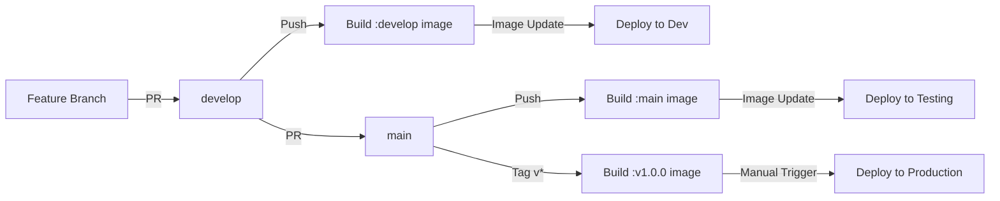
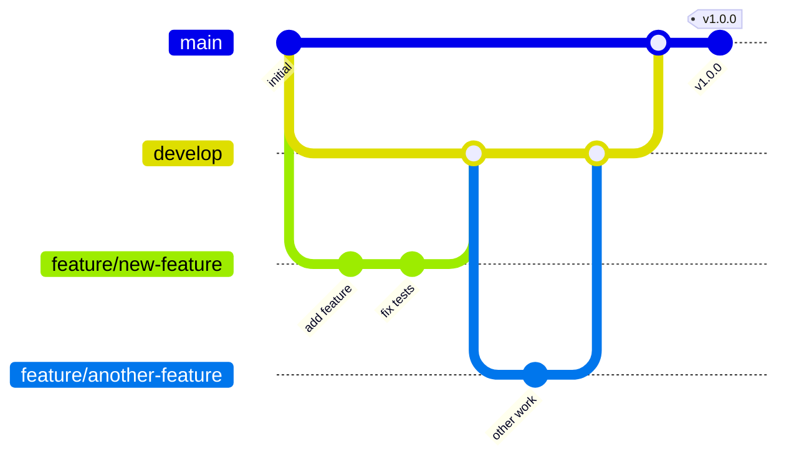
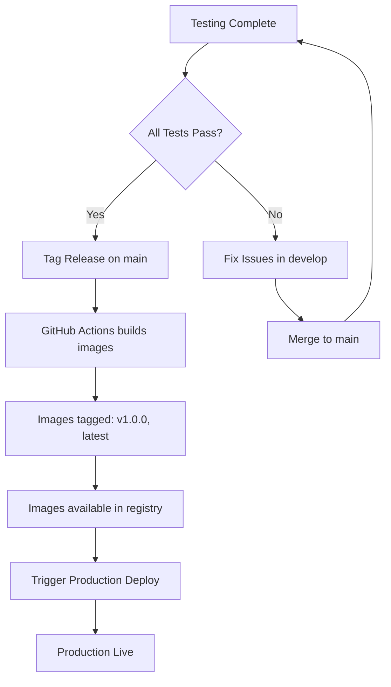
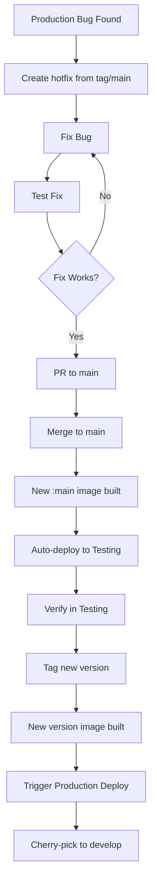

# Contributing to This Project

Welcome! This document describes our Git workflow and deployment process. Please read it carefully before contributing.

## Table of Contents
- [Overview](#overview)
- [Environments](#environments)
- [Branch Strategy](#branch-strategy)
- [Development Workflow](#development-workflow)
- [Release Process](#release-process)
- [Hotfix Process](#hotfix-process)
- [Docker Images](#docker-images)
- [FAQ](#faq)

## Overview

We use a Git Flow-inspired workflow with automatic image builds and tag-based deployments. Our deployment systems (e.g., ArgoCD) watch for new image tags and deploy them automatically.



## Environments

We maintain three environments:

| Environment | Purpose | Branch/Tag | Image Tag | Deployment Method |
|------------|---------|------------|-----------|-------------------|
| **Development** | Latest features, may be unstable | `develop` | `:develop` | Auto (on image update) |
| **Testing** | Pre-production testing | `main` | `:main` | Auto (on image update) |
| **Production** | Live system | `v*` tags | `:v1.0.0` | Manual trigger |

## Branch Strategy

### Protected Branches

#### `develop`
- Integration branch for new features
- Always deployable to dev environment
- Protected: requires PR with approval

#### `main`
- Release candidate branch
- Always deployable to testing environment
- Protected: requires PR with approval
- Should only contain tested code from develop

### Supporting Branches

#### `feature/*`
- Created from: `develop`
- Merged into: `develop`
- Naming: `feature/descriptive-name`
- Example: `feature/add-user-authentication`

#### `hotfix/*`
- Created from: `main` or production tag
- Merged into: `main` (then cherry-picked to `develop`)
- Naming: `hotfix/issue-description`
- Example: `hotfix/fix-payment-processing`

## Development Workflow

### Visual Flow



### Step-by-Step Guide

#### 1. Start a New Feature

```bash
# Always start from latest develop
git checkout develop
git pull origin develop

# Create your feature branch
git checkout -b feature/your-feature-name

# Make your changes
git add .
git commit -m "feat: add new feature"

# Push to GitHub
git push origin feature/your-feature-name
```

#### 2. Create Pull Request

1. Go to GitHub and create a PR from your feature branch to `develop`
2. Fill in the PR template
3. Request review from team members
4. Address any feedback

#### 3. After PR Approval

Once merged to develop:
- ✅ GitHub Actions automatically builds Docker images tagged `:develop`
- ✅ Images are automatically deployed to internal dev environment

#### 4. Promote to Testing

When features in develop are ready for testing:

```bash
# Team lead/maintainer creates PR from develop to main
git checkout main
git pull origin main
git merge develop
git push origin main
```

After merge to main:
- ✅ GitHub Actions automatically builds Docker images tagged `:main`
- ✅ Images are automatically deployed to internal testing environment
- ✅ QA team can test

## Release Process

### Creating a Production Release



#### Steps to Release

```bash
# 1. Ensure you're on main with latest changes
git checkout main
git pull origin main

# 2. Create a version tag
git tag -a v1.0.0 -m "Release version 1.0.0

Features:
- User authentication
- Payment processing
- Email notifications

Bug fixes:
- Fixed memory leak in worker
- Resolved timezone issues"

# 3. Push the tag
git push origin v1.0.0

# 4. GitHub Actions will build production images
# Backend: ghcr.io/eneo-ai/eneo-backend:v1.0.0
# Frontend: ghcr.io/eneo-ai/eneo-frontend:v1.0.0

# 5. Deploy to production (manual process)
# Use your deployment scripts/tools
```

### Semantic Versioning

We use semantic versioning: `MAJOR.MINOR.PATCH`

- **MAJOR** (1.0.0 → 2.0.0): Breaking changes
- **MINOR** (1.0.0 → 1.1.0): New features (backwards compatible)
- **PATCH** (1.0.0 → 1.0.1): Bug fixes

Examples:
- `v1.0.0` - First stable release
- `v1.1.0` - Added new feature
- `v1.1.1` - Fixed bug in v1.1.0
- `v2.0.0` - Breaking API changes

## Hotfix Process

For critical production bugs that can't wait for the normal release cycle:



### Hotfix Example

```bash
# 1. Create hotfix from current production version
git checkout tags/v1.0.0  # or from main if it hasn't moved ahead
git checkout -b hotfix/fix-critical-bug

# 2. Make your fix
# ... edit files ...
git add .
git commit -m "fix: resolve critical payment processing error"

# 3. Push and create PR to main
git push origin hotfix/fix-critical-bug
# Create PR on GitHub: hotfix/fix-critical-bug → main

# 4. After PR merge, main auto-deploys to testing

# 5. Once verified in testing, tag the release
git checkout main
git pull origin main
git tag -a v1.0.1 -m "Hotfix: Payment processing error"
git push origin v1.0.1

# 6. Deploy v1.0.1 to production

# 7. Ensure fix is in develop
git checkout develop
git pull origin develop
git cherry-pick <commit-hash>  # or merge main if no conflicts
git push origin develop
```

### Hotfix for Old Versions

If you need to patch an old version (e.g., v1.0.0) while v2.0.0 is in production:

```bash
# 1. Create hotfix from the old tag
git checkout tags/v1.0.0
git checkout -b hotfix/v1.0.1-security-fix

# 2. Make fix and commit
git commit -am "fix: security vulnerability"

# 3. Tag directly on hotfix branch
git tag -a v1.0.1 -m "Security patch for v1.0.0"

# 4. Push branch and tag
git push origin hotfix/v1.0.1-security-fix
git push origin v1.0.1

# 5. GitHub Actions builds v1.0.1
# 6. Deploy v1.0.1 where needed
# 7. Cherry-pick fix to develop and main
```

## Docker Images

### Image Tagging Strategy

| Source | Docker Tags | Purpose |
|--------|------------|---------|
| `develop` branch | `:develop`, `:develop-{sha}` | Development testing |
| `main` branch | `:main`, `:main-{sha}` | Pre-production testing |
| `v*` tags | `:v1.0.0`, `:latest` | Production releases |

### Image Locations

```bash
# Backend Images
ghcr.io/eneo-ai/eneo-backend:develop  # Latest from develop
ghcr.io/eneo-ai/eneo-backend:main     # Latest from main
ghcr.io/eneo-ai/eneo-backend:v1.0.0   # Specific release
ghcr.io/eneo-ai/eneo-backend:latest   # Latest release

# Frontend Images
ghcr.io/eneo-ai/eneo-frontend:develop # Latest from develop
ghcr.io/eneo-ai/eneo-frontend:main    # Latest from main
ghcr.io/eneo-ai/eneo-frontend:v1.0.0  # Specific release
ghcr.io/eneo-ai/eneo-frontend:latest  # Latest release
```

## FAQ

### Q: When should I create a feature branch?
**A:** For any change that adds functionality, fixes a bug, or modifies behavior. Even small changes should go through a PR for code review.

### Q: Can I push directly to develop or main?
**A:** No. Both branches are protected and require pull requests with approvals.

### Q: How do I know what version to tag?
**A:** Check the latest tag with `git tag --list 'v*' --sort=-v:refname | head -1`. Then:
- Breaking changes → increment MAJOR
- New features → increment MINOR
- Bug fixes → increment PATCH

### Q: What if I need to test something quickly?
**A:** Create a feature branch and PR to develop. Once merged, it auto-deploys to dev environment.

### Q: Can I delete old feature branches?
**A:** Yes! Delete them after merging to keep the repo clean:
```bash
git push origin --delete feature/old-feature
git branch -d feature/old-feature
```

### Q: How do I rollback production?
**A:** Deploy the previous version tag:
```bash
# Check available versions
git tag --list 'v*' --sort=-v:refname

# Deploy previous version (e.g., v1.0.0 if v1.0.1 has issues)
# Use your deployment tool with v1.0.0 images
```

### Q: What's the difference between testing and staging?
**A:** In our workflow, "testing" IS our staging environment - it's the last stop before production.

## Quick Command Reference

```bash
# Start new feature
git checkout develop && git pull
git checkout -b feature/my-feature

# Update feature branch with latest develop
git checkout feature/my-feature
git merge develop

# Create release
git checkout main && git pull
git tag -a v1.0.0 -m "Release v1.0.0"
git push origin v1.0.0

# Emergency hotfix
git checkout main && git pull
git checkout -b hotfix/critical-fix
# ... fix ...
git push origin hotfix/critical-fix
# Create PR, merge, tag, deploy

# Check what's deployed where
docker images | grep eneo
```

---
