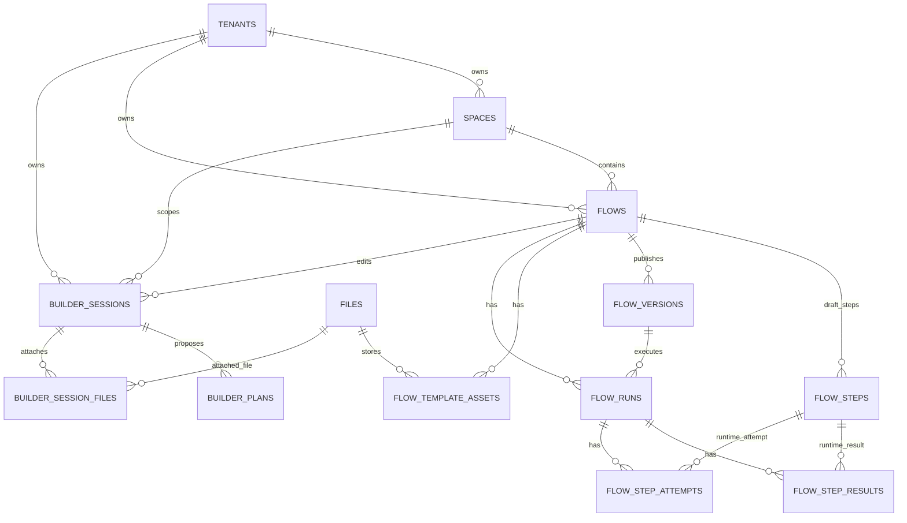

# Eneo Flows and Flow AI Builder Architecture

Last reviewed: 2026-05-02

This document gives a review-ready map of the current Flows and Flow AI Builder implementation. It is intentionally descriptive: it explains how the system is built now, where data lives, how execution moves through the codebase, and which areas are the most important review targets.

## Scope

Covered:

- Flow authoring, publishing, runtime execution, uploads, evidence, document output, and frontend editing.
- Flow AI Builder session lifecycle, planning state, plan approval/apply/revise, and frontend builder UI.
- Database tables, JSONB contracts, tenant settings, and schema migration pressure points.

Not covered in depth:

- Legacy `workflow_*` tables except as historical context.
- Non-flow assistant, app, crawler, audit, and model-provider internals except where Flows depend on them.
- Detailed line-by-line review of every UI component.

## Executive Summary

Flows are built as a versioned workflow system with a conventional backend split:

```text
API routers -> application services -> repositories -> SQLAlchemy tables
                                      -> runtime/Celery execution
```

Flow AI Builder is a separate subsystem layered on top of Flows. It stores chat/planning sessions, produces a portable `FlowDraftSpecCore`, persists plans, and materializes an approved plan into normal Flow records and flow-managed assistants.

The architecture is not fundamentally weak. The main problem is concentration of responsibility in a few large modules and JSONB-heavy contracts that require strict discipline. The highest-risk maintenance areas are:

- `backend/src/intric/flows/ai_builder/ai_builder_proposal_processor.py`
- `backend/src/intric/flows/ai_builder/ai_builder_planner.py`
- `backend/src/intric/flows/ai_builder/ai_builder_repo.py`
- `backend/src/intric/flows/ai_builder/ai_builder_router.py`
- `backend/src/intric/flows/runtime/executor.py`
- `backend/src/intric/flows/application/flow_run_service.py`
- `backend/src/intric/flows/api/flow_models.py`
- `frontend/apps/web/src/lib/features/flows/ai-builder/FlowAIBuilderDriver.ts`
- `frontend/apps/web/src/lib/features/flows/ai-builder/FlowAIBuilderService.svelte.ts`
- `frontend/apps/web/src/lib/features/flows/components/FlowRunDialog.svelte`
- `frontend/apps/web/src/lib/features/flows/components/FlowRunsTable.svelte`

## High-Level Flow Architecture

### Backend Layers

Core backend layers:

- Domain models: `backend/src/intric/flows/domain/flow.py`
- API routers and API models: `backend/src/intric/flows/api/`
- Application services: `backend/src/intric/flows/application/`
- Infrastructure repositories: `backend/src/intric/flows/infrastructure/`
- Runtime execution: `backend/src/intric/flows/runtime/`
- SQLAlchemy tables: `backend/src/intric/database/tables/flow_tables.py`

Compatibility shims still exist under `backend/src/intric/flows/`, for example:

- `backend/src/intric/flows/flow.py`
- `backend/src/intric/flows/flow_repo.py`
- `backend/src/intric/flows/flow_run_service.py`
- `backend/src/intric/flows/flow_version_repo.py`

These shims keep older imports working while the newer package layout is used internally. This is useful for compatibility, but it also means reviewers should check both the canonical location and the shim before assuming an import boundary.

### API Router Composition

Top-level flow router:

- `backend/src/intric/flows/api/flow_router.py`

It includes:

- `flow_definition_router`: authoring, template assets, HTTP test routes.
- `flow_assistant_router`: flow-managed assistant routes.
- `flow_consumer_router`: file upload, run execution, run evidence, run steps.
- `ai_builder_router`: Flow AI Builder routes under `/ai-builder`.

The API boundary is mostly thin. Routers parse requests, enforce access/scoping, call services, and return API models. The heaviest API-side file is `backend/src/intric/flows/api/flow_models.py`, which centralizes many response/request schemas.

### Flow Authoring Path

The draft lifecycle is handled primarily by:

- `backend/src/intric/flows/application/flow_service.py`
- `backend/src/intric/flows/infrastructure/flow_repo.py`
- `backend/src/intric/flows/infrastructure/flow_version_repo.py`

Typical authoring path:

1. Frontend calls `POST /api/v1/flows/` or `PATCH /api/v1/flows/{id}/`.
2. Router maps request models into domain models.
3. `FlowService` validates form schema, variable aliases, assistant ownership, security classification, HTTP configs, template configs, and secret handling.
4. `FlowRepository` persists `flows` and `flow_steps`.
5. Publishing creates immutable `flow_versions.definition_json` snapshots and updates `flows.published_version`.

Important behavior:

- Published flows cannot be mutated directly; draft mutation requires unpublishing first.
- Runtime execution uses `flow_versions.definition_json`, not the mutable draft rows.
- Flow-managed assistants are hidden assistants owned by the flow and must remain scoped to that flow.

### Flow Runtime Path

Main runtime files:

- `backend/src/intric/flows/application/flow_run_service.py`
- `backend/src/intric/flows/application/flow_dispatch.py`
- `backend/src/intric/flows/execution_backend.py`
- `backend/src/intric/flows/runtime/celery_execution_backend.py`
- `backend/src/intric/flows/runtime/tasks.py`
- `backend/src/intric/flows/runtime/executor.py`

Runtime flow:

```text
POST /api/v1/flows/{id}/runs/
  -> FlowRunService.create_run
  -> FlowRunRepository.create
  -> preseed flow_step_results as pending
  -> dispatch_flow_run_after_commit
  -> Celery task flows.execute
  -> runtime/tasks.py reconstructs tenant + principal
  -> FlowRunExecutor.execute
  -> step results, attempts, files, evidence, final run output
```

Execution characteristics:

- Runs are version-pinned through `flow_runs.flow_version`.
- Step execution is sequential today.
- Step result claiming uses compare-and-set style protections.
- Runtime reconstructs either a user principal or a service-key principal.
- Step attempts capture model/provider/token/provenance metadata separately from final step results.
- Runtime outputs can produce text, JSON, PDF, DOCX, template-fill DOCX, webhooks, transcription results, and generated file artifacts.

### Runtime Subsystems

The runtime executor delegates to smaller modules:

- Step parsing: `runtime/step_definition_parser.py`
- Execution state: `runtime/execution_state_builder.py`
- Step input resolution: `runtime/step_input_resolution.py`
- Step validation: `runtime/step_input_validation.py`
- LLM execution helpers: `runtime/step_execution_runtime.py`
- Output processing: `runtime/output_runtime.py`
- Document rendering: `runtime/document_rendering/`
- Template fill: `runtime/template_fill_runtime.py`, `runtime/docx_template_runtime.py`
- Transcription: `runtime/transcription.py`, `runtime/transcription_runtime.py`
- HTTP input/output: `runtime/http_runtime.py`, `runtime/http_orchestration.py`
- RAG retrieval: `runtime/rag_retrieval.py`
- Evidence/provenance: `flow_run_evidence.py`, `flow_run_export_json.py`, `flow_run_provenance.py`

This is a good direction. The architectural issue is that `FlowRunExecutor` still coordinates many of these concerns directly, making it a large orchestration root.

## Flow Frontend Architecture

Main frontend areas:

- Flow list: `frontend/apps/web/src/routes/(app)/spaces/[spaceId]/flows/`
- Flow editor page: `frontend/apps/web/src/routes/(app)/spaces/[spaceId]/flows/[flowId]/`
- Flow editor state: `frontend/apps/web/src/lib/features/flows/FlowEditor.ts`
- Flow list state: `frontend/apps/web/src/lib/features/flows/FlowsManager.ts`
- Flow components: `frontend/apps/web/src/lib/features/flows/components/`
- Flow AI Builder UI: `frontend/apps/web/src/lib/features/flows/ai-builder/`
- SDK endpoint wrapper: `frontend/packages/intric-js/src/endpoints/flows.js`

Frontend state shape:

- `FlowsManager.ts` owns a small space-scoped flow list store.
- `FlowEditor.ts` wraps `createResourceEditor` and manages editable flow fields, active step, validation state, assistant saving, typed IO validation, template token replacement, and save status.
- The flow detail page composes many concerns: draft editing, validation, graph, runs, evidence, published state, template assets, and AI Builder edit host.
- Flow run UX is centered around `FlowRunDialog.svelte`, `FlowRunsTable.svelte`, progress/evidence components, and runtime input helpers.

Main frontend maintainability risk:

- The flow detail page and run components are broad composition roots.
- Flow AI Builder state is split between `FlowAIBuilderDriver.ts`, `FlowAIBuilderService.svelte.ts`, and `FlowAIBuilder.svelte`, which makes phase/visibility behavior easy to desynchronize.

## Flow AI Builder Architecture

Flow AI Builder is not a separate runtime. It is a planning/materialization layer that creates or edits normal Flows.

### Backend Layers

Core files:

- API: `backend/src/intric/flows/ai_builder/ai_builder_router.py`
- Service facade: `backend/src/intric/flows/ai_builder/ai_builder_service.py`
- Repository: `backend/src/intric/flows/ai_builder/ai_builder_repo.py`
- Domain/API/event models:
  - `ai_builder_domain_models.py`
  - `ai_builder_api_models.py`
  - `ai_builder_event_models.py`
  - `ai_builder_models.py` compatibility aggregator
- Planning state: `planning_state.py`
- Planner/orchestration:
  - `ai_builder_planner.py`
  - `ai_builder_orchestrator.py`
  - `ai_builder_orchestration_pipeline.py`
  - `ai_builder_planner_turn.py`
  - `ai_builder_dispatcher.py`
- Proposal/create/edit compilation:
  - `ai_builder_proposal_processor.py`
  - `ai_builder_create_compiler.py`
  - `ai_builder_create_outline.py`
  - `ai_builder_edit_compiler.py`
  - `ai_builder_edit_validator.py`
- Plan lifecycle/materialization:
  - `ai_builder_plan_lifecycle.py`
  - `ai_builder_plan_store.py`
  - `ai_builder_materializer.py`
  - `ai_builder_materialization_bridge.py`

### AI Builder Session Lifecycle

High-level session lifecycle:

```text
create or resume session
  -> collect user request + attachments
  -> planner turn emits structured planner action
  -> server validates/rejects/repairs planner output
  -> planning state snapshot is persisted
  -> draft plan is proposed
  -> user approves plan
  -> plan is applied
  -> normal Flow + assistants are created/updated
```

Session statuses:

- `chatting`
- `awaiting_approval`
- `applying`
- `applied`
- `cancelled`

Plan statuses:

- `proposed`
- `approved`
- `applied`
- `rejected`
- `superseded`

Target kinds:

- `create`
- `edit`

Concurrency controls:

- `builder_sessions.active_request_id`
- `builder_sessions.lock_token`
- `builder_sessions.locked_at`
- `builder_sessions.lock_expires_at`
- `builder_sessions.planning_state_version`
- planner output must echo `base_planning_state_version`

The current design tries to prevent stale planner output from overwriting a newer session state.

### Planning State

`backend/src/intric/flows/ai_builder/planning_state.py` is the typed source of truth for what the planner has learned and committed.

Persisted fields include:

- `fcm_version`
- `planner_contract_version`
- `builder_schema_version`
- `phase`
- `evidence`
- `signals`
- `resolved_slots`
- `architecture_commit`
- `open_questions`
- `draft_plan_id`
- `validation`

Important design rule:

- `planning_state_jsonb` should be loaded, validated as Pydantic, mutated in Python, revalidated, and saved as a full snapshot.
- Partial JSONB mutation is explicitly discouraged because it can drift away from the typed contract.

This is a strong maintainability decision, but it makes migrations and schema evolution important.

### Planner Contract

The planner/orchestrator requires structured output, not free-form chat only.

Planner output includes:

- `planning_state_delta`
- `planner_action`

Typical actions:

- Ask a structured follow-up question.
- Commit architecture.
- Confirm requirements.
- Propose a plan.
- Revise an existing plan.

The server validates:

- Output shape.
- Planning-state version.
- Whether questions are allowed/relevant.
- Whether architecture commits preserve existing commitments.
- Whether tuple chains are legal according to flow capabilities.

This is the right long-term direction. The risk is that the code that handles repair/retry/proposal processing has become concentrated in a few large files.

### Plan and Materialization

Canonical draft spec:

- `FlowDraftSpecCore`
- `StepSpec`
- `AssistantSpec`
- `FormFieldSpec`

Plan storage:

- `builder_plans.spec_json` is the authoritative spec.
- `builder_plans.envelope_json` stores metadata around the spec.
- Older duplication of the spec inside envelope JSON was removed by migration.

Materialization:

```text
FlowDraftSpecCore
  -> compile_changeset
  -> FlowChangeSet
  -> execute_changeset
  -> FlowService + AssistantService
  -> normal flows/flow_steps/assistants rows
```

This separation is a positive architecture point. The review target is whether all create/edit code paths consistently go through this shared flow rather than carrying duplicate mutation logic.

### AI Builder Frontend

Core files:

- `FlowAIBuilderDriver.ts`: state machine and transport owner.
- `FlowAIBuilderService.svelte.ts`: reactive facade over driver state.
- `FlowAIBuilder.svelte`: page shell and layout.
- `FlowAIBuilderChat.svelte`: conversation surface.
- `FlowAIBuilderInput.svelte`: composer, attachments, model choice, edit context.
- `FlowAIBuilderPlanPane.svelte`: review/approval/apply surface.
- `FlowAIBuilderQuestion.svelte`: structured question UI.
- `FlowAIBuilderStepCard.svelte`: step summary card.

The frontend receives SSE events from the backend and updates local state for:

- streaming assistant text
- structured questions
- draft plans
- token usage
- requirements summaries
- plan approval/apply/revise
- draft recovery

Main risk:

- `FlowAIBuilderDriver.ts` owns transport and mutable state.
- `FlowAIBuilderService.svelte.ts` derives UI state.
- `FlowAIBuilder.svelte` also contains lifecycle behavior such as auto-init and draft recovery.

This is workable, but reviewers should look for duplicated phase decisions or conditions spread across these three files.

## Data Model and Schema

All flow-specific SQLAlchemy tables live in:

- `backend/src/intric/database/tables/flow_tables.py`

Tenant flow settings live in:

- `backend/src/intric/database/tables/tenant_table.py`
- `backend/src/intric/tenants/tenant.py`
- `backend/src/intric/settings/setting_service.py`

### Core Flow Tables

#### `flows`

Purpose: mutable draft-level flow identity and metadata.

Important columns:

- `id`
- `name`
- `description`
- `tenant_id`
- `space_id`
- `created_by_user_id`
- `owner_user_id`
- `published_version`
- `metadata_json`
- `data_retention_days`
- `draft_revision`
- `deleted_at`
- `created_at`
- `updated_at`

Important constraints/indexes:

- Unique `(id, tenant_id)`.
- Active flow names are unique per space via partial unique index on `(space_id, name)` where `deleted_at IS NULL`.
- Indexed by `space_id`, `tenant_id`, and active/deleted state.

Notes:

- `metadata_json` carries flow-level extensible config such as form/runtime input metadata.
- `published_version` points conceptually to `flow_versions.version`.
- Soft delete is used instead of hard deletion.

#### `flow_steps`

Purpose: mutable draft step definitions for a flow.

Important columns:

- `id`
- `flow_id`
- `tenant_id`
- `assistant_id`
- `step_order`
- `user_description`
- `input_source`
- `input_type`
- `input_contract`
- `output_mode`
- `output_type`
- `output_contract`
- `input_bindings`
- `output_classification_override`
- `mcp_policy`
- `input_config`
- `output_config`
- `created_at`
- `updated_at`

Allowed values:

- `input_source`: `flow_input`, `previous_step`, `all_previous_steps`, `http_get`, `http_post`
- `input_type`: `text`, `json`, `image`, `audio`, `document`, `file`, `any`
- `output_mode`: `pass_through`, `http_post`, `transcribe_only`, `template_fill`
- `output_type`: `text`, `json`, `pdf`, `docx`
- `mcp_policy`: `inherit`, `restricted`

Important constraints/indexes:

- Unique `(flow_id, step_order)`.
- Unique `(flow_id, id)`.
- Unique `(id, tenant_id)`.
- Composite FK `(flow_id, tenant_id)` to `flows`.

Notes:

- This is the most important runtime configuration table.
- Several fields are JSONB and require application-level validation.
- The step table is not the runtime source of truth after publish; runtime uses a version snapshot.

#### `flow_step_dependencies`

Purpose: optional explicit dependency graph between steps.

Columns:

- `flow_id`
- `parent_step_id`
- `child_step_id`
- `tenant_id`

Important constraints:

- Primary key over flow/parent/child.
- No self-reference.
- Parent and child must belong to the same flow.
- Composite tenant-scoped FK to `flows`.

Notes:

- Current runtime remains mostly ordered/sequential, but this table indicates support for graph semantics.

#### `flow_versions`

Purpose: immutable published flow definitions.

Columns:

- `flow_id`
- `version`
- `tenant_id`
- `definition_checksum`
- `definition_json`
- `created_at`
- `updated_at`

Important constraints:

- Primary key effectively `(flow_id, version)`.
- Composite tenant FK to `flows`.
- Unique `(flow_id, version)`.

Notes:

- `definition_json` is the runtime snapshot.
- This table decouples published runs from mutable draft state.

#### `flow_template_assets`

Purpose: DOCX template assets associated with flows.

Columns:

- `id`
- `flow_id`
- `space_id`
- `tenant_id`
- `file_id`
- `name`
- `checksum`
- `mimetype`
- `placeholders`
- `created_by_user_id`
- `updated_by_user_id`
- `status`
- `deleted_at`
- `created_at`
- `updated_at`

Allowed statuses:

- `ready`
- `needs_action`
- `read_only`
- `unavailable`

Notes:

- Links to the generic `files` table.
- `placeholders` is JSONB and stores discovered template placeholders.
- Used by template-fill authoring/runtime.

### Flow Run Tables

#### `flow_runs`

Purpose: one execution instance of a published flow version.

Columns:

- `id`
- `flow_id`
- `flow_version`
- `principal_type`
- `principal_user_id`
- `principal_api_key_id`
- `user_id`
- `tenant_id`
- `trace_id`
- `idempotency_key`
- `request_fingerprint`
- `status`
- `cancelled_at`
- `started_at`
- `finished_at`
- `input_payload_json`
- `output_payload_json`
- `error_message`
- `job_id`
- `created_at`
- `updated_at`

Allowed statuses:

- `queued`
- `running`
- `completed`
- `failed`
- `cancelled`

Important constraints/indexes:

- Principal identity check: user runs require `principal_user_id`; service-key runs require `principal_api_key_id`.
- Composite FK `(flow_id, tenant_id)` to `flows`.
- Composite FK `(flow_id, flow_version)` to `flow_versions`.
- Unique idempotency indexes per principal type.
- `trace_id` is indexed.
- Active/running indexes support reconciliation.

Notes:

- `input_payload_json` stores submitted runtime inputs.
- `output_payload_json` stores terminal run output.
- `request_fingerprint` helps idempotency collision detection.

#### `flow_step_results`

Purpose: current/final result per step in a run.

Columns:

- `id`
- `flow_run_id`
- `flow_id`
- `tenant_id`
- `step_id`
- `step_order`
- `assistant_id`
- `input_payload_json`
- `effective_prompt`
- `output_payload_json`
- `model_parameters_json`
- `num_tokens_input`
- `num_tokens_output`
- `status`
- `error_message`
- `flow_step_execution_hash`
- `started_at`
- `finished_at`
- `created_at`
- `updated_at`

Allowed statuses:

- `pending`
- `running`
- `completed`
- `failed`
- `cancelled`

Notes:

- This table is what the UI polls for step progress/output.
- Step result rows are preseeded when the run is created.
- LLM tool-call evidence is not persisted on step results. Runtime tool metadata is transient until it is stored in attempt provenance.

#### `flow_step_attempts`

Purpose: attempt-level execution provenance.

Columns:

- `id`
- `flow_run_id`
- `flow_id`
- `tenant_id`
- `step_id`
- `step_order`
- `attempt_no`
- `celery_task_id`
- `status`
- `error_code`
- `error_message`
- `requested_model`
- `response_model`
- `provider`
- `finish_reason`
- `provider_response_id`
- `num_tokens_input`
- `num_tokens_output`
- `provenance_json`
- `started_at`
- `finished_at`
- `created_at`
- `updated_at`

Allowed statuses:

- `started`
- `retried`
- `failed`
- `completed`
- `cancelled`

Notes:

- This table is the best place to inspect retries, provider behavior, and debug provenance.
- `provenance_json` is evidence-rich but JSONB-heavy.

### Module Registry

#### `module_registry`

Purpose: register external/sidecar modules and compatibility status.

Columns include:

- `name`
- `module_id`
- `internal_url`
- `health_endpoint`
- `last_health_check_at`
- `last_health_status`
- `enabled`
- `module_version`
- `image_digest`
- `module_api_contract`
- `core_compat_min`
- `core_compat_max`
- `compat_status`
- `release_notes_url`
- `metadata_json`

Notes:

- This sits in `flow_tables.py`, but it is broader module infrastructure rather than core Flow definition/runtime data.

### Flow AI Builder Tables

#### `builder_sessions`

Purpose: top-level AI Builder chat/planning session.

Columns:

- `id`
- `tenant_id`
- `space_id`
- `flow_id`
- `target_kind`
- `status`
- `actor_user_id`
- `conversation`
- `active_request_id`
- `lock_token`
- `locked_at`
- `lock_expires_at`
- `latest_plan_id`
- `planning_state_jsonb`
- `planning_state_version`
- `planning_phase`
- `architecture_hash`
- `planning_state_updated_at`
- `created_at`
- `updated_at`

Allowed values:

- `target_kind`: `create`, `edit`
- `status`: `chatting`, `awaiting_approval`, `applying`, `applied`, `cancelled`

Important constraints:

- Unique `(id, tenant_id)`.
- Composite FK `(flow_id, tenant_id)` to `flows`.
- Composite FK `(latest_plan_id, id)` to `builder_plans(id, session_id)`.

Notes:

- `conversation` is JSONB and contains persisted `ConversationMessage` entries.
- `planning_state_jsonb` is a typed Pydantic snapshot.
- `planning_state_version` is a concurrency guard.
- `architecture_hash` lets the system detect/reuse committed architecture context.

Review target:

- `BuilderSession` domain model contains `requirements_version`, but the SQLAlchemy table does not appear to contain a matching column. This may be dead domain state, incomplete persistence, or legacy drift. Verify before changing behavior.

#### `builder_session_files`

Purpose: join table for AI Builder session attachments.

Columns:

- `session_id`
- `file_id`
- `tenant_id`

Important constraints:

- Primary key `(session_id, file_id)`.
- Composite FK `(session_id, tenant_id)` to `builder_sessions`.
- FK to generic `files`.

Notes:

- Tenant scoping was tightened by migration, which is important for attachment isolation.

#### `builder_plans`

Purpose: persisted draft plans proposed by AI Builder.

Columns:

- `id`
- `session_id`
- `tenant_id`
- `status`
- `spec_json`
- `spec_hash`
- `envelope_json`
- `edit_result_json`
- `created_at`
- `updated_at`

Allowed statuses:

- `proposed`
- `approved`
- `applied`
- `rejected`
- `superseded`

Important constraints:

- Unique `(id, tenant_id)`.
- Unique `(id, session_id)`.
- Composite FK `(session_id, tenant_id)` to `builder_sessions`.

Notes:

- `spec_json` is the canonical plan spec.
- `envelope_json` is metadata-only after the envelope-slimming migration.
- `edit_result_json` stores edit-specific analysis/results.

Review target:

- Keep `spec_json` as the single source of truth. Reintroducing duplicate spec storage inside `envelope_json` would recreate previous drift.

#### `builder_attachment_observations`

Purpose: tenant-scoped cache of structured planning evidence extracted from attachments.

Columns:

- `tenant_id`
- `content_sha256`
- `digest_version`
- `fcm_version`
- `pattern_registry_version`
- `observation_json`
- `deterministic_signals_json`
- `created_at`
- `last_accessed_at`

Primary key:

- `(tenant_id, content_sha256, digest_version, fcm_version, pattern_registry_version)`

Notes:

- Versioned natural key means a digest/manifest/pattern version bump invalidates prior observations.
- `last_accessed_at` supports per-tenant LRU cleanup.

### Tenant Flow Settings

Stored in:

- `tenants.flow_settings`

Validated by:

- `backend/src/intric/tenants/tenant.py`

Updated through:

- `backend/src/intric/settings/setting_service.py`
- `backend/src/intric/settings/settings_router.py`

Current sub-objects:

- `input_limits`
- `document_render_limits`
- `ai_builder`
- `evidence_policy`
- `retention_policy`

Representative admin endpoints:

- `GET/PATCH /api/v1/settings/flow-input-limits`
- `GET/PATCH /api/v1/settings/flow-document-render-limits`
- `GET/PATCH /api/v1/settings/ai-builder-budget`
- `GET/PATCH /api/v1/settings/flow-evidence-policy`
- `GET/PATCH /api/v1/settings/flow-retention-policy`

Notes:

- This is a practical single-tenant-friendly configuration bus.
- It avoids environment-only settings for values admins may need to change at runtime.
- It remains JSONB-heavy, so validation must stay centralized and strict.

## Data Relationships



## JSONB Contracts to Review Carefully

High-value JSONB fields:

- `flows.metadata_json`
- `flow_steps.input_contract`
- `flow_steps.output_contract`
- `flow_steps.input_bindings`
- `flow_steps.input_config`
- `flow_steps.output_config`
- `flow_versions.definition_json`
- `flow_template_assets.placeholders`
- `flow_runs.input_payload_json`
- `flow_runs.output_payload_json`
- `flow_step_results.input_payload_json`
- `flow_step_results.output_payload_json`
- `flow_step_results.model_parameters_json`
- `flow_step_attempts.provenance_json`
- `builder_sessions.conversation`
- `builder_sessions.planning_state_jsonb`
- `builder_plans.spec_json`
- `builder_plans.envelope_json`
- `builder_plans.edit_result_json`
- `builder_attachment_observations.observation_json`
- `builder_attachment_observations.deterministic_signals_json`
- `tenants.flow_settings`

Risk pattern:

- JSONB is flexible, but every JSONB contract must have a single canonical validator/normalizer.
- Migration order matters because old JSONB shapes can fail strict model parsing.
- Silent fallback around malformed JSONB should be avoided unless there is a clear repair path and telemetry.

## Test Coverage Shape

Backend Flow tests:

- Flow repo/service/router tests.
- Runtime executor tests.
- Output/document renderer tests.
- Input limits, document limits, evidence, retention tests.
- HTTP transport tests.
- Runtime cleanup/reconciliation integration tests.

Backend AI Builder tests:

- Import boundary tests.
- OpenAPI contract tests.
- Planner/orchestrator tests.
- Planning-state tests.
- Session API regression tests.
- Materializer and plan lifecycle tests.
- Golden-case tests.
- Attachment observation and migration tests.

Frontend Flow tests:

- Runtime input config.
- Run contract.
- Flow run progress.
- Evidence actions and presentation.
- Focus/reload behavior.
- Template fill config/errors.
- Flow step presentation/types/transition policy.

Frontend AI Builder tests:

- Driver tests.
- Shell/component tests.
- Plan diff/token usage/reset tests.
- Structured question tests.
- Step card tests.

Main test gap:

- There is not enough true end-to-end browser/runtime coverage from AI Builder create/edit through applying a plan and then running the resulting flow.
- Flow runtime has many unit tests, but a full run creation -> Celery execution -> final output/evidence retrieval integration path remains the most valuable missing confidence layer.

## Known Problem Areas and Review Targets

### 1. Large Backend Orchestration Roots

Files:

- `ai_builder_proposal_processor.py`
- `ai_builder_planner.py`
- `ai_builder_repo.py`
- `ai_builder_router.py`
- `runtime/executor.py`
- `application/flow_run_service.py`

Why it matters:

- They coordinate many business concerns.
- They are harder to review.
- Small changes can have wide behavioral impact.
- They often become places where repair/fallback logic accumulates.

Review questions:

- Can lifecycle phases be split without introducing new indirection?
- Can persistence/concurrency helpers be separated from domain hydration?
- Can runtime execution phases become explicit units with focused tests?

### 2. Frontend State Split in AI Builder

Files:

- `FlowAIBuilderDriver.ts`
- `FlowAIBuilderService.svelte.ts`
- `FlowAIBuilder.svelte`

Why it matters:

- Driver owns transport and mutable state.
- Service derives reactive UI state.
- Shell owns initialization/draft recovery behavior.
- Phase/visibility conditions can drift across these files.

Review questions:

- Is there one canonical source for builder phase?
- Are approve/apply/revise guards duplicated?
- Can lifecycle actions be grouped into a smaller controller boundary?

### 3. JSONB Drift

Fields:

- `builder_sessions.conversation`
- `builder_sessions.planning_state_jsonb`
- `builder_plans.spec_json`
- `builder_plans.envelope_json`
- `tenants.flow_settings`
- `flow_versions.definition_json`

Why it matters:

- Strict Pydantic parsing is good, but old rows must be migrated correctly.
- Compatibility shims must not hide corrupt state.
- Duplicate sources of truth can reappear if plan envelope/spec discipline is loosened.

Review questions:

- Is every JSONB field validated at the boundary where it is loaded?
- Are JSONB migrations idempotent and covered by migration tests?
- Is malformed historical data repaired or failed loudly with actionable errors?

### 4. Compatibility Shims and Legacy Naming

Files:

- `backend/src/intric/flows/flow.py`
- `backend/src/intric/flows/flow_repo.py`
- `backend/src/intric/flows/flow_run_service.py`
- `backend/src/intric/flows/ai_builder/ai_builder_models.py`

Why it matters:

- They help avoid breaking imports.
- They also make it less obvious which module is canonical.

Review questions:

- Are shims documented as shims?
- Are new imports using canonical paths?
- Is there a future cleanup path, or are shims permanent public API?

### 5. Runtime Output and Document Rendering

Files:

- `runtime/output_runtime.py`
- `runtime/document_rendering/`
- `runtime/template_fill_runtime.py`
- `runtime/docx_template_runtime.py`

Why it matters:

- Generated PDF/DOCX behavior is user-visible.
- Template-fill and generated-document paths are related but distinct.
- Accessibility and formatting quality depend on preserving semantic structure, not just plain text.

Review questions:

- Does `output_contract` validation render the same normalized content it validates?
- Are PDF and DOCX using the same intermediate document model where practical?
- Are renderer limits enforced before expensive work?

### 6. Enterprise Configuration Boundary

Files:

- `tenants.flow_settings`
- `flow_input_limits.py`
- `flow_document_limits.py`
- `flow_retention_policy.py`
- `flow_evidence_policy.py`
- `ai_builder_settings.py`
- `setting_service.py`

Why it matters:

- Municipal deployments should not require backend restarts for operational limits.
- Env defaults are still useful as safe baselines, but admin-visible runtime config is better for tenant operations.

Review questions:

- Which values are operational tenant settings vs hard safety ceilings?
- Are admin APIs available for runtime-tunable values?
- Are audit logs emitted for every sensitive configuration change?

## Highest-ROI Improvements to Consider

1. Split AI Builder proposal/planner hotspots by lifecycle phase: discovery, architecture commit, plan proposal, edit revision, repair.
2. Collapse or clarify frontend AI Builder state ownership so phase/action guards live in one place.
3. Add one browser-level AI Builder E2E path: create -> answer question -> review plan -> apply -> open resulting flow.
4. Add one backend runtime E2E path: create published flow -> create run -> execute worker path -> retrieve step results/evidence/artifact.
5. Break `FlowRunExecutor.execute` into named phases with targeted tests.
6. Split `flow_models.py` into authoring, runtime, evidence, template, and AI Builder response models if API schema churn continues.
7. Add a schema crosswalk test for AI Builder domain model fields vs persisted session/plan columns where applicable.
8. Keep `builder_plans.spec_json` as the only authoritative spec and test that envelope JSON remains metadata-only.
9. Add JSONB round-trip tests for `tenant.flow_settings` sub-objects whenever new settings are introduced.
10. Promote a small curated AI Builder golden suite to CI-gating once nondeterministic model behavior is isolated behind stable fixtures.

## Architecture Ratings Snapshot

These ratings are directional and meant to guide review priority. `10` means strong/low-risk.

| Area | Maintainability | Testability | Code Quality | Low Slop / Low Dead Code | Architecture | Low Future Debt |
| --- | ---: | ---: | ---: | ---: | ---: | ---: |
| Flows core/runtime | 6 | 6.5 | 7 | 6 | 7 | 5 |
| Flow AI Builder | 5 | 7.5 | 6 | 5.5 | 6 | 4.5 |

Interpretation:

- Flows core has a clearer architecture, but runtime orchestration and frontend run UX are broad.
- AI Builder has substantial tests and stronger state contracts than before, but the implementation is dense and expensive to modify.
- Neither area looks like throwaway code. The debt is mostly concentration, JSONB evolution risk, and missing end-to-end verification.

## Suggested Review Prompt for Another Agent

Use this prompt if handing the review to another agent:

```text
Review Eneo Flows and Flow AI Builder using docs/FLOWS_AND_AI_BUILDER_ARCHITECTURE.md as the architecture brief.

Focus on:
1. Whether the described architecture matches the current code.
2. Whether the data model/schema section misses important tables, constraints, or JSONB contracts.
3. Whether the listed problem areas are real and correctly prioritized.
4. Whether there are higher-ROI maintainability fixes than the listed ones.
5. Whether any JSONB contracts, flow settings, planning state, or renderer/output paths create hidden future technical debt.
6. Whether Flow AI Builder has duplicated state or lifecycle rules between backend planner/orchestrator/materializer and frontend driver/service/shell.
7. Whether Flows runtime has enough integration coverage for run creation, worker execution, output artifacts, and evidence retrieval.

Do not propose cosmetic rewrites. Prefer small, behavior-preserving architecture improvements with clear regression tests.
```
