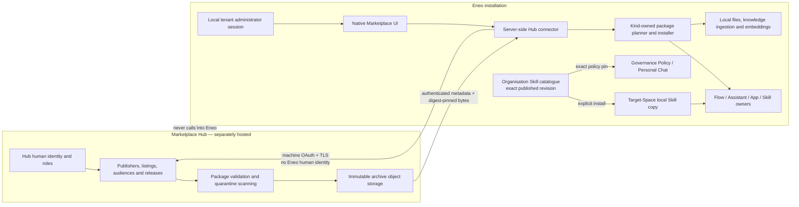
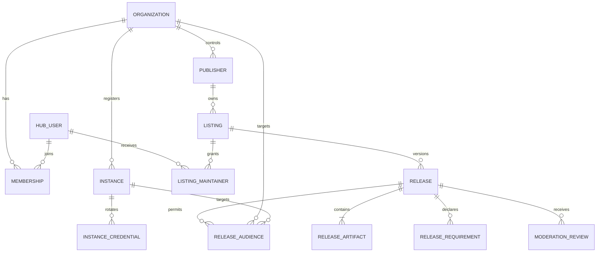

# Marketplace Hub, package portability, and Skills

- **Status:** Proposed
- **Date:** 2026-07-15
- **Decision owners:** Product, security, architecture, and operations
- **Scope:** Central Marketplace Hub, Eneo instance connector, portable package
  releases, source-knowledge assets, and first-class Eneo Skills

## TL;DR

We want municipal staff to open Eneo and find a shared library of solutions that
other municipalities have chosen to share. If Sundsvall builds a useful HR
Assistant or permit-handling Flow, another municipality should be able to reuse
that work without rebuilding it from the beginning.

The publisher gives each Flow, Skill, Assistant, or future App a clear
description, version, and audience. A receiving municipality can inspect the
complete contents inside Eneo, see which local choices or mappings it must make,
and install a new local copy after its tenant administrator approves the plan.
That copy belongs to the receiving municipality and keeps working during a
Marketplace outage.

Skills are the first building block. They let authors replace one large prompt
that mixes HR, IT support, management support, and document creation with named
instruction sets. Authors can reuse a Skill across suitable Assistants and
create new revisions without changing parents pinned to older content. An
Assistant can later travel with its exact Skills as one complete package.

Each Eneo installation also gets an **Organisation Skill catalogue**. It is not
the external Marketplace. A municipality publishes approved local Skill
revisions there; builders with Use Skills permission can install an approved
copy into a Space they may edit. Skill managers author revisions, while tenant
administrators decide what is published and what Personal Chat may use. Local
copies keep working when the catalogue is unpublished or unavailable, never
update silently, and may be customised without changing the approved source.

The central Hub manages approved contributors and instances, review, versions,
audiences, publication, downloads, and Hub audit. Each Eneo installation owns
browsing, preview, local mappings, tenant-admin confirmation, installation,
permissions, and the installed resource. The Hub cannot administer a
municipality's Eneo instance, and Eneo shares no human OIDC identity with the
Hub.

Municipal staff spend less time duplicating work. They can share solutions that
have worked elsewhere, understand Assistants as smaller named capabilities, and
choose when to adopt a new version. Delivery follows two safe tracks. The local
track finishes Skills, then adds revision restore, organisation publication and
install-by-copy; selective loading can proceed in parallel once its MCP
dependency is ready, and portable Skill/Assistant packages follow. The external
track may start the Hub baseline and a Flow-only pilot now because the Flow
package already exists. Skill and Assistant Marketplace listings remain disabled
until their local package contracts ship.

## Outcome

Eneo should provide two separately deployed products that share one package
contract:

1. a central Marketplace Hub operated by Sundsvalls kommun/Eneo; and
2. a native Marketplace client and server-side connector shipped with Eneo.

The Hub implementation lives in
[`eneo-ai/eneo-marketplace`](https://github.com/eneo-ai/eneo-marketplace). Local
Skills, portable package semantics, product-owned installation, and the native
Marketplace connector remain in `eneo-ai/eneo`.

The Hub publishes immutable releases of Flows, Assistants, Apps, and Skills.
Assistant, App, and Flow packages may contain exact snapshots of their underlying
Skills. A later Knowledge Bundle profile may publish source documents on its own
or embed an exact source snapshot in a parent package. Source bytes remain
disabled until product, security, scanning, ingestion, retention, and recovery
decisions are accepted.

An Eneo Skill is a reusable, versioned set of plain-text instructions. It belongs
to one Space. Any number of Assistants and Apps in that Space may bind an exact
Skill revision. The first local release composes every bound revision on every
invocation, in binding order. A later gated delivery may load selected Assistant
and personal-chat Skills on demand; Apps remain eager. A Skill is not executable
code, a tool, an Assistant, or a Group Chat.

An organisation catalogue uses that same Skill aggregate; it does not create a
second global Skill type. Organisation-Space Skills have one explicitly
published revision. Installing one creates or updates a normal Skill in the
chosen target Space through `eneo.skills`. Direct Assistant/App bindings remain
same-Space. Personal Chat remains the one intentional direct consumer of
published organisation revisions through Governance Policy.

The Hub and Eneo keep human identity completely separate. The Hub authenticates
a registered Eneo installation as a machine. A logged-in local tenant
administrator chooses and confirms installation. The Hub never receives an Eneo
human token, Eneo role, Eneo OIDC subject, local resource identifier, or
credential that can create resources inside Eneo.

This record is proposed architecture. It changes no implemented behavior until
the team accepts it and revises the existing launch decision identified below.

### Independent decision layers

This blueprint has five independently acceptable layers. Acceptance of one does
not authorize implementation of the next:

1. **Local Skills:** immutable Skill revisions, revision-pinned Assistant/App
   bindings, deterministic always-on composition, local permissions, and package-
   ready snapshots. This layer has no Hub dependency.
2. **Organisation Skill catalogue:** approval of exact organisation revisions,
   tenant-scoped discovery, and explicit install-by-copy into editable Spaces.
   It has no Hub dependency and never introduces live cross-Space parent
   bindings.
3. **Selective activation:** trusted on-demand loading for Assistant and
   organisation-configured personal-chat bindings after the internal MCP
   foundation. Apps remain eager.
4. **Package verticals:** strict Assistant, App, Skill, and later Knowledge Bundle
   profiles. Each owns its plan, apply, receipt, and failure behavior. The
   Assistant profile starts only after the selective-activation contract is
   implemented, so it preserves binding behavior rather than freezing an
   always-only shape. App knowledge and Flow Skill snapshots retain separate
   gates.
5. **Marketplace Hub:** one external catalogue and distribution service plus the
   native Eneo connector. Its baseline and Flow-only pilot can proceed without
   Skills because the existing Flow package is the first enabled kind. The Hub
   advertises later Skill/Assistant kinds only after their contracts pass the
   cross-repository gates.

The first end-to-end Marketplace slice is Flow-only because the Flow package
vertical already exists. The first local Skill slice has one deterministic
binding behavior: every pinned revision is composed in order. Selective
activation is a separate required delivery after the trusted internal MCP
foundation and before Assistant package portability. Source-bearing packages
remain a separate future decision.

## Problem and why it matters

The current `.eneopkg` work proves that a strict Flow definition can move between
instances. Municipalities need a larger unit of reuse: a complete Assistant or
App, its specialized instruction Skills, its declared knowledge, and eventually
complete Flows that use the same concepts. A file transfer alone does not provide
discovery, publisher governance, release history, moderation, audience control,
or trustworthy delivery.

Long single prompts also become hard to review and maintain. For example, an HR
Assistant may need a common role and tone plus specialized instructions for
salary, sick leave, employment law, and employee-review transcription. Keeping
those subjects as named Skills makes each instruction set easier to own, test,
reuse, and share. S1 composes all bound Skills. It does not claim the token or
latency benefits of selective loading.

The design must preserve municipal governance. Marketplace content can steer a
model and may contain documents. Installation therefore requires a visible local
review, strict package validation, bounded processing, local authorization, and
auditable failure behavior. Marketplace convenience must not become remote code
execution, identity federation, silent auto-update, or a second way to create
Eneo resources.

## Relationship to current decisions

A separate Flow launch-scope and lifecycle record has been prepared but is still
pending and unmerged. It is outside S1 and must not be imported implicitly by
this blueprint. Until that record is tracked and accepted, the implemented Flow
package contract and its tests remain authoritative:

- the current package launch supports Flow only;
- current packages exclude source knowledge documents;
- package artifact mechanics stay in `eneo.flow_packages` until a second real
  consumer earns extraction;
- Assistant, App, and Marketplace portability remain explicit later slices; and
- current transfer uses TLS plus exact digest verification, while detached
  signing remains deferred.

S1 has no dependency on the pending Flow record. Before S2 changes package
ownership or any Marketplace profile ships, decision owners must publish and
accept the Flow lifecycle record and reconcile it with this ADR. That revision
must select the central Hub topology, preserve immutable archive/receipt rules,
and name any later source-asset exception through the Knowledge Bundle gate.

## Current source map

The design extends the current owners instead of copying their behavior.

| Concept                             | Current evidence                                                                                                                                                                                                                                                              | Decision                                                                                                                                                                               |
| ----------------------------------- | ----------------------------------------------------------------------------------------------------------------------------------------------------------------------------------------------------------------------------------------------------------------------------- | -------------------------------------------------------------------------------------------------------------------------------------------------------------------------------------- |
| Assistant base instructions and run | `backend/src/eneo/assistants/assistant.py:347-481` resolves one prompt, retrieves Assistant knowledge, and calls the completion module.                                                                                                                                       | Reuse the Assistant authoring and run owner. Compose pinned Skills before retrieval/completion; do not create a second Assistant runtime.                                              |
| App base instructions and run       | `backend/src/eneo/apps/apps/app.py:134-138,275-325` resolves one prompt and calls the same completion module. Apps have no knowledge-retrieval owner.                                                                                                                         | Reuse the App owner for instruction-only Skills. Reject Skill knowledge in Apps until App knowledge has a real runtime owner.                                                          |
| Final context construction          | `backend/src/eneo/completion_models/infrastructure/context_builder.py:431-435,580-733` assembles system instructions, attachments, knowledge, messages, tools, and token accounting.                                                                                          | Keep this module authoritative for final context and token accounting. It consumes one resolved effective-instructions value from the Skill module.                                    |
| Personal-chat governance            | `backend/src/eneo/governance_policy/domain/policy_resolver.py` resolves the effective model and prompt; `frontend/apps/web/src/routes/(app)/admin/personal-assistant/configuration` owns administrator editing.                                                               | Extend these owners with exact organizational-Space Skill revisions. Do not bind Skills directly to the personal default Assistant or create another policy page.                      |
| Group Chat routing                  | `backend/src/eneo/group_chat/application/group_chat_service.py:233-341,435-560` selects and invokes a separate Assistant.                                                                                                                                                     | Retain Group Chat unchanged. Do not reuse it as a Skill router or create a generic model-router framework.                                                                             |
| Flow Assistant snapshots            | `backend/src/eneo/flows/assistant_authoring_snapshot.py:30-38` and `backend/src/eneo/flows/assistant_execution_snapshot.py:9-39` capture instructions, model, and knowledge only.                                                                                             | Flow use of Skills requires an explicit snapshot-schema revision and runtime slice. No implicit field addition.                                                                        |
| Package kinds                       | `backend/src/eneo/flow_packages/domain/flow_package_manifest.py:20-34` closes dispatch over Flow, Assistant, and App.                                                                                                                                                         | Add `skill` only when the standalone Skill package vertical is implemented. Keep dispatch closed and exhaustive.                                                                       |
| Current archive profile             | `backend/src/eneo/flow_packages/infrastructure/flow_package_zip_reader.py:38-45` accepts four bounded JSON entries.                                                                                                                                                           | Preserve the strict Flow profile. Asset support gets a new explicit profile/schema; it does not weaken v1 or merely raise constants.                                                   |
| Flow install owner and receipt      | `backend/src/eneo/flow_packages/application/flow_package_install_service.py:159-197` applies through `FlowAuthoringCommandService`; `backend/src/eneo/database/tables/flow_tables.py:623-680` stores a concrete Flow import record with target FKs and terminal-shape checks. | Reuse this pattern for the Flow-only Hub pilot. Each later kind gets its own command owner and concrete receipt rather than a generic Marketplace install table.                       |
| Local machine keys                  | `frontend/apps/docs-site/src/content/docs/api-key-management.mdx:45-67` states that Eneo service keys cannot create user-owned resources such as Assistants, Apps, Collections, Prompts, and Files.                                                                           | The Hub machine credential fetches bytes only. Local installation runs under the logged-in tenant administrator.                                                                       |
| Assistant/App editor state and save | `frontend/apps/web/src/lib/features/assistants/AssistantEditor.ts:12-51` and `frontend/apps/web/src/lib/features/apps/AppEditor.ts:11-38` own editable parent state from generated types; existing parent commands own persistence.                                           | Keep ordered binding drafts in these editors and persist them only through canonical parent update. Do not add parallel DTOs, component-owned save lifecycles, or binding write calls. |
| Existing catalogs                   | `backend/src/eneo/templates/assistant_template/api/assistant_template_router.py:17-80` and `backend/src/eneo/templates/app_template/api/app_template_router.py:17-84` expose tenant and global galleries.                                                                     | Tenant templates may remain local shortcuts. Gate 0 must choose whether global templates migrate to curated Hub releases and remove the duplicate cross-instance catalog path.         |

## Canonical ownership

| Responsibility                                                                                | Canonical owner                                                                    | Disposition                                                                                                                                                                                                                       |
| --------------------------------------------------------------------------------------------- | ---------------------------------------------------------------------------------- | --------------------------------------------------------------------------------------------------------------------------------------------------------------------------------------------------------------------------------- |
| Skill identity, revisions, binding validation/resolution, composition, and portable snapshots | New `eneo.skills` module                                                           | Create one deep module because Assistants and Apps are two real consumers.                                                                                                                                                        |
| Assistant/App ordered binding replacement                                                     | Existing Assistant/App update commands and routers                                 | Extend the canonical parent save with an optional full binding facet. It owns atomic parent-field/binding persistence and the one parent audit event; no dedicated binding write command.                                         |
| Base Assistant/App prompt history                                                             | Existing Prompt, Assistant, and App modules                                        | Reuse unchanged. A Skill revision is a different aggregate and does not turn `Prompts` into a generic metadata bucket.                                                                                                            |
| Effective system context and token accounting                                                 | Existing completion context module                                                 | Reuse and deepen only as needed to accept a typed effective-instructions result.                                                                                                                                                  |
| Organisation Skill publication and local distribution                                         | `eneo.skills`, the organisation Space, and existing Space Skill page               | Extend the one Skill aggregate with an exact published pointer and concrete install-to-Space command. No parallel Skill type, live cross-Space parent binding, or generic installer.                                              |
| Organizational Skills for personal chat                                                       | Existing Governance Policy and effective-config owners                             | Extend with exact ordered published revisions from the tenant organisational Space. Prompt enforcement remains compatible; no Hub human-identity coupling.                                                                        |
| Choosing a separate Assistant                                                                 | Existing Group Chat module                                                         | Retain. No merge with Skill activation.                                                                                                                                                                                           |
| ZIP safety, manifest coordinates, exact archive digest, and closed kind dispatch              | Current Flow package mechanics, later moved to `eneo.packages`                     | Move only kind-agnostic mechanics in the portability PR when Flow plus Assistant/Skill profiles are real consumers. Kind entry sets and profile validators stay in their verticals. Delete the old generic copies after the move. |
| Product payload, requirement topology, local planning, installation, and receipt              | `flow_packages`, future `assistant_packages`, `app_packages`, and `skill_packages` | Keep separate vertical modules. No generic installer.                                                                                                                                                                             |
| Publisher, listing, immutable release, audience, moderation, and object storage               | `eneo-ai/eneo-marketplace`                                                         | Create as a separately deployed Hub. It validates artifacts but never owns destination installation semantics.                                                                                                                    |
| Hub connection, verified download, and native Marketplace projection                          | `eneo-ai/eneo`                                                                     | Create a thin server-side adapter. It never creates product resources itself.                                                                                                                                                     |
| Files, Collections, ingestion, embeddings, and local retrieval                                | Existing Eneo file/knowledge owners                                                | Reuse. Packages carry source bytes or logical requirements, never derived vector state.                                                                                                                                           |

## Repository and contract ownership

The product uses exactly two source repositories:

| Repository                                                                | Owns                                                                                                                                                                                                                                                                 | Must not own                                                                                                                            |
| ------------------------------------------------------------------------- | -------------------------------------------------------------------------------------------------------------------------------------------------------------------------------------------------------------------------------------------------------------------- | --------------------------------------------------------------------------------------------------------------------------------------- |
| [`eneo-ai/eneo`](https://github.com/eneo-ai/eneo)                         | Local Skill behavior, package profiles and conformance fixtures, exports, kind-owned plans and installers, concrete receipts, the server-side Hub connector, and the native Marketplace interface.                                                                   | Hub users, Hub roles, listings, moderation, Hub artifact storage, or Hub deployment.                                                    |
| [`eneo-ai/eneo-marketplace`](https://github.com/eneo-ai/eneo-marketplace) | Hub human identity integration, organizations, memberships, registered instances, machine credentials, publishers, listings, immutable releases, audiences, moderation, object-storage coordination, the Hub HTTP contract, audit, deployment, backup, and recovery. | Eneo human identity, local Space authorization, product authoring, local package planning or installation, and local resource deletion. |

The Hub repository uses AGPL-3.0 for its source code. That repository license does
not license uploaded Marketplace content. Every published release carries its own
controlled content license and publisher attestation.

There is no third shared-contract repository. Contract direction is explicit:

1. `eneo-ai/eneo` owns the portable package contract. The Skills portability PR
   produces a release-ready, versioned contract bundle and digest from that
   source. `eneo.packages` contributes only kind-agnostic archive/manifest/digest
   mechanics; each vertical contributes its closed profile schema, limits, and
   conformance fixtures. The bundle contains no product planner, installer,
   receipt, ORM session, or Eneo runtime dependency.
2. S2 proves that bundle locally but does not create a registry or Hub-pinning
   pipeline before the Hub exists. The later Marketplace phase publishes from an
   exact tagged Eneo commit through an approved artifact channel, and
   `eneo-ai/eneo-marketplace` pins the version and digest. The Hub rejects packages
   outside its advertised profile set, never copies schemas, and never imports the
   complete Eneo backend.
3. `eneo-ai/eneo-marketplace` owns the versioned Hub discovery and HTTP contracts.
   `eneo-ai/eneo` pins the supported Hub contract and generates or validates the
   connector projection from that source.
4. Compatibility is the explicit tuple of Eneo release, Hub interface version,
   and package profile version. Hub discovery advertises the supported profile
   versions; Eneo blocks unsupported combinations before download or mutation.
5. Both repositories run the same versioned valid and invalid package fixtures.
   The Hub must pass ingest/catalog/download conformance, and Eneo must pass
   export/plan/install conformance, before a profile is advertised.

Git submodules, Git subtrees, copied schemas, an import of the full Eneo backend,
and a new generic package platform repository are forbidden. If the contract
bundle becomes shallow or starts exposing installation semantics, keep those
semantics in the kind-owned Eneo module instead of widening the bundle.

## Target architecture



The connection is outbound and pull-only. Installed resources remain fully local
and keep working when the Hub is unavailable.

## Eneo Skills

### S1 contract

S1 implements an instruction-only Skill with one runtime behavior. Each Skill
has:

- a stable UUID and Space ownership;
- a Space-unique slug;
- an active/inactive lifecycle state;
- a pointer to its current immutable revision; and
- revisions containing a display name, description, Markdown instructions,
  content digest, author, and timestamp.

The slug follows the Agent Skills name constraint: lowercase letters, digits,
single hyphens between segments, and at most 64 characters. Description length is
also an interoperability constraint and is limited to 1,024 characters. Eneo's
separate display name follows the existing prompt-library limit of 200 characters.

Instructions must contain non-empty Markdown text. S1 sets no arbitrary
character or line limit on instructions. It also accepts no scripts, assets,
references, knowledge bindings, MCP configuration, tool grants, credentials, or
executable entries. Those omissions are capability boundaries, not silently
ignored input.

### Agent Skills compatibility profile

Eneo implements the instruction-only core of the
[Agent Skills specification](https://agentskills.io/specification): Eneo's slug
maps to required `name`, description maps to required `description`, and the
Markdown instructions map to the `SKILL.md` body. The display name is an Eneo
authoring field. In S1, description remains human and portability metadata; it
should explain what the Skill does and when an author should bind it. The
selective-activation delivery reuses that same immutable description in its
bounded discovery catalog. Description alone never grants activation authority.

Eneo does not claim that its database row or `.eneopkg` snapshot is a complete
Agent Skills directory. S1 deliberately rejects optional `allowed-tools`,
scripts, references, assets, compatibility requirements, and arbitrary metadata.
S2 must document and test the exact mapping of the supported core fields. Raw
Skill-directory import/export needs a separate explicit adapter and must not
introduce a second canonical representation inside `.eneopkg`.

The [Agent Skills creation best practices](https://agentskills.io/skill-creation/best-practices)
recommend focused, moderate instructions and roughly 5,000 tokens or 500 lines
for the main file.
Eneo treats that as authoring guidance, not validation. S1 always composes the
full body and therefore makes no progressive-disclosure claim. The UI should
encourage coherent, concise Skills and show context-fit feedback; the effective
model window remains the enforceable capacity boundary.

### Identity, reuse, and revision semantics

One Skill identity may be reused by any number of Assistants and Apps in its
Space. Each parent binds an exact revision. Focused use by one parent and broad
reuse by several parents are the same model; there is no reusable/local subtype or
boolean.

`(space_id, slug)` is unique and provides deliberate duplicate prevention.
Authoring interfaces search and select existing Skills before offering creation.
Eneo performs no semantic, embedding-based, or automatic deduplication or merge.
Two authors may create different Skill identities with the same instruction text
when their ownership, lifecycle, or governance differs.

A revision digest identifies normalized display name, description, and
instructions. The digest is evidence, not identity, and is deliberately
non-unique. Saving content identical to the current revision is a no-op. Reverting
to content from any older revision creates the next monotonic revision, even when
that digest has appeared before. Existing parent bindings never advance
implicitly.

An inactive Skill cannot receive a new binding. Existing exact-revision bindings
continue to compose until an authorized editor removes or replaces them. This
keeps deactivation from silently changing running Assistants or Apps.

### Persistence and database invariants

The relational owner uses concrete tables:

- `skills`: stable identity, `space_id`, slug, active state, current revision,
  creator, and lifecycle timestamps;
- `skill_revisions`: immutable revision number, display name, description,
  instructions, content digest, author, and timestamp;
- `assistant_skill_bindings`: Assistant, Skill identity, exact Skill revision,
  shared `space_id`, and unique non-negative position;
- `app_skill_bindings`: the equivalent concrete App relation; and
- `governance_policy_skill_bindings`: Governance Policy, tenant, organizational
  Space, Skill identity, exact revision, and unique non-negative position.

Composite foreign keys prove that each direct parent and Skill share one Space
and that each revision belongs to the bound Skill. Governance bindings prove one
tenant in the database; the application owner additionally requires an
organizational Space. Parent deletion cascades its bindings. Skill deletion
returns conflict while any direct or governance binding remains. Revisions are
never updated or deleted in place.

The tables index reverse Skill-binding lookups for conflict checks. The content
digest has neither a uniqueness constraint nor a deduplication index. Before
moving an Assistant to another Space, the transfer owner rejects the move while
Skill bindings remain; it never copies, detaches, or rewrites them silently.

Lifecycle and binding writes are serialized at their canonical rows. A parent
binding replacement locks its Assistant or App before reading and replacing the
ordered set. Binding resolution holds the referenced Skills against concurrent
status or deletion changes until the transaction completes. Revision, status,
and deletion mutations return explicit created, changed, or deleted outcomes
from the locked persistence boundary; routers never infer audit events from a
stale pre-mutation snapshot. Concurrent identical requests therefore produce
one mutation and at most one corresponding lifecycle audit event.

App queue planning also holds every referenced Skill while it persists the
App-run execution snapshot. Skill deletion locks that same Skill and rejects
while a queued or running App run still retains its identity in
`skill_provenance`. A JSONB containment index keeps that retained-reference
check bounded as execution history grows. Completed and failed runs remain audit
evidence but no longer block deletion. This ordering guarantees that deletion
either wins before a queue snapshot can reference the Skill, or observes the
committed nonterminal run and fails without invalidating it.

### Local authorization, API, and parent-save boundary

S1 adds `Permission.SKILLS`, `Permission.SKILLS_MANAGEMENT`, and
`SpaceResourceType.SKILL` to the existing authorization model. The two tenant
capabilities intentionally separate approved reuse from free-form authoring:

- **Use Skills** (`skills`) permits reading existing Skills and attaching,
  reordering, or removing them on parents the user may already edit.
- **Manage Skills** (`skills_management`) additionally permits creating,
  revising, changing availability, and deleting Skills where the Space role
  allows that action.

Mutation requires both capabilities; Manage Skills never implies Use Skills.
Running an already configured Assistant, App, or Personal Chat requires neither,
because these are authoring permissions rather than runtime entitlements.
Predefined User roles receive Use Skills. AI Configurator and Owner receive
both. Migration grants Use Skills to existing Assistant/App/admin-capable roles
and Manage Skills to existing AI/admin-capable roles. It does not invent a
parallel role system.

The authorization rules are:

- list/read requires Skill read permission in the Skill's Space;
- create, revise, activate/deactivate, and delete require Use Skills, Manage
  Skills, and the corresponding Space action;
- saving bindings requires edit permission on the Assistant/App and read
  permission on every referenced Skill;
- Skill-library routes and Assistant/App binding GET routes require a human
  session;
- dedicated Assistant/App binding PUT/POST write routes do not ship;
- an Assistant/App update that includes the Skill facet requires a human session;
  the parent router rejects that facet for API-key requests, and `SkillService`
  repeats the rejection so another caller cannot bypass it;
- governance Skill configuration keeps its separate existing contract: it
  requires tenant-administrator permission and a human session for the Skill
  facet; and
- Marketplace permissions never replace local checks.

The canonical Assistant/App update owns ordered exact binding replacement in the
same transaction as ordinary parent fields. When the Skill facet is present, it
replaces the full ordered binding set; when omitted, existing bindings remain
unchanged. A binding-only save still uses the parent update command. Before
commit, that command runs canonical composed-context validation even when no
ordinary parent field changed. Same-Space violation, missing exact revision,
inactive new binding, binding-limit violation, context-fit failure, or any
ordinary parent validation failure rolls back the whole parent update.

The presentation boundary maps each wire reference into the domain-owned
`SkillBindingReference`. The named Skill and revision fields remain intact
through parent services, `SkillService`, and `SkillRepo`; positional UUID tuples
are not an internal binding contract.

Skill creation remains an ordinary visible Space-library action with its own
successful transaction. Creating a Skill from an editor does not attach it. If
the author later discards the editor or the parent save fails, the valid unbound
Skill remains in the Space library. The UI must explain this outcome and must not
label the Skill attached until the parent save succeeds. A slug collision fails
only the library action and creates no Skill.

The parent update emits one audit event. It folds body-free binding evidence—
Skill ID, revision ID/number, digest, and position—into that event and emits no
separate binding-update audit event. Skill creation and revision changes retain
their own library audit events.

### Deterministic composition and retained evidence

Every direct binding in S1 is always composed. The schema contains no
activation mode, enabled flag, selector configuration, or request classifier.
Composition sorts by binding position and appends a fixed, code-owned boundary
followed by the full text of each pinned revision. That boundary states that
Skills cannot override platform or tenant governance, grant permissions, change
model/tool access, or expand data access.

A parent with no bindings passes its base instructions through byte-for-byte.
Assistant and App runtimes call the same composition owner and pass one effective
instruction value to the existing completion context owner. Apps snapshot exact
bindings at queue time so a later authoring change cannot alter an already queued
run.

Question and App-run evidence retains a bounded ordered list containing only
Skill identity, revision identity, revision number, digest, and position. It
stores no instruction body. Runtime logs and telemetry likewise avoid prompt
content.

### Capacity and operational guardrails

The model's effective context window is the functional capacity limit. Binding
mutation and parent prompt, model, or persistent-attachment mutation must use the
same context accounting as runtime and reject a configuration that cannot fit.
Runtime repeats this check defensively. No path silently truncates Skill
instructions.

`SKILL_MAX_BINDINGS` is a configurable operational and abuse guardrail, with a
default of 100 and a minimum of 1. It is not a claim that 100 Skills fit every
model, and it is not a fixed package-interoperability limit. Operators may lower
or raise it; context-fit validation remains authoritative. Packages in S2
validate the destination's configured guardrail during planning.

The fixed limits are limited to stable schema/interoperability constraints:

| Field                      |                             Limit | Reason                                                    |
| -------------------------- | --------------------------------: | --------------------------------------------------------- |
| Slug                       |                     64 characters | Agent Skills name interoperability and stable coordinates |
| Description                |                  1,024 characters | Agent Skills metadata interoperability                    |
| Display name               |                    200 characters | Existing Eneo prompt-library convention                   |
| Instructions               |          No character or line cap | Capacity is measured against the effective model context  |
| Bindings per parent/policy | `SKILL_MAX_BINDINGS`, default 100 | Configurable abuse/operational guardrail                  |

### Organizational Skills for personal chat

Personal chat consumes tenant-wide Skills only through
`GovernancePolicySkillBindings`. A tenant administrator chooses exact revisions
from the tenant's organizational Space and orders them in the existing governance
configuration. This path gives an organization a reusable general capability
without coupling Marketplace or Hub human identity to Eneo human identity.

The personal default Assistant cannot receive direct Skill bindings. Authoring
rejects that state, and runtime fails closed if corrupt legacy or manual data
contains it. This keeps tenant-wide behavior under one governance owner.

Prompt enforcement and governance Skills are compatible. The personal-chat base
is the enforced administrator prompt when enforcement is enabled; otherwise it
is the stored base prompt. The Skill composer then adds its fixed boundary and
the ordered governance Skill revisions. A package cannot carry or alter this
policy.

### Organisation Skill catalogue

The Organisation Skill catalogue is the approved local library for one Eneo
tenant. It is not the external Marketplace and has no Marketplace URL,
credential, release, audience, or Hub identity. It reuses organisation-Space
Skills and the existing `/spaces/organization/skills` management route. A
dedicated tenant-scoped catalogue query exposes approved summaries and selected
full previews to Use Skills users without granting access to organisation drafts
or unrelated organisation-Space resources.

#### Publication lifecycle

Only organisation-Space Skills gain publication state. `skills` adds a nullable
`published_revision_number` pointer with the same deferrable composite
Skill/revision proof used by the current-revision pointer. The Skill domain owns
one typed publication-status derivation used by API assembly and UI:

- **Draft:** no revision has been published. It is visible only to Skill managers
  and tenant administrators and cannot be installed or selected for Personal
  Chat.
- **Published:** the exact published revision is available to the organisation
  catalogue and Personal Chat. Creating a newer revision does not change that
  approved content.
- **Unpublished:** an exact revision has previously been published but is no
  longer offered for new installs or policy selection. Existing local copies and
  existing exact policy pins continue to work.
- **Update pending:** a derived badge when the latest local revision differs from
  the published pointer, never a fourth persisted state.

Organisation drafts do not expose the ordinary active toggle. Publish sets the
pointer to the current revision and makes it active; unpublish makes the
published Skill inactive; republish explicitly selects the current revision and
makes it active. A previously published Skill is retained and unpublished
rather than hard-deleted. Only a never-published, unbound draft may be deleted.
Publication transitions and their exact revisions are recorded by the existing
audit owner; a second publication-history table would duplicate immutable
revision and audit evidence.

#### Local roles and catalogue actions

Use Skills users may browse published summaries, open a full approved preview,
and install that exact revision into a Space they may edit. Manage Skills users
who also have Use Skills may author and revise organisation drafts. Tenant
administrators alone publish, unpublish, republish, select Personal Chat Skills,
and delete eligible organisation drafts.

Organisation draft authoring is a tenant-capability exception scoped only to
Skill actions. It does not synthesize organisation-Space membership or an Editor
role. The existing Space actor must deny the same user every non-Skill
organisation resource, member list, and Space-management action. Published
catalogue reads use their dedicated projection rather than broad organisation
Space access.

The management page uses Eneo's installed shadcn-svelte components and
progressive disclosure: searchable list, Draft/Published/Unpublished and Update
pending badges, description and published-version preview, revision history,
restore, and permission-aware actions. The existing Personal Chat page keeps its
inline creation path until this management page ships, then replaces it with a
link to the canonical page and selects published revisions only.

#### Install, update, and local customisation

Assistants and Apps never bind live across Spaces. Installing an approved
organisation Skill calls a concrete `eneo.skills` command that creates or
updates a normal Skill in the selected target Space. Personal Chat remains the
one direct organisation-revision consumer because Governance Policy already owns
the tenant-wide integrity boundary.

The target Skill records the exact source organisation Skill/revision and
install actor/time. A partial unique constraint on
`(space_id, source_organization_skill_id)` creates one canonical local
installation per source and target Space. A deferrable composite foreign key
proves the source revision belongs to the source Skill and uses `ON DELETE NO
ACTION`: a published source cannot disappear while installations reference it,
while whole-tenant cascade deletion is verified separately. Because `skills`
does not duplicate `tenant_id`, the install service must prove the source
organisation Space and target Space belong to the same tenant; a real
cross-tenant attempt is a required integration test.

Installing the same source again is idempotent and returns the existing target
with explicit state:

- **Locally modified** when the target's current digest differs from the last
  installed source revision;
- **Update available** when the source's published revision differs from the
  last installed source revision; and
- **Up to date** only when neither condition applies.

Editing an installed Skill is ordinary local authoring and creates a new
immutable local revision. Applying an approved source update also creates the
next local revision and atomically advances the recorded source revision. A Use
Skills user may apply that approved content, but a locally modified target
requires a typed preview and explicit replacement confirmation. No path merges
text, overwrites history, advances existing Assistant/App pins, or updates
silently. A manager may instead fork the local content into a new independent
Skill.

Three version concepts remain separate:

1. a monotonic local Skill revision is immutable audit history;
2. the organisation published revision is the exact approved local revision; and
3. an external Marketplace SemVer belongs to an immutable Hub release.

“Restore this revision” always copies old content into the next local revision;
the current pointer never moves backwards, published state changes only through
publish, and existing parent pins remain unchanged. Marketplace installations
later retain kind-owned receipts and do not reuse the organisation-source
columns as a premature generic provenance model.

### Difference from Group Chat

| Question                    | Skill                                                                                | Group Chat                                                                                    |
| --------------------------- | ------------------------------------------------------------------------------------ | --------------------------------------------------------------------------------------------- |
| What changes for a request? | The same Assistant/App receives additional ordered instructions.                     | A different Assistant is selected.                                                            |
| Model and principal         | The parent keeps its model, identity, permissions, tools, and base behavior.         | Each Assistant may have its own model, knowledge, permissions, and lifecycle.                 |
| How many can apply?         | Every bound revision applies, subject to configuration and model context fit.        | Normally one Assistant answers, with optional explicit mention.                               |
| User-facing identity        | The same Assistant/App answers.                                                      | The selected Assistant may have a distinct identity.                                          |
| Use it when                 | One product needs separately owned instructions or a capability shared in one Space. | Expertise needs an independently managed Assistant, model, permissions, or response identity. |

A Skill cannot call another Assistant, become a hidden Group Chat participant, or
acquire independent tool permissions.

### Selective activation delivery gate

Request-selective activation is not part of S1 or its schema. Until the complete
runtime lands, APIs do not expose or persist activation state and the UI makes no
on-demand claim. [Development Task #553](https://github.com/eneo-ai/eneo/issues/553)
owns the end-to-end delivery after the internal MCP foundation in
[PR #538](https://github.com/eneo-ai/eneo/pull/538) has merged. It must complete
before S2 freezes the portable Assistant binding contract.

The delivery adds a closed `always | on_demand` mode to Assistant and Governance
Policy bindings, defaulting existing rows to `always`. Apps stay eager and gain
no mode. `SkillRevision.description` remains the single authoring and discovery
source; no parallel activation-hint field is introduced.

Before a provider call, Eneo resolves one immutable turn plan containing exact
available revisions, initially active revisions, body-bearing in-memory
bindings, and a bounded description-only catalog. Available references are
retained separately from the revisions that actually enter the system prompt.
Activation always resolves against that turn plan, never current mutable
bindings.

One parameterized internal Skills tool is registered through the internal MCP
owner. Its result becomes a narrow trusted prompt-activation effect at the
completion-loop boundary, not ordinary tool text and not a `SkillService`
dependency in a model adapter. Activation takes precedence over sibling tool
calls from the same round, replaces the system prompt with the exact pinned
revision, recalculates context fit, and is idempotent. Streaming and non-streaming
paths share those semantics. External MCP servers cannot forge the effect.

Tool-capable models initially receive always-active bodies plus the compact
catalog. Models without tool calling fall back to eager composition and record
that effective behavior. Success, abort, and failure paths retain body-free
available and active evidence. The same delivery adds generated contracts,
Swedish/English shadcn-svelte controls, capability-aware explanation, and
behavior tests. Manual one-turn mentions, conversation toggles, Group Chat
routing, and generic control-effect frameworks remain outside this gate.

## Deferred Skill knowledge and portable source documents

S1 and S2 are instruction-only for Skills. They accept neither local Skill
knowledge relations nor portable Skill knowledge fields, references, or source
bytes. APIs and package validators reject those fields instead of dropping them.

The remainder of this section records the boundary for a separate Knowledge
Bundle decision. It does not authorize implementation. That decision must first
revise the accepted Flow package scope and name the product, security, scanning,
ingestion, retention, and recovery owners.

### Later local Skill knowledge gate

A later proposal may let Assistant Skills reference knowledge resource kinds that
Assistants already understand. Before implementation, it must define:

- an authorization-preserving same-Space relation and exact revision semantics;
- one retrieval plan that avoids duplicate parent/Skill resource retrieval;
- context, provenance, retry, and failure behavior;
- package mapping rules and clean-install receipts; and
- the effect of inactive Skills and pinned historical revisions.

Apps remain instruction-only until App execution has a real knowledge-retrieval
owner. Flow-managed Assistant Skills remain unsupported until Flow receives a
typed authoring snapshot, execution snapshot, hash surface, publish-time capture,
runtime composition, provenance, and package round-trip contract. Current Flow
authoring, publish, export, and import must reject Skill-bearing managed
Assistants rather than dropping their Skills.

### What a package may carry

This subsection defines the deferred Knowledge Bundle/source-asset capability;
it does not authorize source bytes in the Flow-only pilot, S1, or S2.

An approved asset-bearing package may carry source documents and safe metadata:

- normalized package-local path;
- media type and original filename for display;
- compressed and uncompressed byte size;
- SHA-256 digest of exact source bytes;
- logical knowledge key and destination purpose;
- publisher-declared license and sharing classification; and
- the Assistant, Skill, or Flow-step requirement references that may use it.

It may never carry:

- extracted text as trusted truth;
- chunks, embeddings, vectors, indexes, retrieval caches, or ranking scores;
- embedding/vector-provider configuration;
- local Collection, Website, File, tenant, Space, user, or model identifiers;
- credentials, cookies, tokens, certificates, or private integration settings;
- executable files, archive-within-archive payloads, macros, plugins, or scripts;
  or
- source-instance authorization or trust claims.

The package planner offers two explicit outcomes for every logical knowledge
requirement:

- map it to an authorized existing local knowledge resource; or
- import approved source assets and ingest them under the destination's local
  file, embedding, classification, retention, and model policy.

An unresolved required reference blocks installation. Optional references remain
visible in the plan and receipt; they are never silently discarded.

### Asset safety profile

The current four-entry JSON-only Flow profile remains unchanged. The asset
profile requires its own accepted schema/profile and must provide:

- a bidirectional inventory check: every archive asset is declared exactly once,
  and every declared asset exists exactly once;
- normalized paths, duplicate/case-collision rejection, no traversal, symlink,
  device, directory, encrypted, nested-archive, or special entries;
- strict media-type allowlisting based on current Eneo ingestion support, with
  file-signature verification rather than filename trust;
- code-owned file-count, per-file, archive-byte, uncompressed-byte, and
  decompression-ratio caps selected during the Knowledge Bundle Gate 0 from
  supported media types and measured ingestion capacity;
- the existing decompression-ratio protection or a stricter asset-specific cap;
- quarantine before parsing or ingestion, malware scanning with bounded timeout,
  and a fail-closed unavailable-scanner policy;
- exact-byte digest verification before and after object-store transfer;
- sanitized Markdown/HTML display in both Hub and Eneo; and
- publisher attestation that the content is lawful to share and contains no
  credentials, secrets, or prohibited personal/sensitive data.

Audience restriction is authorization, not encryption. The first production Hub
should accept public material and explicitly approved inter-municipal material,
not secrets or special-category personal data. A broader classification contract
requires encryption, incident response, retention, and legal ownership beyond
this proposal.

### Local ingestion lifecycle

Source ingestion performs external storage and embedding work, so installation
cannot pretend to be one database transaction. The kind-specific import receipt
owns a durable state machine such as:

```text
planned
  -> confirmed
  -> archive_verified
  -> assets_staged
  -> knowledge_ingesting
  -> product_resources_creating
  -> completed

any non-terminal state
  -> failed
  -> cleanup_pending
  -> cleaned
```

Exact names belong to the implementation contract, but the semantics are fixed:

- confirmation binds the exact release, archive digest, target Space, mappings,
  and local administrator;
- staging and ingestion are idempotent and retry-safe;
- staged knowledge stays hidden from ordinary users;
- the final transaction creates Skill identities/revisions, concrete bindings,
  and the unpublished parent only after required knowledge is ready;
- failure leaves a typed, visible receipt and never claims installation success;
- cleanup uses the existing global file-reference fence and records
  `cleanup_pending` until every import-owned orphan is resolved; and
- a retry converges on the same outcome rather than creating duplicate visible
  resources.

### Knowledge Bundle profile

`knowledge_bundle` is a deferred package vertical for original source content,
not a new local knowledge database or a vector format. It owns the source-file
inventory, provenance/license/classification metadata, validation, local mapping
or Collection creation, durable ingestion, cleanup, and a concrete knowledge-
install receipt.

The same strict source snapshot may appear in two forms:

- a standalone Knowledge Bundle release, installed into a new or selected local
  Collection through its own planner; or
- an embedded, exact Knowledge Bundle component inside an Assistant, Skill, or
  later Flow package when the parent must work through offline file transfer.

An embedded component is covered by the parent content checksum and archive
digest. It is not a mutable or network-resolved dependency on a separate Hub
release. A Hub listing may recommend a standalone Knowledge Bundle for a logical
requirement, but the local administrator may instead map an existing authorized
resource. The first Hub schema has no generic release-dependency graph.

## Portable Skill contract

S2 defines one strict instruction-only Skill snapshot owned by `eneo.skills`.
Parent package profiles embed that snapshot rather than inventing their own Skill
shape. The logical contract is:

```json
{
  "skills": [
    {
      "key": "salary-questions",
      "slug": "salary-questions",
      "display_name": "Lönefrågor",
      "description": "Helps employees understand salary-related questions.",
      "instructions": "Explain the applicable process clearly ...",
      "content_digest": "<sha256>"
    }
  ],
  "skill_bindings": [
    {
      "skill_ref": "salary-questions",
      "position": 0,
      "activation_mode": "on_demand"
    }
  ]
}
```

The package-contract slice owns exact archive paths and generated type names. Its
invariants are:

- `key` and `skill_ref` are package-local; `slug` is a proposed destination
  coordinate; no local UUID appears;
- keys, slugs, references, Skill identities, and positions are unique in their
  respective scopes;
- Assistant bindings carry the closed `always | on_demand` mode implemented by
  Task #553. A future App profile remains eager and rejects `on_demand`;
- a parent profile references every embedded Skill exactly once; a standalone
  Skill profile has no parent-binding list;
- the strict parser rejects unknown fields, duplicate keys, dangling references,
  extra bindings, unknown activation modes, enabled state, selector
  configuration, knowledge, tools, scripts, assets, or credentials;
- slug, display-name, and description limits equal the local fixed constraints;
- instructions have no character or line cap, while the archive profile retains
  bounded entry/archive bytes and install planning validates model context fit;
- the digest is recomputed from normalized content and may repeat across different
  Skills; it never triggers automatic reuse or merge;
- the destination's configured `SKILL_MAX_BINDINGS` guardrail is checked during
  planning, not encoded as a universal package limit; and
- the package content checksum covers exact Skill content, digests, references,
  binding positions, activation modes, and the parent payload.

A parent release embeds each exact pinned Skill revision it needs. It has no
runtime or install-time dependency on a mutable standalone Skill listing.
Installation creates new local identities and revision 1. A destination slug
collision is a visible plan conflict that must be resolved explicitly; the
installer never merges by slug, digest, or text similarity.

Nested Skills inherit the parent release version. A separately published Skill
has its own release version. A parent package does not claim a dependency on that
standalone release, even when both originated from the same local Skill.

## Package kinds and installation behavior

The target closed set is Flow, Assistant, App, and Skill, with Knowledge Bundle
added only after its separate Gate 0. Adding `skill` or `knowledge_bundle` to
`EneoPackageKind` is authorized only in that kind's standalone package slice, with
wrong-kind tests and generated contract changes. Before the Skill slice, Skills
travel only as nested child definitions in a supported parent package. Before the
Knowledge Bundle slice, packages carry only logical knowledge requirements and
safe setup guidance.

Each package vertical owns:

- its strict portable authoring payload;
- authorization and export eligibility;
- requirement topology and asset associations;
- destination planning and conflict reporting;
- installation, transaction/state-machine, cleanup, and retry behavior; and
- a concrete FK-backed receipt for its created product resource.

The Skill package vertical creates one unbound, inactive local Skill in the
chosen Space. The local administrator then reviews and attaches it. The Assistant
and App verticals create nested Skills, their concrete bindings, and an
unpublished parent. Flow installation continues to create a draft and may include
Skills only after the Flow snapshot/runtime gate above.

### Vertical contract matrix

| Kind                        | Portable content                                                                                                                                                                          | Logical/local requirements                                                                                                               | Plan and apply owner                                                                                    | Receipt and external-work boundary                                                                                      |
| --------------------------- | ----------------------------------------------------------------------------------------------------------------------------------------------------------------------------------------- | ---------------------------------------------------------------------------------------------------------------------------------------- | ------------------------------------------------------------------------------------------------------- | ----------------------------------------------------------------------------------------------------------------------- |
| Flow                        | Existing strict Flow draft, requirements, provenance, and no new v1 entries.                                                                                                              | Models and knowledge map to authorized target-Space resources.                                                                           | Existing `flow_packages` planner and `FlowAuthoringCommandService`.                                     | Existing concrete Flow import record; one local draft transaction.                                                      |
| Assistant                   | Name, description, base instructions, bounded model parameters, exact nested Skill snapshots/bindings with activation mode, and later embedded source snapshots.                          | Logical completion model and authorized local knowledge/capability mappings; no local IDs or MCP credentials/configuration.              | Future `assistant_packages` planner ending in the canonical Assistant authoring/configuration owner.    | Concrete Assistant receipt. Instruction-only apply is transactional; source ingestion uses the durable operation above. |
| App                         | Name, description, instructions, typed input definition, bounded model parameters, transcription requirement, exact nested instruction-only Skills, and safe static assets when profiled. | Local completion/transcription model mapping. Skill knowledge is unsupported until Apps own retrieval.                                   | Future `app_packages` planner ending in the canonical App service.                                      | Concrete App receipt; instruction-only apply is transactional.                                                          |
| Skill                       | Slug, display name, description, Markdown instructions, digest, and later language/tags only through an accepted contract revision.                                                       | No activation state, tool/model grant, knowledge, scripts, assets, credentials, or local IDs. Standalone import chooses a target Space.  | `skill_packages` planner ending in `eneo.skills`.                                                       | Concrete Skill receipt; creates one inactive, unbound Skill and first revision.                                         |
| Knowledge Bundle (deferred) | Original allowlisted source files plus exact inventory, digest, provenance, license, classification, and use metadata.                                                                    | Target Collection/embedding choice and destination policy; never extracted text, chunks, embeddings, vectors, credentials, or local IDs. | `knowledge_packages` planner delegating file/Collection creation and ingestion to current local owners. | Concrete knowledge receipt plus durable staged ingestion/cleanup state; no claim of one cross-worker transaction.       |

Every kind defines its own public plan/apply types and updates OpenAPI/generated
clients when implemented. Exported publication state, local owner/tenant/Space
IDs, sessions, logs, insights, retention settings, template IDs, credentials,
provider configuration, and execution history are forbidden unless a later
kind-specific decision proves a portable meaning.

Marketplace source metadata—Hub identifier, release identifier, publisher,
release version, and exact archive digest—may be stored on the relevant concrete
receipt. The package still carries no destination-local ID. No generic
`package_installs(target_kind, target_uuid)` table or generic installer is
permitted.

Installation always creates new local resources in the first release. It never
updates, merges, overwrites, republishes, disables, or deletes an existing local
resource. Imported Skills become ordinary local resources that can later be
edited or reused. Editing them creates local revisions and does not mutate the
Marketplace release.

## Marketplace Hub

### Deployment and trust topology

The Hub is implemented in the public
[`eneo-ai/eneo-marketplace`](https://github.com/eneo-ai/eneo-marketplace)
repository and deployed as an application separate from Eneo. It has its own
database, object storage, secrets, human authentication, authorization, audit,
backup, and operations. The first production topology is one central Hub operated
by Sundsvalls kommun/Eneo. Federation between Hubs is a later product and trust
decision.

The Hub exposes a versioned discovery document at its configured root URL. It
identifies the Hub, OAuth issuer/token endpoint, Marketplace interface base,
supported package profiles, terms/policy version, and service status. Production
discovery and interfaces require HTTPS. Redirects to another origin are rejected.

During enrollment, the local administrator verifies the stable Hub identity and
OAuth issuer against the registration record issued by the Hub. Eneo then stores
those expected values with the configured origin and relies on its approved TLS
trust store. An arbitrary discovery response cannot change the enrolled Hub or
issuer.

### Human identity is separate

The Hub may use its own OIDC provider, local accounts, SCIM, or another identity
system. That choice belongs to Hub operations. It never creates a relationship to
an Eneo human identity:

- no shared OIDC client or session;
- no token exchange;
- no Eneo subject, email, user ID, role, or group mapping;
- no claim that a Hub publisher is the Eneo administrator who installs; and
- no Hub authorization decision based on an Eneo browser session.

The Hub audit attributes publishing actions to Hub users. Eneo audit attributes
installation to the local tenant administrator. These are intentionally separate
facts.

### Installation machine identity

A Hub organization administrator registers an Eneo instance and issues a machine
credential. The recommended production mechanisms are OAuth 2.0 client
credentials with `private_key_jwt` or mutual TLS, short-lived audience-bound
access tokens, narrow scopes, credential expiry, and rotation. These choices
follow [OAuth 2.0](https://www.rfc-editor.org/rfc/rfc6749.html), the
[OAuth security BCP](https://www.rfc-editor.org/rfc/rfc9700.html),
[JWT client authentication](https://www.rfc-editor.org/rfc/rfc7523.html), and
[OAuth mutual TLS](https://www.rfc-editor.org/rfc/rfc8705.html).

The credential identifies only the registered instance/organization. Its initial
scopes are:

- `catalog:read`;
- `release:download`; and
- optional later `release:submit`, attributed to the instance rather than an Eneo
  human and still requiring Hub human review before publication.

The machine principal has no Hub human role. It cannot approve, publish, yank,
manage Hub users, or edit a listing unless a later explicit machine-submission
contract grants the narrow submit action.

The credential stays in the local server's secret store or an external secret
manager. It is never returned to the browser, placed in the Eneo database as
plaintext, written to a package, or sent to logs. One active Hub connection per
Eneo tenant/installation is the first-release limit. If one deployment hosts
several Eneo tenants, each tenant registers separately and has a separate
credential and audience.

### Authentication matrix

| Actor                        | Authentication flow                                     | Authority                                                               | Audit identity                                          |
| ---------------------------- | ------------------------------------------------------- | ----------------------------------------------------------------------- | ------------------------------------------------------- |
| Hub human                    | Hub-owned OIDC or another Hub-owned login               | Organization/publisher/listing actions granted entirely by Hub roles    | Hub issuer/subject and Hub membership                   |
| Registered Eneo installation | OAuth client credentials with `private_key_jwt` or mTLS | `catalog:read`, `release:download`, and later optional `release:submit` | Hub instance and organization IDs; never an Eneo person |
| Embedded browser             | Local Eneo session only                                 | Local tenant-admin checks for connection, browse, plan, and install     | Local Eneo user in local audit only                     |
| First-release publisher      | Hub portal session                                      | Upload, review, and publish according to Hub role                       | Hub human identity                                      |

No request forwards a local Eneo role, email, user ID, or OIDC token as Hub
authority. A later publish-from-Eneo flow may submit bytes as the machine, but a
Hub human still reviews/publishes them; it does not introduce shared human
identity.

### Hub aggregate

The Hub relational model owns:

- organizations and Hub memberships;
- registered Eneo instances, machine scopes, credential metadata, status, and
  last successful authentication;
- publishers and the organizations allowed to act for them;
- listings with a stable publisher/kind/package coordinate;
- immutable releases and normalized Marketplace versions;
- audience rules for organizations, instance groups, or public authenticated
  instances;
- submission, review, moderation, publication, yanking, and revocation state;
- exact archive digest, byte size, object key, validation/scanning result, and
  authenticated release metadata;
- license, sharing classification, changelog, compatibility, and support/contact
  metadata; and
- append-only Hub audit events and bounded download telemetry.

Exact archive bytes live in object storage, not the relational database. Upload
uses quarantine storage first. Validation and scanning finish before a release
can enter review. Object bytes are committed and digest-verified before the
published release row becomes visible. Bounded cleanup removes unreferenced
quarantine objects.

The minimum relational shape is:



Required invariants and access paths are deliberately small:

- Hub users are unique by `(issuer, subject)`; memberships are unique by
  `(organization_id, user_id)`.
- Instance identity is stable and unique; only credential metadata/public keys
  are stored. Credential records have status, expiry, rotation lineage, and no
  plaintext private secret.
- Listings are unique by `(publisher_id, kind, package_id)`; releases are unique
  by `(listing_id, version)`. Published release semantic fields and artifact bytes
  are immutable.
- The first schema has exactly one primary `.eneopkg` artifact per release. Its
  digest is indexed for verification/deduplication but need not be globally unique
  because two authorized publishers may submit identical bytes.
- Audience rows use explicit organization/instance/public-authenticated variants
  with check constraints; there is no per-Eneo-user audience.
- Browse uses a stable composite cursor such as `(published_at, id)` and indexes
  aligned with status, kind, visibility/audience, publisher, and compatibility
  filters. Audit queries index `(organization_id, occurred_at, id)`.
- Audit/release retention, rejected-draft cleanup, download-count retention, and
  object tombstone cleanup are Gate-0 policies. Published bytes and moderation
  evidence cannot be hard-deleted through ordinary CRUD.
- The first schema has no release-dependency table. Parent packages embed exact
  Skill/source snapshots; future catalog collections do not earn a dependency
  graph or installer.

### Hub permissions

Hub authorization is explicit and scope-aware:

| Role                       | Allowed actions                                                                                                  | Forbidden examples                                                                                                        |
| -------------------------- | ---------------------------------------------------------------------------------------------------------------- | ------------------------------------------------------------------------------------------------------------------------- |
| Platform administrator     | Manage Hub policy, organizations, credential incidents, and service-wide revocation.                             | Cannot mutate published archive bytes or rewrite audit history.                                                           |
| Organization administrator | Manage its Hub members, registered instances, publishers, and audience groups.                                   | Cannot publish for another organization without an explicit publisher grant.                                              |
| Contributor                | Create/edit listings and upload draft releases for granted publishers/kinds.                                     | Cannot approve or publish a release.                                                                                      |
| Reviewer                   | Inspect exact package content, validation/scanning evidence, metadata, license, and audience; approve or reject. | Cannot replace archive bytes during review; should not approve their own submission when separation of duties is enabled. |
| Publisher                  | Publish an approved immutable release and yank a published release.                                              | Cannot bypass failed validation/review or mutate published bytes.                                                         |
| Auditor                    | Read release history, decisions, instance/download audit, and retained artifacts under policy.                   | Cannot change catalog state.                                                                                              |

These names describe the minimum separation of duties; Gate 0 may merge role
labels while preserving the forbidden combinations. Permissions are grants over
organization, publisher, listing, package kind, and action where applicable. A
broad role name alone is not an authorization check.
Published releases have no edit or delete permission. Platform response to a
critical issue is revocation/yanking plus a new release, not mutation.

### Release lifecycle

The release lifecycle is explicit:

```text
draft -> submitted -> approved -> published -> yanked
                   \-> rejected
published -> revoked
```

- Draft metadata may change; replacing archive bytes creates a new draft artifact
  identity and invalidates prior validation.
- Submission freezes the candidate bytes and digest.
- Approval records reviewer, evidence, and policy version.
- Publication assigns the final immutable version and stores publication time.
- Yanking blocks new ordinary installations and downloads but retains bytes and
  evidence for authorized audit/retention.
- Revocation handles a security or legal incident. Eneo instances receive a
  visible warning for a locally recorded release, but the Hub never remotely
  deletes or disables local content.

Marketplace release versions use normalized SemVer 2.0.0. Offline `.eneopkg`
files may retain the current bounded free-form `package_version`; Hub publication
adds the stronger version rule without changing existing offline imports. A
published `(listing_id, version)` is unique and immutable.

The version concepts stay distinct:

| Value                          | Purpose                                                            |
| ------------------------------ | ------------------------------------------------------------------ |
| Package schema/profile version | Selects the strict parser and compatibility contract.              |
| Publisher release version      | Orders immutable releases in one listing; the Hub enforces SemVer. |
| Content checksum               | Identifies the canonical portable semantic content.                |
| Archive digest                 | Pins the exact downloaded bytes.                                   |

### Authenticated release metadata and signing trigger

The first central Hub serves release coordinates, compatibility, state, exact
archive digest, and byte size through the authenticated TLS API. A short-lived
authorized download returns the exact object bytes; Eneo verifies size/digest and
then independently validates the archive/payload. Neither authenticated metadata
nor digest verification bypasses local package validation or authorization.

Detached signing, trust-root distribution, key rotation/revocation, and rollback/
freeze protection remain deferred. They require a separate threat-model decision
when authenticated offline Hub-origin redistribution, untrusted mirrors,
federation, third-party publishing, or regulation needs provenance beyond the
central TLS-authenticated service. A separately obtained offline `.eneopkg`
therefore is an offline import, not a Marketplace-verified install.

### Browse and search

Browse/search is instance-authorized, indexed, cursor-paginated, and bounded.
Filters include kind, publisher, municipality/audience, language, category,
compatibility, and release state. The Hub never materializes the full catalog or
uses offset-only pagination as the large-catalog contract.

The Hub evaluates audience against the registered instance/organization, not the
local Eneo user. Because no human identity is shared, local Eneo must make its
own decision about which humans may see the catalog. The first release restricts
the entire native Marketplace area to tenant administrators. Broader local browse
access requires an explicit local product decision and must not be presented as
Hub per-user authorization.

## Native Eneo Marketplace client

### Shipped locally

Every Eneo release may ship the Marketplace route, components, generated local
contracts, and server-side connector. Configuring a Hub URL enables the local
feature. Eneo never executes remote Marketplace JavaScript and never embeds a Hub
iframe. The browser talks only to the local Eneo origin.

The native experience includes:

- **Admin > Marketplace connection:** root URL, pinned Hub identity/trust,
  credential reference, connection test, registered instance, scopes, status,
  supported package profiles, and disconnect/rotate actions;
- **Marketplace:** bounded browse/search, release detail, publisher/audience,
  version/changelog, compatibility, license/classification, Skills and knowledge
  inventory, validation state, and yank/revocation warnings;
- **Installation review:** target Space, resources to create, full base/Skill
  instructions, knowledge assets and mappings, model requirements, unsupported
  capabilities, conflicts, byte/ingestion impact, and exact release/digest; and
- **Installation result:** typed progress, retry/recovery action, created draft
  links, concrete receipt, and local audit reference.

All copy ships in Swedish and English. The interface follows the Eneo product
context: calm progressive disclosure, clear governance, keyboard operation,
visible status beyond color, and WCAG 2.2 AA.

### Connector interface

The local connector owns only:

- connection validation and machine-token acquisition;
- fixed-origin, TLS-validated, SSRF-resistant Hub requests;
- bounded catalog projection and caching;
- authenticated release-metadata and exact-byte digest verification; and
- handing verified bytes plus release metadata to the selected product vertical.

It does not own package requirement mapping, resource creation, installation
transactions, or receipts.

The public/local HTTP contract should keep kind-owned plan/install responses
typed. The Marketplace UI dispatches from the release's closed `kind` to the
corresponding Flow, Assistant, App, or Skill package plan/install endpoint or
application command. Do not create one untyped union installer merely because the
catalog is generic.

Connection URL handling must:

- allow HTTPS in production and explicit development-only HTTP;
- permit only the administrator-configured origin and expected OAuth/object
  origins declared by trusted discovery;
- reject user-controlled per-request URLs, credentials in URLs, cross-origin
  redirects, unsupported schemes, and DNS/IP changes that violate deployment
  egress policy;
- apply connect/read/total timeouts, response-byte caps, and bounded retries only
  to safe idempotent reads; and
- sanitize remote error bodies before local logs or UI display.

### Installation identity and sequence

The exact separation is:

1. A local Eneo tenant administrator opens a Marketplace release.
2. The local backend authenticates to the Hub as the registered installation.
3. It fetches authenticated release metadata and downloads the exact archive
   bytes through an authorized bounded request.
4. It verifies enrolled Hub/issuer, release state, compatibility, digest, size,
   package structure, and kind.
5. The kind-owned planner returns a typed plan without mutating product state.
6. The UI shows full instructions, nested Skills, knowledge, target mappings,
   conflicts, and every resource that will be created.
7. The administrator confirms the exact plan. Confirmation binds administrator,
   target Space, release ID, digest, mappings, and plan checksum/idempotency key.
8. Immediately before mutation, Eneo rechecks local administrator permission,
   target authorization, Hub release state, compatibility, and exact plan input.
9. The kind-owned installer creates resources under the local administrator's
   Eneo identity. The Hub machine principal is not passed to the authoring owner.
10. Eneo records its concrete receipt and local audit. Optional Hub telemetry says
    that the registered instance downloaded or completed/failed installation; it
    contains no Eneo human ID, local resource ID, prompts, knowledge content, or
    error payload that exposes local data.

The Hub has no callback URL or credential for Eneo. It cannot trigger installation
or remove a local resource.

### Publishing sequence

Publishing uses the separate Hub application:

1. An Eneo author exports a strict `.eneopkg` file locally.
2. A Hub contributor signs in to the Hub using a Hub identity and uploads the
   file to a draft listing.
3. The Hub quarantines the bytes, validates the manifest/profile/payload and asset
   inventory, scans assets, computes the archive digest, and extracts safe catalog
   metadata.
4. A Hub reviewer examines exact instructions, Skills, assets, license,
   classification, compatibility, and validation evidence.
5. A Hub publisher publishes the approved immutable release.
6. The Hub makes the release visible only to authorized registered instances and
   serves its exact digest/size through authenticated release metadata.

The first release does not upload directly from an Eneo browser session. A later
machine `release:submit` flow may reduce manual file handling, but Hub human review
and identity separation remain.

## Failure, update, and removal semantics

### Hub or network failure

Marketplace browse/install reports unavailable or stale metadata with a timestamp
and retry action. It never blocks ordinary local Assistant, App, Flow, Skill, or
conversation behavior. Previously installed content has no runtime Hub dependency.

### Authentication and trust failure

Expired/revoked credentials, unexpected issuer/audience or Hub identity, TLS
failure, digest/size mismatch, or unsupported schema fails before package
planning. Errors are typed and sanitized. Eneo never offers an “install anyway”
bypass for Marketplace delivery.

### Release race

Planning does not reserve a release. Installation rechecks published state after
download and immediately before local mutation. A yanked/revoked release blocks a
new install. The administrator may still import a separately obtained offline
file under the offline package policy; that action is not represented as a
Marketplace-verified install.

### Local installation failure

Instruction-only installs are transactional within their product vertical.
Asset-bearing installs use the durable state machine above. Failures retain typed
receipts and explicit cleanup/retry status. A partial result never appears as a
published Assistant/App or completed install.

### Updates

The Hub may show a newer release, but first-release installation creates a new
local draft/copy. There is no auto-update, in-place overwrite, three-way merge,
or rollback to a remote release. A future update feature requires local drift
detection, preview, merge ownership, conflict resolution, failure recovery, and
an explicit user confirmation contract.

Each concrete local receipt stores the Hub identity, publisher/listing/package
coordinate, release ID/version, package schema, content checksum, exact archive
digest, target Space, created resource FK, and the local resource revision/content
digest at installation. Hub-origin fields are absent for ordinary offline file
imports. A future update compares that recorded local baseline with current local
state. Even an unchanged resource requires an explicit kind-owned update plan;
a changed resource may only be installed as a new copy/fork until that kind earns
conflict and rollback semantics. Knowledge updates always require a new explicit
ingestion plan.

### Yank, revoke, and delete

Yanking or revoking a Hub release affects future Marketplace distribution. It
does not delete, disable, or rewrite installed local resources. Eneo may show a
warning based on concrete receipt metadata. Local administrators decide local
remediation under local policy.

Published Hub bytes remain immutable and retained according to Hub audit/legal
policy. Drafts and rejected submissions may be removed through a separate bounded
retention job. Local package receipts follow the owning product's retention and
central Eneo audit decisions.

## Security and privacy requirements

- Treat package instructions and documents as untrusted content even when they
  arrive through the authenticated Hub and match its digest.
- Render Markdown through a sanitized local renderer. Never render package HTML,
  scripts, event attributes, or remote active content.
- Show complete base and Skill instructions before installation. Do not hide
  prompt content behind a summary supplied by the publisher.
- Scan source assets, verify file signatures and digests, and reject unsupported
  or encrypted content before local ingestion.
- Never log machine credentials, authorization headers, package contents, prompts,
  knowledge text, Eneo human identity at the Hub, or Hub human identity as an Eneo
  actor.
- Audit authorization decisions, release transitions, credential rotation, exact
  digest, local installer identity, target Space, created resource kinds, and
  sanitized outcomes.
- Keep Hub download telemetry minimal and retention-bounded. Publisher analytics
  beyond counts by release/instance organization requires a separate privacy
  decision.
- Rate-limit authentication, catalog queries, uploads, downloads, and validation.
  Enforce pagination and archive/asset bounds before expensive work.
- Isolate validation/scanning workers from Hub control-plane credentials and
  object-store administration. Package text never becomes code or configuration.
- Back up Hub relational metadata and object storage as one recoverable release
  system. Verify restore by release-coordinate, object-size, and archive-digest
  consistency.
- Rotate instance credentials with overlapping activation windows and explicit
  revocation. Compromise response disables the affected instance credential and
  records the incident without changing published bytes.

## Observability and audit

The Hub records:

- authenticated instance and Hub-user actions;
- validation/scanning result and duration;
- release state transitions and decision actors;
- object digest/size verification;
- authorized/denied download counts; and
- bounded failure codes without package content.

Local Eneo records:

- connection health and credential expiry without secret values;
- release-metadata/digest verification outcome;
- kind-owned plan and installation receipt;
- local tenant administrator and target Space;
- resource counts and local created identifiers in local audit only;
- one Assistant/App parent update event containing body-free binding IDs,
  revisions, digests, and positions when bindings change;
- ordered immutable Skill revision identities/digests used by each Question or
  App run, without instruction bodies;
- knowledge ingestion progress, retries, cleanup, and final status.

Skill metrics distinguish no bindings, successful deterministic composition,
configuration rejection, and defensive runtime context-budget failure. They do
not record prompt text. Selective-activation quality metrics belong to the later
ADR that defines that feature.

## Gate-0 decision table

An unresolved row blocks only the dependent layer named in the last column.

| Decision                                | Current direction                                                                                                                                                                                    | State                                                                    | Blocks                           |
| --------------------------------------- | ---------------------------------------------------------------------------------------------------------------------------------------------------------------------------------------------------- | ------------------------------------------------------------------------ | -------------------------------- |
| Repository ownership                    | `eneo-ai/eneo` owns Skills, packages, installers, and connector; `eneo-ai/eneo-marketplace` owns the Hub.                                                                                            | Resolved                                                                 | Repository bootstrap             |
| Execution order                         | Finish S1 first. Organisation catalogue and selective activation may then proceed independently. Hub Gate 0 and the Flow-only vertical may proceed now; Skill/Assistant Hub enablement waits for S2. | Resolved by product request                                              | Package-kind enablement          |
| Hub operator/topology                   | Sundsvalls kommun/Eneo operates one central Hub.                                                                                                                                                     | Resolved by product request; legal/controller roles still need sign-off. | Production Hub                   |
| Local install authority                 | Local Eneo tenant administrator configures, plans, confirms, and installs.                                                                                                                           | Resolved                                                                 | Connector/install                |
| Human identity boundary                 | Hub and Eneo human identities remain completely separate.                                                                                                                                            | Resolved                                                                 | All Hub integration              |
| First end-to-end kind                   | Prove the Hub/connector with existing Flow packages before enabling new kinds.                                                                                                                       | Recommended for acceptance                                               | Hub pilot                        |
| Publisher organizations and visibility  | Explicit allowlist; public-authenticated, organization, and selected-instance audiences; no per-user audience.                                                                                       | Policy owner/initial allowlist open                                      | Hub publication                  |
| Moderation/separation of duties         | Public/inter-municipal releases require review; private organization policy may be lighter.                                                                                                          | Exact self-approval rule open                                            | Hub publication                  |
| Licenses, source rights, classification | Controlled vocabulary, attestation, takedown, incident, residency, retention, and prohibited-data policy.                                                                                            | Open                                                                     | Source-bearing publication       |
| Hub human authentication                | Hub-owned identity provider and provisioning/offboarding; never Eneo OIDC coupling.                                                                                                                  | Provider/owner open                                                      | Hub human portal                 |
| Instance authentication                 | OAuth client credentials using `private_key_jwt` or mTLS, short-lived scoped tokens.                                                                                                                 | Mechanism/lifetime/rotation owner open                                   | Connector enrollment             |
| Release version/update                  | Hub SemVer, immutable/yank/revoke, install-new only; no auto-update or merge.                                                                                                                        | Recommended for acceptance                                               | Hub release/install              |
| Signing                                 | Deferred until offline Hub-origin proof, mirrors, federation, third parties, or regulation creates the threat.                                                                                       | Deferred trigger                                                         | No first-release blocker         |
| Selective Skill activation              | S1 stays eager. Task #553 adds the complete trusted runtime after PR #538 and before S2 freezes Assistant bindings.                                                                                  | Planned; no partial schema or UI in S1                                   | PR #538 and Task #553            |
| Organisation Skill catalogue            | One organisation-Space aggregate, exact published pointer, tenant-scoped browse, and install-by-copy. No live cross-Space binding.                                                                   | Planned after S1                                                         | Organisation publication/install |
| Source asset limits/scanning            | Separate Knowledge Bundle Gate 0 selects media types, caps, scanners, quarantine SLA, and cleanup.                                                                                                   | Open                                                                     | Source-bearing packages          |
| Template catalogs                       | Keep tenant templates as local shortcuts; choose migration/deletion plan for global galleries.                                                                                                       | Deployed-row preflight and product decision open                         | Cross-instance catalog launch    |
| Telemetry/privacy                       | Instance-level authorized/denied download counts only by default; no Eneo human/content/local IDs.                                                                                                   | Retention/analytics policy open                                          | Publisher analytics              |

## Delivery sequence and implementation gates

This section defines ownership, merge boundaries, and dependency gates. Execution
status, scheduling, assignees, and child tasks live only in the canonical Eneo
organization Project 5 under `.github/PROJECT_WORKFLOW.md`.

The canonical delivery records are
[Skills Epic #545](https://github.com/eneo-ai/eneo/issues/545) and
[Marketplace Epic #546](https://github.com/eneo-ai/eneo/issues/546). This ADR
defines the contract and gates; the Epics track status and implementation work.

The selected product priority is Skills first, but the dependency graph does not
create a false Marketplace blocker. S1 merges into `develop`. Revision restore
and the organisation catalogue then deepen the local Skill owner. The internal
MCP foundation in PR #538 independently enables Task #553; organisation
catalogue work does not wait for selective activation, and Task #553 does not
wait for the catalogue. S2 starts after S1 and Task #553 because the Assistant
package must preserve the closed binding-mode contract.

The external Hub baseline and Flow-only vertical may start before S1 or S2
merges because they consume the already supported Flow package profile. The
native Flow connector starts after the Hub discovery/download contract and the
Flow lifecycle record are accepted. Neither track advertises Skill or Assistant
releases until S2 passes the cross-repository contract gates. This allows useful
work today without letting unfinished Skill schemas leak into the Hub.

### Active Skills phase

S1 is the complete eager local vertical, not separate backend and frontend
deliveries. H1, O1, and O2 are later local review units. O1 depends on H1 only
where the management page exposes restore, and O2 depends on O1. Task #553 is
one end-to-end selective-activation vertical after PR #538 and may proceed in
parallel. S2 adds portability after S1 and Task #553; it does not turn the
organisation catalogue into a package or runtime dependency.

| Review unit                                                      | Included outcome                                                                                                                                                                                                                                                                                                                                                                                                                | Required proof before merge                                                                                                                                                                                                                                                                                               | Deliberately excluded                                                                                                                                                                     |
| ---------------------------------------------------------------- | ------------------------------------------------------------------------------------------------------------------------------------------------------------------------------------------------------------------------------------------------------------------------------------------------------------------------------------------------------------------------------------------------------------------------------- | ------------------------------------------------------------------------------------------------------------------------------------------------------------------------------------------------------------------------------------------------------------------------------------------------------------------------- | ----------------------------------------------------------------------------------------------------------------------------------------------------------------------------------------- |
| **S1 — First-class local Skills**                                | Instruction-only Space-owned Skills; immutable revisions; reusable exact-revision Assistant/App bindings; governance-owned organizational Skills for personal chat; deterministic runtime composition; queue-safe retained provenance; separate Use/Manage permissions, generated contracts, editors, migration, and audit.                                                                                                     | Database/domain invariants, session and permission checks, context-fit rejection, provider-prompt and queue-snapshot behavior, queued/running deletion serialization, governance precedence, transfer/deletion safety, generated-client checks, Swedish/English UI, accessibility, and unchanged behavior without Skills. | Organisation publication/install, package changes, Marketplace code, activation modes, selectors, Skill knowledge, scripts/assets, App knowledge, Flow snapshots, and Group Chat changes. |
| **H1 — Revision restore and history UX**                         | Restore an earlier immutable revision by creating the next revision; preview/compare history without changing parent pins or publication state.                                                                                                                                                                                                                                                                                 | Monotonic restore, no-op and repeated-digest behavior, unchanged exact pins, generated contracts, Swedish/English UI, and accessible confirmation.                                                                                                                                                                        | Publication, automatic downgrade, mutable history, or parent-binding advance.                                                                                                             |
| **O1 — Organisation publication and catalogue**                  | Exact published-revision pointer, typed Draft/Published/Unpublished state, admin publish controls, tenant-scoped approved summaries/details, Personal Chat approved-only selection, and the existing organisation Skill page as the management owner. If review size requires a split, merge the backend pointer/transitions/query/audit contract before the page; do not split by horizontal technical layer inside either PR. | Migration constraints, transition concurrency/audit, Use/Manage/Admin matrix, no draft leakage, denial of every non-Skill organisation resource, cross-tenant isolation, generated contracts, shadcn-svelte UI, and Swedish/English browser journeys.                                                                     | Cross-Space direct bindings, install/update provenance, Hub code, or a second Skill aggregate/admin editor.                                                                               |
| **O2 — Organisation install and update**                         | Tenant-safe idempotent install-to-Space, exact source provenance, one canonical installation per source/target, locally-modified/update-available plans, explicit approved update, and grouped Organisation/This Space selection.                                                                                                                                                                                               | Composite/partial constraints, cross-tenant source rejection, tenant-cascade behavior, idempotent retry, locally-modified confirmation, monotonic local update, unchanged parent pins, and accessible preview/error recovery.                                                                                             | Auto-update, text merge, digest/semantic deduplication, generic installers, or Marketplace receipt generalisation.                                                                        |
| **Selective Assistant and personal-chat activation — Task #553** | Closed binding mode, immutable turn plan, trusted internal activation effect, context recheck, capability fallback, truthful available/active evidence, and honest generated UI. Apps remain eager.                                                                                                                                                                                                                             | Existing rows stay `always`; exact pinned activation works in streaming and non-streaming paths; sibling calls, external forgery, concurrent edits, overflow, abort/error, fallback, governance precedence, and zero-Skill behavior are tested.                                                                           | Packages, Marketplace code, App activation, Skill knowledge, Group Chat routing, and generic control-effect/plugin frameworks.                                                            |
| **S2 — Portable Skill and Assistant packages**                   | Earned package-mechanics extraction; exact instruction-only Skill snapshot; standalone Skill and Assistant-with-nested-Skills plus binding modes export/read/plan/install; concrete receipts; versioned contract bundle, digest, and valid/invalid fixtures.                                                                                                                                                                    | Existing Flow behavior stays green; closed-kind rejection, exact round trips, clean installs, conflict plans, activation-mode preservation, context-fit and configured-guardrail checks, concrete receipts, generated contracts, and cross-consumer fixture conformance pass.                                             | Hub/connector code, App portability, Flow Skills, source bytes, mutable dependencies, automatic reuse/merge, in-place update, or a generic installer.                                     |

These review units may use several focused commits. They remain one reviewable
change set per unit unless a concrete review or migration risk forces the team
to revise this record.

#### S1 implementation slices

| Slice and canonical owner                                                                                                                                                                                       | Change                                                                                                                                                                                                                                                                                                                                                                                                                                                                                                                                                                                                                                                                                                                                                                                                                 | Depends on                                              | Acceptance evidence                                                                                                                                                                                                                                                                                                                                                                                                                                                                                                                                                                                                                                                                                                                               |
| --------------------------------------------------------------------------------------------------------------------------------------------------------------------------------------------------------------- | ---------------------------------------------------------------------------------------------------------------------------------------------------------------------------------------------------------------------------------------------------------------------------------------------------------------------------------------------------------------------------------------------------------------------------------------------------------------------------------------------------------------------------------------------------------------------------------------------------------------------------------------------------------------------------------------------------------------------------------------------------------------------------------------------------------------------- | ------------------------------------------------------- | ------------------------------------------------------------------------------------------------------------------------------------------------------------------------------------------------------------------------------------------------------------------------------------------------------------------------------------------------------------------------------------------------------------------------------------------------------------------------------------------------------------------------------------------------------------------------------------------------------------------------------------------------------------------------------------------------------------------------------------------------- |
| **S1.1 — Domain, tables, and migration**: `eneo.skills`, database tables, Alembic, and existing role permissions                                                                                                | Add stable Skill identity, immutable revisions, three concrete binding tables, provenance columns, same-Space/same-tenant/exact-revision constraints, reverse binding indexes, `Permission.SKILLS`, `Permission.SKILLS_MANAGEMENT`, and role backfill. Add only the candidate composite parent indexes needed by those FKs and the App-run provenance containment index required by deletion safety. Update both migration backfill and post-migration tenant bootstrap so upgraded and fresh installations create equivalent permissions.                                                                                                                                                                                                                                                                             | Current `develop`; read-only deployed-schema preflight. | Fresh and current-schema PostgreSQL upgrades reach one head; interrupted index creation is retry-safe; database constraints reject cross-Space, mismatched revision, duplicate position, and invalid current pointers; pre-use downgrade succeeds; role tests prove Use-only User and Use+Manage AI Configurator/Owner behavior; a fresh-install owner can manage Skills.                                                                                                                                                                                                                                                                                                                                                                         |
| **S1.2 — Skill library/API owner**: Skill repository, service, session-only router, audit                                                                                                                       | Implement create/list/read, revision history, no-op save, monotonic revert, status, conflict-safe delete, exact-reference resolution, and session-only Assistant/App binding GET projections. Enforce slug uniqueness, permissions, and typed conflict responses. Return lifecycle mutation outcomes from the locked repository/service boundary so audit never depends on a stale router snapshot. Add no direct binding write route.                                                                                                                                                                                                                                                                                                                                                                                 | S1.1.                                                   | Service/API and real two-session tests cover duplicate-slug conflict, current-content no-op, concurrent identical revision/status/delete outcomes, monotonic revert with a repeated digest, inactive state, deletion race, at-most-one lifecycle audit event, body-free GET projection, and no partial library mutation. OpenAPI contains GET binding routes but no dedicated binding PUT/POST route.                                                                                                                                                                                                                                                                                                                                             |
| **S1.3 — Parent save, runtime composition, queue safety, and capacity**: existing Assistant/App update services and routers, `SkillService`, App-run queue owner, completion context/budget owner, parent audit | Add an optional ordered exact Skill facet to canonical Assistant/App update. When supplied, lock the parent and replace bindings atomically with ordinary parent fields; hold referenced Skill lifecycle state through resolution and commit; reject the facet for API keys in the router and again in `SkillService`; run composed-context validation on binding-only saves before commit; fold body-free binding evidence into the one parent update audit event. Compose the fixed boundary and ordered pinned bodies, preserve byte-identical instructions when empty, and snapshot App bindings while holding referenced Skills until the queued App run is durable. Deletion uses the same Skill lock and rejects retained provenance from queued/running runs.                                                  | S1.2 and the existing parent update/context owners.     | Tests cover same-Space reuse, cross-Space/missing/inactive revision rejection, concurrent Assistant/App replacement including clear, deactivation-versus-new-binding serialization, configured guardrail, API-key rejection at both boundaries, binding-only context-fit rejection including an explicit clear, rollback of fields and bindings together, one body-free audit event, actual Assistant/App provider instructions, exact order/revision, App queue-time stability, snapshot-versus-delete serialization, queued/running conflict and terminal recovery, defensive runtime failure, unchanged zero-Skill App create/update/publish/queue/run behavior, and acceptance of a long multi-line Skill when the selected model can fit it. |
| **S1.4 — Organizational personal-chat policy**: existing Governance Policy, organizational Space, and personal-session owners                                                                                   | Store ordered exact revisions from the tenant organizational Space; expose them only through the admin governance contract; compose them after the enforced administrator prompt or stored base prompt; reject direct bindings on the personal default Assistant and fail closed on corrupt state.                                                                                                                                                                                                                                                                                                                                                                                                                                                                                                                     | S1.2 and S1.3 composition.                              | Tests cover tenant/Space isolation, admin and session enforcement, API-key rejection for the Skill facet, prompt enforcement plus Skills, ordinary stored prompt plus Skills, direct-binding rejection, exact retained provenance, and sequential repository loading so request-scoped reads never overlap on one SQLAlchemy `AsyncSession`.                                                                                                                                                                                                                                                                                                                                                                                                      |
| **S1.5 — Lifecycle integration**: current Assistant transfer owner and Skill deletion owner                                                                                                                     | Block Assistant Space transfer while bindings remain; never auto-copy, detach, rebind, or advance revisions. Report direct binding and nonterminal App-run conflicts for deletion; completed/failed provenance remains evidence without retaining the Skill forever.                                                                                                                                                                                                                                                                                                                                                                                                                                                                                                                                                   | S1.1–S1.3.                                              | Transfer and bound-deletion tests prove failure before mutation; queue/delete concurrency proves an exact queued snapshot remains executable; deletion succeeds only after explicit detach and terminal App status; retained run provenance remains bounded IDs/digests without instruction bodies.                                                                                                                                                                                                                                                                                                                                                                                                                                               |
| **S1.6 — Generated contracts and editors**: OpenAPI/generated SDK, existing Assistant/App editor state, existing admin personal-chat page, existing role editor                                                 | Generate Skill and parent-update binding types; expose separate Use Skills and Manage Skills role copy; add one reusable Space-library picker/editor pattern; keep ordered binding drafts inside the existing Assistant/App editor and persist them only through parent save; add ordered organizational Skill configuration to personal-chat administration; show revision pin/update, loading, empty, error, permission-aware read-only, and conflict states. State explicitly that every attached Skill applies to every request in displayed instruction order in S1, and that an inactive existing pin still applies while rejecting new attachment. Creating a Skill is a visible library action: explain that discard/failed parent save can leave it unbound, and never show it attached before save succeeds. | Stable S1.2–S1.4 APIs.                                  | Generation diff is clean; frontend calls no dedicated binding write endpoint and uses generated types; role tests prove a Use-only builder can select but cannot create/revise/delete; editor tests prove create-then-save, create-then-discard, failed-save, reorder, permission gating, and conflict behavior; Swedish and English copy ship together; keyboard, invalid-field focus, semantics, status beyond color, and WCAG 2.2 AA checks pass.                                                                                                                                                                                                                                                                                              |
| **S1.7 — Integrated release proof**: owning backend/frontend test suites and documentation                                                                                                                      | Run migration, strict typing, formatting, OpenAPI/client generation, API/domain/runtime/governance tests, frontend tests, i18n validation, and browser journeys. Record operational rollback and the exact S2 dependency.                                                                                                                                                                                                                                                                                                                                                                                                                                                                                                                                                                                              | S1.1–S1.6.                                              | All required commands pass, `git diff --check` is clean, no portable or Marketplace API changed, and a clean tenant can author, reuse, run, govern, deactivate, detach, and delete Skills according to this contract.                                                                                                                                                                                                                                                                                                                                                                                                                                                                                                                             |

S1 uses one Skill identity for both focused and broadly reused capabilities. The
picker reduces accidental duplicate creation, while slug uniqueness and explicit
author reuse remain the only duplicate-prevention mechanisms. S1 does not compare
instruction bodies, merge identities, or infer that equal digests share
governance.

#### S2 implementation slices

| Slice and canonical owner                                                                                      | Change                                                                                                                                                                                                                                                           | Depends on                                                                               | Acceptance evidence                                                                                                                                                                                                                                                                                                    |
| -------------------------------------------------------------------------------------------------------------- | ---------------------------------------------------------------------------------------------------------------------------------------------------------------------------------------------------------------------------------------------------------------- | ---------------------------------------------------------------------------------------- | ---------------------------------------------------------------------------------------------------------------------------------------------------------------------------------------------------------------------------------------------------------------------------------------------------------------------- |
| **S2.1 — Earned package mechanics**: current Flow package mechanics, then `eneo.packages`                      | Move only archive, manifest-coordinate, exact-digest, and closed-dispatch code that now has at least two consumers. Keep kind entry sets and validation in their verticals; delete the old generic copies in the same mechanical commit.                         | S1 and Task #553 merged to `develop`.                                                    | Existing Flow package bytes, plans, receipts, round trips, and strict invalid fixtures remain unchanged immediately after the move; dependency tests forbid vertical imports and kind-named validators in `eneo.packages`.                                                                                             |
| **S2.2 — Canonical Skill snapshot**: `eneo.skills` portable contract                                           | Define the strict fields above, Agent Skills core-field mapping, binding-mode mapping, digest rules, fixed metadata constraints, destination guardrail/context checks, generated schema, and valid/invalid conformance fixtures.                                 | S2.1.                                                                                    | Supported `name`/description/Markdown and closed binding-mode mapping round-trip; unknown/extra fields, invalid modes, local IDs, knowledge, executable content, bad references, duplicate keys/positions, digest mismatch, unsafe archives, configured-limit failure, and context-fit failure reject before mutation. |
| **S2.3 — Standalone Skill vertical**: `skill_packages`                                                         | Export one exact revision; read and plan a target Space/slug; apply through the Skill owner; create one inactive, unbound Skill at local revision 1; write a concrete Skill receipt.                                                                             | S2.2.                                                                                    | Export-read-plan-install-export preserves semantic content; slug conflict is explicit; retries are idempotent; wrong-kind and unauthorized installs fail before mutation; receipt FK and terminal invariants hold.                                                                                                     |
| **S2.4 — Assistant with nested Skills vertical**: `assistant_packages` and canonical Assistant authoring owner | Export base Assistant content plus exact pinned Skill snapshots, positions, and activation modes; plan model/knowledge mappings and every new identity; install nested Skills and one unpublished Assistant transactionally; write a concrete Assistant receipt. | S2.2 and S2.3 primitives, without calling the standalone installer as a generic wrapper. | Clean-instance round trip preserves instructions, positions, modes, digests, and unpublished state; destination conflicts and unsupported fields are visible; failure creates no partial parent or Skills; installed execution matches the preview.                                                                    |
| **S2.5 — Contract release gate**: package contract bundle and both product verticals                           | Publish a release-ready versioned bundle and digest from an exact Eneo commit through the later approved artifact channel; document compatibility and Marketplace dependencies.                                                                                  | S2.1–S2.4.                                                                               | Eneo passes all canonical valid/invalid fixtures, generated clients/examples agree, and the bundle contains no planner, installer, receipt, ORM, or runtime dependency. No Hub advertises the profile yet.                                                                                                             |

S2 deliberately stops at standalone Skill and Assistant portability. App
portability, Flow Skill snapshots, and all knowledge-bearing profiles retain their
own product and runtime gates.

### Marketplace track

The Marketplace track is no longer blocked as one unit by unfinished Skills.
The existing Flow package provides a real first consumer, so Hub decision
closure, repository baseline, contract conformance, and the Flow-only Hub
vertical may begin now. Teams may still staff Skills first as a product
priority; that staffing choice is not encoded as a technical dependency.

The first Marketplace kind remains Flow. It proves external identity,
authorization, moderation, artifact, download, connector, and local-install
seams without importing an unfinished Skill contract. The Hub keeps closed
profile advertisement: `skill` and Assistant-with-Skills remain hidden and
rejected until S2 publishes the exact contract bundle and both repositories pass
the cross-repository gates.

| Later slice                               | Repository                                 | Outcome                                                                                                                                                                                                                                                                                                        | Gate                                                                                                                                                                                                 |
| ----------------------------------------- | ------------------------------------------ | -------------------------------------------------------------------------------------------------------------------------------------------------------------------------------------------------------------------------------------------------------------------------------------------------------------- | ---------------------------------------------------------------------------------------------------------------------------------------------------------------------------------------------------- |
| **M0 — Hub Gate 0 and delivery baseline** | `eneo-ai/eneo-marketplace`                 | Add repository guidance, build/test/release baseline, deployment environments, accepted identity/authentication/retention/backup decisions, object-storage and secret ownership, Flow-package conformance fixtures, and named operations/recovery owners. No product endpoint is implied by scaffolding alone. | May start now. Production or release publication waits for the open Gate-0 policy owners and tested backup/restore procedure.                                                                        |
| **M1 — Flow Hub vertical**                | `eneo-ai/eneo-marketplace`                 | Hub-owned humans/organizations/roles, registered instances and rotating machine credentials, discovery, Flow upload/quarantine/validation, immutable releases, moderation, audiences, cursor catalogue, authenticated download, audit, and operations.                                                         | M0 decisions accepted; serves only the current Flow profile and cannot call Eneo.                                                                                                                    |
| **E1 — Native Flow Marketplace vertical** | `eneo-ai/eneo`                             | Tenant-admin enrollment, server-held credential reference, trusted discovery, bounded catalogue projection, exact-byte verification, full Flow plan preview, confirmation recheck, current Flow installer reuse, provenance receipt, local audit, and accessible Swedish/English UI.                           | M1 discovery/download contract and Flow lifecycle record accepted. Browser receives no Hub credential; only the current tenant administrator can install; Hub outage leaves local runtime unchanged. |
| **I1 — Flow municipal pilot**             | Both repositories                          | Prove publish, audience denial, authenticated download, local install, Hub outage, yank/revoke warning, credential rotation/revocation, rate limits, and digest-consistent backup/restore.                                                                                                                     | The Hub advertises no Assistant or Skill profile until this pilot and the cross-repository gates below pass.                                                                                         |
| **I2 — Assistant-with-Skills enablement** | Repository-specific implementation changes | The Hub pins the S2 contract, reviews and projects exact nested Skills, and enables an end-to-end Assistant-with-Skills publish/preview/install/execute journey between supported Eneo releases.                                                                                                               | Exact contract pins and all compatibility tests pass; App packages remain a later kind-owned vertical.                                                                                               |

### Cross-repository release gates

A package profile is enabled in this order:

1. `eneo-ai/eneo` tags the owning contract commit and publishes the immutable
   contract bundle, canonical valid/invalid fixtures, and its digest.
2. `eneo-ai/eneo-marketplace` pins that exact version and digest and passes every
   canonical fixture, including archive-safety and expected-error cases.
3. `eneo-ai/eneo-marketplace` publishes a tagged Hub discovery/HTTP contract;
   the Eneo connector pins and tests the supported interface.
4. Cross-repository CI proves Eneo export -> Hub upload/validate/review/publish ->
   authorized discovery/download -> Eneo plan/preview/install -> concrete local
   receipt -> local execution where applicable.
5. Staging proves authorization, immutability, rotation/revocation, outage,
   bounded-load, and backup/restore behavior before Hub discovery advertises the
   profile. Eneo hides or rejects a profile it does not support.
6. Rollback disables advertisement and new downloads for the affected profile or
   yanks/revokes affected releases. It never overwrites a contract artifact,
   mutates published bytes, deletes a repository, or changes an installed local
   resource.

This sequence does not authorize a new artifact registry. M0 uses an existing
approved distribution channel when one satisfies immutability, digest pinning,
access, and retention; otherwise Gate 0 selects the smallest mechanism that does.

### Deliberately deferred from the initial Skills phase

Selective Skill activation remains outside S1 and is owned by Task #553 before
S2. Skill knowledge, source-bearing packages and Knowledge Bundles, App package
portability, App knowledge retrieval, Flow Skill snapshots/runtime, detached
signing, federation/mirrors, direct publish from Eneo, non-admin external
Marketplace browsing,
automatic update/merge, Solution Bundles, generic dependency graphs, catalog
Collections, and global-template migration retain their named gates below. They
are not hidden work inside another delivery.

## Acceptance criteria

### Local Skills (S1)

- A Skill has one Space-owned identity and immutable revisions. Slug is unique in
  the Space; equal content digests remain valid separate evidence.
- Slug, description, and display-name limits are 64, 1,024, and 200 characters.
  Instructions have no character or line cap and contain no executable or
  capability-bearing entries.
- Saving current content is a no-op. Reverting to older content creates the next
  revision. No parent binding advances automatically.
- Revision, status, and deletion mutations derive their audit decision from the
  locked mutation outcome. Concurrent identical requests create at most one
  lifecycle change and one corresponding audit event.
- One Skill can bind to several Assistants and Apps in the same Space. Exact
  revision and position are concrete, ordered, same-Space, and deletion-safe.
  Cross-Space use and semantic/automatic reuse or merge are rejected.
- `SKILL_MAX_BINDINGS` defaults to 100, can be configured, and acts only as an
  operational guardrail. The effective model context check is the capacity
  authority and never truncates Skill text.
- Skill-library and Assistant/App binding GET APIs require a session and existing
  Space/parent permissions. No dedicated Assistant/App binding PUT/POST route
  ships.
- Use Skills permits reading and attaching existing Skills. Creating, revising,
  changing availability, and deleting additionally require Manage Skills and
  the applicable Space action. Runtime use requires neither permission.
- Canonical Assistant/App update atomically saves ordinary parent fields and the
  full ordered exact binding list. Omitting the Skill facet preserves bindings;
  including it on an API-key request fails in both the router and `SkillService`.
- Concurrent parent binding replacements serialize on the parent, and binding
  resolution serializes against Skill deactivation/deletion. Races produce a
  valid complete ordered set or a typed rejection, never a uniqueness 500 or a
  newly attached inactive Skill.
- A binding-only parent save runs composed-context validation before commit.
  Binding, parent-field, revise, delete, and transfer failures leave their owned
  transaction unchanged.
- Skill creation is a separate visible library action. Discarding or failing the
  later parent save may leave that valid Skill unbound; the UI explains this and
  never calls it attached before save succeeds.
- One body-free parent update audit event records the binding change. No separate
  binding-update audit event or instruction body is emitted.
- Every bound revision composes in position order after the base prompt and fixed
  boundary. A parent without Skills preserves its exact base instructions.
- Apps preserve queue-time Skill snapshots. Questions and App runs retain exact
  ordered IDs, revisions, digests, and positions without instruction bodies.
- Queue snapshot creation and deletion serialize on referenced Skills. A queued
  or running App run blocks deletion; after the Job becomes complete or failed,
  retained provenance remains readable and deletion may proceed.
- Tenant administrators apply organizational-Space Skills to personal chat only
  through Governance Policy. Enforced prompts and governance Skills compose
  together; direct personal-default bindings are rejected and corrupt state fails
  closed.
- Inactive Skills reject new bindings but do not silently change existing pinned
  parents. Bound deletion and Assistant Space transfer return conflict.
- Group Chat and existing Assistants/Apps without Skills remain unchanged.
- Existing-role migration backfill and fresh-tenant bootstrap grant the same
  intended Use/Manage Skills combinations.

### Organisation catalogue

- One organisation-Space Skill aggregate owns drafts and exact published
  revisions; API and UI derive Draft, Published, Unpublished, and Update pending
  through one typed domain status.
- Use Skills users see only published summaries and explicitly selected full
  previews from their own tenant. Organisation drafts and unpublished Skills do
  not leak through catalogue, search, counts, or errors.
- Manage Skills plus Use Skills permits organisation draft authoring without
  granting organisation-Space membership or access to any non-Skill resource.
  Tenant admin alone publishes, unpublishes, governs Personal Chat, and deletes
  eligible never-published drafts.
- Restoring history creates the next immutable revision and changes no parent
  pin or publication pointer.
- Install-to-Space proves same tenant and target edit authority, is idempotent
  per exact source/target identity, and retains one canonical local installation.
- Cross-tenant source attempts fail before mutation. Composite provenance and
  tenant-cascade migration tests prove the selected deferrable deletion behavior.
- Local modifications and source updates are independent visible states.
  Applying approved content requires preview and explicit confirmation when
  locally modified, creates the next local revision, and never advances parent
  pins or merges text automatically.
- Organisation catalogue outage or unpublication never affects installed local
  runtime behavior.

### Packages and knowledge

- Flow v1 package bytes and strict rejection behavior remain unchanged until an
  explicit profile revision.
- Every enabled parent profile round-trips exact nested Skill definitions,
  digests, and binding positions. S2 enables Assistant, not App or Flow.
- Standalone Skill wrong-kind, local-ID, activation, knowledge, secret,
  executable, unknown-field, unsafe-archive, configured-binding-limit,
  context-fit, digest, and reference errors fail before mutation.
- Product verticals remain the only installation owners and create only new local
  draft/inactive resources.
- After the Knowledge Bundle gate, asset inventory and archive contents cover each
  other exactly; corrupt, missing, extra, unsupported, encrypted, nested,
  malicious, or oversized assets fail closed.
- Skill snapshots contain no knowledge field before that gate. Other product
  profiles may contain only their accepted logical knowledge requirements. After
  the gate, approved profiles may contain source bytes but no derived vector
  state or local identifiers.
- Mapping and ingestion outcomes are explicit. Required unresolved knowledge
  blocks completion.
- Crash/retry/cleanup tests prove no duplicate visible resources or unreferenced
  blobs.

### Hub and connector

- Hub human identity and Eneo human identity have no shared token, subject, role,
  session, or authorization decision.
- A registered instance can browse/download only its authorized audience with its
  machine scopes.
- The Hub cannot initiate an Eneo request or create/delete a local resource.
- Published release coordinates and archive bytes are immutable and exactly
  digest-pinned.
- Review/publish/yank/revoke actions enforce the role/scope matrix and append
  audit evidence.
- The connector keeps credentials server-side, validates configured origin/TLS/
  issuer/audience/digest/size/schema, and blocks SSRF/redirect abuse.
- Local plan/install requires a current tenant-administrator session and rechecks
  release/local authorization immediately before mutation.
- Hub outage does not affect installed content.
- Yanking/revocation warns but never remotely deletes local content.
- Catalog queries and downloads are paginated, rate-limited, and byte/time bounded.

### UX and public contracts

- Assistant/App editors expose Skills through generated contracts and their
  existing editor state owners. They persist ordered bindings only through the
  parent save and never show a newly created library Skill as attached before
  that save succeeds. Discard/failure copy explains that the Skill remains
  unbound in the Space library. The existing organisation-Space Skill page owns
  organisation catalogue management; the personal-chat admin page owns only its
  ordered policy selection and links back to that page. No duplicate Skill
  editor appears under Admin.
- Installation preview shows every resource, full instruction text, asset,
  mapping, unsupported capability, and draft/unpublished result before confirm.
- Marketplace connection and install routes are tenant-admin only in the first
  release.
- Swedish and English copy ship together; keyboard, focus, semantics, contrast,
  reduced motion, and non-color status meet WCAG 2.2 AA.
- OpenAPI, generated clients, consumer documentation, and package examples agree
  with the closed kind/profile contracts.

## Required validation by implementation slice

Implementers must reopen current source and record exact then-current commands.
The expected gates include:

- focused domain tests for slug/content validation, immutable revisions,
  current-content no-op, monotonic revert, non-unique digest evidence,
  same-Space reuse, binding order, configurable guardrail, governance, deletion,
  and transfer;
- API authorization/OpenAPI tests for separate Use/Manage Skill permissions,
  session-only library and binding GET routes, absence of dedicated binding
  write routes, parent Skill-facet API-key rejection in both router and service,
  tenant-admin governance, and conflict races;
- parent-update transaction tests for complete ordered replacement, omitted-
  facet preservation, binding-only composed-context validation before commit,
  rollback of ordinary fields and bindings together, separately committed
  unbound Skill creation, and one body-free parent audit event;
- Assistant/App integration tests that inspect the actual provider prompt,
  queue-time App snapshot, queue/delete lock ordering, nonterminal deletion
  conflict, terminal recovery, model context-fit behavior, and exact revision
  provenance for streaming and non-streaming paths;
- personal-chat tests for organizational-Space isolation, enforced-prompt plus
  Skill composition, stored-prompt composition, direct-binding rejection, and
  corrupt-state failure;
- organisation catalogue tests for typed status derivation, draft/unpublished
  non-disclosure, Skill-only management authority, denial of other organisation
  resources, publish/revise/unpublish concurrency and audit, cross-tenant source
  rejection, idempotent install, locally-modified confirmation, source deletion
  constraints, and whole-tenant cascade;
- Flow snapshot/hash/runtime tests before enabling Flow Skills;
- strict package unit/integration tests for every supported kind/profile and
  every enabled asset failure mode;
- representative PostgreSQL migration preflight, one-head fresh upgrade,
  downgrade/recovery decision, FK/check/index proof, and query-plan checks;
- ingestion worker crash/retry/idempotency/orphan-cleanup and object-store/scan
  integration tests;
- Hub authorization, moderation, immutability, audience, object-store,
  credential rotation/revocation, pagination, backup/restore, and rate-limit
  tests;
- connector mocked-contract tests plus a real Hub end-to-end test for OAuth/TLS,
  discovery, authenticated metadata, exact-byte download, release race, and local
  admin install;
- changed-path Ruff/format, whole-backend strict Pyright, OpenAPI generation and
  diff, generated SDK checks, frontend TypeScript/Svelte tests, repository i18n
  validation, and `git diff --check`;
- Assistant/App editor tests for create-then-save, create-then-discard, failed
  parent save, reorder, accurate attached state, and the visible unbound-library
  explanation; and
- an accessible browser journey in Swedish and English for connection, browse,
  preview, confirm, failure/retry, and created-draft navigation.

Tests protect behavior through the public Skill, package, Hub, and connector
interfaces. They should not assert private helper calls or preserve a generic
mock architecture.

## Risk, rollback, and recovery

| Risk                                                 | Prevention and recovery                                                                                                                                                                                                                                                          |
| ---------------------------------------------------- | -------------------------------------------------------------------------------------------------------------------------------------------------------------------------------------------------------------------------------------------------------------------------------- |
| Bound Skills conflict or are irrelevant              | S1 is explicit always-composition. Editors show complete ordered content and exact revisions; the fixed boundary preserves platform and governance precedence. Authors remove/reorder bindings or revise content. Task #553 adds selective loading as a separate tested runtime. |
| Skills bypass governance                             | Governance Policy is the only personal-chat Skill owner; direct bindings are rejected and corrupt state fails closed. Prompt enforcement and policy Skills compose in the documented order. Packages cannot carry tenant policy.                                                 |
| Skill revisions drift across parents                 | Bind exact revisions, show update availability, require a per-parent diff/confirmation, and retain old referenced revisions. No edit silently changes a parent.                                                                                                                  |
| Queue deletion invalidates an App run                | Queue planning and deletion lock the same Skill rows. Nonterminal App-run provenance blocks deletion; terminal runs retain body-free evidence without retaining the Skill forever.                                                                                               |
| Approved and locally customised Skills diverge       | Show source revision, local revision, Locally modified, and Update available independently. Applying approved content is an explicit previewed new revision; never merge, overwrite history, or advance parent pins automatically.                                               |
| Prompt/context growth causes provider failures       | Validate worst permitted combination with the effective model and shared context accounting. Reject before run; never truncate silently.                                                                                                                                         |
| Duplicate Skill identities confuse authors           | Search/select existing same-Space Skills and enforce unique slugs. Keep digest non-unique and never merge by text similarity; explicit identities preserve ownership and revision history.                                                                                       |
| Author assumes library creation attached the Skill   | Distinguish the committed library action from the unsaved parent draft. Show attached state only after parent save succeeds; on discard/failure, explain that the valid unbound Skill remains available for reuse or explicit deletion. No hidden cleanup deletes it.            |
| A binding cap is too low or implies false capacity   | Make `SKILL_MAX_BINDINGS` operator-configurable with default 100. Treat it as abuse protection only; the effective model context check is authoritative.                                                                                                                         |
| Knowledge import leaks or strands data               | Strict sharing policy, quarantine/scan, hidden staging, local policy, durable ingestion state, global reference fence, and cleanup_pending recovery. Disable asset-bearing publication/install while instruction-only packages remain available.                                 |
| Hub or object-store compromise                       | Narrow roles/scopes, isolated workers, immutable release rows, append-only audit, authenticated metadata, exact digest verification, and restore drills. Revoke/yank affected releases; local content is not remotely changed. Signing requires its separate named trigger.      |
| Hub outage                                           | Local content has no Hub runtime dependency. Marketplace reports outage/stale cache; offline package transfer remains separate.                                                                                                                                                  |
| Credential theft                                     | Private-key/mTLS authentication, short-lived tokens, server secret storage, expiry/rotation, scope/audience binding, and instance revocation.                                                                                                                                    |
| Release is yanked during install                     | Recheck after download and before mutation. Block new install and retain a failed/aborted local receipt without product resources.                                                                                                                                               |
| Package-platform abstraction grows into a god module | Shared module owns artifact mechanics only. Kind verticals retain payload, planning, install, and receipts. Delete pass-through wrappers and compatibility re-exports.                                                                                                           |
| Migration rollback after real Skill use              | Before production use, normal downgrade is permitted after preflight. Once revisions/runs exist, disable authoring/runtime first, export/retain audit-required revisions, and use a forward recovery migration rather than destructive downgrade.                                |

S1 rollback depends on data state. Before any production Skill exists, revert
the product change and use the tested downgrade. After authoring or execution,
block further mutation, preserve all Skill/revision/binding/provenance rows, and
ship a forward recovery migration or runtime fix. Never drop evidence or silently
strip bound instructions merely to restore the previous release.

S2 can roll back distribution independently: disable Skill/Assistant profile
export and planning, stop publishing the contract bundle, and retain local S1
behavior and any concrete import receipts. Marketplace rollback disables profile
advertisement or yanks affected releases; it never mutates installed local
resources.

## Deliberate non-goals and must-not-build ledger

- No Eneo-to-Hub human SSO, OIDC coupling, token exchange, role mapping, subject
  mapping, or shared session.
- No Hub callback into Eneo and no Eneo authoring credential at the Hub.
- No remote JavaScript, iframe, or browser-held Hub machine credential.
- No executable Skill, Python/function package, dynamic plugin, MCP configuration,
  credential, automatic tool grant, or remote code interpretation.
- No activation mode, enabled binding flag, selector, one-turn toggle, or
  request-dependent routing in S1. After Task #553, S2 may carry only the closed
  Assistant binding mode; it does not own activation runtime or inference.
- No semantic/text/digest-based deduplication, automatic merge, reusable/local
  subtype, or implicit binding upgrade.
- No cross-Space direct binding, tenant-global live Skill object, direct
  personal-default binding, or organizational-Space bypass. The organisation
  catalogue distributes explicit local copies; tenant-wide personal-chat Skills
  flow only through Governance Policy.
- No combined Skill-creation/parent-binding command and no dedicated Assistant/
  App binding PUT/POST route. Ordered direct bindings save only through the
  canonical parent update; Governance Policy keeps its separate tenant-admin
  contract.
- No rollback or hidden cleanup of a valid library Skill merely because a later
  parent save is discarded or fails.
- No separate direct-binding audit event and no Skill instruction bodies in a
  parent update audit payload.
- No arbitrary instruction character or line cap. Archive byte bounds and model
  context-fit checks own their separate failure modes.
- No generic model-router framework shared with Group Chat.
- No generic package installer, `BasePackageService`, dynamic registry, service
  locator, one-implementation port, or package god module.
- No FK-less polymorphic parent binding or install target.
- No mutable release, hidden dual package format, implicit update, auto-merge,
  auto-publish, auto-rollback, or remote deletion.
- No portable local IDs, Eneo/Hub users, tenants, Spaces, credentials, provider
  settings, vectors, embeddings, chunks, indexes, caches, or source trust.
- No permissive extension of the current Flow v1 reader and no compatibility shim
  for never-shipped Skill/package shapes.
- No database storage of exact archive blobs, unbounded catalog materialization,
  offset-only large-catalog pagination, unbounded assets, or N+1 candidate loading.
- No App Skill knowledge until App owns knowledge retrieval.
- No Flow Skill support until authoring/execution snapshots and runtime semantics
  are revised and tested.
- No automatic Skill as a safety, legal, governance, or authorization mechanism.
- No detached signing/key-distribution subsystem before its named offline/mirror/
  federation/third-party/regulatory trigger.
- No installable Solution Bundle, generic cross-kind dependency graph, or catalog
  Collection until concrete product demand exists after multiple verticals ship.
- No second catalog competing with the existing Assistant/App template decision;
  acceptance must decide whether templates remain local creation shortcuts or
  migrate to curated Marketplace releases with a deletion plan.

## Product and security confirmations required before implementation

The architecture recommends defaults, but the decision owners must sign off on:

1. Sundsvalls kommun/Eneo as operator and data controller/processor roles for the
   Hub;
2. permitted source-document sharing classifications and prohibited data;
3. license vocabulary, publisher attestation, takedown, retention, and incident
   process;
4. Hub human identity provider and provisioning/offboarding owner;
5. machine authentication choice (`private_key_jwt` or mTLS), credential lifetime,
   and rotation owner;
6. moderation separation of duties and whether reviewers may approve their own
   submissions;
7. Knowledge Bundle media types/caps and scanning implementation/SLA;
8. whether standalone Skill listings ship with the first Marketplace release or
   immediately after nested Assistant/App Skills; and
9. whether any local non-admin may browse instance-authorized catalog metadata in
   a later release.

None of these decisions authorizes weakening the identity separation, pull-only
installation, local-admin confirmation, immutable release, no-vector, or
non-executable Skill rules above.
