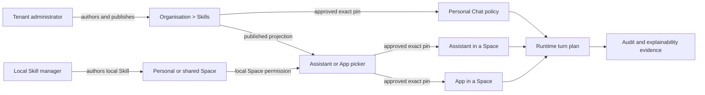
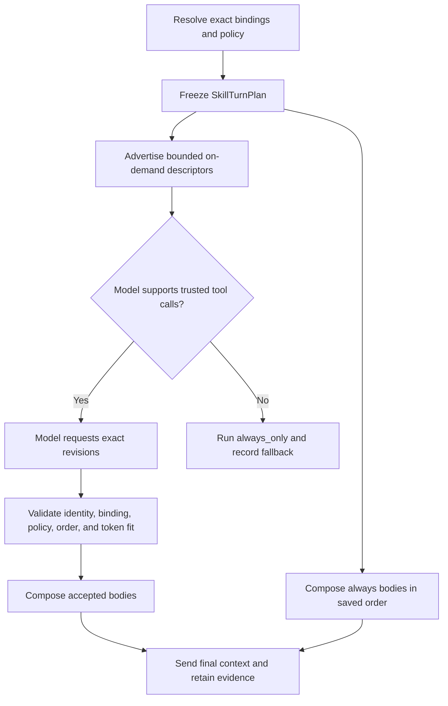
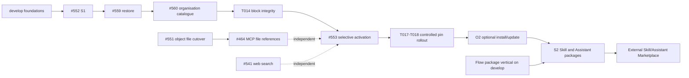

# Enterprise Skills roadmap

- **Status:** Working plan
- **Last verified:** 2026-07-24
- **Audience:** Product, engineering, security, operations, and Skill managers
- **Decision owner:** Product and architecture
- **Runtime contract:**
  [`marketplace-hub-package-portability-and-skills.md`](adr/marketplace-hub-package-portability-and-skills.md)

This document keeps the Skills product plan, delivery order, and review history in
one place. The runtime contract ADR remains authoritative when the two documents
disagree. Update this roadmap when a listed pull request merges, a product
decision changes, or a delivery gate moves.

## Contents

1. [Vision](#vision)
2. [Terms and boundaries](#terms-and-boundaries)
3. [Current state](#current-state)
4. [Enterprise product model](#enterprise-product-model)
5. [Organisation Skill catalogue](#organisation-skill-catalogue)
6. [Governance and permissions](#governance-and-permissions)
7. [Runtime activation](#runtime-activation)
8. [Context and token policy](#context-and-token-policy)
9. [Explainability, audit, and statistics](#explainability-audit-and-statistics)
10. [Architecture ownership](#architecture-ownership)
11. [Delivery and merge order](#delivery-and-merge-order)
12. [Acceptance gates](#acceptance-gates)
13. [Risks and edge cases](#risks-and-edge-cases)
14. [Explicit deferrals](#explicit-deferrals)
15. [Research and product references](#research-and-product-references)
16. [Fable review receipts](#fable-review-receipts)

## Vision

Eneo should let an organisation create focused, versioned instructions once and
reuse them in Personal Chat, Assistants, and Apps. Administrators should decide
which Skills the organisation trusts, who may manage them, where they may be
attached, and how much model context they may consume.

Users should be able to answer four questions without understanding prompt
assembly:

1. Which Skills are available to this resource?
2. Which exact revisions entered this turn's model context?
3. Why did a Skill enter or stay out of the context?
4. Who approved or changed the configuration?

The first releases favour exact revision pins and visible policy over automatic
updates or opaque relevance ranking. The organisation keeps control while the
model still chooses relevant on-demand instructions within the approved set.

## Terms and boundaries

| Term                             | Meaning in Eneo                                                                                            |
| -------------------------------- | ---------------------------------------------------------------------------------------------------------- |
| **Skill**                        | Versioned Markdown instructions. A Skill does not execute code or call an API by itself.                   |
| **Tool**                         | An executable capability offered through Eneo or MCP. The model may call it with structured arguments.     |
| **Knowledge**                    | Retrieved source material. Knowledge answers factual questions; a Skill tells the model how to work.       |
| **Organisation Skill catalogue** | The tenant-local library of approved Skill revisions. This is the first “organisation Skill marketplace.”  |
| **External Marketplace**         | A later cross-instance package catalogue. It is outside the current local Skills delivery.                 |
| **Binding**                      | An ordered, exact revision pin from Personal Chat, an Assistant, or an App to a Skill revision.            |
| **`always`**                     | The Skill body enters every turn for that binding.                                                         |
| **`on_demand`**                  | The model sees a compact descriptor and may request the approved body for the current turn.                |
| **Entered context**              | The exact Skill instructions were sent to the model. This does not prove that the Skill caused the answer. |

The plan uses four delivery labels that are easy to confuse:

- **O1** adds organisation publication and direct catalogue reuse.
- **O2** adds optional install-to-Space and explicit updates for editable copies.
- **Layer 3 / Task #553** adds selective `always | on_demand` activation.
- **S2** adds portable Skill and Assistant packages. S2 will reuse the Flow
  package work after its contract is ready.

## Current state

The foundation merged into `develop` before this roadmap was written:

- PR #547 added object-content storage.
- PR #542 added MCP identity forwarding and the hardened session/catalogue
  lifecycle.
- PR #564 fixed SeaweedFS image attestation.
- PR #566 updated the unreleased SeaweedFS image to 4.40 and kept the image
  verification path green.
- PR #552 added S1 first-class local Skills, exact revision bindings, bounded
  catalogue projections, deterministic eager composition, and runtime
  provenance. It squash-merged as `a29e9464` on 2026-07-22.
- PR #559 added paginated immutable revision history and conflict-safe
  restore-as-a-new-revision. It squash-merged as `8ef96390` on 2026-07-22.
- PR #560 added the admin-owned organisation catalogue, exact publication
  lifecycle, and direct approved-revision reuse. It squash-merged as
  `71de15e5` on 2026-07-23.
- PR #574 added tenant-scoped adoption and drift evidence to the existing Skill
  detail. It squash-merged as `dfe9dbe7` on 2026-07-23.
- PR #577 added the organisation-wide emergency execution block. It
  squash-merged as `b186f175` on 2026-07-23.
- PR #580 locked the deletion and retained-provenance recovery contract. It
  squash-merged as `c642da49` on 2026-07-23.

The delivery graph was last verified on 2026-07-23:

| Work item                                                | Purpose                                         | State and next action                                                                                               |
| -------------------------------------------------------- | ----------------------------------------------- | ------------------------------------------------------------------------------------------------------------------- |
| [#552](https://github.com/eneo-ai/eneo/pull/552)         | S1 first-class local Skills                     | Merged as `a29e9464`; required CI and final review passed.                                                          |
| [#559](https://github.com/eneo-ai/eneo/pull/559)         | Skill revision restore                          | Merged as `8ef96390`; required CI and final review passed.                                                          |
| [#560](https://github.com/eneo-ai/eneo/pull/560)         | O1 organisation catalogue                       | Merged as `71de15e5`; required CI, final review, and product review passed.                                         |
| [#574](https://github.com/eneo-ai/eneo/pull/574)         | O1 adoption and drift evidence                  | Merged as `dfe9dbe7`; required CI and final review passed.                                                          |
| [#577](https://github.com/eneo-ai/eneo/pull/577)         | O1 emergency execution block                    | Merged as `b186f175`; required CI passed and the final review found no current findings.                            |
| [#580](https://github.com/eneo-ai/eneo/pull/580)         | O1 deletion and retained-provenance closure     | Merged as `c642da49`; PostgreSQL behavior proof, documentation, required CI, and final full-coverage review passed. |
| [#581](https://github.com/eneo-ai/eneo/pull/581)         | Selective activation planning blueprint         | Merged as `677c54ca`; required CI passed and the final review found no current findings.                            |
| [#582](https://github.com/eneo-ai/eneo/pull/582)         | Task #553 slice 1: dormant binding mode         | Merged as `80b5f377`; required CI passed and the final review found no current findings.                            |
| [#583](https://github.com/eneo-ai/eneo/pull/583)         | Task #553 slice 2: typed runtime policy         | Merged as `e681171f`; required CI passed and the final review found no current findings.                            |
| [Issue #551](https://github.com/eneo-ai/eneo/issues/551) | File, InfoBlob, and Icon object-content cutover | Open. This gates the fallback file-reference path, not the preferred internal-MCP core split.                       |
| [#464](https://github.com/eneo-ai/eneo/pull/464)         | MCP file references                             | Open and conflict-marked. It belongs to the object-content/file track.                                              |
| [#538](https://github.com/eneo-ai/eneo/pull/538)         | Loopback internal MCP and on-demand knowledge   | Open and coupled to #464. It is useful comparison evidence, not a merge dependency for selective Skills.            |
| [#541](https://github.com/eneo-ai/eneo/pull/541)         | Web search MCP provider                         | Draft. It does not gate Skills.                                                                                     |
| `refactor/flows-clean`                                   | Flow package export/import vertical             | Active at `77202b4f`; it must land on `develop` before S2 extracts any shared package mechanics.                    |

Passing checks on an old PR head do not remove the need to rebase and rerun the
full checks against the current `develop` branch.

## Enterprise product model

### People and their jobs

| Person                      | Primary job                                                                                    | Required visibility                                                                                           |
| --------------------------- | ---------------------------------------------------------------------------------------------- | ------------------------------------------------------------------------------------------------------------- |
| Tenant administrator        | Author and publish organisation Skills, set policy, govern Personal Chat, and inspect adoption | Revisions, diffs, publication, permissions, limits, audit, adoption, and context impact                       |
| Local Skill manager         | Create and maintain Skills in a personal or shared Space they may edit                         | Local revisions, validation, bindings, and the permissions of that Space                                      |
| Assistant or App builder    | Attach approved exact revisions in a resource they may edit                                    | Searchable catalogue, description, published version, token footprint, and update drift                       |
| End user                    | Use Personal Chat, an Assistant, or an App                                                     | After Task #553, a compact account of which Skills entered the turn, without exposing privileged instructions |
| Auditor or support engineer | Reconstruct configuration and runtime decisions                                                | Actor, revision IDs, binding order, policy result, token measurements, and failure reason                     |

### Product surfaces

`Organisation > Skills` remains the single authoring, versioning, publication,
and organisation-catalogue surface. The Organisation workspace is sensitive and
tenant-administrator-only, just like Organisation Knowledge and Settings. A
tenant capability such as `Use Skills` never grants entry to that workspace.
We reuse its existing navigation and layout and do not build a duplicate editor
under Admin.

The global workspace tab keeps the name `Organisation`. Inside Admin, the
current overview destination is labelled `Overview` / `Översikt` rather than a
second `Organisation`; this removes the visible name collision without changing
either route's responsibility.

Ordinary builders work where their resource already lives. An Assistant or App
editor uses the published-catalogue projection to search, preview, and attach an
approved organisation revision. A user with `Use Skills`, `Manage Skills`, and
the relevant Space action may create and maintain local Skills in a personal or
shared Space. Neither path exposes organisation drafts or requires access to the
Organisation workspace.

The Skill detail page carries the useful oversight for that Skill:

- lifecycle state, current revision, and published revision;
- creator, last editor, approver/publisher, and timestamps;
- exact Assistants and Apps using each revision;
- whether Personal Chat uses it;
- distinct Spaces that reference it;
- resources pinned behind the published revision; and
- estimated or measured context footprint for selected models.

Assistant and App binding rows should show the pinned revision, the currently
published revision, `update available` when they differ, and `unpublished` when
the source is no longer published. These states are informational; they never
advance a pin automatically.

### Skills and MCP capabilities

A Skill may teach the model when and how to use an MCP capability that the
parent resource already exposes. It never enables a server, grants a tool,
forwards credentials, or bypasses tenant, Space, Assistant, Governance Policy,
per-message, or per-call approval. The MCP catalogue and effective resource
configuration remain the only capability owners.

The first release adds authoring and testing guidance, not a second tool
registry on immutable Skill revisions. Authors must test the target resource
with the tool available, denied, approval-gated, and unavailable. The product
also states the current compatibility limits: the selected model must support
tool calling, and an Assistant cannot currently use knowledge and MCP together.
Typed dependency metadata, dynamic server activation, and progressive MCP tool
discovery require separate measured evidence and a threat model.

Fleet-wide runtime health belongs in the existing `Admin > Insikter` analytics
surface and remains subject to its `Insights` permission. Skill-attributable
token consumption may later appear in the existing `Admin > Användning >
Tokens` view. Neither needs a new Skill dashboard or a second catalogue editor.

### One local catalogue, several consumers

## Organisation Skill catalogue

### O1: publication and direct reuse

O1 publishes one exact revision from an organisation-Space Skill. Authorised
builders can attach that revision directly to an Assistant or App in another
Space within the same tenant. Tenant administrators can select it for Personal
Chat through the existing Governance Policy owner.

O1 follows these rules:

- publication never advances an existing binding;
- a draft or stale revision cannot be attached as the published organisation
  revision;
- unpublishing stops new attachments but keeps existing exact pins working;
- resource builders with `Use Skills` may inspect the approved published body
  before attaching it, but never see organisation drafts or unpublished bodies;
- foreign-tenant and ordinary sibling-Space Skills remain unavailable; and
- deletion cannot remove a revision that retained bindings or required audit
  evidence still reference.

### Emergency execution block

O1 must not become generally available without an organisation-wide emergency
stop. Publication distributes instructions beyond the owning Space, so a tenant
administrator needs a way to stop a harmful Skill even when they cannot edit
every affected Assistant or App.

This is one narrow control, pulled forward from Task #553:

- the existing organisation settings owner stores a typed block for the Skill
  identity;
- the block keeps exact pins and history intact but excludes that identity from
  Governance Policy resolution and Assistant composition;
- an App run that has not started provider execution fails closed with an
  explicit reason, even when its snapshot predates the block;
- an already in-flight provider request finishes, and the next turn or run sees
  the block;
- the audit record contains actor, reason, and time, while the adoption
  projection lists affected resources; and
- unblocking restores the retained pins, so the UI warns the administrator to
  update or remove harmful revisions before lifting the block.

T014 closes the remaining configuration-surface gap without changing those
runtime semantics: new attachments and revision changes are rejected while the
Skill is blocked, unchanged retained pins survive unrelated saves and reorder,
and organisation/binding read projections show the block separately from
publication state.

T014 does not pull selective modes, activation tools, or token-policy work into
the incident-hardening slice.

### Controlled rollout of a published revision

Exact pins remain the default. After Task #553 exposes one canonical
save-time fit/activatability condition, a tenant admin may start an explicit
**Update bindings to the published version** operation:

- preview one expected published revision across existing pins;
- classify targets in bounded, resumable batches without loading an endless
  browser table;
- advance only a matching old pin while preserving order, activation mode, and
  unrelated parent fields;
- skip concurrent changes instead of overwriting them;
- stop with a typed failure if publication changes, the Skill is unpublished,
  or an execution block appears; and
- retain a body-free, queryable receipt with actor, scope, counts, outcomes, and
  reason codes.

This is a narrow tenant-admin pin-advance authority owned by
`OrganizationSkillService` and `SkillRepo`, not a parent-editor save or a
generic jobs framework. The first slice covers Assistants and Personal Chat
Governance Policy. A second slice adds Apps with a separate acknowledgement and
queued-snapshot non-interference proof. Silent auto-update, a persistent
`track_published` mode, and semantic merge remain deferred.

### O2: optional install and update

Direct catalogue binding remains the default reuse path. O2 serves a different
need: a team may install an editable copy into its Space when it needs a local
variant with an independent lifecycle.

O2 should provide:

- an idempotent install command with exact source provenance;
- one canonical installation per source Skill and target Space;
- a clear `up to date | update available | locally modified` state;
- preview and explicit approval before replacing a local copy's contents;
- explicit tenant-admin emergency block and unblock of each installed local
  identity through the existing central execution-block owner, enforced in
  Assistant composition and queued App pre-provider checks;
- install and update that fail closed while the source is currently blocked;
- affected-copy visibility when a source is blocked, with each unsafe local
  identity blocked explicitly instead of silently propagating the source block;
- no automatic update, text merge, or silent parent rebinding; and
- unchanged parent pins after installing or updating the local copy.

A name or slug collision stops the install preview and requires the installer
to choose the target identity explicitly. Eneo never auto-suffixes the copy.
Installing a newer source revision updates the existing canonical copy; it does
not create another copy merely because the source revision changed.

O2 is not a prerequisite for attaching an approved organisation Skill. It must
not become a generic package installer before S2 provides a second real package
consumer.

### Authoring quality

The editor should help authors write descriptions that state what the Skill does
and when it should run. The Agent Skills specification permits up to 1,024
description characters, but Eneo should encourage focused descriptions instead
of treating the maximum as a target. Live activation evaluation and its token
impact belong to Task #553, when descriptions begin to control runtime loading.

## Governance and permissions

### Existing permission owners

Eneo should extend the existing role, Space, resource, and Governance Policy
owners. It should not add a parallel tenant-policy framework.

| Action                                                       | Initial authority                                                                                   |
| ------------------------------------------------------------ | --------------------------------------------------------------------------------------------------- |
| Enter the Organisation workspace                             | Tenant administrator                                                                                |
| Author or publish an organisation Skill                      | Tenant administrator in `Organisation > Skills`                                                     |
| Browse and attach a published organisation Skill             | `Use Skills` plus edit access to the target Assistant or App, through its catalogue picker          |
| Read or attach a local Skill                                 | `Use Skills`, the relevant Space action, and edit access to the target Assistant or App             |
| Create, revise, restore, deactivate, or delete a local Skill | `Use Skills` plus `Manage Skills` and the relevant action in the owning personal/shared Space       |
| Configure Personal Chat Skills                               | Tenant administrator through Governance Policy                                                      |
| Set organisation Skill runtime limits                        | Tenant administrator in `Admin > Overview/Översikt`, backed by the typed Skill runtime-policy owner |
| View per-Skill audit, adoption, and drift                    | Tenant administrator on the organisation Skill detail page                                          |
| View fleet-wide runtime health                               | Existing `Insights` permission in `Admin > Insikter`                                                |

Configuration-time authorization is conjunctive: tenant capability, Space
action, and parent-resource edit permission must all allow the requested
operation. The existing Space actor owns the first two checks; the Skill service
owns the parent conjunction. `Manage Skills` without `Use Skills` is deliberately
inert and grants nothing, so the generic role editor may keep independent
switches and explain the dependency instead of introducing a new permission-
dependency framework.

Configuration-time and runtime permissions remain separate. A user who can run
an Assistant does not need `Use Skills` or `Manage Skills`. The parent resource's
access, its retained exact revision pins, and Personal Chat's Governance Policy
control the run. Removing `Use Skills` from an end user must not strip approved
instructions from an Assistant they can use.

`Published` means eligible for authorised builders to discover and attach. It
does not mean enabled for every person in the organisation. `Attached` means an
exact revision is configured on a parent. `Entered context` means Eneo actually
sent that body to the model for a turn.

Personal Chat applies the Skills selected by its Governance Policy to users in
that policy's existing scope. O1 will not invent per-Skill user/group ACLs. If
product requirements call for different Skills by group, the Governance Policy
owner must gain an explicit scoped-policy contract and precedence rules before
the UI offers that choice.

Role- or group-targeted publication is deferred. In O1 it would duplicate
parent-resource access and Governance Policy scope while adding precedence,
cache invalidation, removal, and explainability rules without a demonstrated
user need.

### Organisation policy

The tenant administrator owns changeable product policy. The first seeded
defaults are:

- at most 100 attached Skills per Assistant;
- at most 10% of the selected model's input context for total Skill-attributable
  context; and
- at most 10 accepted on-demand activations per turn. Ten is a fixed platform
  safety ceiling; an administrator may lower it.

Slice 2 exposes the stored policy through the admin API. Slice 5 adds its controls
to the existing `Admin > Overview/Översikt` settings surface, where a tenant
administrator can enable or disable selective activation, change the
attached-Skill limit and total Skill-context percentage, lower the per-turn
activation ceiling, and restore the seeded defaults without code or a
deployment. The typed Skill runtime-policy owner persists those organisation
values and validates their product bounds; the current user-bound
`SettingsRepository` and numeric feature flags are not suitable storage owners.
Every change records the actor and old and new typed values through the existing
audit owner.

Selective activation seeds disabled: enabling it is an explicit administrator
decision once the runtime exists. The attached-Skill limit carries an
operational abuse ceiling of 1,000; the real cost guard remains the context
percentage. Restoring defaults returns the product-standard seeds
(disabled, 100 Skills, 10%, 10 activations) — not a deployment's migrated
`SKILL_MAX_BINDINGS` environment seed. After the policy row exists, the
attachment guard on Assistant, App, and Governance Policy binding writes reads
the stored value; the environment variable is never consulted per request.

The seeded values are never consulted as runtime constants after persistence.
A count guard helps reviewability and abuse control; the context percentage
controls the real model cost. The organisation catalogue itself may contain
more Skills than the attachment limit. Ten percent is a measured starting value,
not a universal model truth. The selected model window, hard platform safety
ceilings, and the administrator's stored value remain authoritative.

## Runtime activation

### S1: deterministic eager composition

S1 composes every bound exact revision on every request in saved binding order.
Once O1 lands, its organisation execution block is the sole emergency
exception. This establishes revision safety, permissions, provenance, and
runtime parity before selective loading changes behaviour. Apps remain eager in
later phases.

### Task #553: selective activation

Task #553 adds `always | on_demand` only to Assistant and Governance Policy
bindings. Existing rows migrate to `always`. Each turn resolves one immutable
`SkillTurnPlan` before provider work.

The model receives compact descriptors plus one trusted internal activation
tool. The Skill description is the only discovery description. Eneo should not
add a second `activation_hint` field that can drift.

The model-visible descriptor contains one plan-local activation key, display
name, and description. Exact revision ID, revision number, digest, source, and
position stay in the frozen server-side plan and evidence; advertising those
fields would spend context without helping selection.

Mentioning a Skill name in the base prompt is neither authorization nor a
reliable selector. The prompt can tell the model to choose relevant Skills, but
the trusted activation tool, exact binding set, and policy decide what may enter
context. Explicit user invocation, such as `$skill-name`, remains deferred until
the product defines whether users may override resource authors and how the
choice appears in audit.

The first selective release has no semantic reranker or classifier. If the
descriptor catalogue cannot fit within policy, the turn keeps required
`always` content, omits optional activation, and records
`catalog_budget_exceeded`. It does not silently choose a subset that an
administrator cannot explain.

This all-or-nothing fallback is deliberate. Authoring validation rejects a new
or edited configuration whose optional catalogue cannot fit, so runtime
overflow should occur only after a model or policy change. A prefix fallback
would make availability depend on list position. Reconsider it only if measured
runtime overflow remains common despite save-time validation.

Models without native tool calling run `always_only`. Eneo does not silently
eager-load `on_demand` bodies because that would change the author's selected
mode.

Task #553 should add a small author-run activation evaluation set with prompts
that should and should not activate the Skill, the selected model, and observed
false positives and false negatives. Organisation-published Skills should cover
each user-facing language their authors expect them to handle, including both
Swedish and English where applicable. Cases may carry a language label; this
does not require language routing, a hidden production classifier, or a generic
evaluation platform.

### Stable activation rules

- The activation tool uses a reserved internal identity containing no double
  underscore, not a display name that an MCP server can forge. External MCP
  names are always proxy-prefixed `server__tool`, so the namespaces cannot
  coincide. Tool merging still drops an external exact-name collision
  defensively and records a closed collision reason.
- An accepted activation preempts external sibling calls from the same provider
  round. Siblings are not dispatched, receive protocol-valid deferred results,
  and may be requested again after the updated Skill context is in place.
- Accepted bodies follow saved binding order, independent of tool-call order.
- Repeated activation is idempotent and appears once in evidence.
- Eneo validates optional additions against the selected model's context before
  sending the final request.
- Streaming and non-streaming requests use the same frozen plan and evidence.

## Context and token policy

The existing completion context owner remains authoritative. It should use
LiteLLM's `count_message_tokens()` and `count_tool_tokens()` with the selected
model and its input context window. Eneo must not maintain a parallel tokenizer
table or use character counts as a policy decision.

The percentage measures all Skill-attributable context: required `always`
bodies, descriptors, the activation tool schema, and accepted on-demand bodies.
At save time, the activatability invariant requires the required bodies,
complete attached descriptor catalogue, tool schema, and largest single
attached on-demand body to fit. An Assistant save that adds or edits an
`on_demand` binding evaluates its currently effective completion model. A
Governance Policy save evaluates every completion model that the policy
currently permits because Personal Chat may select any of them. The API rejects
that mode edit when any model in the applicable set fails; models merely
available to the tenant do not participate in an Assistant save. A model added
later through provider-based policy expansion is post-save drift and produces
the documented visible `always_only` fallback until the policy or budget is
corrected. API, UI, and tests share this one condition.
Enforcement follows the split contract in
[Token budget and compatibility behavior](adr/marketplace-hub-package-portability-and-skills.md#token-budget-and-compatibility-behavior):
new or edited configurations may be rejected when a newly added Skill exceeds
policy, existing migrated `always` configurations keep answering with a visible
overage, and optional runtime additions use only the remaining Skill share.
Lowering the setting never makes an otherwise valid base request fail.

The UI should show:

- selected model and input context window;
- token count for each bound revision;
- descriptor tokens, required body tokens, and optional maximum;
- configured percentage and resulting token allowance;
- exact provider count or named estimate/fallback; and
- the most restrictive result when an Assistant can use several models.

### Authoring and administration UX

The user-facing controls ship together in slice 5, after the dormant policy,
plan, evidence, and trusted runtime paths exist. Slice 2 exposes the typed policy
and read-only projections through generated contracts but does not show a mode
that runtime still ignores.

The existing Eneo and shadcn-svelte component vocabulary remains authoritative:

- `Admin > Overview/Översikt` adds one **Skill runtime** settings group with a Switch for
  selective activation, typed number fields for attachment and context-share
  limits, a bounded per-turn activation field, a reset-to-defaults action, and a
  model result table. Backend-owned policy metadata supplies the editable
  ranges and reset values; the frontend must not duplicate product or platform
  bounds. It does not add a dashboard, wizard, or modal.
- The shared `SkillBindingsEditor` remains the binding owner for both Assistant
  settings and Personal Chat Governance Policy. Each binding row adds an
  `Always | On demand` Select beside its existing exact-revision state. The
  Assistant view shows its effective-model result; Personal Chat shows every
  policy-permitted model that blocks the mode. The App consumer renders no mode
  control and retains its eager-only binding contract.
- Existing `Field`, `InputGroup`, `Switch`, `Select`, `Alert`, `Badge`, `Table`,
  `Skeleton`, `Button`, and save-bar patterns are reused. No parallel form
  library, design system, hidden validation store, or decorative card grid is
  introduced.
- An unavailable on-demand choice has an inline reason and remediation, never a
  tooltip-only explanation. A rejected save preserves the draft, focuses the
  first invalid control, and keeps the existing dirty/discard workflow.
- Loading, refresh, empty-model, estimated-count, partial projection, stale
  response, save error, disabled, and success states are explicit. Background
  projection responses are generation-owned so stale results cannot overwrite a
  newer draft.
- Controls keep keyboard order, labelled fieldsets or fields,
  `aria-describedby`, the existing save live region, 44-pixel narrow-screen
  targets, and single-column row fallbacks. Swedish and English copy uses
  concrete terms: `Alltid`, `Vid behov`, measured allowance, and the exact
  blocking model.
- Motion is limited to existing state transitions and respects reduced motion.
  Responsive browser checks cover tenant admin, Assistant builder, Personal
  Chat policy, non-admin denial, a tool-capable model, and a no-tool or
  budget-incompatible model.

### Behaviour with many Skills

| Attached set                    | Expected behaviour                                                                                                                             |
| ------------------------------- | ---------------------------------------------------------------------------------------------------------------------------------------------- |
| A few Skills                    | Show all descriptors that fit and keep the configured order.                                                                                   |
| About 20 Skills                 | Usually all descriptors should fit; measure with the selected model instead of relying on a generic estimate.                                  |
| 50 to 100 Skills                | Enforce the organisation's attachment and percentage policy. Warn at authoring time when optional discovery will not fit.                      |
| 200 or more organisation Skills | Keep them in the catalogue, but do not attach or advertise all of them by default. Builders select the approved subset needed by the resource. |

Codex uses 2% of the context window only for its initial Skill list. Claude Code
defaults its listing to 1% and shortens descriptions before omitting lower-use
descriptions. Eneo's single percentage also pays for required and activated
bodies, so copying either listing percentage would be a category error.

A local calibration fixture with 300-character Swedish descriptions measured
1,408 catalogue tokens for 20 Skills, 54 tool-schema tokens, and 1,801 tokens
for one representative body with the existing LiteLLM counters. The 3,263-token
total exceeds 2% of a 128k window. The 10% starting value leaves useful room for
`always` content and larger attached sets while save-time validation remains the
real guard.

Before #553 ships, rerun the fixture for every model the product labels
on-demand-capable. Mark on-demand unavailable where the complete configuration
fails the activatability invariant. Keep one admin-controlled percentage unless
production evidence earns a separate discovery budget. Derive capability from
native tool support and the same LiteLLM calculation; do not maintain a curated
per-model availability table.

### Descriptor shortening and operator guidance

Eneo does not silently shorten the immutable Skill description. If Task #553
later introduces a derived, per-turn compact descriptor so every attached Skill
can remain discoverable within the configured share, the product must:

- keep the full approved description unchanged in the catalogue and editor;
- warn that descriptions were shortened, how many were affected, which model
  and budget caused it, and that all attached Skills remain discoverable;
- show affected revision IDs, original and advertised token counts, and the
  compaction version in debug evidence without storing either description;
- suggest concrete remedies: detach unused Skills, disable unused MCP/tool
  integrations when the overall model context is constrained, select a
  larger-context model, or let an administrator adjust the Skill share;
- verify with positive and negative activation cases that each compact
  descriptor still communicates what the Skill does and when it applies; and
- use the documented `catalog_budget_exceeded` fallback instead of advertising
  a descriptor that is too short to distinguish the Skill reliably.

This is a progressive-disclosure optimization, not permission to truncate Skill
bodies, mutate revisions, hide attached Skills, or silently select a prefix of
the catalogue.

## Explainability, audit, and statistics

### Language in the product

The product should distinguish three facts:

- **Available:** an approved exact revision was eligible for this resource and
  turn.
- **Entered context:** Eneo sent the exact Skill body to the model.
- **Used:** a causal claim that Eneo cannot prove from prompt assembly alone.

After Task #553, normal chat UI should show a compact list of active and
available Skills backed by the turn's persisted activation evidence. Debug mode
can then show the full candidate set, accepted and rejected activation requests,
binding order, budget calculations, fallback reason, and revision digests. O1
does not infer this evidence from configured bindings. Both surfaces must reuse
the canonical generic debug panel rather than ship a second Skill-specific
panel.

### Configuration and adoption statistics

This is an O1 general-availability requirement, not part of the #560 catalogue
foundation. Goal-board task T005 owns the server projection and UI slice.

O1 can provide exact structural data without pretending to measure model
behaviour:

- Skill version, lifecycle state, created date, and last update;
- creator, last editor, publisher/approver, and the corresponding audit events;
- number of Assistants and Apps pinned to each revision;
- whether Personal Chat is pinned to it;
- number of distinct Spaces using it; and
- number of bindings behind the currently published revision.

The backend should return one tenant-scoped, paginated projection for the current
page of Skills. It should aggregate indexed bindings once and avoid UI counting,
N+1 queries, and join cross-products.

### Runtime evidence after Task #553

Each turn should retain bounded, body-free evidence:

- effective mode: `selective | always_only | eager`;
- available, policy-blocked, initially active, accepted, repeated, and rejected
  exact revision IDs;
- measured Skill-context tokens, limit, model, and count source;
- accepted activation round count and elapsed activation-selection time;
- fallback and rejection reason codes; and
- digests instead of instruction bodies.

This evidence can support counts such as “entered context in 1,204 turns during
30 days.” It must not become “the Skill produced 1,204 answers” or a success rate
without a separate outcome-attribution contract. Retention, export, and access
should follow the existing audit/logging owners and avoid storing prompts or
Skill bodies in analytics rows.

The same body-free evidence should feed an administrator health summary with the
rate of `catalog_budget_exceeded`, `always_only` fallback by reason, and rejected
activations per resource and model. It should also show p50 and p95 activation
selection latency and the share of turns that needed an activation round. This
tells administrators when policy, model capability, or selection overhead makes
on-demand loading ineffective without adding a second event source.

## Architecture ownership

| Responsibility                                   | Canonical owner                                                          | Reuse or change                                                                                                         |
| ------------------------------------------------ | ------------------------------------------------------------------------ | ----------------------------------------------------------------------------------------------------------------------- |
| Skill identity and immutable revisions           | `eneo.skills`                                                            | Deepen one module; do not create an organisation-only Skill type.                                                       |
| Organisation lifecycle and publication           | `OrganizationSkillService`                                               | Require tenant admin for lifecycle writes; keep published catalogue reads separate.                                     |
| Published organisation catalogue projection      | Existing catalogue list/preview methods                                  | Preserve `Use Skills` access for pickers; never use workspace access as a substitute.                                   |
| Local Skill authorization                        | Existing Space actor                                                     | Preserve tenant capability plus Space-action checks; add no parallel ACL.                                               |
| Parent binding authorization and composition     | Existing `SkillService`                                                  | Preserve Skill read plus parent edit and runtime composition checks.                                                    |
| Assistant and App binding writes                 | Existing parent update commands                                          | Replace the ordered binding facet atomically with parent fields. No binding write API.                                  |
| Personal Chat selection                          | Governance Policy                                                        | Add exact approved revision pins to the existing policy.                                                                |
| Final prompt, model window, and token accounting | Completion context module                                                | Own the adapter-facing frozen value, consume the mapped Skill plan, and use LiteLLM counts.                             |
| Organisation runtime policy                      | `eneo.skills` typed runtime-policy owner, exposed in Admin Settings      | Seed defaults once; stored admin values become authoritative and audited.                                               |
| Trusted on-demand activation                     | Existing completion loop with its concrete completion-owned frozen value | Use a reserved Eneo built-in identity. Do not route the authority change through loopback MCP or external tool results. |
| Chat diagnostics                                 | Canonical generic debug panel and retained turn evidence                 | Add Skill sections to the existing panel.                                                                               |
| Audit                                            | Existing audit domain                                                    | Record lifecycle, publication, binding, policy, and bounded runtime events.                                             |
| Package portability                              | Existing Flow package mechanics after a second consumer earns extraction | Move shared mechanics during S2, then delete duplicate vertical copies.                                                 |

## Delivery and merge order

### Local Skills train

1. **Completed:** #552 was reconciled with current `develop`, verified, and
   squash-merged as `a29e9464` on 2026-07-22. The final head had one Alembic
   head (`202607221400`), all required GitHub checks green, no confirmed review
   findings, and an Opus high green light at score 8.
2. **Completed:** #559 was replayed on merged #552 and squash-merged as
   `8ef96390` on 2026-07-22. Restore remains a copy-to-new-revision operation;
   the reviewed current revision is checked under the append lock and a stale
   review returns 409 without discarding dirty editor content.
3. **Completed:** #560, #574, and #577 delivered the organisation catalogue,
   adoption evidence, and emergency execution block on `develop`.
4. **Completed:** T007/PR #580 locked deletion and retained provenance with the
   existing Skill and App-run owners and merged as `c642da49`.
5. **Active:** finish T013, the frozen-plan and body-free evidence slice of
   Task #553.
6. Land T014 block integrity and visibility before the trusted runtime:
   reject new or changed pins while blocked, retain unchanged pins, and expose
   the derived block state in catalogue and binding projections.
7. Finish Task #553 through T015 trusted runtime and T016 save contract/UI.
   T016 must leave one concrete fit/activatability function shared by save,
   preview, apply, API/UI projections, and tests.
8. Consolidate T008 typed lifecycle conflicts after the #553 backend core and
   before rollout adds more conflict outcomes.
9. Build T017 controlled rollout for Assistants and Personal Chat, followed by
   T018's explicit App extension. Neither creates silent automatic tracking.
10. Build O2 editable copies after the rollout core. O2 remains useful but lower
    priority and has no completion-loop dependency.
11. Keep T009 evidence-gated. Start it only when search and source labels prove
    insufficient around 200 or more catalogue entries.

### O1 admin-only alignment inside #560

Implement this as one vertical, red-test-first correction:

1. Make service, resolver, navigation, and layout tests express the accepted
   contract before changing production code: admin lifecycle succeeds;
   `Use Skills + Manage Skills` cannot manage organisation Skills; `Use Skills`
   alone can still list/preview published revisions through a picker; and users
   without Skill access load editors with empty Skill state rather than a 403.
2. Narrow `OrganizationSkillService` organisation management to tenant admin.
   Leave its published catalogue list/preview permission unchanged.
3. Collapse the organisation-workspace access resolver to admin and delete the
   delegated-access branch and its explanatory comment.
4. Show the global Organisation tab to admin only and delete the non-admin
   redirect into `Organisation > Skills`.
5. Relabel the Admin overview destination `Översikt` in Swedish and English.
   Change copy only; do not add a route or a navigation level.
6. Pin the existing local contract with behaviour tests: `Use Skills`, `Manage
Skills`, and the Space action are all required for local authoring; parent
   edit is required for attachment; `Manage Skills` without `Use Skills` is
   inert; runtime use needs neither authoring permission.
7. Run focused backend/frontend tests, the complete affected suites, and a
   browser smoke journey for admin, Use-only builder, local Skill manager, and
   runtime-only end user.

Leave the Space actor, parent `SkillService`, catalogue picker/loaders,
Governance Policy, permission mapper, and generic role editor unchanged unless a
red behaviour test proves an actual defect. No data migration or compatibility
flag is warranted because delegated organisation access has not shipped; only a
pilot running this develop stack would need release communication.

### Selective activation boundary and slices

PR #538 implements loopback FastMCP servers, scoped bearer identity, and
knowledge/file consumers across 21 files. Task #553 does not need that transport
to perform an in-process system-prompt transition, so #538 is no longer a merge
gate. Reuse its hardening lessons, not its HTTP/token/registry stack.

Implement #553 through these reviewable slices:

1. **Dormant binding contract:** add closed modes only to Assistant and
   Governance Policy bindings, backfill `always`, and prove byte-equivalent
   behavior. Do not accept `on_demand` from public writes yet.
2. **Policy and projection:** add the typed Skill runtime policy behind the
   existing Admin Settings route and return read-only per-model policy
   allowances: input window, native tool-calling capability, and the token
   allowance the stored share produces for each accessible model. The exact
   LiteLLM-counted configuration fit belongs to save-time validation in
   slice 5; slice 2 does not fabricate measured-looking samples. Do not use
   the current user-bound settings row or numeric feature flags. Keep
   controls unavailable to non-admin users.
3. **Frozen plan and evidence:** make every existing eager turn consume one
   immutable plan; add typed, body-free activation evidence while behavior
   remains all-`always`.
4. **Trusted runtime:** map `SkillTurnPlan` into a concrete frozen value owned
   beside completion `Context`, inject one reserved Eneo activation function,
   and handle it before external MCP dispatch in both provider loops through one
   private applicator. Recompose with the existing Skill composer and recheck
   fit before the next provider call. The adapter imports no Skills module; do
   not create a one-method port or generic effect framework.
5. **Save contract and UI:** only after runtime behavior exists, accept
   `on_demand`; expose the Admin runtime-policy group and shared binding-row mode
   controls with calm Swedish/English shadcn-svelte states; add responsive,
   accessibility, stale-response, and model-projection tests; run
   positive/negative activation fixtures; expose one reusable concrete
   fit/activatability condition for ordinary saves and the later rollout
   operation; and update the docs guide.

T017 must stop if it would need a second fit calculation. Its preview and apply
use the exact function owned by slice 5.

The reserved Eneo function contains no double underscore, while external MCP
proxy names are always `server__tool`. Tool merging nevertheless drops an
external definition whose name exactly equals the reserved identity and records
a closed collision reason. Accepted activation calls are applied before any
external dispatch; sibling external calls from that round receive protocol-valid
deferred results and may be requested again. Unknown, duplicated, forged, or
colliding activation calls fail closed. #541 web search and the #551/#464 file
track remain independent.

### Portability and external marketplace

S2 starts after Task #553 because Assistant packages must preserve
`always | on_demand` bindings. The current product order also finishes O2 first,
although editable copies are not a package-schema prerequisite. S2 waits until
the Flow package vertical on `refactor/flows-clean` has landed on `develop`, then
extracts only archive,
manifest-coordinate, digest, and closed-dispatch mechanics that have two real
consumers; kind-specific validation, planning, installation, and receipts stay
in their product owners.

The external Marketplace is technically independent of local runtime, but the
current product order defers all new Marketplace work until the local #553, O2,
and S2 gates are complete. Eneo must not advertise external Skill or Assistant
packages until S2 has versioned fixtures, plan/apply behaviour, receipts, and
cross-repository contract tests.

## Acceptance gates

### S1 and revision safety

- Database constraints reject foreign-tenant, wrong-Space, mismatched revision,
  duplicate position, and invalid current-pointer states.
- Parent saves update fields and bindings atomically.
- Provider-facing instructions preserve exact revision and order.
- Queued App runs retain bounded provenance and stay stable after later edits.
- Bound Skills and retained queued or running App runs block deletion. Complete
  and failed runs keep readable body-free provenance but no longer retain an
  otherwise eligible Skill.
- Personal Chat uses Governance Policy pins and rejects direct default-Assistant
  bindings.
- Zero-Skill behaviour remains byte-equivalent.

### O1 and O2

- Publication transitions are typed, audited, and concurrency-safe.
- Only tenant administrators can see or enter the Organisation workspace and
  author organisation Skills.
- A non-admin with `Use Skills` can search and preview published organisation
  revisions in an authorised Assistant/App picker without receiving
  Organisation navigation or access to drafts.
- `Use Skills` plus `Manage Skills` remains insufficient for organisation
  authoring, but permits local authoring when the personal/shared Space action
  also allows it.
- `Manage Skills` without `Use Skills` grants no Skill action.
- Builders can attach only the exact published organisation revision.
- Unpublication blocks new pins and preserves existing pins.
- An organisation execution block excludes the Skill identity from subsequent
  Personal Chat and Assistant composition, stops App runs that have not begun
  provider execution, retains exact pins, and records actor, reason, time, and
  affected resources.
- An active execution block rejects new attachments and changed revision pins
  for Assistant, App, and Personal Chat while unchanged retained pins still
  survive unrelated parent saves and reorder.
- Organisation and binding read projections derive block state from the
  execution-block owner; publication and block remain separate typed states,
  with the block visually dominant during an incident.
- Adoption counts are tenant-scoped, exact, paginated, and free of N+1 queries.
- Controlled rollout preview is exact only when ready, processes large fleets
  with bounded memory and lock scope, and never requires an endless client-side
  list.
- Controlled apply is tenant-admin-only, idempotent, expected-value guarded,
  preserves order/mode/parent fields, skips concurrent changes, and stores no
  Skill body, prompt, credential, tool result, or incident reason.
- The first rollout slice covers Assistants and Personal Chat. App rollout is a
  separate eager-only extension whose tests prove queued snapshots remain
  unchanged and new runs see the committed pin.
- O2 install and update are idempotent, previewed, explicit, and leave parent
  pins unchanged.
- A bound, locally modified installed copy can be blocked through the central
  execution-block owner with tenant-admin authority; Assistant composition and
  queued App pre-provider checks enforce that local-identity block, and
  install/update from a currently blocked source fails closed. Behaviour tests
  cover the queued-App path.

### Task #553

- Existing rows remain `always` and continue to answer after policy changes.
- Tenant admins can change the seeded enablement, attachment, context-share, and
  activation-limit values in `Admin > Overview/Översikt` without code or deployment;
  typed storage, bounds, reset, audit actor, and old/new values have behaviour
  tests.
- Assistant and Personal Chat mode controls reuse `SkillBindingsEditor`, preserve
  drafts on validation failure, explain each blocking model inline, and pass
  Swedish/English keyboard, screen-reader, narrow-screen, and stale-response
  checks using installed shadcn-svelte primitives.
- The App consumer of `SkillBindingsEditor` renders no mode control, accepts no
  mode field, and has a behavior test that pins eager-only operation.
- The save contract defines one exact rejection condition for a newly added
  or edited `on_demand` binding: use the Assistant's effective selected model or
  every model currently permitted by the Governance Policy. API, UI, and tests
  use the same condition.
- Every advertised on-demand Skill is individually activatable within the saved
  model configuration: required bodies, complete descriptors, tool schema, and
  the largest single on-demand body fit the configured share.
- Streaming and non-streaming paths produce the same plan and evidence.
- External tool-name collisions, forged calls, repeated calls, and stale
  revisions fail with explicit reason codes.
- Small/large model windows and LiteLLM fallback paths have behaviour tests.
- Default-policy calibration proves that each model labelled on-demand-capable
  can advertise a realistic 20-Skill set and accept at least one representative
  body, or the UI marks that model unavailable for on-demand mode.
- Save-time validation prevents new descriptor overflow; a later model or policy
  change produces the documented all-or-nothing fallback and health evidence.
- If descriptor shortening is introduced, it is derived and visible, preserves
  every attached Skill in discovery, passes activation evaluations, and offers
  the operator remedies listed in the context policy.
- Models without tool calling run `always_only` and disclose that fallback.
- Activation tests include positive and negative cases in every user-facing
  language the Skill author expects to support.
- Binding rows show the exact pin, published revision, update drift, and
  unpublished source state without changing the pin.
- Evidence records bounded activation round count and selection latency; the
  administrator summary reports p50 and p95 without storing prompt bodies.
- The product shows context entry and never claims unproved causal use.

### S2

- Exact instruction-only Skill snapshots and Assistant binding modes round-trip.
- Package validation rejects code, knowledge bytes, local IDs, unknown fields,
  unsafe archives, and digest mismatches before mutation.
- Failed installs create no partial Assistant or Skill graph.
- Flow package behaviour remains unchanged after shared mechanics move.

## Risks and edge cases

| Risk or case                                    | Required handling                                                                                                                                                         |
| ----------------------------------------------- | ------------------------------------------------------------------------------------------------------------------------------------------------------------------------- |
| A Skill changes after attachment                | Exact revision pin stays unchanged; UI shows update drift.                                                                                                                |
| Published revision changes                      | Existing pins remain stable. A builder updates one resource, or a tenant admin explicitly previews and rolls out the published revision with guarded skips and a receipt. |
| Skill is unpublished                            | New attachments stop; retained exact pins keep running.                                                                                                                   |
| Published Skill is found harmful                | Tenant admin blocks the Skill identity. New turns and not-started App runs stop; pins and audit evidence remain.                                                          |
| Blocked Skill is attached or repinned           | Reject the new or changed pin. Preserve an unchanged retained pin so unrelated parent edits remain possible.                                                              |
| Blocked source has installed local copies       | Copies keep their independent identity. Admins see affected copies, block each unsafe local identity explicitly, and install/update from the blocked source fails closed. |
| Skill deletion could invalidate a queued run    | Bindings and retained queued/running App-run evidence block deletion; terminal runs retain body-free IDs and digests.                                                     |
| Author loses permission during a draft          | Parent save reauthorises and commits atomically or fails without partial bindings.                                                                                        |
| End user lacks catalogue permission             | Parent-resource access still runs its approved pins.                                                                                                                      |
| Two Skills contradict each other                | Saved order is visible. The author resolves the conflict; Eneo does not invent semantic precedence.                                                                       |
| Two Skills share a display name                 | Stable IDs and revision IDs govern activation; UI includes owner/Space context.                                                                                           |
| Descriptor matches too broadly                  | Task #553 evaluation catches false positives; admins can set the binding to `always`, remove it, or revise the description.                                               |
| Descriptor language differs from the user query | Evaluate trigger cases in the languages the Assistant serves. Record the model used for the test.                                                                         |
| Descriptor budget is exceeded                   | Preserve required content, disable optional catalogue for the turn, and record the reason.                                                                                |
| Model cannot call tools                         | Run `always_only`; never change `on_demand` into eager loading.                                                                                                           |
| Model requests an unbound or blocked Skill      | Reject it and record a bounded reason code.                                                                                                                               |
| Policy changes during a stream                  | The frozen turn plan completes; the next turn sees the new policy.                                                                                                        |
| Analytics could expose instructions             | Store IDs, counts, digests, and reason codes. Keep bodies and prompts out of aggregate rows.                                                                              |
| Admin raises limits beyond useful values        | Show measured impact and warnings; the selected model's hard context validation remains final.                                                                            |
| Imported Skill contains code or tools           | S1/O1 stay instruction-only. S2 rejects executable content until a separate security contract exists.                                                                     |
| Skill instructions mention an MCP tool          | The parent must already expose and allow it. The Skill grants nothing; existing MCP, policy, approval, model, and health checks fail closed.                              |
| Rollout preview becomes stale                   | Publication change, unpublication, or block terminates apply with a typed reason and requires a fresh preview; completed pins are not silently reverted.                  |

### Recovery and rollback

- Revert a Skill by creating a new revision from an older immutable revision.
- Unpublish to stop new organisation bindings without breaking active resources.
- Deactivate to stop new attachments. It is not an incident stop and does not
  exclude retained pins from composition.
- Use the organisation execution block for an incident. In-flight provider
  requests finish, while later turns and App runs that have not begun provider
  execution fail closed with a recorded reason.
- Detach a local or never-published organisation draft before deletion. Wait
  for retained App runs to complete or fail; their body-free provenance remains
  readable after an eligible hard deletion.
- Roll back a selective-activation release by disabling selective execution,
  retaining stored modes, and running only `always` bodies as `always_only`; do
  not drop mode or evidence columns until the team has migrated the data.
- Pause S2 or the external Marketplace without affecting local pinned Skills.

## Explicit deferrals

The current plan excludes:

- an external Skill marketplace and cross-instance installation;
- silent automatic updates, persistent `track_published`, or semantic text
  merges; explicit one-shot pin rollout remains planned;
- user `$skill` mentions and per-chat Skill toggles;
- a hidden semantic reranker or classifier;
- on-demand App Skills;
- Skill knowledge, scripts, assets, network access, tool allowlists, or
  revision-owned MCP requirement metadata;
- Skill-triggered MCP server connection and progressive MCP tool discovery
  without measured tool-schema pressure;
- Group Chat routing changes;
- causal Skill success scores;
- a second Admin Skill editor/dashboard; and
- a generic policy, effect, installer, batch-operation, jobs, or plugin
  framework created for one consumer.

Each deferred item needs a named owner, user need, threat model, and behaviour
tests before implementation. MCP requirement metadata also needs evidence that
authoring guidance and target-resource testing failed; progressive tool
discovery needs retained prompt-pressure evidence; a generic operation
framework needs a second real bulk consumer; and persistent update tracking
needs repeated demand after the one-shot rollout ships.

## Research and product references

The sources below inform the plan. They do not override Eneo's accepted runtime
contract.

| Source                                                                                                                                                                                                                                                    | Useful pattern                                                                                                           | Eneo decision                                                                                                                                   |
| --------------------------------------------------------------------------------------------------------------------------------------------------------------------------------------------------------------------------------------------------------- | ------------------------------------------------------------------------------------------------------------------------ | ----------------------------------------------------------------------------------------------------------------------------------------------- |
| [Agent Skills specification](https://agentskills.io/specification) and [client guide](https://agentskills.io/client-implementation/adding-skills-support)                                                                                                 | Name/description discovery, full-body activation, and on-demand resources                                                | Follow the core instruction format in S2 and use progressive disclosure in #553. Keep Eneo's database revision and permission model.            |
| [Agent Skills best practices](https://agentskills.io/skill-creation/best-practices), [description optimisation](https://agentskills.io/skill-creation/optimizing-descriptions), and [evaluation](https://agentskills.io/skill-creation/evaluating-skills) | Focused bodies, clear trigger descriptions, and positive/negative activation tests                                       | Add author guidance and evaluation evidence; do not enforce the 5,000-token recommendation as a hard policy.                                    |
| [ChatGPT Skills](https://help.openai.com/en/articles/20001066)                                                                                                                                                                                            | Workspace publication, role controls, per-Skill owner/access, users, 30-day invocations, dates, and compliance events    | Borrow the governance and oversight shape. Use “entered context” until Eneo can define an honest invocation/outcome metric.                     |
| [Codex Skills](https://developers.openai.com/codex/skills)                                                                                                                                                                                                | Explicit and implicit activation, progressive disclosure, and a 2% initial-catalogue budget                              | Borrow the bounded, inspectable discovery principle. Eneo uses a measured 10% total Skill share because the same budget also pays for bodies.   |
| [Claude Agent Skills](https://platform.claude.com/docs/en/agents-and-tools/agent-skills/overview) and [Managed Agents Skills](https://platform.claude.com/docs/en/managed-agents/skills)                                                                  | Metadata-first loading, exact version pins, and up to 500 mounted Skills with a startup cost warning                     | Borrow progressive disclosure and exact versions. Use context percentage plus an admin count guard instead of copying 500 as a universal limit. |
| [Open WebUI Skills](https://docs.openwebui.com/features/workspace/skills/)                                                                                                                                                                                | Lazy `view_skill`, model bindings, `$` mention, per-chat toggles, active state, and user/group access                    | Borrow the clear distinction between Skill and tool. Start with admin/resource bindings; defer user overrides and per-Skill ACLs.               |
| [LibreChat Skills](https://www.librechat.ai/docs/features/skills) and [Agent settings](https://www.librechat.ai/docs/configuration/librechat_yaml/object_structure/agents)                                                                                | Manual, model-invoked, and always modes; per-Agent allowlists; a model-visible catalogue cap; description-led activation | Borrow the focused allowlist and explicit mode vocabulary. Do not inherit scripts/assets, tool grants, GitHub sync, or user overrides in #553.  |
| [Onyx Agents](https://docs.onyx.app/overview/core_features/agents) and [Actions](https://docs.onyx.app/overview/core_features/actions)                                                                                                                    | Separates Agent instructions, scoped knowledge, and executable Actions; recommends testing and narrow knowledge          | Preserve Eneo's Skill/tool/knowledge boundaries. Onyx documents no equivalent versioned lazy Skill catalogue, so do not invent one by analogy.  |
| [Flowise Agentflow](https://docs.flowiseai.com/using-flowise/agentflowv2) and [Agent as Tool](https://docs.flowiseai.com/tutorials/agent-as-tool)                                                                                                         | Explicit graph steps, described agent-as-tool selection, and observable bounded loops                                    | Borrow bounded-loop and traceability questions only. Eneo Skills do not need a workflow graph or multi-agent runtime.                           |
| [AnythingLLM intelligent tool selection](https://docs.anythingllm.com/agent/intelligent-tool-selection)                                                                                                                                                   | Optional reranking above an admin-set tool count, with documented latency overhead                                       | Keep reranking out of the first release. Reconsider only with measured descriptor overflow and explainable selection evidence.                  |
| [Dify Agent node](https://docs.dify.ai/en/cloud/use-dify/nodes/agent)                                                                                                                                                                                     | Native function calling, explicit iteration limits, tool descriptions, outputs, and structured logs                      | Use a trusted activation tool, a fixed accepted-activation ceiling, and structured evidence. Do not expose hidden chain-of-thought.             |

### Patterns we should preserve

- Progressive disclosure keeps many available Skills from consuming their full
  bodies on each turn.
- Clear descriptions decide whether model-driven activation works.
- Exact version pins and explicit update decisions suit regulated organisations.
- Admin governance needs separate controls for use, management, publication,
  installation, and audit.
- Tools, knowledge, prompts, and Skills need distinct names and owners in the UI.

### Patterns we should avoid copying

- A product-specific fixed count presented as a model truth.
- Silent ranking that hides which approved Skills the model could see.
- Per-user toggles that bypass an Assistant author's or administrator's policy.
- “Invocation” and “success” metrics without a precise event contract.
- Executable Skill bundles before scanning, sandboxing, and permission rules
  exist.

## Fable review receipts

These local Codex artifacts contain the planning reviews that shaped this
roadmap. Their accepted decisions are restated above because `.codex/artifacts`
is a working-session record, not the product contract.

| Review                                   | Local artifact                                                                                                                        | Result used here                                                                                                                                           |
| ---------------------------------------- | ------------------------------------------------------------------------------------------------------------------------------------- | ---------------------------------------------------------------------------------------------------------------------------------------------------------- |
| Selective activation architecture        | `.codex/artifacts/claude-peer-loop-fable-enterprise-selective-skill-activation-architecture-review-20260721T143724Z.md`               | Replaced eager-all-at-scale with explicit `always` and `on_demand`, a trusted activation effect, and bounded evidence.                                     |
| Organisation budget adjudication         | `.codex/artifacts/claude-peer-loop-fable-organization-admin-skill-budget-final-adjudication-20260721T145646Z.md`                      | Made the percentage and attachment guard administrator-owned; kept the model window authoritative.                                                         |
| Selective blueprint verification         | `.codex/artifacts/claude-peer-loop-fable-selective-skill-blueprint-final-verification-20260721T150419Z.md`                            | Confirmed the frozen turn plan, fallback semantics, and explainability language.                                                                           |
| Implementation boundary gate             | `.codex/artifacts/claude-peer-loop-selective-skills-implementation-boundary-verification-20260721T152413Z.md`                         | Held #553 until the trusted internal MCP/effect owner is in the branch ancestry.                                                                           |
| Integration train review                 | `.codex/artifacts/claude-peer-loop-eneo-integration-train-before-selective-skills-20260721T165736Z.md`                                | Identified the coupled PR graph and the need to avoid copying #538 into Skills.                                                                            |
| Revised integration train verification   | `.codex/artifacts/claude-peer-loop-revised-eneo-integration-train-verification-20260721T170352Z.md`                                   | Accepted Skills-first, split internal MCP core, and file-reference fallback order.                                                                         |
| Admin information architecture           | `.codex/artifacts/claude-peer-loop-eneo-skills-admin-ia-and-permissions-plan-20260721T071004Z.md`                                     | Kept one Organisation editor and moved useful adoption/drift data to Skill detail.                                                                         |
| Debug security and reliability           | `.codex/artifacts/claude-peer-loop-debug-mode-security-and-reliability-verification-20260721T133316Z.md`                              | Required one canonical, server-governed debug capability and owner-authorised evidence.                                                                    |
| Skills UI review                         | `.codex/artifacts/claude-peer-loop-eneo-skills-ui-final-ux-review-20260721T094940Z.md`                                                | Retained flat, task-oriented layouts and explicit revision states.                                                                                         |
| Navigation and visual polish             | `.codex/artifacts/claude-peer-loop-eneo-skills-nordic-polish-and-navigation-final-verification-20260721T141118Z.md`                   | Reused the organisation navigation and removed route-specific visual duplication.                                                                          |
| Consolidated roadmap challenge           | `.codex/artifacts/claude-peer-loop-enterprise-skills-roadmap-skeptical-review-20260722T115806Z.md`                                    | Reconciled token policy with the ADR, restored the dependency graph, and added measurable release calibration.                                             |
| Comparative enterprise challenge         | `.codex/artifacts/claude-peer-loop-enterprise-skills-comparative-blueprint-challenge-20260722T120529Z.md`                             | Added the O1 emergency stop, activation latency, multilingual evaluation, and binding-site drift visibility.                                               |
| Authoritative contract verification      | `.codex/artifacts/claude-peer-loop-enterprise-skills-roadmap-authoritative-contract-verification-20260722T121803Z.md`                 | Gave green light at score 8 after both documents agreed on the minimal O1 execution-block contract and test boundary.                                      |
| Two-layer authorization adjudication     | `.codex/artifacts/claude-peer-loop-eneo-skills-two-layer-enterprise-authorization-and-ux-adjudication-20260722T123308Z.md`            | Confirmed admin-only Organisation authoring, tenant-plus-Space local management, picker-only published reuse, and no new ACL or dashboard.                 |
| Implementation architecture verification | `.codex/artifacts/claude-peer-loop-eneo-skills-implementation-order-and-architecture-verification-20260722T124707Z.md`                | Gave green light at score 8, placed the subtractive correction in #560, and fixed the red-test-first owner and merge sequence.                             |
| Remaining-roadmap and O2 blueprint       | `.codex/artifacts/claude-peer-loop-enterprise-skills-remaining-roadmap-and-o2-blueprint-20260723T211419Z.md`                          | Rejected the copied 2% total budget and #538 merge gate; ordered #553 before O2 and kept T009, S2, and Marketplace behind explicit gates.                  |
| Remaining-roadmap verification           | `.codex/artifacts/claude-peer-loop-enterprise-skills-remaining-roadmap-and-o2-blueprint-verification-20260723T214123Z.md`             | Confirmed the architecture and identified three exact wording gaps in model validation, sibling deferral, and reserved identity.                           |
| Final selective-plan verification        | `.codex/artifacts/claude-peer-loop-enterprise-skills-remaining-roadmap-and-o2-blueprint-verification-3-20260723T220002Z.md`           | Gave green light at score 8 after the contracts, admin configuration, slice order, and shared UI ownership agreed with current source.                     |
| MCP, rollout, and block challenge        | `.codex/artifacts/claude-peer-loop-enterprise-skills-mcp-guidance-fleet-rollout-and-block-semantics-20260724T092037Z.md`              | Rejected revision-owned MCP metadata and parent-save impersonation; found the missing blocked-attachment guard and required an explicit pin-advance owner. |
| MCP, rollout, and block verification     | `.codex/artifacts/claude-peer-loop-enterprise-skills-mcp-guidance-fleet-rollout-and-block-semantics-verification-20260724T093304Z.md` | Gave green light at score 8 after the bounded rollout aggregate, exact App phase, block truth table, and post-T013 slices were made explicit.              |

## Open decisions before implementation

Product and architecture should close these questions at the named gate:

1. **Before scoped Personal Chat policies:** Which existing group/role owner
   supplies the scope and conflict precedence? O1 stays tenant-policy scoped
   until this is defined.
2. **Before S2:** Which exact merged Flow package commit owns the archive
   mechanics that have earned extraction? The active `refactor/flows-clean`
   branch is evidence, not a stable dependency until it lands on `develop`.
3. **Before external Skill distribution:** Which scanner, signature policy,
   sandbox, and review workflow can accept scripts, assets, or references?
