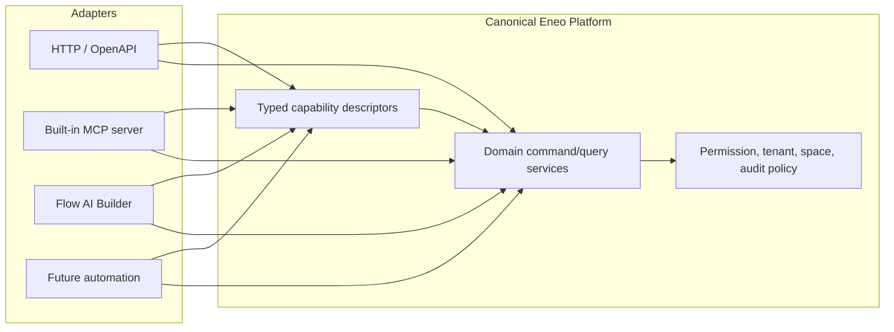
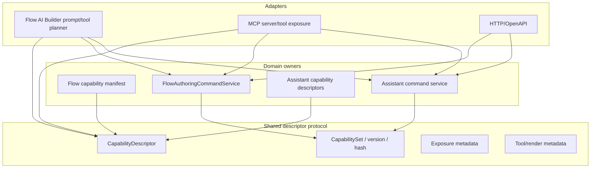
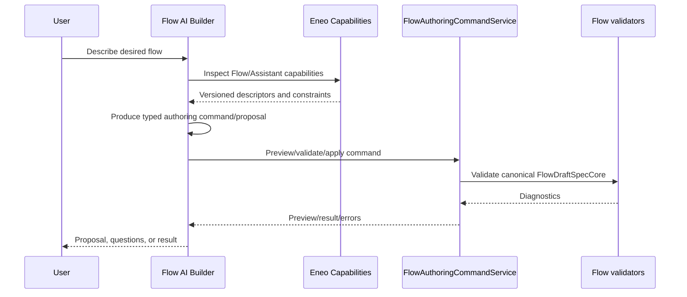

# Eneo Capabilities And MCP Architecture Opinion

## Five-line TL;DR

1. Build a typed Eneo capability layer, not an MCP-first internal architecture.
2. MCP should be a generated or thin adapter over Eneo-owned descriptors and command services.
3. Flow AI Builder should consume dynamic Eneo capability descriptors so it does not drift from real Flow and Assistant behavior.
4. Flow AI Builder should execute through direct Eneo services, not through loopback MCP calls.
5. Do this after Phase 4 runtime deletion, because capability architecture should consolidate real owners instead of adding another abstraction early.

## Recommendation

The long-term direction is good if the canonical concept is **Eneo capabilities**, not MCP.

MCP is a useful transport and tool surface. It is not the right internal source of truth for Flow AI Builder, Assistant editing, or Flow authoring. The source of truth should be typed platform descriptors plus typed domain command/query services. MCP, HTTP/OpenAPI, Flow AI Builder, and future automation can all be adapters over that same capability layer.



The important rule:

```text
Correct:
  Builder -> Eneo capability descriptor -> Eneo command service
  MCP     -> Eneo capability descriptor -> Eneo command service

Avoid:
  Builder -> MCP loopback -> MCP tool handler -> Eneo command service
```

## Why This Matters

Flow AI Builder is most reliable when it is not hand-maintaining a parallel catalog of what Flows and Assistants can do. If the platform exposes the current Flow/Assistant capability surface dynamically, then the Builder can inspect the real current capabilities instead of drifting from the implementation.

That can improve:

| Concern | Benefit |
| --- | --- |
| Drift | Builder prompts and tool schemas derive from current platform descriptors. |
| Reliability | The model proposes operations the platform says are legal, then canonical validators still enforce them. |
| Maintainability | Adding a new Flow/Assistant capability updates one descriptor/command owner, not prompt text, MCP tools, and Builder logic separately. |
| API quality | External consumers can inspect supported capabilities without reading backend source. |
| Reviewability | Reviewers can ask "what command owns this mutation?" instead of tracing model prompts. |

## Current Branch Evidence

The branch already has a Flow-specific capability owner. That is why a new greenfield generic MCP layer would be the wrong next move.

| Evidence | File |
| --- | --- |
| Flow Capability Manifest has a versioned capability surface. | `backend/src/intric/flows/flow_capability_manifest.py:43` |
| `FlowCapability` declares ids, labels, tuple legality, required config, invariants, exposure, and channel/runtime input details. | `backend/src/intric/flows/flow_capability_manifest.py:73` |
| `CAPABILITY_REGISTRY` is the current Flow capability registry. | `backend/src/intric/flows/flow_capability_manifest.py:454` |
| Critic invariants are rendered deterministically from the capability registry. | `backend/src/intric/flows/flow_capability_manifest.py:816` |
| Coverage diagnostics walk the enum product and surface capability drift. | `backend/src/intric/flows/flow_capability_manifest.py:838` |
| Builder prompt reference is generated from schema values plus the Flow Capability Manifest. | `backend/src/intric/flows/ai_builder/ai_builder_flow_capability_reference.py:19` |
| Builder proposal context is generated at the proposal boundary from server-owned state plus FCM/pattern facts; the old Builder-local capability projection module has been deleted. | `backend/src/intric/flows/ai_builder/ai_builder_plan_proposal_task.py` |
| Flow authoring has one typed command union for create/edit. | `backend/src/intric/flows/application/flow_authoring_command.py:58` |
| `FlowAuthoringCommandService` owns preview, prepare, apply, and transaction assertion through the existing Flow services. | `backend/src/intric/flows/application/flow_authoring_command.py:127` |

## The Clean Architecture Shape

The future platform capability layer should be a shared descriptor protocol, not a shared mutation engine.



### Capability Concepts

Use these names precisely in future Phase 5 work.

| Concept | Owns | Must not own |
| --- | --- | --- |
| Feature manifest | Static supported behavior and semantic constraints | Actor-specific authorization or mutations |
| Command/query contract | Typed request/result and domain operation | UI rendering or transport |
| Availability snapshot | Actor/tenant/space/target-specific currently available subset | Persistence and mutation |
| Adapter exposure | HTTP/MCP/UI schema and translation | Business validation, transactions, or audit policy |

Permission requirements may be visible for discovery, but authoritative
permission enforcement remains in the command or service that performs the
operation.

### Descriptor Responsibilities

Descriptors should answer discovery and legality questions:

- capability id
- version/hash
- domain owner
- scope: tenant, space, assistant, flow, step, or session
- required permission
- exposure: builder, MCP, HTTP, internal, or not exposed
- form/tool rendering metadata
- validation/preview/apply availability
- short description for model/user surfaces
- links to the owning command/query schema

Descriptors should **not** become another place that implements mutations.

### Command Service Responsibilities

Command/query services should own the actual behavior:

- load current state
- authorize
- validate
- preview
- apply
- audit
- enforce tenant/space/principal context
- assert transaction ownership
- return typed results/errors

For Flow authoring, that owner is already `FlowAuthoringCommandService`, not a future MCP handler.

## Flow AI Builder Use

The Builder should use capability descriptors for discovery and prompt/tool planning, then call direct services for execution.



This gives the Builder the "latest platform capabilities" benefit without making MCP the internal execution path.

## PR #480 Idea: Keep The Pattern, Not Necessarily The Shape

The useful idea from PR #480 is the product direction:

- platform capabilities can be exposed as tools;
- capabilities can be scoped and permissioned;
- tools can mutate assistant behavior after confirmation;
- a runtime tool surface can be generated from a registry.

The risk is copying the implementation shape too literally. If the final shape exposes assistant mutations only through MCP, then MCP becomes the only reusable execution plane. That would make Flow AI Builder reuse awkward and could push us toward loopback calls.

The cleaner generalization:

```text
AssistantCapabilityDescriptor
  -> Assistant command/query service
  -> MCP adapter generated from descriptor
  -> HTTP/admin/editor adapter generated or manually wired from the same owner
  -> Flow AI Builder can inspect descriptor and call service directly when needed
```

## What To Avoid

| Avoid | Why |
| --- | --- |
| Builder internally calling Eneo's MCP server | Adds loopback latency, serialization, auth ambiguity, and debugging complexity. |
| Generic "capability manager" that owns no domain behavior | Fake abstraction; it will become a pass-through registry. |
| Duplicating Flow capability truth outside FCM | Creates the drift this proposal is trying to remove. |
| Adding tool search/RAG over tools now | Current scope does not need it; descriptor count should stay small first. |
| Adopting MCP Apps or AI SDK for rendering now | Does not delete named Phase 4 modules yet. |
| Turning descriptors into mutation handlers | Blurs discovery metadata with write behavior. |

## Future Sequencing

Do not treat this opinion as an implementation phase order. The active Phase 4
plan stops at a Phase 5A go/no-go packet, and that packet owns the next
recommendation.

Future goals should evaluate these candidates separately:

| Candidate | Required proof before implementation |
| --- | --- |
| Read-only capability descriptor unification | Existing FCM can adapt to shared descriptors without weakening FCM invariants. The migration must not reintroduce a Builder-local prompt projection mirror. |
| Assistant capability parity | Assistant update commands have a clear canonical service owner independent of MCP, with confirmation, identity, authorization, audit, and Flow-managed boundaries server-owned. |
| MCP adapter | Descriptors and command/query contracts already exist; MCP handlers can remain translation-only and contain no domain authoring logic. |
| Builder consumption | Builder prompt/tool surfaces can derive from descriptor sets without introducing internal Builder-to-MCP calls or a second validation owner. |

## Go / No-Go Criteria For Starting This

| Gate | Go Condition |
| --- | --- |
| Phase 4 | Custom Builder LLM/runtime surfaces are collapsed enough that a capability layer is not hiding old complexity. |
| Flow descriptors | Existing FCM can adapt to shared descriptors without weakening FCM invariants. |
| Assistant descriptors | Assistant update commands have a clear canonical service owner independent of MCP. |
| Tests | Every model-visible capability claim has canonical enforcement. Not every internal validator needs a model-visible descriptor. |
| Reviewability | A new senior engineer can trace one capability from descriptor to command to audit event in one sitting. |

## Open Questions

| Question | Current Opinion |
| --- | --- |
| Should Flow AI Builder call MCP internally? | No. Use descriptors plus direct services. |
| Should MCP be built into the platform? | Yes, as an adapter over typed capabilities. |
| Should capabilities be fetched dynamically? | Yes, but from Eneo descriptors, not by scraping MCP. |
| Should descriptors include input schemas? | Maybe for adapters, but command services remain the schema owners. |
| Should this start before Phase 4 completes? | No, unless a specific Phase 4 module is deleted by doing it. |

## Final Opinion

The MCP/tool idea is strategically strong, but the durable architecture is not "make everything MCP." It is "make Eneo functionality capability-addressable, typed, permissioned, and auditable, then expose those capabilities through MCP and other adapters."

For Flow AI Builder, the biggest long-term win is dynamic capability discovery from the platform. The biggest risk is loopback MCP becoming an internal service boundary. The correct line is: descriptors are shared, command services execute, MCP adapts.
