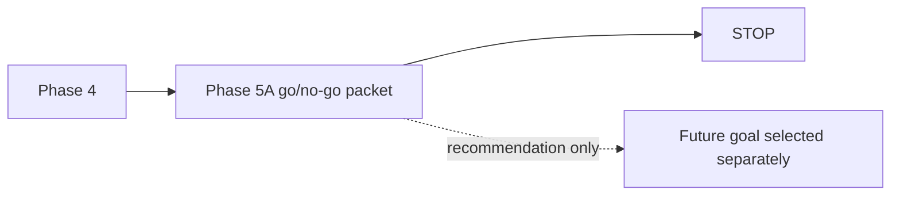

# Flow AI Builder Capability Refactor Plan

## Five-line TL;DR

1. Finish Phase 4 Flow AI Builder runtime deletion before platform capability implementation.
2. Keep this document as the phase-order and merge-gate packet; do not duplicate detailed slice design here.
3. Treat PR #480 and Dify as references, not architectures to copy.
4. Every implementation slice must delete a named duplicate owner or remove a named wrong-layer dependency in the same migration.
5. Stop after Phase 4 with the Phase 5A go/no-go packet; do not implement Assistant configuration, shared descriptors, or MCP in this goal.

## Document Precedence

This packet owns **implementation order, gates, and stop conditions**.

Related docs keep their existing ownership:

- [Eneo Capabilities And MCP Architecture Opinion](./eneo-capabilities-mcp-architecture-opinion.md)
  owns the long-term capability/MCP rationale.
- [Flow AI Builder Phase 4: Question Recovery Completion Boundary](./flow-ai-builder-phase4-question-recovery-completion-boundary.md)
  owns the detailed question-recovery completion slice and its failure-mode-to-test mapping.
- [Flow AI Builder Phase 4 Completion And Phase 5A Gate](./flow-ai-builder-phase4-completion-and-phase5a-gate.md)
  owns final Phase 4 completion evidence, retry-loop disposition, and the Phase 5A go/no-go packet.
- This document owns the active goal sequence: Phase 4 completion, then a Phase 5A go/no-go packet, then stop.

If a later decision record supersedes any of these, it should explicitly say so and delete or shrink stale guidance in the same change.

## Architecture Rule

```text
Eneo capabilities describe what is possible.
Domain commands decide and perform what is allowed.
Adapters expose them.
MCP never becomes the owner.
```

## Current Evidence For The Active Goal

| Finding | Evidence |
| --- | --- |
| Proposal completion already has a current provider boundary. | `backend/src/intric/flows/ai_builder/ai_builder_litellm_completion.py:94` defines `call_proposal_completion`. |
| Question recovery no longer calls provider proposal completion directly. | `backend/src/intric/flows/ai_builder/ai_builder_question_recovery.py:81` receives `repair_completion`; `backend/src/intric/flows/ai_builder/ai_builder_question_recovery.py:294` awaits it with `ctx.completion_request(...)`. |
| The first Phase 4 slice was dependency inversion, not deletion of the executor. | `call_proposal_completion` survives at `backend/src/intric/flows/ai_builder/ai_builder_litellm_completion.py:94`; active submission still calls it at `backend/src/intric/flows/ai_builder/ai_builder_proposal_submission.py:261`; the usage-tracked factory wraps it at `backend/src/intric/flows/ai_builder/ai_builder_litellm_completion.py:143`. |
| Question recovery still needs LiteLLM context for discovery runtime. | The boundary doc records that the completion import is the smell, not all `litellm_client` usage. |
| `ProposalTurnContext.completion_request(...)` is the existing typed request builder. | `backend/src/intric/flows/ai_builder/ai_builder_proposal_tool_contracts.py:144`. |
| Flow Capability Manifest already owns engine feature truth. | `backend/src/intric/flows/flow_capability_manifest.py:454` defines `CAPABILITY_REGISTRY`. |
| Builder/FCM duplication is explicit and test-held. | `backend/src/intric/flows/flow_capability_manifest.py:121`, `backend/src/intric/flows/flow_capability_manifest.py:470`, `backend/src/intric/flows/flow_capability_manifest.py:495`, `backend/src/intric/flows/flow_capability_manifest.py:526`, and `backend/src/intric/flows/flow_capability_manifest.py:572` describe mirrored Builder/runtime mappings. |
| Flow authoring already has the command shape we want to reuse, not generalize. | `backend/src/intric/flows/application/flow_authoring_command.py:127` owns preview/prepare/apply through `FlowAuthoringCommandService`. |
| Flow-managed Assistant mutation is already blocked outside Flow. | `backend/src/intric/assistants/assistant_service.py:117` rejects direct Flow-managed assistant mutation. |
| Standalone Assistant update is production-risky and broad. | `backend/src/intric/assistants/assistant_service.py:489` starts a large optional-argument update path with permission, governance, resource, prompt, and persistence behavior. |
| Assistant prompt clearing already had a tri-state bug class. | `backend/src/intric/assistants/assistant_service.py:601` documents the empty-string prompt clear regression. |
| Governance and knowledge/MCP exclusivity live in Assistant update today. | `backend/src/intric/assistants/assistant_service.py:731` and `backend/src/intric/assistants/assistant_service.py:761`. |
| PR #480 is available locally as source material. | Git refs `github-pr/480/base` and `github-pr/480/head` exist locally. |

## Accepted Long-Term Direction

Use the long-term direction from the capability/MCP opinion doc:

- make Eneo capability-addressable, not MCP-first;
- keep feature manifests, command/query contracts, scoped availability, and adapter/tool exposure separate;
- use MCP as an external adapter only;
- do not copy PR #480's fused registry/handler/MCP-loopback shape;
- do not copy Dify native graph JSON generation, repair stack, Graphon runtime, loops, or branching;
- use Dify only as reference for compact dynamic projection plus authoritative server-side validation.

Do not repeat those decisions in implementation slices. Each slice should name the duplicate owner it deletes or the wrong-layer dependency it removes, plus the canonical owner that remains.

## Phase Order



This document must not declare the order of future implementation phases.
The Phase 5A packet owns the next go/no-go recommendation.

## Phase 4 Scope

Phase 4 may touch only Flow AI Builder runtime/planner/proposal code and tests unless a direct shared owner requires a narrow dependency update.

### Implemented Phase 4 Source Slices

The completion packet records the before/after metrics and final disposition.
This section keeps the active plan aligned with source reality.

| Slice | Canonical owner after Phase 4 | Deletion / consolidation |
| --- | --- | --- |
| Shared planner/proposal provider completion | `ai_builder_litellm_completion.py` | Collapsed separate planner/proposal completion modules into one provider boundary. |
| Planner retry execution | `ai_builder_structured_turn.py` | Moved planner parse/semantic retry execution into one typed turn runner; `ai_builder_orchestration_pipeline.py` remains a thin planner adapter. |
| Generic repair wrapper | Deleted | Removed the broad repair wrapper module after `run_structured_turn(...)` owned the needed planner behavior. |
| Proposal repair runtime wrapper | Deleted | Carried proposal repair through `ProposalTurnContext` instead of a parallel wrapper. |
| Question-recovery completion ownership | `AIBuilderProposalProcessor` creates the tracked callable; `ai_builder_question_recovery.py` receives it | Deleted question recovery's direct provider-completion import and manual request construction. |

Question-recovery completion ownership remains documented in detail in
[Flow AI Builder Phase 4: Question Recovery Completion Boundary](./flow-ai-builder-phase4-question-recovery-completion-boundary.md).

### Candidate Follow-up Slices

These are candidates, not automatic work. Each requires preflight proof of a canonical replacement before implementation.

| Candidate | Required Deletion Gate |
| --- | --- |
| Proposal completion callable cleanup | Skipped for Phase 4. Reassess `ProposalCompletionFn` only if replacing it reduces total production code and ownership-guard complexity. |
| Planner orchestration repair consolidation | Completed for retry execution. Do not fold planner prompt/message helpers further unless that deletes more than it moves. |
| Streamed repair skeleton duplication | Deferred. Proposal repair, question recovery, and confirm requirements share repair-event skeletons, but each owns distinct product semantics. Only replace them with one typed streamed-repair contract if the same change deletes the current `tool_call: Any`, event-dict, and message-dict residuals. |
| Builder step capability duplicates | Defer unless the whole change stays Builder-local and mechanically deletes a duplicate owner. Otherwise this belongs in a later Flow capability-deduplication slice. |
| Prompt hard-rule duplication | Defer unless every touched rule stays within Builder runtime/planner ownership. Future capability work should enforce: every model-visible capability claim must have canonical enforcement. |
| Capability projection complexity | Shrink `ai_builder_capability_projection.py` only if Phase 4 typed-turn deletion or FCM projection makes state fields unnecessary. |

## Phase 4 Completion Criteria

Phase 4 is complete only when these requirements are proven against the current
worktree and recorded in the final packet.

| Metric | Phase 4 completion requirement |
| --- | --- |
| Direct proposal-provider owner | Only the current proposal-completion provider boundary owns provider proposal completion. |
| Question recovery | Zero imports from `ai_builder_litellm_completion`. |
| Manual completion-request construction | Zero `ProposalCompletionRequest(...)` construction in question recovery. |
| Usage accounting | One owner records proposal-completion usage; repair count remains preserved. |
| Retry ownership | The final packet lists each remaining retry loop by file/function and records either the product-visible retry semantics plus guard test, or the consolidation/deletion commit. |
| Phase 4 modules | Explicit keep/delete disposition exists for planner, question recovery, proposal repair, and orchestration pipeline. |
| Complexity | Before/after production file count, production LOC, `dict[str, Any]` count, and direct provider-caller count are recorded. |
| Documentation | This plan and the question-recovery boundary doc match the actual post-change symbols. |
| Baseline failures | Any pre-existing failure claim records baseline SHA, exact command, failing node ids, and output artifact or checksum. |
| Stop | [Flow AI Builder Phase 4 Completion And Phase 5A Gate](./flow-ai-builder-phase4-completion-and-phase5a-gate.md) is written; no Phase 5 implementation has started. |

Current Phase 4 status: source slices are complete. The stop gate is this plan
plus the final completion packet.

## Historical Baseline Commands For Question-Recovery Slice

The question-recovery source slice has already landed. Its source baseline was
`dfe1e71c0`, and baseline commands ran from docs-only commit `76f6afde0`
before source edits. Treat `76f6afde0` as a docs-only wrapper around the same
source behavior when comparing historical baseline results.

Focused validation for that slice used:

```bash
docker exec -w /workspace/backend eneo-flows-clean_devcontainer-eneo-1 \
  /home/vscode/.local/bin/uv run pytest \
  tests/unittests/flows/ai_builder/test_ai_builder_question_recovery.py \
  tests/unittests/flows/ai_builder/test_ai_builder_proposal_processor.py \
  tests/unittests/flows/ai_builder/test_ai_builder_import_ownership.py

docker exec -w /workspace/backend eneo-flows-clean_devcontainer-eneo-1 \
  /home/vscode/.local/bin/uv run ruff check \
  src/intric/flows/ai_builder/ai_builder_question_recovery.py \
  src/intric/flows/ai_builder/ai_builder_proposal_processor.py \
  tests/unittests/flows/ai_builder/test_ai_builder_question_recovery.py \
  tests/unittests/flows/ai_builder/test_ai_builder_proposal_processor.py \
  tests/unittests/flows/ai_builder/test_ai_builder_import_ownership.py

docker exec -w /workspace/backend eneo-flows-clean_devcontainer-eneo-1 \
  /home/vscode/.local/bin/uv run pyright \
  src/intric/flows/ai_builder \
  tests/unittests/flows/ai_builder/test_ai_builder_question_recovery.py \
  tests/unittests/flows/ai_builder/test_ai_builder_proposal_processor.py

docker exec -w /workspace/backend eneo-flows-clean_devcontainer-eneo-1 \
  /home/vscode/.local/bin/uv run lint-imports --no-cache
```

Future source slices must record their own baseline SHA and focused validation;
do not reuse this historical question-recovery baseline for Phase 5A.

## Phase 4 Acceptance Gates

- No Flow runtime/API/persistence/XYFlow changes.
- No Phase 5A Assistant configuration implementation.
- No shared descriptor layer.
- No MCP adapter, MCP Apps, internal Builder-to-MCP calls, tool search, AI SDK, LangGraph, Dify/Graphon runtime, loops, or branching.
- Every code slice names:
  - what duplicate owner it deletes/shrinks or what wrong-layer dependency it removes;
  - the canonical owner that remains;
  - the behavior tests that protect the user-visible behavior.
- Focused tests must include the failure-mode guards owned by the boundary doc.
- Pyright and ruff pass for touched backend files.
- Broader Flow AI Builder tests pass before completion, or failures are proven pre-existing with command output.

## Phase 5A Go/No-Go Packet

The packet is the stop condition after Phase 4. It must decide whether to start canonical Assistant configuration as a future goal. It must not implement that future goal.

Required facts:

| Topic | Question To Answer |
| --- | --- |
| Caller matrix | Which HTTP/UI/service paths call `AssistantService.update_assistant` and related mutation methods today? |
| Audit owner | Where are Assistant mutation audit facts emitted today: service, router, decorator, repository, or missing? |
| Revision/concurrency | Does Assistant have a revision or optimistic-concurrency field today? |
| Idempotency | Is any Assistant update idempotency currently enforced? |
| Governance parity | Which governance checks must survive a future command service? |
| Flow-managed boundary | Which current checks already prevent standalone mutation of Flow-managed assistants? |
| PR #480 reuse | Which ideas can be reused without importing fused registry/MCP-loopback architecture? |
| Deletion targets | Which optional-argument, adapter-specific, or duplicated mutation paths could a Phase 5A refactor delete? |
| Tests | Which red tests must exist before Phase 5A source changes? |
| Risk | Which production surfaces make Phase 5A higher-risk than Flow-only work? |

Non-binding sketches may include:

- possible `AssistantExecutionSpec`;
- possible tri-state patch shape;
- possible inspect/prepare/preview/apply service shape;
- possible reuse boundary for Flow materialization.

These sketches are not implementation contracts. Future Phase 5A must design them under its own goal and tests.

## PR #480 Use Rule

Do not cherry-pick PR #480 broadly.

Use it as source material for:

- typed input models;
- server-bound target identity;
- confirmation before mutation;
- service reuse;
- schema derivation.

Do not carry forward as canonical:

- fused descriptor/handler/permission/audit/localization/form rendering;
- one MCP tool per setting as the authoritative write API;
- native Eneo loopback MCP;
- process-local elicitation as product state;
- adapter-owned audit;
- untyped `dict[str, Any]` capability result payloads;
- per-field MCP tools as the canonical Assistant write API;
- confirmation inside an apply transaction; confirmation must happen before
  apply opens a write transaction;
- independent Assistant-tool mutation of Flow-managed Assistants.

## Merge Gate

```text
A capability abstraction does not land unless the same migration:
1. deletes a named duplicate behavioral owner;
2. leaves no production dual path or compatibility shim;
3. reduces the number of modules, business-rule implementations, or untyped boundaries;
4. moves meaningful behavior tests to the canonical owner;
5. leaves adapters with translation only;
6. documents the net production LOC/file/owner delta.
```

This gate applies to code and durable docs. Do not add broad architecture documents that do not sharpen implementation order, delete stale guidance, or become an accepted decision record.

For new capability abstractions, this is a stricter bar than ordinary Phase 4
consolidation: removing a wrong-layer dependency can justify a narrow cleanup
slice, but a new capability abstraction must delete or consolidate an existing
duplicate owner in the same migration.

## Next Step After This Slice

Do not start Phase 5A.

The Phase 5A go/no-go packet is now
[Flow AI Builder Phase 4 Completion And Phase 5A Gate](./flow-ai-builder-phase4-completion-and-phase5a-gate.md).
It recommends a conditional go for Phase 5A planning and red tests only:

- no implementation in Phase 4;
- no broad PR #480 cherry-pick;
- no MCP adapter before one Assistant command owner exists;
- red tests first for omission, clearing, Flow-managed ownership, governance,
  audit, and any explicit revision/idempotency policy.

Any Phase 5A source work requires a new explicit goal.
