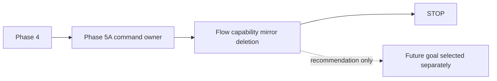

# Flow AI Builder Capability Refactor Plan

## Five-line TL;DR

1. Phase 4 Flow AI Builder runtime deletion and Phase 5A Assistant update command ownership are complete.
2. Keep this document as the phase-order and merge-gate packet; do not duplicate detailed slice design here.
3. Treat PR #480 and Dify as references, not architectures to copy.
4. Every implementation slice must delete a named duplicate owner or remove a named wrong-layer dependency in the same migration.
5. The Flow capability mirror deletion slice is complete; do not implement shared descriptors, MCP adapters, or platform capability registries without a new explicit goal.

## Document Precedence

This packet owns **implementation order, gates, and stop conditions**.

Current status: Phase 5A implemented only the Assistant-owned update command
boundary. A later explicit capability-deduplication slice deleted the
Builder-local step capability mirror and made the Flow Capability Manifest the
single owner for those read-only Flow facts. A later narrow cleanup reused the
existing `RuntimeToolCall` protocol for proposal dispatch, proposal retry, and
proposal submission instead of inventing another provider adapter. A later
deletion slice removed the obsolete model-visible ask/confirm tool runtime.
None of these slices started shared descriptors, MCP adapters, internal
Builder-to-MCP calls, PR #480 cherry-picks, or generated-client-visible API
changes. The detailed Phase 5A evidence lives in
[Flow AI Builder Phase 4 Completion And Phase 5A Gate](./flow-ai-builder-phase4-completion-and-phase5a-gate.md).

Related docs keep their existing ownership:

- [Eneo Capabilities And MCP Architecture Opinion](./eneo-capabilities-mcp-architecture-opinion.md)
  owns the long-term capability/MCP rationale.
- [Flow Builder Ask/Confirm Runtime Deletion Packet](./flow-builder-delete-obsolete-ask-confirm-runtime-packet-2026-06-25.md)
  owns the current ask/confirm runtime deletion evidence and next go/no-go recommendation.
- [Flow Builder Proposal Request Boundary Packet](./flow-builder-proposal-request-boundary-packet-2026-06-25.md)
  owns the proposal message/tool-choice boundary follow-up and remaining residuals.
- [Flow AI Builder Phase 4 Completion And Phase 5A Gate](./flow-ai-builder-phase4-completion-and-phase5a-gate.md)
  owns final Phase 4 completion evidence, retry-loop disposition, and the Phase 5A go/no-go packet.
- This document owns the active goal sequence: Phase 4 completion, Phase 5A command ownership, Flow capability mirror deletion, then stop.

If a later decision record supersedes any of these, it should explicitly say so and delete or shrink stale guidance in the same change.

## Architecture Rule

```text
Eneo capabilities describe what is possible.
Domain commands decide and perform what is allowed.
Adapters expose them.
MCP never becomes the owner.
```

## Current Evidence For The Active Goal

| Finding | Evidence |
| --- | --- |
| Proposal completion already has a current provider boundary. | `backend/src/eneo/flows/ai_builder/ai_builder_litellm_completion.py:94` defines `call_proposal_completion`. |
| The first Phase 4 slice was dependency inversion, not deletion of the executor. | `call_proposal_completion` survives at `backend/src/eneo/flows/ai_builder/ai_builder_litellm_completion.py:94`; active submission still calls it at `backend/src/eneo/flows/ai_builder/ai_builder_proposal_submission.py:261`; the usage-tracked factory wraps it at `backend/src/eneo/flows/ai_builder/ai_builder_litellm_completion.py:143`. |
| `ProposalTurnContext.completion_request(...)` is the existing typed request builder. | `backend/src/eneo/flows/ai_builder/ai_builder_proposal_tool_contracts.py:144`. |
| Active proposal generation exposes only the `propose_flow` schema. | `backend/src/eneo/flows/ai_builder/ai_builder_proposal_submission.py:160` builds the active schema list; `backend/src/eneo/flows/ai_builder/ai_builder_proposal_tool_contracts.py:71` owns forced `propose_flow` tool-choice construction. |
| Obsolete ask/confirm model-visible tool runtime is deleted. | `backend/tests/unittests/flows/ai_builder/test_ai_builder_import_ownership.py:89` lists the deleted runtime paths and `backend/tests/unittests/flows/ai_builder/test_ai_builder_import_ownership.py:869` enforces they stay absent. |
| Flow Capability Manifest already owns engine feature truth. | `backend/src/eneo/flows/flow_capability_manifest.py:121` defines the runtime-input mapping, `backend/src/eneo/flows/flow_capability_manifest.py:496` defines final-output artifact mapping, and `backend/src/eneo/flows/flow_capability_manifest.py:511` onward owns step I/O, document generation, and citation predicates. |
| Builder now consumes FCM facts directly instead of a Builder-local mirror. | `backend/src/eneo/flows/ai_builder/ai_builder_discovery_flow_defaults.py:17` imports FCM constants/functions, and `backend/src/eneo/flows/ai_builder/ai_builder_discovery_flow_defaults.py:101` stores typed Flow enums in the discovery signature. |
| Flow authoring already has the command shape we want to reuse, not generalize. | `backend/src/eneo/flows/application/flow_authoring_command.py:127` owns preview/prepare/apply through `FlowAuthoringCommandService`. |
| Flow-managed Assistant mutation is already blocked outside Flow. | `backend/src/eneo/assistants/assistant_service.py:117` rejects direct Flow-managed assistant mutation. |
| Standalone Assistant update is production-risky and broad. | `backend/src/eneo/assistants/assistant_service.py:489` starts a large optional-argument update path with permission, governance, resource, prompt, and persistence behavior. |
| Assistant prompt clearing already had a tri-state bug class. | `backend/src/eneo/assistants/assistant_service.py:601` documents the empty-string prompt clear regression. |
| Governance and knowledge/MCP exclusivity live in Assistant update today. | `backend/src/eneo/assistants/assistant_service.py:731` and `backend/src/eneo/assistants/assistant_service.py:761`. |
| PR #480 is available locally as source material. | Git refs `github-pr/480/base` and `github-pr/480/head` exist locally. |

## Accepted Long-Term Direction

Use the long-term direction from the capability/MCP opinion doc:

- make Eneo capability-addressable, not MCP-first;
- keep feature manifests, command/query contracts, scoped availability, and adapter/tool exposure separate;
- use MCP as an external adapter only;
- do not copy PR #480's fused registry/handler/MCP-loopback shape;
- do not copy Dify native graph JSON generation, repair stack, Graphon runtime, loops, or branching;
- use Dify only as reference for compact dynamic projection plus authoritative server-side validation.

Do not repeat those decisions in implementation slices. Each slice should name the duplicate owner it deletes or the wrong-layer dependency it removes, plus the canonical owner that remains.

## Phase Order



This document must not declare the order of future implementation phases.
The Phase 5A completion packet owns the next go/no-go recommendation.

## Phase 4 Scope

Phase 4 may touch only Flow AI Builder runtime/planner/proposal code and tests unless a direct shared owner requires a narrow dependency update.

### Implemented Phase 4 Source Slices

The completion packet records the before/after metrics and final disposition.
This section keeps the active plan aligned with source reality.

| Slice | Canonical owner after Phase 4 | Deletion / consolidation |
| --- | --- | --- |
| Shared planner/proposal provider completion | `ai_builder_litellm_completion.py` | Collapsed separate planner/proposal completion modules into one provider boundary. |
| Server-owned turn decisions | `ai_builder_server_decision_dispatch.py` and `ai_builder_turn_controller.py` | Deleted the former `PlannerOutput` action runtime (`ai_builder_orchestrator.py`, `ai_builder_planner_turn.py`, `ai_builder_structured_turn.py`, `ai_builder_orchestration_pipeline.py`, and response-format/normalizer/dispatcher adapters). Deterministic questions, architecture commits, and requirements confirmation now dispatch directly. |
| Generic repair wrapper | Deleted | Removed the broad repair wrapper module; proposal-specific repair remains under the proposal owners, and deterministic server decisions no longer use a planner repair loop. |
| Proposal repair runtime wrapper | Deleted | Carried proposal retry through `ProposalTurnContext` instead of a parallel wrapper. |
| Model-visible ask/confirm runtime | Deleted | Removed the obsolete `ask_structured_question` and `confirm_requirements` tool schemas, parsers, processor dispatch, question-recovery runtime, and confirm-requirements runtime after server-owned decisions made them unreachable. |

The current ask/confirm deletion evidence is documented in
[Flow Builder Ask/Confirm Runtime Deletion Packet](./flow-builder-delete-obsolete-ask-confirm-runtime-packet-2026-06-25.md).

### Candidate Follow-up Slices

These are candidates, not automatic work. Each requires preflight proof of a canonical replacement before implementation.

| Candidate | Required Deletion Gate |
| --- | --- |
| Proposal completion callable cleanup | Skipped for Phase 4. Reassess `ProposalCompletionFn` only if replacing it reduces total production code and ownership-guard complexity. |
| Planner orchestration repair consolidation | Completed for retry execution. Do not fold planner prompt/message helpers further unless that deletes more than it moves. |
| Streamed repair skeleton duplication | Reduced. Proposal retry remains because malformed proposal generation is still model-owned. Ask/confirm repair skeletons were deleted with the obsolete model-visible runtime. |
| Builder step capability duplicates | Completed as a Flow capability-deduplication slice: `ai_builder_step_capabilities.py` was deleted, FCM owns the read-only capability facts, and Builder consumers translate only at their own boundary. |
| Prompt hard-rule duplication | Defer unless every touched rule stays within Builder runtime/planner ownership. Future capability work should enforce: every model-visible capability claim must have canonical enforcement. |
| Capability projection complexity | Completed for the old planner prompt path: `ai_builder_capability_projection.py` was deleted, and surviving Builder turn/proposal paths consume server-owned state and FCM facts at their own boundary. |
| Proposal/preparation consolidation | In progress. Flow application owns shared existing-step-ref validation; terminal-output alignment is a pure Flow authoring validator branch triggered by Builder conversation context today; output-contract prompt normalization and resource alias repair stay Builder-owned. The old create dataflow and step-skeleton materializers are deleted; `FlowAssemblyPlan` is the create-mode replacement, while edit/add-step compilation still owns `NewStepDraft`/`MaterializedAddStep` until a focused replacement deletes them. |

## Phase 4 Completion Criteria

Phase 4 is complete only when these requirements are proven against the current
worktree and recorded in the final packet.

| Metric | Phase 4 completion requirement |
| --- | --- |
| Direct proposal-provider owner | Only the current proposal-completion provider boundary owns provider proposal completion. |
| Obsolete ask/confirm runtime | Deleted modules, schema builders, parsers, and processor dispatch stay absent. |
| Usage accounting | One owner records proposal-completion usage; repair count remains preserved. |
| Retry ownership | The final packet lists each remaining retry loop by file/function and records either the product-visible retry semantics plus guard test, or the consolidation/deletion commit. |
| Phase 4 modules | Explicit keep/delete disposition exists for planner, question recovery, proposal retry, and orchestration pipeline. |
| Complexity | Before/after production file count, production LOC, `dict[str, Any]` count, and direct provider-caller count are recorded. |
| Documentation | This plan and the question-recovery boundary doc match the actual post-change symbols. |
| Baseline failures | Any pre-existing failure claim records baseline SHA, exact command, failing node ids, and output artifact or checksum. |
| Stop | [Flow AI Builder Phase 4 Completion And Phase 5A Gate](./flow-ai-builder-phase4-completion-and-phase5a-gate.md) is written; no Phase 5 implementation has started. |

Current Phase 4 status: source slices are complete. The stop gate is this plan
plus the final completion packet.

## Phase 4 Acceptance Gates

- No Flow runtime/API/persistence/XYFlow changes.
- No Phase 5A Assistant configuration implementation under the Phase 4 goal.
- No shared descriptor layer.
- No MCP adapter, MCP Apps, internal Builder-to-MCP calls, tool search, AI SDK, LangGraph, Dify/Graphon runtime, loops, or branching.
- Every code slice names:
  - what duplicate owner it deletes/shrinks or what wrong-layer dependency it removes;
  - the canonical owner that remains;
  - the behavior tests that protect the user-visible behavior.
- Focused tests must include the failure-mode guards owned by the boundary doc.
- Pyright and ruff pass for touched backend files.
- Broader Flow AI Builder tests pass before completion, or failures are proven pre-existing with command output.

## Phase 5A Go/No-Go Packet

The packet is the stop condition after Phase 4. It must decide whether to start canonical Assistant configuration as a future goal. It must not implement that future goal.

Required facts:

| Topic | Question To Answer |
| --- | --- |
| Caller matrix | Which HTTP/UI/service paths call `AssistantService.update_assistant` and related mutation methods today? |
| Audit owner | Where are Assistant mutation audit facts emitted today: service, router, decorator, repository, or missing? |
| Revision/concurrency | Does Assistant have a revision or optimistic-concurrency field today? |
| Idempotency | Is any Assistant update idempotency currently enforced? |
| Governance parity | Which governance checks must survive a future command service? |
| Flow-managed boundary | Which current checks already prevent standalone mutation of Flow-managed assistants? |
| PR #480 reuse | Which ideas can be reused without importing fused registry/MCP-loopback architecture? |
| Deletion targets | Which optional-argument, adapter-specific, or duplicated mutation paths could a Phase 5A refactor delete? |
| Tests | Which red tests must exist before Phase 5A source changes? |
| Risk | Which production surfaces make Phase 5A higher-risk than Flow-only work? |

Non-binding sketches may include:

- possible `AssistantExecutionSpec`;
- possible tri-state patch shape;
- possible inspect/prepare/preview/apply service shape;
- possible reuse boundary for Flow materialization.

These sketches are not implementation contracts. Future Phase 5A must design them under its own goal and tests.

## PR #480 Use Rule

Do not cherry-pick PR #480 broadly.

Use it as source material for:

- typed input models;
- server-bound target identity;
- confirmation before mutation;
- service reuse;
- schema derivation.

Do not carry forward as canonical:

- fused descriptor/handler/permission/audit/localization/form rendering;
- one MCP tool per setting as the authoritative write API;
- native Eneo loopback MCP;
- process-local elicitation as product state;
- adapter-owned audit;
- untyped `dict[str, Any]` capability result payloads;
- per-field MCP tools as the canonical Assistant write API;
- confirmation inside an apply transaction; confirmation must happen before
  apply opens a write transaction;
- independent Assistant-tool mutation of Flow-managed Assistants.

## Merge Gate

```text
A capability abstraction does not land unless the same migration:
1. deletes a named duplicate behavioral owner;
2. leaves no production dual path or compatibility shim;
3. reduces the number of modules, business-rule implementations, or untyped boundaries;
4. moves meaningful behavior tests to the canonical owner;
5. leaves adapters with translation only;
6. documents the net production LOC/file/owner delta.
```

This gate applies to code and durable docs. Do not add broad architecture documents that do not sharpen implementation order, delete stale guidance, or become an accepted decision record.

For new capability abstractions, this is a stricter bar than ordinary Phase 4
consolidation: removing a wrong-layer dependency can justify a narrow cleanup
slice, but a new capability abstraction must delete or consolidate an existing
duplicate owner in the same migration.

### Completed Flow Capability Mirror Deletion

The capability mirror deletion slice satisfied the merge gate without creating
a new capability abstraction:

| Gate | Result |
| --- | --- |
| Duplicate owner deleted | Deleted `backend/src/eneo/flows/ai_builder/ai_builder_step_capabilities.py`. |
| No compatibility shim | No replacement re-export or permissive string helper remains. |
| Canonical owner | `flow_capability_manifest.py` owns runtime input mode, final artifact, document generation, step I/O, and citation capability facts. |
| Adapters translated only | Builder discovery and transition policy consume FCM constants/functions and keep enum conversion local to Builder boundaries. |
| Behavior tests moved | FCM owner tests pin runtime input, final artifact, document generation, step I/O, and citation behavior; Builder tests pin discovery profile and citation normalization outcomes. |
| Net production delta | 1 production file deleted; 98 net production lines removed (`53` added / `151` deleted before docs). |

## Next Step After Capability Mirror Deletion

Do not start shared descriptors, MCP adapters, platform capability registries,
or Builder-to-MCP execution without a new explicit goal.

The Phase 5A completion record is
[Flow AI Builder Phase 4 Completion And Phase 5A Gate](./flow-ai-builder-phase4-completion-and-phase5a-gate.md).
It records that the Assistant command owner now exists and that MCP/capability
adapter work remains intentionally unstarted. This document now additionally
records that the Flow capability mirror deletion prerequisite is complete.
