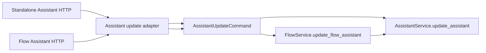
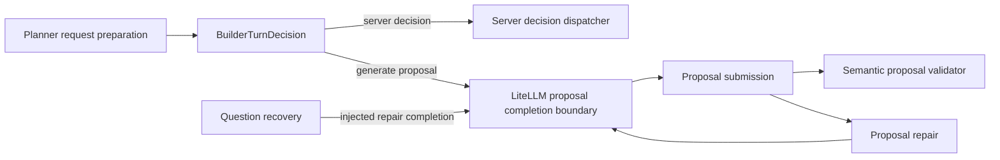

# Flow AI Builder Phase 4 Completion And Phase 5A Gate

## Five-line TL;DR

1. Phase 4 source work is complete: deterministic server decisions now use one server-owned dispatcher, while proposal generation keeps one LiteLLM/proposal boundary.
2. The source delta from `61facd8a3` to current source deleted 16 Builder production files, 5,415 Builder production LOC, 56 `dict[str, Any]` occurrences, and 95 `Any` tokens.
3. The deleted PlannerOutput/action runtime no longer asks an LLM to choose backend-owned questions, architecture commits, or requirements confirmation.
4. Phase 5A now has one Assistant-owned update command boundary; MCP/capability adapters remain out of scope.
5. Do not cherry-pick PR #480 broadly; reuse only the ideas that help create one typed Assistant command owner.

## Current Phase 5A Status

This document originally ended Phase 4 with a **conditional go for Phase 5A
design and red tests only**. A later explicit Phase 5A goal implemented the
small command-owner slice described by that gate. The historical gate remains
below for decision context, but its "do not implement under this Phase 4 goal"
wording is no longer the current state.

| Concept | Current owner | Evidence |
| --- | --- | --- |
| Assistant update command shape | `AssistantUpdateCommand` in `intric.assistants` | `backend/src/intric/assistants/assistant_update.py` |
| Standalone and Flow request conversion | Assistant API adapter with two thin wrappers over one shared extractor | `backend/src/intric/assistants/api/assistant_update_adapter.py` |
| Assistant update execution | `AssistantService.update_assistant(...)` accepts one command and explicit caller mode | `backend/src/intric/assistants/assistant_service.py` |
| Flow-managed ownership | `FlowService.update_flow_assistant(...)` keeps Flow ownership checks and forwards `AssistantUpdateCaller.FLOW_MANAGED` | `backend/src/intric/flows/application/flow_service.py` |
| Deleted duplicate owner | Former Flow-owned update command and adapter removed | `backend/src/intric/flows/application/flow_assistant_update.py`, `backend/src/intric/flows/api/flow_assistant_update_adapter.py` |



Phase 5A deliberately did **not** add MCP adapters, capability registries,
internal Builder-to-MCP calls, PR #480 code, public API shape changes, or DB
migrations. It only made the existing Assistant mutation semantics explicit and
reusable.

## Verdict

Phase 4 can stop after this packet. The remaining custom runtime is not gone,
but the broad deletion gate has been met without a weaker abstraction:

| Area | Phase 4 disposition | Evidence |
| --- | --- | --- |
| Planner provider boundary | Deleted for deterministic server decisions. Proposal completions still use `ai_builder_litellm_completion.py`; classifier/adjudication remain separate features. | `backend/src/intric/flows/ai_builder/ai_builder_litellm_completion.py`, `backend/src/intric/flows/ai_builder/ai_builder_slot_classifier.py`, `backend/src/intric/flows/ai_builder/ai_builder_semantic_adjudication.py` |
| Server decision owner | Added. Questions, architecture commits, and requirements confirmation dispatch directly from `BuilderTurnDecision`; the former `PlannerOutput` action runtime is gone. | `backend/src/intric/flows/ai_builder/ai_builder_turn_controller.py`, `backend/src/intric/flows/ai_builder/ai_builder_server_decision_dispatch.py` |
| Question recovery provider dependency | Removed. Question recovery receives a tracked completion callable and builds requests through `ProposalTurnContext`. | `backend/src/intric/flows/ai_builder/ai_builder_question_recovery.py:81`, `backend/src/intric/flows/ai_builder/ai_builder_question_recovery.py:294` |
| Proposal repair provider wrapper | Removed. Repair now carries `ProposalTurnContext`; the former repair runtime wrapper is gone. | `backend/src/intric/flows/ai_builder/ai_builder_proposal_repair.py:64`, `backend/src/intric/flows/ai_builder/ai_builder_proposal_repair.py:77` |
| Proposal submission | Kept as the active proposal composition owner. | `backend/src/intric/flows/ai_builder/ai_builder_proposal_submission.py:260` |
| Pydantic AI / AI SDK / LangGraph / MCP | Not adopted. No framework deleted enough named code to earn the migration in Phase 4. | Completion boundary and typed turn runner are local and smaller than a framework adapter. |



## Before / After Metrics

Metrics were measured for production Python files under
`backend/src/intric/flows/ai_builder`.

| Metric | Baseline `61facd8a3` | Current source | Delta |
| --- | ---: | ---: | ---: |
| Production files | 139 | 123 | -16 |
| Production LOC | 52,340 | 46,925 | -5,415 |
| `dict[str, Any]` occurrences | 286 | 230 | -56 |
| `Any` token occurrences | 558 | 463 | -95 |
| `acompletion(...)` calls under AI Builder | 4 | 4 | 0 |
| `call_proposal_completion(...)` references | 6 | 3 | -3 |

The `dict[str, Any]` and `Any` numbers are raw token occurrence counts from
`git grep -h -o`, not unique matching line counts. The `acompletion(...)` count
staying flat is intentional: Phase 4 consolidated planner/proposal completion
ownership but did not fold independent classifier and semantic-adjudication
features into the proposal runtime.

Metric command:

```bash
for ref in 61facd8a3 HEAD; do
  files=$(git ls-tree -r --name-only "$ref" -- backend/src/intric/flows/ai_builder | rg '\.py$' | sort || true)
  file_count=$(printf '%s\n' "$files" | sed '/^$/d' | wc -l | tr -d ' ')
  loc=0
  while IFS= read -r f; do
    [ -z "$f" ] && continue
    n=$(git show "$ref:$f" | wc -l | tr -d ' ')
    loc=$((loc + n))
  done <<EOF
$files
EOF
  dict_count=$(git grep -h -o 'dict\[str, Any\]' "$ref" -- backend/src/intric/flows/ai_builder 2>/dev/null | wc -l | tr -d ' ')
  any_count=$(git grep -h -o '\bAny\b' "$ref" -- backend/src/intric/flows/ai_builder 2>/dev/null | wc -l | tr -d ' ')
  acomp_count=$(git grep -n 'acompletion(' "$ref" -- backend/src/intric/flows/ai_builder 2>/dev/null | wc -l | tr -d ' ')
  proposal_call_count=$(git grep -n 'call_proposal_completion(' "$ref" -- backend/src/intric/flows/ai_builder 2>/dev/null | wc -l | tr -d ' ')
  printf '%s files=%s loc=%s dict_str_any=%s any=%s acompletion=%s proposal_completion_refs=%s\n' \
    "$ref" "$file_count" "$loc" "$dict_count" "$any_count" "$acomp_count" "$proposal_call_count"
done
```

Captured output:

```text
61facd8a3 files=139 loc=52340 dict_str_any_occurrences=286 any_occurrences=558 acompletion_calls=4 proposal_completion_refs=6
HEAD files=123 loc=46925 dict_str_any_occurrences=230 any_occurrences=463 acompletion_calls=4 proposal_completion_refs=3
```

Name-status verification from `61facd8a3` to current source shows five deleted
Builder runtime/capability families plus the deleted PlannerOutput action
runtime, for net -16 production files. Renames do not affect the net count.

```text
D backend/src/intric/flows/ai_builder/ai_builder_accepted_action_rendering.py
D backend/src/intric/flows/ai_builder/ai_builder_capability_projection.py
D backend/src/intric/flows/ai_builder/ai_builder_dispatcher.py
D backend/src/intric/flows/ai_builder/ai_builder_knowledge_pack.py
D backend/src/intric/flows/ai_builder/ai_builder_knowledge_pack_core.py
D backend/src/intric/flows/ai_builder/ai_builder_knowledge_pack_edit.py
D backend/src/intric/flows/ai_builder/ai_builder_knowledge_pack_protocol.py
A backend/src/intric/flows/ai_builder/ai_builder_litellm_completion.py
D backend/src/intric/flows/ai_builder/ai_builder_planner_completion.py
D backend/src/intric/flows/ai_builder/ai_builder_proposal_completion.py
D backend/src/intric/flows/ai_builder/ai_builder_proposal_repair_runtime.py
D backend/src/intric/flows/ai_builder/ai_builder_repair.py
D backend/src/intric/flows/ai_builder/ai_builder_step_capabilities.py
D backend/src/intric/flows/ai_builder/ai_builder_structured_turn.py
D backend/src/intric/flows/ai_builder/ai_builder_orchestration_pipeline.py
D backend/src/intric/flows/ai_builder/ai_builder_orchestrator.py
D backend/src/intric/flows/ai_builder/ai_builder_planner_action_dispatch.py
D backend/src/intric/flows/ai_builder/ai_builder_planner_output_normalizer.py
D backend/src/intric/flows/ai_builder/ai_builder_planner_turn.py
D backend/src/intric/flows/ai_builder/ai_builder_response_format.py
A backend/src/intric/flows/ai_builder/ai_builder_server_decision_dispatch.py
R backend/src/intric/flows/ai_builder/ai_builder_create_outline.py -> backend/src/intric/flows/ai_builder/ai_builder_proposal_intent.py
R backend/src/intric/flows/ai_builder/ai_builder_server_actions.py -> backend/src/intric/flows/ai_builder/ai_builder_turn_controller.py
```

## Retry Loop Ownership Matrix

The Ponytail/deletion question for each loop was: does this loop still buy a
concrete product-visible behavior, or is it only a custom runtime fossil? The
loops below stay because deleting or folding them now would hide distinct
failure modes behind a generic retry abstraction.

| Loop | Canonical owner | Kept behavior | Guard tests | Disposition |
| --- | --- | --- | --- | --- |
| Planner structured turn semantic retry | Deleted | Server-owned decisions no longer ask an LLM to choose `ask_question`, `commit_architecture`, or `confirm_requirements`, so semantic retry is not a product behavior. | `backend/tests/unittests/flows/ai_builder/test_ai_builder_server_decision_dispatch.py` | Delete completed. |
| Planner parse repair loop | Deleted | The deleted `PlannerOutput` JSON contract no longer exists. Proposal tool repair remains below. | `backend/tests/unittests/flows/ai_builder/test_ai_builder_server_decision_dispatch.py`, `backend/tests/unittests/flows/ai_builder/test_ai_builder_proposal_repair.py` | Delete completed. |
| Proposal self-correction loop | `_request_self_correction_events(...)` | Proposal tool validation feedback streams to the user, retries with bounded attempts, and preserves usage accounting. | `backend/tests/unittests/flows/ai_builder/test_ai_builder_proposal_repair.py:640`, `backend/tests/unittests/flows/ai_builder/test_ai_builder_proposal_repair.py:650`, `backend/tests/unittests/flows/ai_builder/test_ai_builder_proposal_repair.py:664`, `backend/tests/unittests/flows/ai_builder/test_ai_builder_proposal_repair.py:1234` | Keep. Product-specific streamed repair, not planner generic retry. |
| Proposal forced-tool retry after text | `_execute_forced_tool_retry(...)` and `run_forced_tool_retry_after_text(...)` | Text-only proposal output gets one forced tool retry or direct JSON-text parsing, with visible repair events. | `backend/tests/unittests/flows/ai_builder/test_ai_builder_proposal_repair.py:281`, `backend/tests/unittests/flows/ai_builder/test_ai_builder_proposal_repair.py:398`, `backend/tests/unittests/flows/ai_builder/test_ai_builder_proposal_repair.py:434`, `backend/tests/unittests/flows/ai_builder/test_ai_builder_proposal_repair.py:905` | Keep. Distinct proposal-tool failure mode. |
| Question recovery continuation | `stream_structured_question_tool_call(...)` | A recovered backend-owned question may continue once into a non-question tool dispatch, and repeated questions exhaust cleanly. | `backend/tests/unittests/flows/ai_builder/test_ai_builder_question_recovery.py:191`, `backend/tests/unittests/flows/ai_builder/test_ai_builder_question_recovery.py:222`, `backend/tests/unittests/flows/ai_builder/test_ai_builder_question_recovery.py:359`, `backend/tests/unittests/flows/ai_builder/test_ai_builder_question_recovery.py:578` | Keep. It owns user-visible recovery stream semantics. |
| Confirm-requirements validation follow-up | `process_confirm_requirements(...)` and `build_confirm_requirements_retry_config(...)` | Confirmation parsing/validation feedback can produce a follow-up event before final dispatch. | `backend/tests/unittests/flows/ai_builder/test_ai_builder_confirm_requirements.py:181`, `backend/tests/unittests/flows/ai_builder/test_ai_builder_confirm_requirements.py:197`, `backend/tests/unittests/flows/ai_builder/test_ai_builder_confirm_requirements.py:239`, `backend/tests/unittests/flows/ai_builder/test_ai_builder_confirm_requirements.py:328` | Keep. Cross-module streamed repair skeleton is a Phase 5+ candidate, not a Phase 4 cleanup. |

### Deferred Duplication

`ai_builder_proposal_repair`, `ai_builder_question_recovery`, and
`ai_builder_confirm_requirements` still share a visible skeleton: stream a
`repairing` event, build a retry or follow-up invocation, and translate
tool/validation feedback into event dictionaries. That is real duplication,
but it is not a safe Phase 4 fold because the product semantics differ by tool:

- proposal repair owns forced proposal-tool invocation and JSON-text fallback;
- question recovery owns backend-owned follow-up questions and repeated-question exhaustion;
- confirm requirements owns confirmation parsing and validation follow-up.

Phase 5+ may replace that skeleton only if the same change deletes the
remaining event/message dictionary residuals listed below and leaves one typed
streamed-repair contract that reuses the existing `RuntimeToolCall` boundary.

## Module Disposition

| Module | Keep / delete | Reason |
| --- | --- | --- |
| `ai_builder_litellm_completion.py` | Keep | One owner for planner/proposal provider normalization and proposal usage tracking. |
| `ai_builder_server_decision_dispatch.py` | Keep | Direct persistence/event owner for server-selected question, architecture commit, and requirements confirmation turns. |
| `ai_builder_structured_turn.py` | Delete completed | Former typed planner turn runner no longer earns a source file after server decisions stopped flowing through `PlannerOutput`. |
| `ai_builder_orchestration_pipeline.py` | Delete completed | Former planner adapter was only used by the deleted action planner runtime. |
| `ai_builder_orchestrator.py` | Delete completed | Former model-visible action contract replaced by `BuilderTurnDecision` plus proposal-only tool calls. |
| `ai_builder_repair.py` | Delete completed | Former generic repair wrapper no longer earns a source file. |
| `ai_builder_proposal_repair_runtime.py` | Delete completed | Former proposal repair runtime wrapper no longer earns a source file. |
| `ai_builder_proposal_tool_contracts.py` | Keep | `ProposalTurnContext` and `ProposalCompletionRequest` are the current typed boundary. `ProposalCompletionFn` remains because replacing it is lateral churn today. |
| `ai_builder_proposal_submission.py` | Keep | Active proposal composition and first-pass proposal completion owner. |
| `ai_builder_proposal_repair.py` | Keep | Product-specific streamed proposal repair owner. |
| `ai_builder_question_recovery.py` | Keep | Product-specific backend-owned question recovery owner. |
| `ai_builder_confirm_requirements.py` | Keep | Product-specific confirmation parsing and follow-up owner. |

## Typed Residuals

Phase 4 improved typing but did not pretend the runtime is fully typed. These
residuals are the Phase 5+ deletion target, not a reason to keep editing Phase
4 indefinitely.

| Residual | Evidence | Phase 5+ target |
| --- | --- | --- |
| Provider message/tool schema bags | `backend/src/intric/flows/ai_builder/ai_builder_proposal_tool_contracts.py:47`, `backend/src/intric/flows/ai_builder/ai_builder_proposal_tool_contracts.py:48`, `backend/src/intric/flows/ai_builder/ai_builder_proposal_tool_contracts.py:50` | Typed provider message/tool schema boundary, only if it deletes local `dict[str, Any]` construction. |
| Dynamic tool choice shape | `backend/src/intric/flows/ai_builder/ai_builder_proposal_tool_contracts.py:53` | Narrow value object or provider-owned schema wrapper. |
| Stream event dictionaries | `backend/src/intric/flows/ai_builder/ai_builder_proposal_tool_contracts.py:68`, `backend/src/intric/flows/ai_builder/ai_builder_proposal_tool_contracts.py:69`, `backend/src/intric/flows/ai_builder/ai_builder_proposal_repair.py:53`, `backend/src/intric/flows/ai_builder/ai_builder_question_recovery.py:78` | One typed Builder event contract if it deletes all tuple/dict event variants. |
| Repair message lists | `backend/src/intric/flows/ai_builder/ai_builder_proposal_repair.py:80`, `backend/src/intric/flows/ai_builder/ai_builder_question_recovery.py:73` | Typed repair transcript if it replaces provider-shaped message dicts. |

Resolved after the original packet: proposal dispatch, proposal repair,
proposal submission, and question recovery now share the existing
`RuntimeToolCall` protocol. Evidence: `backend/src/intric/flows/ai_builder/ai_builder_conversation_metadata.py:269`,
`backend/src/intric/flows/ai_builder/ai_builder_proposal_processor.py:126`,
`backend/src/intric/flows/ai_builder/ai_builder_proposal_repair.py:65`,
`backend/src/intric/flows/ai_builder/ai_builder_proposal_submission.py:175`,
and `backend/src/intric/flows/ai_builder/ai_builder_question_recovery.py:64`.

## Validation Record

The source slices were validated before this packet:

| Command | Result |
| --- | --- |
| `docker exec -u vscode eneo-flows-clean_devcontainer-eneo-1 bash -lc 'export PATH=/home/vscode/.local/bin:/home/vscode/.bun/bin:$PATH && cd /workspace/backend && uv run pytest tests/unittests/flows/ai_builder'` | `2376 passed` |
| `docker exec -u vscode eneo-flows-clean_devcontainer-eneo-1 bash -lc 'export PATH=/home/vscode/.local/bin:/home/vscode/.bun/bin:$PATH && cd /workspace/backend && uv run pytest tests/integration/flows/ai_builder'` | `3 passed, 12 deselected` |
| `docker exec -u vscode eneo-flows-clean_devcontainer-eneo-1 bash -lc 'export PATH=/home/vscode/.local/bin:/home/vscode/.bun/bin:$PATH && cd /workspace/backend && uv run ruff check src/intric/flows/ai_builder tests/unittests/flows/ai_builder tests/integration/flows/ai_builder'` | Passed |
| `ENEO_DEVCONTAINER_NAME=eneo-flows-clean_devcontainer-eneo-1 backend/scripts/run_pyright_in_devcontainer.sh src/intric/flows/ai_builder/ai_builder_planner.py src/intric/flows/ai_builder/ai_builder_planner_request_preparation.py src/intric/flows/ai_builder/ai_builder_server_decision_dispatch.py src/intric/flows/ai_builder/ai_builder_turn_controller.py src/intric/flows/ai_builder/ai_builder_planner_failure_events.py src/intric/flows/ai_builder/ai_builder_telemetry.py src/intric/flows/ai_builder/ai_builder_service.py` | `0 errors, 0 warnings, 0 informations` |
| Claude peer loop, `flow-builder-control-plane-direct-dispatch`, iteration 2 | Blocked by Claude monthly spend limit; artifact saved under `.codex/artifacts/`. |
| Antigravity peer loop, `flow-builder-direct-server-decision-dispatch`, iteration 3 | `VERDICT: green`, `GREEN_LIGHT: yes`, `MIN_SCORE: 9` |
| Focused tests listed in the question-recovery boundary doc | Passed during the relevant source slice. |
| Import ownership tests for completion boundary | Passed during the relevant source slice. |
| `docker exec eneo-flows-clean_devcontainer-eneo-1 sh -lc 'cd /workspace/backend && .venv/bin/ruff check src/intric/flows/ai_builder/ai_builder_conversation_metadata.py src/intric/flows/ai_builder/ai_builder_proposal_processor.py src/intric/flows/ai_builder/ai_builder_proposal_repair.py src/intric/flows/ai_builder/ai_builder_proposal_submission.py src/intric/flows/ai_builder/ai_builder_question_recovery.py'` | Passed for the RuntimeToolCall cleanup. |
| `docker exec eneo-flows-clean_devcontainer-eneo-1 sh -lc 'cd /workspace/backend && .venv/bin/python -m pytest tests/unittests/flows/ai_builder/test_ai_builder_conversation_metadata.py tests/unittests/flows/ai_builder/test_ai_builder_proposal_submission.py tests/unittests/flows/ai_builder/test_ai_builder_proposal_processor.py tests/unittests/flows/ai_builder/test_ai_builder_proposal_repair.py tests/unittests/flows/ai_builder/test_ai_builder_question_recovery.py tests/unittests/flows/ai_builder/test_ai_builder_service.py -q'` | `177 passed` for the RuntimeToolCall cleanup. |

Direct pyright is now green for the changed deterministic-turn source files.
Broader strict-typing cleanup for proposal repair/submission remains a future
typed-residual target, not a blocker for this Phase 4 completion packet.

## Historical Phase 5A Go / No-Go Packet

### Verdict

**Conditional go for Phase 5A planning and red tests; no-go for immediate
implementation. This packet is not authorization to start Phase 5A source work.**

Under this Phase 4 goal, do not modify `backend/src/intric/assistants`,
Flow-managed assistant mutation code, MCP adapters, or generated API contracts
to implement the Assistant command owner. That requires a new explicit goal.

Phase 5A should design one canonical Assistant configuration command owner
before any MCP/tool/capability adapter. This is higher risk than Flow-only work
because standalone Assistants are production surfaces, while Flow AI Builder is
not.

### Caller Matrix

| Path | Current owner | Evidence | Phase 5A implication |
| --- | --- | --- | --- |
| Standalone assistant HTTP update | `assistant_router.update_assistant(...)` converts `AssistantUpdatePublic` into optional service arguments and emits audit. | `backend/src/intric/assistants/api/assistant_router.py:603`, `backend/src/intric/assistants/api/assistant_router.py:693`, `backend/src/intric/assistants/api/assistant_router.py:739` | Adapter should translate request to a command; audit ownership must be explicit. |
| Assistant service update | `AssistantService.update_assistant(...)` owns permission, governance, prompt/model/resource validation, and persistence. | `backend/src/intric/assistants/assistant_service.py:489`, `backend/src/intric/assistants/assistant_service.py:510`, `backend/src/intric/assistants/assistant_service.py:731`, `backend/src/intric/assistants/assistant_service.py:788` | This is the source material for the command owner; do not bypass it from tools. |
| Flow-managed assistant HTTP update | `flow_assistant_router.update_flow_assistant(...)` maps API input into `to_flow_assistant_update_command(...)` and calls Flow service. | `backend/src/intric/flows/api/flow_assistant_router.py:249`, `backend/src/intric/flows/api/flow_assistant_router.py:265`, `backend/src/intric/flows/api/flow_assistant_router.py:267` | Flow-managed writes must remain Flow-owned. |
| Flow service update | `FlowService.update_flow_assistant(...)` calls AssistantService with Flow-managed context. | `backend/src/intric/flows/application/flow_service.py:304`, `backend/src/intric/flows/application/flow_service.py:320` | Future Assistant commands need an explicit caller mode, not implicit bypass. |
| Flow draft materialization | `FlowDraftMaterializationExecutor` applies generated Flow assistant updates through Flow service. | `backend/src/intric/flows/application/flow_draft_materialization_executor.py:414` | Builder must continue applying AssistantSpec atomically with Flow authoring. |
| Standalone MCP server add/remove/config | Assistant router and service have direct MCP mutation methods. | `backend/src/intric/assistants/api/assistant_router.py:1388`, `backend/src/intric/assistants/api/assistant_router.py:1430`, `backend/src/intric/assistants/assistant_service.py:1856`, `backend/src/intric/assistants/assistant_service.py:1960`, `backend/src/intric/assistants/assistant_service.py:2027` | These are deletion candidates only after a command owner preserves permissions, audit, and Flow-managed rejection. |

### Audit Owner

Assistant audit is adapter-owned today:

| Action | Current evidence |
| --- | --- |
| Create standalone assistant | `backend/src/intric/assistants/api/assistant_router.py:176`, `backend/src/intric/assistants/api/assistant_router.py:180` |
| Update standalone assistant | `backend/src/intric/assistants/api/assistant_router.py:739`, `backend/src/intric/assistants/api/assistant_router.py:743` |
| Delete standalone assistant | `backend/src/intric/assistants/api/assistant_router.py:824`, `backend/src/intric/assistants/api/assistant_router.py:828` |
| Transfer standalone assistant | `backend/src/intric/assistants/api/assistant_router.py:1238`, `backend/src/intric/assistants/api/assistant_router.py:1242` |
| Publish standalone assistant | `backend/src/intric/assistants/api/assistant_router.py:1312`, `backend/src/intric/assistants/api/assistant_router.py:1316` |
| Add/remove MCP server | `backend/src/intric/assistants/api/assistant_router.py:1398`, `backend/src/intric/assistants/api/assistant_router.py:1406`, `backend/src/intric/assistants/api/assistant_router.py:1449`, `backend/src/intric/assistants/api/assistant_router.py:1455` |
| Flow-managed create/update/delete | `backend/src/intric/flows/api/flow_assistant_router.py:136`, `backend/src/intric/flows/api/flow_assistant_router.py:139`, `backend/src/intric/flows/api/flow_assistant_router.py:272`, `backend/src/intric/flows/api/flow_assistant_router.py:275`, `backend/src/intric/flows/api/flow_assistant_router.py:336`, `backend/src/intric/flows/api/flow_assistant_router.py:339` |

Phase 5A must choose deliberately: either keep audit in adapters and make
capability/MCP adapters emit the same facts, or move audit into a command
result/apply boundary. Do not let MCP own audit.

### Revision, Concurrency, And Idempotency

No explicit Assistant update revision, expected-version, or idempotency key was
found in the current Assistant mutation path. The only `version` hits under
`backend/src/intric/assistants` are retrieval/search API version parameters and
`updated_at` exposure, not optimistic update guards.

Evidence command:

```bash
rg -n "expected|revision|version|idempot|updated_at|with_for_update|FOR UPDATE|stale" \
  backend/src/intric/assistants backend/src/intric/database/tables/assistant_table.py -g '*.py'
```

Relevant hits include `updated_at` serialization in `assistant_factory.py` and
`assistant_models.py`, retrieval `version` parameters in `assistant_service.py`
and `assistant_router.py`, and one stale-model comment at
`backend/src/intric/assistants/assistant_service.py:1629`; none provides update
idempotency or optimistic concurrency.

Phase 5A red tests should pin one policy:

1. omitted field preserves existing value;
2. explicit `None` clears only fields where clearing is allowed;
3. UUID/non-null value changes the field;
4. stale expected revision rejects if Phase 5A introduces a revision;
5. repeated idempotency key does not double-apply if Phase 5A introduces idempotency.

### Governance Parity That Must Survive

| Governance rule | Evidence |
| --- | --- |
| Logging toggle requires admin. | `backend/src/intric/assistants/assistant_service.py:510` |
| Personal default assistant can only change model under `PERSONAL_CHAT`; broader edits need assistant edit permission. | `backend/src/intric/assistants/assistant_service.py:523`, `backend/src/intric/assistants/assistant_service.py:547` |
| Prompt changes run governance policy before prompt persistence. | `backend/src/intric/assistants/assistant_service.py:587`, `backend/src/intric/assistants/assistant_service.py:592` |
| Empty prompt text is a deliberate clear, not omission. | `backend/src/intric/assistants/assistant_service.py:601` |
| Completion model must be enabled in the space. | `backend/src/intric/assistants/assistant_service.py:625`, `backend/src/intric/assistants/assistant_service.py:630` |
| MCP servers must be tenant-enabled and, unless policy-governed, assigned to the assistant space. | `backend/src/intric/assistants/assistant_service.py:663`, `backend/src/intric/assistants/assistant_service.py:677`, `backend/src/intric/assistants/assistant_service.py:710` |
| Governance policy checks model/MCP changes. | `backend/src/intric/assistants/assistant_service.py:731` |
| Knowledge and MCP cannot both be active. | `backend/src/intric/assistants/assistant_service.py:761` |
| Space references are revalidated after mutation assembly. | `backend/src/intric/assistants/assistant_service.py:780` |

### Flow-managed Boundary

Standalone Assistant routes reject Flow-managed assistant mutations before
calling the standalone service path:

- `backend/src/intric/assistants/api/assistant_router.py:99`
- `backend/src/intric/assistants/api/assistant_router.py:620`
- `backend/src/intric/assistants/api/assistant_router.py:778`
- `backend/src/intric/assistants/api/assistant_router.py:1198`
- `backend/src/intric/assistants/api/assistant_router.py:1290`
- `backend/src/intric/assistants/api/assistant_router.py:1391`
- `backend/src/intric/assistants/api/assistant_router.py:1440`

Assistant service MCP mutation methods also reject Flow-managed assistants
directly:

- `backend/src/intric/assistants/assistant_service.py:117`
- `backend/src/intric/assistants/assistant_service.py:1856`
- `backend/src/intric/assistants/assistant_service.py:1960`
- `backend/src/intric/assistants/assistant_service.py:2027`

Phase 5A must close the remaining gap without creating a compatibility shim:
`AssistantService.update_assistant(...)` itself does not show a direct
`_reject_direct_flow_managed_assistant_mutation(...)` call at the start of the
update method. If a command owner becomes the canonical update path, it should
encode caller mode explicitly so standalone paths reject Flow-managed assistants
and Flow paths remain allowed.

### PR #480 Reuse Decision

Local refs exist:

- `refs/remotes/github-pr/480/base`
- `refs/remotes/github-pr/480/head`

Relevant PR #480 files include:

- `backend/src/intric/config_capabilities/capability.py`
- `backend/src/intric/config_capabilities/context.py`
- `backend/src/intric/config_capabilities/registry.py`
- `backend/src/intric/config_capabilities/capabilities/assistant_settings.py`
- `backend/src/intric/assistant_config_mcp/server.py`

Reuse ideas:

| Reuse | Evidence in PR #480 | Constraint for Phase 5A |
| --- | --- | --- |
| Pydantic input models for model-visible/configurable operations | `github-pr/480/head:backend/src/intric/config_capabilities/capabilities/assistant_settings.py:30`, `:34`, `:40`, `:47` | Inputs should feed an Assistant command owner, not one tool handler per field. |
| Server-bound target identity | `github-pr/480/head:backend/src/intric/assistant_config_mcp/server.py:6`, `:9`, `:10`, `:255` | Good constraint: tools should never accept arbitrary assistant ids from the model. |
| Confirmation before write transaction | `github-pr/480/head:backend/src/intric/assistant_config_mcp/server.py:154`, `:159`, `:250` | Keep confirmation outside apply. Do not hold transactions while asking the user. |
| Existing service reuse | `github-pr/480/head:backend/src/intric/config_capabilities/capabilities/assistant_settings.py:105`, `:117`, `:129`, `:140`, `:150` | Service reuse is good only after the service has a cleaner command contract. |
| Schema derivation from typed inputs | `github-pr/480/head:backend/src/intric/assistant_config_mcp/server.py:261`, `:268`, `:284` | Derive adapter schemas from command inputs after command ownership is settled. |

Do not reuse:

- fused descriptor/handler/permission/audit/localization/form-rendering capability objects;
- one MCP tool per setting as the canonical write API;
- process-local MCP elicitation as product state;
- adapter-owned mutation semantics;
- `dict[str, Any]` result payloads as the internal command contract;
- any path that lets Assistant tools mutate Flow-managed assistants outside Flow.

### Phase 5A Deletion Targets

Phase 5A should be accepted only if it deletes or consolidates at least one of these:

| Target | Why it matters |
| --- | --- |
| Optional-argument `AssistantService.update_assistant(...)` as the public write contract | It makes omission, clearing, and update semantics hard to audit and easy to drift. |
| Router-side field conversion duplicated across standalone, Flow-managed, and future tool surfaces | A command object can make preserve/clear/change explicit once. |
| Adapter-owned audit facts for new tool surfaces | New adapters would otherwise duplicate audit metadata logic. |
| Separate standalone and Flow-managed assistant mutation bypass rules | Caller mode should be explicit and testable at the command boundary. |
| Untyped capability result payloads from PR #480 style | They would reintroduce the same untyped boundary Phase 4 has been deleting. |

### Required Red Tests Before Phase 5A Source Changes

| Test | Purpose |
| --- | --- |
| Omitted field preserves existing value. | Prevent accidental clearing during tool/HTTP conversion. |
| Explicit `None` clears nullable fields. | Pin clearing semantics separate from omission. |
| UUID/non-null model change validates availability and applies. | Preserve model-governance behavior. |
| Empty prompt text clears prompt. | Preserve the known tri-state prompt fix. |
| Personal default assistant model-only edit passes with `PERSONAL_CHAT`; broader edit fails. | Preserve production governance. |
| Governance policy rejects disallowed model/MCP/prompt changes. | Prevent capability tools from bypassing policy. |
| Knowledge and MCP exclusivity still rejects. | Preserve assistant integrity. |
| Standalone command rejects Flow-managed assistant. | Prevent cross-owner mutation. |
| Flow command can update Flow-managed assistant. | Preserve Flow authoring behavior. |
| Audit facts are emitted once for HTTP and once for future tool adapter. | Prevent duplicate/missing audit. |
| Stale expected revision or duplicate idempotency key behavior is pinned if introduced. | Make concurrency/idempotency explicit before implementation. |

### Phase 5A Non-goals

- No internal Builder-to-MCP calls.
- No generic platform capability registry until an Assistant command owner exists and deletes existing mutation duplication.
- No Dify/Graphon runtime adoption.
- No AI SDK, LangGraph, Pydantic AI, or MCP Apps adoption unless a later proof shows substantial named deletion.
- No Flow runtime, persistence/schema, OpenAPI, or XYFlow changes unless a future public contract change explicitly requires them.

## Final Stop Condition

Phase 4, Phase 5A command ownership, and the Flow capability mirror deletion are
complete when this packet and the phase-order plan match the current source. The
next goal should be either:

1. a gated shared descriptor/MCP adapter design goal over existing command owners;
2. a narrow follow-up only if a reviewer identifies a specific source deletion missed by this packet; or
3. a strict-pyright baseline reduction slice for the remaining Flow AI Builder Pydantic/context typing errors.

Confidence: high for Phase 4 stop; medium for Phase 5A scope because Assistant
configuration is production-facing and must be proven with red tests before
source changes.
