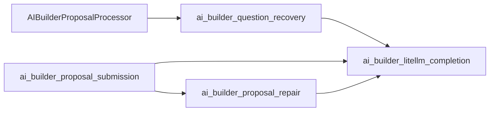
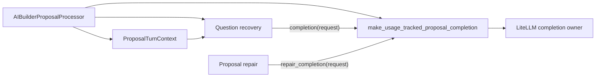

# Flow AI Builder Phase 4: Question Recovery Completion Boundary

## Five-line TL;DR

1. The next safe Phase 4 slice is question-recovery completion ownership, not framework adoption.
2. Question recovery currently hand-builds completion requests and imports the LiteLLM completion function directly.
3. The cleaner slice is to reuse `ProposalTurnContext.completion_request(...)` and pass the tracked completion callable from the processor.
4. Keep Protocol-to-alias cleanup out of this behavioral slice unless a later mechanical commit scopes the full sweep.
5. Implement question recovery only first; keep any Protocol-to-alias cleanup as a separate mechanical decision.

## Current Decision

The next implementation slice is question recovery only:

```text
StructuredQuestionRecoveryRequest:
  before: flat repeated turn fields + direct LiteLLM completion call
  after: ProposalTurnContext + original tool call

stream_structured_question_tool_call:
  receives the tracked completion callable as an explicit dependency
```

That should be done separately from the `ProposalCompletionFn` Protocol deletion unless a later mechanical commit deliberately scopes the full sweep.

## Current Source Shape



The ownership smell is not that question recovery uses LLM completion at all. The smell is that it is a repair path but does not use the same tracked completion callable pattern as the other repair paths.

## Evidence

| Evidence | File |
| --- | --- |
| `ProposalCompletionFn` is a one-method Protocol with only `__call__(ProposalCompletionRequest)`. | `backend/src/intric/flows/ai_builder/ai_builder_proposal_tool_contracts.py:38` |
| `ProposalCompletionRequest` is still a useful typed boundary for provider completion. | `backend/src/intric/flows/ai_builder/ai_builder_proposal_tool_contracts.py:46` |
| `ProposalTurnContext.completion_request(...)` already builds typed completion requests from turn context. | `backend/src/intric/flows/ai_builder/ai_builder_proposal_tool_contracts.py:144` |
| LiteLLM completion normalization and usage tracking are owned by `call_proposal_completion`. | `backend/src/intric/flows/ai_builder/ai_builder_litellm_completion.py:94` |
| `make_usage_tracked_proposal_completion(...)` already returns a tracked callable for repair paths. | `backend/src/intric/flows/ai_builder/ai_builder_litellm_completion.py:135` |
| Question recovery imports `call_proposal_completion` directly. | `backend/src/intric/flows/ai_builder/ai_builder_question_recovery.py:33` |
| Question recovery hand-builds `ProposalCompletionRequest` in the recovery retry loop. | `backend/src/intric/flows/ai_builder/ai_builder_question_recovery.py:307` |
| The processor currently re-explodes context fields into a flat `StructuredQuestionRecoveryRequest`. | `backend/src/intric/flows/ai_builder/ai_builder_proposal_processor.py:282` |
| Proposal submission already uses `ctx.completion_request(...)` for active submission. | `backend/src/intric/flows/ai_builder/ai_builder_proposal_submission.py:264` |
| Proposal repair already takes injected `repair_completion` callables. | `backend/src/intric/flows/ai_builder/ai_builder_proposal_repair.py:91` |

## Cleaner Target Shape



The desired property:

```text
Question recovery no longer imports call_proposal_completion.
Question recovery does not call acompletion.
Question recovery builds retry requests through ProposalTurnContext.completion_request(...).
Question recovery still marks its completion as counts_as_repair=True.
```

## Proposed Narrow Slice

### Do

1. Replace flat repeated fields in `StructuredQuestionRecoveryRequest` with `ctx: ProposalTurnContext` plus `tool_call`.
2. Build the request in `AIBuilderProposalProcessor._handle_question_recovery_dispatch(...)` using the existing context.
3. Construct `make_usage_tracked_proposal_completion(...)` in the processor and pass the returned callable explicitly to `stream_structured_question_tool_call(...)`.
4. Replace the manual `ProposalCompletionRequest(...)` construction in question recovery with `ctx.completion_request(...)`.
5. Update question recovery tests to inject a fake completion callable through the function call.
6. Update import-ownership tests so question recovery imports nothing from `ai_builder_litellm_completion`.

### Do Not

- Do not redesign repair retry policy.
- Do not touch Flow runtime, persistence/schema, OpenAPI contracts, or XYFlow.
- Do not adopt Pydantic AI, AI SDK, MCP, MCP Apps, or tool search.
- Do not delete behavior tests unless the covered behavior was deleted.
- Do not change the Flow capability or authoring command model in this slice.

## Protocol-to-Alias Decision

The one-method `ProposalCompletionFn` Protocol is probably removable, but that
is a mechanical type cleanup with its own blast radius. Do not bundle it into
the question-recovery behavior change.

| Option | Benefit | Risk | Recommendation |
| --- | --- | --- | --- |
| A. Question recovery only | Smallest reviewable diff; removes direct completion call from question recovery. | Leaves fake Protocol for one more commit. | Best immediate slice. |
| B. Question recovery plus global alias sweep | Deletes fake Protocol now. | Touches repair, completion, tests, and ownership guards at once. | Acceptable only as a separate mechanical commit or carefully scoped second commit. |

If we do the alias sweep, the alias should be exact:

```python
ProposalCompletion: TypeAlias = Callable[
    [ProposalCompletionRequest],
    Awaitable["LLMCompletionResponse"],
]
```

And the ownership test must assert that exact shape, not just search for strings.

The cleanest implementation order is:

1. First commit: question recovery uses context plus injected tracked completion.
2. Second commit, if still worth it: replace the one-method Protocol with a typed callable alias across all production/tests/guards.

That keeps the behavioral refactor separate from the mechanical type cleanup.

## Test Strategy

### Tests That Should Stay

| Test Area | Reason |
| --- | --- |
| Question recovery backend followup | Protects backend-owned discovery question behavior. |
| Question recovery dispatch to confirm requirements | Protects recovered tool dispatch behavior. |
| Empty completion choices | Protects typed error event. |
| Repeated structured question exhaustion | Protects retry budget. |
| Streaming `repairing` before completion returns | Protects user-visible stream order. |
| `counts_as_repair=True` telemetry | Protects repair accounting. |
| Import ownership guard | Protects the current LiteLLM proposal-completion provider boundary. |

### Tests That Must Fail If The Refactor Breaks

| Failure Mode | Required Guard |
| --- | --- |
| Question recovery imports from `ai_builder_litellm_completion` again. | AST ownership test requires zero imports from that module. |
| Question recovery constructs `ProposalCompletionRequest(...)` directly. | AST ownership test requires request construction through `ProposalTurnContext.completion_request(...)`. |
| Question recovery constructs its own completion factory. | AST ownership test keeps completion-callable construction in the processor. |
| Question recovery calls `acompletion`. | AST ownership test bans provider calls. |
| Question recovery ignores injected completion. | Unit test injects fake completion and asserts it was awaited. |
| `counts_as_repair=True` is dropped. | Telemetry test fails or fake completion inspects request. |
| `ProposalCompletionFn` alias sweep leaves stale guards. | Ownership test searches for current alias, not deleted name. |

## Implementation Sketch

This is the shape to implement if we choose Option A:

```python
@dataclass(frozen=True)
class StructuredQuestionRecoveryRequest:
    ctx: ProposalTurnContext
    tool_call: Any


async def stream_structured_question_tool_call(
    *,
    repo: AIBuilderRepository,
    discovery_litellm_client: Any,
    repair_completion: ProposalCompletionFn,
    self_correction_temperature: float,
    request: StructuredQuestionRecoveryRequest,
) -> AsyncGenerator[QuestionRecoveryItem, None]:
    ...
```

Question recovery then reads `ctx.conversation`, `ctx.flow`, `ctx.litellm_model`, etc. It still passes `litellm_client` to `build_discovery_runtime_result`, because discovery runtime still needs it. The ownership claim must be honest:

```text
Question recovery no longer owns provider completion.
Question recovery still asks discovery runtime to build discovery context using the LiteLLM client.
```

That distinction matters.

## What This Deletes Or Shrinks

| Change | Deletion / Shrink |
| --- | --- |
| Request carries `ProposalTurnContext` | Deletes repeated flat turn fields from `StructuredQuestionRecoveryRequest`. |
| Inject tracked completion callable | Deletes direct `call_proposal_completion` import from question recovery. |
| Use `ctx.completion_request(...)` | Deletes hand-built `ProposalCompletionRequest` duplication. |
| Update tests to pass callable explicitly | Deletes module patching of question-recovery's direct completion import. |
| Optional alias sweep | Deletes one-method fake Protocol. |

## What This Does Not Solve

- It does not remove the whole custom AI Builder LLM runtime.
- It does not collapse all repair loops.
- It does not remove PlanningState.
- It does not evaluate Pydantic AI.
- It does not introduce Eneo capabilities or MCP.

Those remain Phase 4/Phase 5 decisions, not part of this narrow slice.

## Recommended Next Action

When implementation resumes, choose one of these:

### Preferred

Implement only question-recovery consolidation:

```text
ctx request data + explicit injected completion callable + ctx.completion_request(...)
```

Then validate:

```bash
docker exec -w /workspace/backend eneo-flows-clean_devcontainer-eneo-1 \
  /home/vscode/.local/bin/uv run pytest \
  tests/unittests/flows/ai_builder/test_ai_builder_question_recovery.py \
  tests/unittests/flows/ai_builder/test_ai_builder_import_ownership.py
```

Then run pyright/ruff on touched backend files.

### Secondary

After the first commit is green, decide whether to delete `ProposalCompletionFn` in a separate mechanical commit.

## Final Opinion

This is worth doing, but the first plan tried to combine one behavioral ownership cleanup with one mechanical type cleanup. The cleanest path is to land the behavioral cleanup first. It directly supports Phase 4 by removing one scattered completion caller and one duplicated request construction path. The Protocol deletion is probably correct, but it should not ride along unless its tests and ownership guards are updated in the same commit.
