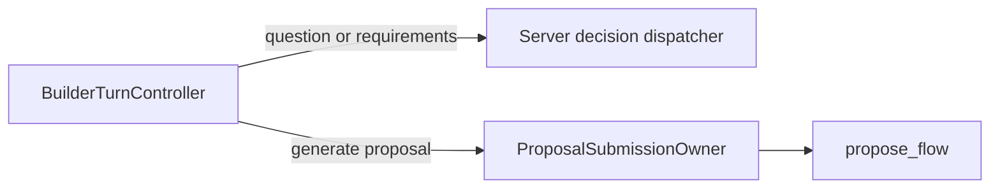

# Flow AI Builder Question-Recovery Boundary Supersession

## Five-line TL;DR

1. This document is retained only to keep historical links stable.
2. The former model-visible question-recovery runtime has been deleted.
3. Server-owned decisions now persist canonical questions without exposing an `ask_structured_question` tool to the model.
4. Active proposal generation exposes only `propose_flow`.
5. Use the ask/confirm deletion packet as the current source of truth.

## Current Owner

The current owner is
[Flow Builder Ask/Confirm Runtime Deletion Packet](./flow-builder-delete-obsolete-ask-confirm-runtime-packet-2026-06-25.md).

That packet records the reachability proof, deleted files, guard tests,
validation commands, and next go/no-go recommendation. Do not use the older
question-recovery completion-slice guidance as implementation direction.

## Superseded Decision

The old slice temporarily moved question-recovery provider completion behind the
proposal completion callable. That was a transitional improvement. A later
reachability proof showed that deterministic server-owned turn decisions made
the model-visible question and requirements tools obsolete, so the correct
long-term outcome was deletion rather than another adapter.

Current source shape:

## Guardrail

Do not restore question-recovery or confirm-requirements model tool runtimes for
unreleased Builder compatibility. If a future external adapter needs a question
or confirmation surface, it should call the server-owned decision/application
owner, not resurrect model-visible ask/confirm tool dispatch inside the
AI Builder proposal processor.
