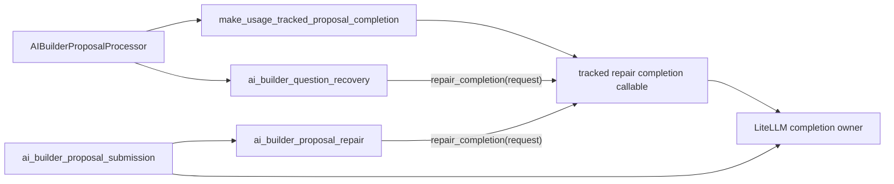

# Flow AI Builder Phase 4: Question Recovery Completion Boundary

## Five-line TL;DR

1. The Phase 4 question-recovery completion ownership slice is implemented.
2. `StructuredQuestionRecoveryRequest` now carries only `ProposalTurnContext` and the original tool call.
3. `AIBuilderProposalProcessor` passes the tracked completion callable explicitly into question recovery.
4. Keep `ProposalCompletionFn` as the current provider-neutral callable contract unless replacing it deletes real guard/test complexity.
5. Stop before broader retry, planner, capability, or MCP work; those need separate preflight proof.

## Implemented Decision

This slice consolidated question-recovery completion ownership only:

```text
StructuredQuestionRecoveryRequest:
  ctx: ProposalTurnContext
  tool_call: RuntimeToolCall

stream_structured_question_tool_call:
  receives the tracked completion callable as an explicit dependency
```

`ProposalCompletionFn` stays for now because it names the provider-neutral
callable boundary used by repair paths. Reassess it only if replacing it
reduces total production and guard complexity.

## Implemented Source Shape



Question recovery still uses LLM completion, but only through the injected
repair callable. It no longer imports the provider-completion module or builds
provider request objects itself.

## Evidence

| Evidence | File |
| --- | --- |
| `ProposalCompletionFn` is the current provider-neutral callable contract for proposal completion. | `backend/src/intric/flows/ai_builder/ai_builder_proposal_tool_contracts.py:38` |
| `ProposalCompletionRequest` is still a useful typed boundary for provider completion. | `backend/src/intric/flows/ai_builder/ai_builder_proposal_tool_contracts.py:46` |
| `ProposalTurnContext.completion_request(...)` already builds typed completion requests from turn context. | `backend/src/intric/flows/ai_builder/ai_builder_proposal_tool_contracts.py:144` |
| LiteLLM completion normalization and usage tracking are owned by `call_proposal_completion`. | `backend/src/intric/flows/ai_builder/ai_builder_litellm_completion.py:94` |
| `make_usage_tracked_proposal_completion(...)` already returns a tracked callable for repair paths. | `backend/src/intric/flows/ai_builder/ai_builder_litellm_completion.py:135` |
| `RuntimeToolCall` is the shared structural tool-call contract for runtime metadata, proposal repair, proposal submission, and question recovery. | `backend/src/intric/flows/ai_builder/ai_builder_conversation_metadata.py:269` |
| `StructuredQuestionRecoveryRequest` carries `ctx` and `tool_call` only. | `backend/src/intric/flows/ai_builder/ai_builder_question_recovery.py:64` |
| Question recovery receives `repair_completion` explicitly. | `backend/src/intric/flows/ai_builder/ai_builder_question_recovery.py:81` |
| Question recovery builds retry completion requests through `ctx.completion_request(..., counts_as_repair=True)`. | `backend/src/intric/flows/ai_builder/ai_builder_question_recovery.py:294` |
| The processor owns tracked completion callable construction for question recovery. | `backend/src/intric/flows/ai_builder/ai_builder_proposal_processor.py:282` and `backend/src/intric/flows/ai_builder/ai_builder_proposal_processor.py:289` |
| Proposal submission already uses `ctx.completion_request(...)` for active submission. | `backend/src/intric/flows/ai_builder/ai_builder_proposal_submission.py:264` |
| Proposal repair already takes injected `repair_completion` callables. | `backend/src/intric/flows/ai_builder/ai_builder_proposal_repair.py:91` |

The implemented property:

```text
Question recovery no longer imports call_proposal_completion.
Question recovery does not call acompletion.
Question recovery builds retry requests through ProposalTurnContext.completion_request(...).
Question recovery still marks its completion as counts_as_repair=True.
```

## Implemented Slice

Completed:

1. Replaced flat repeated fields in `StructuredQuestionRecoveryRequest` with `ctx: ProposalTurnContext` plus `tool_call`.
2. Built the request in `AIBuilderProposalProcessor._handle_question_recovery_dispatch(...)` from the existing context.
3. Constructed `make_usage_tracked_proposal_completion(...)` in the processor and passed the returned callable explicitly to `stream_structured_question_tool_call(...)`.
4. Replaced manual `ProposalCompletionRequest(...)` construction in question recovery with `ctx.completion_request(...)`.
5. Updated question recovery tests to pass fake completion callables through the function call.
6. Updated import-ownership tests so question recovery imports nothing from `ai_builder_litellm_completion`.

Not changed:

- Do not redesign repair retry policy.
- Do not touch Flow runtime, persistence/schema, OpenAPI contracts, or XYFlow.
- Do not adopt Pydantic AI, AI SDK, MCP, MCP Apps, or tool search.
- Do not delete behavior tests unless the covered behavior was deleted.
- Do not change the Flow capability or authoring command model in this slice.

## Protocol Decision

Do not bundle a Protocol-to-alias cleanup into this slice. The current
`ProposalCompletionFn` Protocol names the provider-neutral callable boundary.
Replace it only in a separate mechanical cleanup if that change reduces total
production code and ownership-guard complexity.

## Test Strategy

### Tests That Should Stay

| Test Area | Reason |
| --- | --- |
| Question recovery backend followup | Protects backend-owned discovery question behavior. |
| Question recovery dispatch to confirm requirements | Protects recovered tool dispatch behavior. |
| Empty completion choices | Protects typed error event. |
| Repeated structured question exhaustion | Protects retry budget. |
| Streaming `repairing` before completion returns | Protects user-visible stream order. |
| `counts_as_repair=True` telemetry | Protects repair accounting. |
| Import ownership guard | Protects the current LiteLLM proposal-completion provider boundary. |

### Tests That Must Fail If The Refactor Breaks

| Failure Mode | Required Guard |
| --- | --- |
| Question recovery imports from `ai_builder_litellm_completion` again. | AST ownership test requires zero imports from that module. |
| Question recovery constructs `ProposalCompletionRequest(...)` directly. | AST ownership test requires request construction through `ProposalTurnContext.completion_request(...)`. |
| Question recovery constructs its own completion factory. | AST ownership test keeps completion-callable construction in the processor. |
| Question recovery calls `acompletion`. | AST ownership test bans provider calls. |
| Question recovery ignores injected completion. | Unit test injects fake completion and asserts it was awaited. |
| `counts_as_repair=True` is dropped. | Telemetry test fails or fake completion inspects request. |
| A future `ProposalCompletionFn` cleanup leaves stale guards. | The cleanup must update imports, tests, and ownership guards in the same mechanical commit. |

## Implementation Sketch

This is the implemented shape:

```python
@dataclass(frozen=True)
class StructuredQuestionRecoveryRequest:
    ctx: ProposalTurnContext
    tool_call: RuntimeToolCall


async def stream_structured_question_tool_call(
    *,
    repo: AIBuilderRepository,
    discovery_litellm_client: Any,
    repair_completion: ProposalCompletionFn,
    self_correction_temperature: float,
    request: StructuredQuestionRecoveryRequest,
) -> AsyncGenerator[QuestionRecoveryItem, None]:
    ...
```

Question recovery then reads `ctx.conversation`, `ctx.flow`, `ctx.litellm_model`, etc. It still passes `litellm_client` to `build_discovery_runtime_result`, because discovery runtime still needs it. The ownership claim must be honest:

```text
Question recovery no longer owns provider completion.
Question recovery still asks discovery runtime to build discovery context using the LiteLLM client.
```

That distinction matters.

## What This Deletes Or Shrinks

| Change | Deletion / Shrink |
| --- | --- |
| Request carries `ProposalTurnContext` | Deletes repeated flat turn fields from `StructuredQuestionRecoveryRequest`. |
| Inject tracked completion callable | Deletes direct `call_proposal_completion` import from question recovery. |
| Use `ctx.completion_request(...)` | Deletes hand-built `ProposalCompletionRequest` duplication. |
| Update tests to pass callable explicitly | Deletes module patching of question-recovery's direct completion import. |

## What This Does Not Solve

- It does not remove the whole custom AI Builder LLM runtime.
- It does not collapse all repair loops.
- It does not remove PlanningState.
- It does not evaluate Pydantic AI.
- It does not introduce Eneo capabilities or MCP.

Those remain Phase 4/Phase 5 decisions, not part of this narrow slice.

## Recommended Next Action

Stop and re-audit before choosing another Phase 4 candidate. The next candidate
should have its own preflight proof and deletion gate. Do not roll the
Protocol-to-alias cleanup, retry consolidation, planner changes, capability
dedupe, or MCP/capability architecture into this slice.

## Final Opinion

This slice removed one scattered provider-completion caller and one duplicated
request-construction path without introducing a new abstraction. The Protocol
deletion may still be correct, but it should not ride along unless its tests
and ownership guards are updated in the same mechanical commit.
