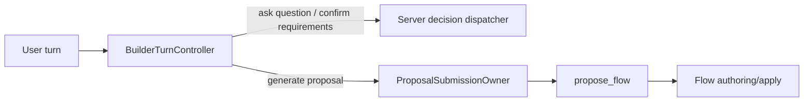

# Flow Builder Ask/Confirm Runtime Deletion Packet

## Five-line outcome

1. Go: deterministic server-owned decisions have made the model-visible `ask_structured_question` and `confirm_requirements` runtime obsolete.
2. Deleted the question-recovery runtime, confirm-requirements runtime, ask/confirm schema builders, ask/confirm parsers, processor dispatch handlers, and implementation-detail tests.
3. Preserved server-owned canonical questions, requirements summaries, MCP preflight clarification, active proposal generation, proposal repair, approval/apply, and Flow runtime behavior.
4. Active proposal generation now exposes only `propose_flow`; ask/confirm names remain only as persisted historical metadata constants.
5. Stop here: the next proposal-language/preparation consolidation needs its own explicit goal.

## Reachability proof

| Runtime path | Tool schemas exposed to model | Can model emit ask/confirm? | Current owner | Evidence |
| --- | --- | ---: | --- | --- |
| Server-owned canonical question | None | No | `dispatch_server_decision` | `backend/src/intric/flows/ai_builder/ai_builder_server_decision_dispatch.py:90` |
| Server-owned requirements summary | None | No | `dispatch_server_decision` | `backend/src/intric/flows/ai_builder/ai_builder_server_decision_dispatch.py:90` |
| Active proposal generation | `propose_flow` only | No | `ProposalSubmissionOwner` | `backend/src/intric/flows/ai_builder/ai_builder_proposal_submission.py:162`, `backend/src/intric/flows/ai_builder/ai_builder_proposal_submission.py:266` |
| Proposal processor | No generic tool dispatch | No | `AIBuilderProposalProcessor.propose_plan` delegates to active proposal submission | `backend/src/intric/flows/ai_builder/ai_builder_proposal_processor.py:87`, `backend/src/intric/flows/ai_builder/ai_builder_proposal_processor.py:130` |
| MCP preflight clarification | None; server-persisted question | No | `_mcp_preflight_events_if_needed` | `backend/src/intric/flows/ai_builder/ai_builder_proposal_processor.py:153` |
| Historical tool metadata | Constants only | No live dispatch | Conversation metadata/UI compatibility | `backend/src/intric/flows/ai_builder/ai_builder_tools.py:26` |

Guard test: `backend/tests/unittests/flows/ai_builder/test_ai_builder_import_ownership.py:869`
asserts the obsolete runtime paths stay deleted, the processor does not define
ask/confirm dispatch methods, deleted schema/parser builders stay absent, and
production source does not import the obsolete modules.

## Deleted surface

| Deleted / shrunk item | Why it was removed |
| --- | --- |
| `backend/src/intric/flows/ai_builder/ai_builder_question_recovery.py` | The model no longer receives `ask_structured_question`; server decisions own canonical questions. |
| `backend/src/intric/flows/ai_builder/ai_builder_confirm_requirements.py` | The model no longer receives `confirm_requirements`; server decisions own requirements confirmation. |
| Ask/confirm schema builders and grouped schema builders in `ai_builder_tools.py` | Active proposal turns expose only `propose_flow`. |
| Ask/confirm parsers in `ai_builder_tool_parsing.py` | There is no live model tool payload to parse. |
| `AIBuilderProposalProcessor.handle_tool_call(...)` and ask/confirm dispatch helpers | Generic tool dispatch was only preserving obsolete model actions. |
| Question-recovery and confirm-requirements implementation tests | Covered deleted runtime behavior, not surviving product behavior. |

## Server-owned behavior proof matrix

| Behavior preserved | Test / gate |
| --- | --- |
| Server-owned canonical question dispatch and persistence | `tests/unittests/flows/ai_builder/test_ai_builder_server_decision_dispatch.py` |
| Requirements confirmation gates create-mode proposals | `tests/unittests/flows/ai_builder/test_ai_builder_proposal_submission.py` |
| Active proposal generation uses only proposal tool schema | `tests/unittests/flows/ai_builder/test_ai_builder_active_tool_contracts.py` |
| Unexpected non-proposal tools do not become live dispatch | `tests/unittests/flows/ai_builder/test_ai_builder_proposal_processor.py` |
| MCP preflight question still persists before proposal | `tests/unittests/flows/ai_builder/test_ai_builder_proposal_processor.py` |
| Edit-mode server-planned primary input reaches backend materialization | `tests/unittests/flows/ai_builder/test_ai_builder_edit_proposal.py` and `tests/integration/flows/test_ai_builder_session_api_regressions.py` |
| Import/architecture boundary rejects runtime resurrection | `tests/unittests/flows/ai_builder/test_ai_builder_import_ownership.py` |

## Metrics

Measured from the source/test diff before documentation edits.

| Area | Files | Insertions | Deletions | Net |
| --- | ---: | ---: | ---: | ---: |
| Production AI Builder source | 10 changed, 2 deleted | 60 | 1,204 | -1,144 |
| AI Builder tests and one integration regression file | 11 changed, 3 deleted | 413 | 2,500 | -2,087 |
| Total source/test slice | 21 changed, 5 deleted | 473 | 3,704 | -3,231 |

Tool-schema surface:

| Before | After |
| --- | --- |
| `propose_flow`, `ask_structured_question`, and `confirm_requirements` schema builders existed, with grouped discovery schema helpers. | Only `build_propose_flow_tool_schema(...)` remains model-visible; ask/confirm constants remain only for persisted metadata. |

## Architecture impact

The canonical owner changed from a model-visible action runtime to deterministic
server decision dispatch. Proposal generation remains model-owned only for the
Flow proposal payload.

## Validation results

| Command | Result |
| --- | --- |
| `docker exec -u vscode -w /workspace/backend eneo-flows-clean_devcontainer-eneo-1 bash -lc 'export PATH=/home/vscode/.local/bin:/home/vscode/.bun/bin:$PATH && uv run pytest tests/unittests/flows/ai_builder -q'` | `2318 passed` |
| `docker exec -u vscode -w /workspace/backend eneo-flows-clean_devcontainer-eneo-1 bash -lc 'export PATH=/home/vscode/.local/bin:/home/vscode/.bun/bin:$PATH && uv run pytest tests/integration/flows/test_ai_builder_session_api_regressions.py -q'` | `51 passed` |
| `docker exec -u vscode -w /workspace/backend eneo-flows-clean_devcontainer-eneo-1 bash -lc 'export PATH=/home/vscode/.local/bin:/home/vscode/.bun/bin:$PATH && uv run ruff check src/intric/flows/ai_builder tests/unittests/flows/ai_builder tests/integration/flows/test_ai_builder_session_api_regressions.py'` | Passed |
| `ENEO_DEVCONTAINER_NAME=eneo-flows-clean_devcontainer-eneo-1 backend/scripts/run_pyright_in_devcontainer.sh ...` for changed AI Builder modules and focused tests | `0 errors, 0 warnings, 0 informations` |
| `docker exec -u vscode -w /workspace/backend eneo-flows-clean_devcontainer-eneo-1 bash -lc 'export PATH=/home/vscode/.local/bin:/home/vscode/.bun/bin:$PATH && uv run lint-imports --no-cache'` | `Contracts: 7 kept, 0 broken` |

Docs-site check: no matching Flow AI Builder ask/confirm runtime references were
found under `frontend/apps/docs-site`, so no docs-site source update was needed.

## Peer review status

Claude peer-loop verification was attempted under session
`flow-builder-delete-obsolete-ask-confirm-runtime`, but Claude was blocked by
the account monthly spend limit. Antigravity reviewed the reachability/deletion
plan and returned green with `MIN_SCORE: 8`; artifact:
`.codex/artifacts/antigravity-peer-loop-flow-builder-ask-confirm-runtime-deletion-reachability-20260625T192146Z.md`.

## Remaining risks

| Risk | Mitigation |
| --- | --- |
| Historical conversation metadata can still contain ask/confirm tool names. | Constants remain for persisted metadata; live dispatch is deleted and guarded. |
| Proposal repair still used provider-shaped message dictionaries. | Resolved by [Flow Builder Proposal Request Boundary Packet](./flow-builder-proposal-request-boundary-packet-2026-06-25.md): proposal messages and forced tool choice now share one typed boundary. |
| Edit-mode primary input changes rely on server planning state reaching proposal materialization. | Covered by unit and API regression tests after the deletion exposed the issue. |

## Recommendation

The follow-up proposal-language/request-preparation slice is complete; see
[Flow Builder Proposal Request Boundary Packet](./flow-builder-proposal-request-boundary-packet-2026-06-25.md).
Do not start capability descriptors, MCP, AI SDK, Pydantic AI, LangGraph,
Assistant configuration, or Flow runtime changes as a continuation of this
deletion slice.
