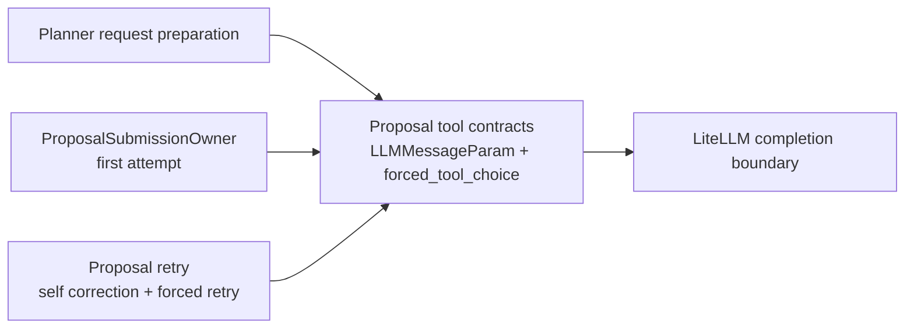

# Flow Builder Proposal Request Boundary Packet - 2026-06-25

## Five-line outcome

1. Proposal request messages now use typed provider message contracts instead of raw `list[dict[str, Any]]` at the proposal boundary.
2. Forced proposal tool-choice construction has one owner: `forced_tool_choice(...)` in `ai_builder_proposal_tool_contracts.py`.
3. The dead `target_tool_name` retry setting was deleted because proposal retry only targets `propose_flow`.
4. No Flow runtime, public API, OpenAPI contract, frontend, MCP, Assistant mutation, or framework adoption changed.
5. Stop here unless the next goal targets stream-event dictionaries or tool-schema typing with named deletion.

## Ownership Map

| Concept | Canonical owner | Evidence | Deleted / consolidated |
| --- | --- | --- | --- |
| Proposal provider message shape | `ai_builder_proposal_tool_contracts.py` | `backend/src/eneo/flows/ai_builder/ai_builder_proposal_tool_contracts.py:46` defines tool-call params, `:57` defines message roles, and `:60` defines `LLMMessageParam`. | Proposal request, turn context, retry messages, and request preparation now share `LLMMessageParam`. |
| Forced tool choice for `propose_flow` | `forced_tool_choice(...)` | `backend/src/eneo/flows/ai_builder/ai_builder_proposal_tool_contracts.py:79`. | Inline `tool_choice={"type": "function", ...}` construction was removed from submission and repair. |
| Active proposal submission tool | `PROPOSE_FLOW_TOOL_NAME` | `backend/src/eneo/flows/ai_builder/ai_builder_proposal_submission.py:127` and `:263`. | `_forced_submission_response(...)` no longer accepts a configurable submission tool name. |
| Proposal retry target | Proposal retry itself | `backend/src/eneo/flows/ai_builder/ai_builder_proposal_tool_contracts.py:150` shows `ToolRetryConfig` only carries target kind, prompt, and invocation processor. | `ToolRetryConfig.target_tool_name` was deleted. |
| Provider adapter | `ai_builder_litellm_completion.py` | Existing completion boundary remains the only LiteLLM caller for proposal completions. | No framework or new runtime wrapper was added. |

## Behavior Proof

| Behavior | Proof |
| --- | --- |
| First proposal attempt still forces `propose_flow`. | `backend/src/eneo/flows/ai_builder/ai_builder_proposal_submission.py:263` calls `forced_tool_choice(PROPOSE_FLOW_TOOL_NAME)`. |
| Forced retry after text still forces `propose_flow`. | `backend/src/eneo/flows/ai_builder/ai_builder_proposal_retry.py:588` calls the same owner. |
| Retry transcript still preserves assistant tool calls and tool feedback. | `backend/src/eneo/flows/ai_builder/ai_builder_proposal_retry.py:232` returns `list[LLMMessageParam]` with assistant/tool messages. |
| Duplicate forced tool-choice literals cannot return silently. | `backend/tests/unittests/flows/ai_builder/test_ai_builder_import_ownership.py:2112` guards submission and retry. |
| Provider dict shape remains unchanged for LiteLLM. | `backend/tests/unittests/flows/ai_builder/test_ai_builder_proposal_completion.py:47` asserts the single owner emits the same provider payload. |

## Shape

## Validation

| Command | Result |
| --- | --- |
| `uv run ruff check src/eneo/flows/ai_builder/ai_builder_proposal_tool_contracts.py src/eneo/flows/ai_builder/ai_builder_proposal_retry.py src/eneo/flows/ai_builder/ai_builder_proposal_submission.py src/eneo/flows/ai_builder/ai_builder_proposal_processor.py src/eneo/flows/ai_builder/ai_builder_planner_request_preparation.py tests/unittests/flows/ai_builder/test_ai_builder_proposal_completion.py tests/unittests/flows/ai_builder/test_ai_builder_proposal_retry.py tests/unittests/flows/ai_builder/test_ai_builder_proposal_submission.py tests/unittests/flows/ai_builder/test_ai_builder_import_ownership.py tests/unittests/flows/ai_builder/test_discovery_flow.py` | Passed. |
| `backend/scripts/run_pyright_in_devcontainer.sh` over touched proposal/planner modules and tests | `0 errors, 0 warnings, 0 informations`. |
| `uv run pytest tests/unittests/flows/ai_builder/test_ai_builder_proposal_completion.py tests/unittests/flows/ai_builder/test_ai_builder_proposal_retry.py tests/unittests/flows/ai_builder/test_ai_builder_proposal_submission.py tests/unittests/flows/ai_builder/test_ai_builder_proposal_processor.py tests/unittests/flows/ai_builder/test_ai_builder_planner.py tests/unittests/flows/ai_builder/test_ai_builder_import_ownership.py tests/unittests/flows/ai_builder/test_discovery_flow.py::TestPlannerConversationEncoding -q` | `149 passed`. |
| `uv run pytest tests/unittests/flows/ai_builder -q` | `2321 passed`. |
| `uv run pytest tests/integration/flows/test_ai_builder_session_api_regressions.py -q` | `51 passed`. |
| `uv run lint-imports --no-cache` | `7 contracts kept, 0 broken`. |

## Peer Review

Claude was initially blocked by the account monthly spend limit, then returned
`changes_required`, `GREEN_LIGHT: no`, `MIN_SCORE: 7` on verification because
request preparation had a redundant `LLMMessage` alias and a silent role cast.
Those issues were addressed by using `LLMMessageParam` directly, validating
conversation roles before building provider messages, making conversation
trimming preserve the typed message shape, and tightening optional message keys.
Claude final verification returned `VERDICT: green`, `GREEN_LIGHT: yes`,
`MIN_SCORE: 8`.

Antigravity reviewed the plan and returned `changes_required`,
`GREEN_LIGHT: no`, `MIN_SCORE: 6` because runtime wrapper classes would be
overbuilt. The implementation followed that feedback: no wrapper classes, only
typed dictionaries plus the single forced-tool-choice owner.

Artifact:

- `.codex/artifacts/antigravity-peer-loop-flow-builder-proposal-request-collapse-plan-20260625T203912Z.md`
- `.codex/artifacts/claude-peer-loop-flow-builder-proposal-request-collapse-verification-20260626T071242Z.md`
- `.codex/artifacts/claude-peer-loop-flow-builder-proposal-request-collapse-final-verification-20260626T072500Z.md`

## Remaining Risks

| Risk | Mitigation |
| --- | --- |
| Tool schemas remain complex provider dictionaries. | Leave them at the schema-generation owner unless a later slice can type them without wrapping JSON Schema in fake classes. |
| Stream events still use `dict[str, str]`. | Candidate next deletion/typing slice only if it replaces all event tuple/dict variants in one owner. |
| Conversation trimming remains generic prompt assembly. | `trim_conversation_for_context(...)` now preserves the caller's message type, so request preparation no longer casts typed provider messages through raw dicts. |

## Next Recommendation

Do not start MCP/capability descriptors or framework adoption from this slice.
The next maintainability target, if any, should be one of:

1. typed stream event ownership, if it deletes event tuple/dict variants across Builder; or
2. proposal tool-schema typing, if it can reuse the existing schema builders without wrapping JSON Schema in custom runtime classes.
