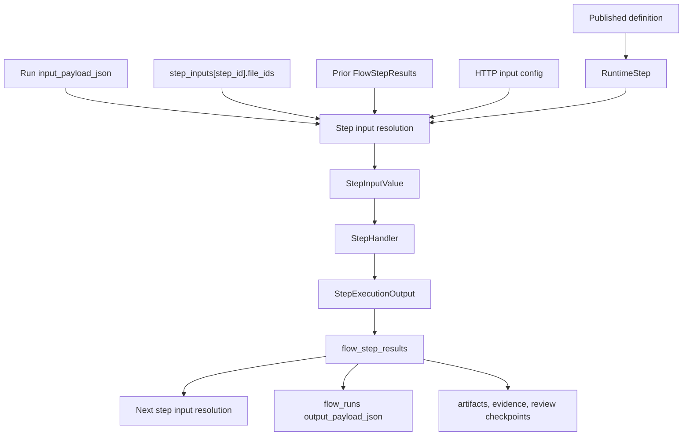

# Flow Developer Quickstart

Status: draft.

This page is a developer quickstart for Eneo Flows and Flow AI Builder. It
explains the core data model, the published runtime contract, how step inputs
and outputs move through a run, and where to look before changing the system.
For the deeper maintainer view, read [architecture.md](./architecture.md) and
[package-layout.md](./package-layout.md).

## One-minute model

A Flow is a versioned executable recipe.

- Authoring edits a draft Flow: rows in `flows` and `flow_steps`.
- Publishing freezes the draft into an immutable runtime snapshot:
  `flow_versions.definition_json`.
- Running a Flow creates a version-pinned execution: one `flow_runs` row plus
  per-step runtime records.
- Runtime code should execute the published snapshot, not the mutable draft.
- Flow AI Builder is an authoring assistant. It asks bounded discovery
  questions, builds typed planning evidence, and compiles an approved intent
  into the same Flow draft shape that manual authoring uses.

The most important invariant is draft/runtime separation: editing a draft after
publish must not change an already-created run or the published version it was
prepared against.

## Core objects

| Object | Storage or contract | Purpose |
| --- | --- | --- |
| Draft Flow | `flows` | Mutable authoring record, metadata, current published version pointer, draft revision. |
| Draft Step | `flow_steps` | Ordered authoring step configuration before publish. |
| Published Flow Version | `flow_versions.definition_json` | Immutable, checksummed runtime snapshot for a published version. |
| Run Contract | `FlowRunContractPublic` | API-facing contract that tells clients which form fields, uploads, review points, and final output to expect. |
| Flow Run | `flow_runs` | One execution of one published Flow version. Stores status, principal identity, input payload, output payload, and errors. |
| Step Result | `flow_step_results` | Current result for one runtime step attempt. Stores resolved input, output, prompt, token usage, and status. |
| Step Attempt | `flow_step_attempts` | Attempt history for retries and reruns. |
| Runtime Upload | `flow_runtime_uploaded_files` | Pre-run uploaded file accepted for a specific published runtime step. |
| Step Input File | `flow_run_step_input_files` | Run-time binding from uploaded file to the step that consumes it. |
| Step Result File | `flow_run_step_result_files` | Generated or declared artifact emitted by a step. |
| Review Checkpoint | `flow_run_review_checkpoints` | Human review pause, editable payload, state, and revision. |
| Audit/Webhook Outbox | `flow_run_audit_outbox`, `flow_run_webhook_deliveries` | Reliable outbound delivery records for audit and webhooks. |
| AI Builder Session | builder session tables plus `PlanningState` JSON | Persisted builder conversation and typed planning state. |

## Runtime API shape

External clients should treat the run contract as the source of truth. Do not
guess form fields, upload steps, or final output shape from draft authoring
data.

Recommended consumer path:

1. `GET /api/v1/flows/{id}/published/`
   - Fetch the runtime-safe published projection of the Flow.
2. `GET /api/v1/flows/{id}/run-contract/`
   - Read `published_flow_version`, `form_fields`, step upload requirements,
     review steps, final output delivery, file limits, and template readiness.
3. `POST /api/v1/flows/{id}/steps/{step_id}/runtime-files/`
   - Upload files to the exact step ids from the run contract.
4. `POST /api/v1/flows/{id}/runs/`
   - Send `expected_flow_version`, `input_payload_json`, and
     `step_inputs[step_id].file_ids`.
5. `GET /api/v1/flows/{id}/runs/{run_id}/`
   - Poll run status.
6. `GET /api/v1/flows/{id}/runs/{run_id}/steps/`
   - Inspect per-step progress and outputs.
7. If the run reaches `awaiting_review`, use the review checkpoint endpoints.
8. If the run completes with artifacts or evidence, use the artifact and
   evidence endpoints from the published runtime paths.

Create-run payload shape:

```json
{
  "expected_flow_version": 3,
  "input_payload_json": {
    "employee_name": "Alex Example"
  },
  "step_inputs": {
    "00000000-0000-0000-0000-000000000101": {
      "file_ids": ["00000000-0000-0000-0000-000000000701"]
    }
  }
}
```

`input_payload_json` keys should come from `form_fields[].name` in the run
contract. Uploaded file ids belong under the specific consuming step id. Top
level `file_ids` is intentionally rejected.

## Step schema

Each runtime step is parsed from the published definition into a `RuntimeStep`.
The fields below explain most step behavior.

| Field | Meaning |
| --- | --- |
| `step_id` | Stable step id from the published snapshot. Runtime file inputs and results refer to this id. |
| `step_order` | Execution order within the published Flow. |
| `assistant_id` | Assistant/model configuration used by model-backed execution. |
| `user_description` | Authoring prompt or task description for the step. |
| `input_source` | Where the step gets its input: `flow_input`, `previous_step`, `all_previous_steps`, `http_get`, or `http_post`. |
| `input_type` | Expected input kind: `text`, `json`, `image`, `audio`, `document`, `file`, or `any`. |
| `input_bindings` | Structured references to form answers, source refs, or prior structured fields. Prefer this for explicit data flow. |
| `input_config` | Step input configuration, including HTTP or runtime file settings. |
| `output_mode` | Execution behavior: `pass_through`, `compose_text`, `http_post`, `transcribe_only`, `template_fill`, or `render_verbatim`. |
| `output_type` | Final type produced by the step: `text`, `json`, `pdf`, or `docx`. |
| `output_contract` | Typed output shape, validation rules, and artifact expectations. |
| `output_config` | Renderer, HTTP delivery, or output-mode-specific configuration. |
| `review_policy` | Optional human review behavior for this step. |
| `plan_step_ref` | AI Builder and authoring reference that survives compilation into runtime steps. |

`input_source` answers "where does the input come from?" `output_mode` answers
"how should this step execute or render?" `output_type` answers "what kind of
value or artifact does the step produce?"

## How data moves between steps

At run time, step input resolution converts the published step definition plus
the current `RunExecutionState` into a `StepInputValue`. The step handler then
executes the step and persists a `StepExecutionOutput`.



Common input paths:

| Input path | What happens |
| --- | --- |
| `flow_input` | Reads values from `input_payload_json`, usually through form fields or structured bindings. |
| `previous_step` | Reads the immediately previous step output. Invalid for the first step. |
| `all_previous_steps` | Formats all prior step outputs into a deterministic text segment. Invalid for JSON input. |
| `input_bindings.source_refs` | Pulls selected fields or arrays from prior structured outputs and composes deterministic text. |
| Runtime files | Loads, extracts, transcribes, or passes file data according to runtime input config and file policy. |
| `http_get` / `http_post` | Fetches input through the runtime HTTP transport before step execution. |

Prefer explicit bindings over `all_previous_steps` when the Flow needs precise
data flow. `all_previous_steps` is useful for broad summarization, but it hides
which prior field is load-bearing and can waste context.

## Output and final delivery

Step output has two related concepts:

- `output_mode`: the handler behavior.
- `output_type`: the contract and API-visible result type.

Examples:

| Use case | Typical shape |
| --- | --- |
| Plain model step | `output_mode=pass_through`, `output_type=text` or `json`. |
| Deterministic text assembly | `output_mode=compose_text`, usually before document rendering. |
| Audio transcription | `output_mode=transcribe_only`, `output_type=text`. |
| DOCX template fill | `output_mode=template_fill`, `output_type=docx`. |
| PDF or DOCX rendering from final body | `output_mode=render_verbatim`, `output_type=pdf` or `docx`. |
| Outbound API delivery | `output_mode=http_post`, final delivery is `outbound_http`. |

The run contract exposes the terminal delivery mode:

- `payload` for text or JSON results returned as run payload.
- `artifact` for generated PDF or DOCX output.
- `outbound_http` for HTTP delivery.

## Large inputs and source material

Flow authoring should express whether the Flow needs exhaustive reading or
selective retrieval.

- Use per-source mapping when the Flow must process every uploaded document or
  every item in a corpus.
- Use retrieval/RAG only when the Flow should answer selectively from a larger
  corpus.
- Keep file routing step-specific. A file uploaded for one published runtime
  step is not a generic run-wide input.
- Keep context-window risk visible in authoring and validation. Do not hide it
  with broad repair logic at run time.

## Flow AI Builder

Flow AI Builder is an authoring path, not a separate runtime engine.

High-level builder flow:

1. Conversation and attachments are persisted in a builder session.
2. `PlanningState` stores typed planning evidence:
   - `signals`
   - `resolved_slots`
   - `file_roles`
   - `output_schema_evidence`
   - `architecture_commit`
3. Discovery runtime merges conversation evidence, attachment evidence, and
   policy defaults into a planning context.
4. The server-owned turn controller decides the next action:
   - ask one canonical question;
   - commit or revise architecture;
   - show a requirements summary;
   - generate a proposal.
5. The model proposes semantic intent. It should describe what the Flow should
   do, not hand-author low-level runtime mechanics.
6. Create assembly compiles supported semantic intents into `FlowDraftSpecCore`.
7. Lowering turns the assembly plan into concrete draft step specs.
8. The normal Flow authoring and publish path persists the draft and freezes a
   runtime version.

Important builder rules:

- The classifier or understanding call produces evidence. It does not write
  questions.
- Server policy decides whether to ask, what to ask, and when the question
  budget is exhausted.
- High-confidence assumptions must be visible in the requirements summary so
  the user can reject them.
- Attachments are first-class evidence through typed file role and output schema
  evidence. Avoid semantic filename or phrase-list heuristics.
- Build-time understanding is allowed when it prevents bad or inefficient
  runtime Flows. A Flow is built once and may run many times.

## Canonical owners

Before changing Flow behavior, identify the owner and extend that owner instead
of adding a parallel path.

| Concept | Canonical owner |
| --- | --- |
| Published runtime snapshot | `eneo.flows.published_definition` |
| Run contract assembly | `FlowRunContractService` |
| Run creation and lifecycle | `FlowRunService` and runtime dispatch payloads |
| Step input resolution | `eneo.flows.runtime.step_input_resolution` |
| Step execution behavior | runtime executor and `StepHandler` behavior selected by `output_mode` |
| Output validation/rendering | `OutputFormatSpec` and output processing modules |
| Runtime file upload policy | `FlowRuntimeFileService` and runtime upload repository |
| Review checkpoints | run review checkpoint API and runtime services |
| Builder planning state | `PlanningState` |
| Builder turn decision | `ai_builder_turn_controller` plus action policy |
| Builder create compilation | `ai_builder_create_compiler` and `ai_builder_assembly` |
| Flow package layout rules | [package-layout.md](./package-layout.md) |

## Practical editing rules

- Read the run contract first when changing external runtime behavior.
- Keep draft authoring and published runtime behavior separate.
- Prefer typed contracts over raw JSON bags at code boundaries.
- Prefer explicit `input_bindings` and source refs over implicit string
  concatenation.
- Keep model evidence quoted and confidence-scored when Builder infers intent.
- Delete dead compatibility paths only with evidence that persisted data and
  tests no longer need them.
- Keep tests behavior-focused: API contract, run lifecycle, step input/output,
  publish snapshot, and builder question/assumption behavior.

## FAQ

### What is a Flow?

A Flow is a versioned recipe for running one or more AI-backed steps. The draft
is editable. The published version is the frozen recipe used by runs.

### What is a step?

A step is one unit of work in a Flow. It declares where its input comes from,
what kind of input it expects, how it runs, and what kind of output it produces.

### What is the difference between a draft Flow and a published Flow?

The draft lives in `flows` and `flow_steps` and can change during authoring. A
published Flow lives in `flow_versions.definition_json` and does not change.
Runs use the published version they were created against.

### When is a Flow runnable?

A Flow is runnable after it is published and its run contract can be resolved.
Clients should call `GET /api/v1/flows/{id}/run-contract/` before rendering a
form or creating a run.

### Why does the run contract matter?

The run contract is the API source of truth for runtime clients. It tells the
client which fields to ask for, which steps accept files, which version to pin,
whether review can happen, and whether the final result is a payload, artifact,
or outbound delivery.

### How do form values reach a step?

Clients send form values in `input_payload_json`. Step input resolution reads
those values through the published step contract, usually by field name or
explicit input bindings.

### How do files reach a step?

Files are uploaded to a published step id before run creation. The create-run
request then passes the returned ids in `step_inputs[step_id].file_ids`. Files
are step inputs, not generic run inputs.

### How do steps pass data to later steps?

Each completed step writes a step result. Later steps can read the previous
step, all previous steps, or explicit fields from prior structured outputs.
Use explicit bindings when a later step needs specific data.

### When should a step use `previous_step`?

Use `previous_step` when the next step should consume the immediately previous
result as a whole, such as "draft text" followed by "review text".

### When should a step use `all_previous_steps`?

Use `all_previous_steps` only when the step needs broad context from every
earlier step. Avoid it for precise data movement and JSON input.

### What is the difference between `output_mode` and `output_type`?

`output_mode` chooses behavior, such as model pass-through, text composition,
transcription, template filling, rendering, or HTTP posting. `output_type`
chooses the produced shape: text, JSON, PDF, or DOCX.

### Why send `expected_flow_version` when creating a run?

It prevents stale submits. If the Flow was republished after the client loaded
the run contract, the backend can reject the old request instead of running it
against a different contract.

### What is a review checkpoint?

A review checkpoint pauses a run so a human or approved service key can inspect,
edit, approve, reject, or resume a step output before downstream steps continue.

### What does Flow AI Builder do?

Flow AI Builder turns a conversation into a Flow draft. It gathers evidence,
asks bounded questions, confirms assumptions, generates a semantic proposal, and
compiles the approved plan into normal Flow authoring records.

### Why does Flow AI Builder ask questions instead of guessing?

Wrong assumptions create wrong Flows that may run many times. The builder asks
one server-owned question at a time when the planning state lacks enough
evidence for a durable Flow design.

### Can Flow AI Builder infer meaning from attachments?

Yes, but semantic file roles need quoted evidence and confidence. Structural
facts such as MIME type and template placeholders can be inferred
deterministically. Semantic filename or phrase-list guessing should be avoided.

### Where should a developer start when changing Flow behavior?

Start with the canonical owner table above. For API-facing runtime changes,
start with the run contract. For data movement changes, start with step input
resolution. For Builder interview behavior, start with `PlanningState`, action
policy, and the turn controller.

## Quick troubleshooting

| Symptom | First place to inspect |
| --- | --- |
| Client cannot start a run | `GET /run-contract/`, `expected_flow_version`, required form fields, and required `step_inputs`. |
| File upload accepted but run says input missing | Check the uploaded file id is under `step_inputs[step_id].file_ids` for the same step id returned by the contract. |
| First step tries to read previous output | Step validation or input resolution. The first step cannot use `previous_step` or `all_previous_steps`. |
| JSON step receives concatenated text | Check for `all_previous_steps`; JSON input should use explicit bindings or structured previous output. |
| Published run differs from latest draft | Expected behavior. Runs use `flow_versions.definition_json`, not mutable draft rows. |
| Builder asks too many questions | Inspect `PlanningState.resolved_slots`, selected discovery questions, action policy, and turn controller output. |
| Builder silently assumes a file role | Check `PlanningState.file_roles`, quoted evidence, confidence, and requirements summary assumptions. |

## Related docs and source entry points

- [Flow architecture](./architecture.md)
- [Flow package layout](./package-layout.md)
- `backend/src/eneo/database/tables/flow_tables.py`
- `backend/src/eneo/flows/published_definition.py`
- `backend/src/eneo/flows/flow_run_contract_service.py`
- `backend/src/eneo/flows/runtime/step_input_resolution.py`
- `backend/src/eneo/flows/runtime/models.py`
- `backend/src/eneo/flows/ai_builder/planning_state.py`
- `backend/src/eneo/flows/ai_builder/ai_builder_turn_controller.py`
- `backend/src/eneo/flows/ai_builder/ai_builder_create_compiler.py`
- `backend/src/eneo/flows/ai_builder/ai_builder_assembly/`
