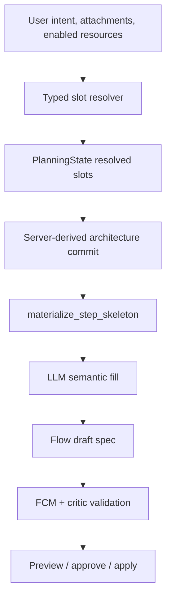

# Batch 11 — Flow AI Builder Reliability Plan

## TL;DR

1. Batch 11 is a Flow AI Builder reliability/rebuild batch, not a continuation of Batch 10 operability source work.
2. The first reliability target is backend-owned Flow mechanics: architecture-derived skeletons must be the contract, and the LLM should fill semantics only.
3. Swedish-first intent understanding should move from keyword gates to a typed slot resolver with a frozen eval corpus.
4. LiteLLM structured outputs are required as provider-aware defense-in-depth, not as the primary fix for architecture-class failures.
5. Implementation must happen in small slices with measurable success thresholds and Claude review before each commit.

## Current Repository State

| Item | Current value | Decision |
|---|---|---|
| Branch | `feature/refactor-flows-flowai` | Continue on this branch only unless user changes branch policy. |
| Current HEAD at Batch 11 implementation start | `832f4c1b flows: close branding namespace docs` | Batch 10 is committed through the documentation/ADR closure slice. |
| Staged files | none | Safe for docs planning. |
| Known unrelated dirty files | `scripts/run_codex_review.sh`, `PRODUCT.md`, `docs/refactor/goals.md` | Do not stage or commit as part of Batch 11 planning. |
| Source implementation in first pass | 11.0a reliability corpus | Start with the lowest-risk reliability gate before measurement hooks or behavior changes. |

## Read-First Inputs For The Implementation Agent

1. `AGENTS.md`
2. `docs/refactor/implementation-order.md`
3. `docs/refactor/execution/loop-protocol.md`
4. `docs/refactor/execution/retrospective-checklist.md`
5. `docs/refactor/execution/implementation-bootstrap.md`
6. `docs/refactor/execution/batch-10-operability-cleanup-docs/plan.md`
7. `docs/refactor/execution/batch-10-operability-cleanup-docs/journal.md`
8. latest Batch 10 retrospective and Claude reconciliation
9. `docs/refactor/prd/PRD-005-ai-builder-architecture.md`
10. `docs/refactor/prd/PRD-011-flow-ai-builder-reliability.md`
11. `docs/refactor/ai-builder-prompt-contract.md`
12. `docs/engineering/maintainability-standards.md`
13. `docs/engineering/api-design-standard.md`
14. `docs/engineering/testing-standard.md`
15. `docs/engineering/comment-and-readability-standard.md`
16. `docs/refactor/execution/batch-11-flow-ai-builder-reliability/manual-eval-runbook.md`

## Problem Statement

Flow AI Builder must reliably generate valid Eneo Flows from Swedish and English user intent without relying on repair as the normal success path. The reported Swedish audio-to-DOCX failure showed the current mismatch:

- UI confirmation had already understood runtime input as `Ljud` and final result as `DOCX`.
- The final proposal then failed quality because no compiled step had `input_type="audio"` or `output_mode="transcribe_only"`.
- Proposal repair could not honestly fix that, because the create proposal contract tells the LLM not to emit low-level mechanics such as `input_type` or `output_mode`.
- A later local debug export exposed a second architecture-class failure: the penultimate DOCX-preparation step returned metadata-only JSON (`docx_title`, `document_sections_count`), then the terminal DOCX step consumed that tiny JSON instead of the content-rich sections produced earlier and generated generic prose.

Batch 11 therefore treats Flow mechanics as backend-owned. The LLM should choose semantic content and refs inside a server-derived skeleton, not rediscover the Flow framework.

## Canonical Ownership Inventory

| Concept | Current owner | Evidence | Batch 11 action |
|---|---|---|---|
| Engine legal Flow tuples | `backend/src/intric/flows/flow_capability_manifest.py` | FCM is engine truth in `flow_capability_manifest.py:1-20`; `transcribe_only` requires audio-to-text in `flow_capability_manifest.py:516-557`; chain compatibility is checked in `flow_capability_manifest.py:970-978`. | Reuse as the validation truth. |
| Resolved planning state | `backend/src/intric/flows/ai_builder/planning_state.py` | PlanningState is the persisted typed JSONB source in `planning_state.py:1-24`; slots and architecture types are declared in `planning_state.py:111-158`. | Add typed resolver output here; do not create a parallel state bag. |
| Architecture derivation | `backend/src/intric/flows/ai_builder/ai_builder_architecture_derivation.py` | `derive_architecture_commit_draft` maps PlanningState to architecture tuples in `ai_builder_architecture_derivation.py:27-67`; audio non-text output maps to `audio_to_artifact_report` in `ai_builder_architecture_derivation.py:169-194`. | Promote derived architecture into the `materialize_step_skeleton` precondition. |
| Pattern archetypes | `backend/src/intric/flows/ai_builder/pattern_registry.py` | Pattern Registry is planner-facing and versioned, while FCM remains engine truth. | Reuse; add only earned archetypes such as form-field lifecycle. |
| Outline compile | `backend/src/intric/flows/ai_builder/ai_builder_create_outline.py` | `outline_flow` strips backend-owned mechanics in `ai_builder_create_outline.py:68-96`; `_apply_server_pattern_chain` is called from `compile_outline_to_create_draft` in `ai_builder_create_outline.py:515-540`. | Change from opportunistic mechanics injection to skeleton fill. |
| Pattern chain expansion | `backend/src/intric/flows/ai_builder/ai_builder_outline_pattern_chains.py` | Audio pattern expansion is predicate-driven in `ai_builder_outline_pattern_chains.py:261-315`. | Reuse or promote into canonical `materialize_step_skeleton`; avoid a parallel path. |
| Intent resolution | `backend/src/intric/flows/ai_builder/ai_builder_input_architecture_policy.py` | Current audio/document/text inference uses bilingual markers and free-text checks in `ai_builder_input_architecture_policy.py:32-248` and `:443-488`. | Demote keyword logic to resolver prior after a typed LLM resolver is measured. |
| Enabled MCP resources | `ai_builder_mcp_resources.py`, `ai_builder_mcp_intent.py` | Resources are normalized in `ai_builder_mcp_resources.py:29-88`; selected refs are enforced in `ai_builder_mcp_intent.py:388-433`. | Reuse and enum-bind refs in LLM materials. |
| Flow capability prompt material | `ai_builder_flow_capability_reference.py` | Structured reference block is generated from typed Flow sources in `ai_builder_flow_capability_reference.py:18-75`. | Strengthen this owner; do not invent a new manifest layer. |
| LiteLLM provider adapter | `TenantModelAdapter` | Supported params are checked in `tenant_model_adapter.py:214-236`; completions use `drop_params=True` in `tenant_model_adapter.py:578-607`. | Add a provider-aware structured-output rail only after materialization and resolver contracts are clear. |

## Architecture Direction



### Backend Decides

- runtime input type
- step input and output types
- output mode
- input source
- runtime upload ownership
- chain compatibility
- required skeleton roles
- form-field declaration/use validation
- enabled model, assistant, knowledge, MCP server, and MCP tool allow-lists

### LLM Decides

- step names
- task/prompt content
- semantic instructions
- secondary input field proposals
- exact allowed refs from backend-supplied allow-lists
- follow-up question wording when a required slot is unknown
- Swedish phrasing for user-facing plan text

### Repair Is Limited To

- malformed JSON or tool-call shape
- unresolved refs that can be corrected from the same allow-list
- localized field-level fixes

Repair must not redesign Flow architecture, invent mechanics, or hide a backend materialization bug.

Architecture-class invariant failures must raise a typed internal error such as
`AIBuilderArchitectureError` with a sanitized public code and full structured
log context. They must not enter semantic/proposal repair.

## Slice Plan

### 11.0 — Measurement Baseline And Production-Failure Corpus

Goal:
Measure current behavior and freeze the reliability corpus before changing mechanics.

Deliverables:

- first-attempt compile success event/metric
- repair invocation reason event/metric
- `materialize_step_skeleton` path event/metric once skeleton code exists
- structured-output path event/metric once 11.5 exists
- journal baseline for current AI Builder goldens and known failures
- local manual API smoke-suite runbook and harness plan for six stable Swedish prompts plus revise-plan and edit-existing-flow scenarios
- frozen reliability corpus in the existing AI Builder benchmark case owner with:
  - the reported Swedish audio-to-DOCX failure
  - at least five additional captured Swedish prompts from telemetry, journals, or manual reproduction
  - expected slots and expected high-level Flow shape
  - a manifest/minimum-count test so cases cannot be removed silently

Do not:

- change proposal behavior
- add a generic metrics manager
- touch frontend

Validation:

```bash
cd backend && uv run pytest tests/unittests/flows/ai_builder tests/integration/flows/test_ai_builder_session_api_regressions.py -q
cd backend && uv run pyright <touched files>
cd backend && uv run ruff check <touched files>
cd backend && uv run ruff format --check <touched files>
cd backend && uv run lint-imports --no-cache
git diff --check -- <touched paths>
```

Exit gate:

- baseline numbers are written to the journal before 11.1 starts
- reliability corpus exists and has an integrity/minimum-count test
- later reliability pass-rate targets use the reliability corpus, not goldens authored later in the batch
- manual smoke-suite harness shape, dry-run validation, redacted scorecard schema, workspace/model fixture requirements, create/revise/edit coverage, and initial baseline procedure are documented before behavior changes
- manual smoke-suite regressions are either fixed or promoted into automated corpus/tests before a slice commits

#### 11.0a — Frozen Reliability Corpus

Goal:
Create the canonical automated corpus target before adding instrumentation or
changing proposal behavior.

Canonical owner:
`backend/tests/integration/flows/ai_builder/benchmark/cases.py` owns AI Builder
prompt fixtures. 11.0a extends that owner with typed reliability cases rather
than creating a parallel JSON corpus. The existing `BENCHMARK_CASES` tuple
continues to own deterministic discovery measurements; the new reliability
tuple owns Flow-shape expectations for reported/manual failures.

Deliverables:

- Frozen typed reliability cases using dataclasses and closed source/domain tags.
- The reported Swedish audio-to-DOCX failure plus the six stable Swedish manual-runbook prompts.
- Named type contract: `CorpusSource`, `DomainCoupling`, `BehavioralRisk`, `ExpectedSlot`, `ExpectedStepShape`, `ExpectedFlowShape`, and `ReliabilityCorpusCase`.
- Expected slot values using the existing requirement-slot names from `ai_builder_slot_vocabulary.py`.
- Expected high-level Flow shape as a named typed contract, including ordered step tuples using engine values from `intric.flows.enums`.
- Unit test that validates minimum count of seven, unique IDs, Swedish language, closed source tags, canonical slot names, Flow enum values, FCM-legal step tuples, content-based reported audio-to-DOCX presence with an explicit `audio -> text / transcribe_only` step, enum-derived coverage with typed exclusions, domain-neutrality tags, and `BehavioralRisk` coverage.

Do not:

- call the LLM
- change planner, compiler, repair, validator, or runtime behavior
- add a harness script in this slice
- introduce JSON/YAML fixture parsing or new dependencies
- hardcode production behavior for the corpus prompts

Validation:

```bash
cd backend && uv run pytest tests/integration/flows/ai_builder/benchmark/test_reliability_corpus.py tests/integration/flows/ai_builder/benchmark/test_baseline_benchmark.py -q
cd backend && uv run pyright tests/integration/flows/ai_builder/benchmark/cases.py tests/integration/flows/ai_builder/benchmark/test_reliability_corpus.py
cd backend && uv run ruff check tests/integration/flows/ai_builder/benchmark/cases.py tests/integration/flows/ai_builder/benchmark/test_reliability_corpus.py
cd backend && uv run ruff format --check tests/integration/flows/ai_builder/benchmark/cases.py tests/integration/flows/ai_builder/benchmark/test_reliability_corpus.py
cd backend && uv run lint-imports --no-cache
git diff --check -- backend/tests/integration/flows/ai_builder/benchmark/cases.py backend/tests/integration/flows/ai_builder/benchmark/test_reliability_corpus.py docs/refactor/execution/batch-11-flow-ai-builder-reliability docs/refactor/prd/PRD-011-flow-ai-builder-reliability.md docs/refactor/implementation-order.md
```

Exit gate:

- reliability corpus and integrity test are committed before 11.0b measurement hooks
- Batch 11 journal records that behavior baseline numbers are still pending for 11.0b
- no source behavior changes are mixed into the corpus commit
- Flow enum exclusion lists are typed to enum members, include one-line rationales, and cannot reference removed enum values

#### 11.0b — Proposal Reliability Measurement Hooks

Goal:
Measure proposal first-attempt compile outcomes and repair reasons without
changing proposal behavior.

Canonical owners:

| Concept | Canonical owner | Decision |
|---|---|---|
| Per-turn `planner_telemetry` dict shape | `backend/src/intric/flows/ai_builder/ai_builder_telemetry.py` | Extend `build_planner_telemetry` with optional proposal fields; do not mutate telemetry dicts in proposal code. |
| Proposal task token/attempt accounting | `backend/src/intric/flows/ai_builder/ai_builder_proposal_telemetry.py` | Move and rename the old processor-local usage tracker to `ProposalTurnTelemetry`. |
| Tool-result failure taxonomy | `ToolProcessingFailureKind` in `ai_builder_proposal_telemetry.py` | Keep internal repair-loop values typed, including the tested `recoverable_parse` subtype. |
| Sanitized proposal failure taxonomy | `ProposalFailureKind` in `ai_builder_proposal_telemetry.py` | Expose only `parse`, `validation`, `quality`, and `missing_submission_tool`; map `recoverable_parse` to `parse`. |

Deliverables:

- `ProposalTurnTelemetry` records token usage, LLM repair-call count,
  first-attempt proposal outcome, and proposal repair reasons for one proposal
  turn.
- Structured proposal logs use one nested `ai_builder_proposal_telemetry`
  payload with a documented schema-version bump policy.
- Create proposal path records:
  - first-attempt success for valid initial `outline_flow`
  - parse / validation / quality first-attempt failures
  - repair reasons for parse / validation / quality failures
- Edit proposal path records the same first-attempt and repair-reason fields.
- Missing-submission-tool path records `missing_submission_tool` and preserves it
  when the forced retry later succeeds.
- `ToolProcessingResult.failure_kind` is tightened to the internal typed
  taxonomy.
- Deterministic baseline numbers are written to the journal before 11.1 starts.

Do not:

- change proposal, compiler, validator, repair, or runtime behavior
- add public `SessionTelemetrySummary` fields
- touch frontend or generated client files
- record `confirm_requirements` or discovery-question repair as proposal compile
  telemetry
- add a generic metrics manager

Validation:

```bash
cd backend && uv run pytest tests/unittests/flows/ai_builder/test_ai_builder_proposal_telemetry.py tests/unittests/flows/ai_builder/test_ai_builder_proposal_processor.py tests/unittests/flows/ai_builder/test_ai_builder_proposal_repair.py -q
cd backend && uv run pytest tests/integration/flows/ai_builder/benchmark/test_reliability_corpus.py tests/integration/flows/ai_builder/benchmark/test_baseline_benchmark.py -q
cd backend && uv run pytest tests/integration/flows/ai_builder -q
cd backend && uv run pyright <touched files>
cd backend && uv run ruff check <touched files>
cd backend && uv run ruff format --check <touched files>
cd backend && uv run lint-imports --no-cache
git diff --check -- <touched paths>
```

Exit gate:

- journal contains concrete deterministic baseline numbers
- journal explicitly states that live LLM first-attempt pass rate is not part of
  this deterministic baseline
- no proposal behavior change is mixed into the measurement commit
- Claude implementation review reaches green or any disagreement is documented
  with file:line evidence

### 11.1 — StepSkeleton Materialization

Goal:
Make backend-derived Flow mechanics mandatory and deterministic.

Plan requirements before implementation:

| Required inventory | Output |
|---|---|
| Existing architecture derivation callers | file:line list and decision |
| Existing pattern chain realizers | role, predicate, kept/moved/rewritten |
| Critic invariants | architecture / semantic / hybrid classification |
| Edit-path compile behavior | fill missing / preserve valid / reject incompatible |
| New owner choice | prefer reuse/rename of existing pattern-chain owner; create a narrow new file only if current owner cannot become canonical without parallel logic |

Deliverables:

- `StepSkeleton` typed value object.
- Mandatory skeleton materialization from PlanningState, FCM, and Pattern Registry.
- `compile_outline_to_create_draft` fills semantic content into skeleton slots.
- Critic invariants no longer ask repair to solve backend-owned mechanics.
- Canaries for audio-to-DOCX, audio-to-PDF, document-to-DOCX template/fill, document-to-PDF, text-to-JSON, JSON-to-text/JSON, and multi-step chains.
- Typed architecture failure surface, for example `AIBuilderArchitectureError`, that bypasses repair and reaches existing SSE/API error translation with a sanitized code.

Skeleton fill rules:

Use the `Skeleton Fill Contract` in `docs/refactor/prd/PRD-011-flow-ai-builder-reliability.md`. The implementation plan must not duplicate or weaken that contract.

Internal split:

- 11.1a: typed step slots and `materialize_step_skeleton` owner.
- 11.1b: skeleton fill rules and compile integration.
- 11.1c: critic invariant classification, architecture failure surface, and canary tests.
- 11.1d: edit-path fill/preserve/reject mechanics. This closed the 11.1c carry-forward without mixing edit behavior into the create-path architecture-error slice.
- 11.1e: artifact-body source hardening. The final semantic step feeding a backend-fixed text consumer must stay text even if the LLM asks for output fields, and JSON-to-text previous-step boundaries must compile an explicit `Underlag till text` bridge to `previous.output.structured`.

Success gate:

- zero chain-materialization regressions on the canary suite
- audio-to-DOCX compiles without repair
- no LLM output field is required to echo backend-owned mechanics
- terminal DOCX/PDF steps are not fed metadata-only JSON when a content-bearing text body is required
- fixed PlanningState/FCM tuple tests produce FCM-legal chains
- Swedish corpus pass-rate is not claimed until 11.2 lands

### 11.2 — Swedish Slot Resolver

Goal:
Use a typed resolver to understand Swedish and English intent without brittle keyword gates.

Slice split:

- 11.2a: freeze the Swedish corpus and existing slot contract before adding a
  model-backed resolver.
- 11.2b: wire the model-backed resolver into the live PlanningState path,
  delete the duplicate discovery-only semantic parser/result type, and keep the
  deterministic corpus baseline unchanged.
- 11.2c: run provider-backed resolver evaluation, decide telemetry and
  disagreement measurements from real model behavior, and claim or revise the
  final accuracy gate against the frozen corpus.

Plan requirements before implementation:

- inventory current slot values from `ai_builder_slot_vocabulary.py`
- inventory current keyword gates in `ai_builder_input_architecture_policy.py`
- design resolver schema with legal enum values and `unknown`
- define confidence/follow-up threshold
- define where keyword evidence becomes a JSON prior
- define audit/log fields for model, tenant, confidence, capability path, and latency

Deliverables:

- typed resolver result model
- frozen Swedish eval corpus under the canonical AI Builder corpus owner chosen in 11.2
- resolver accuracy test
- follow-up question behavior for unknown/ambiguous slots
- keyword logic kept as prior in this slice, not deleted

Success gate:

- initial target: at least 85% resolver accuracy on a frozen Swedish corpus with at least 80 labeled cases
- no corpus shrinkage without explicit test failure or review note
- no hardcoded transcription/document-summary special cases
- keyword prior deletion criterion is written before implementation, starting from: resolver matches or improves on keyword decisions for at least 95% of the corpus and no reviewed production sample over seven days shows a resolver/keyword disagreement on an architecture-class slot

#### 11.2a — Swedish Corpus And Existing Slot Contract

Goal:
Freeze the corpus and legal-value contract before introducing model behavior.

Implemented:

- `planning_state.py` accepts `source="model"` and `confidence="low"` on
  `ResolvedSlot`.
- `question_catalog.py` exposes `legal_slot_values()` from the existing
  question catalog rather than duplicating slot-value lists.
- `benchmark/cases.py` owns `SLOT_RESOLVER_CORPUS_CASES` with 80 labeled
  Swedish prompts and `SlotCoverageTag` distribution tags.
- `test_slot_resolver_corpus.py` validates stable IDs, Swedish prompts,
  expected slot names, catalog-backed legal values or `unknown`, per-tag
  coverage, domain neutrality, and keyword-prior baseline measurement through
  `build_planning_state_from_conversation`.

Observed baseline:

- current keyword prior: `229/276 = 0.830`
- guard floor: `0.70`
- final 11.2 resolver target remains at least `0.85` on the frozen corpus

Carry-forward to 11.2b:

- model-backed resolver result model and parser
- follow-up behavior for unknown or low-confidence architecture slots
- resolver telemetry for model, tenant, confidence, capability path, and latency
- JSONB round-trip test for model/low slot persistence
- keyword-prior deletion criterion and disagreement measurement

#### 11.2b — Model Slot Resolver Runtime Overlay

Goal:
Wire model-backed slot classification into the live PlanningState path without
creating a parallel resolver contract.

Implemented:

- `ai_builder_slot_classifier.py` owns the shared classifier core,
  `ClassifiedSlot`, `SlotClassificationResult`, the canonical
  `slots/slot_name` JSON shape, cache key, and tenant-aware logs.
- `ai_builder_semantic_adjudication.py` now delegates discovery classification
  to the shared classifier and no longer owns a duplicate parser/cache/result
  type.
- `NON_LLM_RESOLVABLE_SLOT_NAMES` in `ai_builder_slot_vocabulary.py` excludes
  DOCX/PDF generation mode from model guessing; those remain explicit user or
  deterministic policy decisions.
- `build_runtime_planning_state()` in `ai_builder_discovery_runtime.py` owns
  async model classification and overlays accepted slots before planner action
  policy runs.
- `merge_llm_resolved_slots()` in `planning_state_builder.py` keeps the sync
  merge contract conservative:
  - explicit structured answers, requirements summaries, and flow defaults win
  - high-confidence model slots can replace heuristic and policy-default slots
  - medium-confidence model slots can replace heuristic slots and fill missing
    slots
  - low or `unknown` model slots are not persisted
- Blocking discovery disables the PlanningState classifier overlay, preserving
  zero-LLM backend follow-up behavior.

Validated behavior:

- old `signals/question_id` classifier JSON is not accepted
- unknown/low/non-LLM slots are not persisted
- model output cannot displace explicit, summary, or flow-default evidence
- weak policy-default and heuristic slots can be upgraded by model evidence
- deterministic corpus baseline still uses `build_planning_state_from_conversation`
  and does not call the model

Carry-forward:

- run a provider-backed eval against the frozen 80-case corpus before claiming
  the final `>= 0.85` target
- decide the keyword-prior deletion threshold after real model disagreement
  data exists
- keep discovery question-id and PlanningState slot-name namespace unification
  as a future cleanup candidate

#### 11.2c — Slot Resolver Provider Evaluation Harness

Goal:
Make the `>= 0.85` Swedish slot resolver target measurable against a real
provider without adding live-provider calls to CI or committing raw model
responses.

Canonical owners:

| Concept | Owner | Decision |
|---|---|---|
| Frozen slot corpus | `backend/tests/integration/flows/ai_builder/benchmark/cases.py` | Reuse `SLOT_RESOLVER_CORPUS_CASES`; do not create a second prompt manifest. |
| Deterministic baseline guard | `backend/tests/integration/flows/ai_builder/benchmark/test_slot_resolver_corpus.py` | Keep the existing sync-builder floor as the non-provider CI gate. |
| Slot scoring semantics | new `backend/tests/integration/flows/ai_builder/benchmark/slot_resolver_scoring.py` | Extract the current `unknown` matching semantics so the deterministic test and provider harness cannot drift. |
| Provider eval runner | new `backend/tests/integration/flows/ai_builder/benchmark/slot_resolver_provider_eval.py` | Create a narrow benchmark module because existing `runner.py` measures discovery questions/archetypes, not runtime model slot overlay. |
| Runtime path under evaluation | `backend/src/intric/flows/ai_builder/ai_builder_discovery_runtime.py` | Evaluate `build_runtime_planning_state()` so the score includes deterministic priors plus the model overlay used by planner runtime. |

Deliverables:

- local CLI module for the slot corpus with safe `--dry-run` default and
  explicit `--live` mode for provider calls
- shared slot scoring helper used by both `test_slot_resolver_corpus.py` and
  the provider-eval runner; `expected="unknown"` matches absent or explicit
  `unknown` observations
- typed scorecard dataclasses for:
  - `scorecard_schema_version=1`
  - corpus hash over `(case_id, ui_language, prompt, expected_slots,
    coverage_tags)`
  - model/config metadata from a fixed allow-list
  - deterministic keyword-prior score
  - runtime full-score after model overlay
  - runtime LLM-resolvable-slot score
  - keyword-vs-runtime agreement/disagreement counts by slot name
  - per-case expected/observed slot values, source, confidence, and match flags
  - provider call count and provider error count
- gate semantics:
  - the authoritative `>= 0.85` metric is per-slot LLM-resolvable-slot score
    on provider-success cases
  - full runtime score and keyword-prior score are reported context only
  - target claim is allowed only when provider errors are zero and every corpus
    case reached the provider-success path
- environment contract for live runs:
  - required `ENEO_AI_BUILDER_SLOT_EVAL_MODEL`
  - required `ENEO_AI_BUILDER_SLOT_EVAL_TENANT_ID`
  - optional `ENEO_AI_BUILDER_SLOT_EVAL_API_KEY`
  - optional `ENEO_AI_BUILDER_SLOT_EVAL_API_BASE`
  - optional `ENEO_AI_BUILDER_SLOT_EVAL_API_VERSION`
  - optional `ENEO_AI_BUILDER_SLOT_EVAL_API_TYPE`
- deterministic unit tests for score calculation, corpus hashing, dry-run
  behavior, config validation, redacted output shape, and live-run guardrails
  using a fake LiteLLM client
- journal entry that records whether a live provider run was available in this
  session; do not claim the threshold without a real provider scorecard

Do not:

- commit raw provider responses, prompts outside the existing corpus, response
  reasons, transcripts, API keys, full API base URLs, tenant ids, or unredacted
  local artifacts
- make provider calls in normal pytest
- add feature flags or runtime product behavior
- add another corpus owner or JSON/YAML prompt manifest
- hardcode model-specific behavior for the 80 cases
- delete keyword priors in this slice
- use `TenantModelAdapter` or database tenant model resolution; the harness uses
  the bare `litellm` module with `configure_litellm_runtime(litellm)` and
  `classify_slots(... drop_params=True ...)` through the runtime path
- add a production cache-clearing API for eval; valid live scorecards are
  produced by invoking the CLI as a fresh process, and `provider_call_count` is
  a sanity counter rather than a quality metric

Validation:

```bash
cd backend && uv run pytest tests/integration/flows/ai_builder/benchmark/test_slot_resolver_provider_eval.py tests/integration/flows/ai_builder/benchmark/test_slot_resolver_corpus.py -q
cd backend && uv run pytest tests/unittests/flows/ai_builder -q
cd backend && uv run pyright tests/integration/flows/ai_builder/benchmark/slot_resolver_scoring.py tests/integration/flows/ai_builder/benchmark/slot_resolver_provider_eval.py tests/integration/flows/ai_builder/benchmark/test_slot_resolver_provider_eval.py tests/integration/flows/ai_builder/benchmark/test_slot_resolver_corpus.py
cd backend && uv run ruff check tests/integration/flows/ai_builder/benchmark/slot_resolver_scoring.py tests/integration/flows/ai_builder/benchmark/slot_resolver_provider_eval.py tests/integration/flows/ai_builder/benchmark/test_slot_resolver_provider_eval.py tests/integration/flows/ai_builder/benchmark/test_slot_resolver_corpus.py
cd backend && uv run ruff format --check tests/integration/flows/ai_builder/benchmark/slot_resolver_scoring.py tests/integration/flows/ai_builder/benchmark/slot_resolver_provider_eval.py tests/integration/flows/ai_builder/benchmark/test_slot_resolver_provider_eval.py tests/integration/flows/ai_builder/benchmark/test_slot_resolver_corpus.py
git diff --check -- backend/tests/integration/flows/ai_builder/benchmark/slot_resolver_scoring.py backend/tests/integration/flows/ai_builder/benchmark/slot_resolver_provider_eval.py backend/tests/integration/flows/ai_builder/benchmark/test_slot_resolver_provider_eval.py backend/tests/integration/flows/ai_builder/benchmark/test_slot_resolver_corpus.py docs/refactor/execution/batch-11-flow-ai-builder-reliability
```

Optional live validation, only when the local provider fixture is explicitly
configured:

```bash
cd backend && uv run python -m tests.integration.flows.ai_builder.benchmark.slot_resolver_provider_eval --live --output .codex/artifacts/slot-resolver-provider-eval-$(date -u +%Y%m%dT%H%M%SZ).json
```

Exit gate:

- dry-run and deterministic fake-provider tests pass
- live mode refuses to run without explicit model and tenant id config
- redacted scorecard includes `scorecard_schema_version=1`; field meaning
  changes require a schema-version bump
- `.codex/artifacts/` is verified as ignored before using it for optional live
  scorecards
- if live provider config is unavailable, the journal says the target is still
  unclaimed and records the exact command needed
- if live provider config is available, the scorecard records whether the
  LLM-resolvable provider-success per-slot score meets `>= 0.85`

### 11.3 — Form Fields And Resource Semantics

Goal:
Make secondary form fields and enabled resources reliable without overloading prompts.

Deliverables:

- inventory proving whether existing Pattern Registry can express form-field declaration, use, and downstream reference
- form-field lifecycle archetype only if existing Pattern Registry cannot express the lifecycle without parallel semantics
- invariant that `uses_form_fields` references resolve to declared fields
- goldens for declare-only, chain, and multi-reference form-field flows
- LLM material listing enabled models, assistants, knowledge bases, MCP servers, and MCP tools as exact refs
- ref validation for chosen MCP/knowledge/assistant resources

Success gate:

- missing or stale form-field refs fail with typed diagnostics
- resource refs are exact, enabled, and tenant/workspace-safe

#### 11.3a — Proposal Resource Reference Material Owner

Scope:

- Make `AIBuilderResourceCatalog` the proposal-time owner for exact resource
  material as well as resource canonicalization. The proposal prompt should be
  rendered from the same catalog that later resolves/rejects submitted refs.
- Route both the available-resource block and the selected-MCP block through
  the same catalog-owned typed material so MCP rendering cannot drift inside the
  proposal task.
- Clamp rendered descriptions in the catalog material so free-form resource
  descriptions cannot silently consume the proposal prompt budget.
- Do not add `assistant_ref` to the create/edit contract in this slice. Current
  AI Builder drafts define inline `AssistantSpec` per step and materialize
  flow-managed assistants; selecting pre-existing assistants would be a separate
  product/API contract with permission and materializer implications.
- Do not change discovery-time resource rendering in this commit. Discovery
  prompt material is localized phase policy; proposal-time rendering is the
  draft-emitting path that must first share the validation catalog. Discovery
  rendering gets its own follow-up after the proposal renderer shape is stable.

Owner inventory:

| Concept | Existing owner | 11.3a decision |
|---|---|---|
| Exact model/knowledge/MCP ref allow-list | `backend/src/intric/flows/ai_builder/ai_builder_resource_catalog.py` | Extend this owner with typed proposal resource material so prompt material and validation cannot drift. |
| Proposal prompt resource block | `backend/src/intric/flows/ai_builder/ai_builder_plan_proposal_task.py` | Replace local dict rendering with catalog-rendered exact refs. |
| Selected MCP prompt block | `backend/src/intric/flows/ai_builder/ai_builder_plan_proposal_task.py` | Keep policy text in the task, but render selected server/tool refs from the same catalog material used by the available-resource block. |
| Discovery-time resource prompt material | `backend/src/intric/flows/ai_builder/ai_builder_prompts.py` | Explicitly defer; add a follow-up instead of broadening this resource slice. |
| Existing flow assistant state in edit mode | `backend/src/intric/flows/ai_builder/ai_builder_flow_context.py` | Leave as context snapshots; do not introduce a selectable assistant-ref field. |

Planned files:

| File | Purpose |
|---|---|
| `backend/src/intric/flows/ai_builder/ai_builder_resource_catalog.py` | Add frozen `AIBuilderResourceReferenceMaterial` / entry value objects for exact refs, selected MCP refs, and descriptions bounded by `RESOURCE_DESCRIPTION_MAX_CHARS = 240`. |
| `backend/src/intric/flows/ai_builder/ai_builder_plan_proposal_task.py` | Consume catalog resource material, delete prompt-local `_resource_ref` / `_resource_display_name` / `_resource_description`, and stop normalizing MCP resources directly. |
| `backend/tests/unittests/flows/ai_builder/test_ai_builder_resource_catalog.py` | Pin exact resource-material rendering, selected MCP grouping, description clamp, and omission of malformed refs. |
| `backend/tests/unittests/flows/ai_builder/test_ai_builder_plan_proposal_task.py` | Pin proposal prompt resource material and MCP selection material after the renderer move. |
| `docs/refactor/execution/batch-11-flow-ai-builder-reliability/journal.md` | Record plan review, decisions, validation, and carry-forward items. |
| `docs/refactor/execution/batch-11-flow-ai-builder-reliability/retrospective-10.md` | Retrospective for 11.3a. |
| `docs/refactor/execution/batch-11-flow-ai-builder-reliability/claude-reconciliation-10.md` | Claude reconciliation for 11.3a. |

Acceptance criteria:

- Proposal resource material lists only exact refs from the catalog used for
  validation: model refs, knowledge refs, MCP server refs, and enabled MCP tool
  refs.
- Proposal selected-MCP material lists selected server/tool refs from the same
  catalog material, not a second normalized-MCP iteration path.
- Resource description rendering is bounded by a catalog-owned max length.
- The slice does not add selectable assistant refs, compatibility/deprecation
  paths, generic helper modules, or comments that restate code.
- The assistant-ref deferral has an explicit trigger: add it only when AI
  Builder has a tenant/workspace-scoped allow-list for selectable existing
  assistants plus materializer and permission rules for using them.
- Assistant refs are intentionally absent from 11.3a proposal material until
  that deferral trigger is met.
- `ai_builder_plan_proposal_task.py` has no remaining
  `_resource_ref`, `_resource_display_name`, `_resource_description`, or
  `normalize_ai_builder_mcp_resources` references after the move.

Validation commands:

```bash
cd backend && uv run pytest tests/unittests/flows/ai_builder/test_ai_builder_resource_catalog.py tests/unittests/flows/ai_builder/test_ai_builder_plan_proposal_task.py -q
cd backend && uv run pytest tests/unittests/flows/ai_builder -q
cd backend && uv run pyright src/intric/flows/ai_builder/ai_builder_resource_catalog.py src/intric/flows/ai_builder/ai_builder_plan_proposal_task.py tests/unittests/flows/ai_builder/test_ai_builder_resource_catalog.py tests/unittests/flows/ai_builder/test_ai_builder_plan_proposal_task.py
cd backend && uv run ruff check src/intric/flows/ai_builder/ai_builder_resource_catalog.py src/intric/flows/ai_builder/ai_builder_plan_proposal_task.py tests/unittests/flows/ai_builder/test_ai_builder_resource_catalog.py tests/unittests/flows/ai_builder/test_ai_builder_plan_proposal_task.py
cd backend && uv run ruff format --check src/intric/flows/ai_builder/ai_builder_resource_catalog.py src/intric/flows/ai_builder/ai_builder_plan_proposal_task.py tests/unittests/flows/ai_builder/test_ai_builder_resource_catalog.py tests/unittests/flows/ai_builder/test_ai_builder_plan_proposal_task.py
cd backend && uv run lint-imports --no-cache
./scripts/gate-local/anti_slippage.sh --worktree
git diff --check -- backend/src/intric/flows/ai_builder/ai_builder_resource_catalog.py backend/src/intric/flows/ai_builder/ai_builder_plan_proposal_task.py backend/tests/unittests/flows/ai_builder/test_ai_builder_resource_catalog.py backend/tests/unittests/flows/ai_builder/test_ai_builder_plan_proposal_task.py docs/refactor/execution/batch-11-flow-ai-builder-reliability
```

#### 11.3b — Form-Field Lifecycle Goldens And Pattern Registry Decision

Scope:

- This is a test-only slice. If a golden reveals a source bug, record it and
  open 11.3c rather than expanding this slice.
- Decide with source evidence whether `form_field_runtime_inputs` needs an
  explicit chain shape for declare → use → re-reference flows, or whether the
  existing `sectioned_form_intake` and `form_field_runtime_inputs` pair is
  sufficient once behavior goldens are pinned.
- Add only non-overlapping create/compiler goldens. Existing
  `test_ai_builder_create_compiler.py` already covers form-field normalization,
  server-derived runtime hints, primary-input shadow drops, direct
  `uses_form_fields`, and leading-step usage.
- Treat edit stale-ref behavior as already pinned by
  `test_ai_builder_edit_validator.py`; add no duplicate edit test unless the
  11.3b plan identifies a missing edit lifecycle.

Scenario matrix:

| Scenario | Existing overlap to avoid | Required 11.3b assertion |
|---|---|---|
| Declare-only | `_attach_unreferenced_form_fields_to_final_step` path is partly covered by server-derived runtime hints. | User-declared `input_fields` with zero explicit `uses_input_fields` survive as `form_fields`; `draft.steps[-1].uses_form_fields == ["priority"]`; compiled final-step `input_bindings.question` contains `priority: {{ priority }}` exactly once; validation is valid. |
| Chain | Existing leading-step form-field usage covers one direct consumer. | The intermediate step uses the field; the final step does not re-reference it; final-step bindings reference the intermediate structured field (`step_a.output.structured.<path>`) and do not contain the original form-field marker; validation is valid. |
| Multi-reference | Existing tests mostly assert one consumer. | One declared field is referenced by two separate steps; each compiled binding contains the field marker exactly once; `compiled.form_fields` contains one field; validation is valid. |
| Pattern Registry expression | Existing rendered-pack tests verify `runtime_metadata_fields` membership only. | Add a single-owner invariant: exactly `form_field_runtime_inputs` owns `runtime_metadata_fields` in positive pattern required slots and question template ids. Keep 11.3b behavior-only; no new form-field chain archetype is earned. |

Test ownership:

- Put lifecycle goldens in
  `backend/tests/unittests/flows/ai_builder/test_ai_builder_form_field_lifecycle.py`
  so 11.4 can discover the seed by path instead of retrofitting markers into
  the large create-compiler test file.
- Keep the Pattern Registry single-owner invariant in
  `backend/tests/unittests/flows/ai_builder/test_pattern_registry.py`.
- Edit-path twins for form-field lifecycle belong to the 11.4 matrix slice;
  11.3b stays create-path only because edit stale-ref behavior is already
  covered by `test_ai_builder_edit_validator.py`.

Validation commands will include:

```bash
cd backend && uv run pytest tests/unittests/flows/ai_builder/test_ai_builder_form_field_lifecycle.py tests/unittests/flows/ai_builder/test_pattern_registry.py tests/unittests/flows/ai_builder/test_ai_builder_edit_validator.py -q
cd backend && uv run pytest tests/unittests/flows/ai_builder/test_ai_builder_create_compiler.py -q
cd backend && uv run pytest tests/unittests/flows/ai_builder -q
```

### 11.4 — Goldens Matrix And Edit Parity

Goal:
Make coverage gaps visible and prevent future Pattern Registry / FCM drift. Goldens are coverage gates, not the baseline reliability corpus.

#### 11.4a — Golden Coverage Matrix Harness

Scope:

- Add a compact coverage-matrix owner in
  `backend/tests/unittests/flows/ai_builder/test_ai_builder_golden_coverage_matrix.py`.
- Reuse existing canonical behavior owners instead of duplicating their fixture
  bodies:
  - Pattern Registry / FCM composition coverage remains in
    `test_ai_builder_materialization_bridge.py`.
  - Form-field lifecycle behavior remains in
    `test_ai_builder_form_field_lifecycle.py`.
  - Edit compiler behavior remains in edit compiler/lifecycle tests.
- Add one edit-path lifecycle twin for multi-reference form-field usage in
  `test_ai_builder_form_field_lifecycle.py`; declare-only and intermediate
  chain create goldens get explicit matrix exceptions because edit mode does
  not infer unreferenced form fields or re-materialize create-time intermediate
  chains implicitly.
- Keep this as a test-only slice. Source bugs found by the matrix become a
  separate bug slice.
- The matrix row unit is a coverage owner, not every fixture inside that
  owner. The materialization bridge remains one aggregate row because it
  already fails when any positive Pattern Registry archetype lacks a fixture.
  Future aggregate rows are allowed only when the referenced owner test already
  fails on missing internal fixtures for that whole aggregate surface.
- Owner-test existence is resolved with `importlib.util.find_spec` plus AST
  inspection of `def` and class method names. The matrix must not import
  sibling test modules just to verify ownership.
- Domain-neutrality in 11.4a applies to matrix metadata and new lifecycle test
  names only. Existing municipality-flavoured fixture bodies outside that
  metadata are a follow-up cleanup, not a hidden pass/fail rule here.

Planned matrix row contract:

| Field | Purpose |
|---|---|
| `row_id` | Stable coverage row id. |
| `owner_module` / `test_name` | Path-backed owner test that must exist. |
| `surface` | `create`, `edit`, or `registry_bridge`. |
| `concerns` | `frozenset[CoverageConcern]`, with enum values such as `FORM_FIELD_CHAIN`, `PATTERN_REGISTRY`, and `FCM_CHAIN`. |
| `pattern_ids` | Optional Pattern Registry ids; every listed id must exist in `PATTERN_REGISTRY`. Aggregate bridge coverage does not duplicate every registry id here because the bridge owner already enforces that set. |
| `fcm_steps` | Typed FCM step tuple chain; every tuple and chain must validate. |
| `edit_twin_id` / `edit_exception` | Required for create rows. Exceptions include both `reason` and `retire_when`. |

Deliverables:

- matrix harness across FCM capabilities, Pattern Registry compositions, and create/edit paths
- domain-neutral goldens for simple and complex flows
- edit-path twin or explicit exception for each create golden
- metadata neutrality guard for row ids, owner references, concerns, and
  exception text

Success gate:

- missing supported cells fail the test suite
- at least 20% of goldens exercise edit-path parity initially
- form-field chain coverage target begins at 30% after 11.3 lands
- matrix rows reference existing test owners by module/function so row drift
  fails at collection time
- no broad new fixture registry duplicates the reliability corpus or the
  materialization bridge archetype cases
- initial denominator is 5 owner rows: 4 carry `FORM_FIELD_CHAIN` and 1 is an
  edit row, satisfying the 30% form-field and 20% edit-row gates
- adding a non-chain or non-edit owner row requires backfilling a counterpart
  row in the same slice; do not lower percentage gates to absorb denominator
  growth

### 11.5 — LiteLLM Structured Output Rail

Goal:
Reduce JSON/shape repair by using provider-supported structured outputs while preserving provider portability.

Official LiteLLM reference:
<https://docs.litellm.ai/docs/completion/json_mode>

Plan requirements before implementation:

- inspect current `TenantModelAdapter` param support/drop behavior
- make `TenantModelAdapter` the single provider-capability owner
- use explicit model config as the authoritative override and LiteLLM support checks as evidence
- define capability path: `strict_json_schema`, `json_object`, `prompt_with_pydantic_validation`
- define Pydantic validation boundary
- define fallback behavior and logging
- keep tool calls orthogonal to structured-output mode; do not model tool calls as a fallback rung

Deliverables:

- typed structured-output request path for planner JSON, `outline_flow`, `edit_flow`, and parse repair. Semantic repair joins this rail only when its output contract is a typed JSON object and the slice plan proves the benefit.
- tests for every capability path
- parse-repair metrics before/after comparison

Success gate:

- parse-repair invocations drop for schema-capable models
- tenants without structured output support do not regress
- architecture-class success does not depend on structured outputs

#### 11.5a — Planner Provider Capability Rail

Scope:

- Add the provider capability decision owner before expanding structured-output
  hints into proposal tools. This slice wires the planner JSON turn and chained
  server-action planner turn only.
- Use `TenantModelAdapter` and `CompletionService` as the capability path, with
  `AIBuilderService.prepare_message_context` resolving the decision once before
  SSE streaming starts.
- Use LiteLLM metadata as evidence:
  `supports_response_schema(...)` for `strict_json_schema`, and
  `get_supported_openai_params(..., custom_llm_provider=...)` for
  `json_object`.
- Keep `drop_params=True` on planner calls so provider-specific unsupported
  params are stripped by LiteLLM instead of turning into tenant-visible planner
  failures.
- Do not add explicit model overrides in this slice. Tenant/model metadata is
  the canonical capability source until a concrete configuration requirement is
  designed.
- Do not send `response_format` to proposal tool-call prompts in this slice.
  Tool calls remain orthogonal to planner JSON structured-output mode.

Planner strict-schema finding:

- `PlannerOutput.model_json_schema()` is not currently strict-output ready.
  Local inspection found nested union/default/optional-object blockers. For a
  strict-schema-capable provider, 11.5a therefore downgrades the planner request
  to `json_object` and logs `planner_output_strict_blocked=true`.
- 11.5b may make `PlannerOutput` strict-ready by changing the actual typed
  contract. Do not hide this by adding a parallel schema or a compatibility
  wrapper.

Telemetry:

- New keys:
  - `structured_output_capability_path`
  - `structured_output_request_mode`
  - `structured_output_decision_source`
  - `structured_output_response_schema_supported`
  - `structured_output_response_format_supported`
  - `planner_output_strict_blocked`
  - `planner_output_strict_blocker_count`
- The old planner-turn JSON-mode telemetry keys are not preserved in 11.5a.
  Flow AI Builder is unreleased, and the structured-output fields are the new
  canonical log contract for this slice.

Acceptance:

- Capability resolution is typed, immutable, and has consistency checks.
- The planner computes one structured-output decision per prepared message
  context and passes it to both the main planner turn and chained server-action
  planner turn.
- Providers with strict schema support use `json_object` for current
  `PlannerOutput` until the schema blockers are removed.
- Providers with only `response_format` support use `json_object`.
- Providers without structured-output support omit `response_format` and keep
  Pydantic validation as the contract boundary.
- Proposal tool-call prompts do not receive planner `response_format` kwargs.

Validation:

```bash
cd backend && uv run pytest tests/unit/test_tenant_model_capabilities.py tests/unit/test_tenant_model_adapter_prepare_kwargs.py tests/unittests/flows/ai_builder/test_ai_builder_response_format.py tests/unittests/flows/ai_builder/test_ai_builder_service.py::TestPlannerContextPreparation tests/unittests/flows/ai_builder/test_ai_builder_planner_send_message.py tests/unittests/flows/ai_builder/test_ai_builder_parse_repair.py tests/unittests/flows/ai_builder/test_ai_builder_proposal_processor.py tests/unittests/flows/ai_builder/test_ai_builder_router.py -q
cd backend && uv run pytest tests/unittests/flows/ai_builder -q
cd backend && uv run pytest tests/integration/flows/ai_builder -q
cd backend && uv run pyright <11.5a touched source and test files>
cd backend && uv run ruff check <11.5a touched source and test files>
cd backend && uv run ruff format --check <11.5a touched source and test files>
cd backend && uv run lint-imports --no-cache
git diff --check -- <11.5a touched paths>
```

11.5b follow-up:

- Make the planner contract strict-schema compatible or explicitly document why
  a strict schema is not a maintainable fit.
- Extend the same typed rail to `outline_flow`, `edit_flow`, and parse repair
  only where the output contract is a typed JSON object.
- Verify real tenant Anthropic Haiku behavior in a provider smoke run, because
  LiteLLM metadata can differ across model aliases and custom providers.
- Keep structured-output telemetry compact; add new fields only when a
  dashboard, alert, or support workflow has a named question the existing keys
  cannot answer.

#### 11.5b — Proposal Tool-Call Boundary And Strict-Schema Decision

Scope:

- Finish the immediate 11.5 structured-output boundary decision for proposal
  tool calls. `outline_flow` and `edit_flow` are function-tool contracts, not
  planner JSON responses, so this slice makes the proposal completion boundary
  strip planner `response_format` kwargs immediately before LiteLLM receives
  `tools`.
- Keep planner parse repair on the planner structured-output rail. Parse repair
  repairs `PlannerOutput`, so it should inherit the same planner request kwargs
  selected in 11.5a.
- Decide the strict-schema question with source evidence. Current
  `PlannerOutput` uses a discriminated action union plus optional/defaulted
  fields. OpenAI structured-output guidance requires object schemas with all
  fields required and `additionalProperties=false`, while LiteLLM forwards
  strict `json_schema` / Pydantic response formats only when the provider
  supports that path. A strict-friendly planner wire shape would require a
  deliberate planner contract refactor, not a generated parallel schema.

Canonical owners:

| Concept | Owner | 11.5b decision |
|---|---|---|
| Proposal tool-call kwargs | `AIBuilderProposalProcessor.call_proposal_completion` | Keep this as the central proposal LiteLLM seam and strip planner-only kwargs in the same owner; do not filter at individual call sites. |
| Planner response-format selection | `ai_builder_response_format.py` | Keep this owner planner-only. |
| Planner parse repair kwargs | `ai_builder_orchestration_pipeline.py` / `ai_builder_repair.py` | Keep inherited planner kwargs; add coverage if a behavior gap is found. |
| Strict planner JSON contract | `PlannerOutput` in `ai_builder_orchestrator.py` | Do not change wire shape in 11.5b; record the required refactor instead of creating a parallel schema. |

Deliverables:

- Proposal completions strip `response_format` before calling LiteLLM for:
  - initial `outline_flow`
  - initial `edit_flow`
  - forced proposal retry after prose
  - proposal self-correction after parse/validation/quality failure
- The filter lives once at `AIBuilderProposalProcessor.call_proposal_completion`,
  directly before `**litellm_kwargs` is unpacked into LiteLLM. Current source
  evidence shows no known production leak path because
  `AIBuilderPlanner._build_planner_litellm_kwargs` returns a fresh planner dict
  and `proposal_processor.propose_plan` receives the original base kwargs; this
  slice is defensive boundary hardening for future callers.
- Existing provider credentials and safe non-structured kwargs, such as
  `api_base` / timeout-style provider options, still pass through to proposal
  calls. `drop_params` remains owned by the proposal completion call itself
  rather than by caller-provided kwargs.
- A debug log is emitted only when `response_format` is actually dropped.
- Planner parse repair keeps planner `response_format` kwargs when the planner
  selected `json_object`.
- The strict-schema blocker test remains the behavior pin for why
  `PlannerOutput` does not use `strict_json_schema` yet.
- Plan/journal/retrospective state that a strict planner wire-shape refactor is
  separate 11.5c work if we decide it is worth the contract churn.
- Live local API smoke is run against the user's restarted backend and
  migrated database with raw transcripts left outside committed docs.

Do not:

- add a second planner schema
- weaken `PlannerOutput` typing just to satisfy provider schema restrictions
- add explicit model/provider overrides
- send both `tools` and planner `response_format` in proposal requests
- preserve old planner JSON-mode telemetry fields
- keep a compatibility alias for the old `call_repair_completion` method name

Validation:

```bash
cd backend && uv run pytest tests/unittests/flows/ai_builder/test_ai_builder_proposal_processor.py tests/unittests/flows/ai_builder/test_ai_builder_parse_repair.py tests/unittests/flows/ai_builder/test_ai_builder_response_format.py -q
cd backend && uv run pytest tests/unittests/flows/ai_builder -q
cd backend && uv run pyright backend/src/intric/flows/ai_builder/ai_builder_proposal_processor.py backend/tests/unittests/flows/ai_builder/test_ai_builder_proposal_processor.py backend/tests/unittests/flows/ai_builder/test_ai_builder_parse_repair.py backend/tests/unittests/flows/ai_builder/test_ai_builder_response_format.py
cd backend && uv run ruff check backend/src/intric/flows/ai_builder/ai_builder_proposal_processor.py backend/tests/unittests/flows/ai_builder/test_ai_builder_proposal_processor.py backend/tests/unittests/flows/ai_builder/test_ai_builder_parse_repair.py backend/tests/unittests/flows/ai_builder/test_ai_builder_response_format.py
cd backend && uv run ruff format --check backend/src/intric/flows/ai_builder/ai_builder_proposal_processor.py backend/tests/unittests/flows/ai_builder/test_ai_builder_proposal_processor.py backend/tests/unittests/flows/ai_builder/test_ai_builder_parse_repair.py backend/tests/unittests/flows/ai_builder/test_ai_builder_response_format.py
cd backend && uv run lint-imports --no-cache
./scripts/gate-local/anti_slippage.sh --worktree
git diff --check -- backend/src/intric/flows/ai_builder/ai_builder_proposal_processor.py backend/tests/unittests/flows/ai_builder/test_ai_builder_proposal_processor.py backend/tests/unittests/flows/ai_builder/test_ai_builder_parse_repair.py backend/tests/unittests/flows/ai_builder/test_ai_builder_response_format.py docs/refactor/execution/batch-11-flow-ai-builder-reliability
```

Live smoke validation:

```bash
curl -X GET "$ENEO_LOCAL_API_BASE/api/v1/flows/ai-builder/sessions" -H "accept: application/json" -H "X-API-Key: $ENEO_LOCAL_API_KEY"
curl -X POST "$ENEO_LOCAL_API_BASE/api/v1/flows/ai-builder/sessions" -H "accept: application/json" -H "content-type: application/json" -H "X-API-Key: $ENEO_LOCAL_API_KEY" --data '{"target_kind":"create","space_id":"'"$ENEO_LOCAL_SPACE_ID"'","force_new":true}'
curl -X POST "$ENEO_LOCAL_API_BASE/api/v1/flows/ai-builder/sessions/$SESSION_ID/messages" -H "accept: text/event-stream" -H "content-type: application/json" -H "X-API-Key: $ENEO_LOCAL_API_KEY" --data '{"message":"<batch-11-swedish-prompt>","ui_language":"sv"}'
curl -X POST "$ENEO_LOCAL_API_BASE/api/v1/flows/ai-builder/sessions/$SESSION_ID/messages" -H "accept: text/event-stream" -H "content-type: application/json" -H "X-API-Key: $ENEO_LOCAL_API_KEY" --data '{"message":"Ja, det stämmer. Bygg planen.","ui_language":"sv","question_answer":{"requirements_confirmed":true,"requirements_version":"<requirements_version-from-sse>"}}'
curl -X POST "$ENEO_LOCAL_API_BASE/api/v1/flows/ai-builder/plans/$PLAN_ID/approve" -H "accept: application/json" -H "content-type: application/json" -H "X-API-Key: $ENEO_LOCAL_API_KEY" --data '{}'
curl -X POST "$ENEO_LOCAL_API_BASE/api/v1/flows/ai-builder/plans/$PLAN_ID/apply" -H "accept: application/json" -H "content-type: application/json" -H "X-API-Key: $ENEO_LOCAL_API_KEY" --data '{}'
```

Acceptance:

- Every proposal LiteLLM call path covered by this slice omits
  `response_format` even if upstream `litellm_kwargs` contains it.
- A central seam test proves ordinary provider kwargs still pass through while
  `response_format` is omitted.
- Path coverage proves initial `outline_flow`, initial `edit_flow`,
  forced retry after prose, and self-correction all use the same proposal seam.
- Planner parse-repair tests prove the planner rail still carries
  `response_format` where intended.
- Live local smoke records HTTP status/timing, selected model, plan/apply ids,
  typed outcome, and quality concerns without committing raw response bodies.
- No new source comment, alias, or fallback path preserves never-shipped
  structured-output behavior.

## Behavior And Quality Gates

| Gate | Required result |
|---|---|
| First-attempt compile success | >= 90% on reliability corpus after 11.1 and 11.2 |
| Repair invocation rate | < 10% on reliability corpus after 11.1 and 11.2 |
| Swedish resolver accuracy | >= 85% on at least 80 labeled cases |
| Chain canaries | 0 regressions |
| Provider capability tests | all declared capability paths covered |
| Edit parity | each create golden has an edit twin or explicit documented exception |
| Resource refs | no unknown or unavailable refs accepted |
| Manual smoke suite | no median regression on six stable prompts, revise-plan scenarios, or scoped edit-existing-flow scenarios unless promoted into automated tests with rationale |

## Capability Reference Rollout

| Slice | Addition | Trigger condition |
|---|---|---|
| 11.1 | Step-slot summary block for the LLM. | Add only if the LLM must fill semantic fields against named slots. |
| 11.3 | Enabled resource enum/ref material. | Add when form-field/resource semantics need exact ref selection in proposal generation. |
| 11.5 | Structured-output format hints. | Add only when the selected provider path makes the hint actionable. |

## Validation Command Set

Exact commands must be resolved per slice, but the implementation agent should start from:

```bash
cd backend && uv run pytest tests/unittests/flows/ai_builder -q
```

```bash
cd backend && uv run pytest tests/integration/flows/test_ai_builder_session_api_regressions.py -q
```

```bash
cd backend && uv run pyright <touched source and test files>
```

```bash
cd backend && uv run ruff check <touched source and test files>
```

```bash
cd backend && uv run ruff format --check <touched source and test files>
```

```bash
cd backend && uv run lint-imports --no-cache
```

```bash
git diff --check -- <touched paths>
```

If Docker is available, prefer:

```bash
docker exec -w /workspace/backend eneo-41ae93-eneo-1 uv run pytest <focused tests> -q
```

Record the backend container name in the journal before interpreting failures.

## Claude / Review Requirements

For every implementation slice:

1. Run `/plan` first.
2. Run Claude plan review.
3. Implement only after plan reconciliation.
4. Validate.
5. Run retrospective.
6. Run Claude implementation review.
7. Fix accepted findings.
8. Stop at commit boundary.

## Stop Conditions

Stop and report before source changes if:

- the slice would require migrations, runtime/Celery changes, or package naming changes
- `materialize_step_skeleton` would become a pass-through wrapper around existing functions
- the slot resolver cannot define a measurable corpus/eval gate
- structured output requires weakening schema types
- a source diff exceeds roughly 800 LOC or becomes hard to review
- unknown dirty files appear
- Claude finds an accepted product/architecture blocker after two reconciliation rounds
- manual smoke-suite regression exposes a new architecture-class failure that is not promoted into an automated fixture/test

## Comment And Naming Hygiene

- Use `StepSkeleton` for the typed slot value object.
- Use `materialize_step_skeleton` for the pure function that derives ordered slots from committed architecture.
- Avoid module or docstrings that restate dataclass fields.
- Do not add comments that narrate control flow.

## Explicit Do-Not-Touch List

- `frontend/packages/ui/src/icons/types.d.ts`
- `scripts/run_codex_review.sh`
- `PRODUCT.md`
- `docs/refactor/goals.md` unless the user promotes it
- package/namespace rename work
- Flow runtime, Celery, migrations, data model, evidence export, or Batch 10 operability code unless explicitly scoped
- CI execution of the manual AI Builder smoke suite
- raw manual-eval transcripts, uploaded files, unredacted response bodies, or production keys in committed docs

## Suggested Commit Sequence

1. `flows: measure ai builder compile reliability`
2. `flows: derive ai builder step mechanics from typed slots`
3. `flows: resolve ai builder slots with Swedish evals`
4. `flows: validate ai builder fields and refs`
5. `flows: add ai builder golden coverage matrix`
6. `flows: use structured outputs for ai builder proposals`

Do not combine these into one commit. Slice 11.1 may split across small sub-slice
commits when a source behavior change would otherwise mix unrelated mechanics,
validation, or architecture-error concerns.
