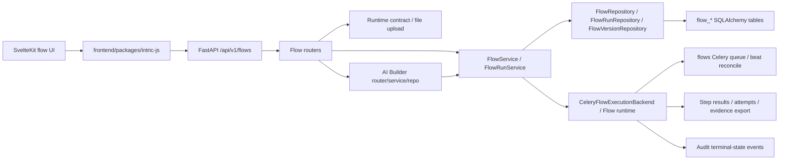

# Phase 0 Repository Map

TL;DR:
1. The backend flow entrypoint is `/api/v1/flows`, included globally with flow resource permission and flow scope checks.
2. Backend flow ownership is split across API routers, application services, infrastructure repositories, domain models, runtime execution, AI Builder, and supporting policy modules.
3. The canonical data model currently lives in SQLAlchemy tables plus Pydantic domain models, with JSONB fields bridged by broad `dict[str, Any]` aliases.
4. The frontend flow experience spans generated/client package calls, SvelteKit routes, feature-level editor/manager services, AI Builder driver/service code, and large UI components.
5. Several files are aggregators or compatibility layers, so Phase 1 must distinguish intentional facade modules from removable parallel paths.

## High-Level Topology

## Backend Entry Points

| Concept | Evidence | Current Owner | Notes |
|---|---|---|---|
| Global API include | `backend/src/intric/server/routers.py:44`, `backend/src/intric/server/routers.py:392-400` | `intric.server.routers` | Adds `/flows` prefix, `flows` tag, flow resource permission, and API key scope guard. |
| Flow router aggregator | `backend/src/intric/flows/api/flow_router.py:1-12` | `intric.flows.api.flow_router` | Includes definition, assistant, consumer runtime, and AI Builder routers. |
| Consumer runtime aggregator | `backend/src/intric/flows/api/flow_consumer_router.py:1-30` | `intric.flows.api.flow_consumer_router` | Combines upload and run routers; also re-exports endpoint callables. |
| Run router aggregator | `backend/src/intric/flows/api/flow_run_router.py:1-42` | `intric.flows.api.flow_run_router` | Combines execution, evidence, and step routers; also re-exports endpoint callables. |
| Runtime run creation | `backend/src/intric/flows/api/flow_run_execution_router.py:106-204` | `intric.flows.api.flow_run_execution_router` | Creates run, logs audit event, and dispatches after commit. |
| Runtime contract/upload | `backend/src/intric/flows/api/flow_upload_router.py:22-81`, `backend/src/intric/flows/api/flow_upload_router.py:149-266` | `intric.flows.api.flow_upload_router` | Flow-first contract and file upload surfaces. |
| Evidence view/export | `backend/src/intric/flows/api/flow_run_evidence_router.py:66-135`, `backend/src/intric/flows/api/flow_run_evidence_router.py:138-220` | `intric.flows.api.flow_run_evidence_router` | Policy-gated evidence surfaces. |

## Dependency Injection Map

| Concept | Evidence | Current Owner | Notes |
|---|---|---|---|
| Flow imports into container | `backend/src/intric/main/container/container.py:97-111` | `intric.main.container.container` | Pulls flow factory/repos/services and Celery backend. |
| Flow repositories and execution backend | `backend/src/intric/main/container/container.py:690-714` | Container providers | Repositories use the current session; execution backend wraps Celery app/queue. |
| Flow application services | `backend/src/intric/main/container/container.py:1116-1138` | Container providers | `FlowService` owns authoring; `FlowRunService` owns runtime use cases. |
| Upload/template/AI Builder services | `backend/src/intric/main/container/container.py:1139-1167` | Container providers | AI Builder depends on `FlowService`, completion, file, and space services. |

## Backend Ownership Map

| Area | Current Locations | Canonical Owner Candidate | Phase 1 Questions |
|---|---|---|---|
| Domain flow objects | `backend/src/intric/flows/domain/flow.py:27-202`; shim at `backend/src/intric/flows/flow.py:1` | `backend/src/intric/flows/domain/flow.py` | Are shim imports still needed? Can JSON aliases be narrowed into named value objects? |
| Flow statuses and step types | `backend/src/intric/flows/enums.py:6-98`; DB constants at `backend/src/intric/database/tables/flow_tables.py:39-50` | `backend/src/intric/flows/enums.py` plus DB constraints generated from enum values | Are database check constraints and API/frontend options derived from one source or copied manually? |
| SQL persistence | `backend/src/intric/database/tables/flow_tables.py:54-599`; repositories under `backend/src/intric/flows/infrastructure/` | SQLAlchemy tables for schema; repositories for persistence behavior | Are JSONB fields typed at parse/write boundaries? Are indexes/constraints sufficient for run lookup and retries? |
| Flow authoring | `backend/src/intric/flows/application/flow_service.py` | `FlowService` | Does authoring include template, assistant snapshot, validation, and secrets logic that should be split by lifecycle concept? |
| Flow runtime | `backend/src/intric/flows/application/flow_run_service.py`; `backend/src/intric/flows/runtime/executor.py`; `backend/src/intric/flows/runtime/tasks.py` | `FlowRunService` for use case, runtime package for execution mechanics | Are transaction boundaries, retries, duplicate starts, cancellation, and terminalization explicit? |
| Step input resolution | `backend/src/intric/flows/runtime/step_input_resolution.py:54-388`; frontend runtime input helpers | Runtime input contract owner needed | Is the canonical shape backend-owned and generated to frontend, or independently reconstructed? |
| Evidence/export | `backend/src/intric/flows/flow_run_evidence_bundle.py`; `backend/src/intric/flows/flow_run_export_json.py`; evidence router | Evidence bundle/export module | Are redaction, provenance, inherited citations, and policy in one coherent owner? |
| AI Builder | `backend/src/intric/flows/ai_builder/**`; router at `backend/src/intric/flows/ai_builder/ai_builder_router.py` | AI Builder package, likely split by session/planning/materialization | Which pieces are canonical state, protocol, prompt construction, draft validation, repair, and materialization? |
| HTTP step transport | `backend/src/intric/flows/http_transport/**`; validators and runtime HTTP modules | `http_transport` package for authored config/validation/secret handling | Can legacy normalizers be deleted or bounded by a migration plan? |
| Celery/reconciliation | `backend/src/intric/flows/runtime/celery_app.py:25-38`; `backend/src/intric/flows/runtime/tasks.py:179`; `backend/src/intric/flows/runtime/tasks.py:362`; queue provider at `backend/src/intric/main/container/container.py:400-401` | Runtime package plus application service terminalization owner | Are duplicate starts, crash recovery, reconciliation cadence, ack/retry semantics, and beat artifacts explicit? |

## AI Builder Sub-Map

The AI Builder package is too large for a single "AI Builder" box: there are 120 `ai_builder_*.py` files totaling 39,201 LOC.

| Cluster Candidate | Representative Evidence | Phase 1 Questions |
|---|---|---|
| Planner/session turn orchestration | `backend/src/intric/flows/ai_builder/ai_builder_planner.py:488-773`, `backend/src/intric/flows/ai_builder/ai_builder_planner.py:944-1536`; state schema at `backend/src/intric/flows/ai_builder/planning_state.py:191-212` | What is the canonical owner for planner state, request construction, model turn lifecycle, and stale-session behavior? |
| Proposal processing/repair | `backend/src/intric/flows/ai_builder/ai_builder_proposal_processor.py` (2,663 LOC); repair modules `ai_builder_repair.py` and `ai_builder_proposal_repair.py` are also large | Are repair/fallback paths hiding invalid state or protecting real product invariants? |
| Create outline/materialization | `backend/src/intric/flows/ai_builder/ai_builder_create_outline.py` (1,813 LOC); `backend/src/intric/flows/ai_builder/ai_builder_materializer.py` (813 LOC) | Are create-mode plan, outline, validation, and persistence separate lifecycle concepts? |
| Router/API session surface | `backend/src/intric/flows/ai_builder/ai_builder_router.py` (1,102 LOC) | Is the router a thin adapter, or does it own workflow orchestration and schema decisions? |
| Frontend AI Builder driver/protocol | `frontend/apps/web/src/lib/features/flows/ai-builder/FlowAIBuilderDriver.ts:578`, `frontend/apps/web/src/lib/features/flows/ai-builder/FlowAIBuilderService.svelte.ts:65`, `frontend/apps/web/src/lib/features/flows/ai-builder/protocol.ts:100-104` | Which protocol types should be generated or mapped from backend schemas instead of duplicated manually? |

## Data Model Map

| Table/Model | Evidence | Responsibility |
|---|---|---|
| `Flows` | `backend/src/intric/database/tables/flow_tables.py:54-94` | Draft metadata, publication pointer, ownership, retention, deletion state. |
| `FlowSteps` | `backend/src/intric/database/tables/flow_tables.py:97-183` | Draft step definitions, JSON contracts/configs, ordering, assistant linkage. |
| `FlowStepDependencies` | `backend/src/intric/database/tables/flow_tables.py:186-228` | Step graph edges inside a flow. |
| `FlowVersions` | `backend/src/intric/database/tables/flow_tables.py:231-253` | Immutable published definition JSON and checksum. The JSON embeds `schema_version` when built at `backend/src/intric/flows/application/flow_service.py:686-697`, but the DB table has no first-class contract-version column. |
| `FlowTemplateAssets` | `backend/src/intric/database/tables/flow_tables.py:256-318` | Uploaded template files, readiness status, placeholders. |
| `FlowRuns` | `backend/src/intric/database/tables/flow_tables.py:321-445` | Runtime run identity, status, principal, idempotency, input/output payloads. Status is constrained to queued/running/completed/failed/cancelled at `backend/src/intric/database/tables/flow_tables.py:397-400`. |
| `FlowStepResults` | `backend/src/intric/database/tables/flow_tables.py:448-525` | Current result per run/step, prompts, outputs, tokens, tool metadata. Status is constrained to pending/running/completed/failed/cancelled at `backend/src/intric/database/tables/flow_tables.py:503-506`. |
| `FlowStepAttempts` | `backend/src/intric/database/tables/flow_tables.py:528-599` | Attempt history, provider/model details, provenance. Status is constrained to started/retried/failed/completed/cancelled at `backend/src/intric/database/tables/flow_tables.py:570-572`. |

## Frontend Map

| Area | Current Locations | Current Owner Candidate | Phase 1 Questions |
|---|---|---|---|
| Generated/client flow calls | `frontend/packages/intric-js/src/endpoints/flows.js:6`, `frontend/packages/intric-js/src/endpoints/flows.js:135-215`, tests at `frontend/packages/intric-js/src/endpoints/flows.test.js:96-154` | `frontend/packages/intric-js` | Which flow endpoints are generated from OpenAPI versus handwritten? What is the drift policy? |
| Flow list route | `frontend/apps/web/src/routes/(app)/spaces/[spaceId]/flows/+page.ts:12-19`, `frontend/apps/web/src/routes/(app)/spaces/[spaceId]/flows/+page.svelte:6-60` | SvelteKit route plus `FlowsManager` | Does route load only fetch data, or own state/side effects? |
| Flow editor route | `frontend/apps/web/src/routes/(app)/spaces/[spaceId]/flows/[flowId]/+page.ts:8-19`, `frontend/apps/web/src/routes/(app)/spaces/[spaceId]/flows/[flowId]/+page.svelte:69-216` | Route initializes `FlowEditor` | Does page own workflow state or delegate cleanly to feature services/components? |
| Flow editor feature service | `frontend/apps/web/src/lib/features/flows/FlowEditor.ts:276`, `frontend/apps/web/src/lib/features/flows/FlowEditor.ts:621`, `frontend/apps/web/src/lib/features/flows/FlowEditor.ts:713` | `FlowEditor.ts` | Are step bindings/configs typed contracts or ad hoc records? |
| AI Builder frontend | `frontend/apps/web/src/lib/features/flows/ai-builder/FlowAIBuilderDriver.ts:578`, `frontend/apps/web/src/lib/features/flows/ai-builder/FlowAIBuilderService.svelte.ts:65`, `frontend/apps/web/src/lib/features/flows/ai-builder/protocol.ts:100-104` | AI Builder driver/service/protocol | Does manual protocol duplicate backend schemas? |
| Evidence UI | `frontend/apps/web/src/lib/features/flows/components/FlowRunEvidence.svelte:46-49`, `frontend/apps/web/src/lib/features/flows/components/FlowRunEvidence.svelte:73` | Evidence component family | Should evidence use generated public models instead of `Record<string, unknown>`? |
| Run dialog/input state | `frontend/apps/web/src/lib/features/flows/components/FlowRunDialog.svelte:67`, `frontend/apps/web/src/lib/features/flows/components/FlowRunDialog.svelte:77`, `frontend/apps/web/src/lib/features/flows/components/FlowRunDialog.svelte:799` | Run dialog or a narrower run input model owner | Is run input state duplicated with backend run contract logic? |

## Aggregators And Parallel Paths To Verify

| Concept | Existing Locations | Problem | Canonical Home Candidate | Merge/Delete Path |
|---|---|---|---|---|
| Flow domain exports | `backend/src/intric/flows/domain/flow.py`; shim `backend/src/intric/flows/flow.py:1` | Two import paths for the same domain models. | `backend/src/intric/flows/domain/flow.py` | Phase 1 should find imports, then propose deleting shim if no external shipped compatibility exists. |
| Flow repositories | `backend/src/intric/flows/infrastructure/flow_repo.py`; shim `backend/src/intric/flows/flow_repo.py:1` | Two import paths for persistence helpers; no reverse imports found through the shim path. | `backend/src/intric/flows/infrastructure/flow_repo.py` | Delete candidate after checking dynamic imports. |
| Flow services | `backend/src/intric/flows/application/flow_service.py`; shim `backend/src/intric/flows/flow_service.py:1` | Two import paths for application service; 3 test imports still use the shim. | `backend/src/intric/flows/application/flow_service.py` | Rewrite tests to the canonical owner, then delete shim in an implementation PR. |
| Run routers | `flow_consumer_router.py`, `flow_run_router.py`, execution/evidence/steps routers | Aggregators may be intentional, but re-exporting endpoint callables increases surface. | One router assembly module with no endpoint re-export unless tests/imports require it. | Phase 1 API reviewer should decide whether re-exports are useful API or dead compatibility. |
| Frontend AI Builder protocol | Backend `ai_builder_api_models.py`; frontend `ai-builder/protocol.ts` | Manual cross-language schema can drift. | OpenAPI/generated types or a narrow handwritten adapter with owner. | Phase 1 frontend/API reviewers should identify what can be generated versus explicitly mapped. |
| Runtime status values | `backend/src/intric/flows/enums.py:64-85`; DB checks in `flow_tables.py`; frontend status presentation modules | Status state machines are copied across backend DB/API/frontend. | One status owner plus generated or centrally mapped DB/API/frontend contracts | Phase 1b concept reviewer must propose the canonical source and migration path for pause/review/rerun states. |

## No Findings

No source-code changes are proposed in Phase 0. The map is a baseline for Phase 1 reviewers, not a final architecture verdict.

## Confidence

High for file locations, router inclusion, DI registrations, data model ownership, and command results. Medium for canonical-home candidates because Phase 1 must still verify call graphs, tests, and migration constraints.
