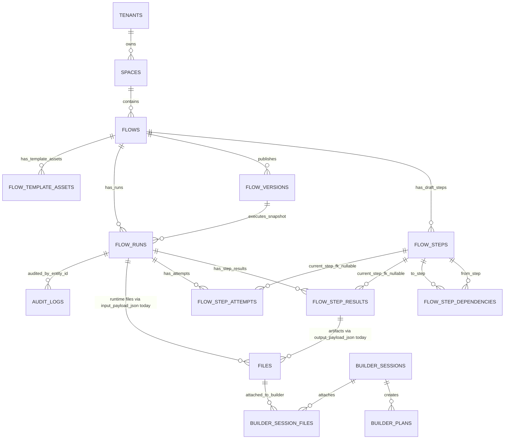

# Phase 1a Agent F - Data Model Review

TL;DR:
1. Flow persistence is serviceable for the current runtime, but the data model is not yet shaped for pause, human review, step rerun, artifact discovery, or long-lived schema evolution.
2. The highest-risk issue is not "JSONB exists"; it is that boundary contracts, internal runtime bags, and first-class facts are all stored and passed around as the same `dict[str, Any]` shape.
3. Flow definition, run input, step output, attempt provenance, idempotency, principal, file mapping, artifact, and permission concepts need explicit canonical owners before more features are added.
4. Existing migrations show the right direction: tenant FKs, deletion of obsolete `flow_step_mcp_tools`, and builder JSON cleanup are strong examples to repeat.
5. Overall current-state score: 4/10; refactor the data model before implementing pause/resume/review/rerun/file-mapping as product features.

## Scope And Standards

Reviewed scope:

- `backend/src/intric/database/tables/flow_tables.py`
- flow repositories under `backend/src/intric/flows/infrastructure/`
- flow domain models under `backend/src/intric/flows/domain/`
- flow runtime, run service, file-input mapping, evidence, permissions, principal, audit, retention, and flow migrations
- schema evolution pressure from future pause/rerun/file-mapping/review features

Relevant standards:

- JSONB columns need an owner, typed parser, version field, migration policy, validation boundary, corruption behavior, and tests (`prompt.md:217-221`).
- Canonical ownership must be checked before recommending a new schema/status/type (`docs/engineering/maintainability-standards.md:36-49`, `docs/engineering/maintainability-standards.md:60-69`).
- API consumers must be able to upload/attach files, poll status, inspect artifacts, pause/edit/resume/retry, and handle errors without reading backend source (`docs/engineering/api-design-standard.md:5-18`).
- Runtime tests should cover retries, idempotency, duplicate starts, crash recovery, and terminalization (`docs/engineering/testing-standard.md:5-12`).

Environmental/tooling failures:

No product tooling findings. The Claude peer loop was run as required; two initial resume attempts failed because no Claude session existed for the provided title, then a new session completed and rejected the first plan. Its verified corrections are folded into this document.

## Data Model Map

The quoted relationship labels are intentional: runtime file inputs, generated artifacts, and evidence exports are not first-class flow tables today. They are encoded in JSON payloads and reconstructed by services.
`builder_attachment_observations` is intentionally not connected in the ER diagram: it is a content-addressed cache keyed by tenant/content/version fields, not an FK-owned child of builder sessions (`backend/src/intric/database/tables/flow_tables.py:822-884`).

## Model And Table Inventory

| Model/table | Current owner | Purpose | Strong points | Risk |
|---|---|---|---|---|
| `flows` | `backend/src/intric/database/tables/flow_tables.py:54` | Draft flow aggregate root with tenant/space ownership, publish pointer, metadata, retention override, soft delete. | Tenant/space FKs and active-name uniqueness are explicit (`flow_tables.py:84-93`). | `metadata_json` has no typed flow metadata contract at the domain boundary (`flow_tables.py:75-78`, `domain/flow.py:96`). |
| `flow_steps` | `flow_tables.py:97` | Draft step rows, contracts, bindings, config, assistant/tool policy. | Same-flow dependency constraints and enum-like checks exist (`flow_tables.py:155-182`). | Five JSONB contracts are stored as generic objects and passed through `JsonObject` (`flow_tables.py:124-152`, `domain/flow.py:38-46`). |
| `flow_step_dependencies` | `flow_tables.py:186` | Step dependency edges. | Prevents self-reference and enforces same flow/tenant composite FKs (`flow_tables.py:206-227`). | No ordering/lifecycle model for future conditional rerun or partial graph execution. |
| `flow_versions` | `flow_tables.py:231` | Published immutable snapshot with checksum and `definition_json`. | Unique `(flow_id, version)` and tenant FK are clear (`flow_tables.py:245-253`). | Published definition version is embedded inside JSON instead of a first-class schema column (`flow_tables.py:243`, `flow_service.py:686-697`). |
| `flow_template_assets` | `flow_tables.py:256` | Files derived from flow templates/placeholders. | Status checks and active asset index exist (`flow_tables.py:291-317`). | `placeholders` is a JSON list with no typed persisted contract version (`flow_tables.py:280-282`). |
| `flow_runs` | `flow_tables.py:321` | Runtime aggregate: principal, status, idempotency, input/output payloads, timing. | Principal check constraint and idempotency partial unique indexes exist (`flow_tables.py:384-438`). | Principal state is duplicated with legacy `user_id`, idempotency keys never expire, and input/output are generic JSONB (`flow_tables.py:341-377`). |
| `flow_step_results` | `flow_tables.py:448` | Per-run current step result. | Unique `(flow_run_id, step_id)` and tenant FK exist (`flow_tables.py:514-524`). | Nullable `step_id` weakens uniqueness after step deletion, and result payload/artifact/tool metadata are generic JSONB (`flow_tables.py:464-493`, `domain/flow.py:161-170`). |
| `flow_step_attempts` | `flow_tables.py:528` | Per-run attempt lineage and provider/provenance data. | Attempt number uniqueness exists (`flow_tables.py:586-598`). | `provenance_json` is a large evolving object with no versioned parser (`flow_tables.py:561-563`, `runtime/executor.py:172-233`). |
| `module_registry` | `flow_tables.py:602` | Module health/compat registry. | Compatibility index exists (`flow_tables.py:641`). | Health/compat statuses are raw string tuples, unlike flow statuses (`flow_tables.py:47-48`). |
| `builder_sessions` | `flow_tables.py:662` | AI Builder conversation/session state. | Lease fields and tenant latest-plan FK support concurrency (`flow_tables.py:697-755`, `20260426_latest_plan_fk.py:56-77`). | Conversation/planning state are JSONB with versioning only partly modeled (`flow_tables.py:692-717`). |
| `builder_session_files` | `flow_tables.py:758` | Builder session-file join. | This is the right pattern for future runtime file mapping (`flow_tables.py:758-780`). | Runtime flow file inputs have not been given the same table treatment. |
| `builder_plans` | `flow_tables.py:783` | Builder plan/spec/edit result. | Migration removed duplicated `spec` from envelope JSON, a good single-source precedent (`20260421_builder_plans_drop_envelope_spec.py:7-15`). | `edit_result_json` is unversioned JSONB (`flow_tables.py:801-804`). |
| `builder_attachment_observations` | `flow_tables.py:822` | Content-addressed observation cache. | Version fields are part of the primary key and LRU index exists (`flow_tables.py:854-883`). | Good example; do not generalize as a generic blob store. |

## Structural Findings

### 1. Boundary contracts and internal JSON bags are conflated

Problem:

The system treats published API/runtime contracts and private implementation payloads as the same `dict[str, Any]` category. The domain layer declares `JsonObject: TypeAlias = dict[str, Any]` (`backend/src/intric/flows/domain/flow.py:23`) and uses it for step contracts/config, flow metadata, published definitions, run input/output, result payloads, model parameters, and attempt provenance (`domain/flow.py:38-46`, `domain/flow.py:96`, `domain/flow.py:122`, `domain/flow.py:143-170`, `domain/flow.py:198`).

Why it matters:

`definition_json`, run input payloads, evidence exports, and artifact payloads are contracts that other code will depend on. `model_parameters_json` and some internal provenance subtrees are implementation details. Without separating them, every JSON field becomes an accidental public schema. This violates the typed-boundary standard in `prompt.md:104-117` and the JSONB standard in `prompt.md:217-221`.

Evidence:

- `FlowVersions.definition_json` is a bare JSONB column (`backend/src/intric/database/tables/flow_tables.py:241-243`).
- The service writes `"schema_version": FLOW_DEFINITION_SCHEMA_VERSION` inside the JSON object (`backend/src/intric/flows/application/flow_service.py:47`, `backend/src/intric/flows/application/flow_service.py:686-697`).
- Runtime parsing accepts `dict[str, Any]` and validates shape ad hoc (`backend/src/intric/flows/runtime/step_definition_parser.py:33-180`).
- The executor only checks that `schema_version` is an integer `>= 1` (`backend/src/intric/flows/runtime/executor.py:1449-1450`).
- The repository persists published definitions without schema-specific validation (`backend/src/intric/flows/infrastructure/flow_version_repo.py:21-43`).

Current owner:

Fragmented across `FlowService._build_definition`, `FlowVersionRepository`, `parse_runtime_steps`, `FlowFactory`, and API/domain Pydantic classes.

Proposed canonical home:

Create a domain/application contract module for published flow definitions, for example `backend/src/intric/flows/domain/flow_definition.py`, containing:

- `PublishedFlowDefinition`
- a narrow published step snapshot parser/validator owned by `PublishedFlowDefinition`
- `parse_published_flow_definition(schema_version, payload)`
- `render_published_flow_definition(definition)`
- a declared corruption behavior for unknown/malformed versions

This should be a real deep module because it hides the compatibility, migration, validation, and runtime parsing complexity. Do not create a generic `utils` or `types` module.

Merge/delete path:

- Move the current `FLOW_DEFINITION_SCHEMA_VERSION` constant out of `FlowService` (`flow_service.py:47`) into the canonical definition module.
- Keep `FlowVersions.definition_json` as the serialized snapshot, but add first-class `schema_version` to `flow_versions`.
- Replace ad hoc parser checks in `step_definition_parser.py` with the canonical parser.
- Delete the `JsonObject` alias where a real contract model exists.

Acceptance criteria:

- `flow_versions` has a non-null `schema_version` column backfilled from `definition_json.schema_version`.
- Publishing validates and stores a typed definition object before writing JSON.
- Runtime execution rejects unknown definition versions with a named domain error before starting work.
- Old v1 fixture definitions still execute through the v1 parser.
- Evidence/export paths read typed definitions rather than arbitrary dicts.

Tests required:

- Migration test: existing rows with valid v1 definition JSON get `schema_version = 1`; malformed rows fail migration preflight.
- Unit tests for parse/render round-trip of published definition v1.
- Runtime integration test for executing a v1 definition snapshot.
- Corruption test for missing/unknown schema version.
- API contract test showing the published definition shape remains stable.

Risk/trade-off:

This adds one explicit parser module, but removes scattered implicit parsing. The short-term migration is more work than leaving JSON alone; the long-term payoff is safer definition evolution.

Human reviewability impact:

High. Reviewers will be able to inspect definition schema changes in one module and one migration instead of diffing service, runtime, repo, and export code.

Confidence: high.

### 2. First-class runtime facts are hidden inside JSON payloads

Problem:

Runtime file mapping, generated artifacts, and evidence/provenance are persisted as nested JSON under runs, results, and attempts rather than as queryable facts.

Why it matters:

Pause, resume, review, rerun, file mapping, artifact retention, audit, and support queries all need stable row identities. JSON payloads are useful as snapshots, but they are weak owners for lifecycle facts that need authorization, retention, indexes, and migrations.

Evidence:

- Runtime per-step file input mapping is serialized to JSON by `serialize_step_inputs_payload` (`backend/src/intric/flows/flow_run_step_inputs.py:244-252`).
- `FlowRunService.create_run` stores `step_inputs` and legacy `file_ids` inside `input_payload_json` (`backend/src/intric/flows/application/flow_run_service.py:399-407`).
- Runtime resolution reads `step_inputs` back from `run.input_payload_json` by stringified step id (`backend/src/intric/flows/runtime/step_input_resolution.py:391-403`).
- `FlowRunService.get_run_artifact_file` discovers downloadable artifacts by scanning `FlowStepResult.output_payload_json["artifacts"]` and `["generated_file_ids"]` (`backend/src/intric/flows/application/flow_run_service.py:733-743`).
- Evidence bundles are assembled at read time from run, version, step results, and attempts (`backend/src/intric/flows/application/flow_run_service.py:805-839`).
- Attempt provenance is a broad JSON object assembled by the executor (`backend/src/intric/flows/runtime/executor.py:172-233`) and stored in `FlowStepAttempts.provenance_json` (`backend/src/intric/database/tables/flow_tables.py:561-563`).

Current owner:

- Runtime input mapping: `flow_run_step_inputs.py`, `FlowRunService.create_run`, `step_input_resolution.py`, `FlowRuns.input_payload_json`.
- Artifacts: `step_execution_runtime.py`, `step_result_builder.py`, `FlowStepResults.output_payload_json`, `FlowRunService.get_run_artifact_file`.
- Evidence/provenance: `executor.py`, `flow_run_evidence_bundle.py`, `flow_run_export_json.py`, `FlowStepAttempts.provenance_json`.

Proposed canonical home:

Use first-class tables for lifecycle facts, and keep JSON as a contract snapshot:

| Concept | Proposed canonical table/model | Minimum columns |
|---|---|---|
| Runtime file inputs | `flow_run_step_inputs` | `id`, `tenant_id`, `flow_run_id`, `flow_id`, `step_id`, `file_id`, `role`, `ordinal`, `source`, `principal_type`, `principal_user_id`, `principal_api_key_id`, timestamps |
| Generated artifacts | `flow_run_artifacts` | `id`, `tenant_id`, `flow_run_id`, `flow_id`, `step_id`, `attempt_id`, `file_id`, `kind`, `content_type`, `byte_size`, `content_sha256`, `retention_class`, timestamps |
| Evidence exports | keep generated on demand, but add typed evidence export model | `schema_version`, redaction mode, artifact references, provenance references |
| Attempt provenance | typed `FlowAttemptProvenanceV1` model | versioned submodels for `llm`, `rag`, `runtime_input`, `transcription`, `guards`, `template`, `artifacts`, `http`, `citations` |

Merge/delete path:

- Backfill `flow_run_step_inputs` from `FlowRuns.input_payload_json.step_inputs`.
- Keep `input_payload_json.step_inputs` temporarily as a request snapshot, not the source of truth.
- Replace artifact scanning in `get_run_artifact_file` with `flow_run_artifacts` lookup.
- Remove legacy top-level `file_ids` once no API path depends on `apply_legacy_step_one_adapter` (`flow_run_step_inputs.py:104-128`).
- Keep evidence exports generated from typed rows and typed provenance.

Acceptance criteria:

- The API can answer "which runs used file X?" without scanning JSON.
- The API can answer "which artifacts did run X produce?" without scanning result payloads.
- Rerunning one step records new input/artifact/attempt rows without mutating prior evidence.
- Retention cleanup can delete or redact artifacts by row and retention class.
- Evidence export includes stable references to file-input and artifact rows.

Tests required:

- DB integration test for `flow_run_step_inputs` tenant/file FK enforcement.
- API test for creating a run with per-step files and retrieving normalized step input rows.
- Runtime test for rerun preserving prior input/artifact rows.
- Artifact authorization test using the artifact table instead of JSON scanning.
- Retention test deleting generated artifact files and reconciling artifact rows.

Risk/trade-off:

The table split adds schema surface. The alternative is more JSON patching and more hidden contracts, which will be harder to unwind after pause/rerun ships.

Human reviewability impact:

High. Row-level facts make future PRs about file mapping, artifacts, and evidence reviewable without requiring reviewers to mentally parse JSON payload conventions.

Confidence: high.

### 3. Status lifecycle is not owned by one state machine

Problem:

Run, step result, and step attempt statuses are enum values in Python, string checks in SQL, tuple filters in repositories, and implicit lifecycle rules in runtime code.

Why it matters:

Pause/resume/review/rerun are lifecycle features. Adding them by editing scattered status strings will create hidden bugs: stale-run reconciliation, active-run counting, cancellation, terminal audit, retention, UI status, and evidence export can drift.

Evidence:

- Python statuses are defined in `FlowRunStatus`, `FlowStepResultStatus`, and `FlowStepAttemptStatus` (`backend/src/intric/flows/domain/enums.py:64-85`).
- `flow_tables.py` derives status tuples from those enums for some checks (`backend/src/intric/database/tables/flow_tables.py:44-46`) but embeds literal SQL check strings for run/result/attempt status columns (`flow_tables.py:397-400`, `flow_tables.py:502-506`, `flow_tables.py:570-572`).
- Active run counting uses `_ACTIVE_STATUSES = ("queued", "running")` in the repo (`backend/src/intric/flows/infrastructure/flow_run_repo.py:40`, `flow_run_repo.py:155-162`).
- Terminal update defaults are hard-coded in `update_status` (`backend/src/intric/flows/infrastructure/flow_run_repo.py:312-324`).
- Step claiming can transition failed results back to running without a first-class rerun state or rerun request row (`flow_run_repo.py:450-481`).
- Retention terminal status filtering is another literal tuple (`backend/src/intric/data_retention/infrastructure/data_retention_service.py:368-371`).

Current owner:

No single owner. Status logic is spread across `domain/enums.py`, SQLAlchemy check constraints, migrations, `FlowRunRepository`, runtime executor/tasks, retention, API models, and frontend/API consumers.

Proposed canonical home:

Add a lifecycle module, for example `backend/src/intric/flows/domain/flow_lifecycle.py`, with:

- status enums
- transition matrix
- active/terminal/recoverable/reviewable classifications
- pause/resume/review/rerun semantics
- helper functions used by repositories and services

For PostgreSQL, prefer real ENUM types for run/result/attempt status once the transition plan is settled. If the team keeps `VARCHAR + CHECK`, generate check constraints from the canonical lifecycle module and make migrations explicitly cite the canonical status set.

Merge/delete path:

- Move `_ACTIVE_STATUSES` out of `FlowRunRepository`.
- Replace literal terminal tuples in repo and retention with canonical predicates.
- Add migration discipline for changing status alphabets.
- Do not add `paused` or `awaiting_review` until transition rules, indexes, runtime recovery, and audit events are defined together.

Acceptance criteria:

- A status change PR touches one lifecycle module, one migration, and explicit affected adapters.
- All status filters use named lifecycle predicates.
- Pause/resume/review/rerun have persisted states and allowed transitions.
- Runtime reconciliation knows whether each new state is active, terminal, stale, or user-blocked.

Tests required:

- Unit test of transition matrix.
- Integration tests for queued/running stale reconciliation.
- Retention test for terminal classification.
- API contract tests for status values and invalid transitions.
- Runtime test for step rerun lifecycle and attempt lineage.

Risk/trade-off:

Postgres ENUMs make adding statuses slightly more ceremony than editing a check string, but they move the database closer to the domain state machine. The key decision is less important than having one canonical owner.

Human reviewability impact:

High. Reviewers can reason about lifecycle changes from one transition table instead of chasing scattered `.status.in_(...)` clauses.

Confidence: high.

### 4. Principal and permission state has parallel authorities

Problem:

Flow run identity and flow permissions are represented in multiple partially overlapping places.

Why it matters:

Future `flow.pause`, `flow.resume`, `flow.review`, `flow.audit.view`, and service-key behavior will be hard to secure if the data model and policy model disagree about "who is acting" and "what action is allowed."

Evidence:

- `FlowRuns` stores `principal_type`, `principal_user_id`, `principal_api_key_id`, and legacy `user_id` (`backend/src/intric/database/tables/flow_tables.py:327-344`).
- A database check enforces principal shape (`flow_tables.py:384-395`), but `FlowRunRepository.create` accepts raw `principal_type: str = "user"` and raw principal IDs (`backend/src/intric/flows/infrastructure/flow_run_repo.py:46-60`).
- `FlowPrincipal` has invariants in `__post_init__` (`backend/src/intric/flows/principal.py:18-33`) and still exposes `legacy_user_id` (`backend/src/intric/flows/principal.py:36-39`).
- Run creation writes both `user_id=principal.legacy_user_id` and `principal_user_id=principal.principal_user_id` (`backend/src/intric/flows/application/flow_run_service.py:474-488`).
- Flow permissions are coarse: `FLOWS`, `FLOWS_VIEW`, `FLOWS_RUN`, `FLOWS_MANAGE`, `FLOWS_AI_BUILDER`, `FLOWS_TRACE` (`backend/src/intric/roles/permissions.py:16-33`).
- Permission inheritance is a separate map (`backend/src/intric/roles/permissions.py:36-60`), descriptions are a separate map (`backend/src/intric/roles/permissions_mapper.py:17-22`), flow wrappers are another surface (`backend/src/intric/flows/flow_permissions.py:10-27`), and space action conversion maps flow create/edit/delete/publish to `FLOWS_MANAGE` (`backend/src/intric/actors/actors/space_actor.py:438-453`).
- API helper code duplicates service-key/principal logic (`backend/src/intric/flows/flow_api_common.py:93-115`).

Current owner:

Identity is split between `FlowPrincipal`, `FlowRuns`, `FlowRunRepository.create`, `FlowRunService`, and Celery task arguments. Permissions are split between roles, role descriptions, space actor mapping, flow permission wrappers, API resource scopes, and evidence policy.

Proposed canonical home:

- Identity: `FlowPrincipal` is the only constructor for run principal state. Repositories should take `principal: FlowPrincipal`, not raw strings.
- Storage: `FlowRuns.principal_*` fields are canonical. `FlowRuns.user_id` should be dropped before production unless a concrete external dependency is named.
- Permissions: introduce a canonical flow permission registry with requested actions:
  - `flow.view`
  - `flow.create`
  - `flow.edit`
  - `flow.run`
  - `flow.pause`
  - `flow.resume`
  - `flow.review`
  - `flow.publish`
  - `flow.delete`
  - `flow.audit.view`
  - optional `flow.ai_builder`

Do not create both `flow.audit.view` and `flow.trace` as durable parallel concepts. Treat the current `FLOWS_TRACE` permission (`backend/src/intric/roles/permissions.py:33`) as a migration alias to `flow.audit.view` unless the product explicitly separates trace debugging from audit/evidence access with different scopes, UI, and API behavior.

The registry should be consumed by role inheritance, descriptions, flow permission checks, space actor conversion, API key resource permissions, and service methods. Do not preserve both the coarse and fine-grained taxonomies indefinitely.

Merge/delete path:

- Change `FlowRunRepository.create` to accept `FlowPrincipal`.
- Remove fallback `principal_type: str = "user"` in repository code.
- Backfill/verify `principal_user_id` from `user_id`, then drop `flow_runs.user_id` or convert it into a read-only compatibility view if absolutely needed.
- Re-check current flow-run call sites before the migration: DB column (`flow_tables.py:341-344`), domain model (`domain/flow.py:134-136`), repository write/list compatibility paths (`flow_run_repo.py:51-75`, `flow_run_repo.py:174-189`), service write path (`flow_run_service.py:474-488`), Celery fallback dispatch fields (`backend/src/intric/flows/runtime/celery_execution_backend.py:36-42`), and the identity backfill migration (`backend/alembic/versions/20260411_flow_run_identity_and_idempotency.py:52-62`).
- Replace `FLOWS_MANAGE` as the internal catch-all with explicit action checks.
- Align service-key scopes with the same action registry.

Acceptance criteria:

- Every flow authorization decision names one action from the registry.
- `flow.pause/resume/review/publish/delete/audit.view` have explicit permission tests.
- Service keys and users are evaluated through the same policy object with clear differences.
- Run rows store exactly one principal representation.
- Audit entries can attribute an action to the same principal shape used by runs.

Tests required:

- Permission matrix tests for user roles, space actions, and service-key scopes.
- Repository test proving invalid principal shapes cannot be passed around without constructing `FlowPrincipal`.
- Migration test for dropping or constraining legacy `flow_runs.user_id`.
- API tests for denied pause/resume/review/audit actions.

Risk/trade-off:

Fine-grained permissions add product and admin complexity, but continuing to overload `FLOWS_MANAGE` will make review/audit access too broad.

Human reviewability impact:

High. Security-sensitive PRs become reviewable as permission matrix changes instead of scattered `can_manage` checks.

Confidence: high.

### 5. Idempotency is durable but has no lifecycle

Problem:

Idempotency keys are unique forever for a principal/flow pair and have no expiry policy.

Why it matters:

Permanent idempotency keys can return stale runs long after a caller expects a new operation. They also make data retention ambiguous: retaining unique idempotency rows forever can conflict with purging run evidence or user data.

Evidence:

- `FlowRuns` stores `idempotency_key` and `request_fingerprint` (`backend/src/intric/database/tables/flow_tables.py:351-358`).
- Partial unique indexes enforce uniqueness for user and service-key principals when `idempotency_key IS NOT NULL` (`flow_tables.py:417-438`).
- `FlowRunService` computes a SHA-256 fingerprint from `flow_id`, `flow_version`, and `input_payload_json` (`backend/src/intric/flows/application/flow_run_service.py:492-510`).
- `FlowRunService` returns an existing run when the key and fingerprint match and errors when the fingerprint differs (`flow_run_service.py:437-451`).
- No `idempotency_expires_at`, TTL, or cleanup policy is present in the `flow_runs` model (`flow_tables.py:321-445`).

Current owner:

`FlowRunService._build_idempotency_fingerprint`, `FlowRunRepository.get_idempotent_run`, and database unique indexes.

Proposed canonical home:

Create an idempotency policy owned by the application layer:

- explicit fingerprint input contract
- `idempotency_expires_at`
- tenant-configurable or fixed retention window
- behavior after expiry
- cleanup and audit behavior

Merge/delete path:

- Keep existing indexes initially.
- Add `idempotency_expires_at` and make lookups filter non-expired keys.
- Decide whether old keys are purged or made reusable after expiry.
- Document whether request headers, principal, flow version, and runtime inputs are part of the fingerprint.

Acceptance criteria:

- Idempotency behavior is documented in the API contract.
- Reusing a key after expiry follows a defined behavior.
- Cleanup does not break existing active runs.
- Support can explain why a request returned an old run.

Tests required:

- API contract test for same-key same-fingerprint replay.
- API contract test for same-key different-fingerprint conflict.
- Time-based test for expired idempotency key behavior.
- Cleanup/retention integration test.

Risk/trade-off:

TTL introduces time-based behavior and requires careful testing. Permanent uniqueness is simpler but creates support and retention problems.

Human reviewability impact:

Medium-high. A named idempotency policy makes API behavior explicit.

Confidence: high.

### 6. Nullable step references weaken result and attempt uniqueness

Problem:

`FlowStepResults.step_id` and `FlowStepAttempts.step_id` are nullable with `ondelete="SET NULL"`, while uniqueness constraints depend on `step_id`.

Why it matters:

PostgreSQL treats `NULL` values as distinct in unique constraints. After step deletion, `(flow_run_id, step_id)` and `(flow_run_id, step_id, attempt_no)` no longer protect one logical result/attempt per step. Rerun and historical evidence need stable references even if draft steps change.

Evidence:

- `FlowStepResults.step_id` is nullable and `ondelete="SET NULL"` (`backend/src/intric/database/tables/flow_tables.py:464-467`).
- `FlowStepResults` uniqueness is `(flow_run_id, step_id)` (`flow_tables.py:519-520`).
- `FlowStepAttempts.step_id` is nullable and `ondelete="SET NULL"` (`flow_tables.py:542-545`).
- `FlowStepAttempts` uniqueness is `(flow_run_id, step_id, attempt_no)` (`flow_tables.py:586-590`).
- `FlowRepo.save_step_result` has a legacy branch for `result.step_id is None`, including insert-by-id behavior outside the upsert constraint (`backend/src/intric/flows/infrastructure/flow_repo.py:550-572`).

Current owner:

Database constraints, flow repository legacy behavior, and runtime run snapshots.

Proposed canonical home:

Published run lineage should reference immutable published step identity, not mutable draft step rows. Options:

- store `published_step_id` or `definition_step_id` from `flow_versions.definition_json`;
- keep current draft `flow_steps.id` as optional metadata only;
- make result/attempt uniqueness depend on immutable run snapshot step identity.

Merge/delete path:

- Add immutable step identity to published definitions if missing.
- Backfill result/attempt rows from current run snapshot.
- Replace nullable draft `step_id` uniqueness with immutable step-key uniqueness.
- Delete the legacy `step_id is None` save path if no current runtime uses it.

Acceptance criteria:

- Deleting or editing a draft step cannot weaken historical run uniqueness.
- Rerun creates a new attempt/result lineage against immutable published step identity.
- Evidence export remains stable after draft flow edits.

Tests required:

- DB test showing draft step deletion does not create duplicate historical result ambiguity.
- Runtime test for rerun after draft edit.
- Migration preflight for rows with `step_id IS NULL`.

Risk/trade-off:

Requires a careful migration because existing rows may rely on nullable `step_id`. The benefit is correctness of historical execution records.

Human reviewability impact:

High for runtime/evidence PRs. Reviewers can reason about historical rows without needing to know draft-step deletion behavior.

Confidence: high.

### 7. Audit and retention coverage is useful but not yet complete for future lifecycle states

Problem:

Current flow audit actions cover create/update/delete/publish/unpublish/run lifecycle and evidence/file access, but the taxonomy has no first-class pause/resume/review/edit-step-output/rerun events. Retention has typed policy helpers, but facts to retain/delete are still partly JSON-derived.

Why it matters:

Pause/review/rerun features introduce accountability requirements. Operators need to know who paused, edited, approved, resumed, reran, exported evidence, and downloaded artifacts.

Evidence:

- Flow audit action types cover authoring and runtime start/completion/failure/cancel/redispatch plus evidence/artifact download (`backend/src/intric/audit/domain/action_types.py:76-93`).
- Category mapping classifies evidence view/export and artifact download (`backend/src/intric/audit/domain/category_mappings.py:73-96`).
- Terminal runtime audit intentionally catches and logs audit failures at the runtime boundary (`backend/src/intric/flows/runtime/executor.py:1070-1111`).
- Retention policy is a typed dataclass over tenant flow settings (`backend/src/intric/flows/flow_retention_policy.py:22-49`) and is used by cleanup (`backend/src/intric/data_retention/infrastructure/data_retention_service.py:57-89`).
- Cleanup selects terminal flow runs using literal statuses (`data_retention_service.py:353-379`).
- Generated artifacts are counted/deleted from rows/files after being discovered indirectly rather than through a dedicated artifact table (`data_retention_service.py:50-55`, `flow_run_service.py:733-743`).

Current owner:

Audit action taxonomy, flow routers/runtime audit calls, tenant `flow_settings`, retention policy helpers, and cleanup service.

Proposed canonical home:

- Audit taxonomy: add lifecycle actions before feature implementation:
  - `flow_run.paused`
  - `flow_run.resumed`
  - `flow_run.review_requested`
  - `flow_run.review_approved`
  - `flow_run.review_rejected`
  - `flow_run.step_output_edited`
  - `flow_run.step_rerun_requested`
  - `flow_run.step_rerun_completed`
  - `flow_run.retention_purged`
- Retention facts: move generated artifacts and file inputs into typed rows so retention can operate without parsing step output JSON.

Merge/delete path:

- Keep audit logs append-only.
- Add new audit actions in taxonomy and category mapping together.
- Replace retention literal terminal status tuples with lifecycle predicates from the proposed lifecycle owner.
- Use artifact/file-input rows as retention inputs.

Acceptance criteria:

- Every pause/review/rerun state transition emits one audit action with principal, run, step, and reason where applicable.
- Retention cleanup emits purge audit events for deleted evidence/artifact classes.
- Evidence export can explain what was redacted or purged.

Tests required:

- Audit tests for each new lifecycle action.
- Retention test for generated artifacts and debug evidence.
- Evidence export test after retention cleanup.

Risk/trade-off:

More audit events create more data. That is the right trade-off for review/rerun features because they are accountability-sensitive.

Human reviewability impact:

Medium-high. Lifecycle PRs become auditable as taxonomy changes plus transition code.

Confidence: medium-high.

## JSONB Contract Audit

Verdict legend:

- `Typed owner exists`: acceptable or close, but may need version/corruption behavior.
- `Needs typed model`: keep JSONB but add a parser/writer and tests.
- `Promote fact`: should become a table or row-level model.
- `Boundary contract`: needs explicit schema version and migration path.

Rows marked `Needs typed model` are not permission to invent schemas from memory. Phase 2 should first inventory observed keys in fixtures, migrations, and writers, then put the resulting model in the concept owner named by that row.

| Column | Current owner/evidence | Parser/validator today | Version today | Migration/corruption behavior today | Tests required | Verdict |
|---|---|---|---|---|---|---|
| `flows.metadata_json` | DB column (`flow_tables.py:75-78`), domain `JsonObject` (`domain/flow.py:96`) | Care-data/evidence helpers parse selected keys (`flow_evidence_policy.py:93-94`) | None | Invalid shape mostly ignored by helper defaults | Metadata contract tests, sensitive-flow tests | Needs typed model |
| `flow_steps.input_contract` | DB column (`flow_tables.py:124-126`), domain `JsonObject` (`domain/flow.py:38-41`) | Flow validators check syntax (`backend/src/intric/flows/flow_validators.py:140-156`) | None | Publish/update validation only; old rows depend on validators being rerun | Contract validation tests, migration fixture tests | Boundary contract |
| `flow_steps.output_contract` | DB column (`flow_tables.py:137-139`) | Same validator path (`flow_validators.py:140-156`) | None | Same as input contract | Contract validation tests | Boundary contract |
| `flow_steps.input_bindings` | DB column (`flow_tables.py:140-142`) | Flow validators and runtime parser (`flow_validators.py:158-164`, `step_definition_parser.py:33-180`) | None | Runtime errors on malformed shape | Binding parser tests, corruption tests | Boundary contract |
| `flow_steps.input_config` | DB column (`flow_tables.py:149`) | `FlowRuntimeInputConfig` domain model exists (`domain/flow.py:51-59`), file-input helpers validate runtime input | None | Mixed defaults and validation | Runtime input config round-trip tests | Typed owner exists |
| `flow_steps.output_config` | DB column (`flow_tables.py:150-152`) | Output runtime paths parse ad hoc | None | Malformed data likely fails during execution | Output config parser tests | Needs typed model |
| `flow_versions.definition_json` | DB column (`flow_tables.py:241-243`), built by service (`flow_service.py:686-697`) | Runtime parser accepts dict (`step_definition_parser.py:33-180`) | Embedded `schema_version` only (`flow_service.py:688`) | Unknown versions not centrally rejected (`executor.py:1449-1450`) | Versioned definition parser/migration tests | Boundary contract |
| `flow_template_assets.placeholders` | DB column (`flow_tables.py:280-282`) | API/service parser not canonical in data model | None | Malformed placeholder rows can survive DB | Template asset placeholder tests | Needs typed model |
| `flow_runs.input_payload_json` | DB column (`flow_tables.py:372-374`), create-run payload (`flow_run_service.py:399-407`) | `flow_run_step_inputs.py` validates step file input before write (`flow_run_step_inputs.py:131-252`) | None | Merge-patched under row lock (`flow_run_repo.py:345-366`) | Runtime input row/table tests | Promote fact for file mapping |
| `flow_runs.output_payload_json` | DB column (`flow_tables.py:375-377`) | Final result builder/runtime parse ad hoc | None | Consumers must handle arbitrary dict | Final output schema tests | Boundary contract or typed model |
| `flow_step_results.input_payload_json` | DB column (`flow_tables.py:473-475`) | `step_result_builder.py` creates structured dict (`backend/src/intric/flows/runtime/step_result_builder.py:38-59`) | None | Evidence/export parse whatever was stored | Step result input parser tests | Needs typed model |
| `flow_step_results.output_payload_json` | DB column (`flow_tables.py:479-481`) | Runtime result builder creates dict (`step_result_builder.py:62-93`) | None | Artifact discovery scans keys (`flow_run_service.py:733-743`) | Output payload/artifact tests | Promote artifact facts |
| `flow_step_results.model_parameters_json` | DB column (`flow_tables.py:486-488`) | Runtime writes provider/model params | None | Internal debugging data; malformed values should not break run | Provider metadata tests | Needs typed model |
| `flow_step_results.tool_calls_metadata` | DB column (`flow_tables.py:491-493`), domain accepts list or single dict (`domain/flow.py:170`) | Runtime serializes list from completion tool calls (`runtime/step_execution_runtime.py:911-912`, `runtime/step_execution_runtime.py:989`) | None | Polymorphic read shape increases consumer branching | Normalize-to-list migration/test | Needs typed model |
| `flow_step_attempts.provenance_json` | DB column (`flow_tables.py:561-563`), executor builds object (`runtime/executor.py:172-233`) | Evidence bundle normalizes slices | None | Missing/malformed subtrees degrade evidence | `FlowAttemptProvenanceV1` parser tests | Boundary contract |
| `tenants.flow_settings` | DB column (`backend/src/intric/database/tables/tenant_table.py:36-38`) | Tenant validators and typed policy helpers (`tenant.py:240-336`, `flow_retention_policy.py:22-140`, `flow_evidence_policy.py:21-90`) | None | Unknown keys accepted except policy subobjects; defaults hide malformed top-level keys | Tenant flow-settings parser tests | Typed owner exists, needs registry |
| `builder_sessions.conversation` | DB column (`flow_tables.py:692-696`) | Builder-specific code; migration backfilled message IDs (`20260421_builder_conversation_message_id.py:7-16`) | Message IDs, no column schema version | Migration checked shape before rewrite (`20260421_builder_conversation_message_id.py:29-82`) | Agent A should own detailed tests | Needs typed model |
| `builder_sessions.planning_state_jsonb` | DB column and version (`flow_tables.py:709-717`) | Builder planning state code | `planning_state_version` column exists | Better than most JSONB fields | Agent A detailed review | Typed owner exists |
| `builder_plans.spec_json` | DB column (`flow_tables.py:799`) | Builder plan domain | No column schema version | Envelope/spec duplication was fixed by migration (`20260421_builder_plans_drop_envelope_spec.py:7-15`) | Agent A detailed review | Boundary contract |
| `builder_plans.envelope_json` | DB column (`flow_tables.py:801`) | Builder plan envelope | No column schema version | Spec duplication removed (`20260421_builder_plans_drop_envelope_spec.py:46-52`) | Agent A detailed review | Needs typed model |
| `builder_plans.edit_result_json` | DB column (`flow_tables.py:802-804`) | Builder edit flow | None | No explicit corruption path | Agent A detailed review | Needs typed model |
| `builder_attachment_observations.observation_json` | DB column (`flow_tables.py:839`) | Content-addressed observation cache | Version fields in PK (`flow_tables.py:854-862`) | Cache can be invalidated by version key | Cache parser tests | Typed owner exists |
| `builder_attachment_observations.deterministic_signals_json` | DB column (`flow_tables.py:840-842`) | Same cache | Version fields in PK (`flow_tables.py:854-862`) | Same | Cache parser tests | Typed owner exists |

## Constraints And Index Analysis

| Area | Evidence | Analysis | Recommendation | Confidence |
|---|---|---|---|---|
| Active flow names | Unique partial index on `tenant_id`, `space_id`, lower name where not deleted (`flow_tables.py:85-92`) | Good model for user-visible uniqueness. | Keep. Add API tests for soft-delete/name reuse if missing. | High |
| Step order | Unique `(flow_id, step_order)` (`flow_tables.py:155-156`) | Good for draft graph. | Future published-step identity should not rely only on mutable draft order. | High |
| Same-flow dependencies | Composite FKs force from/to steps to same flow (`flow_tables.py:210-227`) | Strong integrity. | Keep and mirror this composite FK style for runtime input/artifact tables. | High |
| Flow version uniqueness | Unique `(flow_id, version)` (`flow_tables.py:249-250`) | Good immutable snapshot key. | Add `schema_version` and version parser. | High |
| Run principal shape | Check constraint enforces user vs service key (`flow_tables.py:384-395`) | Good DB protection. | Make `FlowPrincipal` the application-only constructor and remove legacy `user_id`. | High |
| Run idempotency | Partial unique indexes by user/service key (`flow_tables.py:417-438`) | Correct for duplicate suppression, incomplete for lifecycle. | Add TTL/window policy and `idempotency_expires_at`. | High |
| Stale running | Partial running index on `status = 'running'` and `updated_at` (`flow_tables.py:439-444`) | Supports stale-running reconciliation. | Keep. | High |
| Stale queued | Query filters `tenant_id`, `status='queued'`, `updated_at <=`, order by updated (`flow_run_repo.py:200-223`) | No matching queued partial index in `flow_tables.py:413-444`. Backlog growth will make redispatch scans expensive. | Add partial queued index, likely `(tenant_id, updated_at)` where `status='queued'`; include `flow_id` only if EXPLAIN shows need. | High |
| List runs | Query filters tenant plus optional flow/principal, ordered by created (`flow_run_repo.py:169-198`) | Existing tenant-created index helps baseline (`flow_tables.py:423-426`), but optional flow/principal filters may need additional composites at scale. | Measure with EXPLAIN before adding. Do not guess indexes beyond queued. | Medium |
| Step result uniqueness | Unique `(flow_run_id, step_id)`, but `step_id` nullable (`flow_tables.py:464-467`, `flow_tables.py:519-520`) | Uniqueness weakens after `SET NULL`. | Use immutable published step identity; delete legacy null step path if unused. | High |
| Attempt uniqueness | Unique `(flow_run_id, step_id, attempt_no)`, but `step_id` nullable (`flow_tables.py:542-545`, `flow_tables.py:586-590`) | Same null uniqueness problem. | Same published-step identity fix. | High |
| Builder latest plan | Composite same-session FK added by migration (`20260426_latest_plan_fk.py:56-77`) | Good example of data-model integrity after preflight cleanup. | Reuse migration style. | High |
| Obsolete MCP tool table | Dropped after tool config moved into step JSON (`20260426_drop_step_mcp_tools.py:7-25`) | Good deletion-first precedent, though it increased JSON contract responsibility. | Cite as a model: delete duplicate sources only when new owner is explicit. | High |

## Canonical Ownership And Merge/Delete Inventory

| Concept | Existing locations | Problem | Proposed canonical home | Merge/delete path |
|---|---|---|---|---|
| Published flow definition | `FlowService._build_definition`, `FlowVersions.definition_json`, `parse_runtime_steps`, evidence/export readers | One JSON contract parsed by many consumers | `flows/domain/flow_definition.py` plus `flow_versions.schema_version` | Move constant/parser there; backfill schema column; delete ad hoc version checks |
| Runtime file mapping | API request model, `flow_run_step_inputs.py`, `FlowRuns.input_payload_json`, `step_input_resolution.py` | Validated concept stored as JSON only | `flow_run_step_inputs` table and repository | Backfill from JSON; retain JSON as snapshot; delete legacy `file_ids` adapter |
| Generated artifacts | Step runtime output, `FlowStepResults.output_payload_json`, artifact download scanner, retention cleanup | Files are queryable only by scanning JSON | `flow_run_artifacts` table | Write rows at step completion; change download/retention/evidence to use rows |
| Status lifecycle | `domain/enums.py`, SQL checks, repo tuples, retention tuples, runtime terminalization | No single transition owner | `flows/domain/flow_lifecycle.py` | Replace scattered tuples with lifecycle predicates; migrate DB status type/check |
| Run principal | `FlowPrincipal`, `FlowRuns.principal_*`, `FlowRuns.user_id`, repo raw args, Celery kwargs | Two principal representations and bypassable invariants | `FlowPrincipal` plus `FlowRuns.principal_*` | Repository takes `FlowPrincipal`; drop legacy `user_id`; task loads run principal |
| Flow permission taxonomy | `roles/permissions.py`, `permissions_mapper.py`, `flow_permissions.py`, `space_actor.py`, API key resource scopes | Coarse actions cannot express pause/resume/review/audit | One flow permission registry consumed by all adapters | Add fine-grained actions; delete indefinite `FLOWS_MANAGE` catch-all behavior |
| Idempotency policy | `FlowRunService._build_idempotency_fingerprint`, `flow_runs.idempotency_key`, partial unique indexes | Keys never expire; fingerprint contract is implicit | Application idempotency policy object/module | Add expiry column; document fingerprint; cleanup expired keys |
| Attempt provenance | `executor._build_attempt_provenance`, `FlowStepAttempts.provenance_json`, evidence/export normalizers | Large evolving dict without version | `FlowAttemptProvenanceV1` parser/writer | Write versioned object; migrate/normalize old attempts |
| Tenant flow settings | `tenants.flow_settings`, tenant validators, flow input/document/builder/retention/evidence helpers | Partial typed owners but no registry/schema version | `FlowSettings` typed aggregate or registry | Keep existing policy helpers, add top-level typed parser and unknown-key policy |
| Assistant lifecycle for flow-managed assistants | `FlowSteps.assistant_id`, assistant `origin/managing_flow_id`, `FlowRepo._delete_orphan_flow_managed_assistants` | Deletion ownership is hidden in repo cleanup predicates | Flow authoring application service or explicit flow-managed assistant policy | Move cleanup behind named policy; test assistant lifecycle; delete `getattr` ambiguity |

## Celery And Runtime Integration

Current state:

- Celery dispatch uses small IDs and principal metadata instead of large flow state, which is correct (`backend/src/intric/flows/runtime/celery_execution_backend.py:29-72`).
- The Celery task signature accepts raw string UUIDs and optional principal strings (`backend/src/intric/flows/runtime/tasks.py:178-203`).
- The task contains fallback principal behavior for old user-only dispatch (`backend/src/intric/flows/runtime/tasks.py:206-221`).
- Runtime state is primarily loaded from the database, but task arguments still duplicate principal state that already exists on `flow_runs` (`flow_tables.py:327-344`).
- Stale queued/running reconciliation is explicit (`flow_run_repo.py:200-291`, `runtime/tasks.py:322-370`), but lifecycle classifications are scattered.

Recommendation:

- Define a typed `ExecuteFlowRunCommand` with `run_id`, `flow_id`, `tenant_id`, and optional dispatch metadata only.
- Load principal from `FlowRuns.principal_*` after fetching the run; do not trust duplicated task principal fields for new dispatches.
- Keep backward-compatible task kwargs only if existing queues may contain old tasks. Because the system is pre-production per `prompt.md:15-22`, prefer deleting compatibility once queues are drained.
- Make runtime reconciliation use lifecycle predicates from the proposed lifecycle owner.

Acceptance criteria:

- Task payloads are small typed commands.
- Duplicate task starts are idempotent through persisted run status and attempt rows.
- Worker crash recovery handles queued, running, paused, awaiting-review, and rerun states explicitly.
- Terminalization and audit are atomic enough that support can reconstruct final state.

Tests required:

- Worker/runtime tests for duplicate task delivery.
- Worker crash test for stale queued and stale running.
- Pause/resume/rerun tests once those statuses exist.
- Task command parser tests for malformed UUIDs.

Risk/trade-off:

Loading principal from DB costs one fetch that already happens for run execution. It removes a more serious risk: the task payload disagreeing with persisted principal state.

Confidence: high.

## Permissions Model Proposal

Requested taxonomy:

| Action | Meaning | Initial scope source | Enforcement point |
|---|---|---|---|
| `flow.view` | Read flow definitions and run summaries | role + API key resource scope + space membership | Flow access policy after router auth |
| `flow.create` | Create flow in a space | role + space action create | Flow authoring service |
| `flow.edit` | Edit draft flow, steps, metadata, runtime config | role + space action edit | Flow authoring service |
| `flow.run` | Start and inspect own/allowed runs | role + API key scope | Flow run service |
| `flow.pause` | Pause active run | role + API key scope if allowed | Flow lifecycle service |
| `flow.resume` | Resume paused/reviewed run | role + API key scope if allowed | Flow lifecycle service |
| `flow.review` | Review/edit/approve step output | role + space/run policy | Flow review service |
| `flow.publish` | Publish draft version | role + space action publish | Flow authoring service |
| `flow.delete` | Delete/soft-delete flow | role + space action delete | Flow authoring service |
| `flow.audit.view` | View audit/evidence/provenance | role + evidence policy + API key evidence capability | Evidence/audit service |

Composition rules:

- Tenant role permissions grant coarse capability.
- Space membership narrows which flow/space the action applies to.
- API key resource permissions narrow service-key access and should not bypass flow policy.
- Evidence policy can further restrict raw evidence/export, especially for sensitive flows (`flow_evidence_policy.py:21-58`, `flow_evidence_policy.py:97-121`).
- `FLOWS` legacy full-access can map to all actions during migration, but should have a deletion date before production.
- `FLOWS_TRACE` should migrate to `flow.audit.view` unless a separate trace-only product permission is justified with distinct behavior.

Do not implement this as another pass-through wrapper. The policy needs to be a real owner consumed by:

- `roles/permissions.py`
- `roles/permissions_mapper.py`
- `actors/actors/space_actor.py`
- `flows/flow_permissions.py`
- `flows/flow_api_common.py`
- API key resource-permission resolution
- service/application methods that perform the action

## Forward Compatibility For Pause, Rerun, Review, And File Mapping

Before implementing those features, require the following data-model changes:

1. Published-step identity:
   - stable step identity in `definition_json`
   - result/attempt rows keyed by immutable published-step identity
   - migration path for current `step_id` nullable rows

2. Lifecycle state machine:
   - run statuses for user-blocked, paused, awaiting-review, resuming, rerun-requested if needed
   - result/attempt statuses for review and rerun lineage
   - explicit active/terminal/retryable/reviewable classifications

3. File inputs:
   - `flow_run_step_inputs` rows
   - file ownership and tenant FKs at write time
   - audit event for file attachment if needed

4. Rerun lineage:
   - attempt rows remain append-only
   - rerun request includes principal, reason, selected step, input overrides, and invalidated downstream steps
   - old artifacts/evidence are retained or superseded explicitly

5. Review/edit:
   - edited outputs have their own row or version marker
   - original model output remains available for evidence
   - review decisions are audited

6. Evidence/artifacts:
   - generated artifact rows
   - export schemas versioned independently from runtime definition schemas
   - retention can purge by artifact/evidence class

## High-ROI Work Items

These are Phase 2 planning inputs. This document does not implement them.

- Add `flow_versions.schema_version` and a versioned published-definition parser.
- Add a canonical lifecycle/status owner and replace scattered status tuples before adding new runtime lifecycle states.
- Add queued stale-run partial index for `status = 'queued'`.
- Change `FlowRunRepository.create` to take `FlowPrincipal`; remove raw `principal_type` write path.
- Decide and execute deletion path for `flow_runs.user_id`.
- Add idempotency TTL/window policy.
- Add `flow_run_step_inputs` table before expanding file-mapping UX.
- Add `flow_run_artifacts` table before relying on artifacts for user-facing retrieval/retention.
- Normalize `tool_calls_metadata` to one shape, preferably list-only.
- Add audit taxonomy for pause/resume/review/rerun before building those actions.

## Acceptance Criteria

Data model:

- Published flow definitions have a first-class schema version and typed parser.
- Every JSONB column has a documented owner, parser, version decision, migration policy, corruption behavior, and tests.
- File inputs and generated artifacts that need authorization, query, retention, or audit are stored as rows.
- Flow run identity has one canonical principal representation.
- Idempotency has an explicit expiry/reuse policy.
- Status lifecycle has one canonical owner and transition matrix.

API and permission:

- Fine-grained flow actions exist in one permission registry and are consumed by role mapping, descriptions, space actor mapping, API key resource scopes, and services.
- Public API docs describe idempotency behavior, status lifecycle, file inputs, artifacts, and evidence access.
- Service-key access uses the same policy language as user access.

Runtime:

- Celery receives typed small commands.
- Runtime loads run/principal state from the DB and handles duplicate starts idempotently.
- Pause/resume/review/rerun states are persisted, auditable, and recoverable after worker crash.

Reviewability:

- Each future feature PR can be reviewed by concept owner: definition, lifecycle, permission, file input, artifact, evidence, or retention.
- Mechanical migrations are separated from behavior changes.
- Delete paths for legacy JSON fields and coarse permissions are named.

## Tests Required

| Layer | Required tests | Protects |
|---|---|---|
| Migration | `flow_versions.schema_version` backfill; nullable `step_id` preflight; idempotency TTL column; file/artifact table backfills | Prevents silent corruption before schema changes |
| Domain/unit | Published definition parse/render; lifecycle transition matrix; idempotency fingerprint; `FlowPrincipal` construction; provenance parser | Keeps concept owners honest |
| Repository/DB integration | Tenant FKs for `flow_run_step_inputs`/artifacts; queued stale index query plan; immutable step identity uniqueness; artifact lookup | Protects persistence behavior |
| Runtime worker | Duplicate task delivery; stale queued/running recovery; step rerun lineage; pause/resume/review once implemented | Protects crash/idempotency behavior |
| API contract | Run creation idempotency; per-step file inputs; artifact retrieval; permission denial matrix; evidence export schemas | Protects external consumers |
| Retention/audit | Artifact/evidence purge; audit events for pause/resume/review/rerun/export/download | Protects accountability and data lifecycle |

These are behavior-focused tests per `docs/engineering/testing-standard.md:1-24`; avoid tests that only assert internal helper calls.

## Risks And Trade-Offs

| Recommendation | Risk | Trade-off | Mitigation |
|---|---|---|---|
| Add versioned definition parser | More upfront code and migration work | Safer runtime/schema evolution | Keep module deep and focused; use v1 fixtures |
| Add runtime input/artifact tables | More tables and repositories | Queryable, auditable, retainable facts | Reuse existing composite tenant FK style |
| Add lifecycle owner | Requires coordinated repo/runtime/API changes | Prevents status drift | Implement before adding new statuses |
| Add fine-grained permissions | More admin/product decisions | Correct pause/review/audit authorization | Map legacy `FLOWS` temporarily with deletion point |
| Drop `flow_runs.user_id` | Possible hidden readers | One principal source of truth | Search/read call sites, migrate, add view only if proven necessary |
| Add idempotency TTL | Time-based tests and policy decision | Avoids ghost replay forever | Fixed default window first, tenant override later only if needed |

## Human Reviewability Impact

Current reviewability problem:

A reviewer must reconstruct data contracts from SQLAlchemy JSONB columns, Pydantic `dict[str, Any]`, service builders, runtime parsers, evidence exporters, and migration comments. That is too much implicit context for safe approval.

Target reviewability:

- Definition changes are reviewed in one versioned contract module and one migration.
- Status changes are reviewed in one lifecycle matrix and affected adapters.
- Permission changes are reviewed in one registry plus generated/derived surfaces.
- Runtime file/artifact changes are reviewed as row contracts, not payload key conventions.
- Evidence and retention changes are reviewed as schema-versioned exports plus retention facts.

## Confidence

High for the core findings on JSONB contracts, definition versioning, statuses, file inputs, artifacts, principal duplication, idempotency, nullable step uniqueness, permissions, queued indexing, and retention/audit gaps. These are backed by direct file:line evidence in the reviewed scope.

Medium for detailed AI Builder planning-state recommendations. The data model review inspected builder tables and migrations enough to identify JSONB contract patterns, but Agent A should own the deeper builder session/plan semantics.

## Final Scorecard

Scoring uses the phase rubric where the overall score is the minimum dimension score. Current state is scored, not the proposed future state.

| Dimension | Score | Reason |
|---|---:|---|
| Maintainability | 5 | Important contracts are implicit in JSON and scattered parsers. |
| Code quality | 6 | SQLAlchemy models are mostly explicit and migrations show care, but `dict[str, Any]` and polymorphic shapes weaken boundaries. |
| Clean architecture | 5 | Domain/application concepts leak into DB blobs, runtime parsers, API helpers, and repositories without clear ownership. |
| Separation of concerns | 5 | Repositories, services, runtime, evidence, and permission helpers all own slices of the same concepts. |
| Single source of truth | 4 | Status lifecycle, principal shape, permissions, file mapping, artifacts, and definition schemas have parallel authorities. |
| Runtime reliability and idempotency | 6 | Persisted status and reconciliation exist, but lifecycle, typed task commands, idempotency TTL, and rerun semantics are incomplete. |
| Typed contracts at boundaries | 4 | JSONB contracts are mostly broad `dict[str, Any]`; a few policy helpers are typed, but boundary schemas are not systematically owned. |
| Human reviewability | 5 | Reviewers can follow the tables, but feature changes require chasing scattered payload conventions and status predicates. |

Overall score: 4/10.

Action band: refactor before adding pause/resume/review/rerun/file-mapping feature work. The database foundation is not broken, but it is too implicit for the next feature wave.
