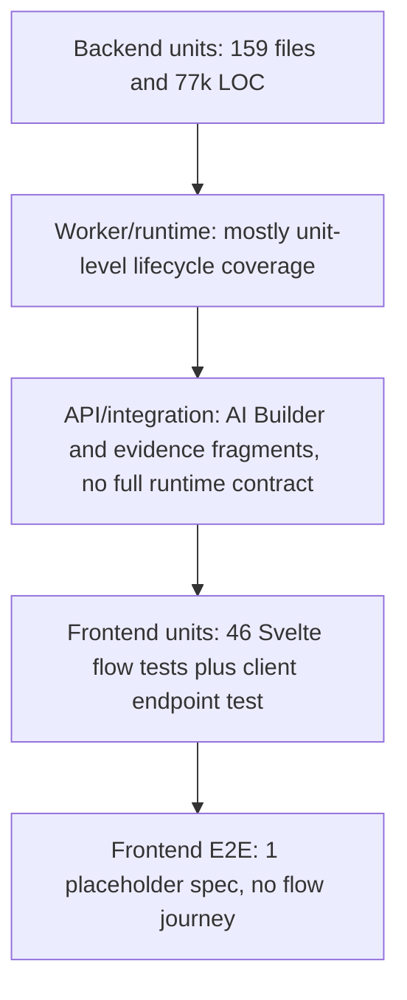

# Phase 1a Agent H - Test Coverage And Quality Review

TL;DR:
1. Flow tests collect locally, but the suite is bottom-heavy: 159 backend unit flow test files and 77,162 LOC outweigh 10 executable backend integration flow test files and 8,333 LOC.
2. The riskiest current gap is not unit coverage; it is the missing API-plus-worker contract that proves create run, upload runtime files, dispatch, terminalization, evidence, artifacts, and audit rows together.
3. AI Builder has valuable backend API happy-path coverage, but it is buried in a 3,270 LOC regression file and still needs a frontend journey test for create/revise/approve/apply/open-flow behavior.
4. Test maintainability is a real defect: the four biggest flow test files are 3,707, 3,589, 3,401, and 3,270 LOC, and several tests assert direct function calls, private executor calls, and mock collaborator calls.
5. Backend collect and pyright can gate now; flow Ruff, frontend check, and frontend Vitest are baseline blockers and must be tracked separately from product test gaps.

## Scope And Standards Read

Agent H is explicitly responsible for flow and AI Builder tests, missing behavioral coverage, test files over 1,000 LOC, implementation-detail assertions, excessive mocks, flaky tests, dead tests, high-ROI subsystem tests, and test acceptance criteria at `prompt.md:505-521`.

The applicable standards are:

| Standard | Relevant Rule | Review Impact |
|---|---|---|
| `docs/engineering/testing-standard.md:3-24` | Tests protect behavior, not implementation; flag internal mocks, private-helper assertions, huge files, flaky sleeps, and legacy tests. | Findings below distinguish behavior coverage from implementation coupling. |
| `docs/engineering/api-design-standard.md:7-18` | External API consumers need obvious upload, start, poll, output, artifact, error, retry journeys. | API tests are judged by consumer-visible contracts, not direct router calls. |
| `docs/engineering/api-design-standard.md:22-47` | Endpoint ownership includes schemas, status codes, authorization, idempotency, generated client impact, and contract tests. | Contract gaps name the endpoint family and required assertions. |
| `docs/engineering/frontend-state-standard.md:3-18` | Frontend state must have one owner and recommendations must name state owner, side-effect boundary, and tests. | Frontend gaps are scoped to driver/component/E2E responsibilities. |
| `docs/engineering/maintainability-standards.md:7-25` | Optimize for human maintainability and score by minimum dimension. | The scorecard uses maintainability and reviewability as first-class outcomes. |
| `docs/engineering/maintainability-standards.md:71-85` | Prefer deletion and do not preserve tests that protect bad architecture. | Hotspot recommendations include merge/delete paths, not just new tests. |

## Inventory Methodology

Counts are grounded in explicit commands, not rough estimates:

| Inventory | Command / Method | Result |
|---|---|---:|
| Backend flow collection | `cd backend && ./.venv/bin/python -m pytest tests/unittests/flows tests/integration/flows --collect-only -q` | `3062/3082 tests collected (20 deselected) in 0.74s` |
| Backend unit flow test files | `find backend/tests/unittests/flows -name 'test*.py'` | 159 files, 77,162 LOC |
| Backend integration flow test files | `find backend/tests/integration/flows -name 'test*.py'` | 10 executable test files, 8,333 LOC |
| Backend integration flow Python files | `find backend/tests/integration/flows -name '*.py'` | 15 files total; 3 `__init__.py` files and benchmark support files `cases.py` / `runner.py` are excluded from executable-test-file counts. |
| Svelte flow unit tests | `find frontend/apps/web/src/lib/features/flows -name '*.test.ts'` | 46 files, 5,633 LOC |
| Generated-client flow endpoint test | `frontend/packages/intric-js/src/endpoints/flows.test.js` | 1 file, 204 LOC |
| Frontend Playwright surface | `find frontend/apps/web/tests -type f -maxdepth 2` | 1 file, 6 LOC |

Phase 0 baseline also established that full backend collection passes, pyright passes through `uv run pyright`, flow-scoped Ruff fails with 18 import-order issues, frontend check fails, and frontend Vitest fails because `jsdom` is missing despite 460 collected tests passing before environment errors at `docs/refactor/phase0/baseline.md:21-29`. Phase 1 requires separating tooling failures from product findings at `docs/refactor/phase1/README.md:36-46`.

## Test Pyramid Map

| Layer | Current Coverage | Evidence | Gap / Canonical Owner |
|---|---|---|---|
| Backend unit | Large suite for runtime, router, service, AI Builder compiler/materializer/planner. | 159 files / 77,162 LOC; hotspots at `docs/refactor/phase0/baseline.md:57-60`. | Canonical owner is each tested production module. Gap is not quantity; gap is implementation coupling and lifecycle organization. |
| Backend integration/API | 10 executable files, including AI Builder session regressions, evidence API contracts, repositories, and AI Builder migrations. | AI Builder create/apply API path at `backend/tests/integration/flows/test_ai_builder_session_api_regressions.py:2423-2585`; evidence endpoints at `backend/tests/integration/flows/test_flow_evidence_api_contracts.py:408-490`. | Missing one external-consumer runtime contract that starts from HTTP and proves run creation through persisted execution outputs. |
| Worker/runtime | Runtime behavior is mostly exercised through mocked repositories and executor collaborators. | Private executor and repo mock examples at `backend/tests/unittests/flows/test_flow_executor_runtime.py:916-958` and `backend/tests/unittests/flows/test_flow_run_service.py:2028-2190`. | Canonical owner should be `backend/tests/integration/flows/test_flow_runtime_worker_contract.py`, using DB-backed state and a fake only at the external execution boundary. |
| Frontend component/unit | Flow helper, status, copy, driver, and endpoint-wrapper tests exist. | Driver tests use mocked fetch/stream at `frontend/apps/web/src/lib/features/flows/ai-builder/FlowAIBuilderDriver.test.ts:52-66`; client endpoint run payload tests at `frontend/packages/intric-js/src/endpoints/flows.test.js:96-155`. | Missing DOM-level runtime and AI Builder journeys where Svelte state, generated client calls, and visible user outcomes meet. |
| Frontend E2E | Only default SvelteKit placeholder exists. | `frontend/apps/web/tests/test.ts:1-6`; Playwright is configured for `tests` at `frontend/apps/web/playwright.config.ts:3-10`. | Canonical home for one critical flow E2E is `frontend/apps/web/tests/flows-runtime.spec.ts`; keep it one happy path, not a broad suite. |
| API consumer contract | Generated-client wrapper tests prove URL/body/idempotency helper behavior, not server/client contract compatibility. | `frontend/packages/intric-js/src/endpoints/flows.test.js:96-183`; backend request model uses `dict[str, Any]` for `input_payload_json` and typed `step_inputs` at `backend/src/intric/flows/api/flow_models.py:410-434`. | Canonical owner should be backend HTTP integration plus generated client contract checks after OpenAPI/client generation is stabilized. |
| Data/migration | Repositories and AI Builder state migrations have tests, but there is no single flow definition/run payload JSON contract test. | Integration file list includes builder migration tests; runtime contract shape is exposed at `backend/src/intric/flows/api/flow_models.py:668-684`. | Canonical home should be data-model contract tests under `backend/tests/integration/flows/`, owned by Phase 1 data-model decisions. |

## Critical Path Coverage

| Critical Path | Current Evidence | Coverage Verdict | Acceptance Bar |
|---|---|---|---|
| AI Builder create -> plan -> revise -> approve -> apply -> open flow | Backend create/apply path creates a session, sends messages, gets plan, approves, applies, then opens the flow at `backend/tests/integration/flows/test_ai_builder_session_api_regressions.py:2423-2585`. Frontend driver revises a plan via mocked fetch at `frontend/apps/web/src/lib/features/flows/ai-builder/FlowAIBuilderDriver.test.ts:642-659`. | Partial. Backend has a strong happy path, but no frontend journey proves visible create/revise/approve/apply/open-flow behavior. | Add one frontend AI Builder journey using the existing frontend test harness or Playwright. Assertions: session created or resumed, plan visible, revise request sent, approve/apply success visible, navigation target is the created/opened flow. |
| Runtime create published flow -> run -> worker execute -> evidence/artifact retrieval | Create run route dispatches background work at `backend/src/intric/flows/api/flow_run_execution_router.py:106-204`; step output and artifact endpoints exist at `backend/src/intric/flows/api/flow_run_steps_router.py:76-138` and `backend/src/intric/flows/api/flow_run_steps_router.py:231-265`; evidence permissions/export are tested at `backend/tests/integration/flows/test_flow_evidence_api_contracts.py:408-490`. | Gap. Existing tests cover fragments, but not the persisted API-plus-worker lifecycle as a single behavior. | Add one backend integration contract that creates a published flow, creates a run, executes/dispatches deterministically, asserts status/attempt/result rows, retrieves step outputs, evidence, artifact signed URL, and audit rows. |
| External API start run -> upload files -> poll -> result | Run contract and upload endpoints exist at `backend/src/intric/flows/api/flow_upload_router.py:22-81`, `backend/src/intric/flows/api/flow_upload_router.py:149-266`, and `backend/src/intric/flows/api/flow_upload_router.py:269-386`; create/get run routes exist at `backend/src/intric/flows/api/flow_run_execution_router.py:106-204` and `backend/src/intric/flows/api/flow_run_execution_router.py:263-302`; generated-client unit tests prove URL/body/idempotency construction at `frontend/packages/intric-js/src/endpoints/flows.test.js:96-183`. | Gap. The backend contract and frontend client contract are not tested together through HTTP. | Add one API consumer contract test using HTTP client calls: get run contract, upload step runtime file, create run with `step_inputs`, poll/get run, list step outputs, assert error shape for an invalid `step_id`, and assert idempotency conflict behavior. |
| Pause-edit-resume | The current run and step status enums are closed over queued/running/completed/failed/cancelled and pending/running/completed/failed/cancelled/started/retried at `backend/src/intric/flows/enums.py:64-85`; route inventory shows create/get/cancel/redispatch but no pause/resume route at `backend/src/intric/flows/api/flow_run_execution_router.py:305-442`. | Roadmap primitive, not a current test gap. `rg` found no `pause`, `resume`, or rerun primitive in `backend/src/intric/flows/{api,runtime,application,domain}`. | Do not add tests now. If the product primitive lands, require a state-machine contract, API contract, audit assertion, and frontend journey in the same PR. |
| Step-level re-run | Frontend only maps an unsupported rerun error code in runtime error handling, while backend current routes expose cancel/redispatch but no step re-run route. | Roadmap primitive, not a current test gap. | Same as pause-edit-resume: future feature PR must include contract tests; do not create speculative tests before a canonical runtime state model exists. |

## Findings

### F1. Missing API-plus-worker runtime contract is the highest-risk coverage gap

Problem: Current runtime coverage is split across direct API route tests, service unit tests, executor unit tests, repository tests, and evidence API tests. No test proves the external runtime journey through HTTP, persisted execution, outputs, artifacts, and audit.

Why it matters: Runtime failures are stateful and cross-layer. A unit test can pass while run status, step attempts, evidence generation, artifact access, and audit logging drift from each other. The testing standard explicitly calls for integration tests for DB/API/runtime wiring and worker/runtime retries, idempotency, duplicate starts, crash recovery, and terminalization at `docs/engineering/testing-standard.md:7-12`.

Evidence:

| Evidence | Signal |
|---|---|
| `backend/src/intric/flows/api/flow_run_execution_router.py:106-204` | Public create-run route creates the run, audits, and schedules dispatch. |
| `backend/src/intric/flows/api/flow_run_execution_router.py:305-360` | Cancel route audits cancellation, another cross-layer state transition. |
| `backend/src/intric/flows/api/flow_run_execution_router.py:363-442` | Redispatch route uses execution backend and audits redispatch. |
| `backend/tests/unittests/flows/test_flow_run_service.py:2028-2190` | Redispatch behavior is covered with mocked repositories and mocked execution backend, not a persisted API/worker path. |
| `backend/tests/integration/flows/test_flow_evidence_api_contracts.py:408-490` | Evidence endpoints are covered after seeded data, not after executing a run from the public start-run route. |

Current owner: Runtime behavior is split across `flow_run_execution_router`, `FlowRunService`, runtime executor tests, repository tests, and evidence tests.

Proposed canonical home: `backend/tests/integration/flows/test_flow_runtime_worker_contract.py`.

Merge/delete path: Keep low-level executor/service unit tests only for branch-specific pure rules. Move duplicated redispatch/cancel happy-path expectations out of direct router tests once HTTP-level contract coverage exists. Delete tests that only assert `AsyncMock` call counts when a persisted contract covers the same behavior.

Acceptance criteria: One integration test creates a published two-step flow, uploads required runtime input, creates a run with `Idempotency-Key`, executes deterministically through the worker/runtime boundary, asserts `queued -> running -> completed` persisted status, asserts step attempts/results, retrieves step outputs, retrieves evidence/export, generates artifact signed URL when an artifact exists, and asserts audit rows for `flow_run_created` plus the terminal action emitted by the run (`flow_run_completed` or `flow_run_failed` per `backend/src/intric/audit/domain/action_types.py:81-85`). Keep the initial happy-path test file under 400 LOC; split cancel and redispatch contracts into sibling files if adding them would make the contract hard to review.

Tests required: `backend/tests/integration/flows/test_flow_runtime_worker_contract.py`; target command `cd backend && ./.venv/bin/python -m pytest tests/integration/flows/test_flow_runtime_worker_contract.py -q`.

Risk/trade-off: This test will be slower than unit tests and needs deterministic execution fixtures. The payoff is high because it protects the contract most likely to break under runtime refactors.

Human reviewability impact: High positive. Reviewers can approve runtime changes by reading one contract instead of reconstructing behavior from scattered mocks.

Confidence: High.

### F2. Router and service tests often assert implementation details instead of API behavior

Problem: Several tests call router functions directly, assemble mocked containers, or assert collaborator calls. These tests can fail on harmless refactors and pass while HTTP status codes, auth, OpenAPI shape, headers, and response bodies regress.

Why it matters: API tests should protect consumer contracts. Direct function tests are still useful for narrow adapter policy branches, but they are not a substitute for HTTP-level route behavior. The API standard requires endpoint ownership for path, operation ID, status codes, authorization, idempotency, OpenAPI/client impact, and contract tests at `docs/engineering/api-design-standard.md:22-47`.

Evidence:

| Evidence | Smell | Canonical Replacement |
|---|---|---|
| `backend/tests/unittests/flows/test_flow_router.py:1-98` | Imports endpoint functions directly instead of exercising routes through HTTP. | HTTP integration tests for public contracts. |
| `backend/tests/unittests/flows/test_flow_router.py:154-182` | `_enable_space_access` configures `space_service` and `actor_manager` mocks for many endpoint calls. | Shared auth/space fixtures at the HTTP test layer. |
| `backend/tests/unittests/flows/test_flow_router.py:622-674` | Calls `create_flow_run` directly and asserts `BackgroundTasks.tasks`, `create_run.assert_awaited_once_with`, and audit mock calls. | HTTP create-run contract plus audit-row assertion. |
| `backend/tests/unittests/flows/test_flow_router.py:1552-1602` | Calls alias endpoint functions directly and asserts `flow_service.get_flow.await_count == 3`. | HTTP route tests for list/get/steps response shape and auth. |
| `backend/tests/unittests/flows/test_flow_router.py:3371-3433` | Permission behavior is tested by direct function call and mocked container. | One HTTP authorization matrix per endpoint family. |

Current owner: `backend/tests/unittests/flows/test_flow_router.py`.

Proposed canonical home: Endpoint contract tests under `backend/tests/integration/flows/test_flow_consumer_api_contract.py` and narrow unit tests only for pure router helpers.

Merge/delete path: After HTTP contracts land, delete direct function tests that only prove delegation or call counts. Keep direct tests only when they cover a pure branch that is not visible through HTTP and document why HTTP would be too expensive.

Acceptance criteria: Public runtime endpoints have HTTP tests for status code, response body, error `code`, auth/scope denial, idempotency header, and generated-client-relevant request/response shape.

Tests required: `backend/tests/integration/flows/test_flow_consumer_api_contract.py`.

Risk/trade-off: HTTP tests require more fixtures and can be slower. Avoid broad matrices; test one happy path and the highest-risk typed errors per route family.

Human reviewability impact: High positive. Reviewers can compare routes to API tests instead of reviewing mocked call choreography.

Confidence: High.

### F3. Runtime executor tests are large and coupled to private lifecycle mechanics

Problem: Runtime executor tests assert private methods and internal state passed between executor phases. That protects current control flow more than persisted runtime behavior.

Why it matters: `backend/src/intric/flows/runtime/executor.py` is already a production hotspot, with a 416-line `execute` function called out in Phase 0 at `docs/refactor/phase0/baseline.md:84-85`. Fragile tests around private methods make lifecycle refactors harder without necessarily improving reliability.

Evidence:

| Evidence | Smell | Better Behavior Assertion |
|---|---|---|
| `backend/tests/unittests/flows/test_flow_executor_runtime.py:916-958` | Replaces `executor._execute_step` with `AsyncMock` and asserts it was not awaited. | Persisted skipped result/status and absence of step-attempt rows. |
| `backend/tests/unittests/flows/test_flow_executor_runtime.py:1759-1868` | Stubs `_execute_step`, asserts `await_args.kwargs["state"].completed_by_order[1]`. | Step 2 receives previous step output and run completes with expected persisted step results. |
| `backend/tests/unittests/flows/test_flow_executor_runtime.py:2716-2726` | Tests a private validation method and a legacy no-snapshot branch by asserting `_load_assistant` was not awaited. | Keep only if Phase 1 dead/legacy review preserves legacy snapshots; otherwise delete with the compatibility path. |
| `backend/tests/unittests/flows/test_flow_run_service.py:287-307` | Concurrency limit test asserts repository lock call in addition to behavior. | DB-backed single-winner or lock-acquisition integration test if concurrency policy remains critical. |
| `backend/tests/unittests/flows/test_flow_run_service.py:798-880` | This is better coverage: it asserts persisted expected version and `step_inputs` payload. | Preserve and move toward typed contract tests rather than deleting. |

Current owner: `backend/tests/unittests/flows/test_flow_executor_runtime.py` and `backend/tests/unittests/flows/test_flow_run_service.py`.

Proposed canonical home: Split executor tests by lifecycle phase, with one DB-backed runtime contract as the top-level safety net.

Merge/delete path: Merge repeated setup into lifecycle-specific fixtures. Delete private-method expectations once equivalent persisted behavior is asserted. Retain a small number of unit tests for pure resolution/validation functions.

Acceptance criteria: Executor tests read as lifecycle behavior: claim run, skip terminal run, claim step, execute step, terminalize completed, terminalize failed, cancel, redispatch. Private method assertions are absent unless the method is intentionally public to the test module.

Tests required: Existing executor tests refactored into lifecycle files plus the integration contract in F1.

Risk/trade-off: Some private-method tests catch branch regressions cheaply. The replacement must preserve those branch failures through explicit persisted outcomes before deletion.

Human reviewability impact: Medium-high positive. Lifecycle file names let a reviewer find the behavior under change without scanning 3,707 LOC.

Confidence: High.

### F4. Frontend flow coverage is mostly driver/helper level; no real flow E2E protects user journeys

Problem: Frontend tests cover helpers, driver request construction, status labels, and generated-client endpoint wrappers. They do not prove a user can run a flow, upload runtime files, watch progress, retrieve evidence, or complete AI Builder create/revise/approve/apply/open-flow behavior through visible UI.

Why it matters: The frontend state standard requires one owner for state and tests at the side-effect boundary at `docs/engineering/frontend-state-standard.md:3-18`. Driver-only tests can pass while Svelte components wire the driver incorrectly.

Evidence:

| Evidence | Signal |
|---|---|
| `frontend/apps/web/src/lib/features/flows/ai-builder/FlowAIBuilderDriver.test.ts:52-66` | Driver tests inject mocked `fetch` and `stream`, which is right for driver units but not a UI journey. |
| `frontend/apps/web/src/lib/features/flows/ai-builder/FlowAIBuilderDriver.test.ts:397-409` | Tests message body construction, not rendered UI behavior. |
| `frontend/apps/web/src/lib/features/flows/ai-builder/FlowAIBuilderDriver.test.ts:532-609` | Tests attachment request plumbing and state mutation, not DOM workflow. |
| `frontend/apps/web/src/lib/features/flows/components/FlowRunsTable.svelte:190-207` | Runtime table has polling side effects. |
| `frontend/apps/web/src/lib/features/flows/components/FlowRunsTable.svelte:239-274` | Runtime table owns redispatch/cancel side effects and toasts. |
| `frontend/apps/web/src/lib/features/flows/components/FlowRunProgressPanel.svelte:80-136` | Progress panel owns polling and stale-warning behavior. |
| `frontend/apps/web/tests/test.ts:1-6` | Only E2E test asserts default "Welcome to SvelteKit" h1. |

Current owner: `frontend/apps/web/src/lib/features/flows/**` unit tests and `frontend/apps/web/tests/`.

Proposed canonical home: Keep driver tests in `FlowAIBuilderDriver.test.ts`; add one AI Builder DOM journey test and one Playwright runtime happy path under `frontend/apps/web/tests/flows-runtime.spec.ts`.

Merge/delete path: Do not duplicate every driver assertion at the UI layer. Keep driver tests for protocol/state transitions; add E2E only for one critical journey. Replace the placeholder SvelteKit E2E test once a real app route journey exists.

Acceptance criteria: Minimum E2E covers login/test auth fixture, open a published flow, upload a runtime file, start a run, poll until a deterministic completed state from a mocked/test backend fixture, assert final result/evidence is visible. AI Builder DOM test covers create/revise/approve/apply/open-flow with mocked backend stream.

Tests required: `frontend/apps/web/tests/flows-runtime.spec.ts`; AI Builder DOM test in the existing frontend test harness if available, otherwise Playwright with backend stubs.

Risk/trade-off: E2E can be flaky if it depends on real async worker timing. Use deterministic test backend/fake responses, not sleeps.

Human reviewability impact: High positive. One user-level spec makes frontend runtime regressions visible without expanding every component test.

Confidence: High.

### F5. Flaky timing risk exists and should be fenced with fake timers

Problem: At least one frontend flow test waits on wall-clock time, and production flow components contain polling/timer behavior that needs deterministic tests.

Why it matters: The testing standard flags flaky sleeps and arbitrary polling at `docs/engineering/testing-standard.md:20-24`. Timer tests should use fake timers or deterministic injected schedulers.

Evidence:

| Evidence | Signal |
|---|---|
| `frontend/apps/web/src/lib/features/flows/flowAssistantSaveManager.test.ts:41-51` | Test fixture configures `delayMs: 500`. |
| `frontend/apps/web/src/lib/features/flows/flowAssistantSaveManager.test.ts:68-88` | Test sleeps with `setTimeout(resolve, 550)` before asserting debounce behavior. |
| `frontend/apps/web/src/lib/features/flows/components/FlowRunsTable.svelte:190-213` | Production polling schedules and clears `setTimeout`. |
| `frontend/apps/web/src/lib/features/flows/components/FlowRunProgressPanel.svelte:80-136` | Production polling increments failure counts and schedules `setTimeout`. |

Current owner: Flow frontend unit tests.

Proposed canonical home: `frontend/apps/web/src/lib/features/flows/flowAssistantSaveManager.test.ts` for debounced save timing; component tests for polling/stale behavior.

Merge/delete path: Replace wall-clock sleep with `vi.useFakeTimers()` and `vi.advanceTimersByTimeAsync(500)`. Do not add broad retry wrappers around flaky tests.

Acceptance criteria: No flow test uses real sleeps for debounce/polling behavior; polling components have deterministic tests for active polling, stop-on-terminal, and stale warning after failures.

Tests required: Update existing frontend unit test and add targeted polling tests if the frontend harness supports component rendering.

Risk/trade-off: Fake timers can hide integration issues if overused. Keep one E2E runtime spec for real wiring, but avoid wall-clock sleeps in unit/component tests.

Human reviewability impact: Medium positive. Timer behavior becomes readable and repeatable.

Confidence: High for the sleep finding; medium for broader polling coverage until component harness constraints are known.

### F6. Dead-test evidence is low-confidence; legacy-protection candidates need Phase 1 dead-code alignment

Problem: I found no high-confidence dead tests in scope. There are tests that protect legacy/compatibility branches, but whether to delete them depends on Phase 1 dead-and-legacy decisions.

Why it matters: Deleting tests without deleting the protected compatibility path is unsafe. Keeping tests for legacy branches after deleting the compatibility path is also wasteful. The maintainability standard prefers deleting never-shipped compatibility and tests that protect bad architecture at `docs/engineering/maintainability-standards.md:75-85`.

Evidence:

| Evidence | Current Verdict |
|---|---|
| `backend/tests/unittests/flows/test_flow_executor_runtime.py:2716-2726` | Candidate legacy test: protects steps without assistant snapshots. Delete only if the legacy snapshot path is deleted. |
| `backend/tests/unittests/flows/test_flow_router.py:1596-1602` | Candidate redundant test after HTTP alias contract lands: asserts delegation/counts. |
| `backend/tests/unittests/flows/test_flow_router.py:622-674` | Candidate redundant test after HTTP create-run plus audit contract lands. |

Current owner: Phase 1 Agent D for dead/legacy decisions plus this test review for test cleanup.

Proposed canonical home: Keep a "legacy test deletion" checklist in `docs/refactor/phase1/04-dead-and-legacy.md`; execute deletion only with source deletion.

Merge/delete path: Mark candidate tests when source compatibility paths are removed; do not delete preemptively from this doc.

Acceptance criteria: Every deleted legacy path has matching test deletion or retargeting in the same implementation PR.

Tests required: None now; future deletion PR should run the scoped backend flow collect command and relevant behavior tests.

Risk/trade-off: Conservative retention leaves some test debt. It avoids accidentally deleting the only coverage for still-live behavior.

Human reviewability impact: Medium positive. It prevents speculative test deletion while still naming cleanup candidates.

Confidence: Medium.

## Test Hotspots Over 1,000 LOC

The problem is not merely "over 1,000 LOC"; the first four files are 3,270-3,707 LOC and should be split first. A practical Phase 2 target is to reduce each of the first four files to 1,200 LOC or less after lifecycle splits, with net deletion or movement of at least 9,000 LOC out of those four hotspots.

| File | LOC | Current Problem | Proposed Split Axis | Merge/Delete Path |
|---|---:|---|---|---|
| `backend/tests/unittests/flows/test_flow_executor_runtime.py` | 3,707 | Runtime lifecycle, input handoff, cancellation, terminalization, assistant snapshots, webhooks, and private-call assertions share one file. | Split by lifecycle: claiming/skip, step execution, input handoff, terminalization, cancellation, webhook/audit, snapshot validation. | Delete private-method assertions after persisted behavior contract lands; move pure input/snapshot cases to narrower files. |
| `backend/tests/unittests/flows/test_flow_router.py` | 3,589 | Direct endpoint calls, mocked containers, auth setup, upload/template/evidence/runtime route assertions all share one file. | Split by route family: authoring, runtime runs, uploads/templates, evidence/artifacts, auth/scope. | Move consumer-visible behavior to HTTP integration tests; delete delegation-only direct-call tests. |
| `backend/tests/unittests/flows/test_flow_run_service.py` | 3,401 | Create-run policy, concurrency, idempotency, evidence, cancel, redispatch, artifacts, and repository call assertions share one file. | Split by application lifecycle: create/idempotency, authorization/visibility, cancellation, redispatch/reconcile, evidence/artifacts. | Replace repeated `AsyncMock` repository choreography with DB-backed tests for concurrency/redispatch where behavior depends on persistence. |
| `backend/tests/integration/flows/test_ai_builder_session_api_regressions.py` | 3,270 | Valuable API journeys, typed errors, regression cases, LLM patching, and DB setup are coupled in one regression sink. | Split by AI Builder scenario: session API, create apply, edit apply, file attachments, typed errors, migrations. | Keep only cross-scenario fixtures shared; move benchmark-style or migration assertions to their existing specialized files. |
| `backend/tests/unittests/flows/ai_builder/test_ai_builder_create_compiler.py` | 2,899 | Create compiler scenarios are too broad for one review. | Split by compiler concern: runtime input, step materialization, output mode, validation/errors. | Merge duplicate fixture builders; delete tests that duplicate compiler implementation branches without consumer-visible behavior. |
| `backend/tests/unittests/flows/ai_builder/test_ai_builder_service.py` | 2,847 | Service orchestration, LLM patching, session behavior, and errors share one file. | Split by service lifecycle: session creation, message processing, plan persistence, apply, failure modes. | Move API-visible behavior to integration; keep units for pure service decisions. |
| `backend/tests/unittests/flows/test_flow_service.py` | 2,186 | Flow authoring/service responsibilities are broad. | Split by authoring lifecycle: create/update/publish/delete/permissions/templates. | Delete pass-through tests after router/service ownership is clarified. |
| `backend/tests/integration/flows/test_flow_run_repository.py` | 1,768 | Repository lifecycle scenarios are dense. | Split by persistence concern: create/idempotency, active-count/locks, cancel/redispatch, step results. | Keep DB-specific behavior here; do not duplicate service-level mocks. |

Acceptance criterion for future test edits: new tests must not be added to any file above 1,000 LOC unless the same PR moves or deletes enough nearby tests to reduce review cost.

## Implementation Detail And Mock Inventory

| Category | Evidence | Why It Matters | Recommendation |
|---|---|---|---|
| Direct router calls | `backend/tests/unittests/flows/test_flow_router.py:648-674` | Asserts background-task internals and service calls, not HTTP behavior. | Replace with HTTP contract plus audit-row assertion. |
| Delegation call counts | `backend/tests/unittests/flows/test_flow_router.py:1593-1602` | `get_flow.await_count == 3` makes harmless route refactors test-breaking. | Assert response shape and auth through HTTP. |
| Private executor method assertion | `backend/tests/unittests/flows/test_flow_executor_runtime.py:916-958` | Couples to `_execute_step` call graph. | Assert persisted status/attempt absence. |
| Private state handoff assertion | `backend/tests/unittests/flows/test_flow_executor_runtime.py:1759-1868` | Protects internal `RunExecutionState` shape rather than output behavior. | Assert second step input/output behavior at the runtime boundary. |
| Redispatch mock choreography | `backend/tests/unittests/flows/test_flow_run_service.py:2028-2190` | Multiple tests assert mocked repository/execution backend choreography. | Keep targeted branch units, add DB/API contract for redispatch behavior. |
| Frontend driver-only protocol tests | `frontend/apps/web/src/lib/features/flows/ai-builder/FlowAIBuilderDriver.test.ts:397-409`, `frontend/apps/web/src/lib/features/flows/ai-builder/FlowAIBuilderDriver.test.ts:532-609`, `frontend/apps/web/src/lib/features/flows/ai-builder/FlowAIBuilderDriver.test.ts:642-659` | Useful unit tests, but insufficient for UI journey coverage. | Preserve driver tests and add one DOM/Playwright journey. |

## Flaky, Skipped, And Dead Test Inventory

| Check | Result | Evidence / Command |
|---|---|---|
| `skip`, `xfail`, `flaky`, `.only` in scoped flow tests | No findings. | `rg "pytest\\.mark\\.(skip|xfail|flaky)|pytest\\.skip\\(|test\\.skip\\(|describe\\.skip\\(|it\\.skip\\(|\\.only\\(" backend/tests/unittests/flows backend/tests/integration/flows frontend/apps/web/src/lib/features/flows frontend/packages/intric-js/src/endpoints/flows.test.js frontend/apps/web/tests` returned no matches. |
| Wall-clock sleeps | Finding. | `frontend/apps/web/src/lib/features/flows/flowAssistantSaveManager.test.ts:68-88` waits 550ms. |
| Production polling without deterministic frontend tests | Finding. | Polling exists in `frontend/apps/web/src/lib/features/flows/components/FlowRunsTable.svelte:190-213` and `frontend/apps/web/src/lib/features/flows/components/FlowRunProgressPanel.svelte:80-136`; no corresponding component/E2E journey covers these side effects. |
| Dead tests | No high-confidence findings. | Candidate legacy/redundant tests are listed in F6 and should be reconciled with Agent D before deletion. |

## Highest-ROI Tests By Subsystem

This table satisfies the per-subsystem prompt requirement, but the priority is intentionally ranked. P1 and P2 buy the most reliability; P3-P6 should be triggered by nearby implementation work or Phase 1 synthesis decisions.

| Priority | Subsystem | Proposed File | Assertions |
|---:|---|---|---|
| P1 | Flow runtime backend | `backend/tests/integration/flows/test_flow_runtime_worker_contract.py` | Published flow can create a run, dispatch/execute deterministically, persist run/step attempt/result statuses, expose step outputs/evidence/artifacts, and write `flow_run_created` plus terminal `flow_run_completed` or `flow_run_failed` audit rows. |
| P2 | API consumer contract | `backend/tests/integration/flows/test_flow_consumer_api_contract.py` | HTTP consumer can get run contract, upload step runtime file, create run with `step_inputs`, poll/get run, list step outputs, receive typed errors, and hit idempotency conflict semantics. |
| P3 | Frontend runtime | `frontend/apps/web/tests/flows-runtime.spec.ts` | User opens a flow, uploads runtime file, starts run, sees active progress, sees completed result/evidence, and can request cancel/redispatch where applicable with deterministic backend stubs. |
| P4 | AI Builder backend | Split from `backend/tests/integration/flows/test_ai_builder_session_api_regressions.py` into `backend/tests/integration/flows/ai_builder/test_ai_builder_create_apply_contract.py` | Create session, receive question/requirements/plan SSE events, approve, apply, open flow, and assert no orphan flow on typed failure. |
| P5 | Frontend AI Builder | `frontend/apps/web/src/lib/features/flows/ai-builder/FlowAIBuilderJourney.test.ts` or Playwright if component harness is insufficient | Create/edit session visible states, revise plan, approve/apply, error/conflict rendering, navigation to created/opened flow. |
| P6 | Data model/migrations | `backend/tests/integration/flows/test_flow_run_payload_contract.py`; migration compatibility stays with existing migration-style files under `backend/tests/integration/flows/ai_builder/` | Versioned published definition JSON, `input_payload_json`, `step_inputs`, runtime file IDs, and corrupt payload behavior are explicit. Migration compatibility should remain in focused migration tests so this contract file does not become another hotspot. |

## Validation Command Gates

| Gate | Current Result | Use Now? | Notes |
|---|---|---:|---|
| `cd backend && ./.venv/bin/python -m pytest tests/unittests/flows tests/integration/flows --collect-only -q` | Pass: `3062/3082 tests collected (20 deselected) in 0.74s` | Yes | Fast scoped collection gate for flow test import health. |
| `cd backend && ./.venv/bin/python -m pytest --collect-only` | Pass in Phase 0: `6166/6207 tests collected (41 deselected) in 19.94s` | Yes | Repo backend collection gate from `docs/refactor/phase0/baseline.md:21`. |
| `cd backend && uv run pyright` | Pass in Phase 0 | Yes | Type gate from `docs/refactor/phase0/baseline.md:23`. |
| `cd backend && uv run ruff check --no-fix src/intric/flows tests/unittests/flows tests/integration/flows` | Fails: 18 flow-scoped import-order issues | Not yet as required green gate | Track as tooling/code-style blocker, not a product test gap. |
| `pnpm -C frontend/apps/web test:unit -- --run` | Fails because `jsdom` is missing after 460 tests pass | Not yet as required green gate | Environmental/tooling failure per `docs/refactor/phase0/baseline.md:29` and `docs/refactor/phase1/README.md:58`. |
| `pnpm -C frontend check` | Fails repo-wide with flow-scoped diagnostics listed in Phase 0 | Not yet as required green gate | Track separately from test design. |
| `pnpm -C frontend/apps/web exec playwright test tests/flows-runtime.spec.ts` | Only placeholder test exists today | No | Add a minimal flow spec before using this as a meaningful gate. |

## Proposed Acceptance Criteria

- Runtime/backend changes that affect run creation, dispatch, status, step output, evidence, artifacts, cancellation, redispatch, or audit must include a behavior test at the highest affected boundary.
- Public API route changes must include HTTP-level contract assertions for status code, response shape, typed error `code`, authorization, idempotency when relevant, and generated-client impact.
- Worker/runtime changes must include persisted-state assertions for retries, duplicate starts, crash/terminalization behavior, or an explicit explanation for why a pure unit test is sufficient.
- Frontend AI Builder or runtime changes must include either a component journey test or the one minimal Playwright flow journey, with mocked/stubbed async behavior instead of sleeps.
- New tests should not expand files above 1,000 LOC unless the same PR moves, merges, or deletes nearby scenarios. New contract-test files should stay under 400 LOC unless the PR explicitly splits the scenario into sibling files.
- Tests that only assert internal mock call counts should be deleted or retargeted after equivalent consumer-visible or persisted behavior contracts exist.
- Any future pause/resume or step rerun implementation must add tests in the same PR; until the runtime/API primitives exist, those are roadmap test requirements, not current coverage defects.

## Risks And Trade-Offs

| Risk | Trade-Off | Mitigation |
|---|---|---|
| Adding integration/E2E tests slows CI. | Reliability improves most at the contract boundaries where current coverage is weakest. | Add exactly one runtime contract and one frontend happy path first; do not create broad matrices. |
| Deleting mock-heavy tests could lose cheap branch coverage. | Reviewability improves only if deletion follows equivalent behavior coverage. | Sequence as add contract, verify mutation/failure mode coverage, then delete duplicated mock assertions. |
| Playwright flow tests can become flaky. | A single critical journey is still useful if deterministic. | Stub backend/worker timing; avoid real sleeps and arbitrary polling. |
| JSON contract tests may duplicate schema work from data-model reviewers. | Data shape correctness is cross-cutting. | Let Phase 1 data-model output define canonical owner; this doc only names the test gap and acceptance bar. |

## No Findings

- No explicit `skip`, `xfail`, `flaky`, or focused `.only` markers were found in the scoped flow backend, frontend flow, generated-client flow, or Playwright tests.
- No high-confidence dead tests were found. There are legacy/redundancy candidates, but deletion should be paired with the dead-and-legacy review and source deletion.
- No frontend flow unit test file exceeds 1,000 LOC; the largest is `frontend/apps/web/src/lib/features/flows/ai-builder/FlowAIBuilderDriver.test.ts` at 844 LOC.

## Final Scorecard

| Dimension | Score | Rationale |
|---|---:|---|
| Maintainability | 4 | Test volume is high, but 3,000+ LOC hotspots and mock-heavy organization make changes hard to review. |
| Code Quality | 5 | Many tests are useful and behavior-named, but implementation-detail assertions and wall-clock sleeps lower confidence. |
| Clean Architecture | 5 | Unit tests mostly follow package boundaries, but API/router tests often bypass the HTTP adapter contract. |
| Separation of Concerns | 4 | Several files mix unrelated route families, lifecycle phases, and regression scenarios. |
| Single Source of Truth | 5 | Runtime/API/frontend contracts are partially covered, but no single test owns the full runtime consumer contract. |
| Human Readability | 4 | Hotspot files require too much scanning and fixture reconstruction for week-one comprehension. |
| Human Reviewability | 4 | Reviewers must infer behavior from scattered mocks instead of a small set of contract tests. |
| Testability | 4 | The system is testable, but current coverage leans toward mocks and lacks deterministic frontend/runtime journey tests. |
| Runtime Reliability | 3 | The highest-risk run execution path lacks one integrated persisted API-plus-worker contract. |

Overall score: 3, because runtime reliability is the minimum dimension. Refactor required before further runtime feature expansion; for unrelated feature work, do not worsen the hotspot files or add mock-only coverage for new behavior.

## Peer Review Notes

Claude peer review iteration 1 returned `GREEN_LIGHT: no` and identified three corrections that shaped this document: reconcile file/test counts, avoid calling absent pause/resume/rerun primitives current test gaps, and cite concrete implementation-detail assertions. Iteration 2 returned `GREEN_LIGHT: yes`; its advisory tightening notes were folded into the audit assertions, hotspot LOC target, Playwright command, and P6 split above.
