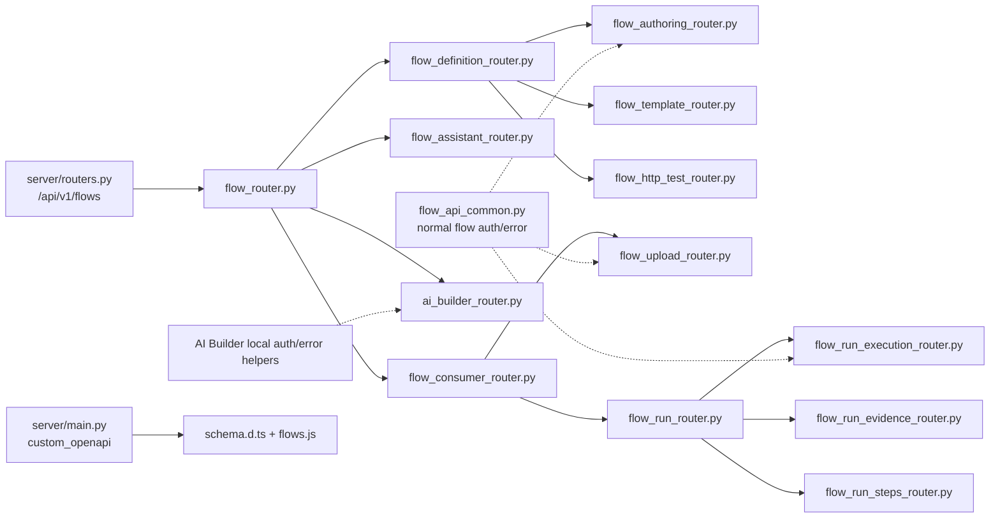

# Phase 1 Agent I - API Maintainer Review

TL;DR:
1. The flow API has useful OpenAPI contract tests, but the maintainer contract is spread across router aggregators, router-local helpers, global OpenAPI surgery, and a handwritten frontend wrapper.
2. The highest-risk owner split is authorization: normal flow routes use `flow_api_common`/`ScopeFilter`, while AI Builder reads raw `Request.state` and carries its own scope and edit-permission helpers.
3. The highest-ROI cleanup is deletion-oriented: collapse pure router forwarders, delete duplicated error helpers, centralize permission helpers, and type only protocol-bearing API dictionaries.
4. API errors are close to a canonical `GeneralError` contract, but routers still produce duplicate examples, bespoke `JSONResponse` branches, SSE error events, and one `{"detail": ...}` fallback path.
5. Overall score: 5/10, driven by Separation of Concerns and Single Source of Truth; do not add more flow endpoints until the playbook below is the default path.

## Scope And Standard

Agent I covers backend API routers, schemas, endpoint naming, error responses, DI, authorization, OpenAPI, generated client implications, versioning, and endpoint tests per `prompt.md:523-540`. The governing API standard says routers are HTTP adapters, not business logic owners, and every endpoint needs an owner for path naming, operation ID, tags, request/response model, status codes, pagination/filtering/sorting, error shape, authorization, idempotency, and generated-client impact (`docs/engineering/api-design-standard.md:1-36`). Contract recommendations must name schema owner, error contract, permission owner, generated-client impact, deletion path, tests, and reviewability impact (`docs/engineering/api-design-standard.md:38-48`). Phase 1 requires file:line evidence, current owner, canonical home, merge/delete path, acceptance criteria, tests, risk/trade-off, reviewability impact, and confidence (`docs/refactor/phase1/README.md:34-46`).

No findings: no source, test, migration, dependency, generated-client, or git changes were made in this review.

## Maintainer Map

## Endpoint Maintainer Inventory

| Surface | Endpoint/operation evidence | Current owner | Request/response schema owner | Permission owner | Error/OpenAPI owner | Maintainer risk |
|---|---|---|---|---|---|---|
| Global flow mount | `/flows` is included with tags `["flows"]`, resource permissions, and API-key scope dependency at `backend/src/intric/server/routers.py:392-400`. | `server/routers.py` plus `flows/api/flow_router.py`. | Flow schemas mostly in `flow_models.py`. | Global dependency plus route-local checks. | Global OpenAPI plus route decorators. | Global tag/dependency behavior is not visible from the leaf endpoint file. |
| Router composition | `flow_router.py` only includes four subrouters at `backend/src/intric/flows/api/flow_router.py:1-12`. | `flow_router.py`. | None. | None. | Router include order. | Pure composition is fine, but nested forwarders make endpoint ownership harder to trace. |
| Definition/authoring | `flow_definition_router.py` includes authoring/template/http-test routers and re-exports endpoint names at `backend/src/intric/flows/api/flow_definition_router.py:5-60`. | `flow_definition_router.py` plus leaf routers. | `FlowCreateRequest`, `FlowUpdateRequest`, `FlowPublic` in `flow_models.py`. | `flow_definition_access.py`, `flow_api_common.py`, and route-local actor checks. | `error_response` examples. | A maintainer has to know both the forwarder and leaf file. |
| Consumer runtime | `flow_consumer_router.py` includes upload/run routers and re-exports endpoints at `backend/src/intric/flows/api/flow_consumer_router.py:1-48`. | `flow_consumer_router.py` plus upload/run leaf routers. | `FlowRunCreateRequest`, `FlowRunPublic`, contract/policy models in `flow_models.py`. | `flow_router_common.enforce_flow_scope_for_request`. | `error_response` examples and OpenAPI tests. | Consumer flow is cohesive conceptually but split through multiple forwarding modules. |
| Run execution | `create_flow_run` documents idempotency and dispatches after commit at `backend/src/intric/flows/api/flow_run_execution_router.py:45-69` and `backend/src/intric/flows/api/flow_run_execution_router.py:159-204`. | `flow_run_execution_router.py`. | `FlowRunCreateRequest`, `FlowRunPublic`. | `common.enforce_flow_scope_for_request`. | Route decorator plus contract tests. | Router owns audit, dispatch, and DTO assembly beyond HTTP adaptation. |
| Upload | Multipart contract and upload endpoint live at `backend/src/intric/flows/api/flow_upload_router.py:149-266`. | `flow_upload_router.py`. | `FilePublic` and upload OpenAPI extra. | `common.enforce_flow_scope_for_request`. | Route `openapi_extra` plus global multipart schema patch. | Multipart shape exists both in route metadata and global OpenAPI rewrite. |
| Evidence/export | Evidence export declares `FlowRunEvidenceExportResponse`, then returns a raw attachment `Response` at `backend/src/intric/flows/api/flow_run_evidence_router.py:138-250`. | `flow_run_evidence_router.py`. | Evidence models in `flow_models.py`. | `common.enforce_flow_scope_for_request`, run-service access kind. | Route decorator plus manual `JSONResponse` branch. | Response model and actual response semantics disagree for generated clients. |
| Steps/graph/artifacts | Step list builds diagnostics and graph builds run/live graph in-router at `backend/src/intric/flows/api/flow_run_steps_router.py:99-138` and `backend/src/intric/flows/api/flow_run_steps_router.py:172-228`. | `flow_run_steps_router.py`. | `FlowRunStepPublic`, `GraphResponse`. | `common.enforce_flow_scope_for_request`. | Route decorators. | Router owns graph derivation and debug payload extraction. |
| HTTP test | Router imports `httpx`, validates config, defines nested sender, and audits at `backend/src/intric/flows/api/flow_http_test_router.py:44-139`. | `flow_http_test_router.py`. | `HttpTestRequest`, `HttpTestResponse`. | `require_flow_edit_access`. | Route decorator. | Endpoint is a thin use-case hiding inside a router. |
| AI Builder | `ai_builder_router.py` is 1,102 LOC and owns router prefix/tags plus helpers and endpoints (`backend/src/intric/flows/ai_builder/ai_builder_router.py:78`, `backend/src/intric/flows/ai_builder/ai_builder_router.py:397-631`). | `ai_builder_router.py`. | `ai_builder_api_models.py`, `ai_builder_models.py` re-export path in tests. | AI Builder-local helpers. | `_ai_builder_error_response`, SSE examples, global retagging. | Most exposed maintainer risk: auth, streaming, error events, audit, and OpenAPI live together. |

## Schema Maintainer Inventory

| Schema surface | Evidence | Current owner | Proposed canonical home | Merge/delete path |
|---|---|---|---|---|
| Flow public API schemas | `flow_models.py` is 1,301 LOC (`wc -l`) and contains authoring, runtime, template, debug, evidence, graph, and HTTP-test models. | `backend/src/intric/flows/api/flow_models.py`. | Keep one HTTP-boundary schema package, but split by API resource when doing the router cleanup: authoring, runtime, evidence, template, graph/http-test. | Do not create generic `types.py`; move cohesive model clusters with endpoint moves and preserve import aliases only until tests update. |
| Step authoring contract | `FlowStepCreateRequest` carries `input_contract`, `output_contract`, `input_bindings`, `input_config`, and `output_config` as `dict[str, Any]` at `backend/src/intric/flows/api/flow_models.py:230-259`; `FlowStepPublic` repeats the shape at `backend/src/intric/flows/api/flow_models.py:324-343`. | `flow_models.py`. | Flow step IO contract models, owned with the runtime/parser contract reviewer. | Type protocol-bearing fields first; leave genuinely free-form metadata alone. |
| Run payload contract | `FlowRunCreateRequest.input_payload_json` is free-form, while `step_inputs` has a typed `StepRunInput` at `backend/src/intric/flows/api/flow_models.py:410-434`. | `flow_models.py`. | Runtime input contract schemas. | Keep `input_payload_json` free-form because it varies by flow; strengthen `recommended_run_payload` and `step_inputs` examples/types. |
| Flow input policy | `FlowInputPolicyPublic` allows enum-or-string compatibility and `recommended_run_payload: dict[str, Any]` at `backend/src/intric/flows/api/flow_models.py:469-495`. | `flow_models.py`. | Runtime input policy schema. | Replace the compatibility comment with explicit version/deletion policy; type `recommended_run_payload` because the example shape is stable. |
| Run step output/debug | `FlowRunStepPublic` has payload JSON, tool metadata union, and diagnostics lists of dicts at `backend/src/intric/flows/api/flow_models.py:498-523`; debug models begin at `backend/src/intric/flows/api/flow_models.py:687-705`. | `flow_models.py`. | Runtime evidence/debug schema owner. | Type `tool_calls_metadata`; keep forensic debug snapshots free-form only with an explicit owner and version behavior. |
| Form/run contract | `FormFieldPublic` allows extra keys at `backend/src/intric/flows/api/flow_models.py:657-685`. | `flow_models.py`. | Runtime input contract schema. | Allow extra only if form-field plugin extension is intentional; otherwise use typed discriminated fields. |
| AI Builder HTTP schemas | AI Builder router imports `ai_builder_api_models.py`; that file is 394 LOC and uses typed plan envelopes, requests, and responses. | `backend/src/intric/flows/ai_builder/ai_builder_api_models.py`. | AI Builder API schemas. | Keep separate from `flow_models.py`; only share common `GeneralError`/permission/error docs. |
| Error schema | Global exception handler returns `GeneralError` for mapped exceptions at `backend/src/intric/server/exception_handlers.py:70-115`; `HTTPException` has a normalized dict-detail branch and a fallback `{"detail": detail}` branch at `backend/src/intric/server/main.py:251-273`. | `intric.main.models.GeneralError` plus global handlers. | One `ApiError`/`GeneralError` contract, with router helpers only importing examples. | Delete duplicated helper functions and forbid raw `HTTPException` detail shapes in flow routes. |
| Generated/client types | Generated `schema.d.ts` exists; `resources.d.ts` still says flow types are manually defined until OpenAPI schema is generated at `frontend/packages/intric-js/src/types/resources.d.ts:153-230`; `flows.js` handwrites `any`/records and deletes `flow_id` at `frontend/packages/intric-js/src/endpoints/flows.js:1-95` and `frontend/packages/intric-js/src/endpoints/flows.js:412-448`. | `frontend/packages/intric-js`. | Generated OpenAPI schema as source of truth; handwritten wrapper only ergonomic adapter. | Wire wrapper JSDoc to generated types, then delete stale manual resource definitions. |

## Router Architecture

**Problem.** The router tree is not just split by API resource; it is a three-level aggregator pyramid with pure-forwarding modules and tests that lock the forwarding surface in place.

**Why It Matters.** A maintainer adding an endpoint must choose among root composition, definition composition, consumer composition, run composition, leaf routers, and re-export lists. That violates the API standard's requirement that every endpoint have clear owners for path, operation ID, tags, authorization, errors, and generated-client impact (`docs/engineering/api-design-standard.md:20-35`).

**Evidence.**

| Evidence | Maintainer concern |
|---|---|
| Root `flow_router.py` only includes definition, assistant, consumer, and AI Builder routers (`backend/src/intric/flows/api/flow_router.py:1-12`). | Good single mount, but AI Builder inherits the `/flows` composition even though it later needs separate tags. |
| `flow_definition_router.py` imports leaf endpoint functions and re-exports them in `__all__` (`backend/src/intric/flows/api/flow_definition_router.py:5-60`). | Module has no endpoint logic but becomes part of the public import surface. |
| `flow_consumer_router.py` repeats the forwarder/re-export pattern (`backend/src/intric/flows/api/flow_consumer_router.py:1-48`). | Consumer routes are traceable only by following a chain. |
| `flow_run_router.py` repeats the pattern for execution/evidence/steps (`backend/src/intric/flows/api/flow_run_router.py:1-42`). | Run endpoints have two aggregation layers under `/flows`. |
| Startup tests assert re-exported functions are equal across modules (`backend/tests/unit/test_server_startup_imports.py:190-213`). | Tests preserve pass-through modules instead of endpoint behavior. |

**Current owner.** `backend/src/intric/flows/api/flow_router.py` is the intended root owner, but `flow_definition_router.py`, `flow_consumer_router.py`, and `flow_run_router.py` also act as public owners by re-exporting endpoint callables.

**Proposed canonical home.** One flow API composition point should include the leaf routers directly. Leaf routers should own their resource path, operation IDs, request/response schemas, and endpoint behavior. AI Builder should be either a sibling route group with the same URL prefix preserved intentionally, or explicitly documented as a flow subresource with no retagging hack.

**Merge/delete path.**

1. In a mechanical commit, update tests to import leaf routers directly and delete assertions that only preserve forwarders.
2. In a behavior-preserving commit, make `flow_router.py` include the leaf routers directly.
3. Delete `flow_definition_router.py`, `flow_consumer_router.py`, and `flow_run_router.py` once no production/tests import their re-exported names.
4. Decide whether AI Builder remains under `/api/v1/flows/ai-builder` for URL compatibility while being mounted as a separately tagged router.

**Acceptance criteria.** A new endpoint requires editing one leaf router, one schema module, one permission policy entry if needed, and one contract test. No pure-forwarder module or re-export list is touched.

**Tests required.** Keep `test_flow_and_ai_builder_routes_have_unique_contracts_and_docs` (`backend/tests/unit/test_server_startup_imports.py:216-252`), replace re-export equality tests with route-table tests, and run OpenAPI path/operation ID tests (`backend/tests/unit/test_flow_openapi_contract.py:259-345`).

**Risk/trade-off.** Mechanical imports may churn tests, but the behavior risk is low if route paths and operation IDs are pinned first.

**Human reviewability impact.** High improvement: reviewers can find an endpoint from its path without tracing three aggregators.

**Confidence.** High.

## Endpoint Maintainability

**Problem.** Many endpoint functions are larger than HTTP adaptation: they perform audit logging, graph construction, dispatch scheduling, config parsing, nested network calls, signed URL work, response export formatting, and JSON diagnostics extraction.

**Why It Matters.** Routers that own application behavior are harder to review, harder to test through behavior, and easier to drift from domain/application invariants. The API standard says routers translate HTTP to application calls and domain errors at the boundary, not own business logic (`docs/engineering/api-design-standard.md:1-36`).

| Endpoint | Evidence | Current owner | Proposed canonical home | Acceptance criteria/tests/risk/confidence |
|---|---|---|---|---|
| Create run | `create_flow_run` enforces scope, converts step inputs, creates run, logs audit, builds dispatch request, and schedules background dispatch at `backend/src/intric/flows/api/flow_run_execution_router.py:159-204`. | Router + `FlowRunService`. | `FlowRunService` or a `CreateFlowRunUseCase` should own create/audit/dispatch orchestration; router owns HTTP header/body translation. | Acceptance: router calls one application method and returns DTO. Tests: idempotency and dispatch contract tests remain behavior-based. Risk: transaction ordering must stay explicit. Confidence: high. |
| Upload file | Upload route owns OpenAPI multipart schema, scope, service call, and audit event at `backend/src/intric/flows/api/flow_upload_router.py:149-266`. | Router + upload service. | Upload service/use case should return uploaded file plus audit metadata or log audit itself under an application transaction boundary. | Acceptance: one upload service call from router. Tests: multipart schema and audit behavior. Risk: service-key actor metadata must be preserved. Confidence: high. |
| Graph | Router builds graph from live steps or version snapshot and enriches nodes with run results at `backend/src/intric/flows/api/flow_run_steps_router.py:172-228`. | Router. | Graph projection/application query owner. | Acceptance: router calls `flow_graph_query.get_graph(flow_id, run_id, principal)`. Tests: live graph and run-pinned graph. Risk: published snapshot compatibility. Confidence: high. |
| Evidence export | Route declares a response model but returns attachment `Response` and has a dead-looking `format != "json"` branch even though `format` is `Literal["json"]` (`backend/src/intric/flows/api/flow_run_evidence_router.py:138-250`). | Router + run service + audit helper. | Evidence export use case should own supported formats, audit-deny behavior, and attachment DTO. | Acceptance: OpenAPI response describes actual attachment or JSON payload accurately. Tests: generated schema, content-disposition behavior, and a contract assertion that the response model matches the actual download payload. Risk: generated clients may change. Confidence: medium-high. |
| HTTP test | Route imports `httpx`, validates config, creates nested `_send`, executes external request, logs audit, and maps response at `backend/src/intric/flows/api/flow_http_test_router.py:44-139`. | Router. | HTTP test application service with injected sender/runtime helper. | Acceptance: router only validates body and calls test service. Tests: SSRF/private-network denial, secret merge, audit. Risk: network safety; move carefully. Confidence: high. |
| AI Builder stream | `send_message` prepares planner context, defines `event_stream`, emits usage/done events, and catches stream errors at `backend/src/intric/flows/ai_builder/ai_builder_router.py:495-631`. | AI Builder router + service. | AI Builder streaming adapter can format SSE, but planner event orchestration and usage-event policy should live in service/application code. | Acceptance: router owns only `EventSourceResponse` wrapping. Tests: SSE event order and error event shape. Risk: streaming regressions. Confidence: medium. |

**Endpoint naming/status conventions.** The flow-first paths are mostly coherent and contract-tested: required paths are listed in `backend/tests/unit/test_flow_openapi_contract.py:69-85`; operation IDs are pinned in `backend/tests/unit/test_flow_openapi_contract.py:99-142`; legacy `/api/v1/flow-runs` paths are asserted absent at `backend/tests/unit/test_flow_openapi_contract.py:275-280`. However, operation IDs such as `list_flow_runs_alias`, `get_flow_run_alias`, and `export_flow_run_evidence_alias` expose migration language into the public contract (`backend/tests/unit/test_flow_openapi_contract.py:122-140`), and evidence export lacks the trailing slash pattern used by most flow endpoints (`backend/src/intric/flows/api/flow_run_evidence_router.py:138-143`).

**Pagination/filtering/sorting.** Run listing explicitly says `count` is the number of returned items, not total matches (`backend/src/intric/flows/api/flow_run_execution_router.py:80-89`). That is honest documentation, but the API maintainer playbook should standardize whether list endpoints return page count or total count and when sorting/filtering parameters are allowed.

## Authorization

**Problem.** Flow API authorization has no single canonical policy surface. Normal flow routes use `flow_api_common`/`flow_router_common`, definition routes add draft ownership policy, assistant routes add their own helper, and AI Builder bypasses `ScopeFilter` by reading raw `Request.state`.

**Why It Matters.** Every new endpoint must decide which helper spelling to copy. Scope behavior can diverge silently, especially for service keys and space-scoped API keys.

**Evidence.**

| Evidence | Problem | Current owner | Proposed canonical home |
|---|---|---|---|
| `enforce_flow_scope` accepts `required_access: str = "view"` and maps `"manage"`, `"run"`, and default view at `backend/src/intric/flows/api/flow_api_common.py:129-193`. | String actions are not a typed permission contract. | `flow_api_common.py`. | Typed `FlowApiAction`/policy module. |
| `resolve_flow_access_context` loads flow, validates scope, handles service-key published behavior, checks tenant permission, and loads actor context at `backend/src/intric/flows/api/flow_api_common.py:196-253`. | This is the closest canonical access context. | `flow_api_common.py`. | Keep as canonical, rename around policy language, and expose typed helpers. |
| `flow_router_common.enforce_flow_scope_for_request` wraps `enforce_flow_scope` without adding behavior at `backend/src/intric/flows/api/flow_router_common.py:162-181`. | Parallel import surface. | `flow_router_common.py`. | Delete wrapper or move the canonical function here, not both. |
| `require_flow_edit_access` calls manage access, then ignores `require_flow_lookup_without_scope` with `pass` at `backend/src/intric/flows/api/flow_definition_access.py:51-73`. | Flag appears ineffective; reviewers cannot tell intended behavior. | `flow_definition_access.py`. | Canonical edit/draft policy module with tested options. |
| Assistant routes define `_require_flow_assistant_access`, structurally similar to edit access, at `backend/src/intric/flows/api/flow_assistant_router.py:35-53`. | Per-router permission shim. | `flow_assistant_router.py`. | Reuse canonical `require_edit`. |
| AI Builder defines `_scope_type_to_str`, `_ensure_flow_edit_permission`, `_ensure_session_creator`, `_raise_scope_mismatch`, `_require_ai_builder_scope`, and `_get_ai_builder_scoped_space_id` at `backend/src/intric/flows/ai_builder/ai_builder_router.py:85-210`. | Second scope/permission implementation. | `ai_builder_router.py`. | AI Builder should call canonical space/flow access policy helpers and add only session-creator policy. |
| `rg` finds raw flow-side `api_key_scope_type`/`api_key_scope_id` reads only in AI Builder (`backend/src/intric/flows/ai_builder/ai_builder_router.py:183-203`). | AI Builder bypasses `ScopeFilter` while normal flow routes use it. | `ai_builder_router.py`. | Delete raw `Request.state` reads from flow API code. |
| `approve_plan`, `apply_plan`, and `revise_plan` check AI Builder scope/edit permission in the router but do not call router-level `_ensure_session_creator` at `backend/src/intric/flows/ai_builder/ai_builder_router.py:922-927`, `backend/src/intric/flows/ai_builder/ai_builder_router.py:1002-1008`, and `backend/src/intric/flows/ai_builder/ai_builder_router.py:1089-1102`; `send_message` does check it at `backend/src/intric/flows/ai_builder/ai_builder_router.py:506-510`. The service layer does enforce creator ownership for plan lifecycle/revision at `backend/src/intric/flows/ai_builder/ai_builder_plan_lifecycle.py:66-95`, `backend/src/intric/flows/ai_builder/ai_builder_plan_lifecycle.py:243-254`, and `backend/src/intric/flows/ai_builder/ai_builder_service.py:562-597`. | Session access policy is inconsistent at the router contract layer, even though services currently defend the plan mutations. A maintainer cannot tell from the endpoint whether creator ownership is required. | `ai_builder_router.py`, `ai_builder_plan_lifecycle.py`, and `ai_builder_service.py`. | One AI Builder session policy table stating which actions require creator ownership at router, service, or both layers. |

**Acceptance criteria.**

- One typed policy module exposes `require_flow_view`, `require_flow_run`, `require_flow_edit`, and `require_ai_builder_session_action` or equivalent domain-language actions.
- No flow router reads `request.state.api_key_scope_*` directly.
- `required_access` is not a free-form string in new code.
- Draft-owner override and session-creator rules are named policy decisions with tests.

**Tests required.**

- Endpoint permission matrix across user principal, tenant admin, same-space owner/admin/editor/viewer, service-key tenant scope, and service-key space scope.
- Regression tests for draft-owner override (`flow_definition_access.py`) and AI Builder approve/apply session ownership.
- OpenAPI 403 examples remain `GeneralError`.

**Risk/trade-off.** Centralizing permission helpers touches many endpoints; do it after route operation IDs and paths are pinned. The behavior risk is medium because auth regressions are high impact.

**Human reviewability impact.** Very high improvement: a reviewer can evaluate a new endpoint by its one policy call instead of reading copied helper code.

**Confidence.** High.

## Error Contract

**Problem.** The codebase is close to a canonical error shape, but flow routers still have duplicate response example helpers and bespoke branches that bypass the global mapped-exception path.

**Why It Matters.** API consumers need one predictable error shape; maintainers need one place to add an error code, status, context field, and OpenAPI example.

**Evidence.**

| Evidence | Problem | Canonical home | Merge/delete path |
|---|---|---|---|
| `flow_api_common.error_response` builds `GeneralError` OpenAPI examples at `backend/src/intric/flows/api/flow_api_common.py:49-69`. | This is reusable and already used by normal flow routers. | Flow API error docs helper or global API error helper. | Keep one helper. |
| `_ai_builder_error_response` duplicates the same model/example shape at `backend/src/intric/flows/ai_builder/ai_builder_router.py:298-318`. | Verbatim parallel helper. | Same helper as normal flow. | Delete AI Builder duplicate and import the canonical helper. |
| Global exception handlers map domain exceptions to `GeneralError` at `backend/src/intric/server/exception_handlers.py:70-115`. | Good canonical runtime path for domain/application errors. | `exception_handlers.py` plus `intric.main.exceptions`. | Add flow-specific codes to mapped exceptions instead of router branches. |
| `HTTPException` handler returns normalized dict details only when detail has `code` and `message`, otherwise `{"detail": detail}` at `backend/src/intric/server/main.py:251-273`. | Flow routes can still leak a non-`GeneralError` shape via `HTTPException`. | Global HTTP exception adapter. | Forbid raw `HTTPException` in flow routers except through typed helper; add tests. |
| `apply_plan` catches `BadRequestException` with `code == "stale_revision"` and manually returns `JSONResponse` 409 at `backend/src/intric/flows/ai_builder/ai_builder_router.py:1010-1027`. | Router-level status translation for a domain error. | Exception map or AI Builder domain error adapter. | Add a typed stale-revision exception mapped to 409. |
| Evidence export manually returns a `JSONResponse` for unsupported format and a raw `Response` attachment at `backend/src/intric/flows/api/flow_run_evidence_router.py:221-250`. | Mixed response paths make OpenAPI harder to keep truthful. | Evidence export use case + route response metadata. | Remove impossible format branch if `Literal["json"]` is the only allowed value, or widen type and document it. |
| OpenAPI tests assert error response codes and `GeneralError` schema at `backend/tests/unit/test_flow_openapi_contract.py:316-339` and examples at `backend/tests/unit/test_flow_openapi_contract.py:572-590`. | Strong existing contract tests. | Keep under API contract tests. | Extend to AI Builder and `HTTPException` fallback cases. |

**Current owner.** Runtime error payloads are owned by `exception_handlers.py` and `GeneralError`; OpenAPI examples are split between `flow_api_common.error_response` and `_ai_builder_error_response`; individual routers still perform some translation.

**Proposed canonical home.** Use `GeneralError` or a renamed `ApiError` as the only public JSON error schema for flow APIs. Domain/application errors should be mapped centrally in the HTTP adapter layer. Route decorators should import one helper for examples.

**Acceptance criteria.**

- One OpenAPI error-response helper for all flow and AI Builder routes.
- No router manually builds `GeneralError` except streaming/download endpoints with documented special handling.
- No flow endpoint can return `{"detail": ...}` in documented error cases.
- Stale revision is represented by a typed exception mapped to 409.

**Tests required.** Contract tests for 400/403/404/409/413/415/503 examples, one runtime test for `HTTPException` fallback prevention in flow routes, and AI Builder SSE error-event tests because SSE cannot use normal JSON responses.

**Risk/trade-off.** Converging error mapping may change generated OpenAPI examples but should not change successful API behavior. SSE remains a legitimate separate transport contract.

**Human reviewability impact.** High improvement: adding an error code becomes a table/helper update plus tests, not per-router copy/paste.

**Confidence.** High.

## OpenAPI And SDK Quality

**What Is Good.**

- Flow consumer paths are pinned (`backend/tests/unit/test_flow_openapi_contract.py:69-85`).
- Operation IDs are pinned (`backend/tests/unit/test_flow_openapi_contract.py:99-142`).
- Consumer operations require summaries/descriptions (`backend/tests/unit/test_flow_openapi_contract.py:283-295`).
- Request/response schemas and multipart upload shape are tested (`backend/tests/unit/test_flow_openapi_contract.py:509-570`).
- Startup tests ensure all `/api/v1/flows` routes have unique method/path and operation IDs plus docs (`backend/tests/unit/test_server_startup_imports.py:216-252`).

**Problems.**

| Problem | Evidence | Why it matters | Proposed canonical home |
|---|---|---|---|
| OpenAPI tag correctness depends on schema post-processing. | `_retag_flow_ai_builder_operations` rewrites `/api/v1/flows/ai-builder` tags to `["ai-builder"]` at `backend/src/intric/server/main.py:209-225`; tests assert this at `backend/tests/unit/test_server_startup_imports.py:317-330`. | The router tree says AI Builder is nested under flows; OpenAPI later says it is not. | Router mount/composition should express the intended tag ownership. |
| Global OpenAPI surgery owns flow-specific upload correction. | `custom_openapi` rewrites multipart upload schema for `/api/v1/flows/{id}/files/` at `backend/src/intric/server/main.py:313-335`. | Maintainers must inspect server startup to understand one endpoint's schema. | Upload route/schema owner, or a named OpenAPI patch module with tests. |
| Global OpenAPI surgery also strips `NOT_PROVIDED` and hoists SSE schemas at `backend/src/intric/server/main.py:305-364`. | Some patches are generic FastAPI/openapi-typescript compatibility, not flow design failures. | Keep these separate from flow-specific issues to avoid wrong ownership. | Global OpenAPI compatibility module with owner and tests. |
| Handwritten client wrapper does not derive from generated types. | `flows.js` casts client fetch to `any`, handwrites run payload types, and deletes `flow_id` from a normalized request at `frontend/packages/intric-js/src/endpoints/flows.js:1-95` and `frontend/packages/intric-js/src/endpoints/flows.js:412-448`. | Backend schema changes may not fail the wrapper type-check before runtime. | Generated `schema.d.ts` should be source of truth; wrapper should import generated operation/component types. |
| Manual flow resource types still exist. | `resources.d.ts` says flow types are manually defined until OpenAPI schema is generated at `frontend/packages/intric-js/src/types/resources.d.ts:153-230`. | Stale comment and duplicate manual types weaken generated-client confidence. | Delete or map these to `components["schemas"]` aliases. |
| Baseline frontend check already flags `flows.js:440`. | Phase 0 records a flow-scoped `pnpm -C frontend check` diagnostic at `docs/refactor/phase0/baseline.md:26-29`. | The generated/manual client split is already costing type health. | Generated-client update playbook. |

**Acceptance criteria.**

- AI Builder tag behavior is expressed by router composition or a documented stable URL/tag policy, not unexplained post-processing.
- Flow-specific OpenAPI patches are either eliminated or isolated in a named module with tests and owner.
- `frontend/packages/intric-js/src/endpoints/flows.js` imports generated schema types for flow run/create/list/upload/evidence contracts, or is replaced by generated operation helpers.
- `resources.d.ts` no longer contains manual flow type definitions that duplicate generated schemas.

**Tests required.** Existing OpenAPI contract tests, `pnpm -C frontend check`, and a generated-client smoke test that fails if `FlowRunCreateRequest` or AI Builder request/response names change without updating the wrapper.

**Risk/trade-off.** OpenAPI output changes can break SDK consumers. Because this is pre-production, clean up operation IDs with `_alias` and stale manual types now before declaring v1 stable.

**Human reviewability impact.** High improvement: reviewer sees API contract changes in OpenAPI diff plus generated-client type changes, not handwritten drift.

**Confidence.** Medium-high.

## Schema Boundary Triage

Do not run a blanket "remove all `dict[str, Any]`" project. Some fields are intentionally flow-defined/free-form. The maintainer problem is that the file does not distinguish intentionally free-form contract points from protocol-bearing structures that should be typed.

| Field/category | Evidence | Verdict | Proposed action |
|---|---|---|---|
| Step IO contracts/config | `input_contract`, `output_contract`, `input_bindings`, `input_config`, and `output_config` in create/public step models at `backend/src/intric/flows/api/flow_models.py:246-259` and `backend/src/intric/flows/api/flow_models.py:329-343`. | Should be typed or versioned. | Introduce narrow Pydantic models/discriminated unions with runtime parser owner. |
| Metadata JSON | `metadata_json` on create/update at `backend/src/intric/flows/api/flow_models.py:284-321`. | Intentionally free-form if tenant metadata. | Keep free-form, document owner and size/security constraints. |
| Run input/output payload JSON | `FlowRunCreateRequest.input_payload_json` and `FlowRunPublic.input_payload_json/output_payload_json` at `backend/src/intric/flows/api/flow_models.py:431-466`. | Mostly free-form because each flow defines input/output shape. | Keep free-form; rely on run-contract schema and validation errors. |
| Recommended run payload | `FlowInputPolicyPublic.recommended_run_payload: dict[str, Any]` at `backend/src/intric/flows/api/flow_models.py:469-495`. | Should be typed enough for clients. | Type as payload recommendation model or union keyed by input source/type. |
| Tool call metadata/diagnostics | `tool_calls_metadata` and `diagnostics` are broad dict/list shapes at `backend/src/intric/flows/api/flow_models.py:520-523`. | Should be versioned or typed. | Create public diagnostic/tool-call metadata schemas if exposed to consumers. |
| Debug/evidence snapshots | Debug models include contract/config dicts at `backend/src/intric/flows/api/flow_models.py:687-705`. | Can be forensic/free-form if explicitly versioned. | Keep as export snapshot only with schema version and corruption behavior. |
| Form fields | `FormFieldPublic` uses `ConfigDict(extra="allow")` at `backend/src/intric/flows/api/flow_models.py:657-685`. | Needs policy decision. | Keep only if extensible field plugins are real; otherwise use typed field variants. |

## Versioning And Breaking-Change Policy

**Current state.** The global API is mounted under `/api/v1`, and flow paths live under `/api/v1/flows` through `server/routers.py` and application prefixing (`backend/src/intric/server/routers.py:392-400`, `backend/src/intric/server/main.py:246-247`). Phase 0 says the project is pre-production and has known flow/OpenAPI/frontend type diagnostics (`docs/refactor/phase0/baseline.md:21-29`).

**Pre-prod changes to make now.**

- Rename operation IDs that still contain `_alias` before SDK consumers depend on them.
- Decide trailing-slash policy for evidence export and make it match the rest of flow endpoints.
- Delete pure router forwarders and stale manual flow TypeScript resources.
- Replace AI Builder local scope logic with canonical policy helpers.
- Type the protocol-bearing API dictionaries listed above.
- Make evidence export OpenAPI describe an attachment response, not a normal `FlowRunEvidenceExportResponse`, unless the endpoint changes to return the model.

**Future v1 policy.**

- Every endpoint addition must include an OpenAPI diff in review.
- Breaking changes require a changelog entry, generated-client update, and migration note.
- New response fields should be additive and typed; removed/renamed fields require a v2 path or explicit pre-prod deletion decision.
- Error code additions are non-breaking if they preserve status and `GeneralError` shape; status-code changes are breaking.
- `dict[str, Any]` public fields require a named owner, version/corruption behavior, and client impact statement.

## API Maintainer Playbook

### Add An Endpoint

1. Pick the leaf router by resource: authoring, upload/runtime, evidence, graph/steps, template, assistant, HTTP test, or AI Builder.
2. If no leaf owns the resource, create a narrowly named router only after documenting why existing owners are insufficient.
3. Define path, method, operation ID, tag, status code, request model, response model, error responses, authorization action, idempotency, and generated-client impact before coding.
4. Router should parse HTTP inputs, call one application/use-case method, translate exceptions, and return a schema DTO.
5. Add or update OpenAPI contract tests for path, operation ID, docs, response model, and error examples.
6. Add behavior tests at the application/API seam, not import-equality tests for router internals.
7. Run `cd backend && ./.venv/bin/python -m pytest backend/tests/unit/test_flow_openapi_contract.py backend/tests/unit/test_server_startup_imports.py` plus the relevant endpoint behavior tests.

### Add A Schema

1. Put the schema in the resource schema owner, not a generic `types`, `utils`, or `common` file.
2. Name request schemas after the command (`FlowRunCreateRequest`) and response schemas after the public resource projection (`FlowRunPublic`).
3. Avoid `dict[str, Any]` unless the field is intentionally flow-defined/free-form; document owner, versioning, and validation boundary.
4. Add `json_schema_extra` examples for public request/response models and assert those examples in OpenAPI tests where important.
5. Update generated TypeScript types and remove duplicate manual aliases.

### Add A Permission

1. Add a typed action to the canonical flow API policy module.
2. Define tenant permission, space actor permission, service-key behavior, draft-owner/session-owner behavior, and scope-mismatch error code.
3. Add a matrix test for user principal, service key, tenant admin, space owner/admin/editor/viewer, wrong space, and missing published version if relevant.
4. Endpoint calls the policy once and does not read `request.state.api_key_scope_*` directly.

### Add An Error Type

1. Prefer a domain/application exception with `code`, `context`, and mapped HTTP status.
2. Add mapping in the global exception map/handler, then add a route OpenAPI example through the canonical helper.
3. Do not manually return `JSONResponse(GeneralError(...))` from routers unless the endpoint is a streaming/download transport and the exception handler cannot apply.
4. Add OpenAPI contract tests for status, schema title `GeneralError`, example `code`, and context fields.

### Add A Test

1. For public contract changes, update `test_flow_openapi_contract.py`.
2. For route-table health, update startup route tests, but avoid tests that preserve pass-through imports.
3. For behavior, test through the API or application use case with realistic permissions and payloads.
4. For client impact, run `pnpm -C frontend check` after regenerating or updating generated/client types.

### Update Generated Client

1. Generate/update OpenAPI schema first.
2. Update `schema.d.ts` through the established generation path.
3. Make handwritten wrappers import generated operation/component types instead of retyping request/response shapes.
4. Delete stale manual flow aliases from `resources.d.ts` or redefine them as generated-schema aliases.
5. Run frontend type-check and record any remaining flow-scoped diagnostics.

## Ranked Findings

| Priority | Finding | Problem | Why it matters | Evidence | Current owner | Proposed canonical home | Acceptance criteria | Tests required | Risk/trade-off | Reviewability impact | Confidence |
|---|---|---|---|---|---|---|---|---|---|---|---|
| P1 | Authorization is split between normal flow and AI Builder. | Normal flow routes use `flow_api_common` while AI Builder implements raw scope/state helpers and edit/session policy in the router. | Scope/service-key semantics can diverge silently. | `flow_api_common.py:129-253`; `ai_builder_router.py:85-210`; `ai_builder_router.py:922-927`; `ai_builder_router.py:1002-1008`; `ai_builder_router.py:1089-1102`; `ai_builder_plan_lifecycle.py:66-95`; `ai_builder_service.py:562-597`. | `flow_api_common.py`, `flow_router_common.py`, `flow_definition_access.py`, `ai_builder_router.py`, `ai_builder_plan_lifecycle.py`, `ai_builder_service.py`. | One typed flow/API Builder policy module. | No raw `request.state.api_key_scope_*` reads in flow routers; typed actions replace string `required_access`; AI Builder session-creator requirements are explicit at the endpoint contract layer and service layer. | Permission matrix tests. | Medium auth regression risk. | Very high improvement. | High |
| P1 | Router forwarders obscure endpoint ownership. | Three nested pure-forwarder routers re-export endpoint functions. | Adding endpoints requires touching/understanding non-owner modules. | `flow_router.py:1-12`; `flow_definition_router.py:5-60`; `flow_consumer_router.py:1-48`; `flow_run_router.py:1-42`; `test_server_startup_imports.py:190-213`. | Router aggregators. | One root composition point plus leaf routers. | New endpoint touches one leaf router and tests only. | Route-table/OpenAPI tests. | Low behavior risk, medium import churn. | High improvement. | High |
| P1 | Error helper duplication and router-level translations weaken one error contract. | AI Builder has cloned error response helper; stale revision is manually translated; `HTTPException` can fall back to `{"detail": ...}`. | Consumers see or must prepare for multiple error shapes. | `flow_api_common.py:49-69`; `ai_builder_router.py:298-318`; `ai_builder_router.py:1010-1027`; `server/main.py:251-273`; `exception_handlers.py:70-115`. | Global handlers plus router helpers. | One `GeneralError`/`ApiError` adapter and one OpenAPI helper. | All documented JSON errors use `GeneralError`; stale revision mapped centrally. | OpenAPI error contract and behavior tests. | Low-medium. | High improvement. | High |
| P2 | Endpoint functions own application behavior. | Routers perform audit, dispatch, graph building, HTTP test sending, export formatting, and SSE orchestration. | Route changes become behavior changes and are hard to review. | `flow_run_execution_router.py:159-204`; `flow_upload_router.py:241-266`; `flow_run_steps_router.py:172-228`; `flow_http_test_router.py:44-139`; `ai_builder_router.py:495-631`. | Leaf routers. | Application/use-case services. | Router calls one use-case and maps DTO/errors. | Endpoint behavior tests, not internal mock-call assertions. | Medium because transaction/audit ordering matters. | High improvement. | High |
| P2 | OpenAPI truth is partly post-processed and partly handwritten in the client. | Tags, upload binary schema, NOT_PROVIDED stripping, and SSE schemas are patched globally; frontend flow wrapper handwrites types. | Maintainers must inspect server startup and frontend JSDoc to understand API impact. | `server/main.py:209-225`; `server/main.py:305-364`; `flows.js:1-95`; `flows.js:412-448`; `resources.d.ts:153-230`. | `server/main.py`, `frontend/packages/intric-js`. | Router/schema owners plus generated OpenAPI types. | Flow-specific patches eliminated/isolated; wrapper imports generated types. | OpenAPI tests and `pnpm -C frontend check`. | Medium generated-client churn. | High improvement. | Medium-high |
| P2 | Public schema module is too broad and mixes typed contracts with hidden schemas. | `flow_models.py` centralizes unrelated contracts and broad JSON fields. | Contract evolution becomes unsafe when everything changes in one file and free-form fields are not intentional. | `flow_models.py` 1,301 LOC; `flow_models.py:230-259`; `flow_models.py:469-523`; `flow_models.py:657-705`. | `flow_models.py`. | Resource schema modules and typed protocol-bearing contracts. | Triage fields; type protocol-bearing dicts; document free-form ones. | OpenAPI schema tests and runtime validation tests. | Medium; avoid over-typing genuinely flow-defined payloads. | Medium-high improvement. | Medium-high |
| P3 | API slop and test seams are leaking into production surface. | `_ROUTER_TEST_COMPAT_HELPERS`, `_FlowReaderProtocol`, restating comments, pass-through wrappers, `cast(Any)`/pyright-ignore DI silencing, and repeated `_FLOW_*_DESCRIPTION` walls exist to satisfy tests, local typing, or copied docs. | These patterns preserve accidental interfaces and make cleanup harder. | `ai_builder_router.py:217-241`; `flow_authoring_router.py:33-70`; `flow_authoring_router.py:274-338`; `flow_router_common.py:144-181`; `flow_api_common.py:244-286`; `ai_builder_router.py:1004-1029`. | Routers/common modules. | Typed container/actor/service interfaces at real seams; tests import public behavior; route error descriptions composed from canonical error-code metadata. | Delete test-only production tuples and restating comments; type `SpaceActor.can_read_flow` so `_FlowReaderProtocol` can be deleted; type container/service accessors instead of adding `cast(Any)` and local pyright ignores; replace copied description walls with a small response-description builder only if it removes real duplication. | Unit tests updated to use public behavior or service tests. | Low-medium. | Medium improvement. | Medium |

## Acceptance Criteria

- [ ] One documented flow API policy owner covers view, run, edit/manage, draft-owner override, service-key behavior, scope mismatch, and AI Builder session actions.
- [ ] No flow API router reads raw API-key scope fields from `Request.state`.
- [ ] Pure router forwarders and re-export equality tests are deleted or have a documented migration reason.
- [ ] One error response helper is used for all flow and AI Builder JSON error examples.
- [ ] Evidence export OpenAPI describes the actual attachment/download behavior.
- [ ] Flow-specific OpenAPI post-processing is eliminated or moved to a named compatibility module with owner/tests.
- [ ] Handwritten frontend flow wrappers import generated OpenAPI types or are replaced by generated operation helpers.
- [ ] `flow_models.py` fields are triaged into typed protocol-bearing contracts versus intentionally free-form payloads with owner/version policy.
- [ ] Operation IDs with `_alias` are renamed before v1 stability, or there is an explicit compatibility reason and deletion date.

## Tests Required

| Test area | Required tests | Validation command |
|---|---|---|
| OpenAPI contract | Paths, operation IDs, summaries/descriptions, response models, multipart upload, error examples, evidence export attachment docs, AI Builder tags. | `cd backend && ./.venv/bin/python -m pytest backend/tests/unit/test_flow_openapi_contract.py backend/tests/unit/test_server_startup_imports.py` |
| Authorization | Permission matrix for flow view/run/edit/manage and AI Builder session actions across user/service-key/scope/space roles. | Targeted backend API/unit tests under flow tests. |
| Error contract | Domain exceptions map to `GeneralError`; stale revision maps to 409; documented flow routes do not return `{"detail": ...}`; SSE error events retain stream contract. | Targeted unit/API tests plus OpenAPI tests. |
| Router behavior | Create run idempotency/dispatch, upload audit, evidence export audit-deny, graph from live/version snapshot, HTTP-test network safety. | Existing flow endpoint/use-case tests after refactor. |
| Generated client | Frontend wrapper uses generated types; stale manual aliases removed; flow-scoped type diagnostics gone. | `pnpm -C frontend check` |

## Risk And Trade-Off

| Risk | Mitigation |
|---|---|
| Auth consolidation can deny valid service-key/API-key flows. | Build the permission matrix before changing helpers and keep current behavior as test fixtures. |
| Router flattening can break imports without changing API behavior. | Separate mechanical import updates from behavior changes; keep operation IDs and paths pinned. |
| Error contract cleanup can alter OpenAPI output and generated SDK types. | Review OpenAPI diff explicitly and treat status-code changes as breaking. |
| Typing too many JSON fields can fight flow-defined payload flexibility. | Type only protocol-bearing fields; document free-form payloads with owner/version/corruption behavior. |
| Frontend generated-client cleanup can surface existing wrapper assumptions. | Stage with generated type aliases first, then delete manual aliases. |

Recommended migration order:

1. Pin current OpenAPI paths, operation IDs, response schemas, and evidence export behavior with tests.
2. Rename pre-production `_alias` operation IDs and settle the evidence export path/response contract before declaring v1 stable.
3. Flatten the router pyramid while keeping paths and operation IDs stable.
4. Centralize permission helpers and add the flow/AI Builder permission matrix.
5. Consolidate error helpers and central error/status mappings.
6. Wire the frontend wrapper to generated OpenAPI types, then delete stale manual flow resource types.
7. Triage `dict[str, Any]` fields into typed protocol-bearing contracts versus documented free-form payloads.

## Human Reviewability Impact

The current API is reviewable only because tests pin many contract details. The code path itself is harder to review than it needs to be: a reviewer must trace router forwarders, route-local auth helpers, duplicated error helpers, global OpenAPI patches, and handwritten frontend JSDoc. The proposed cleanup improves reviewability by making each endpoint diff answer the standard questions in one place: route owner, schema owner, permission action, error mapping, OpenAPI effect, generated-client effect, and behavior tests.

## Claude Peer Review Notes

Claude iteration 1 challenged the initial draft direction on four points: avoid generic "scattered router" framing and count the aggregator pyramid; split error-contract issues from generic OpenAPI compatibility patches; do not blanket-reject `dict[str, Any]`; and rename "generated-client drift" to "handwritten wrapper ignores generated types." Those critiques were valid against the source evidence and are reflected in this document. Claude also identified test-only production surfaces such as `_ROUTER_TEST_COMPAT_HELPERS` (`backend/src/intric/flows/ai_builder/ai_builder_router.py:217-241`) and per-router permission shims; those are included as P3/P1 findings rather than the headline.

## Final Scorecard

| Dimension | Score | Rationale |
|---|---:|---|
| Maintainability | 5 | Contract tests help, but endpoint ownership spans routers, common helpers, global OpenAPI surgery, and frontend wrappers. |
| Code Quality | 6 | Many endpoints are clear enough locally, but duplicated helpers, pass-through modules, and broad schema bags lower quality. |
| Clean Architecture | 5 | Routers own application behavior such as audit, dispatch, graph derivation, HTTP testing, and stream orchestration. |
| Separation of Concerns | 5 | Authorization, OpenAPI patching, schema examples, and generated-client concerns are not cleanly separated by owner. |
| Single Source of Truth | 5 | Flow permissions, error examples, schema types, and client contracts have parallel paths. |
| API Consumer DX | 7 | Flow-first paths, descriptions, idempotency docs, and OpenAPI tests are strong; evidence export and error edge cases still need cleanup. |
| API Maintainer DX | 5 | Adding endpoints is too easy to get subtly wrong because policy/error/schema/client steps are not encoded in one playbook. |
| Testability | 6 | OpenAPI tests are good, but import/re-export tests and router-heavy behavior make safe refactoring harder. |

Overall score: 5/10, the minimum score across dimensions. Refactor required before further large API feature work; small fixes should not worsen the current ownership split.
