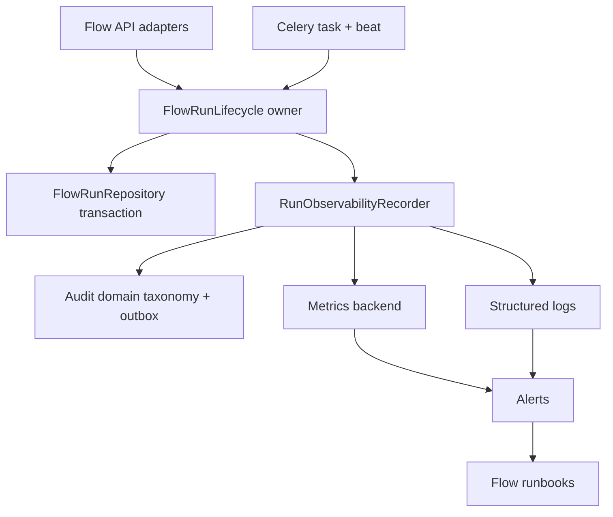

1. Flow run operability is not production-ready: the runtime has useful logs, CAS claims, and stale-running reconciliation, but no metric, alert, dashboard, or runbook contract for the failure modes operators will need first.
2. The canonical owner should be the flow run lifecycle owner proposed by Agent B, with a small typed observability recorder called from that lifecycle path; do not create a generic observability manager or a parallel terminalization path.
3. Terminal-state audit is inconsistent: evidence access fails closed when audit logging fails, normal executor terminal audit fails open with only a warning, and task timeout/reconciliation terminalization currently emits no audit event.
4. Celery queue, beat, async-loop liveness, stale queued redispatch, duplicate starts, crash recovery, and AI Builder turn failures need separate operational contracts because they have different owners, SLOs, and incident playbooks.
5. Overall score is 3/10 because runtime reliability primitives exist, but single-source ownership, audit durability, metric contracts, dashboards, and runbooks are below a supportable production bar.

# Phase 1b Agent L - Observability And Operability

## Inputs And Constraints

Documentation-only review. I did not modify source, tests, migrations, dependencies, generated clients, git, or `docs/refactor/phase1/11-concept-invariants.md`. The only intended output is this file.

Required inputs read: `prompt.md`, `AGENTS.md`, all `docs/engineering/*.md`, all `docs/refactor/phase0/*.md`, `docs/refactor/phase1/README.md`, and Phase 1a outputs `docs/refactor/phase1/01-ai-builder.md` through `docs/refactor/phase1/10-maintainability-interfaces.md`.

Relevant standards:

| Standard | Requirement this review applies |
|---|---|
| `docs/engineering/maintainability-standards.md:36-69` | Identify canonical owners before proposing new abstractions, and avoid creating extra helpers/services unless the boundary earns it. |
| `docs/engineering/maintainability-standards.md:71-85` | Prefer deleting/merging duplicate lifecycle paths over documenting them. |
| `docs/engineering/testing-standard.md:3-12` | Runtime tests should cover retries, idempotency, duplicate starts, crash recovery, terminalization, and API contracts. |

## Claude Peer Review Loop

| Iteration | Result | Artifact | Impact On This Doc |
|---:|---|---|---|
| 1 | `GREEN_LIGHT: no`, minimum score 5 | `.codex/artifacts/claude-peer-loop-phase-1b-agent-l-observability-operability-direction-20260428T184140Z.md` | Accepted. I changed the direction from a prose-only operability contract to a code-level lifecycle owner plus typed observability recorder, split runtime and AI Builder sections, made audit durability an explicit outbox recommendation, added metric labels/units/alerts, and demoted `backend/celerybeat-schedule` to a hygiene item. |
| 2 | `GREEN_LIGHT: yes`, minimum score 7 | `.codex/artifacts/claude-peer-loop-phase-1b-agent-l-observability-operability-verification-20260428T184811Z.md` | Accepted. I fixed the validation command paths, added `call_type` to HTTP metrics, added the missing artifact audit failure metric, clarified the run-start metric phase, and documented the audit category mapping decision for system-driven terminalization. |

## Phase 1a Agreement Resolution

| Topic | Phase 1a agreement | Disagreement or tension | Agent L resolution |
|---|---|---|---|
| Terminalization | Agent B says terminalization is split and proposes one runtime application method (`docs/refactor/phase1/02-flow-runtime.md:53-67`). Agent H repeats that tests should cover worker crash and terminalization (`docs/refactor/phase1/08-tests.md`). | Repeating the same terminalization finding would add noise. | This doc treats Agent B's lifecycle owner as prerequisite and specifies the observability/audit contract that owner must emit. |
| Compatibility deletion | Agents D/E are cautious about shipped API compatibility; Agent B/F prefer deleting pre-production Celery `user_id` task compatibility when no real callers remain. | Operability work must not hide stale payload compatibility forever. | Keep compatibility only with a deletion point: drain existing Celery queues before removing `user_id` task kwargs; track old-payload count as a temporary metric until it reaches zero for one deployment window. |
| Evidence audit | Agent E praises evidence audit fail-closed behavior; Phase 0 flags terminal audit swallow as unresolved. | Evidence access fails closed, but runtime terminalization currently fails open or skips audit. | Evidence/trace access stays fail-closed. Terminalization must not leave runs stuck because audit is unavailable, but it must write a durable audit outbox row in the same terminalization transaction or fail terminalization before changing state. |
| AI Builder telemetry | Agent A documents planner telemetry and dense AI Builder ownership. Agent H wants better high-value tests. | AI Builder turn telemetry is not the same lifecycle as Celery run execution. | Split AI Builder observability into a separate section owned by AI Builder planner/session code; do not route it through flow runtime lifecycle code. |
| Runtime artifacts | Phase 0 records `backend/celerybeat-schedule` as pre-existing dirty state (`docs/refactor/phase0/baseline.md:40`). | This is real hygiene, but not the architectural center. | Treat it as deployment hygiene: ignore or relocate Celery beat schedule state; do not let it distract from audit/metrics/runbook contracts. |

## Current Observability Inventory

| Surface | Current evidence | What works | Gap |
|---|---|---|---|
| JSON logging | `intric.main.logging.ContextJSONFormatter` includes request context and `extra` fields in JSON logs (`backend/src/intric/main/logging.py:16-88`). | Runtime and API code can emit structured log fields without new plumbing. | Flow runtime logs are not governed by a canonical event/field contract, and worker logs lack request context by default. |
| Flow executor logs | Executor logs start, duplicate skip, step start, typed IO errors, step failure, step completion, webhook failure, drift, and checksum mismatch (`backend/src/intric/flows/runtime/executor.py:325-351`, `backend/src/intric/flows/runtime/executor.py:553-631`, `backend/src/intric/flows/runtime/executor.py:1009`, `backend/src/intric/flows/runtime/executor.py:1263`, `backend/src/intric/flows/runtime/executor.py:1436`). | Many lifecycle events are already visible in logs. | Events use message strings as implicit schema; there are no metric counters, histogram units, alert rules, or runbook links. |
| Run status persistence | DB checks constrain run/result/attempt statuses (`backend/src/intric/database/tables/flow_tables.py:397-400`, `backend/src/intric/database/tables/flow_tables.py:503-506`, `backend/src/intric/database/tables/flow_tables.py:570-572`). | Closed state machines make lifecycle metrics finite. | Active/terminal sets are duplicated in service, executor, and repo (`backend/src/intric/flows/application/flow_run_service.py:88-92`, `backend/src/intric/flows/runtime/executor.py:239-243`, `backend/src/intric/flows/infrastructure/flow_run_repo.py:40`). |
| Duplicate start protection | Executor skips terminal runs and only claims queued runs via CAS (`backend/src/intric/flows/runtime/executor.py:331-351`, `backend/src/intric/flows/infrastructure/flow_run_repo.py:420-431`). | Duplicate task delivery is mostly safe. | Duplicate starts are not counted as an operational signal by queue, tenant, flow, or status. |
| Celery dispatch | Queue name is set from settings (`backend/src/intric/main/config.py:299-302`), injected into `CeleryFlowExecutionBackend` (`backend/src/intric/main/container/container.py:709-714`), and logged at dispatch (`backend/src/intric/flows/runtime/celery_execution_backend.py:73-81`). | Dispatch is visible and queue name is centralized enough for current code. | No queue-lag, send-failure, old-payload, or worker-liveness metric contract exists. |
| Celery beat reconciliation | Beat schedules `flows.reconcile_running` every 60 seconds (`backend/src/intric/flows/runtime/celery_app.py:36-41`); task reconciles stale running runs across tenants (`backend/src/intric/flows/runtime/tasks.py:322-370`). | There is a recovery loop for worker crashes. | No beat heartbeat, no alert if beat dies, no audit event, and service-level reconciliation has different behavior (`backend/src/intric/flows/application/flow_run_service.py:655-675`). |
| Task timeout/failure | Task wrapper marks runs failed on missing principal, timeout, or generic task failure (`backend/src/intric/flows/runtime/tasks.py:218-259`, `backend/src/intric/flows/runtime/tasks.py:283-319`). | Runs can be terminalized when task wrapper fails. | These terminalizations bypass executor terminal audit and do not close open attempts. |
| Terminal audit | Executor audits completed and failed terminal states (`backend/src/intric/flows/runtime/executor.py:724-730`, `backend/src/intric/flows/runtime/executor.py:1047-1068`). | Normal executor success/failure can produce audit rows. | Audit failure is swallowed with warning only (`backend/src/intric/flows/runtime/executor.py:1070-1111`); task wrapper and reconciliation paths emit no terminal audit. |
| Evidence audit | Evidence view/export calls `log_flow_trace_audit_or_deny` and returns 503 when audit logging fails (`backend/src/intric/flows/api/flow_run_evidence_router.py:124-135`, `backend/src/intric/flows/api/flow_run_evidence_router.py:236-245`, `backend/src/intric/flows/api/flow_trace_audit.py:37-77`). | Sensitive trace access is fail-closed and documented in endpoint responses (`backend/src/intric/flows/api/flow_run_evidence_router.py:87-93`). | There is no metric/alert for denied evidence access due to audit outage. |
| Artifact audit | Artifact signed URL generation audits `FLOW_RUN_ARTIFACT_DOWNLOADED` before returning URL (`backend/src/intric/flows/api/flow_run_steps_router.py:298-318`). | Artifact access is audited. | The action name says downloaded when the endpoint generated a signed URL; no metric separates signed-url generation from actual file download. |
| Outbound HTTP/audio audit | Runtime HTTP and audio transcription audit helpers fail open with warnings (`backend/src/intric/flows/runtime/http_audit.py:42-93`, `backend/src/intric/flows/runtime/transcription_runtime.py:103-148`). | Runtime side-effects do not fail solely because audit writes fail. | Failure policy is implicit and not classified by sensitive surface or compliance requirement. |
| AI Builder logs/telemetry | Planner logs prompt and turn metrics (`backend/src/intric/flows/ai_builder/ai_builder_planner.py:647-663`, `backend/src/intric/flows/ai_builder/ai_builder_planner.py:725-734`, `backend/src/intric/flows/ai_builder/ai_builder_planner.py:1385-1394`); session telemetry aggregates committed assistant turns only (`backend/src/intric/flows/ai_builder/ai_builder_telemetry.py:1-25`, `backend/src/intric/flows/ai_builder/ai_builder_telemetry.py:160-188`). | Committed-turn telemetry exists and failure logs include safe diagnostics. | Failed/rejected/parse-failed turns are log-only and absent from persisted session aggregates by design. |
| Health dashboards | The server has a detailed crawler health endpoint with ARQ/watchdog metrics (`backend/src/intric/server/main.py:68-168`, `backend/src/intric/server/main.py:568-841`). | There is a good precedent for operator-friendly health responses. | No equivalent flow runtime/Celery health endpoint or dashboard was found. |
| Runbooks | `docs/TROUBLESHOOTING.md` documents generic health checks (`docs/TROUBLESHOOTING.md:31-41`) and worker health for ARQ (`docs/TROUBLESHOOTING.md:92-97`). | General operational docs exist. | No Flow/AI Builder runbooks for stuck queued runs, stuck running runs, audit outage, beat failure, evidence denial, or AI Builder turn failure were found. |
| Runtime artifacts | `backend/celerybeat-schedule` exists as an untracked GNU dbm file and `rg` found no `celerybeat` ignore entry in `.gitignore` or `backend/.gitignore`. | The issue is easy to detect. | Celery beat state can dirty the repo and confuse review/deployment if not ignored or relocated. |

## Target Ownership Model

| Concept | Existing locations | Problem | Canonical home | Merge/delete path |
|---|---|---|---|---|
| Flow run lifecycle emissions | Executor audit/logs, task wrapper failure paths, service reconciliation, routers | Terminal state, audit, metrics, and logs are emitted differently by caller. | The Phase 2 lifecycle owner from Agent B, for example `FlowRunLifecycleService.terminalize_run(command)`, with a small typed `RunObservabilityRecorder` dependency. | Merge service/Celery/executor terminalization into that owner; delete caller-specific audit/log side effects except adapter-level request audit. |
| Audit taxonomy | `ActionType` and `category_mappings` (`backend/src/intric/audit/domain/action_types.py:76-100`, `backend/src/intric/audit/domain/category_mappings.py:73-96`) | Runtime-specific failure sources are not queryable today. | Audit domain owns action names/categories; flow runtime owns typed metadata values and when events are emitted. | Prefer `FLOW_RUN_FAILED` plus typed `metadata.terminalization_source` for run failures; add new `ActionType`s only for distinct user/system actions such as future pause/resume/rerun/review. |
| Terminal audit durability | Executor warning-only audit catch (`backend/src/intric/flows/runtime/executor.py:1089-1111`) and fail-closed evidence audit (`backend/src/intric/flows/api/flow_trace_audit.py:37-77`) | Current policy differs by surface and loses terminal audit rows. | Audit outbox written in the same lifecycle transaction as terminalization; outbox delivery owned by audit infrastructure. | Replace warning-only terminal audit with outbox insert plus delivery metric; if outbox insert fails, terminalization fails before state changes. |
| Flow runtime metrics | No flow metric owner found; crawler health endpoint is separate (`backend/src/intric/server/main.py:68-168`). | Logs are doing metric work informally. | `RunObservabilityRecorder` emits metrics using the existing observability stack selected by platform owners. | Do not add a generic metrics manager; emit typed lifecycle events from one runtime lifecycle boundary. |
| Celery beat/queue health | Celery app, tasks, config, local beat dbm file | Queue, beat, async-loop, and reconciliation health are spread across runtime files. | Flow runtime package owns probes; deployment owns beat state location. | Add flow runtime health probe modeled after crawler health; ignore or relocate `celerybeat-schedule`. |
| AI Builder observability | Planner logs, AI Builder telemetry module, AI Builder router audit | Planner turn lifecycle is not flow run lifecycle. | AI Builder planner/session owner emits its own turn metrics; audit domain owns user action taxonomy. | Do not route AI Builder turn events through flow run lifecycle; add a separate dashboard/runbook section. |

## Proposed Contracts

### 1. Audit Contract

| Event | Owner | Audit action | Required typed metadata | Failure policy | Metric on failure |
|---|---|---|---|---|---|
| Run created by API | `flow_run_execution_router` as HTTP adapter | `FLOW_RUN_CREATED` | `flow_id`, `run_id`, `principal_type`, `idempotency_key_present` | Fail request before dispatch if audit write fails, matching current direct `log_async` behavior (`backend/src/intric/flows/api/flow_run_execution_router.py:188-204`). | `flow_audit_write_failures_total{action="flow_run_created"}` |
| Run completed | `FlowRunLifecycleService.terminalize_run` | `FLOW_RUN_COMPLETED` | `terminalization_source="executor"`, `attempts_closed`, `step_results_terminalized` | Write audit outbox in terminalization transaction; fail before state change if outbox cannot be written. | `flow_terminal_audit_outbox_failures_total{action="flow_run_completed"}` |
| Run failed by executor step failure | Lifecycle owner | `FLOW_RUN_FAILED` | `terminalization_source="step_failure"`, `failure_category`, `step_id`, `step_order`, `celery_task_id` | Same durable outbox policy. | Same, labelled `terminalization_source="step_failure"`. |
| Run failed by task timeout | Lifecycle owner called from `tasks.py` | `FLOW_RUN_FAILED` | `terminalization_source="task_timeout"`, `celery_task_id`, `timeout_seconds` | Same durable outbox policy. | Same, labelled `terminalization_source="task_timeout"`. |
| Run failed by reconciler | Lifecycle owner called from Celery beat and service admin paths | `FLOW_RUN_FAILED` | `terminalization_source="reconciler"`, `stale_age_seconds`, `beat_task_id` if present | Same durable outbox policy. | Same, labelled `terminalization_source="reconciler"`. |
| Run cancelled by user/API | Lifecycle owner called from API adapter | `FLOW_RUN_CANCELLED` | `terminalization_source="user_cancel"`, `principal_type` | Same durable outbox policy unless product explicitly accepts failed cancel on audit outage. | Same, labelled `terminalization_source="user_cancel"`. |
| Evidence viewed/exported | Evidence router | `FLOW_EVIDENCE_VIEWED`, `FLOW_EVIDENCE_EXPORTED_JSON` | `evidence_detail`, `export_reason`, `audit_required=true` | Fail closed with 503 if audit unavailable, preserving current behavior (`backend/src/intric/flows/api/flow_trace_audit.py:59-77`). | `flow_evidence_audit_denied_total{action,detail}` |
| Artifact signed URL generated | Step router | Existing `FLOW_RUN_ARTIFACT_DOWNLOADED` short term | `run_id`, `file_id`, `artifact_name`, `signed_url_ttl_seconds` | Fail request if audit write fails, or rename action in API-maintainer work to distinguish URL generation from download. | `flow_artifact_audit_failures_total` |
| Runtime HTTP outbound call | Runtime HTTP audit helper | `FLOW_HTTP_OUTBOUND_CALL` | `step_id`, `step_order`, `call_type`, `outcome`, `status_code`, `duration_ms`, safe host/path | Fail open because this is post-side-effect audit, but emit failure metric and warning. | `flow_runtime_side_effect_audit_failures_total{side_effect="http"}` |
| Audio transcription audit | Transcription runtime | `FLOW_RUN_AUDIO_TRANSCRIBED` | `step_id`, `files_count`, `model`, `elapsed_ms`, `used_cache` | Fail open with metric because transcription already occurred. | `flow_runtime_side_effect_audit_failures_total{side_effect="audio_transcription"}` |
| Future pause/review/rerun/edit | Future lifecycle owner/API | New ActionTypes from Agent E/F recommendations | `review_state`, `rerun_step_id`, `invalidated_steps`, `edited_output_version` | Must be designed before endpoint/UI work. | Metric names added with the feature. |

Design decision: choose an audit outbox, not log-only durability. Alertable logs are not enough for terminal-state audit because log retention cannot reconstruct a guaranteed audit row after a database hiccup. A queue retry is acceptable only if the team explicitly documents queue durability and what happens when terminalization commits but enqueue fails; the cleaner pre-production choice is one outbox row in the same database transaction as terminalization.

Audit category decision: keep the Phase 2 action-name default narrow (`FLOW_RUN_FAILED` plus typed `terminalization_source`) but make category mapping an explicit audit-domain task. Reconciler, task-timeout, dispatch-failure, and missing-principal terminalization should not silently remain indistinguishable from user-triggered failures in `user_actions` if SIEM/support consumers need a `system_actions` split.

### 2. Structured Log Contract

Every flow runtime lifecycle log emitted by the lifecycle owner or Celery task should use these fields. Message strings can remain human-readable, but dashboards and alerts must key off fields, not string parsing.

| Field | Required for | Notes |
|---|---|---|
| `event` | All new runtime logs | Stable value such as `flow_run_terminalized`, `flow_task_duplicate_start`, `flow_reconciler_tick`. |
| `tenant_id`, `flow_id`, `run_id` | All run-scoped logs | Already present in many executor/task logs, but not consistently via `extra`. |
| `trace_id` | Run lifecycle, evidence, artifact logs | Run table already has `trace_id` (`backend/src/intric/database/tables/flow_tables.py:350`). |
| `principal_type`, `principal_user_id`, `principal_api_key_id` | Dispatch, create, cancel, redispatch | Principal fields are persisted on runs (`backend/src/intric/database/tables/flow_tables.py:328-344`). |
| `celery_task_id`, `queue_name`, `retry_count` | Celery task logs | Task wrapper already has these values (`backend/src/intric/flows/runtime/tasks.py:201-203`, `backend/src/intric/flows/runtime/tasks.py:223-235`). |
| `step_id`, `step_order`, `attempt_no` | Step and attempt logs | Attempt rows persist task id and attempt number (`backend/src/intric/flows/infrastructure/flow_run_repo.py:509-550`). |
| `terminalization_source` | Terminal run logs/audit | Typed enum: `executor`, `step_failure`, `webhook_failure`, `task_timeout`, `task_failure`, `missing_principal`, `reconciler`, `user_cancel`, `dispatch_failure`. |
| `failure_category` | Any failure log | Typed enum, not raw exception text: `validation`, `provider`, `timeout`, `webhook`, `audit`, `storage`, `queue`, `bug`, `cancelled`. |
| `duration_ms` | Step, provider, webhook, AI Builder turns | Numeric milliseconds. |
| `runbook` | Alert-worthy events | Stable slug such as `flows-stuck-running`. |

### 3. Metric And Alert Contract

Metric backend naming must align with the platform's existing stack. If Prometheus/OpenTelemetry is not currently installed for flows, this table is still the acceptance contract for whatever emitter is chosen.

| Metric | Type | Unit | Labels | Alert / SLO | Owner |
|---|---|---:|---|---|---|
| `flow_runs_claimed_total` | Counter | runs | `tenant_id`, `flow_id`, `principal_type`, `queue_name` | Counts successful queued-to-running claims, not API creation or Celery dispatch. Sudden zero for active tenant traffic is dashboard-only until baselines exist. | Flow run lifecycle |
| `flow_runs_terminalized_total` | Counter | runs | `tenant_id`, `flow_id`, `status`, `terminalization_source`, `failure_category` | Any spike in `failure_category="bug"` pages on-call. | Flow run lifecycle |
| `flow_run_duration_seconds` | Histogram | seconds | `tenant_id`, `flow_id`, `status`, `principal_type` | P95 above product SLO for 15 minutes warns. | Flow run lifecycle |
| `flow_step_duration_seconds` | Histogram | seconds | `tenant_id`, `flow_id`, `step_order`, `output_type`, `failure_category` | P95 regression by step type drives dashboard. | Runtime step execution |
| `flow_provider_call_duration_seconds` | Histogram | seconds | `tenant_id`, `model`, `provider`, `step_order`, `outcome` | Provider latency/error spike pages if it blocks run completion. | Step execution runtime |
| `flow_provider_call_failures_total` | Counter | calls | `tenant_id`, `provider`, `model`, `failure_category` | Error rate above threshold for 10 minutes. | Step execution runtime |
| `flow_task_dispatch_total` | Counter | dispatches | `tenant_id`, `flow_id`, `queue_name`, `outcome` | `outcome="failure"` pages if sustained for 5 minutes. | Celery execution backend |
| `flow_task_queue_lag_seconds` | Gauge or histogram | seconds | `queue_name`, `tenant_id` if available | Any queued run older than redispatch threshold plus grace warns. | Flow runtime health |
| `flow_stale_queued_redispatch_total` | Counter | runs | `tenant_id`, `flow_id`, `outcome` | Sustained redispatches indicate worker/beat dispatch issue. | Flow run service |
| `flow_stale_running_reconciled_total` | Counter | runs | `tenant_id`, `terminalization_source="reconciler"` | Any nonzero value pages during business hours until expected rate is known. | Celery beat/runtime |
| `flow_reconciler_last_success_timestamp_seconds` | Gauge | unix seconds | `queue_name` | Missing or stale for >2 beat intervals pages. | Celery beat/runtime |
| `flow_worker_async_loop_alive` | Gauge | boolean | `worker_id`, `queue_name` | Zero for an active worker pages. | Celery task runtime |
| `flow_duplicate_task_start_total` | Counter | tasks | `tenant_id`, `flow_id`, `latest_status`, `queue_name` | Spike indicates Celery redelivery/visibility timeout issue. | Flow run lifecycle |
| `flow_open_attempts_for_terminal_runs` | Gauge | attempts | `tenant_id`, `status` | Any value >0 after reconciliation is a data integrity alert. | Runtime health probe |
| `flow_terminal_audit_outbox_pending` | Gauge | rows | `tenant_id`, `action` | Oldest pending >120 seconds warns; >10 minutes pages. | Audit infrastructure |
| `flow_terminal_audit_outbox_failures_total` | Counter | failures | `tenant_id`, `action`, `terminalization_source` | Any failure pages if terminalization cannot write outbox. | Audit infrastructure |
| `flow_evidence_audit_denied_total` | Counter | requests | `tenant_id`, `action`, `detail` | Any sustained nonzero indicates audit outage affecting support. | Evidence API |
| `flow_artifact_signed_url_total` | Counter | requests | `tenant_id`, `flow_id`, `outcome` | Error spike warns. | Step artifact API |
| `flow_http_outbound_total` | Counter | calls | `tenant_id`, `flow_id`, `step_order`, `call_type`, `outcome`, `status_class`, `denial_reason` | `call_type` distinguishes `input_fetch`, `webhook_delivery`, and `http_test`; SSRF/preflight denial spike warns; failure spike pages if flows depend on HTTP. | HTTP runtime |
| `flow_artifact_audit_failures_total` | Counter | failures | `tenant_id`, `flow_id`, `action`, `file_id_present` | Any sustained nonzero means artifact access is blocked or unaudited, depending on chosen fail policy. | Step artifact API |
| `flow_idempotency_conflicts_total` | Counter | requests | `tenant_id`, `flow_id`, `principal_type` | Spike means API consumers are integrating incorrectly. | Flow run API |
| `flow_tenant_active_runs` | Gauge | runs | `tenant_id` | Near `flow_max_concurrent_runs_per_tenant` for sustained window warns. | Flow run service |
| `ai_builder_turns_total` | Counter | turns | `tenant_id`, `target_kind`, `outcome_kind`, `model` | `parse_failed` or `rejected` spike warns. | AI Builder planner |
| `ai_builder_turn_duration_seconds` | Histogram | seconds | `tenant_id`, `target_kind`, `outcome_kind`, `model` | P95 spike warns. | AI Builder planner |
| `ai_builder_repair_attempts_total` | Counter | attempts | `tenant_id`, `repair_type`, `outcome_kind` | Repair-loop growth warns. | AI Builder planner |
| `ai_builder_sse_disconnect_total` | Counter | streams | `tenant_id`, `target_kind`, `phase` | Spike indicates transport/UI problem. | AI Builder router/dispatcher |

## Findings

### Finding 1: Terminal-State Audit Has No Durable, Consistent Runtime Policy

| Field | Detail |
|---|---|
| Problem | Evidence trace access fails closed when audit logging fails, while flow run terminal audit fails open with a warning or is skipped entirely on task/reconciliation paths. |
| Why it matters | A production incident involving worker timeout, crash recovery, or reconciler failure may leave no audit row for the terminal state, even though that terminal state is exactly what support and compliance need to reconstruct. |
| Evidence | Evidence audit returns 503 on audit failure at `backend/src/intric/flows/api/flow_trace_audit.py:59-77`. Executor terminal audit catches `Exception` and logs a warning at `backend/src/intric/flows/runtime/executor.py:1089-1111`. Task timeout/generic failure calls `_mark_run_failed` at `backend/src/intric/flows/runtime/tasks.py:284-319`, whose implementation only cancels pending steps and updates status at `backend/src/intric/flows/runtime/tasks.py:151-175`. Beat reconciliation fails stale runs at `backend/src/intric/flows/runtime/tasks.py:322-358` without audit. |
| Current owner | Split between executor, task wrapper, service reconciliation, and evidence router. |
| Proposed canonical home | Lifecycle terminalization owner plus audit outbox. Audit domain owns `ActionType`; lifecycle owner emits typed metadata. |
| What to delete or merge | Delete warning-only terminal audit from executor after terminalization owns outbox writes; merge task and beat failure paths into terminalization. |
| Acceptance criteria | Every terminal transition writes or enqueues one audit event with typed `terminalization_source`; outbox insert and status update are in one transaction; double terminalization is idempotent; evidence audit remains fail-closed. |
| Tests required | Worker/runtime integration for task timeout and stale-running reconciliation asserting run terminal state, step/attempt closure, audit outbox row, and metrics. Unit test for audit outbox insert failure proving run status does not change. API test proving evidence access still returns 503 on audit failure. |
| Risk/trade-off | Terminalization can fail if the outbox cannot be written. That is preferable to silently committing a compliance-relevant terminal state with no durable audit path. |
| Human reviewability impact | Reviewers can verify terminal audit behavior in one lifecycle command instead of reading executor, task wrapper, service, and router behavior separately. |
| Confidence | High. |

### Finding 2: Flow Runtime Has Logs, But No Metric/Dashboard Contract

| Field | Detail |
|---|---|
| Problem | The runtime emits many logs, but queue lag, duplicate starts, stale reconciliation, terminalization sources, audit failures, provider latency, and active-run pressure are not defined as metrics with labels, units, or alert thresholds. |
| Why it matters | Operators cannot tell whether a flow is slow because of Celery lag, beat failure, provider latency, duplicate redelivery, audit outage, or a bug without manually correlating logs and database state. |
| Evidence | Dispatch logs queue and run identifiers at `backend/src/intric/flows/runtime/celery_execution_backend.py:73-81`; task logs received execution fields at `backend/src/intric/flows/runtime/tasks.py:223-235`; executor logs run/step events at `backend/src/intric/flows/runtime/executor.py:325-351` and `backend/src/intric/flows/runtime/executor.py:553-631`. A crawler-specific health endpoint already models operational metrics at `backend/src/intric/server/main.py:68-168` and `backend/src/intric/server/main.py:568-841`, but no equivalent flow health endpoint was found. |
| Current owner | Informal logs across runtime modules; no canonical metric owner found. |
| Proposed canonical home | `RunObservabilityRecorder` called by lifecycle and task boundaries, plus a flow runtime health endpoint modeled after the crawler health endpoint. |
| What to delete or merge | Stop treating log message strings as dashboards; metrics must be emitted from typed lifecycle events. |
| Acceptance criteria | Metric table above is implemented or explicitly deferred with owners; each alert has a runbook slug; dashboards show queue, worker, terminalization, audit, provider, evidence, and AI Builder panels separately. |
| Tests required | Metric recorder unit tests for each lifecycle event and labels; runtime integration tests assert metrics on duplicate start, task timeout, reconciler terminalization, evidence audit denial, and provider failure. |
| Risk/trade-off | Metric label cardinality can explode if labels include raw errors or file names. Labels must stay to IDs/status/source/category; raw detail belongs in logs/evidence. |
| Human reviewability impact | Reviewers can approve observability changes against a metric contract instead of debating dashboard shape in each PR. |
| Confidence | High on missing contract; medium on final metric backend names because the platform metric stack needs confirmation. |

### Finding 3: Celery Queue, Beat, And Async Loop Liveness Are Operationally Under-Specified

| Field | Detail |
|---|---|
| Problem | Flow execution depends on a dedicated Celery queue, beat schedule, and process-local async loop, but there is no liveness probe or runbook for any of them. |
| Why it matters | If beat dies, stale running runs can remain stuck. If the worker async loop is closed or the queue backs up, runs can stay queued/running while API health remains green. |
| Evidence | Flow queue settings are `flow_celery_queue`, `celery_visibility_timeout_seconds`, and `flow_task_timeout_seconds` at `backend/src/intric/main/config.py:299-302`. Celery routes and beat schedule live at `backend/src/intric/flows/runtime/celery_app.py:21-41`. The task runtime owns a module-level event loop and daemon thread at `backend/src/intric/flows/runtime/tasks.py:33-59`. Stale-running reconciliation relies on beat task execution at `backend/src/intric/flows/runtime/tasks.py:361-370`. |
| Current owner | Runtime Celery app and tasks, with deployment owning process supervision. |
| Proposed canonical home | Flow runtime health probe plus deployment runbook. |
| What to delete or merge | Merge service and beat stale-running reconciliation into one lifecycle terminalization path; do not preserve separate partial reconciliation behavior. |
| Acceptance criteria | Health probe reports queue name, beat last success, stale queued count/age, stale running count/age, async-loop thread liveness, duplicate-start count, and open attempts for terminal runs. Alerts link to runbooks. |
| Tests required | Unit test for health probe degraded/unhealthy status flags; worker test for beat success timestamp; integration test that stale running reconciliation updates health metrics. |
| Risk/trade-off | Queue introspection may depend on broker-specific Redis/Celery APIs; keep probe best-effort but never hide DB-observable stale run counts. |
| Human reviewability impact | The reviewer can reason about worker readiness from one health contract instead of checking process logs, Redis, and SQL manually. |
| Confidence | High. |

### Finding 4: Crash Recovery Is Partially Idempotent But Not Fully Supportable

| Field | Detail |
|---|---|
| Problem | CAS claiming and attempt upsert protect duplicate starts, but crash recovery does not uniformly close open attempts, emit terminal audit, or surface duplicate delivery. |
| Why it matters | Support may see a failed parent run with `started` attempts that never finished, and there is no alert telling them this happened. Evidence and debug exports consume attempts. |
| Evidence | Run claim uses queued-to-running CAS at `backend/src/intric/flows/infrastructure/flow_run_repo.py:420-431`; attempt creation uses insert-on-conflict at `backend/src/intric/flows/infrastructure/flow_run_repo.py:509-550`. Agent B already found reconciliation does not close open attempts (`docs/refactor/phase1/02-flow-runtime.md:53-67`). Existing tests cover Celery config, task timeout, generic failure, and reconciliation count (`backend/tests/unittests/flows/test_celery_runtime.py:127-153`, `backend/tests/unittests/flows/test_celery_runtime.py:191-295`, `backend/tests/unittests/flows/test_celery_runtime.py:298-346`), and executor terminal audit for normal paths (`backend/tests/unittests/flows/test_flow_executor_runtime.py:3534-3615`). |
| Current owner | Repo primitives plus executor/task callers. |
| Proposed canonical home | Lifecycle terminalization command owns attempts, results, run status, audit, and observability in one transaction boundary. |
| What to delete or merge | Delete partial `fail_stale_running_run` caller paths once terminalization handles stale recovery. |
| Acceptance criteria | No terminal run can have open attempts after reconciliation except documented historical migration rows; duplicate task starts increment metric and return idempotent skip; timeout terminalization records source and task id. |
| Tests required | DB integration test for terminal run with open attempts; duplicate task delivery test asserting metric and no second step execution; crash recovery test asserting evidence remains coherent. |
| Risk/trade-off | Closing attempts during reconciliation needs a policy for preserving completed evidence versus cancelling only active attempts. |
| Human reviewability impact | Incident behavior becomes a small state transition matrix, not a forensic reconstruction. |
| Confidence | High. |

### Finding 5: AI Builder Failed-Turn Telemetry Is Log-Only

| Field | Detail |
|---|---|
| Problem | AI Builder aggregates committed-turn telemetry from persisted assistant messages, but rejected and parse-failed turns are intentionally excluded and live only in structured logs. |
| Why it matters | A production support dashboard cannot answer "Are AI Builder plans failing because of parse errors, repair loops, provider failures, or user cancellations?" without reliable log aggregation and agreed labels. |
| Evidence | `ai_builder_telemetry.py` states failed turns do not appear in `summarize_session_telemetry` and operators must consume structured logs (`backend/src/intric/flows/ai_builder/ai_builder_telemetry.py:1-25`). Planner emits prompt/turn metric logs at `backend/src/intric/flows/ai_builder/ai_builder_planner.py:647-663`, `backend/src/intric/flows/ai_builder/ai_builder_planner.py:725-734`, and `backend/src/intric/flows/ai_builder/ai_builder_planner.py:1385-1394`. Failure diagnostics are emitted around `backend/src/intric/flows/ai_builder/ai_builder_planner.py:1567-1598`. |
| Current owner | AI Builder planner and telemetry modules. |
| Proposed canonical home | AI Builder planner/session observability, separate from flow run lifecycle observability. |
| What to delete or merge | Do not mutate committed-turn session telemetry to include failed turns; add a side-channel metric/event stream as the module docstring already anticipates. |
| Acceptance criteria | AI Builder dashboard exposes total turns, committed turns, rejected turns, parse failures, repair attempts, auxiliary LLM calls, estimated-token usage, SSE disconnects, and plan-apply failures. |
| Tests required | Planner turn tests asserting metrics for success/rejected/parse_failed; router/dispatcher tests for SSE disconnect metric; dashboard contract test if a health endpoint is added. |
| Risk/trade-off | Persisting failed-turn detail can leak unsafe LLM output. Keep metrics categorical and sanitized; detailed diagnostics stay in safe log fields. |
| Human reviewability impact | AI Builder reliability PRs can be reviewed against a planner-specific telemetry contract instead of being mixed into flow execution runtime. |
| Confidence | High. |

### Finding 6: Production Support Docs Are Generic, Not Flow/AI Builder Runbooks

| Field | Detail |
|---|---|
| Problem | The repository has general health docs and crawler-oriented worker health guidance, but no flow-specific runbooks for common incidents. |
| Why it matters | On-call recovery needs exact validation commands, SQL/HTTP probes, rollback steps, and escalation criteria before customers depend on flows. |
| Evidence | `docs/TROUBLESHOOTING.md` documents backend/frontend health checks at `docs/TROUBLESHOOTING.md:31-41` and worker health status semantics at `docs/TROUBLESHOOTING.md:92-97`. Phase 1 README assigns this Agent L output to production operability and incident readiness (`docs/refactor/phase1/README.md:32`). |
| Current owner | General docs only; no flow runtime runbook owner found. |
| Proposed canonical home | Future `docs/runbooks/flows.md` and `docs/runbooks/ai-builder.md`, linked from alerts and dashboards. |
| What to delete or merge | Do not scatter incident steps across Phase docs after implementation; promote the runbook into operator docs. |
| Acceptance criteria | Every alert in the metric table links to a runbook with symptoms, dashboard panels, safe probes, recovery actions, rollback, and escalation. |
| Tests required | Documentation lint/link check; if health endpoints are added, API tests for status flags used by runbooks. |
| Risk/trade-off | Runbooks can drift. Keep them tied to stable metric names and validation commands, not internal code paths. |
| Human reviewability impact | Reviewers can verify support readiness as a checklist instead of reading prose claims. |
| Confidence | High. |

## Required Runbooks

| Runbook | Trigger | First checks | Safe recovery | Escalation |
|---|---|---|---|---|
| `flows-stuck-queued` | `flow_task_queue_lag_seconds` above threshold or stale queued count >0 | Check queue name, worker count, dispatch failures, recent `flow_stale_queued_redispatch_total`. | Use API redispatch for a specific stale queued run after verifying idempotency; do not manually edit DB. | Page runtime owner if redispatch fails or queue lag keeps growing. |
| `flows-stuck-running` | stale running count >0 or reconciler failure | Check beat liveness, last reconciler success, open attempts, provider latency. | Let canonical reconciler terminalize; if disabled, run documented admin reconciliation command once. | Page runtime owner for repeated reconciliations or open attempts after terminalization. |
| `flows-terminal-audit-outbox-backed-up` | oldest outbox row >120 seconds | Check audit DB, outbox worker, action distribution, terminalization sources. | Restart outbox worker or retry delivery; do not re-terminalize runs. | Page audit/platform owner if backlog exceeds SLO. |
| `flows-evidence-audit-denied` | evidence audit denial count nonzero | Check audit service availability and evidence endpoint 503s. | Restore audit service; retry evidence access. | Page audit owner; evidence should remain fail-closed. |
| `flows-beat-not-running` | reconciler last success stale >2 beat intervals | Check Celery beat process and `backend/celerybeat-schedule` location/permissions. | Restart beat with schedule file outside repo or ignored path. | Page platform/runtime owner if stale running count is growing. |
| `flows-provider-regression` | provider latency/failure spike | Check provider/model labels, error categories, tenant scope. | Fail affected runs normally; avoid global retries without idempotency review. | Page provider/integration owner if cross-tenant. |
| `flows-http-webhook-failures` | outbound/webhook failure spike | Check status class, denial reason, timeout/connect categories. | Fix endpoint config or tenant networking; do not bypass SSRF guards. | Page runtime/security owner for SSRF/preflight anomalies. |
| `ai-builder-turn-failures` | rejected/parse_failed/repair attempts spike | Check model, prompt hash, failure fingerprint, recent deploys. | Roll back planner prompt/schema change or pin model if provider regression. | Page AI Builder owner for repeated fingerprints. |
| `flow-artifact-access-failures` | artifact signed-url errors or audit failures | Check file existence, retention, audit service, signed URL TTL. | Regenerate signed URL after audit succeeds; do not bypass artifact authorization. | Page storage/audit owner. |

## Validation Commands

Use these after implementation work. This Agent L pass did not run validation suites because it is documentation-only and the baseline is already recorded in Phase 0/1 docs.

| Command | Purpose | Expected use |
|---|---|---|
| `cd backend && uv run pyright` | Backend type safety, especially typed lifecycle/audit contracts. | Must pass before implementation PR. |
| `cd backend && uv run ruff check --no-fix src/intric/flows tests/unittests/flows tests/integration/flows` | Flow-scoped lint baseline. | Phase 1 README records current import-order failures; implementation should not add more. |
| `cd backend && ./.venv/bin/python -m pytest tests/unittests/flows/test_celery_runtime.py` | Celery config/task/reconciliation tests. | Extend for beat liveness and metrics. |
| `cd backend && ./.venv/bin/python -m pytest tests/unittests/flows/test_flow_executor_runtime.py` | Executor lifecycle and terminal audit behavior. | Extend for observability recorder and outbox failure. |
| `cd backend && ./.venv/bin/python -m pytest tests/integration/flows/test_flow_run_repository.py` | Repository CAS/idempotency/attempt invariants. | Extend for open attempts on terminal runs. |
| `cd backend && ./.venv/bin/python -m pytest tests/unittests/flows/test_flow_router.py` | API audit/evidence/artifact behavior. | Extend for evidence denial metric and artifact audit naming. |
| `pnpm -C frontend check` | Generated type/frontend contract drift. | Phase 0 records existing repo-wide failures; do not add Flow/AI Builder diagnostics. |
| `pnpm -C frontend/apps/web test:unit -- --run` | Frontend runtime/AI Builder UI behavior. | Add once dashboards/status helpers are implemented. |

## Acceptance Criteria For Phase 2 Implementation

- [ ] One lifecycle terminalization owner handles executor success/failure, user cancellation, task timeout/failure, dispatch failure, stale-running reconciliation, and future pause/rerun terminal semantics.
- [ ] Terminalization writes run status, step result terminal states, open attempt closure, typed audit outbox row, structured log event, and lifecycle metric from one transaction-aware path.
- [ ] Terminal audit failure is no longer warning-only; either the outbox row exists or terminalization fails before mutating state.
- [ ] Evidence access remains fail-closed on audit failure and emits denial metrics.
- [ ] Metric names, labels, units, and alert thresholds are implemented from the contract table or explicitly revised in one ADR.
- [ ] Flow runtime health endpoint reports queue, beat, async-loop, stale queued/running, duplicate-start, open-attempt, and audit-outbox signals.
- [ ] AI Builder failed-turn metrics are emitted through a planner-owned side channel without polluting committed-turn session telemetry.
- [ ] Runbooks exist for every alert and include safe probes/recovery steps.
- [ ] `backend/celerybeat-schedule` is ignored or Celery beat is configured to write schedule state outside the repository.
- [ ] Tests cover duplicate start metrics, task timeout terminal audit, stale-running reconciliation audit, audit outbox failure, evidence audit denial, and AI Builder parse/rejection telemetry.

## Non-Goals

- Do not build a generic `ObservabilityManager`, `MetricsManager`, or broad service layer.
- Do not add frontend pause/rerun/review UI before backend lifecycle states, audit actions, and runbook contracts exist.
- Do not make arbitrary LLM output fully typed; only platform-owned metadata, lifecycle, evidence, and telemetry fields need typed contracts.
- Do not make evidence access fail open for operator convenience.
- Do not preserve old Celery `user_id` task payload compatibility without a queue-drain metric and deletion point.

## Risks And Trade-Offs

| Risk | Trade-off | Mitigation |
|---|---|---|
| Outbox adds a new durable component. | Strong audit correctness costs more than warning-only logs. | Keep outbox narrow: terminal run audit first; expand only after proven. |
| Terminalization can fail during audit outage. | Prevents silent terminal states but may leave runs queued/running longer. | Health alert on outbox failure and runbook for restoring audit DB; do not mutate state without outbox. |
| Metrics add cardinality. | Operators need labels to diagnose incidents. | Ban raw exception, prompt, file name, URL, and user text labels. Use IDs/status/source/category. |
| Health probe may depend on Celery/Redis internals. | Queue/beat liveness is necessary for supportability. | Combine broker probes with DB-observable stale counts so probe still degrades usefully. |
| AI Builder failed-turn side channel duplicates some log data. | Dashboards cannot depend on ad hoc log aggregation alone. | Emit categorical sanitized metrics only; logs keep details. |

## Human Reviewability Impact

The main reviewability improvement is locality. Today a reviewer must inspect API routers, `FlowRunService`, `FlowRunExecutor`, task wrapper failure paths, repo status methods, audit helpers, and tests to answer whether a run terminal state is observable. With the proposed ownership model, reviewers inspect one lifecycle command and one recorder contract. Metric and runbook tables turn observability from "did we log something?" into a finite acceptance checklist.

The reviewability risk is introducing an unearned abstraction. The recorder is justified only if it is called from a real lifecycle boundary and carries a smaller interface than the scattered audit/log/metric behavior it replaces. A generic manager without lifecycle ownership would violate `docs/engineering/maintainability-standards.md:51-69`.

## Final 10-Dimension Scorecard

| Dimension | Score | Rationale |
|---|---:|---|
| Maintainability | 4 | Strong runtime primitives exist, but observability ownership is scattered across executor, tasks, services, and routers. |
| Code Quality | 5 | Logs are structured-capable and many runtime events exist, but message strings act as implicit contracts. |
| Clean Architecture | 4 | Audit domain owns taxonomy, but runtime terminal audit policy leaks into executor/task details instead of a lifecycle boundary. |
| Separation of Concerns | 4 | Runtime lifecycle, Celery operations, evidence access, and AI Builder turns are currently mixed by incident need rather than owner. |
| Single Source of Truth | 3 | Terminal status/audit/reconciliation behavior has multiple owners; metrics and runbooks have none. |
| Human Readability | 5 | Existing logs are understandable, but operators must reconstruct behavior from several files. |
| Runtime Reliability And Idempotency | 4 | CAS claim and attempt upsert are good, but crash recovery and audit durability are incomplete. |
| API Consumer DX | 5 | Evidence fail-closed behavior is clear; flow status incidents and idempotency conflicts are not observable to consumers beyond polling. |
| API Maintainer DX | 4 | Routers emit audit directly and runtime emits audit elsewhere, making policy changes hard to review. |
| Testability | 4 | Useful tests exist for Celery and executor paths, but missing tests target exactly the production-support gaps: outbox failure, metrics, stale recovery with attempts, and audit denial metrics. |

Overall score: 3/10, the minimum dimension score. Refactor required before relying on Flows/AI Builder as a production-supportable customer workflow engine.
