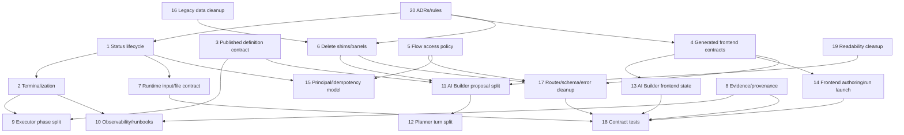

# Phase 2 Synthesis

TL;DR:
1. The flow system is usable for the current pre-production happy path, but it is not ready for more lifecycle features until canonical ownership is fixed.
2. The limiting risks are duplicated status lifecycles, unversioned JSONB contracts at runtime boundaries, split terminalization/audit behavior, manual frontend/backend type mirrors, and compatibility paths without deletion gates.
3. The first refactor should be deletion and ownership work, not new feature work: kill shims, name canonical status/definition/access/input/evidence owners, and make generated API types the frontend contract.
4. The highest-risk feature gap is human-in-the-loop pause-and-edit because it touches DB state, runtime crash recovery, permissions, audit, API contracts, frontend state, and evidence semantics at once.
5. Overall current-state score is 3/10; refactor required before broad Flow/AI Builder feature expansion.

## Rating

| Dimension | Score | One-sentence justification |
|---|---:|---|
| Maintainability | 4 | Entry points exist, but reviewers must reconstruct ownership across routers, services, runtime modules, frontend controllers, shims, and generated/manual types. |
| Code Quality | 5 | Many focused modules are solid, especially capability and runtime input helpers, but large lifecycle functions and broad JSON/type escape hatches dominate change paths. |
| Clean Architecture | 4 | Routers and adapters are often thin enough, but AI Builder router/service paths and flow runtime terminalization leak application policy across HTTP, Celery, audit, and UI assumptions. |
| Separation of Concerns | 3 | `FlowRunExecutor.execute`, `AIBuilderProposalProcessor`, `FlowAIBuilderDriver`/Service, and `FlowRunDialog` each own multiple lifecycle phases at once. |
| Single Source of Truth | 3 | Statuses, flow definition JSON, API types, evidence/provenance, file mapping, access policy, and compatibility imports all have parallel owners. |
| Human Readability | 4 | The code has useful intent comments, but week-one comprehension fails in the large planner/runtime/frontend/test hotspots and in misleading compatibility names. |
| Runtime Reliability | 3 | CAS claim and stale-running reconciliation exist, but terminalization, open attempts, audit behavior, metrics, and crash recovery are not one owned invariant. |
| API Consumer DX | 4 | Basic list/contract/upload/run/poll/evidence journeys exist, while per-step file intent, pause/review/resume/rerun, generated client types, and evidence download semantics are incomplete. |
| API Maintainer DX | 5 | Operation tests and error models exist, but permission checks, router aggregation, schema ownership, OpenAPI surgery, and generated-client impact are too scattered. |
| Testability | 3 | Flow tests collect and there is broad unit coverage, but the high-value API-plus-worker contract, frontend journeys, and migration/contract tests are missing or buried in very large files. |

Overall score: 3/10, the minimum dimension score. The score reflects current architecture, not the proposed plan.

## Agreements And Disagreements

| Reviewer / Source | Agreement | Disagreement Or Refinement | Synthesis Decision |
|---|---|---|---|
| Phase 0 Claude challenge | Agreed that closed status constraints and published definition JSON are Phase 0 invariants before any feature-gap planning. | Refined Claude's first `FlowVersions.definition_json` claim because `schema_version` is embedded in JSON at `backend/src/intric/flows/application/flow_service.py:686-697`, but not first-class in the DB table at `backend/src/intric/database/tables/flow_tables.py:231-253`. | Keep the refined finding: embedded version exists, but the canonical contract owner and first-class migration story do not. |
| Agent A, AI Builder | Agreed that proposal processing, planner turns, router SSE wrapping, frontend Driver/Service state, and protocol duplication are the AI Builder center of gravity (`docs/refactor/phase1/01-ai-builder.md:1-8`). | Agent A keeps several LLM-boundary repair paths as legitimate hardening, while dead-code review is more aggressive about compatibility deletion. | Preserve LLM-boundary repair only when it has typed failure modes, telemetry, and tests; delete compatibility paths that exist only for tests or old callers. |
| Agent B, runtime | Agreed terminalization and status lifecycle are the top runtime risks (`docs/refactor/phase1/02-flow-runtime.md:1-8`). | Agent B proposes status semantics on enums; Agent K adds a narrow lifecycle projection module. | Use `enums.py` for labels and a new lifecycle projection module for active/terminal/cancellable/retryable/human-waiting semantics. |
| Agent C, frontend | Agreed manual flow type islands and AI Builder state mirroring are the top frontend risks (`docs/refactor/phase1/03-frontend.md:1-8`). | Agent C prefers `FlowAIBuilderService.svelte.ts` as state owner, while noting Driver-as-owner is possible. | Choose Service-as-Svelte-state-owner and demote Driver to transport/SSE decoding because it fits Svelte 5 state ownership and reduces mirrored state. |
| Agent D, deletion | Agreed pure shims, unused aliases, and router callable re-exports should be deleted, but public and persisted compatibility requires migration gates (`docs/refactor/phase1/04-dead-and-legacy.md:1-8`). | Deletion cannot be source-only for `file_ids`, DOCX `template_file_id`, form field type normalization, or principal `user_id`. | Split kill list into immediate import-only cleanup, API migration cleanup, and DB-shape cleanup. |
| Agent E, API consumer | Agreed the happy path is present but advanced workflow contracts are not first-class (`docs/refactor/phase1/05-api-consumer.md:1-8`). | Agent E says per-step file mapping is partly present, not absent. | Treat per-step file mapping as contract hardening and intent expansion, not a greenfield feature. |
| Agent F, data model | Agreed JSONB itself is not the issue; unowned JSONB boundary contracts are the issue (`docs/refactor/phase1/06-data-model.md:1-8`). | Agent F leans toward first-class tables for several concepts; Agent E/J keep some payload contracts for near-term pragmatism. | Version and parse JSON payloads first; introduce first-class tables only for concepts that need queryability, audit, or lifecycle transitions. |
| Agent G, readability | Agreed not all comments are bad; the problem is large lifecycle code and comments compensating for unclear ownership (`docs/refactor/phase1/07-comments-readability.md:1-8`). | Specialty-language cleanup is broader than comments because it touches product defaults and tests. | Bundle specialty-language scrub into readability/deletion PRD, with product review for user-visible defaults. |
| Agent H, tests | Agreed backend tests are large and unit-heavy; the missing API-plus-worker contract is the most important gap (`docs/refactor/phase1/08-tests.md:1-8`). | Agent H correctly rejects speculative tests for pause/rerun before canonical runtime states exist. | Add runtime/API contract tests after ownership work, not before feature states exist. |
| Agent I, API maintainer | Agreed authorization and error helpers are close to canonical but split across normal routes and AI Builder (`docs/refactor/phase1/09-api-maintainer.md:1-8`). | Agent I is less aggressive than deletion review on router aggregation because some aggregation may encode consumer groupings. | Keep one assembly layer if it only includes routers; delete endpoint callable re-exports and duplicated helpers. |
| Agent J, interfaces | Agreed deep modules like capability manifest and runtime input normalization should be preserved (`docs/refactor/phase1/10-maintainability-interfaces.md:1-8`). | Agent J distinguishes structural-view protocols from callable one-method Protocol ceremony. | Preserve real external seams and structural views with domain names; replace one-method callable Protocol classes with callables or concrete collaborators. |
| Agent K, concept invariants | Agreed Single Source of Truth is the core cross-cutting problem and names canonical homes (`docs/refactor/phase1/11-concept-invariants.md:1-8`). | Some proposed new modules risk becoming new ceremony. | Accept narrow modules only where they own a real cross-cutting invariant: status lifecycle, published definition contract, access policy. |
| Agent L, observability | Agreed operability is not production-ready and must hang off the lifecycle owner, not a generic manager (`docs/refactor/phase1/12-observability-operability.md:1-8`). | Audit outbox adds data-model work and might slow terminalization. | Use durable audit/outbox for terminal state; terminalization must not silently skip audit without a durable retry signal. |

## Top 20 Highest-ROI Changes

| Rank | Change | Problem | Proposed Change | Files Affected | Effort | Risk | Dependencies | Why This Improves Maintainability |
|---:|---|---|---|---|---|---|---|---|
| 1 | Canonicalize status lifecycle | Status labels and lifecycle classes are copied in enums, DB checks, services, runtime, generated/manual TS, and frontend helpers. | Keep labels in `backend/src/intric/flows/enums.py`; add `domain/flow_status_lifecycle.py`; parity-test or generate DB/API/frontend projections. | `enums.py`, `flow_tables.py`, `flow_run_service.py`, `executor.py`, `resources.d.ts`, flow status helpers | M | Medium | none | Every future pause/review/rerun/status change has one semantic owner. |
| 2 | Canonical terminalization | Completion, cancellation, task timeout, dispatch failure, service reconciliation, and beat reconciliation terminalize different subsets. | Add `FlowRunTerminalizationCommand` owned by runtime/application; update run, results, attempts, audit/outbox, and observability in one idempotent path. | `flow_run_service.py`, `executor.py`, `tasks.py`, `flow_run_repo.py`, audit modules | L | High | status lifecycle | Crash recovery and incident behavior become reviewable in one path. |
| 3 | Version published flow definitions | `definition_json` is immutable but parsed as broad JSON in runtime while built in `FlowService`. | Add `domain/flow_definition.py` with `PublishedFlowDefinitionV1`, parser/writer, version policy, checksum input; add first-class `schema_version` column. | `flow_tables.py`, `flow_service.py`, `step_definition_parser.py`, `executor.py`, migrations | L | Medium-high | status lifecycle optional | Old runs and new definitions can evolve without hidden JSON conventions. |
| 4 | Make generated OpenAPI types canonical on frontend | `resources.d.ts`, `flows.js`, and AI Builder `protocol.ts` duplicate generated schema shapes. | Use `schema.d.ts` aliases for HTTP contracts; keep only narrow UI-intent and SSE decoder types; type `flows.js` wrappers against operations. | `schema.d.ts`, `resources.d.ts`, `flows.js`, `protocol.ts`, frontend flow code | M | Medium | API schema cleanup | Removes the frontend/backend contract drift that causes broad records and casts. |
| 5 | Create canonical flow access policy | Normal flow routes and AI Builder implement separate scope/edit/session permission helpers. | Add typed `FlowApiAction`/policy helpers; keep `FlowPrincipal` as identity owner; fold AI Builder scope checks into policy. | `flow_api_common.py`, `flow_router_common.py`, `ai_builder_router.py`, `principal.py` | M | Medium | status optional | API maintainers get one permission playbook and fewer route-local shims. |
| 6 | Delete shim/barrel import paths | Pre-production compatibility modules obscure canonical homes and some mutate behavior. | Rewrite imports to concrete modules, update import-linter, delete `flow*.py` shims and `ai_builder_models.py`. | `backend/src/intric/flows/flow*.py`, `ai_builder_models.py`, importers, tests | M | Medium | none | New reviewers stop chasing false owners. |
| 7 | Harden runtime input/file contract | Per-step `StepRunInput` exists but only carries `file_ids`; top-level `file_ids` remains public compatibility. | Extend step-scoped file association contract, normalize one payload, document/deprecate top-level `file_ids`, later consider first-class table. | `flow_models.py`, `flow_run_step_inputs.py`, `step_input_resolution.py`, `flows.js`, `FlowRunDialog.svelte` | M | Medium-high | generated types | API consumers can map files deterministically and retries use one normalized payload. |
| 8 | Type evidence/provenance/redaction contracts | Evidence modules exist but provenance and snapshots remain broad dicts. | Add `FlowAttemptProvenanceV1`, typed evidence/export schemas, redaction manifest, and audit behavior tests. | `flow_run_evidence*.py`, `flow_run_provenance.py`, `flow_models.py`, evidence frontend | M | Medium | generated types | Support/compliance traces become stable and typed without over-typing arbitrary model output. |
| 9 | Split runtime executor by named phases | `execute` owns claim, parse, snapshot checks, step loop, error handling, persistence, and terminalization. | Keep concrete executor, split into phase functions with typed inputs/outputs and transaction boundaries. | `runtime/executor.py`, `step_execution_runtime.py`, tests | L | Medium | terminalization | Runtime changes become localized by lifecycle phase. |
| 10 | Add observability recorder and runbooks | Logs exist but metrics, alerts, dashboards, beat liveness, and runbooks are absent. | Add typed recorder called by lifecycle/task boundaries, audit outbox metrics, health/readiness checks, runbooks for stuck queued/running/audit outage. | runtime, Celery app/tasks, audit, docs/runbooks | M | Medium | terminalization | Operators get stable signals and incidents do not require reading code. |
| 11 | Split AI Builder proposal processor | One class mixes tool-call transport, create/edit processing, repair, persistence, and events. | Split into proposal transport/retry, create processor, edit processor, repair policy, and plan persistence/event adapter. | `ai_builder_proposal_processor.py`, create/edit modules, tests | XL | Medium-high | generated types optional | AI Builder changes stop crossing unrelated create/edit/repair paths. |
| 12 | Split AI Builder planner turn ownership | `send_message` owns lock, prompt prep, planning-state rebuild, LLM turn, telemetry, events, commits. | Add `AIBuilderPlannerTurn`/active turn context owning lock/commit/error semantics; keep prompt prep/event presentation subordinate. | `ai_builder_planner.py`, `ai_builder_planner_turn.py`, repo/service/router | XL | High | proposal split optional | Planner reliability becomes one explicit use case rather than a large script. |
| 13 | Choose one AI Builder frontend state owner | Driver and Service mirror state. | Make `FlowAIBuilderService.svelte.ts` Svelte state owner; demote Driver to transport/SSE decoder/pure reducers. | `FlowAIBuilderDriver.ts`, `FlowAIBuilderService.svelte.ts`, AI Builder components/tests | L | Medium | generated types | Frontend state changes have one owner and fewer sync effects. |
| 14 | Deepen frontend authoring/run-launch owners | Route, `FlowEditor`, panels, dialogs, helpers, and AI Builder callbacks mutate related state. | Make `FlowEditor` authoring session owner; extract `FlowRunLaunchSession`; keep pure helpers. | `FlowEditor.ts`, `+page.svelte`, `FlowRunDialog.svelte`, edit panels | L | Medium-high | generated types | Components render commands instead of owning domain orchestration. |
| 15 | Clean principal/idempotency data model | `FlowRuns.user_id` coexists with principal columns; idempotency lacks retention semantics. | Drop or mark historical `user_id` after migration, define idempotency retention and fingerprint source. | `flow_tables.py`, `principal.py`, `flow_run_repo.py`, migrations | M | High | access policy | Authorization and retry behavior become explicit and auditable. |
| 16 | Migrate template/form legacy rows then delete fallbacks | `template_file_id`, form type normalization, and mirrored input cleanup preserve old row shapes. | Backfill/prove zero old rows, delete backend/frontend fallbacks and compatibility tests. | `flow_service.py`, `flow_file_upload_service.py`, `templateFillConfig.ts`, `FlowEditor.ts`, migrations | L | High | deletion PRD | Hidden cleanup effects move into explicit migrations. |
| 17 | Simplify router/schema/error ownership | Router aggregators re-export callables, error helpers duplicate, evidence export response shape conflicts. | Keep leaf routers as owners, delete callable re-exports, centralize `GeneralError` examples, align evidence export response/download contract. | `flow_*_router.py`, `flow_models.py`, `exception_handlers.py`, OpenAPI tests | M | Medium | generated types | API changes become reviewable by endpoint owner and generated-client impact. |
| 18 | Add high-value contract tests and split hotspots | Tests are broad but miss API-plus-worker contract and frontend journeys; huge tests hide behavior. | Add worker runtime contract, API consumer contract, frontend AI Builder/runtime journeys; split 3k LOC tests by lifecycle. | backend flow tests, frontend flow tests, Playwright | L | Medium | first ownership PRDs | Tests protect behavior at real seams instead of internal collaborators. |
| 19 | Readability/domain-neutrality cleanup | Long functions and comments hide ownership; general frontend starter leaks `beslutsunderlag` specialty language. | Extract named phases only where they become documentation; scrub specialty defaults; delete restating comments with code moves. | `ai_builder_planner.py`, `executor.py`, `FlowEditor.ts`, tests/prompts | M | Low-medium | AI Builder/frontend PRDs | Week-one comprehension improves without adding comments as bandages. |
| 20 | Write ADRs and enforce rules | Future agents can reintroduce shims, JSONB bags, fake interfaces, and broad catches. | Add ADR backlog, proposed AGENTS additions, Codex rules for imports/types/interfaces/JSONB/Celery payloads. | docs/refactor/phase5, AGENTS proposal docs | S | Low | synthesis/PRDs | Maintains the refactor direction after this review. |

## Dependency Graph

## Feature-Gap Sketches

### Per-Step File Mapping

| Layer | Delta |
|---|---|
| Data model | Short term: enrich `StepRunInput` rather than invent a parallel request. Medium term: introduce `flow_run_step_input_files` only if operators need queryable per-file roles/audit beyond `input_payload_json`. Current schema is `StepRunInput.file_ids` at `backend/src/intric/flows/api/flow_models.py:410-411`; legacy top-level `file_ids` remains at `backend/src/intric/flows/api/flow_models.py:431-434`. |
| Runtime | Keep `flow_run_step_inputs.py` as submission normalizer and `step_input_resolution.py` as execution resolver. Add one canonical `normalize_step_file_associations` output consumed by idempotency fingerprinting and runtime resolution. |
| API | Extend `StepRunInput` to support typed file associations if needed: `{file_id, role, label, required}`. Deprecate top-level `file_ids` with a date/usage gate. Generated `intric-js` wrapper must prefer `step_inputs`. |
| Frontend | `FlowRunLaunchSession` owns file selection and maps files to step IDs. `flowRunContract.ts` remains a pure adapter but uses generated types. |
| Permission | Upload policy validates principal and step ownership before run creation; service keys can only attach files scoped to the flow/tenant. |
| Audit | Audit run creation with normalized step-file mapping metadata counts, not raw file names. Artifact/file access remains separately audited. |
| Tests | API contract: upload files to multiple steps, create run with step inputs, reject wrong step/file owner, idempotency conflict with changed mapping. Runtime resolver: each step gets only mapped files. Frontend component: file-to-step assignment survives submit. |
| Risks | Supporting both top-level `file_ids` and step-scoped mapping creates dual input shapes. Mitigation: canonical internal normalization plus deprecation telemetry and deletion PRD. |

### Step-Level Execution And Rerun

| Layer | Delta |
|---|---|
| Data model | Add result generation/version or rerun lineage. `FlowStepResults` currently stores one current row per `(flow_run_id, step_id)` at `backend/src/intric/database/tables/flow_tables.py:519-520`; attempts already preserve attempt history at `backend/src/intric/database/tables/flow_tables.py:528-599`. Rerun needs downstream invalidation metadata and audit reason. |
| Runtime | Add a subgraph executor command that starts at a completed step, invalidates or supersedes downstream results, records new attempts, and never reuses stale downstream evidence. Do not reuse stale queued redispatch semantics. |
| API | Add a narrow endpoint such as `POST /flows/{id}/runs/{run_id}/steps/{step_id}/rerun/` with body `{mode, reason, idempotency_key}`. Do not create generic `RunControl`. |
| Frontend | Step card exposes rerun only when generated status/lifecycle projection says rerunnable. UI must display downstream invalidation before submitting. |
| Permission | Require `flow.run` plus a rerun-specific permission if rerun can alter evidence or regulated output. Service-key behavior must be explicit. |
| Audit | Emit `FLOW_RUN_STEP_RERUN_REQUESTED`, `FLOW_RUN_STEP_RERUN_STARTED`, and terminal events with old/new attempt IDs and invalidated downstream step IDs. |
| Tests | Worker contract: rerun one completed step, downstream invalidated, attempts recorded, idempotent duplicate request returns same rerun operation. API tests for permission, terminal-run constraints, and invalid step ID. Frontend component/E2E for confirmation and status. |
| Risks | Highest data/runtimes risk after pause-edit. Downstream invalidation rules can corrupt evidence if not explicit. Implement only after status lifecycle, terminalization, and evidence provenance owners exist. |

### Human-In-The-Loop Pause And Edit

| Layer | Delta |
|---|---|
| Data model | Add explicit human-waiting statuses or checkpoint table, not optional booleans. Status values are currently closed in enums at `backend/src/intric/flows/enums.py:64-85` and DB checks at `backend/src/intric/database/tables/flow_tables.py:397-400`, `:503-506`, `:570-572`. Add `flow_run_review_checkpoints` or equivalent with reviewer, editable payload, original output, edited output, decision, timestamps, and schema version. |
| Runtime | Executor persists a checkpoint and terminalizes the active phase as `waiting_for_review` without losing attempts. Resume command must be idempotent, validate the checkpoint version, and continue from the correct next step. |
| API | Add checkpoint discovery, edit draft, approve/reject/resume endpoints. Keep review/edit/resume separate from cancel/redispatch/rerun. Use generated schemas and typed errors for stale checkpoint, already resumed, and unauthorized edit. |
| Frontend | Evidence/step output editor becomes a review checkpoint UI owned by a run-review session, not by generic `FlowRunDialog` or evidence display components. |
| Permission | Add `flow.review` and possibly `flow.resume`; decide whether `flow.run` implies review for service keys. AI Builder edit permission must not automatically grant run review. |
| Audit | Every checkpoint open, edit, approve, reject, and resume is audited. Evidence export must show original vs edited output and reviewer identity according to redaction policy. |
| Tests | DB migration/status parity tests, runtime pause/resume integration, duplicate resume idempotency, API stale-edit conflict, permission matrix, audit rows, evidence export original/edited trace, frontend journey. |
| Risks | This is the highest-risk proposed change because it touches every weakest area: statuses, terminalization, audit, evidence, permissions, frontend state, and generated types. It must wait until PRD-001 through PRD-004 foundations land. |

## Single Source Of Truth Map

| Concept | Current Locations | Canonical Home | Deprecation Path |
|---|---|---|---|
| Status lifecycle | `enums.py`, DB checks in `flow_tables.py`, service/executor/repo terminal sets, `resources.d.ts`, frontend helpers | `enums.py` plus `domain/flow_status_lifecycle.py` | Add parity tests, migrate helpers, delete duplicated sets. |
| Published flow definition | `flow_versions.definition_json`, `FlowService._build_definition`, `runtime/step_definition_parser.py`, executor schema check | `domain/flow_definition.py` | Add parser/writer/schema version column, migrate runtime/publication. |
| Runtime terminalization | `FlowRunExecutor`, `FlowRunService`, `tasks.py`, repositories, audit helpers | `FlowRunTerminalizationCommand` in application/runtime boundary | Merge reconciliation/cancel/failure paths, delete partial terminalizers. |
| Principal/access policy | `principal.py`, `flow_api_common.py`, `flow_router_common.py`, `ai_builder_router.py`, DB principal columns | `FlowPrincipal` plus `api/flow_access_policy.py` | Replace string access names/local scope checks, drop legacy `user_id`. |
| Runtime file mapping | `flow_models.py`, `flow_run_step_inputs.py`, `step_input_resolution.py`, `flows.js`, `FlowRunDialog` | `flow_run_step_inputs.py` for submission and `step_input_resolution.py` for execution | Normalize step-scoped payload, deprecate top-level `file_ids`. |
| Evidence/provenance | `flow_run_evidence_bundle.py`, `flow_run_evidence.py`, `flow_run_export_json.py`, `flow_run_provenance.py`, `FlowRunEvidence.svelte` | Evidence bundle/provenance/redaction modules with typed API schemas | Add versioned provenance and generated frontend types. |
| API schemas | `flow_models.py`, `ai_builder_api_models.py`, global OpenAPI postprocessing, `resources.d.ts`, `flows.js` | Backend Pydantic/OpenAPI and generated `schema.d.ts` | Delete manual duplicates, align evidence export response/download. |
| AI Builder plan/session state | backend domain/API/event models, `ai_builder_models.py`, frontend `protocol.ts`, Driver/Service | Backend concrete model modules plus frontend generated aliases/SSE decoder | Delete star barrel and manual HTTP protocol mirrors. |
| Frontend authoring state | route page, `FlowEditor`, panels, form schema editor, AI Builder callbacks | `FlowEditor` authoring session | Move mutations to commands and shrink components. |
| Observability/operability | logs in runtime/tasks/router/planner, audit helpers, no runbooks | Lifecycle owner plus typed observability recorder and runbooks | Add metrics/alerts/runbooks, audit outbox, ignore beat artifact. |

## Kill List

| Item | Delete Entirely Or Migrate Then Delete | Confidence | Risk | Replacement |
|---|---|---:|---|---|
| `backend/src/intric/flows/flow_repo.py` | Delete after zero dynamic imports check | High | Low | `intric.flows.infrastructure.flow_repo` |
| `backend/src/intric/flows/flow_version_repo.py` | Delete after zero dynamic imports check | High | Low | `intric.flows.infrastructure.flow_version_repo` |
| `backend/src/intric/flows/flow_service.py` | Migrate test imports then delete | High | Low | `intric.flows.application.flow_service` |
| `backend/src/intric/flows/flow_run_repo.py` | Migrate one integration-test import then delete | High | Low | `intric.flows.infrastructure.flow_run_repo` |
| `backend/src/intric/flows/flow_run_service.py` | Migrate tests then delete subclass/logger mutation | High | Medium | `intric.flows.application.flow_run_service` |
| `backend/src/intric/flows/flow.py` | Migrate production/test imports then delete | High | Medium | `intric.flows.domain.flow` |
| `backend/src/intric/flows/flow_dispatch.py` | Migrate tests then delete module alias | High | Low | `intric.flows.application.flow_dispatch` |
| `backend/src/intric/flows/ai_builder/ai_builder_models.py` | Migrate imports then delete star barrel | High | Medium | `ai_builder_api_models.py`, `ai_builder_domain_models.py`, `ai_builder_event_models.py` |
| Endpoint callable re-exports in `flow_consumer_router.py` and `flow_run_router.py` | Delete re-exports, keep router assembly if useful | High | Low-medium | Leaf endpoint modules |
| `getRedispatchFeedback` alias | Delete now if no external package API | High | Low | `getRedispatchToastKind` |
| `FlowAIBuilderInput.focus` string overload | Delete after TS caller check | High | Low | object-argument focus API |
| `normalize_legacy_config` | Delete after DB proves no legacy HTTP configs | Medium | Medium | `http_transport.authored_config` only |
| DOCX `template_file_id` compatibility paths | Backfill then delete | Medium | High | `flow_template_assets` and `template_asset_id` |
| Top-level run `file_ids` request field | API migration then delete | Medium | High | `step_inputs[step_id].file_ids` or richer associations |
| Legacy form field type normalization | Backfill then delete | Medium | Medium | canonical form schema field type set |
| Frontend mirrored instruction/input-template cleanup | Data migration then delete | Medium | Medium | backend normalization/migration and normal editor state |
| `flow_runs.user_id` legacy identity | Data migration then drop or mark historical | Medium | High | `principal_type`, `principal_user_id`, `principal_api_key_id` |

## Do Not Do

| Tempting Move | Why Not |
|---|---|
| Add a generic `RunControl` endpoint for cancel, redispatch, pause, resume, and rerun. | It would hide distinct lifecycle states, idempotency rules, audit events, and permissions behind one primitive bag. |
| Add generic `manager`, `helper`, `common`, or `utils` modules for flow cleanup. | The problem is unclear ownership; generic modules make it worse. |
| Introduce interfaces/ports solely so tests can mock internals. | The standards reject fake seams; use concrete collaborators or real external seams. |
| Rewrite the whole frontend flow feature to a new state library or architecture. | Existing Svelte/runic patterns can work if ownership is clarified; a rewrite would obscure behavior and reviewability. |
| Type arbitrary model output JSON as if it were owned protocol. | Owned envelopes should be typed; arbitrary LLM/user output can stay JSON with explicit boundaries. |
| Add pause/review UI before DB/runtime statuses exist. | It would create a parallel frontend state that lies about backend durability. |
| Preserve shims "for flexibility." | Pre-production compatibility needs deletion gates, not permanent alternate imports. |
| Split every file above 400 LOC mechanically. | Split by lifecycle/concept ownership, not LOC alone. |
| Add snapshot tests for current evidence/export output before contract cleanup. | Snapshot tests would freeze incidental broad JSON shape. |
| Build observability as a generic global manager. | Observability must be called from lifecycle owners with typed event/metric contracts. |

## ADRs Needed

| ADR Title | Decision Needed | Alternatives | Recommended Default |
|---|---|---|---|
| Flow Status Lifecycle Ownership | How statuses and lifecycle projections are owned and projected to DB/API/frontend. | Enum only; DB enum types; enum plus lifecycle projection; generated constraints. | Enum labels plus `flow_status_lifecycle.py`, with DB/frontend parity tests first. |
| Published Flow Definition Contract | How immutable flow definitions are versioned, parsed, and migrated. | Keep JSON only; add DB `schema_version`; move to normalized tables. | Add `domain/flow_definition.py` and first-class `schema_version`, keep JSON snapshot. |
| Runtime Terminalization And Audit Durability | How run/result/attempt terminalization and audit failures behave. | Fail open with warning; fail closed; outbox/retry. | Idempotent terminalization command with durable audit outbox for terminal state. |
| Flow API Type Generation Strategy | Whether frontend Flow types come from OpenAPI or handwritten resources. | Handwritten `resources.d.ts`; generated-only; generated with narrow adapters. | Generated `schema.d.ts` plus narrow UI/SSE adapters. |
| Flow Access Policy Actions | How user/service-key actions are named and enforced. | String access names; route-local helpers; typed action registry. | Typed `FlowApiAction` and `flow_access_policy.py`. |
| Runtime File Mapping Contract | Whether per-step file mapping stays JSON payload or becomes first-class table. | Extend JSON payload; new table now; hybrid staged approach. | Extend canonical `StepRunInput` first; add table only if query/audit requirements justify it. |
| Step Rerun Semantics | How rerun invalidates downstream results and evidence. | Redispatch reuse; new rerun endpoint; generic control endpoint. | New step rerun endpoint and subgraph execution command after lifecycle foundation. |
| Human Review/Pause Semantics | How waiting-for-human state, edits, and resume are represented. | Optional flags; new statuses; checkpoint table. | New lifecycle states plus review checkpoint table. |
| Evidence Export Semantics | Whether evidence export is JSON API or attachment download. | Response model JSON; raw attachment; two endpoints. | Decide explicitly and align OpenAPI/client. |
| Compatibility Deletion Policy | What gates allow deleting shims and persisted-shape fallbacks. | Delete immediately; keep indefinitely; staged gates. | Staged zero-import/zero-row/usage-window gates. |
