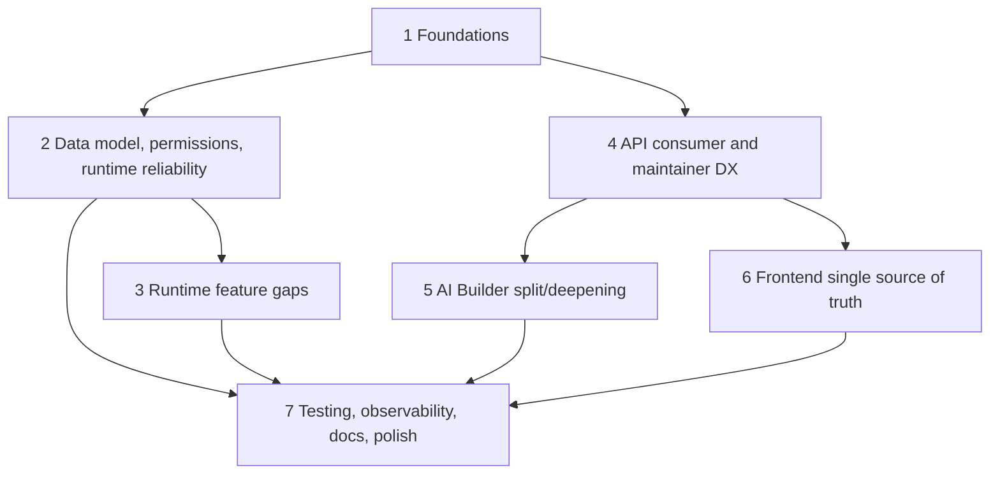

# Phase 4 Refactor Plan

TL;DR:
1. This plan converts the Phase 2 synthesis and Phase 3 adversarial reconciliation into the seven prompt-required workstream iterations.
2. The canonical execution schedule is `docs/refactor/implementation-order.md`; the iterations below group detailed work items by theme and must not override batch prerequisites.
3. Runtime feature-gap items in Iteration 3 are design and implementation checklists, but step rerun and human review remain blocked until the late batches named in `implementation-order.md`.
4. Source code, tests, migrations, dependencies, git, and PRs were not changed in this planning session.
5. Overall implementation risk is high unless each item obeys its dependencies and batch order.

## Iteration Map



Implementation agents should schedule these work items by `docs/refactor/implementation-order.md`. When this file and `implementation-order.md` appear to disagree, `implementation-order.md` is the single source of truth for sequencing.

## Iteration 1: Foundations

### Work Item 1.1 - Add Behavior Pins Before Contract Refactors

| Field | Detail |
|---|---|
| Checklist | [ ] Add route/OpenAPI pins for current flow endpoints, upload schema, evidence export behavior, pagination semantics, and generated client shape before changing contracts. |
| Motivation | Claude found that Phase 2's order hides dependency risk; small behavior pins reduce review risk before deletion and OpenAPI cleanup (`docs/refactor/phase3/claude-review.md:50-60`). |
| Source references | `docs/refactor/phase1/08-tests.md:75-105`, `docs/refactor/phase1/09-api-maintainer.md:200-219`, `docs/refactor/phase3/reconciled-plan.md:111-124`. |
| Scope | Backend route/OpenAPI tests and one API-plus-worker characterization test. No broad rewrite. |
| Files affected | `backend/tests/unit/test_flow_openapi_contract.py`, `backend/tests/integration/flows/test_flow_runtime_worker_contract.py`, `frontend/packages/intric-js/src/endpoints/flows.test.js`. |
| Acceptance criteria | A current-behavior contract exists for paths, operation IDs, evidence export content type/body shape, multipart upload OpenAPI shape, pagination fields, and runtime happy path. |
| Tests required | `cd backend && ./.venv/bin/python -m pytest tests/unit/test_flow_openapi_contract.py tests/integration/flows/test_flow_runtime_worker_contract.py -q`; package flow endpoint test once frontend env is fixed. |
| Migration notes | None. |
| Risk | Medium. Characterization tests can accidentally freeze bad behavior. Mark known-bad behavior as "pinned before refactor" with deletion target. |
| Rollback approach | Delete the new characterization test if it blocks the first contract cleanup without protecting behavior. |
| Dependencies | None. |
| Effort | M |
| Owner skill needed | Test quality, API contract, runtime reliability. |

### Work Item 1.2 - Delete False Owners And Import Shims

| Field | Detail |
|---|---|
| Checklist | [ ] Delete true import shims and router callable re-export surfaces after zero-import checks and replacement route tests. |
| Motivation | False owners make reviewers chase aliases instead of canonical modules (`docs/refactor/phase1/04-dead-and-legacy.md:27-44`). |
| Source references | `docs/refactor/phase2/synthesis.md:158-178`, `docs/refactor/phase3/reconciled-plan.md:70-79`. |
| Scope | True shims only. Excludes `ai_builder_models.py` star barrel and public/persisted data-shape fallbacks. |
| Files affected | `backend/src/intric/flows/flow_repo.py`, `flow_version_repo.py`, `flow_service.py`, `flow_run_repo.py`, `flow_run_service.py`, `flow_dispatch.py`, router aggregators, startup import tests. |
| Acceptance criteria | `rg` finds no imports from deleted compatibility modules; router aggregators expose only routers or are removed; tests assert routes, not callable identity. |
| Tests required | `cd backend && uv run pyright`; route registration/OpenAPI tests; import-linter if updated. |
| Migration notes | No DB migration. |
| Risk | Low-medium for true shims; medium if startup import tests hide server boot side effects. |
| Rollback approach | Restore a deleted shim only if a real external package consumer is discovered; otherwise fix imports. |
| Dependencies | Work Item 1.1. |
| Effort | M |
| Owner skill needed | Dead-code deletion, readability, API maintainer. |

### Work Item 1.3 - Establish Contract Policies

| Field | Detail |
|---|---|
| Checklist | [ ] Land ADRs/rules for JSONB versioning, generated type ownership, API pagination, error model, compatibility deletion, and interface justification before large refactors. |
| Motivation | Phase 2 identified repeated drift in status, JSONB, API schemas, frontend types, and compatibility paths (`docs/refactor/phase2/synthesis.md:143-156`). |
| Source references | `docs/refactor/phase3/reconciled-plan.md:80-110`, `docs/refactor/phase2/synthesis.md:195-208`. |
| Scope | Documentation and guard tests first; implementation hooks in later iterations. |
| Files affected | `docs/adr/` or equivalent future ADR location, `AGENTS.md` later if accepted, import-linter/config tests. |
| Acceptance criteria | New code has a named policy for JSONB fields, compatibility, generated types, and public API error/pagination behavior. |
| Tests required | Documentation lint if available; code guards proposed in Phase 5. |
| Migration notes | None. |
| Risk | Low. Risk is over-documenting without enforcement. |
| Rollback approach | Keep the rule but lower strictness if it blocks needed migration work. |
| Dependencies | None. |
| Effort | S |
| Owner skill needed | Architecture boundaries, maintainability. |

## Iteration 2: Data Model, Permissions, Runtime Reliability

### Work Item 2.1 - Canonical Status Lifecycle

| Field | Detail |
|---|---|
| Checklist | [ ] Create one lifecycle projection for active, terminal, cancellable, redispatchable, reviewable, and rerunnable states. |
| Motivation | Statuses are duplicated across enums, DB checks, services, repos, generated/manual TypeScript, and frontend helpers (`docs/refactor/phase2/synthesis.md:49`). |
| Source references | `backend/src/intric/flows/enums.py:64-85`, `backend/src/intric/database/tables/flow_tables.py:397-400`, `docs/refactor/phase1/02-flow-runtime.md:1-8`. |
| Scope | Projection and parity tests first; no new pause/rerun states until terminalization and API contracts are ready. |
| Files affected | `backend/src/intric/flows/enums.py`, future `flow_status_lifecycle.py`, DB migration tests, frontend status helpers. |
| Acceptance criteria | One backend owner defines lifecycle classes; DB/API/frontend projections have parity tests; adding a status has a checklist. |
| Tests required | Backend lifecycle unit tests, DB constraint parity test, frontend status helper tests after generated types land. |
| Migration notes | If DB enum/CHECK changes, migration explicitly lists status alphabet. |
| Risk | Medium. Generated constraints must remain reviewable. |
| Rollback approach | Revert helper adoption before adding new states. |
| Dependencies | Work Item 1.1. |
| Effort | M |
| Owner skill needed | Runtime reliability, data model. |

### Work Item 2.2 - Terminalization Command And Crash Recovery

| Field | Detail |
|---|---|
| Checklist | [ ] Replace partial terminalization paths with one idempotent command that updates run, step results, open attempts, audit outbox, and observability. |
| Motivation | Stale-running reconciliation fails the run but does not consistently finish attempts or audit terminal state (`docs/refactor/phase1/02-flow-runtime.md:53-67`). |
| Source references | `backend/src/intric/flows/runtime/tasks.py:322-358`, `backend/src/intric/flows/application/flow_run_service.py:655-675`, `docs/refactor/phase1/12-observability-operability.md:159-173`. |
| Scope | Completion, failure, cancellation, task timeout, dispatch failure, stale reconciliation. |
| Files affected | `flow_run_service.py`, `runtime/executor.py`, `runtime/tasks.py`, `flow_run_repo.py`, audit/outbox modules, runtime tests. |
| Acceptance criteria | No terminal run has open active attempts except documented historical rows; terminal audit event is durable; duplicate terminalization is idempotent. |
| Tests required | Runtime worker contract, stale-running reconciliation test, task timeout test, double terminalization test, audit outbox failure test. |
| Migration notes | Historical open attempts may need a data cleanup or diagnostic query. |
| Risk | High. Transaction order and locks matter. |
| Rollback approach | Feature-flag the new terminalization path only for reconciliation first, then expand; rollback by restoring caller-specific terminalization if data inconsistency appears. |
| Dependencies | Work Item 2.1. |
| Effort | L |
| Owner skill needed | Runtime reliability, data model, observability. |

### Work Item 2.3 - Flow Access Policy And Permission Migration

| Field | Detail |
|---|---|
| Checklist | [ ] Replace route-local string actions and AI Builder raw scope reads with `FlowPrincipal` plus typed policy actions. |
| Motivation | Normal flow routes use common scope helpers while AI Builder reads raw `Request.state.api_key_scope_*` (`docs/refactor/phase1/09-api-maintainer.md:125-161`). |
| Source references | `backend/src/intric/flows/api/flow_api_common.py:129-253`, `backend/src/intric/flows/ai_builder/ai_builder_router.py:85-210`, `docs/refactor/phase3/gemini-review.md:13-14`. |
| Scope | Permission policy module, route helpers, AI Builder session action rules, migration mapping for legacy flow permissions. |
| Files affected | `flow_api_common.py`, `flow_router_common.py`, `flow_definition_access.py`, `ai_builder_router.py`, `roles/permissions.py`, permission tests. |
| Acceptance criteria | No flow router reads raw scope state; `required_access` is not free-form string in new code; role/API-key migration mapping is explicit. |
| Tests required | Permission matrix across user, tenant admin, same-space roles, tenant service key, space service key, session creator/non-creator. |
| Migration notes | Map `FLOWS_MANAGE` and aliases to granular permissions without default-granting pause/resume/review unless explicitly approved. |
| Risk | High. Auth regressions are security issues. |
| Rollback approach | Keep old permission helper as adapter around new policy during migration, but forbid new raw scope reads. |
| Dependencies | Work Item 1.1. |
| Effort | L |
| Owner skill needed | API maintainer, data model, security-minded backend. |

## Iteration 3: Runtime Feature Gaps

### Work Item 3.1 - Per-Step File Mapping Contract

| Field | Detail |
|---|---|
| Checklist | [ ] Make `step_inputs` the single run file mapping request contract; remove top-level `file_ids` as a pre-production breaking API change. |
| Motivation | Top-level `file_ids` competes with per-step mapping and forces special step-one behavior (`docs/refactor/phase1/04-dead-and-legacy.md:82-83`). |
| Source references | `backend/src/intric/flows/api/flow_models.py:410-434`, `backend/src/intric/flows/flow_run_step_inputs.py:104-128`, `docs/refactor/phase3/gemini-review.md:7-9`. |
| Scope | API schema, runtime normalizer, JS client, docs/examples, idempotency fingerprint, contract tests. |
| Files affected | `flow_models.py`, `flow_run_execution_router.py`, `flow_run_step_inputs.py`, `step_input_resolution.py`, `flows.js`, `FlowRunDialog.svelte`. |
| Acceptance criteria | Top-level `file_ids` is rejected or absent; request examples use `step_inputs`; runtime gets one normalized step-file map; idempotency uses normalized canonical payload. |
| Tests required | API contract for files mapped to non-contiguous steps, invalid file owner, idempotency conflict, runtime resolver assignment. |
| Migration notes | Existing local/dev run rows may retain historical `file_ids` in evidence/export. Do not delete export lineage keys blindly. |
| Risk | High for public API consumers, acceptable pre-production if docs/client/tests update together. |
| Rollback approach | Emergency rollback only: the runtime owner may reintroduce the adapter behind a documented local-drain flag if queued runs cannot be drained; the flag must name owner, trigger, removal condition, and a removal PRD/work item. |
| Dependencies | Iteration 2.3 and Iteration 4 OpenAPI work. |
| Effort | M |
| Owner skill needed | API consumer, runtime, frontend generated client. |

### Work Item 3.2 - Step Rerun

| Field | Detail |
|---|---|
| Checklist | [ ] Design and implement DAG-aware step rerun with explicit invalidation, idempotency, attempts, evidence, audit, permissions, and generated client contract. |
| Motivation | Current public run controls are cancel and stale queued redispatch; step rerun is absent and cannot reuse redispatch (`docs/refactor/phase1/05-api-consumer.md:220-520`). |
| Source references | `backend/src/intric/database/tables/flow_tables.py:519-521`, `backend/src/intric/database/tables/flow_tables.py:586-590`, `docs/refactor/phase3/gemini-review.md:21-22`. |
| Scope | New endpoint, service command, subgraph executor behavior, downstream invalidation, audit, frontend affordance. |
| Files affected | `flow_run_steps_router.py`, `flow_run_service.py`, `runtime/executor.py`, `flow_run_repo.py`, `flow_models.py`, generated client, UI step cards. |
| Acceptance criteria | Rerun computes transitive downstream dependencies from `flow_step_dependencies`; response returns `invalidated_step_ids`; duplicate key returns same rerun operation; stale downstream evidence cannot be mistaken as current. |
| Tests required | API integration plus worker/runtime test, idempotency conflict test, permission matrix, audit event test, frontend confirmation/status test. |
| Migration notes | May require attempt generation/version metadata. ADR required before new tables. |
| Risk | High. Evidence corruption is the failure mode to avoid. |
| Rollback approach | Keep endpoint disabled until worker/runtime tests pass; rollback by hiding endpoint and preserving old run data. |
| Dependencies | Work Items 2.1, 2.2, 2.3, 3.1, evidence provenance work. |
| Effort | XL |
| Owner skill needed | Runtime reliability, data model, API contract, frontend state. |

### Work Item 3.3 - Human-In-The-Loop Pause/Edit/Resume

| Field | Detail |
|---|---|
| Checklist | [ ] Add checkpoint/yield/resume semantics for human review without blocking Celery workers. |
| Motivation | Gemini found the original pause sketch did not specify worker mechanics (`docs/refactor/phase3/gemini-review.md:18-19`). |
| Source references | `backend/src/intric/flows/enums.py:64-85`, `backend/src/intric/database/tables/flow_tables.py:397-400`, `docs/refactor/phase2/synthesis.md:130-141`. |
| Scope | Definition checkpoint config, DB checkpoint state, resume command, edit API, permissions, audit, evidence original/edited trace, frontend review session. |
| Files affected | Status enums/migrations, `flow_run_review_checkpoints` or typed JSON checkpoint owner, runtime executor, run service, routers, generated client, evidence/export, frontend review UI. |
| Acceptance criteria | Worker persists checkpoint and exits; resume validates review revision and dispatches new task; stale edit conflicts are typed; evidence shows original and edited output; audit covers every transition. |
| Tests required | Runtime pause/resume integration, duplicate resume idempotency, stale edit conflict, permission matrix, audit rows, evidence original/edited export, frontend journey. |
| Migration notes | New persisted state; migration required for status/checkpoint if implemented. |
| Risk | Highest. Touches DB, runtime, API, frontend, audit, evidence, permissions. |
| Rollback approach | Gate feature per flow definition; if rollback needed, block new checkpoints and let existing checkpoints finish through resume/cancel path. |
| Dependencies | Work Items 2.1, 2.2, 2.3, 3.1, 4.1, 6.1, plus PRD-009 terminal audit/operability work. |
| Effort | XL |
| Owner skill needed | Runtime reliability, API/data model, frontend state, observability. |

## Iteration 4: API Consumer And API Maintainer DX

### Work Item 4.1 - Fix OpenAPI At Source

| Field | Detail |
|---|---|
| Checklist | [ ] Remove flow-specific OpenAPI postprocessing by fixing route signatures/models and response contracts where possible. |
| Motivation | Gemini rejected masking upload schema issues in a compatibility module (`docs/refactor/phase3/gemini-review.md:24-25`). |
| Source references | `backend/src/intric/server/main.py:313-335`, `docs/refactor/phase1/09-api-maintainer.md:214-216`. |
| Scope | Multipart upload schema, evidence export response/download semantics, route tags, operation IDs, generated schema tests. |
| Files affected | `flow_upload_router.py`, `flow_run_evidence_router.py`, `flow_models.py`, `server/main.py`, OpenAPI tests, generated client. |
| Acceptance criteria | Flow-specific OpenAPI behavior originates in flow endpoint/schema owners; generated TypeScript matches runtime behavior. |
| Tests required | OpenAPI schema tests, API contract tests for content type/header/body, client wrapper tests. |
| Migration notes | Breaking generated-client change expected. |
| Risk | Medium-high for client behavior. |
| Rollback approach | Keep old wrapper method temporarily while generated client migrates, but do not keep wrong OpenAPI. |
| Dependencies | Work Item 1.1. |
| Effort | M |
| Owner skill needed | API maintainer, generated client. |

### Work Item 4.2 - API Consumer Basics

| Field | Detail |
|---|---|
| Checklist | [ ] Add `has_more` or `total_count`, add missing published runtime client method, define idempotency retention, tighten run-contract schemas. |
| Motivation | The current happy path works but still requires source reading for pagination, published runtime discovery, and idempotency retention (`docs/refactor/phase1/05-api-consumer.md:1-8`). |
| Source references | `docs/refactor/phase3/gemini-review.md:27-28`, `docs/refactor/phase1/05-api-consumer.md:63-90`. |
| Scope | Flow/runs list responses, JS wrapper, docs examples, idempotency policy, form field schema. |
| Files affected | `flow_authoring_router.py`, `flow_run_execution_router.py`, `flow_models.py`, `flows.js`, docs-site guide. |
| Acceptance criteria | API consumers can list pages robustly, fetch published runtime view through JS client, and understand idempotency key lifetime. |
| Tests required | Router pagination contract tests, client method tests, idempotency replay/expiry tests. |
| Migration notes | Pagination response shape is a breaking change. |
| Risk | Medium. Extra count queries may affect performance if `total_count` is chosen. |
| Rollback approach | Prefer `has_more` if total counts are expensive. |
| Dependencies | Work Item 4.1. |
| Effort | M |
| Owner skill needed | API consumer, API maintainer. |

## Iteration 5: AI Builder Split / Deepening

### Work Item 5.1 - AI Builder Prompt And Contract Audit

| Field | Detail |
|---|---|
| Checklist | [ ] Treat AI Builder prompt, plan/spec/envelope, repair, and materialization contracts as public runtime contracts before code splitting. |
| Motivation | Claude flagged prompt-as-contract review as potentially missing (`docs/refactor/phase3/claude-review.md:44`, `:68`). |
| Source references | `docs/refactor/phase1/01-ai-builder.md:1-8`, `docs/refactor/phase2/synthesis.md:59-60`. |
| Scope | Prompt corpus, knowledge-pack rules, planner plan envelope, materializer output, repair/fallback inventory. |
| Files affected | `backend/src/intric/flows/ai_builder/**`, AI Builder frontend protocol, AI Builder tests. |
| Acceptance criteria | Prompt changes have contract tests or golden behavior checks; repair paths have typed failures and telemetry; code splits preserve prompt contract. |
| Tests required | AI Builder API happy path, plan revision/apply, prompt regression fixtures where stable enough. |
| Migration notes | None unless persisted builder plans need schema version changes. |
| Risk | Medium-high. LLM behavior can regress without static type failures. |
| Rollback approach | Keep existing prompt behavior behind fixtures while refactoring internal owners. |
| Dependencies | Work Items 4.1 and 6.1. |
| Effort | L |
| Owner skill needed | AI Builder architecture, tests, API contracts. |

### Work Item 5.2 - Proposal Processor And Planner Turn Ownership

| Field | Detail |
|---|---|
| Checklist | [ ] Split AI Builder create/edit proposal processing and planner turn lifecycle by real responsibilities, not by fake interfaces. |
| Motivation | Large AI Builder modules mix transport, repair, persistence, events, and plan state (`docs/refactor/phase2/synthesis.md:59-60`). |
| Source references | `docs/refactor/phase1/01-ai-builder.md:1-8`, `docs/refactor/phase1/10-maintainability-interfaces.md:1-8`. |
| Scope | Proposal transport/retry, create processor, edit processor, repair policy, plan persistence/event adapter, planner active turn. |
| Files affected | `ai_builder_proposal_processor.py`, `ai_builder_planner.py`, related create/edit/repair modules and tests. |
| Acceptance criteria | Each module has one lifecycle responsibility; no one-method interface introduced solely for tests; LLM repair behavior is preserved or intentionally deleted. |
| Tests required | Behavior tests for create proposal, edit proposal, repair path, stale revision, session ownership, SSE event order. |
| Migration notes | Persisted plan/session schema version if changed. |
| Risk | High. Refactor could change LLM planning behavior. |
| Rollback approach | Land in small slices: extract pure policy first, then persistence, then turn orchestration. |
| Dependencies | Work Item 5.1. |
| Effort | XL |
| Owner skill needed | AI Builder backend, runtime reliability, test quality. |

## Iteration 6: Frontend Single Source Of Truth

### Work Item 6.1 - Generated Type Ownership

| Field | Detail |
|---|---|
| Checklist | [ ] Replace manual flow runtime/resource types with generated aliases after OpenAPI source issues are fixed. |
| Motivation | Manual flow type islands duplicate generated schemas and force `Record<string, unknown>` parsing (`docs/refactor/phase1/03-frontend.md:61-107`). |
| Source references | `frontend/packages/intric-js/src/types/resources.d.ts:153-530`, `frontend/packages/intric-js/src/types/schema.d.ts:11844-11860`, `docs/refactor/phase3/claude-review.md:34`. |
| Scope | `resources.d.ts`, AI Builder `protocol.ts`, `flows.js` wrapper typing, frontend components consuming flow runtime types. |
| Files affected | `resources.d.ts`, `schema.d.ts`, `flows.js`, `protocol.ts`, flow components. |
| Acceptance criteria | Public Flow runtime/status/evidence/AI Builder plan types come from generated schema or are explicitly UI-only. |
| Tests required | Frontend typecheck after env fixes, package endpoint tests, import smoke tests. |
| Migration notes | Generated file changes must be separated from handwritten changes. |
| Risk | Medium-high. Backend schema gaps will surface. |
| Rollback approach | Keep ergonomic aliases but map them back to generated components. |
| Dependencies | Work Item 4.1. |
| Effort | L |
| Owner skill needed | Frontend state, API client. |

### Work Item 6.2 - Frontend Workflow State Owners

| Field | Detail |
|---|---|
| Checklist | [ ] Remove Driver/Service mirrored state, route direct authoring mutations, and run-launch state embedded in presentation components. |
| Motivation | Frontend has multiple owners for AI Builder state, authoring state, run-launch state, evidence parsing, and status behavior (`docs/refactor/phase1/03-frontend.md:45-60`). |
| Source references | `FlowAIBuilderService.svelte.ts:266-280`, `FlowEditor.ts:27-46`, route mutation evidence in `docs/refactor/phase1/03-frontend.md:164-179`. |
| Scope | One AI Builder controller, one authoring session owner, one run launch session, generated evidence/status primitives. |
| Files affected | `FlowAIBuilderDriver.ts`, `FlowAIBuilderService.svelte.ts`, `FlowEditor.ts`, route `+page.svelte`, `FlowRunDialog.svelte`, evidence/status components. |
| Acceptance criteria | No workflow state is copied field-by-field between owners; components render state and dispatch typed commands; status helpers use generated status types. |
| Tests required | AI Builder journey/component test, authoring command tests, run launch dialog test, evidence viewer test, status helper tests. |
| Migration notes | None. |
| Risk | High if attempted as one rewrite. |
| Rollback approach | Slice by workflow: AI Builder mirror removal, authoring mutations, run launch session, evidence/status. |
| Dependencies | Work Item 6.1. |
| Effort | XL |
| Owner skill needed | Frontend state, SvelteKit, API client. |

## Iteration 7: Testing And Polish

### Work Item 7.1 - Replace Implementation-Coupled Tests

| Field | Detail |
|---|---|
| Checklist | [ ] Move high-value coverage from private helper/mock assertions to behavior contracts at real seams. |
| Motivation | Test suite is bottom-heavy and implementation-coupled (`docs/refactor/phase1/08-tests.md:3-9`). |
| Source references | `docs/refactor/phase1/08-tests.md:107-160`, `docs/refactor/phase3/claude-review.md:38`. |
| Scope | Runtime API-plus-worker, API consumer contract, frontend AI Builder/runtime journeys, migration tests, deletion of dead shim tests. |
| Files affected | Backend flow tests, frontend flow tests, Playwright specs, generated-client tests. |
| Acceptance criteria | New contract tests protect critical behaviors; old tests that only assert mocks or compatibility identities are deleted after behavior coverage lands. |
| Tests required | This work item is tests. Validation commands documented per PRD. |
| Migration notes | Migration tests required for data-shape deletions. |
| Risk | Medium. Too many E2E tests can be slow/flaky. Keep journeys minimal. |
| Rollback approach | Keep unit tests until contract tests prove equivalent behavior. |
| Dependencies | All earlier iterations as needed. |
| Effort | L |
| Owner skill needed | Test quality, runtime/API/frontend. |

### Work Item 7.2 - Dead Code, Comments, Readability Polish

| Field | Detail |
|---|---|
| Checklist | [ ] Remove stale comments, restating comments, domain-neutrality leaks, compatibility tests for deleted behavior, and large-file readability hotspots after ownership moves. |
| Motivation | Long lifecycle files and comments compensating for unclear ownership block week-one readability (`docs/refactor/phase1/07-comments-readability.md:1-8`). |
| Source references | `docs/refactor/phase1/04-dead-and-legacy.md:140-163`, `docs/refactor/phase2/synthesis.md:67`. |
| Scope | Comments/readability only after structural owners are clarified; no mechanical LOC splits. |
| Files affected | AI Builder planner/proposal processor, runtime executor, FlowEditor, tests, prompt/default text. |
| Acceptance criteria | Comments explain why, not what; names reveal responsibility; no compatibility path lacks owner/deletion condition. |
| Tests required | Existing behavior tests after comment/name cleanup; typecheck/lint. |
| Migration notes | None. |
| Risk | Low-medium. Renames can cause churn. |
| Rollback approach | Revert cosmetic rename if it obscures behavior diff. |
| Dependencies | Structural refactors landed. |
| Effort | M |
| Owner skill needed | Readability, dead-code deletion. |

## PRD Mapping

| PRD | Primary Iterations |
|---|---|
| `PRD-001-foundations.md` | Iteration 1 |
| `PRD-002-data-model-and-permissions.md` | Iteration 2 |
| `PRD-003-runtime-reliability-and-feature-gaps.md` | Iterations 2 and 3 |
| `PRD-004-api-consumer-and-api-maintainer-dx.md` | Iteration 4 |
| `PRD-005-ai-builder-architecture.md` | Iteration 5 |
| `PRD-006-frontend-single-source-of-truth.md` | Iteration 6 |
| `PRD-007-testing-strategy.md` | Iteration 7 |
| `PRD-008-dead-code-comments-and-readability.md` | Iterations 1 and 7 |
| `PRD-009-observability-and-operability.md` | Iterations 2 and 7 |
| `PRD-010-documentation-and-adrs.md` | All iterations |

## Validation Commands

Run only in implementation sessions, not this planning session:

```bash
cd backend && uv run pyright
cd backend && ./.venv/bin/python -m pytest tests/unit/test_flow_openapi_contract.py -q
cd backend && ./.venv/bin/python -m pytest tests/integration/flows -q
pnpm -C frontend check
pnpm -C frontend/apps/web test:unit -- --run
pnpm -C frontend/packages/intric-js test -- --run
```

Known baseline caveats from Phase 0: flow-scoped Ruff currently has import-order failures, frontend check has existing flow diagnostics, and frontend Vitest currently reports missing `jsdom` after many tests pass (`docs/refactor/phase0/baseline.md:21-29`).
