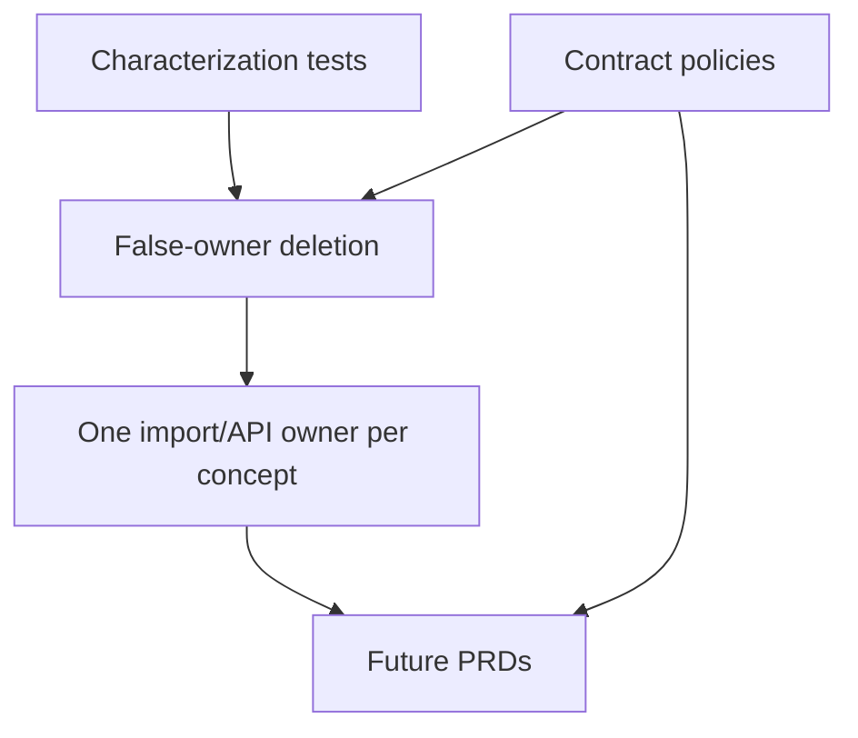

# PRD-001: Foundations

## TL;DR
1. Establish behavior pins, deletion gates, contract policies, and guardrails before feature work.
2. Delete only true false owners in this PRD; defer public API and persisted-row fallbacks to their owning PRDs.
3. Make JSONB, OpenAPI, error, pagination, generated-type, compatibility, and interface policies explicit.
4. Add small characterization tests where later refactors would otherwise be blind.
5. Success is a safer runway, not user-visible feature change.

## Problem

The current plan has strong findings but weak execution ordering. Claude found that Phase 2 collapsed true shims, API migrations, generated type cleanup, and AI Builder star-barrel churn into one coarse "delete shim/barrel" item (`docs/refactor/phase3/claude-review.md:1-7`). Phase 2 ranks deletion and generated types as high-ROI work (`docs/refactor/phase2/synthesis.md:52-54`), but Phase 3 reconciliation shows generated types depend on truthful OpenAPI first (`docs/refactor/phase3/reconciled-plan.md:52-53`).

False owners exist today. Agent D identifies import shims and router callable re-exports as cleanup candidates, but also warns that top-level `file_ids`, `template_file_id`, legacy form types, and principal identity need migration gates (`docs/refactor/phase1/04-dead-and-legacy.md:27-44`).

## Goals

- Pin route/OpenAPI/runtime behavior before changing contracts.
- Delete true import/re-export false owners.
- Create enforceable compatibility, JSONB, OpenAPI, error, pagination, and interface policies.
- Separate source/API compatibility deletion from persisted row-shape migration.
- Give implementation agents a "do not add parallel owners" rulebook.

## Non-goals

- Do not implement runtime pause, rerun, per-step file mapping changes, or generated type migration here.
- Do not delete public API fields such as top-level `file_ids` in this PRD.
- Do not change DB schemas except optional tests/guards.
- Do not edit `AGENTS.md` directly; Phase 5 proposes additions only.

## Users

- external API consumer: benefits from future contract changes being pinned and documented.
- backend maintainer: gets clear owners and deletion gates.
- frontend maintainer: avoids generated/manual type churn until OpenAPI is truthful.
- operations maintainer: gets behavior pins before runtime reliability changes.
- new senior developer: sees which files are canonical and which paths are non-canonical.

## Current State

| Area | Evidence | Risk |
|---|---|---|
| Router/API behavior | API maintainer review shows router aggregators and callable re-exports at `backend/src/intric/flows/api/flow_consumer_router.py:1-48` and `flow_run_router.py:1-42` (`docs/refactor/phase1/09-api-maintainer.md:69-104`). | Endpoint ownership is hard to trace. |
| OpenAPI | Flow-specific upload OpenAPI patch lives in global `server/main.py:313-335` (`docs/refactor/phase1/09-api-maintainer.md:214-216`). | Generated clients inherit patched contracts whose source is not local to endpoints. |
| Tests | Tests are bottom-heavy: 159 backend unit flow test files vs 10 executable backend integration flow test files (`docs/refactor/phase1/08-tests.md:31-39`). | Refactors can pass unit mocks while API/runtime behavior drifts. |
| Shims | Agent D lists flow package shims and router callable re-exports as high-confidence deletion work (`docs/refactor/phase1/04-dead-and-legacy.md:60-70`). | Parallel import paths obscure canonical ownership. |
| Compatibility | Public/persisted compatibility paths are mixed with true dead code (`docs/refactor/phase1/04-dead-and-legacy.md:80-95`). | Deleting too much at once risks data/API breakage without tests. |

## Proposed Future State

The foundations PRD lands small, reviewable changes:

- behavior pins for current route/OpenAPI/runtime contracts
- deletion of true import-only and test-only shims
- written policies for JSONB versioning, generated types, compatibility deletion, error shape, pagination, and interface creation
- initial guardrails and future Phase 5 rule proposals

## Requirements

### Functional Requirements

- [ ] Existing Flow endpoints remain registered with the same paths and operation IDs until a specific API PRD changes them.
- [ ] Deleted shims have no production or test importers.
- [ ] Router aggregation tests assert route registration, not callable identity.

### Maintainability Requirements

- [ ] Every deleted path has a named canonical replacement.
- [ ] No new `utils`, `helpers`, `common`, or `manager` files are added as part of cleanup.
- [ ] Every compatibility path is classified as true shim, public API, persisted row shape, or external boundary repair.

### Reliability Requirements

- [ ] A runtime API-plus-worker characterization test exists before terminalization refactor work.
- [ ] Known baseline failures remain documented rather than hidden.

### API Requirements

- [ ] OpenAPI pins include multipart upload and evidence export behavior before source fixes.
- [ ] Pagination current behavior is pinned before being changed to `has_more` or `total_count`.

### Data Model Requirements

- [ ] No DB fallback is deleted without zero-row proof or a migration plan.

### Frontend Requirements

- [ ] Client wrapper current behavior is pinned before generated type migration.

### Testing Requirements

- [ ] Route/OpenAPI tests pin paths, operation IDs, response models, and current generated-client-sensitive behavior.
- [ ] At least one DB/API/runtime happy path is covered end-to-end enough to protect later terminalization work.

## Design

### Compatibility Classification

| Type | Example | Action |
|---|---|---|
| True import shim | `flow_repo.py`, `flow_version_repo.py` | Delete after zero imports. |
| Behavior shim for tests | `flow_run_service.py` logger rebinding | Retarget tests, delete. |
| Public API field | Top-level `file_ids` | Defer to API/runtime input PRD and break deliberately. |
| Persisted row shape | `template_file_id`, old form field types | Backfill/prove zero rows before delete. |
| External boundary repair | AI Builder proposal repair | Keep if typed/tested. |

## Alternatives Considered

| Alternative | Decision | Reason |
|---|---|---|
| Delete every compatibility path immediately because pre-production allows breaking changes. | Rejected. | Public API and persisted dev rows still need coordinated OpenAPI/client/tests/migrations; Agent D distinguishes these from true shims (`docs/refactor/phase1/04-dead-and-legacy.md:80-95`). |
| Keep all compatibility until after feature work. | Rejected. | Feature work on top of false owners doubles deletion blast radius (`docs/refactor/phase3/claude-review.md:46`). |
| Write broad architecture ADRs before tests. | Partial. | Policies are needed, but behavior pins are also needed to avoid freezing bad behavior accidentally. |

## Acceptance Criteria

- [ ] `rg` shows no imports from deleted true shim modules.
- [ ] Router aggregation modules no longer export endpoint callables unless a documented external consumer exists.
- [ ] OpenAPI route tests pin current behavior before contract changes.
- [ ] Runtime worker characterization test exists or is explicitly blocked by a fixture gap.
- [ ] Compatibility paths are classified with owner, deletion condition, and confidence.
- [ ] Phase 5 guardrail proposals cover non-canonical imports and broad typed-boundary escapes.

## Implementation Checklist

- [ ] Add route/OpenAPI characterization tests.
- [ ] Add runtime API-plus-worker characterization test.
- [ ] Rewrite test imports from backend shims to canonical modules.
- [ ] Delete zero-import backend shims.
- [ ] Replace router callable identity tests with route registration tests.
- [ ] Document compatibility classification in ADR or docs/refactor implementation notes.
- [ ] Add import-linter or equivalent guard for non-canonical import paths.

## Phase 7 Pre-Production Deletion Policy

This repo is pre-production, so never-shipped Flow/AI Builder compatibility is not preserved through staged public deprecation. The implementation decision set is:

- keep because the path is genuinely needed
- delete now after behavior pins
- rewrite to the correct canonical model

Phase 7 splits deletion into two tiers:

| Tier | Examples | Required gate |
|---|---|---|
| Source-only false owners | `flow.py` and repository import shims, `ai_builder_models.py` barrel, frontend `getRedispatchFeedback` alias, router callable identity surfaces. | Canonical import/OpenAPI route coverage exists; `rg` proves source/test imports moved. |
| Persisted row or public contract readers | `normalize_legacy_config`, `template_file_id`, old form field types, top-level request `file_ids`, historical evidence keys. | Behavior pin, count-query proof, backfill/rewrite if rows exist, FE/BE/client docs updated together. |

Do not delete Tier B readers as "legacy" until the persisted-data gate has run. The long-term solution is still deletion/rewrite to canonical ownership, but the cleanup is data-aware rather than source-only.

## Boundary Leakage Cleanup

| Leakage | Evidence | Canonical owner | Acceptance criteria |
|---|---|---|---|
| Raw AI Builder request scope reads | `backend/src/intric/flows/ai_builder/ai_builder_router.py:180-210` | Typed Flow policy dependency plus AI Builder session ownership check | No AI Builder route reads `request.state.api_key_scope_*`. |
| String flow access actions | `backend/src/intric/flows/api/flow_api_common.py:129-193` | `FlowApiAction` policy | Endpoint/action matrix exists before replacement. |
| HTTP payload exposes loose runtime state | `backend/src/intric/flows/api/flow_models.py:431-435` | Typed run-create request and runtime input envelope | Top-level `file_ids` is removed/rejected with named error; `step_inputs` is canonical. |
| Manual frontend Flow types | `frontend/packages/intric-js/src/types/resources.d.ts:153` | Generated OpenAPI schema plus narrow UI aliases | Manual Flow runtime API blocks are deleted or mapped to generated aliases. |
| AI Builder model barrel | `backend/src/intric/flows/ai_builder/ai_builder_models.py:3-5` | Boundary-specific API/domain/event modules | Source/tests import canonical model modules directly. |

## Risks

| Risk | Mitigation |
|---|---|
| Characterization tests freeze known-bad behavior. | Mark known-bad behavior with target PRD and remove/update tests in that PRD. |
| Deleting a shim breaks an external import path. | Pre-production default is breaking, but verify package/public exports before deletion. |
| Guardrails become paper rules. | Phase 5 proposes concrete patterns and examples. |

## Rollback / Recovery

Restore a deleted shim only if a real external consumer is discovered. Otherwise, fix imports to canonical modules. If a characterization test proves too brittle, replace it with an API-level contract that checks user-visible behavior.

## Dependencies

None. This PRD is the first implementation batch.

## Open Questions

| Question | Default Recommendation |
|---|---|
| Should generated OpenAPI files be committed in implementation PRs or regenerated by CI? | Separate generated output from handwritten changes; decide in PRD-004. |
| Where should ADRs live? | Use existing docs/ADR convention if present; otherwise create `docs/adr/` in implementation. |
