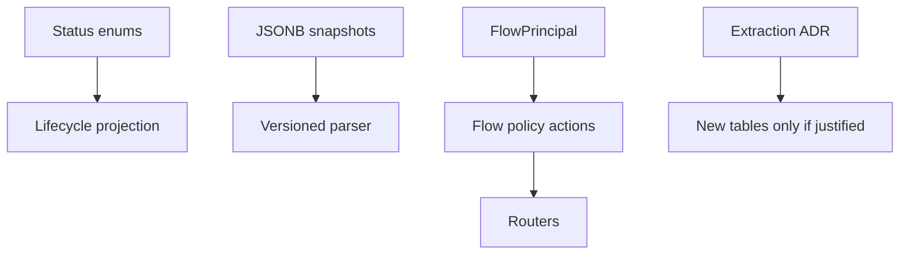
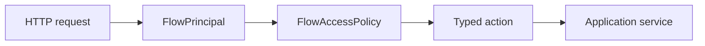

# PRD-002: Data Model And Permissions

## TL;DR
1. Make lifecycle, JSONB, principal, idempotency, and permission ownership explicit before adding runtime features.
2. Keep JSONB snapshots when they are heterogeneous or run-local, but extract lifecycle, file-reference, rerun, review, and audit facts into relational owners.
3. Replace raw AI Builder scope reads and free-form flow access strings with typed policy actions.
4. Define permission migration from legacy aliases without silently expanding pause/resume/review access.
5. Success is a smaller, safer data and authorization surface.

## Problem

The data model is serviceable for the current happy path but not ready for pause, review, rerun, artifact discovery, or long-lived schema evolution. Agent F found that the highest-risk issue is not JSONB itself, but unowned JSONB boundary contracts and first-class facts all sharing the same `dict[str, Any]` shape (`docs/refactor/phase1/06-data-model.md:1-8`).

Authorization is split. Normal flow routes use common helpers, while AI Builder carries local scope helpers and raw `Request.state.api_key_scope_*` reads (`docs/refactor/phase1/09-api-maintainer.md:127-142`). Claude also flagged that fine-grained permission proposals lack migration mapping from existing role assignments (`docs/refactor/phase3/claude-review.md:36`).

## Goals

- Define canonical owners for status lifecycle, published definitions, principal identity, idempotency, JSONB contracts, and permissions.
- Add versioned parsers for owned JSONB payloads before adding tables.
- Extract run file references, step output file references, rerun operations, review checkpoints, and audit/outbox rows because they are lifecycle/idempotency/audit facts.
- Replace string permission actions with typed flow policy actions.
- Define migration rules for legacy permissions and principal fields.

## Non-goals

- Do not implement step rerun or human review endpoints here.
- Do not normalize every JSONB field into tables.
- Do not delete `flow_runs.user_id` or permission aliases without migration proof.
- Do not redesign the entire role system outside Flow/AI Builder needs.

## Users

- external API consumer: gets stable contract and permission behavior.
- backend maintainer: gets one policy and data-contract owner.
- frontend maintainer: gets generated types from stable schemas.
- operations maintainer: gets reliable status/idempotency semantics.
- new senior developer: can find lifecycle and permission rules quickly.

## Current State

| Concept | Evidence | Problem |
|---|---|---|
| Published definition | `FlowVersions.definition_json` is JSONB; schema version is embedded by `FlowService` rather than first-class in the table (`docs/refactor/phase1/06-data-model.md:57-75`). | Runtime evolution depends on ad hoc parsing. |
| Run payloads | `FlowRunPublic.input_payload_json` and `output_payload_json` are broad dicts (`docs/refactor/phase1/05-api-consumer.md:260-278`). | Platform-owned envelopes and arbitrary output are conflated. |
| Principal | `flow_runs.user_id` coexists with `principal_type`, `principal_user_id`, and `principal_api_key_id` (`docs/refactor/phase1/04-dead-and-legacy.md:86`). | Authorization queries have two identity paths. |
| Permissions | `enforce_flow_scope` accepts `required_access: str` at `backend/src/intric/flows/api/flow_api_common.py:129-193`, and AI Builder reads raw scope state at `backend/src/intric/flows/ai_builder/ai_builder_router.py:183-203` (`docs/refactor/phase1/09-api-maintainer.md:135-142`). | New endpoints may copy the wrong helper. |
| Relational extraction | Phase 7 accepts relational owners for per-attempt runtime file mappings, step output file artifacts, rerun operations, review checkpoints, and audit/outbox rows because they are referenced, audited, lifecycle-stateful, and needed for debugging. | Schema surface should grow only around real lifecycle facts, not arbitrary model output. |

## Proposed Future State

## Requirements

### Functional Requirements

- [ ] Flow permission checks use typed actions such as `view`, `run`, `edit`, `review`, `resume`, `audit_view`.
- [ ] AI Builder session actions declare whether creator ownership is required.
- [ ] Existing roles/API keys have an explicit migration mapping.

### Maintainability Requirements

- [ ] JSONB fields that the platform owns have versioned parser/writer modules.
- [ ] `dict[str, Any]` remains only at explicitly arbitrary user/model output boundaries.
- [ ] New tables require an ADR with query/lifecycle/audit/retention justification.

### Reliability Requirements

- [ ] Status lifecycle projection is used by repositories and runtime services.
- [ ] Idempotency retention and retry behavior are documented and tested.

### API Requirements

- [ ] Permission denials return the canonical error shape.
- [ ] Generated OpenAPI reflects new typed actions only through endpoint behavior, not internal names.

### Data Model Requirements

- [ ] Published flow definitions get a first-class schema version or equivalent migration-safe owner.
- [ ] Principal legacy field migration has a zero-risk path or historical-only decision.

### Frontend Requirements

- [ ] Frontend uses generated status/permission-adjacent API shapes, not manual unions.

### Testing Requirements

- [ ] Permission matrix covers user, tenant admin, space roles, tenant API key, space API key, and session creator/non-creator.
- [ ] Parser round-trip tests cover owned JSONB contracts.

## Design

### JSONB Decision Gate

| Question | If Yes | If No |
|---|---|---|
| Need cross-run query/filter/index? | Consider table. | Keep JSONB snapshot. |
| Need row-level authorization, retention, idempotency, retry, review, or audit? | Use relational owner. | Keep parser + snapshot. |
| Need lifecycle transitions per item? | Consider table. | Keep typed envelope. |
| Is shape arbitrary model/user output? | Do not over-type internals. | Type platform envelope. |

### Permission Model

Policy modes:

- Object/action endpoints assert a typed action and return a canonical denial when unauthorized.
- List endpoints may filter unauthorized rows when the API contract is "show what this principal can see"; the route/policy call site must declare filter mode explicitly and must not emit per-row denial audit noise.
- `scope_enforcement_enabled` is not a production policy switch. Batch 2 should delete it from production routes or isolate it to tests through an explicit fake principal/policy fixture before replacing raw scope reads.

## State, Schema, And Permission Leakage Cleanup

| Leakage | Evidence | Fix | Acceptance criteria |
|---|---|---|---|
| Status lifecycle is encoded as strings and optional fields | Run status CHECK only allows queued/running/completed/failed/cancelled at `backend/src/intric/database/tables/flow_tables.py:397-399`. | Add lifecycle projection and explicit new states such as `waiting_for_review` only with predicate sweep. | Status-aware predicates, OpenAPI, generated types, frontend status logic, and DB CHECK migrate together. |
| Flow definition schema version is hidden inside JSON | `FlowVersions.definition_json` is JSONB at `flow_tables.py:242-243`. | Add first-class schema version or equivalent migration-safe owner. | Parser refuses unsupported/corrupted definition with named error before runtime execution. |
| Run input/file mapping is hidden in `input_payload_json` | `FlowRunService.create_run` writes `step_inputs` and top-level `file_ids` into payload at `backend/src/intric/flows/application/flow_run_service.py:399-407`. | Add attempt-scoped `flow_run_step_input_files`; keep JSON snapshot for idempotency/evidence. | File associations can be queried by run/step/file and cannot point across tenant/flow boundaries. |
| Step output files live only in output JSON | Evidence/export scans `generated_file_ids`/`file_ids` in `backend/src/intric/flows/flow_run_export_json.py:461-565`. | Add `flow_run_step_result_files` relational projection. | Artifact retrieval, retention, and rerun invalidation do not require JSON scanning. |
| Permission aliases can over-grant new actions | Existing alias tests at `backend/tests/unittests/flows/test_flow_permissions.py:29-53`. | Endpoint/action/permission matrix plus inverse legacy-permission map. | `FLOWS`/`FLOWS_MANAGE` do not grant review/resume/rerun/audit unless explicitly mapped. |
| AI Builder create sessions are space-scoped before a flow exists | `ai_builder_router.py` gates by `space_id`; create target has no flow ID. | Policy supports `flow.builder.use` on space plus apply-time flow action. | Tenant/space API-key behavior is tested for create and edit sessions. |

## JSONB Version And Corruption Requirements

Each owned JSONB field in Flow/AI Builder must name:

- schema version or version column
- parser/writer owner
- named corruption error code
- runtime behavior on parse failure
- migration/backfill rule
- `jsonb_typeof` constraints where the parser assumes object/list shape

Phase 7 details the field-by-field decisions in `docs/refactor/phase7/data-model-scalability-stress-test.md`.

## Alternatives Considered

| Alternative | Decision | Reason |
|---|---|---|
| Normalize all JSONB runtime facts into tables now. | Rejected. | Gemini correctly flagged transaction/migration overhead without proven query need (`docs/refactor/phase3/gemini-review.md:10-11`). |
| Keep route-local permission helpers. | Rejected. | Maintainer review shows repeated raw scope and string-action patterns (`docs/refactor/phase1/09-api-maintainer.md:125-161`). |
| Delete legacy permission aliases without migration. | Rejected. | Role/API-key assignments need explicit mapping to avoid access expansion or accidental denial. |

## Acceptance Criteria

- [ ] One flow policy module owns typed actions.
- [ ] No flow router reads `Request.state.api_key_scope_*` directly.
- [ ] Published definition parser/writer owns version behavior.
- [ ] Idempotency retention has read-side semantics for retries after expiry.
- [ ] JSONB extraction ADR exists before any non-lifecycle run-local artifact/input table is created.
- [ ] Attempt-scoped file input rows, step output file rows, rerun operation rows, review checkpoint rows, and audit/outbox rows have schemas and constraints before implementation starts.
- [ ] Permission migration mapping is documented and tested.

## Implementation Checklist

- [ ] Add `FlowApiAction` and policy helpers.
- [ ] Route normal flow and AI Builder checks through the policy.
- [ ] Add permission matrix tests.
- [ ] Add JSONB contract owner for published definitions.
- [ ] Add idempotency retention ADR and tests.
- [ ] Decide `flow_runs.user_id` migration or historical-only status.
- [ ] Add ADR template requirement for new runtime tables.

## Risks

| Risk | Mitigation |
|---|---|
| Permission refactor changes access behavior. | Matrix tests before replacing helpers. |
| JSONB parser adds ceremony without value. | Only parse owned contracts, not arbitrary output. |
| Leaving JSONB snapshots delays needed indexes. | ADR gate includes queryability and lifecycle criteria. |

## Rollback / Recovery

Keep the old permission helper as a temporary adapter around the new policy during migration. If parser rollout finds malformed historical rows, reject execution with a named corruption error and add a data repair migration.

## Dependencies

- PRD-001 behavior pins.
- PRD-004 OpenAPI contract for generated type impact.

## Open Questions

| Question | Default Recommendation |
|---|---|
| Should statuses move to PostgreSQL enum types or remain varchar CHECKs? | Keep varchar CHECKs with explicit migration generation until status lifecycle stabilizes. |
| Does `flow.run` imply `flow.review` or `flow.resume`? | No. Add explicit actions and negative permission tests. |
