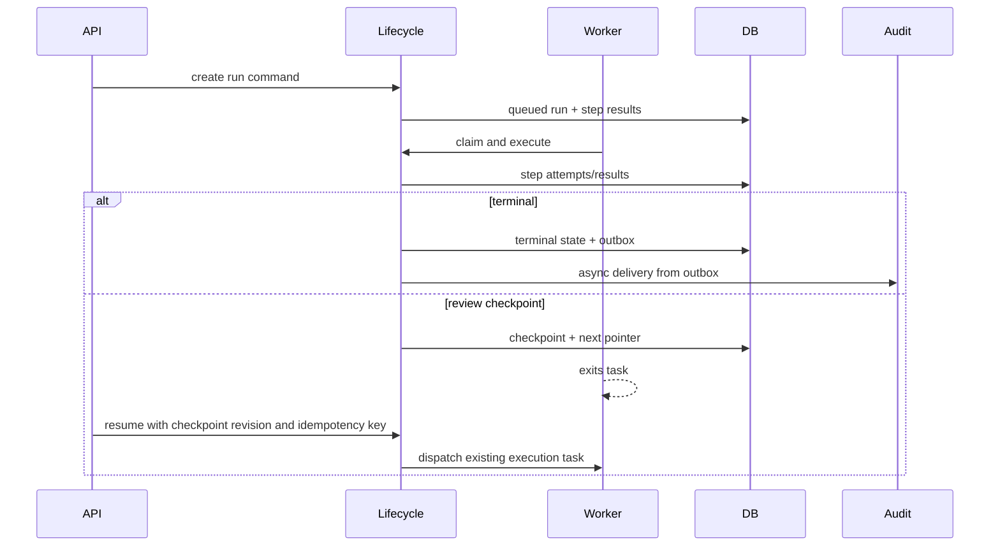

# PRD-003: Runtime Reliability And Feature Gaps

## TL;DR
1. Runtime reliability foundations must land before per-step rerun or human review.
2. Terminalization must be one idempotent command, not scattered caller-specific status flips.
3. Per-step file mapping should use one canonical `step_inputs` request shape and delete top-level `file_ids`.
4. Rerun must invalidate by DAG dependencies, not step order.
5. Human review must checkpoint, yield the worker, and resume by re-queuing the existing execution task.

## Problem

Flow runtime has useful CAS/idempotency primitives, but lifecycle ownership is split across service, executor, repositories, Celery tasks, routers, and frontend helpers (`docs/refactor/phase1/02-flow-runtime.md:1-8`). Terminalization is the top reliability risk: stale-running reconciliation fails runs without consistently closing attempts or auditing terminal state (`docs/refactor/phase1/02-flow-runtime.md:53-67`).

Feature gaps are real but cannot be endpoint-only:

- per-step file mapping is partially expressible through `StepRunInput.file_ids`, while top-level `file_ids` still competes as a public request field (`docs/refactor/phase1/05-api-consumer.md:100-156`)
- step rerun is absent and must be DAG-aware (`docs/refactor/phase3/gemini-review.md:21-22`)
- human review lacks worker checkpoint/yield mechanics (`docs/refactor/phase3/gemini-review.md:18-19`)

## Goals

- Add canonical status lifecycle and terminalization behavior.
- Make crash recovery close open attempts and audit terminal state.
- Delete top-level `file_ids` from run creation and make `step_inputs` canonical.
- Define step rerun with DAG invalidation, idempotency, audit, and evidence semantics.
- Define human review pause/edit/resume with durable checkpoints and worker yield/rehydrate.

## Non-goals

- Do not implement UI-only pause/rerun states.
- Do not create a generic `RunControl` endpoint.
- Do not normalize arbitrary runtime payload blobs into tables; Phase 7 already chooses relational owners for lifecycle file references, rerun operations, review checkpoints, and audit outbox rows.
- Do not block Celery workers while waiting for humans.

## Users

- external API consumer: needs deterministic run, rerun, pause, resume, and error contracts.
- backend maintainer: needs one lifecycle owner.
- frontend maintainer: needs true backend states before UI controls.
- operations maintainer: needs recoverable crash/timeout behavior.
- new senior developer: needs one runtime execution path to inspect.

## Current State

| Area | Evidence | Risk |
|---|---|---|
| Claim | `mark_running_if_claimable` gives a good queued-to-running CAS (`docs/refactor/phase1/02-flow-runtime.md:1-8`). | Strong baseline to preserve. |
| Terminalization | Normal execution, cancellation, task timeout, and reconciliation terminalize different subsets (`docs/refactor/phase1/02-flow-runtime.md:53-67`). | Failed parent run can leave open attempts. |
| Top-level `file_ids` | Request field and adapter still exist (`docs/refactor/phase1/04-dead-and-legacy.md:82-83`). | Future per-step mapping carries special step-one behavior. |
| Rerun | Current route surface has cancel and redispatch only (`docs/refactor/phase1/05-api-consumer.md:220-520`). | Cannot safely edit and rerun one step. |
| Human review | Status values are closed and no review checkpoint route/state exists (`docs/refactor/phase1/05-api-consumer.md:520-680`). | UI would lie if added first. |

## Proposed Future State



## Requirements

### Functional Requirements

- [ ] Create-run accepts canonical step-scoped input only.
- [ ] Rerun endpoint starts from one completed step and names invalidated step IDs.
- [ ] Review checkpoint endpoints allow discover, edit, approve/reject, and resume.

### Maintainability Requirements

- [ ] `FlowRunExecutor.execute` is split by named phases without adding fake interfaces.
- [ ] `FlowRunService` is not split unless transaction ownership changes.
- [ ] Runtime status semantics come from one lifecycle projection.

### Reliability Requirements

- [ ] Terminalization closes open attempts and pending/running step results according to policy.
- [ ] Duplicate terminalization is idempotent.
- [ ] Worker crash, task timeout, duplicate task start, and reconciler behavior are tested.
- [ ] Human review never occupies a worker slot while waiting.

### API Requirements

- [ ] Rerun and resume have separate endpoints from redispatch.
- [ ] Idempotency scope is endpoint-specific.
- [ ] Errors include stale revision, already resumed, invalid transition, invalidated evidence, unauthorized review, and rerun conflict.

### Data Model Requirements

- [ ] Review checkpoints have schema version, reviewer, original output, current reviewed output, decision, timestamps, and expected revision.
- [ ] Rerun stores attempt lineage and invalidation/supersession metadata.

### Frontend Requirements

- [ ] UI controls render only when generated lifecycle state allows the action.
- [ ] Review UI has one state owner and does not reuse generic evidence viewer state as mutable review state.

### Testing Requirements

- [ ] API-plus-worker runtime happy path.
- [ ] Terminalization crash recovery.
- [ ] Per-step file mapping.
- [ ] DAG rerun.
- [ ] Review pause/edit/resume journey.

## Design

### Per-Step File Mapping Contract

Canonical success request:

```json
{
  "expected_flow_version": 7,
  "input_payload_json": {
    "case_id": "A-123"
  },
  "step_inputs": {
    "step-3-uuid": {"file_ids": ["file-1", "file-2", "file-3"]},
    "step-4-uuid": {"file_ids": ["file-4"]},
    "step-6-uuid": {"file_ids": ["file-5"]},
    "step-8-uuid": {"file_ids": ["file-6"]}
  }
}
```

Rejected legacy request:

```json
{
  "expected_flow_version": 7,
  "file_ids": ["file-1", "file-2"]
}
```

Expected error:

```json
{
  "code": "flow_run_legacy_file_ids_not_supported",
  "message": "Use step_inputs[step_id].file_ids to attach runtime files."
}
```

Idempotency fingerprint fields:

| Field | Included | Notes |
|---|---|---|
| `tenant_id` | Yes | Scope key uniqueness. |
| `principal_type`, `principal_user_id`, `principal_api_key_id` | Yes | User and service-key retries must not collide. |
| `flow_id` | Yes | Flow-specific retry scope. |
| `expected_flow_version` / resolved published version | Yes | Version drift changes behavior. |
| normalized `input_payload_json` | Yes | Stable sorted JSON after validation. |
| normalized `step_inputs` | Yes | Sorted by step ID and file ID; top-level `file_ids` absent. |
| upload file contents | No | File IDs identify uploaded files; upload idempotency is separate. |

File ownership validation rule: every `file_id` in `step_inputs` must belong to the same tenant, be authorized for the principal, and be valid for the target flow/step runtime input policy before run creation persists. A file valid for step 3 must not be implicitly visible to step 4 unless it is listed for step 4.

Runtime resolver contract:

| Phase | Preconditions | Postconditions |
|---|---|---|
| Normalize request | `step_inputs` is the only accepted file mapping request shape. | Internal map is `dict[step_id, tuple[file_id, ...]]` with stable ordering. |
| Validate ownership | Every file belongs to tenant/principal and target flow context. | Invalid file/step combinations fail before run creation. |
| Persist snapshot | Run is created. | `input_payload_json` stores canonical step-input snapshot for evidence/idempotency. |
| Resolve step input | Executor prepares step. | Step receives only files mapped to that step plus explicit dependency outputs. |
| Export evidence | Evidence reads historical input snapshot. | Historical lineage can preserve old keys by schema version, but new requests use only `step_inputs`. |

### Rerun Contract Sketch

```json
{
  "expected_run_revision": "run-revision-or-updated-at",
  "input_payload_json": {"text": "edited input for this step"},
  "step_inputs": {
    "step-5-uuid": {"file_ids": ["file-a"]}
  },
  "reason": "Corrected source transcript"
}
```

Response:

```json
{
  "run_id": "run-uuid",
  "rerun_step_id": "step-5-uuid",
  "new_attempt_no": 2,
  "invalidated_step_ids": ["step-7-uuid", "step-8-uuid"],
  "status": "queued"
}
```

Rerun invalidation algorithm:

1. Load the published/runtime dependency graph for the run version.
2. Root traversal at `rerun_step_id`.
3. Follow outgoing edges in `flow_step_dependencies` to compute transitive dependents.
4. Exclude unrelated steps even if their ordinal order is greater.
5. Return `invalidated_step_ids` in topological order for display only.
6. Mark current results for those IDs superseded/invalidated according to the evidence policy before enqueueing rerun execution.

Rerun idempotency scope:

| Field | Included |
|---|---|
| `tenant_id`, `flow_id`, `run_id` | Yes |
| `rerun_step_id` | Yes |
| prior attempt/result revision | Yes |
| normalized edited input and `step_inputs` | Yes |
| reason | No, unless product treats reason as auditable conflict input |

Attempt numbering rule: the next attempt number is allocated from persisted attempt history for `(flow_run_id, step_id)`, not Celery retry count. Duplicate idempotent rerun returns the same allocated attempt number.

Rerun permission matrix:

| Principal | Default |
|---|---|
| Flow owner/admin/editor | Allowed if granted `flow.rerun` or explicit equivalent. |
| Viewer | Denied. |
| Service key with run scope | Denied unless service key has explicit rerun action. |
| Original run creator | Not sufficient by itself; must still have current rerun permission. |

Evidence supersession rule: rerun never deletes historical attempts. It marks prior current outputs and downstream outputs as superseded/invalidated, links the new attempt to the rerun operation, and evidence export shows old and new attempt lineage with invalidation reason.

### Review Checkpoint Pre/Post Conditions

| Transition | Preconditions | Postconditions |
|---|---|---|
| Step completes and needs review | Run is running; step output exists; review policy applies. | Checkpoint row/payload exists; run status is `awaiting_review`; worker exits. |
| Edit checkpoint | Checkpoint active; principal has review permission; revision matches. | Current reviewed output revision increments; audit event written. |
| Resume | Approved checkpoint; expected revision and idempotency key match. | Run moves `awaiting_review -> queued`; existing execution task rehydrates from persisted state. |
| Cancel while waiting | Checkpoint active; principal can cancel. | Run terminalized cancelled; checkpoint closed/cancelled; audit event written. |

Persisted checkpoint schema:

```json
{
  "schema_version": 1,
  "checkpoint_id": "checkpoint-uuid",
  "flow_run_id": "run-uuid",
  "step_id": "step-uuid",
  "attempt_no": 1,
  "next_step_ids": ["next-step-uuid"],
  "original_payload": {"transcript": "..."},
  "current_payload": {"transcript": "..."},
  "revision": 1,
  "state": "awaiting_review",
  "reviewer_principal": null,
  "created_at": "2026-04-28T12:00:00Z",
  "updated_at": "2026-04-28T12:00:00Z"
}
```

Worker-yield sequence:

1. Executor finishes a step and detects review policy.
2. Lifecycle owner persists the checkpoint and run/step human-waiting state in one transaction.
3. Lifecycle owner writes audit outbox event for checkpoint opened.
4. Worker returns a completed task result such as `{"status": "awaiting_review"}` and releases the slot.
5. Reviewer edits/approves through API with expected revision.
6. Resume command CASes checkpoint/run state, moves the run to `queued`, commits, and dispatches the existing execution task.
7. The task rehydrates run state from persisted checkpoint and continues from `next_step_ids`.

Stale edit semantics:

| Condition | Response |
|---|---|
| Edit revision does not match active checkpoint revision | 409 `flow_review_stale_revision` |
| Checkpoint already resumed | 409 `flow_review_already_resumed` |
| Checkpoint cancelled | 409 `flow_review_not_active` |
| Principal lacks review permission | 403 canonical error |

Review permission matrix:

| Action | Required Permission |
|---|---|
| View checkpoint | Existing flow view permission |
| Edit checkpoint | Flow manage permission for Batch 9 |
| Approve/reject checkpoint | Flow manage permission for Batch 9 |
| Resume after approval | Flow manage permission for Batch 9 |
| Cancel waiting run | Existing cancel permission plus lifecycle policy |

### Terminalization Contract

State transition table:

| From | Event | To | Notes |
|---|---|---|---|
| `queued` | claim succeeds | `running` | CAS-protected. |
| `running` | all steps complete | `completed` | Terminalization closes open attempts and writes outbox. |
| `running` | deterministic step failure | `failed` | Failure category recorded. |
| `running` | task timeout | `failed` | Terminalization source `task_timeout`. |
| `running` | stale-running reconciler | `failed` | Open attempts closed by reconciler policy. |
| `queued` or `running` | user cancel | `cancelled` | Pending/running step results closed. |
| `running` | review checkpoint | human-waiting status | Worker exits; not terminal. |
| terminal | duplicate terminalization | unchanged | Idempotent no-op with existing terminal state. |

Failure categories:

| Category | Examples |
|---|---|
| `validation` | malformed published definition, invalid step input |
| `provider` | LLM/transcription/provider failure |
| `timeout` | Celery task timeout or provider timeout |
| `webhook` | webhook non-2xx or transport failure |
| `audit` | audit outbox insert/delivery failure |
| `storage` | file/artifact persistence failure |
| `queue` | dispatch/broker failure |
| `bug` | unexpected internal exception |
| `cancelled` | user/system cancellation |

Audit fail policy:

| Boundary | Policy |
|---|---|
| Terminal audit outbox insert | Fail before terminal state change. |
| Terminal audit outbox delivery | Keep terminal state, retry, alert. |
| Evidence audit | Fail request closed with 503. |
| Runtime side-effect audit after side effect | Fail open, emit metric, warn. |
| Metrics backend unavailable | Do not fail user request; log/alert through platform if possible. |

### ARQ Inventory And Celery Standard

Flow runtime and Flow AI Builder use Celery for runtime execution. ARQ must not be introduced as an option for Flow/AI Builder.

Targeted Phase 7 inventory:

| Area | Evidence | Decision |
|---|---|---|
| Flow/AI Builder code | Only scoped ARQ hit is `backend/src/intric/flows/infrastructure/flow_repo.py:503`, a stale docstring on `get_step_result_by_order`. | Peripheral documentation cleanup; no ARQ hot path. |
| Flow/AI Builder tests | Scoped Flow/AI Builder test search found no ARQ runtime dependency; other ARQ tests are audit/worker platform tests outside Flow scope. | Do not migrate unrelated ARQ areas in this pass. |
| Generated docs/clients | Generated platform health schemas mention ARQ outside Flow; Flow PRDs should not frame ARQ as a Flow option. | Flow/AI Builder runtime choices stay Celery-only. |

The stale `flow_repo.py:503` docstring should be rewritten or deleted during the source cleanup batch. It is not an ARQ runtime dependency.

Claude's final Phase 7 review identified an indirect shared audit path: `backend/src/intric/audit/application/audit_service.py:234-324` currently enqueues audit writes through ARQ Redis. The chosen Flow scope is:

- Flow lifecycle audit for terminalization, review, rerun, and resume writes a relational outbox row in the lifecycle transaction and must not depend on ARQ.
- Existing non-lifecycle Flow audit calls such as create/update/evidence-view/AI Builder turn audit are a shared audit-platform dependency touched because Flow uses it; they should be inventoried in PRD-009 and migrated to the Flow outbox or a platform audit replacement when that route/service is touched.
- New Flow / Flow AI Builder lifecycle code must not introduce new `audit_service.log_async` calls as the durable lifecycle audit mechanism.

### Chosen Pause/Edit/Resume Mechanism

Choose option 4: **DB state machine plus resume re-queue through the existing execution task**. This incorporates the good part of option 1: the current task exits at the pause point and resume dispatches a new execution attempt through the existing task path. It rejects Celery chain/chord gates, a separate resume task, and periodic reconciliation as the primary resume mechanism.

| Option | Decision | Reason |
|---|---|---|
| Terminate task at pause and dispatch the existing execution task on resume | Partial | Correct worker-yield mechanic, but insufficient unless checkpoint state/revision/idempotency are first-class DB facts. |
| Celery chain/chord with human-gate node | Rejected | Human waits are indefinite; chains/chords are the wrong owner and risk worker/broker complexity. |
| Periodic reconciliation task picks up paused runs | Rejected as primary, kept as safety net | Resume should be immediate API-driven dispatch; reconciliation can expire stale checkpoints or repair orphan state. |
| DB state machine plus existing-task resume re-queue | Accepted | Best long-term owner for revision, duplicate resume, audit, frontend state, and crash recovery without a second execution task path. |

Concrete design:

- Persist at pause: `flow_run_review_checkpoints` row with schema version, state, revision, tenant, run, flow, step, attempt, original output, current reviewed output JSON, next-step pointer, reviewer/requester principals, audit outbox event, and run status `awaiting_review`.
- Task exits: current Celery task commits checkpoint and returns `{"status": "awaiting_review"}`.
- Resume API: `POST /flows/{flow_id}/runs/{run_id}/review-checkpoints/{checkpoint_id}/resume` with expected revision and idempotency key.
- Resume dispatch: the service CASes checkpoint/run state, stores the idempotency key, moves the run to `queued`, commits, and dispatches the existing `flows.execute` task with IDs only.
- Duplicate resume: duplicate idempotency key returns the same accepted checkpoint/run response; stale revision returns `flow_review_stale_revision`.
- Retry behavior: task payload contains IDs only; retry reloads checkpoint/run state and exits if already resumed/cancelled/terminal.
- Terminalization: resume/cancel/timeout paths use the same idempotent terminalization command.
- Audit/outbox: checkpoint opened/edited/resumed/cancelled events write to durable outbox in the same transaction as state changes.
- Frontend paused state: run detail or active-checkpoint endpoint exposes status, checkpoint ID, revision, reviewer state, and allowed actions through generated OpenAPI types.

### Terminalization And Outbox Preconditions

Before adding review/rerun, implement the terminalization command and durable audit outbox table.

Claude identified a current reliability issue: duplicate terminalization can re-emit audit when `update_status` returns the existing terminal row, and stale-running reconciliation does not close open attempts. Phase 7 accepts this attack.

Required terminalization command contract:

```text
terminalize_run(run_id, tenant_id, target_status, source, error_code?, error_message?, step_id?, attempt_no?) -> TerminalizationResult
```

`TerminalizationResult` must include `did_transition: bool` so callers emit audit/metrics only for real transitions. The command owns:

- run status compare-and-set
- closing pending/running step results
- closing open attempts
- output/error payload projection
- audit outbox row insert
- metrics labels
- idempotent no-op when already terminal

### Status Predicate Sweep For `awaiting_review`

Adding review status requires one migration and one predicate sweep. Update:

- `flow_runs.status` CHECK at `backend/src/intric/database/tables/flow_tables.py:397-399`
- active/terminal status sets in repositories, service, executor, API schemas, generated frontend types, frontend status helpers
- stale-running reconciler so awaiting-review runs are not failed as worker stalls
- concurrency limiter so `awaiting_review` runs do not occupy active worker slots
- default checkpoint TTL policy: no automatic cancellation; reconciliation only repairs orphaned checkpoint/run state unless a later ADR/product decision adds expiry

### Step Rerun Data Model

Rerun uses dedicated `flow_run_rerun_operations` rows. The current `FlowStepResults` unique current-row projection remains current-only; history belongs to `FlowStepAttempts` and rerun operation rows. If implementation chooses to keep multiple result rows, it must replace the unique constraint with a partial current-row constraint in a separate migration and update this PRD.

Rerun DAG source defaults to the run's published `FlowVersions.definition_json`, not the current draft graph, because runs are version-pinned. `FlowStepDependencies` remains an authoring projection unless version-scoped.

### Runtime File Mapping Data Model

`step_inputs` remains the only request shape. The long-term model is:

- immutable JSON snapshot in `flow_runs.input_payload_json` for evidence/idempotency
- attempt-scoped `flow_run_step_input_files` for file FKs, ordering, debug, rerun lineage, and file-reference queries
- `flow_run_step_result_files` for generated/output artifacts
- no top-level run `file_ids` request support

Explicit rejection should return `flow_run_legacy_file_ids_not_supported`; do not rely on generic Pydantic validation.

## Alternatives Considered

| Alternative | Decision | Reason |
|---|---|---|
| Use generic `RunControl` endpoint with action string. | Rejected. | Hides distinct idempotency, permission, audit, and transition rules (`docs/refactor/phase2/synthesis.md:184`). |
| Keep top-level `file_ids` and add richer `files`. | Rejected. | Gemini correctly flagged dual public shapes as future debt (`docs/refactor/phase3/gemini-review.md:7-9`). |
| Block worker during review. | Rejected. | Causes worker starvation and ambiguous crash behavior (`docs/refactor/phase3/gemini-review.md:18-19`). |
| Invalidate downstream by order. | Rejected. | DAG dependencies, not ordinal order, define downstream data dependencies (`docs/refactor/phase3/gemini-review.md:21-22`). |

## Acceptance Criteria

- [ ] All terminal transitions go through one command.
- [ ] Stale-running reconciliation closes open attempts and emits durable audit.
- [ ] `FlowRunCreateRequest` no longer exposes top-level `file_ids`.
- [ ] Rerun returns DAG-derived `invalidated_step_ids`.
- [ ] Human review persists checkpoint and exits worker.
- [ ] Resume re-queues the existing execution task and validates expected checkpoint revision plus run revision CAS.
- [ ] Evidence distinguishes original vs current reviewed output.

## Implementation Checklist

- [ ] Add lifecycle projection.
- [ ] Add terminalization command.
- [ ] Add runtime characterization tests.
- [ ] Remove top-level `file_ids` request contract.
- [ ] Add canonical step input normalizer.
- [ ] Add rerun design ADR and endpoint.
- [ ] Add review checkpoint data model.
- [ ] Add resume dispatcher.
- [ ] Add audit events and outbox behavior.
- [ ] Add generated client and frontend controls after backend contract.

## Risks

| Risk | Mitigation |
|---|---|
| Evidence corruption after rerun. | Explicit supersession/invalidation metadata and tests. |
| Worker starvation in review. | Checkpoint/yield pattern. |
| Terminalization deadlocks. | Explicit transaction order and small repository methods. |
| API clients break on file_ids deletion. | Pre-production breaking change with client/docs/examples updated together. |

## Rollback / Recovery

For rerun and review, keep endpoints disabled until contract tests pass. If review rollback is needed, block new checkpoints, allow existing checkpoints to resume or cancel, and keep checkpoint read API until all active checkpoints close.

## Dependencies

- PRD-001 foundations.
- PRD-002 lifecycle, permissions, idempotency, JSONB policies.
- PRD-004 OpenAPI/generated client contract.
- PRD-009 observability for terminalization/runbooks.

## Open Questions

| Question | Default Recommendation |
|---|---|
| Should review checkpoint state live in a table or versioned JSONB? | Closed by Phase 7: use a relational `flow_run_review_checkpoints` owner with typed JSON subpayloads for original/current reviewed output. |
| Should rerun require review-style permissions or run permission plus edit permission? | Closed by Batch 8: rerun requires Flow manage permission. |
