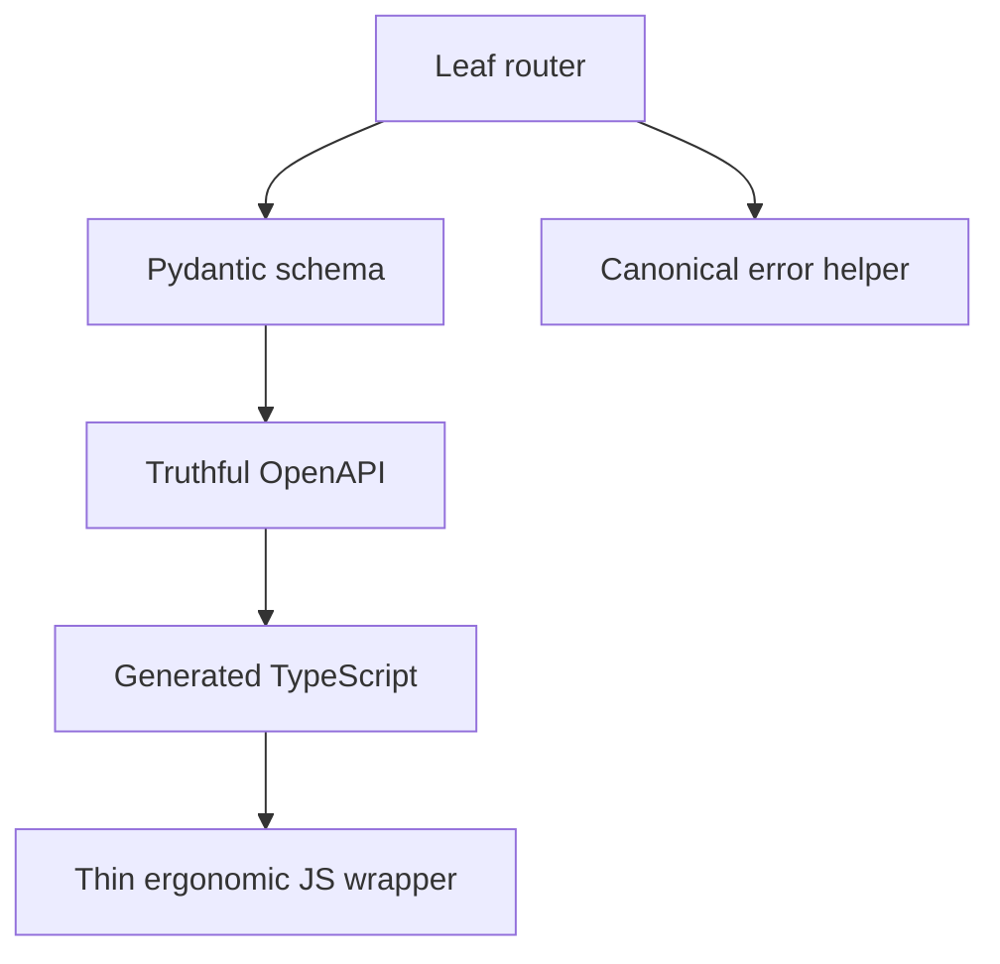

# PRD-004: API Consumer And API Maintainer DX

## TL;DR
1. Make the Flow API understandable and evolvable without reading backend source.
2. Fix flow-specific OpenAPI issues at endpoint/schema source before generated frontend type migration.
3. Align evidence export, pagination, errors, idempotency, upload schemas, and JS client wrappers.
4. Centralize API maintainer playbook for endpoints, schemas, permissions, errors, tests, and generated clients.
5. This PRD is a prerequisite for generated frontend contracts.

## Problem

The API supports the basic external developer loop, but advanced workflows and generated client quality are weak. Agent E found the happy path works while per-step file intent, rerun, review/resume, generated client types, and evidence download semantics are incomplete (`docs/refactor/phase1/05-api-consumer.md:1-8`).

API maintainability is split across router aggregators, route-local helpers, OpenAPI postprocessing, duplicated error helpers, and handwritten client wrappers (`docs/refactor/phase1/09-api-maintainer.md:3-8`). Gemini specifically rejected hiding flow-specific OpenAPI upload fixes in postprocessing and required fixing endpoint signatures/models at source (`docs/refactor/phase3/gemini-review.md:24-25`).

## Goals

- Fix flow-specific OpenAPI schema issues at endpoint/schema owners.
- Align evidence export declared response with actual content type/body.
- Add `has_more` or `total_count` to list endpoints.
- Add missing JS client method for published runtime view.
- Define idempotency retention and read-side semantics.
- Create API maintainer playbook and contract test expectations.

## Non-goals

- Do not implement rerun or human review endpoints here.
- Do not migrate frontend workflow state ownership here.
- Do not add generic API versioning framework beyond Flow pre-production policy.

## Users

- external API consumer: gets predictable docs, pagination, errors, and SDK behavior.
- backend maintainer: gets route/schema/error/permission/test playbook.
- frontend maintainer: gets generated schema that can become canonical.
- operations maintainer: gets clearer error/idempotency semantics.
- new senior developer: can add an endpoint by following one pattern.

## Current State

| Area | Evidence | Problem |
|---|---|---|
| Published runtime JS method | Backend exposes `GET /flows/{id}/published/`, but Agent E found no `flows.published` method in `flows.js` (`docs/refactor/phase1/05-api-consumer.md:40-60`). | SDK consumer must know URL. |
| Pagination | List endpoints document `count` as current page count (`docs/refactor/phase1/05-api-consumer.md:30-40`, `docs/refactor/phase3/gemini-review.md:27-28`). | Consumers cannot reliably page. |
| Evidence export | Route declares a JSON response model but returns attachment response (`docs/refactor/phase1/05-api-consumer.md:160-190`). | Generated clients disagree with runtime. |
| OpenAPI patches | `server/main.py` rewrites flow upload multipart schema globally (`docs/refactor/phase1/09-api-maintainer.md:214-216`). | Endpoint owner is obscured. |
| Errors | AI Builder duplicates `GeneralError` helper and routes can still leak non-canonical `{"detail": ...}` shapes (`docs/refactor/phase1/09-api-maintainer.md:163-198`). | Error contract is close but not single-owner. |

## Proposed Future State

## Requirements

### Functional Requirements

- [ ] Public SDK exposes published runtime view.
- [ ] List endpoints expose `has_more` or `total_count`.
- [ ] Evidence export behavior matches OpenAPI.
- [ ] Upload endpoints generate correct multipart schema from endpoint/model source.

### Maintainability Requirements

- [ ] Leaf routers own endpoint behavior; pure callable re-exports are removed.
- [ ] One error example/helper is used for Flow and AI Builder JSON endpoints.
- [ ] API maintainer playbook documents endpoint addition workflow.

### Reliability Requirements

- [ ] Idempotency retention semantics are explicit and tested.
- [ ] Upload and run creation error codes are stable.

### API Requirements

- [ ] Operation IDs, tags, paths, response models, status codes, and examples are pinned.
- [ ] Pagination semantics are consistent across list endpoints.
- [ ] Breaking changes are allowed pre-production but documented.

### Data Model Requirements

- [ ] Idempotency TTL/retention aligns with DB indexes and cleanup.

### Frontend Requirements

- [ ] Generated schema becomes reliable enough for PRD-006 to consume.
- [ ] JS wrapper no longer deletes path-owned fields from typed request objects.

### Testing Requirements

- [ ] OpenAPI contract tests cover upload schema, evidence export, error examples, pagination fields, and generated-client-sensitive schemas.
- [ ] JS wrapper tests cover published runtime method and idempotency header/body behavior.

## Design

### Evidence Export Decision

| Option | Pros | Cons | Default |
|---|---|---|---|
| JSON API response with export payload | SDK-friendly, schema simple. | Browser download requires client-side file creation. | Choose if external API consumers are primary. |
| Attachment download endpoint | Browser-friendly. | Generated clients need blob/download metadata, not JSON model. | Choose only if OpenAPI accurately describes it. |
| Two endpoints | Clear for both. | More surface area. | Consider only if both use cases are first-class. |

### API Maintainer Playbook

Every endpoint PR must state:

- path and operation ID
- request/response schema owner
- permission action
- error codes/examples
- idempotency behavior if mutating
- pagination/filtering/sorting if listing
- OpenAPI/generated-client impact
- contract tests

## Alternatives Considered

| Alternative | Decision | Reason |
|---|---|---|
| Keep global OpenAPI patches but name them better. | Rejected for flow-specific upload fixes. | Gemini correctly said this masks source flaws (`docs/refactor/phase3/gemini-review.md:24-25`). |
| Document current-page `count`. | Rejected. | API consumer DX needs `has_more` or `total_count` (`docs/refactor/phase3/gemini-review.md:27-28`). |
| Keep handwritten frontend wrapper types as canonical. | Rejected. | They duplicate generated schemas and drift (`docs/refactor/phase1/03-frontend.md:61-107`). |

## Acceptance Criteria

- [ ] Flow-specific OpenAPI postprocessing is removed or reduced to zero for upload/evidence.
- [ ] Evidence export declared response matches actual response.
- [ ] Pagination response has `has_more` or `total_count`.
- [ ] `flows.published` exists in JS wrapper.
- [ ] Idempotency retention is documented and tested.
- [ ] Error examples use one canonical helper.
- [ ] API maintainer playbook exists.

## Implementation Checklist

- [ ] Add/adjust OpenAPI contract tests.
- [ ] Fix upload endpoint schema source.
- [ ] Decide evidence export response model.
- [ ] Add pagination field.
- [ ] Add published runtime wrapper method.
- [ ] Define idempotency retention.
- [ ] Replace duplicated error helpers.
- [ ] Document maintainer playbook.
- [ ] Regenerate TypeScript schema in a separate generated-output diff if required.

## Phase 7 API Contract Hardening

| Contract | Decision | Acceptance criteria |
|---|---|---|
| Run file mapping | `step_inputs[step_id].file_ids` is the only create-run request shape. | OpenAPI, examples, `intric-js`, frontend, tests, and idempotency derivation remove top-level `file_ids` together. |
| Legacy file mapping error | Clients still sending top-level `file_ids` receive named error during the breaking-change batch. | Contract test asserts `flow_run_legacy_file_ids_not_supported`; no generic validation text. |
| Idempotency | Request fingerprint includes canonical payload, normalized `step_inputs`, principal scope, flow/version, and `request_fingerprint_algo_version`. | Same key/same payload returns same run; same key/different payload returns conflict; SDK derivation has golden vectors. |
| Evidence export | Historical lineage may preserve old payload keys by evidence schema version, but new request docs do not advertise them. | Evidence export schema version and secret redaction are pinned. |
| Generated clients | Backend OpenAPI is source of truth; handwritten Flow runtime types are deleted or become generated aliases. | `resources.d.ts` manual Flow block no longer defines public API shapes after PRD-004/006. |

## API Maintainer Playbook Additions

- Add endpoint/action to the Flow policy matrix before adding a route.
- Declare whether an endpoint asserts authorization or list-filters authorized rows; do not leave this implicit in route-local scope reads.
- Add OpenAPI contract test before generating TypeScript.
- Add negative authorization and service-key cases for every new lifecycle action.
- Add idempotency conflict behavior before adding queue dispatch.
- Do not add compatibility aliases for pre-production clients; update the generated client and app together.

## Risks

| Risk | Mitigation |
|---|---|
| Generated client changes break frontend. | Separate generated output and update wrapper aliases deliberately. |
| `total_count` is expensive. | Prefer `has_more` if counts are costly. |
| Evidence export change breaks browser behavior. | Choose attachment or JSON explicitly and update caller tests. |

## Rollback / Recovery

If OpenAPI source fixes break generated clients, rollback generated output and keep source fix branch isolated. If pagination count is too expensive, switch to `has_more` without changing the list contract shape again.

## Dependencies

- PRD-001 characterization tests.
- PRD-002 permissions for endpoint policy.
- Blocks PRD-006 generated frontend types.

## Open Questions

| Question | Default Recommendation |
|---|---|
| Evidence export JSON or attachment? | Prefer JSON for SDK unless browser download is the primary contract. |
| `has_more` or `total_count`? | Prefer `has_more` for performance unless product requires exact total. |
