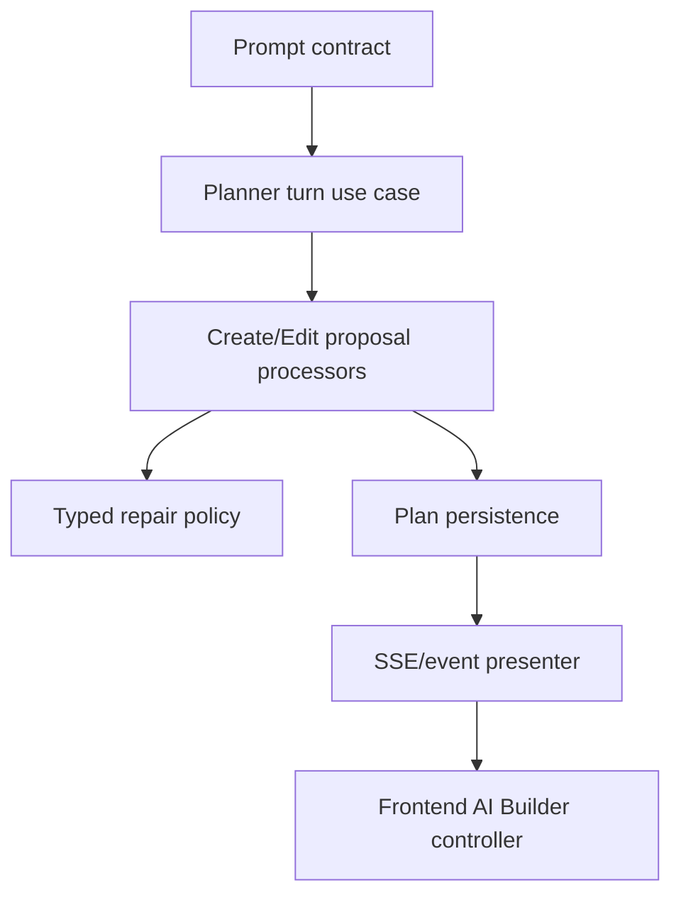

# PRD-005: AI Builder Architecture

## TL;DR
1. AI Builder needs contract ownership before broad module splitting.
2. Prompts, plan/spec/envelope models, repair behavior, and materialization are runtime contracts.
3. Split proposal processing and planner turns by lifecycle responsibility, not by fake interfaces.
4. Remove star-barrel/manual protocol drift only after generated API contracts are stable.
5. Success is a builder architecture a new senior engineer can trace from prompt to applied flow.

## Problem

AI Builder is one of the largest maintainability hotspots. Phase 2 names proposal processing and planner turn ownership as high-ROI changes (`docs/refactor/phase2/synthesis.md:59-60`). Claude also flagged that no independent reviewer was clearly assigned to the AI Builder prompt surface, which means code could be refactored while prompt behavior regresses (`docs/refactor/phase3/claude-review.md:44`, `:68`).

The dead-code review warns that `ai_builder_models.py` star-barrel deletion is not the same as deleting small import shims; it is a larger migration tied to AI Builder contract ownership (`docs/refactor/phase3/reconciled-plan.md:34-36`, `:70-79`).

## Goals

- Treat AI Builder prompt, plan envelope, proposal, materialization, repair, and event stream contracts as first-class.
- Split proposal processor into create/edit/repair/persistence/event responsibilities.
- Split planner turn lifecycle into a reviewable use case with explicit lock, commit, telemetry, and error semantics.
- Delete compatibility paths only when canonical policy/action owners are established.
- Align backend API models with generated frontend types and frontend workflow state.

## Non-goals

- Do not redesign the product UX.
- Do not remove active LLM repair paths that protect real invalid model output.
- Do not create interfaces solely for mocking.
- Do not migrate frontend state ownership in this PRD; coordinate with PRD-006.

## Users

- external API consumer: less direct, but benefits from stable AI Builder-generated flow definitions.
- backend maintainer: can trace builder plan lifecycle.
- frontend maintainer: gets stable API/event contract.
- operations maintainer: gets telemetry for failed/repaired turns.
- new senior developer: can understand builder responsibilities in week one.

## Current State

| Area | Evidence | Problem |
|---|---|---|
| AI Builder center of gravity | Agent A identifies proposal processor, planner, router SSE wrapping, frontend Driver/Service state, and protocol duplication as core risks (`docs/refactor/phase2/synthesis.md:32`). | Responsibilities cross backend and frontend. |
| Repair paths | Agent D says many repair loops protect active LLM boundaries and are not dead code (`docs/refactor/phase1/04-dead-and-legacy.md:97-107`). | Deletion must distinguish repair from stale compatibility. |
| API Builder router | API maintainer review shows `ai_builder_router.py` owns auth helpers, streaming, error events, audit, and OpenAPI concerns (`docs/refactor/phase1/09-api-maintainer.md:52-53`). | Router is too thick. |
| Frontend protocol | Frontend review finds AI Builder redefines generated-like plan/status types manually (`docs/refactor/phase1/03-frontend.md:81-83`). | Contract drift. |

## Proposed Future State

## Requirements

### Functional Requirements

- [ ] Create, revise, approve, apply, and open-flow behavior remains intact.
- [ ] Structured question and repair flows remain supported where active.
- [ ] Stale revision and session ownership errors stay typed.

### Maintainability Requirements

- [ ] Prompt contracts, plan envelopes, proposal processors, and event presenters have separate owners.
- [ ] No fake one-method interfaces are introduced.
- [ ] `ai_builder_models.py` star-barrel migration is its own reviewable slice.

### Reliability Requirements

- [ ] Planner turn lock, commit, rollback, telemetry, and error behavior are explicit.
- [ ] Repair attempts have metrics/logs and max retry behavior.

### API Requirements

- [ ] AI Builder router owns only HTTP/SSE adaptation.
- [ ] AI Builder error examples use canonical error helper where JSON applies.
- [ ] SSE error event shape is documented and tested.

### Data Model Requirements

- [ ] Builder plan/session JSON shape changes are versioned.

### Frontend Requirements

- [ ] Frontend protocol types use generated schemas where possible.
- [ ] Frontend state ownership changes are coordinated with PRD-006.

### Testing Requirements

- [ ] Backend AI Builder create/revise/approve/apply integration test.
- [ ] Prompt/contract regression tests for stable prompt obligations where feasible.
- [ ] SSE event order/error tests.

## Design

### Module Ownership

| Concept | Canonical Owner |
|---|---|
| Prompt instructions and knowledge-pack contracts | `docs/refactor` prompt-contract review first, then AI Builder prompt module/docs plus tests. |
| Planner turn | Concrete planner turn use case owning lock acquisition, prompt assembly boundary, LLM call, plan-state mutation, persistence commit, telemetry, and error translation. |
| Create proposal processing | Concrete create proposal processor owning create-only plan/proposal validation and event production. |
| Edit proposal processing | Concrete edit proposal processor owning edit-only proposal validation, diff semantics, and event production. |
| Repair policy | Domain-specific repair policy owning retry budget, repair reason, typed failure, and telemetry. |
| Persistence | Plan/session application service or repository methods with explicit transaction ownership. |
| SSE formatting | Router/presenter adapter only; it formats events and does not own planner behavior. |

Prompt-as-contract deliverable: create a review artifact before code splitting, for example `docs/refactor/ai-builder-prompt-contract.md`, that lists prompt assembly inputs, knowledge-pack rules, required tool/plan obligations, repair-policy obligations, and the tests/fixtures that protect those obligations. Exact LLM prose snapshots are not required; contractual obligations are required.

## Alternatives Considered

| Alternative | Decision | Reason |
|---|---|---|
| Start by deleting AI Builder star barrel. | Rejected as first step. | It may involve many import sites and should follow contract ownership. |
| Keep proposal processor large and add comments. | Rejected. | Long lifecycle code is the maintainability problem; comments would hide ownership issues. |
| Remove repair loops as AI slop. | Rejected broadly. | Repair handles active LLM boundary failures; delete only stale compatibility signals. |

## Acceptance Criteria

- [ ] Prompt-as-contract review artifact exists with prompt assembly contract, repair-policy obligations, knowledge-pack rule fixtures, and test plan.
- [ ] Planner turn lifecycle has one owner.
- [ ] Proposal create/edit/repair responsibilities are separated.
- [ ] Router SSE wrapper is thin.
- [ ] AI Builder generated/manual type drift is resolved or queued behind PRD-006.
- [ ] Tests cover create/revise/approve/apply and repair failures.

## Implementation Checklist

- [ ] Inventory prompt files and prompt obligations.
- [ ] Add prompt/plan contract tests where stable.
- [ ] Extract repair policy.
- [ ] Split create/edit proposal processing.
- [ ] Extract planner turn use case.
- [ ] Thin AI Builder router.
- [ ] Migrate `ai_builder_models.py` imports after owners are clear.
- [ ] Align frontend protocol types.

## Risks

| Risk | Mitigation |
|---|---|
| LLM behavior changes under refactor. | Prompt contract fixtures and side-by-side behavior tests. |
| Splitting creates shallow modules. | Only extract lifecycle responsibilities with stable inputs/outputs. |
| SSE behavior regresses. | Event order tests and frontend journey test. |

## Rollback / Recovery

Land extraction slices behind existing public behavior. If a split changes planning behavior, revert that slice and keep prompt contract tests to isolate the change.

## Dependencies

- PRD-001 foundations.
- PRD-004 API/OpenAPI.
- PRD-006 generated type ownership and frontend state coordination.

## Open Questions

| Question | Default Recommendation |
|---|---|
| How stable can prompt regression tests be with LLM output? | Test prompt assembly and tool/contract obligations; avoid brittle exact-output tests. |
| Does planner turn become a new class or function module? | Choose concrete code with a clear transaction boundary; no interface unless two real implementations exist. |
