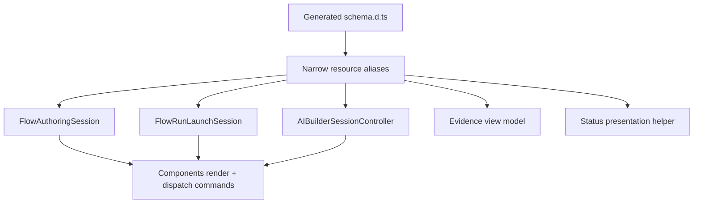

# PRD-006: Frontend Single Source Of Truth

## TL;DR
1. Flow frontend state has multiple owners across route pages, controllers, services, drivers, dialogs, and components.
2. Generated OpenAPI types must become canonical after PRD-004 fixes OpenAPI source issues.
3. AI Builder Driver/Service state mirroring must be removed.
4. Flow authoring, run launch, evidence, and status rendering need one owner each.
5. Success is components that render state and send typed commands instead of orchestrating domain workflows.

## Problem

Agent C scored frontend architecture below the refactor-required threshold because authoring state, run-launch state, evidence state, and AI Builder state have multiple owners (`docs/refactor/phase1/03-frontend.md:3-8`). The strongest type-safety issue is manual Flow type definitions in `resources.d.ts` despite generated OpenAPI schemas already existing (`docs/refactor/phase1/03-frontend.md:61-107`).

AI Builder specifically has mirrored Driver/Service state: `FlowAIBuilderService.svelte.ts` declares `$state` fields and copies Driver state via `#applyState`, while Driver also owns full mutable state (`docs/refactor/phase1/03-frontend.md:109-156`). Claude challenged the exact Service-vs-route owner decision, so the final rule is not "Service must own state"; it is "one owner only, no mirrored mutable state" (`docs/refactor/phase3/reconciled-plan.md:176-179`).

## Goals

- Replace manual Flow runtime types with generated aliases after OpenAPI is truthful.
- Choose one AI Builder state owner and delete Driver/Service mirroring.
- Deepen `FlowEditor` or another explicit authoring session as the only authoring state owner.
- Extract run launch workflow state from `FlowRunDialog.svelte`.
- Use one generated-type-backed status/evidence presentation layer.

## Non-goals

- Do not rewrite the whole frontend or introduce a new global state library.
- Do not add UI for pause/rerun/review before backend states exist.
- Do not type arbitrary user/LLM output beyond owned envelopes.
- Do not mix generated file churn with large handwritten refactors in one diff.

## Users

- external API consumer: indirectly benefits from generated-client consistency.
- backend maintainer: sees frontend contract drift caught by typecheck.
- frontend maintainer: gets one workflow owner per feature.
- operations maintainer: gets UI states that reflect real backend lifecycle.
- new senior developer: can find state entry points quickly.

## Current State

| Concept | Evidence | Problem |
|---|---|---|
| Manual types | `resources.d.ts:153-530` manually defines Flow types while generated schemas exist (`docs/refactor/phase1/03-frontend.md:69-83`). | Two API contract owners. |
| AI Builder state | Service mirrors Driver state (`docs/refactor/phase1/03-frontend.md:117-127`). | Parallel mutable state. |
| Authoring state | Route, `FlowEditor`, panels, form schema editor, and AI Builder apply callback mutate state (`docs/refactor/phase1/03-frontend.md:158-209`). | Reviewers must trace many mutation paths. |
| Run launch | `FlowRunDialog.svelte` owns contract loading, files, recording, wizard pages, blockers, idempotency, and submit (`docs/refactor/phase1/03-frontend.md:55-58`). | Component is orchestrator and view. |
| Evidence/status | Evidence and status helpers parse records and duplicate status logic (`docs/refactor/phase1/03-frontend.md:39-41`). | State/status drift. |

## Proposed Future State

## Requirements

### Functional Requirements

- [ ] Existing authoring, run launch, evidence view, and AI Builder flows keep working.
- [ ] User-visible controls reflect real generated/backend states.

### Maintainability Requirements

- [ ] One mutable owner per workflow.
- [ ] Components do not mutate flow resource arrays or metadata directly.
- [ ] No field-by-field state copying between Driver and Service.

### Reliability Requirements

- [ ] Polling/cancel/redispatch behavior uses lifecycle helper, not inline status strings.
- [ ] Generated type drift fails typecheck.

### API Requirements

- [ ] Frontend aliases reference generated schemas from PRD-004.
- [ ] Wrapper request/response typing matches OpenAPI operations.

### Data Model Requirements

- [ ] None directly; frontend should not invent states absent from persisted backend model.

### Frontend Requirements

- [ ] AI Builder controller owns create/refresh/stream/apply/abort state.
- [ ] Authoring session owns active step, validation, metadata/form schema, step commands, publish readiness.
- [ ] Run launch session owns file selection, wizard state, idempotency, submit.
- [ ] Evidence view model owns grouping/parsing.

### Testing Requirements

- [ ] Component or integration tests for AI Builder apply-to-flow, authoring edit/autosave, run launch submit, evidence rendering, and status controls.

## Design

### Ownership Decisions

| Workflow | Owner | Components Do |
|---|---|---|
| AI Builder | One controller, chosen during implementation; Driver can be stateless transport/parser or Service can be deleted. | Render state and invoke controller commands. |
| Flow authoring | `FlowEditor` deepened into authoring session or renamed only after behavior moves. | Emit typed edit commands. |
| Run launch | `FlowRunLaunchSession`. | Render dialog pages and command buttons. |
| Evidence/status | Generated evidence types plus view model/status helper. | Render typed view models. |

### Generated Type Migration Checklist

| Manual Surface | Replacement |
|---|---|
| Manual flow resource definitions in `frontend/packages/intric-js/src/types/resources.d.ts:153-172` | Alias generated flow schemas or document UI-only resource shape. |
| Manual run contract definitions in `resources.d.ts:241-276` | Alias generated `FlowRunContractPublic` and related schemas. |
| Manual run/status definitions in `resources.d.ts:295-313` | Alias generated `FlowRunPublic`, `FlowRunStatus`, and request/response schemas. |
| Manual evidence/debug definitions in `resources.d.ts:490-520` | Alias generated evidence schemas or PRD-004 corrected export schema. |
| AI Builder manual target/status/plan/step models in `protocol.ts` | Alias generated AI Builder schemas where they are HTTP/SSE contracts; keep only UI-only view models. |

Generated schema rollback gate: if regeneration exposes an unintended public name, duplicated schema, or invalid optionality, do not hide it with a handwritten frontend type. Fix the backend schema/source name in PRD-004 or add an explicit alias mapping with owner, removal condition, and generated-client test.

## Alternatives Considered

| Alternative | Decision | Reason |
|---|---|---|
| Keep Driver and Service mirrored for compatibility. | Rejected. | Parallel mutable state violates SSoT (`docs/refactor/phase1/03-frontend.md:109-156`). |
| Make route page own all state. | Partial. | Could work for Svelte 5, but route must not become a dumping ground; one owner per workflow remains mandatory. |
| Rewrite with a new state library. | Rejected. | Existing Svelte patterns can work once ownership is clarified (`docs/refactor/phase2/synthesis.md:187`). |

## Acceptance Criteria

- [ ] Manual Flow runtime types become generated aliases or documented UI-only types.
- [ ] Deleted manual type surfaces are enumerated and mapped to generated aliases.
- [ ] Generated schema rollback behavior is documented for bad public names or optionality.
- [ ] AI Builder Driver/Service mirroring is removed.
- [ ] Route page no longer directly mutates flow steps or metadata.
- [ ] `FlowRunDialog.svelte` no longer owns full run-launch workflow.
- [ ] Status logic is centralized and generated-type-backed.
- [ ] Component journey tests cover critical workflows.

## Implementation Checklist

- [ ] Complete PRD-004 OpenAPI fixes.
- [ ] Replace `resources.d.ts` manual Flow blocks with generated aliases.
- [ ] Align AI Builder protocol types with generated schemas.
- [ ] Choose AI Builder state owner and delete mirroring.
- [ ] Move authoring mutations into authoring session commands.
- [ ] Extract run launch session.
- [ ] Type evidence view model.
- [ ] Add frontend tests.
- [ ] After the `jsdom` baseline issue is fixed, document the canonical Flow frontend validation command in PRD-007 and require it for state-owner refactors.

## Phase 7 Frontend Readiness Updates

| Area | Decision | Acceptance criteria |
|---|---|---|
| Manual Flow API types | Delete or map to generated aliases after OpenAPI source fixes. | `frontend/packages/intric-js/src/types/resources.d.ts:153` no longer owns Flow runtime API contracts. |
| Run launch file mapping | UI builds only `step_inputs`; no top-level `file_ids` branch. | `FlowRunDialog`/client tests assert non-contiguous step-file mapping and generated client shape. |
| Evidence view | Frontend reads typed evidence projection, not raw `runtimeInput.file_ids` or `template_file_id`. | `flowEvidenceProvenance.ts` no longer depends on deleted backend payload internals for new evidence schema versions. |
| AI Builder state owner | Pick one mutable owner before splitting Driver/Service. | Service/Driver no longer mirror session state; tests pin create/plan/revise/apply and SSE done/error flow. |
| Frontend behavior pins | Critical run dialog, AI Builder apply confirmation, authoring state, and evidence route tests exist before state refactor. | `frontend/apps/web/tests/flows-runtime.spec.ts` or component tests cover launch, poll/result, and evidence display. |

## Risks

| Risk | Mitigation |
|---|---|
| Large frontend diff becomes hard to review. | Slice by workflow and keep generated output separate. |
| Generated schemas expose backend naming problems. | Fix backend schema in PRD-004 rather than adding manual frontend types. |
| Svelte reactivity breaks when state owner changes. | Add component tests before/with each workflow migration. |

## Rollback / Recovery

Rollback per workflow slice. Keep old controller until new controller passes component tests, then delete mirroring.

## Dependencies

- PRD-004 OpenAPI truth.
- PRD-005 AI Builder backend contract.

## Open Questions

| Question | Default Recommendation |
|---|---|
| Should AI Builder state owner be route, Service, or Driver? | Run a small implementation spike before editing. If inconclusive, default to Service/controller owning Svelte state and Driver acting as stateless transport/SSE decoder; invariant is one mutable owner only. |
| Should `FlowEditor` be renamed? | Defer rename until it clearly owns broader authoring session behavior. |
