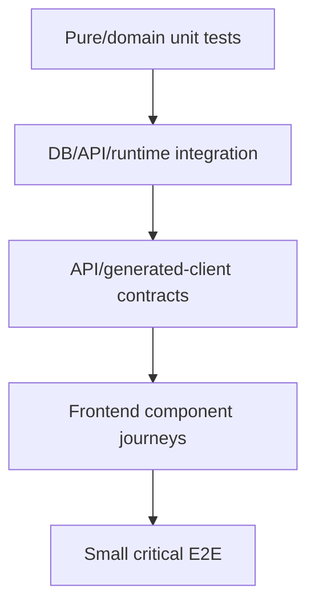

# PRD-007: Testing Strategy

## TL;DR
1. The test suite is broad but bottom-heavy and implementation-coupled.
2. Add small API/runtime/frontend contract tests before deleting or reshaping public contracts.
3. Replace private helper and mock-call assertions only after behavior coverage exists.
4. Do not add speculative tests for features before their runtime state model is designed.
5. Success is fewer brittle tests and stronger coverage at real seams.

## Problem

Agent H found 159 backend unit flow test files and 77,162 LOC versus 10 executable backend integration flow test files and 8,333 LOC (`docs/refactor/phase1/08-tests.md:31-39`). The highest-risk gap is the missing API-plus-worker contract proving create run, upload runtime files, dispatch, terminalization, evidence, artifacts, and audit rows together (`docs/refactor/phase1/08-tests.md:3-8`).

Tests also assert internals: router tests call endpoint functions directly and assert mocks; executor tests patch private methods and assert state internals (`docs/refactor/phase1/08-tests.md:107-160`). Claude flagged test inversion as a blocker for safe refactors (`docs/refactor/phase3/claude-review.md:38`).

## Goals

- Add contract tests at real seams before major refactors.
- Split huge tests by lifecycle/behavior.
- Delete tests that only protect source-only false owners after behavior replacements exist.
- Add frontend journey tests for critical AI Builder and runtime workflows.
- Keep speculative pause/rerun tests deferred until backend state contracts exist.

## Non-goals

- Do not chase coverage percentage.
- Do not create slow broad E2E suites for every branch.
- Do not snapshot incidental current JSON/DOM output before contracts are cleaned.

## Users

- external API consumer: gets protected public contracts.
- backend maintainer: can refactor internals without brittle test failures.
- frontend maintainer: gets journey coverage for state ownership changes.
- operations maintainer: gets crash recovery and terminalization tests.
- new senior developer: can understand expected behavior from test names.

## Current State

| Area | Evidence | Problem |
|---|---|---|
| Unit-heavy backend | 159 unit files vs 10 integration files (`docs/refactor/phase1/08-tests.md:31-39`). | Cross-layer behavior not protected. |
| Runtime contract | Missing one external-consumer runtime contract (`docs/refactor/phase1/08-tests.md:63-72`). | Terminalization refactors are risky. |
| Router tests | Direct endpoint calls and mock assertions (`docs/refactor/phase1/08-tests.md:107-137`). | Tests fail on harmless adapter changes. |
| Frontend E2E | One placeholder spec (`docs/refactor/phase1/08-tests.md:35-39`). | Critical journeys absent. |
| Tooling baseline | Backend collect/pyright pass, frontend check and Vitest have baseline issues (`docs/refactor/phase1/08-tests.md:39`). | Separate environment/tooling from product gaps. |

## Proposed Future State

## Requirements

### Functional Requirements

- [ ] Public run lifecycle is covered through API/runtime.
- [ ] API consumer contract includes upload, create, poll, step output, evidence/artifact, errors, idempotency.
- [ ] Frontend AI Builder and run launch journeys are covered.

### Maintainability Requirements

- [ ] Tests assert behavior, not private method calls.
- [ ] Huge test files are split by lifecycle where it improves reviewability.
- [ ] Compatibility identity tests are deleted after shims are removed.

### Reliability Requirements

- [ ] Worker crash, duplicate start, task timeout, reconciliation, and double terminalization are covered.

### API Requirements

- [ ] OpenAPI/generation contract tests cover endpoint names, schemas, errors, and examples.

### Data Model Requirements

- [ ] Migration tests cover row-shape deletion and parser versioning.

### Frontend Requirements

- [ ] Component tests cover state owner migrations.
- [ ] E2E stays focused on one or two critical journeys.

### Testing Requirements

- [ ] Each PRD names validation commands and known baseline caveats.

## Design

### Highest ROI Test Files

| Candidate | Purpose |
|---|---|
| `backend/tests/integration/flows/test_flow_runtime_worker_contract.py` | Published flow -> run -> worker execute -> evidence/artifacts/audit. |
| `backend/tests/integration/flows/test_flow_consumer_api_contract.py` | External API upload/create/poll/errors/idempotency. |
| `backend/tests/integration/flows/test_flow_step_file_mapping_contract.py` | Per-step files assigned to correct steps. |
| `backend/tests/integration/flows/test_flow_terminalization_contract.py` | Timeout/reconciler/double terminalization/open attempts. |
| `frontend/apps/web/tests/flows-runtime.spec.ts` | One critical runtime UI journey. |
| `frontend/apps/web/src/lib/features/flows/ai-builder/*.test.ts` | AI Builder apply-to-flow component journey. |

### Tests To Delete Or Rewrite After Replacement Coverage

| Test Surface | Action |
|---|---|
| `backend/tests/unit/test_server_startup_imports.py:74-95` shim re-export identity assertions | Delete after canonical imports and import/startup smoke coverage. |
| `backend/tests/unit/test_server_startup_imports.py:113-213` router callable identity assertions | Replace with route registration and operation ID tests. |
| `backend/tests/unit/test_server_startup_imports.py:37-49` template validation shim re-export assertion | Replace with import-boundary or startup cycle guard. |
| Legacy DOCX template asset compatibility tests in `backend/tests/unittests/flows/test_flow_template_asset_compatibility.py` | Delete after DB backfill and canonical asset tests. |
| `backend/tests/unittests/flows/http_transport/test_normalizer.py` legacy converter branches | Delete converter tests after DB proof/backfill; keep authored-config discriminator tests. |
| Direct router tests in `backend/tests/unittests/flows/test_flow_router.py` that assert `AsyncMock` delegation/call counts | Replace with HTTP contract tests where behavior is public. |

## Alternatives Considered

| Alternative | Decision | Reason |
|---|---|---|
| Add E2E for every feature first. | Rejected. | Slow/flaky and not needed; contract tests at real seams give better ROI. |
| Keep unit tests and avoid integration complexity. | Rejected. | Current risk is cross-layer behavior drift. |
| Delete brittle tests immediately. | Rejected. | Replace with behavior coverage first. |

## Acceptance Criteria

- [ ] API-plus-worker contract test exists.
- [ ] API consumer contract test exists.
- [ ] OpenAPI/generated-client contract tests cover PRD-004 surfaces.
- [ ] Dead shim identity tests are deleted after shim cleanup.
- [ ] Runtime private-method tests are reduced only after persisted behavior tests cover same risk.
- [ ] Frontend journey tests protect AI Builder and run launch state migrations.

## Dead And Unnecessary Flow Test Cleanup

Deleting tests is acceptable when the tests preserve code we intentionally delete. Do not delete tests that protect live persisted row readers, public API contracts, security, audit, idempotency, or runtime task schema.

| Test file / test | Evidence | Problem | Action | Replacement behavior test | Risk |
|---|---|---|---|---|---|
| Shim identity tests | `backend/tests/unit/test_server_startup_imports.py:37`, `:78-109`, `:257-301` | Preserve import shims/barrels rather than behavior. | Delete after canonical import/OpenAPI pins. | `backend/tests/unit/test_flow_openapi_contract.py`, canonical import smoke. | Low-medium. |
| OpenAPI/import side-effect tests in same startup file | Claude found route/operation/error and package-init purity pins in same file. | Easy to delete by accident with shim tests. | Keep/split. | Same OpenAPI contract file. | High if deleted wholesale. |
| Top-level `file_ids` tests | `flow_models.py:431-435`, `flows.js:67-93`, `test_flow_router.py:671`, `:716` | Preserve duplicate public request shape. | Rewrite to `step_inputs`; then delete old request-shape assertions. | `backend/tests/integration/flows/test_flow_step_file_mapping_contract.py`, `frontend/packages/intric-js/src/endpoints/flows.test.js`. | High. |
| HTTP normalizer tests | `backend/tests/unittests/flows/http_transport/test_normalizer.py:27-211` | Some branches protect live persisted rows, not dead code. | Rename as migration pins until DB proof/backfill; delete converter branches only after proof. | `test_flow_http_authored_config_contract.py`. | Medium. |
| Template `template_file_id` tests | Frontend `templateFillConfig.test.ts:90-110`; runtime `template_fill_runtime.py:294-299`. | Protect persisted template configs. | Keep as migration pins until backfill to `template_asset_id`. | Canonical template asset behavior test. | Medium. |
| Mock-heavy router tests | `backend/tests/unittests/flows/test_flow_router.py` | Many assertions are real security/audit/idempotency pins hidden behind mocks. | Rewrite as TestClient/integration tests before deletion. | `test_flow_consumer_api_contract.py`, `test_flow_tenant_isolation_contract.py`. | High. |
| Runtime private-method tests | `backend/tests/unittests/flows/test_flow_executor_runtime.py` | Coupled to executor internals. | Rewrite after worker/terminalization pins. | `test_flow_runtime_worker_contract.py`, `test_flow_terminalization_contract.py`. | High. |
| Celery task schema tests | Existing tests pin principal/API-key task kwargs. | Cross-process schema is runtime contract. | Keep until typed command payload replaces kwargs; then rewrite. | Worker command contract test. | High. |

See `docs/refactor/phase7/dead-tests-cleanup.md` for the full cleanup table.

## Behavior Pins Before Destructive Cleanup

| Pin | Test path | Behavior asserted | Fixtures needed | Type | Unlocks |
|---|---|---|---|---|---|
| Flow run + worker + audit | `backend/tests/integration/flows/test_flow_runtime_worker_contract.py` | Published run transitions to terminal state, every attempt closes, evidence is readable, audit/outbox event exists. | Published flow, assistant stub, Celery eager or worker harness, tenant/user. | Integration/worker | Executor split, terminalization command. |
| API start-run/poll/result | `backend/tests/integration/flows/test_flow_consumer_api_contract.py` | Upload file, create run with idempotency key, poll, read step output/result/evidence/artifact; error contracts for conflict/cross-tenant/schema mismatch. | TestClient, tenant isolation fixtures, uploaded file. | API integration | Router rewrite, OpenAPI cleanup, generated client. |
| Idempotency golden vector | `frontend/packages/intric-js/src/endpoints/flows.test.js` plus backend API test | Same key/payload returns same run; same key/different payload conflicts; SDK normalization is stable. | JS crypto fixture, API run fixture. | Client/API | `file_ids` deletion, fingerprint versioning. |
| Current file handling | `backend/tests/integration/flows/test_flow_step_file_mapping_contract.py` | Files mapped to step 1 do not leak to step 2; non-contiguous step mappings resolve correctly; invalid owner fails before run persists. | Multi-step flow, two files, principal. | API/runtime integration | Top-level `file_ids` deletion and relational file mapping. |
| Terminalization modes | `backend/tests/integration/flows/test_flow_terminalization_contract.py` | Timeout, stale reconciler, duplicate terminalization, cancel all close attempts once and emit one audit/outbox event. | Run with open attempt, fake clock/worker timeout. | Integration | Terminalization command and review/rerun features. |
| Permission matrix | `backend/tests/unittests/flows/test_flow_permissions.py` and `backend/tests/integration/flows/test_flow_tenant_isolation_contract.py` | User/service key/space/tenant roles for view/run/manage/review/resume/rerun/audit, including negative legacy alias cases. | Role/API-key fixtures. | Unit/API integration | Typed Flow policy. |
| AI Builder create/plan/revise/apply | Extend `backend/tests/integration/flows/test_ai_builder_session_api_regressions.py`, `test_ai_builder_apply_to_draft.py` | Session create, message, plan, revise, apply, SSE done/error payloads, double-apply CAS. | AI Builder session, LLM stub, flow draft. | Integration | AI Builder router/service/planner split. |
| Evidence/artifact retrieval | Extend `backend/tests/integration/flows/test_flow_evidence_api_contracts.py` | Evidence schema version, secret redaction, generated file lookup, historical lineage. | Run with generated file and secret output config. | API integration | Evidence export split, output file table. |
| Webhook delivery lifecycle | `backend/tests/integration/flows/test_flow_webhook_delivery_contract.py` | Model completion and webhook delivery cannot leave a completed run if webhook side effect failed or worker crashed between states. | HTTP step flow, fake webhook server/failure fixture. | Runtime integration | Explicit webhook pending/delivered/failed state. |
| Frontend critical routes/dialogs | `frontend/apps/web/tests/flows-runtime.spec.ts` or component tests | Run dialog launch/poll/result/evidence and AI Builder apply confirmation survive state owner refactor. | Mocked generated client or local app fixture. | Frontend journey/component | PRD-006 state refactor. |

Behavior pins can be rewritten from existing tests when they protect the same observable behavior. The implementation PR must tag each pin as `[new]` or `[rewrite]`.

## Implementation Checklist

- [ ] Fix or document frontend test environment blockers.
- [ ] Add backend runtime worker contract.
- [ ] Add API consumer contract.
- [ ] Add terminalization/crash recovery contract.
- [ ] Add generated-client tests.
- [ ] Add frontend journey tests.
- [ ] Split huge tests by lifecycle where needed.
- [ ] Delete compatibility-only tests after source deletion.

## Risks

| Risk | Mitigation |
|---|---|
| Integration tests become slow. | Keep one happy path and focused failure cases. |
| Tests freeze current bad API behavior. | Mark pinned-bad behavior with owning PRD and update/delete during cleanup. |
| Frontend test env remains broken. | Separate environment fix from product coverage. |

## Rollback / Recovery

If a new integration test is flaky, quarantine it only with a tracked issue and replace sleeps with deterministic DB/state conditions before relying on it as a gate.

## Dependencies

- PRD-001 foundations.
- PRD-004 API contract.
- PRD-006 frontend state for journey tests.

## Open Questions

| Question | Default Recommendation |
|---|---|
| Should Playwright run in CI for these journeys? | Add one smoke journey once stable; keep most coverage in component/integration tests. |
| What frontend test command is canonical? | Fix `jsdom` baseline and document package-specific command. |
