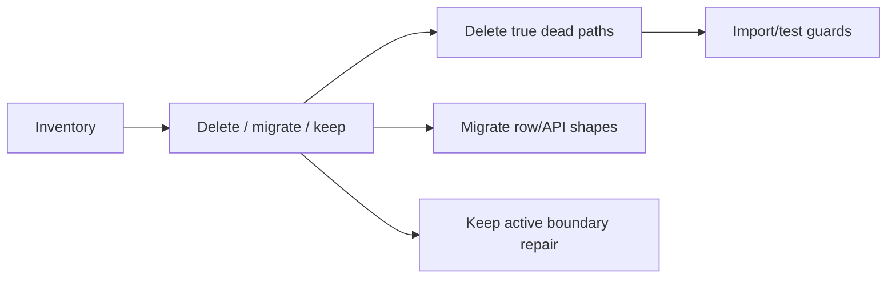

# PRD-008: Dead Code, Comments, And Readability

## TL;DR
1. Delete false owners, stale compatibility, restating comments, and tests for removed behavior.
2. Do not mechanically split files by LOC; split only by lifecycle or canonical ownership.
3. Preserve intent comments for external boundaries, migrations, and non-obvious decisions.
4. Remove frontend/backend compatibility cleanup only after API or DB migration gates.
5. Success is code a senior engineer can understand in week one.

## Problem

The codebase contains false import owners, router re-export surfaces, stale compatibility comments, and tests that preserve old architecture. Agent D identifies high-confidence delete candidates but also warns that public/persisted compatibility needs migration gates (`docs/refactor/phase1/04-dead-and-legacy.md:3-8`).

Readability issues are not just comments. Phase 2 and Agent G identify large lifecycle files and comments compensating for unclear ownership as the real problem (`docs/refactor/phase2/synthesis.md:67`, `docs/refactor/phase1/07-comments-readability.md:1-8`).

## Goals

- Delete true dead code and false compatibility surfaces.
- Delete or rewrite tests that only preserve deleted import identity or compatibility paths.
- Classify and clean comments: keep intent, remove restating/outdated comments, ticket or resolve TODOs.
- Improve names and module boundaries where readability follows ownership.
- Scrub specialty/domain leakage only with product review for user-visible text.

## Non-goals

- Do not split files mechanically by line count.
- Do not remove active LLM repair paths as "dead" without replacement behavior tests.
- Do not delete persisted-shape fallbacks without migration proof.
- Do not perform broad cosmetic churn in the same PR as behavior changes.

## Users

- external API consumer: gets fewer legacy contracts.
- backend maintainer: follows canonical files.
- frontend maintainer: avoids hidden UI cleanup side effects.
- operations maintainer: sees intent comments for incidents/migrations.
- new senior developer: avoids alias/import traps.

## Current State

| Area | Evidence | Problem |
|---|---|---|
| Import shims | Agent D lists flow shims and canonical replacements (`docs/refactor/phase1/04-dead-and-legacy.md:60-64`). | Multiple import paths. |
| Router re-exports | `flow_consumer_router.py` and `flow_run_router.py` re-export endpoint callables (`docs/refactor/phase1/04-dead-and-legacy.md:65-70`). | Endpoint ownership is duplicated. |
| Public/persisted compatibility | Top-level `file_ids`, `template_file_id`, form types, principal `user_id` need migration gates (`docs/refactor/phase1/04-dead-and-legacy.md:80-95`). | Unsafe to delete like shims. |
| Comments | Stale redispatch alias and legacy focus comments are called out (`docs/refactor/phase1/04-dead-and-legacy.md:140-149`). | Comments preserve outdated claims. |
| Tests | Startup import identity tests preserve shims and router re-exports (`docs/refactor/phase1/04-dead-and-legacy.md:129-139`). | Tests protect architecture being deleted. |

## Proposed Future State

## Requirements

### Functional Requirements

- [ ] User-visible behavior does not change during pure deletion cleanup except intended pre-production API breaks owned by PRD-003/004.

### Maintainability Requirements

- [ ] One import path per canonical module.
- [ ] Compatibility paths have owner, deletion condition, and confidence.
- [ ] Comments explain why, not what.

### Reliability Requirements

- [ ] Runtime repair/fallback paths are kept when they protect active external/LLM boundaries.

### API Requirements

- [ ] Public API compatibility removal updates OpenAPI/client/docs/tests together.

### Data Model Requirements

- [ ] Persisted-shape fallback deletion requires zero-row proof or migration tests.

### Frontend Requirements

- [ ] UI cleanup effects for old data are deleted only after backend/data migration.

### Testing Requirements

- [ ] Delete identity tests only after route/import behavior tests exist.

## Design

### Deletion Classes

| Class | Example | Owner PRD |
|---|---|---|
| True shim | `flow_repo.py`, `flow_version_repo.py` | PRD-001 / PRD-008 |
| Public API cleanup | Top-level `file_ids` | PRD-003 / PRD-004 |
| Persisted data cleanup | `template_file_id`, old form types | PRD-002 / PRD-008 |
| Frontend stale alias | `getRedispatchFeedback` | PRD-008 |
| Active repair | AI Builder repair loops | PRD-005 |

## Alternatives Considered

| Alternative | Decision | Reason |
|---|---|---|
| Delete all compatibility in one sweep. | Rejected. | Public API and persisted row shapes need owning migrations/tests. |
| Keep comments and add more docs. | Rejected. | Comments that restate or preserve stale uncertainty are defects. |
| Split large files solely because they exceed 400 LOC. | Rejected. | Split by lifecycle and interface depth, not LOC alone. |

## Acceptance Criteria

- [ ] True shim imports are gone.
- [ ] Router callable re-export tests are replaced with route tests.
- [ ] Stale comments identified by Agent D are deleted with their branches.
- [ ] Compatibility paths that remain have deletion owner and gate.
- [ ] No active LLM repair path is deleted without behavior replacement.
- [ ] Large-file splits are tied to PRD-003, PRD-005, or PRD-006 ownership changes.
- [ ] No commented-out code remains in Flow / AI Builder source.
- [ ] No comments remain that merely restate function names, variable names, or control flow.
- [ ] No "temporary" comments remain without owner, removal condition, and PRD/work item.
- [ ] Every kept non-trivial comment explains intent, constraint, invariant, or trade-off.

## Executable Phase 7 Comment Cleanup

Comment classes:

- `intent`: explains why the code exists or records a non-obvious decision.
- `constraint`: explains ordering, idempotency, transaction, security, privacy, migration, or production debugging constraints.
- `restate`: describes what the code already says.
- `outdated`: stale, wrong, or misleading.
- `slop`: vague AI-style explanation, apology, uncertainty, or filler.
- `todo`: TODO/FIXME/XXX requiring a verdict.

Comment standard:

- Developers can read code.
- Comments should explain why, not what.
- Before adding a "what" comment, improve naming, extract a function, introduce a value object, or move the code to a better module.
- A comment is suspicious if deleting it would not make the code harder to understand.
- A comment is required if deleting it would hide a non-obvious invariant, trade-off, ordering constraint, or production/debugging concern.

| File | Intent/constraint comments to keep | Restating comments to delete | Outdated/slop comments to delete or rewrite | TODO verdict |
|---|---|---|---|---|
| `backend/src/intric/flows/runtime/executor.py` | Keep comments that describe claim/terminalization ordering, duplicate Celery delivery, and audit/event ordering. | Delete comments that narrate normal branch execution once terminalization is moved to a command. | Rewrite comments that explain fallback behavior after invalid state is replaced by typed state. | Convert runtime TODOs into PRD-003 checklist items or delete them with the branch. |
| `backend/src/intric/flows/flow_run_step_inputs.py` | Keep comments that explain why normalized `step_inputs` is the canonical pre-execution snapshot. | Delete comments narrating list/dict iteration. | Delete the legacy step-one adapter comments when top-level `file_ids` support is removed. | Any TODO must point to PRD-003 per-step file mapping. |
| `backend/src/intric/flows/infrastructure/flow_repo.py` | No Flow/AI Builder ARQ compatibility comment should remain after the repo method is classified. | None should be needed for simple repository calls. | Rewrite `Legacy ARQ-only method` language into a current caller contract or delete the method if unused. | No open TODO accepted. |
| `backend/src/intric/flows/ai_builder/ai_builder_planner.py` | Keep prompt-contract and LLM boundary comments that explain obligations, repair safety, or provider behavior. | Delete step-by-step comments that restate prompt assembly code. | Rewrite comments that apologize for parser uncertainty into typed repair/error contracts. | TODOs become PRD-005 work items. |
| `backend/src/intric/flows/ai_builder/ai_builder_proposal_processor.py` | Keep comments explaining irreversible plan mutation or validation invariants. | Delete narration around collection transforms and DTO construction. | Rewrite broad "fallback" comments after repair paths are classified as active LLM boundary repair or deleted. | TODOs become PRD-005 work items. |
| `backend/src/intric/flows/ai_builder/ai_builder_router.py` | Keep comments only where HTTP adapter behavior is intentionally different from application policy. | Delete comments restating dependency parsing, response creation, or endpoint names. | Delete comments that normalize raw `Request.state` scope reads once `FlowPrincipal` owns policy. | TODOs become PRD-002/004 policy work items. |
| `frontend/apps/web/src/lib/features/flows/FlowRunDialog.svelte` | Keep comments explaining browser/media/file API constraints if they remain. | Delete comments explaining local UI assignments after `FlowRunLaunchSession` owns workflow state. | Delete comments that preserve top-level `file_ids` or old evidence internals. | TODOs become PRD-006 workflow-owner work items. |
| `frontend/apps/web/src/lib/features/flows/ai-builder/FlowAIBuilderDriver.ts` | Keep SSE ordering/protocol comments if Driver remains the transport/parser. | Delete comments narrating state copies. | Delete comments that justify mirrored Service/Driver state once one owner is chosen. | TODOs become PRD-006 state-owner work items. |

## Implementation Checklist

- [ ] Run `rg` import checks for shim paths.
- [ ] Delete frontend stale redispatch alias.
- [ ] Delete or retarget flow package shims.
- [ ] Delete router callable re-exports.
- [ ] Replace identity tests.
- [ ] Add DB count/migration checklist for persisted-shape fallbacks.
- [ ] Classify comments during each owning refactor PR.
- [ ] Use `docs/refactor/phase7/comment-cleanup.md` as the execution inventory for the comment pass.
- [ ] Reject "what" comments in review unless the naming/extraction alternatives were tried first.

## Risks

| Risk | Mitigation |
|---|---|
| Deleting compatibility breaks local data. | Use DB count/backfill gates. |
| Readability cleanup creates noisy diffs. | Keep cosmetic cleanup separate from behavior changes. |
| Active repair code is mistaken for dead code. | Require boundary/failure-mode review before deletion. |

## Rollback / Recovery

If a deleted shim breaks an unanticipated import, prefer updating the importer to canonical path. Restore shim only if external package compatibility is explicitly accepted with a deletion date.

## Dependencies

- PRD-001 foundations.
- PRD-003/004 for public API cleanup.
- PRD-002 for persisted data cleanup.

## Open Questions

| Question | Default Recommendation |
|---|---|
| When should `flow.py` domain shim be deleted? | It is not part of the first true-shim deletion batch; delete only after production AI Builder imports move to `domain.flow` and `rg` proves zero non-canonical imports. |
| Should specialty-language defaults be deleted or product-reviewed first? | Product-review any user-visible text; delete test-only/internal leaks freely. |
