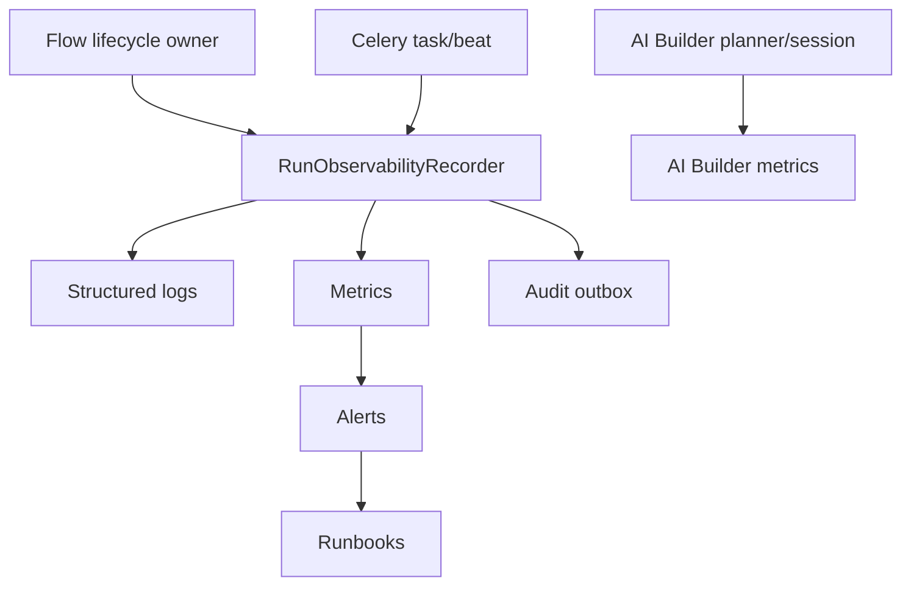

# PRD-009: Observability And Operability

## TL;DR
1. Flow runtime has logs and recovery primitives but no production-grade metric, alert, dashboard, or runbook contract.
2. Observability must hang off the lifecycle owner, not a generic manager.
3. Terminal audit durability needs an explicit fail policy.
4. Queue, beat, duplicate start, crash recovery, evidence audit, artifact audit, and AI Builder turn failures need separate signals.
5. Success is supportable incidents without reading runtime source first.

## Problem

Agent L scored flow run operability 3/10. Runtime has useful logs, CAS claims, and stale-running reconciliation, but no metric, alert, dashboard, or runbook contract (`docs/refactor/phase1/12-observability-operability.md:1-5`). Terminal audit is inconsistent: evidence access fails closed when audit logging fails, normal executor terminal audit fails open with warning, and task timeout/reconciliation emits no audit event (`docs/refactor/phase1/12-observability-operability.md:3`, `:159-173`).

Claude found the audit outbox and terminalization plan under-specified because it does not say fail-open or fail-closed when the audit boundary fails (`docs/refactor/phase3/claude-review.md:32`).

## Goals

- Add a typed observability recorder called from lifecycle/task boundaries.
- Define terminal audit outbox policy.
- Add metrics for terminalization, queue lag, duplicate starts, reconciler, audit failures, evidence/artifacts, provider calls, and AI Builder turns.
- Add flow runtime health endpoint/probe and runbooks.
- Keep AI Builder observability separate from flow run lifecycle observability.

## Non-goals

- Do not introduce a generic observability manager.
- Do not choose a new metrics backend without platform owner input.
- Do not route AI Builder turns through flow run lifecycle.
- Do not make logs the only audit durability mechanism.

## Users

- external API consumer: gets better status/error reliability indirectly.
- backend maintainer: gets clear metric/audit contracts.
- frontend maintainer: can reflect operational states accurately.
- operations maintainer: gets runbooks and dashboards.
- new senior developer: can debug lifecycle failures by signal, not source archaeology.

## Current State

| Surface | Evidence | Gap |
|---|---|---|
| Logs | Executor/task/dispatch logs exist (`docs/refactor/phase1/12-observability-operability.md:44-55`). | No stable metric/event schema. |
| Terminal audit | Executor audit catches and warns; evidence audit fails closed (`docs/refactor/phase1/12-observability-operability.md:51-52`). | Inconsistent policy. |
| Celery beat | Beat reconciles every 60 seconds (`docs/refactor/phase1/12-observability-operability.md:48-50`). | No beat heartbeat/runbook. |
| Health | Crawler has detailed health endpoint but flows do not (`docs/refactor/phase1/12-observability-operability.md:56-57`). | No flow runtime health. |
| Runbooks | Generic troubleshooting exists, no Flow/AI Builder runbooks (`docs/refactor/phase1/12-observability-operability.md:57`). | Operators must infer. |

## Proposed Future State

## Requirements

### Functional Requirements

- [ ] Runtime emits lifecycle metrics and structured logs with stable fields.
- [ ] Health probe reports queue, beat, stale queued/running, async loop, duplicate starts, and open attempts for terminal runs.
- [ ] Runbooks exist for stuck queued, stuck running, audit outage, beat failure, evidence denial, and AI Builder turn failure.

### Maintainability Requirements

- [ ] Observability recorder is small and typed.
- [ ] No generic `manager` or parallel terminalization path.
- [ ] Metric labels are controlled and low-cardinality.

### Reliability Requirements

- [ ] Implement the terminal audit fail policy defined in `PRD-003-runtime-reliability-and-feature-gaps.md`; PRD-003 is the source of truth because it owns the terminal state write.
- [ ] Outbox delivery failures alert and retry.
- [ ] Evidence audit remains fail-closed.

### API Requirements

- [ ] Evidence/artifact audit failure behavior is documented.

### Data Model Requirements

- [ ] Audit outbox has retry/delivery state if not already present.

### Frontend Requirements

- [ ] Frontend can show operationally meaningful statuses only after backend lifecycle states exist.

### Testing Requirements

- [ ] Recorder unit tests and runtime integration tests assert key metrics/audit behaviors.

## Design

### Fail Policy

The canonical fail-open/fail-closed table lives in `PRD-003-runtime-reliability-and-feature-gaps.md` because the owner of the terminal state write must own the commit policy. This PRD implements metrics, alerts, health checks, and runbooks for that policy.

## Alternatives Considered

| Alternative | Decision | Reason |
|---|---|---|
| Log-only observability. | Rejected. | Logs cannot guarantee terminal audit reconstruction. |
| Generic observability manager. | Rejected. | Signals must be emitted from lifecycle owners. |
| Fail-open terminal audit. | Rejected by default. | Compliance/support value of terminal audit is high; ADR required to choose otherwise. |

## Acceptance Criteria

- [ ] `RunObservabilityRecorder` or equivalent emits metrics from lifecycle/task boundaries.
- [ ] Terminal audit outbox behavior is tested.
- [ ] Flow runtime health probe exists.
- [ ] Runbooks exist and alert metrics link to them.
- [ ] AI Builder turn metrics are separate from flow run metrics.
- [ ] Local `celerybeat-schedule` hygiene is tracked as a small follow-up outside the core operability PR unless it blocks clean review.

## Phase 7 Celery And Outbox Readiness

Flow/AI Builder runtime standardizes on Celery. ARQ references outside Flow audit/worker platform code are not runtime options for Flow. The direct scoped Flow ARQ hit found in Phase 7 is the stale docstring at `backend/src/intric/flows/infrastructure/flow_repo.py:503`.

Claude's final review also identified the indirect shared audit path: `backend/src/intric/audit/application/audit_service.py:234-324` enqueues audit writes through ARQ Redis. Flow lifecycle audit must move to the relational outbox required by PRD-003. Existing non-lifecycle Flow audit calls through `audit_service.log_async` need an inventory and migration/default decision before the affected route/service is refactored; do not add new Flow lifecycle audit on top of ARQ.

Terminal audit cannot be a best-effort Redis enqueue if the runtime contract is "terminal state plus durable audit in one transaction." PRD-003 therefore requires a relational outbox or explicit ADR changing the fail policy.

Operational requirements:

- Flow terminalization emits exactly one outbox event per real transition.
- Duplicate terminalization returns `did_transition=false` and does not emit duplicate audit/metrics.
- Waiting-for-review runs have separate metrics and do not count as active worker slots.
- Review checkpoints have TTL/reconciliation metrics if the product enables expiry.
- Celery queue health and stale-running reconciliation distinguish `running` from `waiting_for_review`.

## Implementation Checklist

- [ ] Inventory Flow / Flow AI Builder `audit_service.log_async` callers and classify lifecycle vs non-lifecycle audit.
- [ ] Add audit outbox behavior or integrate existing audit infrastructure.
- [ ] Add recorder interface/concrete class only if it earns its existence.
- [ ] Emit terminalization metrics.
- [ ] Emit queue/beat/duplicate-start metrics.
- [ ] Add health endpoint/probe.
- [ ] Add runbooks.
- [ ] Add AI Builder turn metrics.
- [ ] Add tests.

## Risks

| Risk | Mitigation |
|---|---|
| Terminalization fails during audit outage. | Make policy explicit and alert. ADR if product chooses fail-open. |
| Metric cardinality explodes. | Labels use status/source/category, not raw errors or names. |
| Health probe depends on broker-specific APIs. | Always include DB-observable stale run counts. |

## Rollback / Recovery

If outbox insert failures cause unacceptable stuck runs, switch policy through ADR to fail-open with durable compensation record, not silent log-only behavior.

## Dependencies

- PRD-003 terminalization owner.
- PRD-002 lifecycle/status.

## Open Questions

| Question | Default Recommendation |
|---|---|
| Which metrics backend should be used? | Match platform standard; contract names can be adapted. |
| Is terminal audit compliance-critical enough to fail terminalization? | Yes by default; ADR required to change. |
