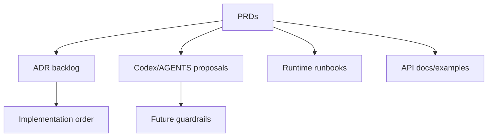

# PRD-010: Documentation And ADRs

## TL;DR
1. The refactor needs durable decisions, not only markdown review output.
2. ADRs should cover lifecycle, published definitions, terminal audit, generated types, permissions, runtime inputs, rerun, review, evidence export, compatibility deletion, and Eneo branding/namespace migration.
3. Documentation should serve implementation agents, maintainers, API consumers, and operators.
4. `AGENTS.md` changes are proposal-only until accepted by the user/team.
5. Success is future work following the architecture without re-reading the whole review.

## Problem

Phase 2 identified many ADRs needed (`docs/refactor/phase2/synthesis.md:195-208`). Phase 3 added stricter decisions around ordering, fail-open/fail-closed policy, OpenAPI source truth, relational extraction gates, and permission migration (`docs/refactor/phase3/reconciled-plan.md:80-175`). Without durable ADRs and agent rules, future implementation sessions can reintroduce shims, broad JSON bags, fake interfaces, raw scope reads, and duplicated frontend types.

## Goals

- Create ADR backlog and implementation-order docs.
- Propose Codex/AGENTS rules that prevent recurring maintainability defects.
- Document canonical homes and PRD dependencies.
- Add API maintainer and consumer playbooks.
- Add runtime runbooks through PRD-009.

## Non-goals

- Do not edit `AGENTS.md` directly in this planning session.
- Do not implement code guardrails here.
- Do not write long architecture prose without acceptance criteria.

## Users

- external API consumer: gets docs/examples once API PRDs land.
- backend maintainer: gets ADRs and playbooks.
- frontend maintainer: gets generated type and state rules.
- operations maintainer: gets runbooks and health docs.
- new senior developer: gets an index and canonical-home map.

## Current State

| Area | Evidence | Problem |
|---|---|---|
| ADR needs | Phase 2 lists ten ADR candidates (`docs/refactor/phase2/synthesis.md:195-208`). | Decisions are not durable. |
| Agent rules | Project instructions are strong but not yet tied to this review's canonical homes. | Future agents may recreate known patterns. |
| Runbooks | Flow/AI Builder runbooks absent (`docs/refactor/phase1/12-observability-operability.md:57`). | Operators lack incident docs. |
| API docs | Existing docs cover happy path but not advanced lifecycle/idempotency (`docs/refactor/phase1/05-api-consumer.md:30-60`). | Consumers need source for gaps. |

## Proposed Future State

## Requirements

### Functional Requirements

- [ ] Every implementation batch points to relevant PRDs and ADRs.
- [ ] API consumer docs are updated when contracts change.
- [ ] Runtime runbooks are created when observability lands.

### Maintainability Requirements

- [ ] Canonical homes are documented in one index.
- [ ] ADRs include alternatives and recommended default.
- [ ] Rule proposals include examples of violations and allowed usage.

### Reliability Requirements

- [ ] Runtime behavior docs include idempotency, retries, crash recovery, and rollback/recovery.

### API Requirements

- [ ] API maintainer playbook exists for endpoint/schema/permission/error/test/generated-client changes.

### Data Model Requirements

- [ ] New JSONB/table decisions require owner, version, migration, validation, corruption behavior, and tests.

### Frontend Requirements

- [ ] Generated type and state owner rules are documented.

### Testing Requirements

- [ ] Validation commands are listed for every implementation batch.

## Design

### ADR Backlog

| ADR | Related PRD |
|---|---|
| Flow Status Lifecycle Ownership | PRD-002 / PRD-003 |
| Published Flow Definition Contract | PRD-002 |
| Runtime Terminalization And Audit Durability | PRD-003 / PRD-009 |
| Flow API Type Generation Strategy | PRD-004 / PRD-006 |
| Flow Access Policy Actions | PRD-002 |
| Runtime File Mapping Contract | PRD-003 |
| Step Rerun Semantics | PRD-003 |
| Human Review/Pause Semantics | PRD-003 |
| Evidence Export Semantics | PRD-004 |
| Eneo Branding And Namespace Migration | PRD-010 |
| Compatibility Deletion Policy | PRD-001 / PRD-008 |

## Alternatives Considered

| Alternative | Decision | Reason |
|---|---|---|
| Put all rules directly into `AGENTS.md` now. | Rejected for this session. | User requested plan/review, no source/config edits beyond docs. |
| Skip ADRs because PRDs are detailed. | Rejected. | ADRs preserve decisions after PRDs are implemented. |
| Write one monolithic architecture document. | Rejected. | Implementation agents need batch-sized decisions and validation commands. |

## Acceptance Criteria

- [ ] `docs/refactor/architecture-decision-backlog.md` exists.
- [ ] `docs/refactor/implementation-order.md` exists.
- [ ] `docs/refactor/open-questions.md` exists.
- [ ] `docs/refactor/phase5/codex-rules.md` exists.
- [ ] `docs/refactor/phase5/agents-md-additions.md` exists.
- [ ] README links all docs and summarizes decisions/items/kill list/PRD order.

## Implementation Checklist

- [ ] Create Phase 5 rule docs.
- [ ] Create ADR backlog.
- [ ] Create implementation order.
- [ ] Create open questions.
- [ ] Update README index.
- [ ] Add runbook placeholders/requirements tied to PRD-009.
- [ ] Add API docs requirements tied to PRD-004.

## Risks

| Risk | Mitigation |
|---|---|
| Docs drift from implementation. | Require each implementation PR to update relevant ADR/PRD status. |
| Rules over-block legitimate migration work. | Include allowed exceptions and owner/deletion gates. |
| ADR backlog is ignored. | Link each ADR to implementation order and PRD acceptance criteria. |

## Rollback / Recovery

If a rule proposal proves too strict, update Phase 5 docs or future AGENTS addition with an exception that requires file:line evidence and deletion/migration plan.

## Dependencies

- All prior PRDs.
- Phase 5 and Phase 6 docs.

## Open Questions

| Question | Default Recommendation |
|---|---|
| Should ADRs be required before implementation or as part of first PR? | For lifecycle/status/audit/generated-type decisions, before implementation. For smaller cleanup, include with PR. |
| Who owns docs after review? | Backend/API owner for contracts, frontend owner for type/state docs, operations owner for runbooks. |
