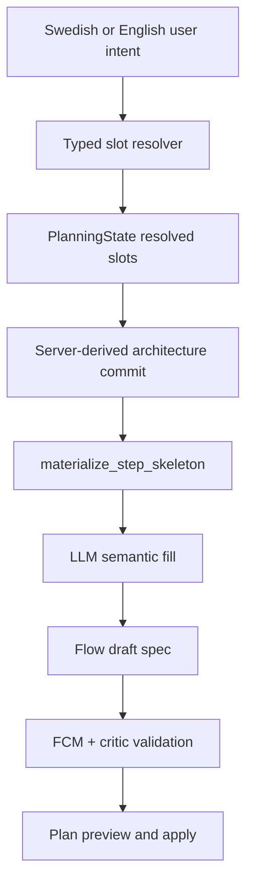

# PRD-011: Flow AI Builder Reliability

## TL;DR

1. Flow AI Builder must stop depending on repair as the happy path for valid Flow mechanics.
2. Backend-owned Flow mechanics should be derived from PlanningState, FCM, and Pattern Registry, then exposed to the LLM as a fillable step skeleton.
3. Swedish-first intent understanding should move from keyword gates to a typed slot resolver with a frozen Swedish eval corpus.
4. LiteLLM structured outputs should be used where supported, but only as provider-aware defense-in-depth for JSON shape reliability.
5. Success is measured by first-attempt compile rate, repair invocation rate, slot accuracy, chain compatibility, and edit-path parity.

## Problem

The current AI Builder can correctly summarize a user's intended architecture in the UI, then still fail to compile a valid Flow proposal. The reported failure was a Swedish audio-to-DOCX request where the confirmation card showed runtime input `Ljud` and final output `DOCX-dokument`, but the later proposal failed because no compiled step had `input_type="audio"` or `output_mode="transcribe_only"`.

The current contract already says the LLM should not emit low-level mechanics. `outline_flow` strips backend-owned keys such as `input_type`, `input_source`, `output_mode`, bindings, refs, and runtime config in `backend/src/intric/flows/ai_builder/ai_builder_create_outline.py:68-96`, and its tool description says the backend compiles Flow mechanics in `backend/src/intric/flows/ai_builder/ai_builder_create_outline.py:889-894`. Repair therefore cannot reliably fix an architecture-class failure by asking the model to emit mechanics it is forbidden to own.

The durable fix is to make Flow mechanics impossible for the LLM to get wrong:

- PlanningState and slot vocabulary capture requirements.
- FCM is the engine truth for legal input/output/mode tuples.
- Pattern Registry captures planner-facing archetypes.
- Backend `materialize_step_skeleton` derives the required step skeleton.
- The LLM fills semantic content into that skeleton.
- Validators and critics check backend skeleton conformance separately from LLM semantic quality.

## Goals

- Make valid Flow mechanics deterministic for common and complex Flow AI Builder scenarios.
- Improve Swedish intent understanding without hardcoding one-off examples or expanding brittle keyword lists.
- Support small models by sending clearer typed materials and using provider-supported structured outputs.
- Keep backend ownership of `input_type`, `output_type`, `output_mode`, `input_source`, runtime upload, step refs, and chain compatibility.
- Use enabled assistants, models, knowledge bases, MCP servers, and MCP tools as explicit allow-listed refs.
- Ask useful follow-up questions only for missing or ambiguous requirements.
- Reduce repair invocation to parse/ref-resolution failures rather than architecture redesign.
- Keep the architecture maintainable, testable, domain-neutral, and understandable for a new senior engineer.

## Non-Goals

- Do not build a broad new agent framework.
- Do not redesign the planner-turn lock/session/SSE lifecycle.
- Do not change Flow runtime, Celery, migrations, data models, or evidence exports in this PRD.
- Do not rename `intric.*` imports or packages to `eneo.*`.
- Do not rename `@intric/intric-js` or create package aliases.
- Do not add per-domain special cases for transcription, document summarization, municipality workflows, or any named vertical.
- Do not use repair/rebuilder loops as the expected success path.
- Do not create a generic framework-manifest abstraction above FCM and Pattern Registry unless a concrete consumer proves FCM/Pattern Registry are insufficient.
- Do not delete current keyword evidence in the same slice that introduces the slot resolver; demote it to a prior first, then delete only after measured parity.

## Users

- Flow author: wants to describe a Flow in Swedish and get a valid, useful Flow plan without knowing Eneo's internal mechanics.
- Workspace admin: expects AI Builder to use only enabled models, knowledge, assistants, MCP servers, and tools.
- Backend maintainer: needs one canonical owner for Flow mechanics and clear test failures when the framework changes.
- Frontend maintainer: needs stable AI Builder protocol behavior and clear view-model inputs.
- API/product maintainer: needs generated Flows that obey public Flow contracts and can be supported over time.

## Current State With Evidence

| Concept | Evidence | Problem |
|---|---|---|
| Server-derived architecture exists | `derive_architecture_commit_draft` derives input/output/output-mode tuples from PlanningState in `backend/src/intric/flows/ai_builder/ai_builder_architecture_derivation.py:27-67`. Audio input maps to `audio_to_artifact_report` when the output is not plain text in `backend/src/intric/flows/ai_builder/ai_builder_architecture_derivation.py:169-194`. | Architecture facts exist, but later outline compilation can still miss required mechanics. |
| Pattern expansion is opportunistic | `_apply_server_pattern_chain` is called from `compile_outline_to_create_draft` in `backend/src/intric/flows/ai_builder/ai_builder_create_outline.py:515-540`; audio pattern expansion is predicate-driven in `backend/src/intric/flows/ai_builder/ai_builder_outline_pattern_chains.py:261-315`. | Required mechanics can depend on the LLM outline shape rather than the committed architecture. |
| FCM is engine truth | `backend/src/intric/flows/flow_capability_manifest.py:1-20` says FCM is the engine truth; `is_output_mode_compatible` makes `transcribe_only` legal only for audio-to-text in `backend/src/intric/flows/flow_capability_manifest.py:516-557`; chain compatibility is validated in `backend/src/intric/flows/flow_capability_manifest.py:970-978`. | AI Builder should compile against FCM, not ask the model to rediscover legal mechanics. |
| PlanningState is typed but intent resolution is keyword-heavy | PlanningState is the typed JSONB source of truth in `backend/src/intric/flows/ai_builder/planning_state.py:1-24`; current input intent resolution depends on bilingual keyword markers and text checks in `backend/src/intric/flows/ai_builder/ai_builder_input_architecture_policy.py:32-248` and `:443-488`. | Swedish coverage depends on hand-maintained phrases and can miss semantically equivalent wording. |
| LLM final proposal should be semantic-only | `OutlineCompileContext` says architecture facts are server-owned in `backend/src/intric/flows/ai_builder/ai_builder_create_outline.py:110-127`; `compile_outline_to_create_draft` folds outline steps into backend-derived mechanics in `backend/src/intric/flows/ai_builder/ai_builder_create_outline.py:510-619`. | The intended contract is correct, but it is not enforced as a skeleton-first compile contract. |
| LiteLLM adapter now has a planner structured-output rail | `backend/src/intric/completion_models/infrastructure/tenant_model_capabilities.py` owns typed capability decisions; `TenantModelAdapter.resolve_structured_output_capability` and `CompletionService.resolve_structured_output_capability` expose the provider path; `backend/src/intric/flows/ai_builder/ai_builder_response_format.py` selects planner request mode. | 11.5a covers planner JSON turns only. Proposal tool calls, parse repair, and strict-schema cleanup remain open 11.5 work. |
| Enabled MCP resources are normalized and refs are enforced | MCP resources are normalized before planner exposure in `backend/src/intric/flows/ai_builder/ai_builder_mcp_resources.py:29-88`; MCP selection and selected refs are enforced in `backend/src/intric/flows/ai_builder/ai_builder_mcp_intent.py:388-433`. | Batch 11 should reuse this owner and make refs enum-bound in LLM materials, not invent another resource layer. |
| Capability reference already renders typed Flow materials for the LLM | `backend/src/intric/flows/ai_builder/ai_builder_flow_capability_reference.py:18-75` renders a structured reference from typed Flow sources and Swedish copy. | Batch 11 should strengthen this material, not create a parallel manifest. |

## Proposed Future State

### Decision Boundary

| Concept | Backend decides | LLM decides |
|---|---|---|
| Runtime input type | yes | no |
| Step input/output type | yes | no |
| Output mode | yes | no |
| Input source and runtime upload | yes | no |
| Step chaining compatibility | yes | no |
| Required skeleton roles | yes | no |
| Step names and task instructions | no | yes, within skeleton slot |
| Assistant prompt text | no | yes, constrained by Flow framework materials |
| Knowledge/model/MCP/assistant refs | allow-list and validation | choose only exact refs from allow-list |
| Secondary form/input fields | schema and validation | propose semantic fields when needed |
| Follow-up question wording | schema/options | ask only when state is missing or ambiguous |
| Repair | parse/ref-resolution cleanup | never redesign architecture |
| Architecture-class invariant failure | typed `AIBuilderArchitectureError` bypassing repair | not repaired |

## Requirements

### Functional Requirements

- [ ] Audio-to-artifact Flows compile a real transcription step from server-owned architecture, not from model-emitted mechanics.
- [ ] Document-to-template, document-to-summary, text-to-JSON, JSON-to-text/JSON, and multi-step chains compile with legal FCM tuples.
- [ ] The builder asks a follow-up only when a required slot is unknown or ambiguous.
- [ ] Enabled assistants, knowledge bases, MCP servers, and MCP tools are exposed as exact refs and validated as exact refs.
- [ ] Existing create/edit/apply behavior remains intact.

### Reliability Requirements

- [ ] First-attempt compile success rate is measured and improves against a baseline.
- [ ] Repair invocation rate is measured and treated as a regression signal when it rises.
- [ ] Architecture-class failures are not sent to repair; they fail as backend materialization or validator bugs.
- [ ] Small models receive strict schemas when supported and deterministic fallback when not supported.

### Maintainability Requirements

- [ ] Flow mechanics have one canonical compile owner.
- [ ] Critic invariants are classified as architecture, semantic, or hybrid.
- [ ] Keyword evidence is a resolver prior, not a source-of-truth gate.
- [ ] No fake interfaces, pass-through modules, generic helpers, or framework-manifest duplication.

### API / Provider Requirements

- [ ] LiteLLM structured-output support follows the official `response_format` and JSON schema mechanisms where available.
- [ ] `TenantModelAdapter` owns a typed structured-output capability value; AI Builder callers do not query LiteLLM directly.
- [ ] The model capability path is explicit: `strict_json_schema`, `json_object`, or `prompt_with_pydantic_validation`.
- [ ] Unsupported provider params degrade intentionally and are logged.
- [ ] Pydantic validation remains mandatory even when the provider claims schema support.

Official LiteLLM docs state that JSON mode uses `response_format={"type": "json_object"}`, strict structured outputs use `response_format={"type": "json_schema", "json_schema": ..., "strict": true}` or a Pydantic model, and support can be checked with `get_supported_openai_params` / `supports_response_schema`: <https://docs.litellm.ai/docs/completion/json_mode>.

### Testing Requirements

- [ ] Pure unit tests for skeleton generation by PlanningState/FCM/Pattern Registry tuple.
- [ ] Integration tests for create, edit, approve, apply, and no-repair first-attempt compile.
- [ ] Swedish eval corpus with labeled slots and no silent corpus shrinkage.
- [ ] Goldens coverage matrix for FCM x composition x create/edit.
- [ ] Structured-output fallback tests for `strict_json_schema`, `json_object`, and `prompt_with_pydantic_validation` capability paths.
- [ ] MCP/knowledge/assistant ref validation tests.
- [ ] Local manual API smoke suite with redacted comparable scorecards for the six stable Swedish prompts, proposed-plan revisions, and existing-Flow edits in `docs/refactor/execution/batch-11-flow-ai-builder-reliability/manual-eval-runbook.md`.

## Design

### Canonical Owners

| Concept | Canonical owner | Batch 11 action |
|---|---|---|
| Engine legal Flow tuples | `backend/src/intric/flows/flow_capability_manifest.py` | Reuse as validation truth; add tests that AI Builder skeletons obey it. |
| Planner-facing archetypes | `backend/src/intric/flows/ai_builder/pattern_registry.py` | Reuse; add only narrowly earned archetypes such as form-field lifecycle. |
| Resolved requirements | `backend/src/intric/flows/ai_builder/planning_state.py` and `ai_builder_slot_vocabulary.py` | Add typed slot resolver that writes validated slots. |
| Flow mechanics materialization | Existing outline compile path, likely promoted or renamed from `ai_builder_outline_pattern_chains.py` ownership | Make `StepSkeleton` materialization mandatory from committed architecture. |
| Final semantic proposal | `ai_builder_create_outline.py` and edit proposal owners | LLM fills names, tasks, refs, field hints into skeleton. |
| Provider call mechanics | `TenantModelAdapter` plus AI Builder orchestration caller | `TenantModelAdapter` exposes a typed capability value; AI Builder orchestration callers consume it and never call `litellm.supports_response_schema` directly. |
| Enabled external resources | `ai_builder_mcp_resources.py`, `ai_builder_mcp_intent.py`, existing model/knowledge/assistant context owners | Reuse; do not create a second manifest. |

### Capability Reference Rollout

| Slice | Addition | Trigger condition |
|---|---|---|
| 11.1 | Step-slot summary block for the LLM. | Add only if the LLM must fill semantic fields against named slots. |
| 11.3 | Enabled resource enum/ref material. | Add when form-field/resource semantics need exact ref selection in proposal generation. |
| 11.5 | Structured-output format hints. | Add only when the selected provider path makes the hint actionable. |

### LLM Materials

Every proposal-generating LLM call should receive only materials it can act on:

- User language and latest user intent.
- Confirmed requirements summary.
- Step skeleton slots with backend-owned mechanics fixed.
- Allowed model, assistant, knowledge, MCP server, and MCP tool refs.
- FCM-derived capability hints relevant to the skeleton.
- Pattern Registry archetype names and restrictions where relevant.
- Form-field contract and any already-declared fields.
- Current flow context in edit mode.
- Explicit "ask question only if required slot is unknown" policy.

Do not send:

- Raw keyword marker lists. If keyword evidence remains during 11.2, send only a compact prior such as matched intent categories and confidence hints.
- Full internal PlanningState JSON when a smaller contract is enough.
- Backend-owned mechanics as fields the model must echo.
- Unavailable MCP/resource names.
- Domain-specific examples that bias the builder toward one vertical.

### Structured Output Strategy

Introduce a typed AI Builder structured-output rail in a reviewable slice:

1. `strict_json_schema`: provider supports strict JSON schema / Pydantic response format.
2. `json_object`: provider supports JSON object mode but not strict schema.
3. `prompt_with_pydantic_validation`: provider supports neither, so prompt + Pydantic validation remains.

The rail must:

- be exposed through `TenantModelAdapter` as the single provider-capability owner;
- use explicit tenant/model config as the authoritative override and LiteLLM support checks as evidence;
- validate all outputs with Pydantic;
- log capability path, model, tenant, latency, and validation outcome;
- avoid per-request exploratory provider probing unless a plan proves it is necessary;
- avoid weakening model output schemas to fit providers.

Tool calls remain orthogonal to structured output capability. Existing
`outline_flow` and `edit_flow` tool contracts should not become a separate
fallback rung; they can be combined with the selected output mode only when the
provider supports that combination.

Batch 11.5a status:

- implemented the provider-capability owner and planner JSON selection path;
- kept `outline_flow` and `edit_flow` proposal tool calls separate from planner
  `response_format` kwargs;
- downgraded strict-capable planner turns to `json_object` while
  `PlannerOutput` still has strict-schema blockers;
- left proposal and parse-repair expansion to 11.5b.

## Implementation Slices

### 11.0 — Measurement Baseline And Production-Failure Corpus

Deliverables:

- Metrics/log fields for first-attempt compile success, repair invocation reason, skeleton materialization path, structured-output path, and slot resolver confidence once the resolver exists.
- Baseline report in the Batch 11 journal before behavior changes.
- Frozen reliability corpus in the existing AI Builder benchmark case owner, with the reported audio-to-DOCX scenario plus at least five captured Swedish prompts tagged by `CorpusSource` values: `reported_failure`, `manual_runbook`, `captured_telemetry`, or `manual_reproduction`.
- Corpus integrity test with minimum case count, closed provenance/domain tags, typed expected Flow shape, FCM tuple legality, behavioral-risk coverage, enum-typed exclusions, and content-based reported-failure detection so hard cases cannot disappear silently.
- Manual API smoke-suite runbook and harness plan for the six stable Swedish prompts, proposed-plan revisions, and existing-Flow edits, including local curl setup, dry-run validation, typed scorecard contract, workspace/model fixture rules, redaction rules, and before/after comparison procedure.
- No behavior change unless necessary to expose measurement.

Validation:

- Existing AI Builder integration tests.
- Unit tests for emitted metrics/log payload shape.
- `cd backend && uv run pyright <touched files>`.
- `cd backend && uv run ruff check <touched files>`.
- `cd backend && uv run ruff format --check <touched files>`.

Exit criterion:

- Baseline numbers and the reliability corpus are committed before 11.1 starts.
- Later reliability gates use the reliability corpus and measured baseline; 11.4 goldens are coverage, not the baseline itself.
- Manual smoke-suite baseline procedure covers create, revise, and edit paths; any new manual failure must be promoted into the automated reliability corpus, resolver corpus, or golden tests before the relevant slice commits.

### 11.1 — StepSkeleton Materialization

Deliverables:

- Deterministic step skeleton from PlanningState, FCM, and Pattern Registry.
- `compile_outline_to_create_draft` fills semantics into skeleton slots instead of opportunistically adding mechanics based on outline shape.
- Architecture-class, semantic, and hybrid critic invariant classification.
- Explicit skeleton fill contract defined in this PRD.
- Typed `AIBuilderArchitectureError` failure surface for architecture-class invariant failures that must not enter repair.
- Audio-to-DOCX and other canaries pass without repair.

Acceptance:

- Audio-to-DOCX creates a first step with audio runtime input and transcription output, then coherent downstream text/JSON/DOCX steps.
- LLM outline cannot remove required backend skeleton mechanics.
- Edit mode fills missing mechanics without overwriting user-authored valid mechanics.
- Fixed PlanningState/FCM tuple tests produce FCM-legal chains.
- Combined Swedish-corpus success is not claimed until 11.2 lands.

Recommended internal split:

- 11.1a: typed step slots and `materialize_step_skeleton` owner.
- 11.1b: skeleton fill rules and compile integration.
- 11.1c: critic invariant classification, architecture failure surface, and canary tests. Split 11.1c further before implementation if the plan exceeds the slice LOC ceiling.

#### Skeleton Fill Contract

- Named required slots are filled in skeleton order.
- Backend skeleton wins for mechanics.
- The LLM wins for semantic names, prompts, field hints, and allowed refs.
- Missing required semantic content fails with a typed validation error.
- Extra LLM outline steps are either attached to an explicit optional slot or rejected with a typed diagnostic.
- Output type conflicts are resolved by skeleton mechanics and logged as semantic drift.
- Edit mode fills missing mechanics and preserves valid user-authored mechanics, but rejects incompatible mechanics instead of overwriting silently.

### 11.2 — Swedish Slot Resolver

Deliverables:

- Typed slot resolver using server-enumerated slot values and `unknown`.
- Keyword evidence demoted to resolver prior.
- Frozen Swedish eval corpus under the canonical AI Builder corpus owner chosen in 11.2.
- Structured follow-up trigger only for missing/ambiguous slots.

Acceptance:

- Slot resolver accuracy target is defined before implementation, starting at 85% on a frozen Swedish corpus with at least 80 labeled cases.
- Corpus includes audio, document, audio+document, text-only, text+upload, transcript-already-provided, structured extraction, comparison, HTTP/API, and multi-step flows.
- Corpus is domain-neutral and not hardcoded to municipality or meeting-minutes use cases.
- Keyword prior deletion criterion is defined before implementation, starting from: delete the keyword prior when resolver decisions match or improve on keyword decisions for at least 95% of the frozen corpus and no reviewed production sample over seven days shows a resolver/keyword disagreement on an architecture-class slot.

### 11.3 — Form Fields And Chain Goldens

Deliverables:

- Pre-implementation inventory proving whether existing Pattern Registry can express form-field lifecycle.
- Form-field lifecycle archetype only if existing Pattern Registry cannot express declaration, use, and downstream reference without parallel semantics.
- Invariants that every `uses_form_fields` reference resolves to declared fields.
- Create/edit goldens for form-field declaration, form-field chaining, and multi-reference flows.

Acceptance:

- Missing or stale form-field refs fail with a typed diagnostic.
- The LLM can request secondary fields, but backend validates declarations and downstream use.

### 11.4 — Goldens Coverage Matrix And Edit Parity

Deliverables:

- Matrix test over FCM capabilities, Pattern Registry compositions, and create/edit paths.
- Domain-neutral golden fixtures for simple and complex flows.
- Hard failure when a supported capability/composition has no golden coverage.

Acceptance:

- Each create-path golden has an edit-path parity test or an explicit documented reason.
- No goldens preserve invalid mechanics or never-shipped compatibility.

### 11.5 — LiteLLM Structured Output Rail

Deliverables:

- Provider-aware structured-output rail for planner JSON, `outline_flow`, `edit_flow`, and parse repair. Semantic repair joins this rail only when its output contract is a typed JSON object and the slice plan proves the benefit.
- Capability path `strict_json_schema -> json_object -> prompt_with_pydantic_validation`; tool calls such as `outline_flow` and `edit_flow` remain orthogonal.
- Pydantic validation at every boundary.
- Tests for supported and unsupported capability paths.

Acceptance:

- Parse-repair invocation drops for schema-capable models.
- Tenants without schema support do not regress.
- The architecture-class success path does not depend on structured outputs.

## Success Metrics

| Metric | Starting target |
|---|---:|
| First-attempt compile success on reliability corpus | >= 90% after 11.1 and 11.2 |
| Repair invocation rate on reliability corpus | < 10% after 11.1 and 11.2 |
| Swedish slot resolver accuracy | >= 85% on at least 80 labeled cases |
| Chain-materialization regressions on canaries | 0 |
| Goldens with edit-path parity | >= 20% initially, then ratchet upward |
| Goldens exercising form-field chains | >= 30% once form-field slice lands |
| Structured-output fallback paths tested | 100% of declared paths |

## Alternatives Considered

| Alternative | Decision | Reason |
|---|---|---|
| Prompt-only improvements | Rejected as primary fix. | The observed failure is backend mechanics/materialization, not just wording. |
| Structured outputs first | Rejected as first slice. | JSON shape support reduces parse failures but does not fix architecture-class gaps. |
| Add audio-to-DOCX special case | Rejected. | Would hide the same bug class for the next input/output combination. |
| Build a new manifest layer | Rejected for now. | FCM, Pattern Registry, capability reference, and MCP resource owners already exist. |
| Agentic planner rewrite | Deferred. | Larger blast radius and not required to fix mechanics reliability. |

## Risks

| Risk | Mitigation |
|---|---|
| `materialize_step_skeleton` overwrites valid edit-mode mechanics. | Add edit-path parity tests and "fill missing, do not replace valid user-authored mechanics" rule. |
| Slot resolver adds a new LLM failure point. | Temperature zero, strict enum schema where available, `unknown` fallback, eval gate, and keyword priors. |
| Structured output provider support is inconsistent. | Explicit capability path, Pydantic validation, and fallback tests. |
| Goldens become domain-biased. | Domain-neutral fixture lint and review. |
| Repair metrics become vanity numbers. | Tie metrics to go/no-go success thresholds and require before/after reporting. |

## Rollback / Recovery

- Land each slice independently.
- If 11.1 changes too much behavior, keep the measurement slice and revert skeleton behavior while preserving canary tests.
- If 11.2 resolver accuracy misses the threshold, keep keyword logic as primary and retain the resolver behind a feature flag until the corpus and prompt improve.
- If 11.5 provider capability assumptions fail, degrade to the previous tool/prompt path while keeping output validation.

## Dependencies

- PRD-005 AI Builder Architecture.
- PRD-006 Frontend Single Source Of Truth, only if frontend protocol types change.
- PRD-009 Observability And Operability for metrics/logging alignment.
- Batch 10 lifecycle/operability source state should be committed or explicitly waived before implementation starts.

## Open Questions

| Question | Default recommendation |
|---|---|
| Should `materialize_step_skeleton` live in a promoted existing outline pattern-chain owner or a new file? | Reuse/rename existing owner if it can become canonical without parallel code. Create a new narrow file only if the plan proves the current owner cannot absorb the responsibility. |
| Should the slot resolver use the tenant's selected model or a fixed small model? | Prefer configurable small-model rail with fallback to tenant model when policy requires tenant-owned models. |
