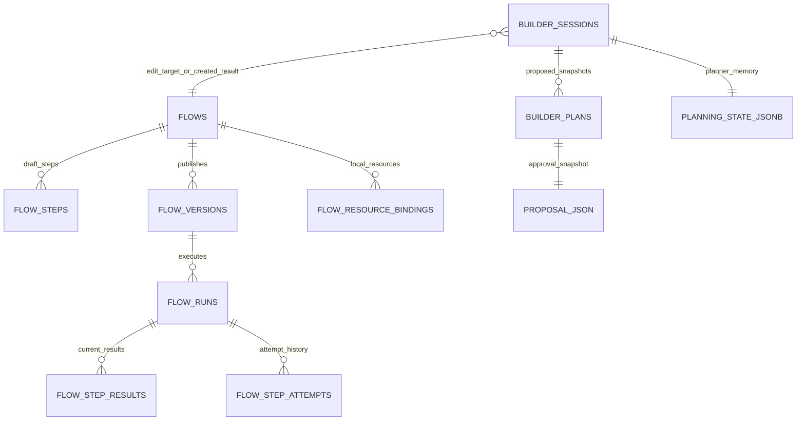

# Agent Review: Data Model, JSONB, And Persistence

## TL;DR

The broad Flow data model is mostly in the right shape: lifecycle and queryable runtime state are relational, while Builder session/planning/proposal state is mostly typed JSONB snapshot state.
The highest JSONB risk is not "too much JSONB"; it is false or dead governance around `PlanningState` versions/caps.
`builder_plans.proposal_json` should probably remain JSONB pre-production, but nested spec strictness and hash coverage need explicit tests or narrower claims.
Do not add relational plan-step tables yet; first delete or wire dead version/cap machinery and characterize nested proposal behavior.
This should feed a dedicated Fable data-model/JSONB session instead of being buried in a general architecture prompt.

## Structure

## Ranked Findings

| Rank | Finding | Evidence | Proposed owner / fix |
|---:|---|---|---|
| 1 | `PlanningState` version/cap governance is speculative and already drifted. It duplicates `FCM_VERSION`, describes stale-session checks that load does not enforce, and defines a payload cap that is not enforced. | `backend/src/eneo/flows/flow_capability_manifest.py:13`, `backend/src/eneo/flows/flow_capability_manifest.py:43`, `backend/src/eneo/flows/ai_builder/planning_state.py:12`, `backend/src/eneo/flows/ai_builder/planning_state.py:38`, `backend/src/eneo/flows/ai_builder/planning_state.py:41`, `backend/src/eneo/flows/ai_builder/planning_state_builder.py:59`, `backend/src/eneo/flows/ai_builder/ai_builder_repo.py:1058` | Either import one canonical FCM owner and implement load-time policy with tests, or delete the persisted stamp/cap/prose if stale detection is not needed pre-production. |
| 2 | `builder_plans.proposal_json` has weaker nested contract guarantees than the registry rationale implies. Normal writes use `proposal.storage_json()`, but nested authoring models are open and load is lenient. | `backend/src/eneo/flows/ai_builder/ai_builder_repo.py:852`, `backend/src/eneo/flows/ai_builder/ai_builder_repo.py:1295`, `backend/src/eneo/flows/ai_builder/ai_builder_domain_models.py:165`, `backend/src/eneo/flows/flow_authoring_spec.py:39`, `backend/src/eneo/flows/flow_authoring_spec.py:209`, `backend/tests/unittests/flows/test_flow_authoring_spec.py:115` | Keep `proposal_json` as JSONB for now. Decide and test nested extra-field behavior in `FlowDraftSpecCore`; narrow integrity claims if nested models stay open. |
| 3 | Session draft title reads through a proposal JSON path, but it is acceptable while display-only. | `backend/src/eneo/flows/ai_builder/ai_builder_repo.py:64`, `backend/src/eneo/flows/ai_builder/ai_builder_repo.py:187` | Do not migrate now. Relationalize only if sorting/filtering/stable schema evolution makes title a product/query contract. |
| 4 | Authored Flow JSONB still exposes broad `dict[str, Any]` contracts in some domain/API surfaces. | `backend/src/eneo/flows/domain/flow.py:42`, `backend/src/eneo/flows/api/flow_models.py:437`, `backend/src/eneo/flows/api/flow_models.py:508` | No big-bang retype. New/touched authored JSON fields need typed parser/schema, validation boundary, owner, corruption behavior, and OpenAPI shape. |

## JSONB Keep / Move Guidance

| Concept | Current persisted owner | Keep JSONB or move relational? |
|---|---|---|
| Builder conversation | `builder_sessions.conversation` with typed `ConversationMessage` | Keep JSONB unless product needs message-level querying/retention/export at scale. |
| Builder planner memory | `builder_sessions.planning_state_jsonb` plus `planning_state_version` | Keep typed JSONB, but fix/delete version/cap governance. |
| Builder proposal snapshot | `builder_plans.proposal_json` plus `spec_hash` | Keep JSONB pre-production; characterize nested spec strictness and hash semantics. |
| Builder session files | `builder_session_files` relational link table | Relational link is right; consider adding role metadata only if attachment semantics become product state. |
| Flow draft/version/run lifecycle | Flow tables, steps, versions, runs, attempts/results | Already relational where integrity/querying matters; keep JSON payloads bounded/typed. |

## Delete / Merge Candidates

| Candidate | Reason |
|---|---|
| Duplicate `FCM_VERSION` in `planning_state.py` | It already drifted from `flow_capability_manifest.py`. |
| False stale-session policy prose in `planning_state.py` | Load validates shape but does not compare stale stamps. |
| Dead `PLANNING_STATE_PAYLOAD_CAP_BYTES` constant | It is only test-referenced if not enforced. |
| Future compatibility for migration-only dead `phase`/`evidence` fields | Pre-production code should not accumulate more legacy shims. |
| Parallel proposal storage shapes such as `spec_json`/`envelope_json` | Tests already reject them; keep deleted. |

## Fable Follow-Up Questions

- Which Builder JSONB fields should remain JSONB at 50k users because they are bounded snapshots?
- Which facts need relational columns/rows before production because they will be queried, retained, audited, or migrated?
- Is `PlanningState` versioning worth enforcing, or should the dead governance be deleted now?
- Should Builder attachment file roles be relational metadata, planning-state facts, or typed JSONB inside session state?
- Does `proposal_json` need stricter nested spec validation before approval/apply, or is lenient ingestion intentional?
