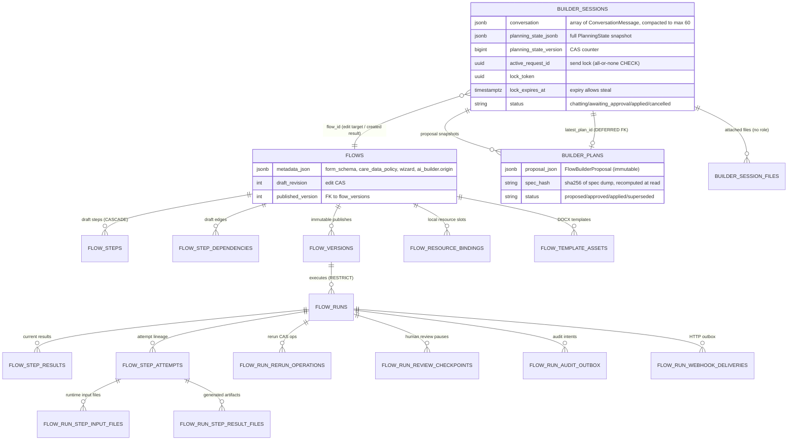

# Fable 03: Planning State JSONB Scale Review

All evidence is gathered and verified. Here is the complete review.

---

# Fable 03 — Planning State, JSONB, Persistence, and 50k-User Scale

Reviewer: Claude Fable 5 (max effort, source-verified). Repo: `/Users/ccimen/eneo/eneo-flows-clean`. Date: 2026-07-03.

## TL;DR

1. The JSONB/relational split is fundamentally right and unusually disciplined — lifecycle, locks, and integrity are relational with real CHECK/FK/CAS enforcement; payloads and snapshots are typed JSONB with a per-column ownership ledger (`flow_jsonb_ownership.py`) — no field needs a keep/move reversal today.
2. The worst debt is **false governance prose around `PlanningState`**: two constants both named `FCM_VERSION` hold different values (`flow_capability_manifest.py:43` = 2 vs `planning_state.py:38` = 1), the documented load-time stale-session policy does not exist (`ai_builder_repo.py:1058-1094`), the 128 KiB payload cap is enforced nowhere, and tests pin the absence of policy rather than the policy.
3. `builder_sessions.conversation` is **not** an unbounded log — compaction hard-caps it at 60 messages (`ai_builder_conversation_compaction.py:21-22`) — so keep JSONB; the real 50k-user question is that compaction *discards history*, which forecloses audit/support search until the product explicitly decides it wants an append-only record.
4. The most dangerous latent trap is **schema evolution of `builder_plans.proposal_json`**: `spec_hash` is recomputed from the current model shape at every read (`ai_builder_domain_models.py:190-192`, `ai_builder_repo.py:1299`), so any added/removed spec field invalidates every historical plan row — the team already hit this once and patched it ad hoc for one field (`flow_authoring_spec.py:241`, `test_flow_authoring_spec.py:115-124`) without adopting a general policy.
5. Highest-ROI moves before scale: fix the FCM version fork, delete the dead cap/prose, merge the duplicated commit spine (`ai_builder_plan_store.py:108-130` ≡ `ai_builder_repo.py:1138-1157`), add a status CAS to plan lifecycle updates, and fix the session-list N+1 (`ai_builder_router.py:544-564`) — everything else can wait for its named trigger.

---

## Ratings

| Axis | Score | Rationale |
|---|---:|---|
| Data model fitness | **8/10** | Draft/version/run separation, immutable checksummed snapshots, attempt lineage, outbox tables with delivery-state CHECKs (`flow_tables.py:363-387, 1707-2026`). Deduction: Builder provenance to applied flows is a stringly JSONB blob, not a relation. |
| JSONB discipline | **7/10** | Ownership ledger covers all 27 JSONB columns with owner/version/corruption policy (`flow_jsonb_ownership.py:95-561`); full-snapshot write discipline is enforced in code (`ai_builder_repo.py:1315-1334`). Deductions: dead version/cap governance; ≥4 raw readers bypass the registered `form_schema` owner. |
| Relational integrity | **8/10** | Tenant-composite FKs on every child table, deferred FK for the session↔plan cycle (`flow_tables.py:2118-2124`), all-or-none lock CHECK (`flow_tables.py:2133-2146`), partial unique indexes for one-active-per-run invariants. Deduction: plan status transitions have no DB-level or CAS guard. |
| Maintainability | **6/10** | Duplicate atomic-turn spine in two modules; planning facts derived in two parallel paths (state builder vs discovery profile); two form-field models with two coercion tables; module prose that contradicts the code in three places. |
| Scalability (50k users) | **7/10** | Bounded conversations, retention reaper for all session states, list index, CAS everywhere hot. Deductions: session-list N+1 `get_space` loop; JSON-path detoast per row in the list join; no pagination cursor on sessions. |
| Migration safety | **5/10** | The strict `extra="forbid"` snapshot pattern forces a data migration for every removed field (already happened: `202606281530_strip_builder_planning_state_private_fields.py`); the recomputed `spec_hash` makes *additive* spec changes retroactively fatal; version stamps exist but nothing reads them, so they cannot help a future migration decide anything. |
| Production readiness | **6/10** | Flow-side runtime persistence is production-shaped (outbox, idempotency, revisions, retention). Builder-side needs the governance honesty pass, plan-status CAS, and the N+1 fix before a 50k-user launch. |

---

## Entity / Relationship Map

Verified against `backend/src/eneo/database/tables/flow_tables.py`.



The Builder→Flow provenance edge is *not* relational: applied flows carry `metadata_json.ai_builder.origin` with stringified `builder_session_id` / `builder_plan_id` / `builder_spec_hash` (`flow_metadata.py:52-58, 86-98`), populated from `AIBuilderFlowAuthoringOrigin` at apply (`ai_builder_plan_lifecycle.py:369-375`).

---

## JSONB Decision Matrix

Confidence key: H = verified in source this session; M = verified structure, judgment on trigger.

| Field | Current owner | Verdict | Pros of current shape | Cons / risk | 50k-user risk | Trigger for change | Conf |
|---|---|---|---|---|---|---|---|
| `builder_sessions.conversation` | `ConversationMessage` (`flow_jsonb_ownership.py:519-532`) | **Keep JSONB** | Bounded at 60 msgs (`ai_builder_conversation_compaction.py:21`); read whole-window every turn anyway; lease serializes writers | Compaction discards history; metadata bag is an undiscriminated union with silent-`None` readers | Low (size); the risk is *product*, not storage: no audit/support search possible over discarded turns | Add append-only `builder_session_messages` **only when** audit/support/analytics over full history becomes a requirement | H |
| `builder_sessions.planning_state_jsonb` | `PlanningState` (`flow_jsonb_ownership.py:533-546`) | **Keep JSONB, fix governance** | Strict typed snapshot, CAS-versioned column, savepoint-atomic with conversation | It is a *derived projection*, not the SSOT its docstring claims; version stamps are write-only theater; cap unenforced | Low — small documents, one per session | Move `resolved_slots` to rows only if cross-session slot analytics/audit appears (no sign of it) | H |
| `builder_plans.proposal_json` | `FlowBuilderProposal` (`flow_jsonb_ownership.py:547-560`) | **Keep JSONB + adopt a hash-evolution policy; materialize `draft_title` when list search arrives** | Immutable snapshot; write path serializes typed model (`ai_builder_repo.py:864`); read recomputes spec hash | Recomputed hash turns any spec-model change into read failure for all old rows; hash covers only `content.spec` | Medium — list endpoint detoasts each joined proposal for one title (`ai_builder_repo.py:195-197`), fine at LIMIT 20 | Materialize title/output-type columns when list search/sort/filter is requested; adopt hash policy **now** (cheap) | H |
| `builder_session_files` (relational) | link table (`flow_tables.py:2150-2174`) | **Keep relational; add `role` column when discovery becomes role-aware** | Correct row identity, tenant-scoped, cascade | No role semantics; planner labels everything "Reference material" (`ai_builder_attachment_context.py:74`) | Low | Add `role` (CHECK-constrained string, default `reference`) in the same slice that makes discovery/prompt assembly role-aware — not before | H |
| `flows.metadata_json.form_schema` | `FlowMetadata` (`flow_jsonb_ownership.py:96-113`) | **Keep JSONB; consolidate readers first** | Runtime reads the *published* immutable copy (`flow_run_input_payload.py:31`, `flow_run_contract_service.py:205`), so draft JSONB never gates runs | ≥4 raw dict readers bypass the owner (`ai_builder_form_fields.py:15`, `ai_builder_discovery_flow_defaults.py:245`, `ai_builder_flow_context.py:125,320`); two field models with two coercion tables | Low-medium | Relational `flow_form_fields` only if fields become cross-flow searchable, permissioned, or analytics dimensions | H |
| `flows.metadata_json.ai_builder.origin` | `FlowAIBuilderOriginMetadata` (`flow_metadata.py:86-98`) | **Keep JSONB now; earmark as first relational-provenance candidate** | Typed, strict, small | String IDs, no FK; sessions cascade-delete leaving dangling references; "which flows came from Builder" = JSONB scan | Medium at audit time | When compliance/audit asks "list AI-generated flows" or "trace flow → session", add a `flow_authoring_origins` table or indexed generated column | H |
| `flow_versions.definition_json` | `PublishedFlowDefinition` (`flow_jsonb_ownership.py:208-225`) | **Keep JSONB** | Immutable + checksummed — the canonical good JSONB use | None material | Low | Version diff/search as first-class feature | H |
| `flow_steps.*` six envelopes | step definition parser (`flow_jsonb_ownership.py:114-207`) | **Keep JSONB** | Mode-specific sparse shapes; DB CHECKs already govern the enum columns beside them (`flow_tables.py:275-305`) | `dict[str, Any]` passthrough on the API (`api/flow_models.py:400-409, 520-528`) hides shape from consumers | Low | Typed OpenAPI schemas when the public API stabilizes; extraction only if a binding field becomes a query dimension | H |
| `flow_runs` / results / attempts payloads | run/step envelope owners (`flow_jsonb_ownership.py:282-431`) | **Keep JSONB** | Status/tokens/provider/timestamps already relational; payloads are debug/replay documents | None material | Low — retention anchors and partial indexes exist (`flow_tables.py:838-846`) | Extract a field when it becomes billing/compliance/dashboard filter | H |
| Review checkpoint payloads | checkpoint repo (`flow_jsonb_ownership.py:450-517`) | **Keep JSONB** | Revision + `schema_version` columns already on the row (`flow_tables.py:1326-1327`) — the one place table-level versioning is real | None material | Low | — | H |
| `flows.metadata_json.wizard` | untyped (`flow_metadata.py:106`) | **Keep, but it's the least-governed blob** | Display-only | No shape at all | Low | First consumer that reads it in backend logic must type it | M |

**No field currently warrants a JSONB→relational move.** Two warrant *materialized relational additions* on named triggers: `builder_plans.draft_title` (list search) and AI-builder origin provenance (audit).

---

## PlanningState Truth Review

**The document says one thing; the system does another.** `planning_state.py:3-5` claims PlanningState "replaces the turn-by-turn reconstruction of discovery state and is the single source of truth for what the planner has learned." What the code does:

- `build_planning_state_from_conversation` (`planning_state_builder.py:147-166`) **re-derives all slots from the compacted conversation on every turn** — the exact turn-by-turn reconstruction the docstring says was replaced.
- The only fact carried forward from the persisted snapshot is `architecture_commit` (`planning_state_builder.py:203-224`).
- Model-classified slots are replayed from per-message `slot_classification` metadata (`planning_state_builder.py:169-196`) via a tolerant reader that returns `None` on any `ValidationError` (`ai_builder_conversation_metadata.py:493-505`).

So the truth hierarchy is actually: **conversation (compacted) = event log; PlanningState = materialized projection + one durable planner fact.** That architecture is *fine* — arguably good — but it has three unacknowledged consequences (all confidence H):

1. **FCM version fork.** `planning_state.py:38` defines its own `FCM_VERSION = 1`; the real manifest is at version 2 (`flow_capability_manifest.py:43`). Every persisted snapshot is stamped with a number that does not describe the manifest in force. Nothing ever compares them (grep: the manifest constant is stamped nowhere; the planning-state constant is consumed only by `planning_state_builder.py:160` and `planning_state.py:177`). The manifest docstring's claim that `FCM_VERSION` is "stamped on persisted plans, planning-state snapshots, and digests" (`flow_capability_manifest.py:13-15`) is also false for plans and digests.
2. **The stale-session policy is fiction, twice over.** `planning_state.py:16-17` says "the stale-session policy compares stamps at load time"; `load_planning_state` does `PlanningState.model_validate(payload)` and nothing else (`ai_builder_repo.py:1091-1094`). The test class docstring repeats the same fiction (`test_planning_state.py:306-311`) while its tests assert old stamps round-trip *unchanged* (`test_planning_state.py:313-349`) and that `FCM_VERSION >= 1` (`test_planning_state.py:43-45`) — the tests are written so CI structurally cannot detect the fork.
3. **Planner memory silently regresses after compaction.** Compaction protects the latest requirements-summary group, the latest structured answer per question, and the latest tool trace (`ai_builder_conversation_compaction.py:34-64`) — but *not* messages carrying `slot_classification` metadata. Once such a message falls outside the 40-message tail in a 60+-message session, the model-learned slot vanishes from the next rebuild, with no signal. The same silent loss occurs if a persisted classification blob fails validation after a schema change to `SlotClassificationMetadata` (e.g., renaming a value in `LLMResolvableSlotName`, `ai_builder_conversation_metadata.py:66-74`).

**Secondary duplication:** `build_discovery_profile` re-derives input/output intent from raw text (`ai_builder_discovery_profile_builder.py:281-297`) and set-unions conversation-extracted answers with slot-projected answers (`:242-245`), mapping slot names back through `legacy_question_id_for_slot` (`:461`). The source-precedence lattice in `_model_slot_can_replace` (`planning_state_builder.py:472-508`) is thoughtful, but the profile builder maintaining a parallel merged view keyed by *legacy question IDs* means adding a slot touches two vocabularies and two derivations. This confirms the prior agent finding; the fix direction is to make `DiscoveryProfile` a pure read model over `PlanningState` rather than a co-deriver.

**Verdict:** keep the JSONB column and the CAS discipline (which are genuinely good — `save_planning_state`'s version filter and mismatch error at `ai_builder_repo.py:1016-1056` are exactly right). Then make the prose honest and the governance real-or-dead:

- Delete `planning_state.py`'s local `FCM_VERSION`; import the manifest's. Keep the stamp as a *diagnostic* field.
- Keep `builder_schema_version` (it governs the Pydantic shape and would drive a future load migration). Delete `planner_contract_version` until something reads it, or document it as diagnostic-only.
- Delete `PLANNING_STATE_PAYLOAD_CAP_BYTES` and its pin test (`test_planning_state.py:40-41`), or enforce it in `_planning_state_for_storage`. Given sessions cap at 60 messages and slots are a small dict, the cap solves no observed problem — delete.
- Rewrite `planning_state.py:1-26` to say what is true: "materialized projection of the compacted conversation, plus the planner-committed architecture; rebuilt every turn; stamps are diagnostic."
- Decide explicitly whether model-learned slots should survive compaction. If yes, extend `carry_forward_persisted_planner_state` to carry `source="model"` slots the rebuild did not re-derive; if no, log slot regressions so support can see them.

---

## Conversation Storage Review

**Is `builder_sessions.conversation` acceptable as JSONB long term? Yes — because it is a bounded working set, not a log.** The brief's failure-mode list assumes growth; the code forecloses it:

- **Row size:** hard-capped at 60 messages (`ai_builder_conversation_compaction.py:21-22`), user messages capped at 50,000 chars (`ai_builder_api_models.py:234`). Worst case ~3 MB (TOAST-compressed), realistic tens of KB. Every write path compacts (`ai_builder_repo.py:513, 575`).
- **Lock contention:** writes are serialized per session by the send lease (claim/refresh/release with expiry-steal, `ai_builder_repo.py:758-846`) and the all-or-none lock CHECK (`flow_tables.py:2133-2146`). Two users never contend on one session row (sessions are per-`actor_user_id`). Non-issue.
- **Pagination / partial loading:** the planner needs the whole window every turn; there is nothing to paginate at 60 messages. Non-issue.
- **Migration:** the `message_id` backfill migration and fail-loud `from_persisted` (`ai_builder_domain_models.py:106-121`) show the migration path works.
- **What actually breaks first:** **audit, support search, and analytics** — not because JSONB is hard to query, but because compaction *deletes* messages 1–20 of a 70-message session permanently. At 50k users, "what did the builder tell this user before it produced the wrong flow?" will be unanswerable for exactly the long, messy sessions where support needs it. Second breaker: the list endpoint's N+1 (`ai_builder_router.py:544-564` — one `get_space` plus one permission check per session), which is a query-shape problem orthogonal to storage.

**Would `builder_session_messages` be cleaner?** Not as a *replacement* — a row-per-message table would force the planner to reassemble the window every turn, move compaction from a pure function to DELETE orchestration, and buy nothing the 60-message cap hasn't already bought. It becomes right as an *addition* the day full history is a product requirement, in append-only form:

```
builder_session_messages(
  id uuid PK,                     -- the existing UUIDv7 message_id
  session_id uuid FK,̦ tenant_id uuid FK (composite to builder_sessions),
  seq bigint,                     -- per-session monotonic, UNIQUE(session_id, seq)
  role varchar(16) CHECK,
  content text,
  metadata jsonb,                 -- keep the typed-owner bag as-is
  created_at timestamptz
)
```

— written alongside (never instead of) the working window, exempt from compaction, covered by the same retention reaper. Do not build it speculatively; the UUIDv7 `message_id` already future-proofs the join.

One cheap hardening worth doing regardless: `ConversationMessage.role` is `str` (`ai_builder_domain_models.py:89`); a `Literal["user","assistant","tool"]` costs nothing and closes a whole class of drift.

---

## Proposal Snapshot Review

**`builder_plans.proposal_json` is a justified immutable snapshot** — one write path through `proposal.storage_json()` (`ai_builder_repo.py:864`), status-only updates afterward, superseding instead of mutation (`ai_builder_repo.py:955-975`), and the deferred FK making `latest_plan_id` consistent within the transaction (`flow_tables.py:2118-2124`). Keep it. Three sharp edges (confidence H):

1. **The spec-hash evolution trap.** `spec_hash` is a *recomputed* property over the full current model dump (`ai_builder_domain_models.py:190-192` → `flow_authoring_spec.py:238-249`), and `_plan_from_row` raises when it disagrees with the stored column (`ai_builder_repo.py:1299-1302`). Consequence: adding a defaulted field to `StepSpec`/`FlowDraftSpecCore` changes the dump of every *reloaded old row*, so every historical plan fails to load. The team hit exactly this with `document_body_writer_step_refs` and carved it out of both serialization and the hash (`flow_authoring_spec.py:214-217, 241`; invariance pinned at `test_flow_authoring_spec.py:115-124`) — an ad hoc patch, not a policy. Pre-production, the honest policy is one of: (a) treat `spec_hash` as **write-time integrity only** (verify on load against a hash of the *persisted* spec sub-document, not the re-dumped model), (b) version the hash algorithm, or (c) declare "spec model changes wipe `builder_plans`" with a migration that supersedes stale plans. I recommend (a): hash the canonical JSON of `proposal_json["content"]["spec"]` as stored — it detects row tampering (the actual stated goal in `flow_jsonb_ownership.py:556-559`) without coupling to model evolution.
2. **Hash coverage is narrower than the ledger claims.** "spec_hash rejects silent row drift" (`flow_jsonb_ownership.py:558`) is true only for `content.spec`. `reasoning`, `assumptions`, `lint_warnings`, `risk_acknowledgments`, and `resource_bindings` can drift undetected. That's acceptable — but narrow the rationale text and pin it with a test (mutate `reasoning` in the row → load succeeds).
3. **Nested leniency is asymmetric.** The envelope forbids extras (`ai_builder_domain_models.py:168, 180`) but `AssistantSpec`/`StepSpec`/`FormFieldSpec`/`FlowDraftSpecCore` silently ignore unknown keys (`flow_authoring_spec.py:39, 80, 190, 209`), and `FormFieldSpec.coerce_field_type` falls back to `"text"` for *any* unknown type (`flow_authoring_spec.py:197-206`) — inside the **portable spec shared with package import** (`flow_authoring_spec.py:1`). LLM-tolerant coercion belongs at the LLM parse boundary; a package importer feeding `type: "signature"` should get a rejection, not a silent text field. Move the coercion table to the proposal-intent parsing layer; let the portable spec validate strictly.

**Materialization:** `list_sessions_with_draft_titles` extracts the flow name via a JSON path on the joined latest plan (`ai_builder_repo.py:195-197`), detoasting each proposal to read one string. At LIMIT 20 (`:192`) this is fine. Materialize a `draft_title` column (written in `create_plan`) when — and only when — session list search/sort/filter over titles becomes a feature. Same trigger-gating for `output_type`/`target_kind` display fields (target_kind is already relational on the session). Do **not** normalize plan steps into rows; nothing queries them.

---

## Commit Spine / Transaction Boundary Review

**What is right (and worth protecting):**
- One savepoint-wrapped spine: load prior state → append compacted messages → rebuild → carry forward → CAS save (`ai_builder_repo.py:1100-1157`), with the CAS version threaded from request preparation (`turn.base_planning_state_version`).
- Send lease with expiry-steal covers crash recovery without a janitor (`ai_builder_repo.py:71-81, 758-794`); the DB CHECK makes half-set locks unrepresentable (`flow_tables.py:2133-2146`).
- Session status transitions are validated against an explicit matrix (`ai_builder_session_transitions.py:9-22`) with terminal self-loops.
- Apply runs inside the request transaction (`flow_authoring_command.py:202` asserts an active transaction) and `mark_plan_applied` joins it via savepoint (`ai_builder_repo.py:929-953`) — flow materialization + plan status + session status commit or roll back as one unit.
- Retention reaps sessions in *every* status once stale and lock-free (`data_retention_service.py:65-73, 487-509`), so abandoned `chatting` sessions don't accumulate.

**What is wrong:**

1. **The spine exists twice.** `store_plan_and_update_conversation` (`ai_builder_plan_store.py:83-135`) re-implements load-prior → append → rebuild → carry-forward → CAS-save with plan persistence interleaved (`:108-130`), duplicating `commit_turn` (`ai_builder_repo.py:1138-1157`). The two already diverge: only `commit_turn` supports `architecture_commit` stamping. Any future spine change (e.g., carrying model slots forward per the PlanningState verdict) must be made twice or the paths drift. **Merge before larger refactors — yes.** Concrete shape: give `commit_turn` an optional `proposal: FlowBuilderProposal | None`; when set, the repo performs supersede → create_plan → update_session_latest_plan inside the same savepoint before the append. `ai_builder_plan_store.py` keeps only message-shaping (`build_flow_builder_proposal`, `append_plan_messages`) — which is domain logic and correctly placed. Net negative LOC; one owner for the invariant. (Confidence H.)
2. **Plan status updates are read-then-write without CAS.** `approve_plan` checks `PROPOSED` in Python then calls `update_plan_status`, whose UPDATE filters only id+tenant (`ai_builder_plan_lifecycle.py:165-178`, `ai_builder_repo.py:908-927`); `apply_plan` checks `APPROVED`, runs a long materialization, then sets `APPLIED` unconditionally. Concurrent approve-vs-supersede or double-apply races are possible; blast radius is bounded (create collides with the unique active-name index `flow_tables.py:200-207`; edit is guarded by `expected_revision`), but the fix is one line of WHERE per transition: `WHERE status = :expected` + raise on zero rows, mirroring what sessions already do. (Confidence H on the gap, M on exploitability severity.)
3. **The list path does authorization N+1.** `list_sessions` loads a full space aggregate and runs a permission check per session (`ai_builder_router.py:544-564`). At 50k users this is the hottest Builder read. Batch the space fetch (one query for the distinct `space_id`s) or push the permission predicate into the repo query. (Confidence H; carried forward from the prior semantic review, re-verified.)
4. **Minor:** `cancel_session` and `update_session_flow_id` bypass transition validation and lease checks (`ai_builder_repo.py:223-250, 737-756`) — cancel-from-anywhere is presumably intended (the matrix allows it), but `update_session_flow_id` clearing no locks and validating nothing is only safe because its single caller sits inside `mark_plan_applied`'s savepoint. Fold it into that method or comment the constraint.

---

## Delete / Merge / Move List

| Action | Target | Evidence | Why |
|---|---|---|---|
| **Delete** | `planning_state.py`'s local `FCM_VERSION`; import from `flow_capability_manifest` | `planning_state.py:38` vs `flow_capability_manifest.py:43` | Two constants, one name, different values; the persisted stamp lies |
| **Delete** | `PLANNING_STATE_PAYLOAD_CAP_BYTES` + pin test | `planning_state.py:41`, `test_planning_state.py:40-41` | Enforced nowhere; the 60-message cap already bounds inputs |
| **Delete** | Stale-session-policy prose in module + test docstrings | `planning_state.py:14-17`, `test_planning_state.py:306-311` | Describes a policy that does not exist; actively misleads reviewers (it misled two prior review rounds) |
| **Delete** | `planner_contract_version` stamp (or demote to documented-diagnostic) | `planning_state.py:39, 165` | No reader; speculative governance |
| **Merge** | Plan-store persistence spine into `AIBuilderRepository.commit_turn(proposal=...)` | `ai_builder_plan_store.py:108-130` ≡ `ai_builder_repo.py:1138-1157` | One owner for the atomic-turn invariant; already diverging |
| **Move** | `_FORM_FIELD_TYPE_COERCIONS` fallback-to-text out of the portable spec into the proposal-intent (LLM) parse boundary | `flow_authoring_spec.py:164-206` | Package import must not silently coerce unknown field types |
| **Merge** | `FormFieldSpec` (authoring) and `FlowFormField` (metadata) coercion vocabularies | `flow_authoring_spec.py:166-187` vs `flow_metadata.py:40-44` | Two normalization tables for the same concept, already inconsistent (authoring coerces `url`/`tel`; metadata only `string`/`email`/`textarea`) |
| **Move** | Raw `form_schema` dict probes onto the owner parser | `ai_builder_form_fields.py:15-19`, `ai_builder_discovery_flow_defaults.py:245-249`, `ai_builder_flow_context.py:125-127, 320-323` | The ownership ledger's premise (`flow_jsonb_ownership.py:96-113`) is violated; consolidation must precede any relational decision |
| **Simplify** | `ConversationMessage.role: str` → `Literal["user","assistant","tool"]` | `ai_builder_domain_models.py:89` | Free strictness on a persisted shape |
| **Reuse** | Fold `update_session_flow_id` into `mark_plan_applied` | `ai_builder_repo.py:737-756, 929-953` | Unguarded write that is only safe inside its one caller |
| **Delete (with evidence check)** | `_LEGACY_FORM_FIELD_TYPE_NORMALIZATION` if no persisted rows carry `string`/`email`/`textarea` | `flow_metadata.py:40-44` | Pre-production rule: tolerant reads need persisted-data evidence + a deletion trigger; run the SQL check, then delete or document the evidence |

---

## What Current Tests Already Cover

- PlanningState shape, strictness, and round-trip: rejection of removed legacy fields (`test_planning_state.py:~295-303`), verbatim stamp round-trip (`:313-349`), architecture-hash format, strict-stamp rejection on `ArchitectureCommit` (`:352+`).
- The `document_body_writer_step_refs` hash invariance and prune semantics (`test_flow_authoring_spec.py:104-154`) — evidence the one known instance of the hash trap is pinned.
- Conversation `message_id` fail-loud contract via `from_persisted` (`ai_builder_domain_models.py:106-121`; backed by migration `20260421_builder_conversation_message_id.py`).
- Planning-state JSONB surgery has a rehearsed migration path (`202606281530_strip_builder_planning_state_private_fields.py` up/down).
- Per the prior agent pass, nested-spec extra-field behavior is at least partially characterized (`backend/tests/unittests/flows/test_flow_authoring_spec.py:115` area) — but note what the version tests *encode*: they pin the **absence** of stale-stamp policy (old stamps accepted unchanged, `FCM_VERSION` only asserted `>= 1`), so CI is currently blind to the fork by construction.

## Missing Red Tests

1. **FCM SSOT:** `PlanningState.empty().fcm_version == flow_capability_manifest.FCM_VERSION` — fails today (1 ≠ 2); becomes the fork guard after the fix.
2. **Spec-evolution trap:** persist a plan row, reload through a spec model with one extra defaulted field, assert defined behavior. Today this raises `ValueError` for every historical row (`ai_builder_repo.py:1299-1302`) — the test forces the policy decision.
3. **Hash-coverage honesty:** mutate `proposal_json["reasoning"]` in the row; assert load *succeeds* — pins the narrow claim so the ledger rationale can't overstate it.
4. **Compaction slot regression:** 61+-message session where a `slot_classification`-bearing message is compacted out; assert whether the model slot survives the rebuild. Today it does not — the test forces the durability decision.
5. **Silent metadata corruption:** invalid persisted `slot_classification` blob → rebuild proceeds, slot silently absent (`ai_builder_conversation_metadata.py:493-505` → `planning_state_builder.py:183-185`); assert a logged/telemetry signal once added.
6. **Plan status races:** concurrent approve vs supersede, and double-apply, against the CAS-guarded UPDATE (red until the WHERE-status guard exists).
7. **Package-import strictness:** import a package with `form_field.type: "signature"`; assert rejection, not silent `"text"` coercion (red until the coercion moves).

---

## What Is Not Worth Fixing

- **Splitting `conversation` into a message table now** — the 60-message cap and lease make every scale argument moot; only the audit/history *product decision* can justify it, and then as an append-only sidecar.
- **Relationalizing `resolved_slots`, proposal steps, or any run payload** — no query, integrity, or retention need exists; the snapshots are read whole.
- **Typed `wizard` metadata** — display-only, no backend reader.
- **Replacing `FlowPersistedJsonObject = dict[str, Any]` wholesale** (`domain/flow.py:42-44`) — apply the ledger's own rule instead: new/touched fields get typed envelopes; no big-bang retype.
- **The `_transaction()`/savepoint wrapper pattern** in the repo — verbose but correct, and load-bearing for SSE generators (`ai_builder_repo.py:90-115`).
- **The draft-title JSON path query at LIMIT 20** — measure before materializing.
- **The `latest_plan_id` deferred FK** — unusual but correct for the session↔plan cycle; leave it.

---

## From-Scratch Cleaner Data Model

If rebuilt from today's learnings, ~90% survives. The clean shape:

1. **Conversation as explicit event log semantics.** Same JSONB working window, but each message's metadata becomes a discriminated union (`kind` field) instead of eight optional keys probed by tolerant readers — one parse, loud failures, and the frontend's `Record<string, unknown>` probing disappears with it.
2. **PlanningState declared as a projection.** `projection_of: {message_id_high_water, builder_schema_version}` replaces the three-stamp block; rebuild is *incremental* (fold new messages into the persisted state) so durability doesn't depend on compaction-window luck; `architecture_commit` stays the one planner-authored field. CAS column unchanged.
3. **Proposal snapshot with storage-hash semantics.** `spec_hash` computed over the persisted spec sub-document (tamper check), never over re-dumped models (evolution check belongs to `builder_schema_version`-style stamps + migrations). `draft_title` as a plain column from day one — it's session-list display state, not proposal content.
4. **One commit spine, in the repository,** with plan persistence as an optional participant — exactly the merge recommended above.
5. **Relational provenance for applied flows:** `flow_authoring_origins(flow_id, builder_session_id nullable SET NULL, plan_id nullable, spec_hash, applied_at)` instead of stringified IDs in `metadata_json` — because audit is a stated future need and dangling string IDs are the one place the current model plans to be unqueryable.
6. **`builder_session_files.role`** from the start, because attachment semantics (template vs law vs sample) are planner inputs, not decoration.
7. **Everything else as-is:** the ownership ledger, the flow draft/version/run relational core, the outbox tables, retention, and the lock CHECK are the parts a from-scratch design would copy.

---

## Tomorrow Implementation Slices

Ordered by debt-removed-per-line-changed; each is one commit with a red test first:

1. **FCM version SSOT** — delete `planning_state.py:38`, import the manifest constant, fix both docstrings and the test-class docstring; red test #1 above. (~20 LOC)
2. **Delete dead governance** — cap constant + pin test + stale-policy prose; demote `planner_contract_version` to diagnostic or delete. (~30 LOC, net negative)
3. **Commit-spine merge** — `commit_turn(proposal=...)` absorbs `_persist_active_send_plan_proposal`; plan store keeps message shaping; atomicity + CAS tests for the merged path. (~-60 LOC)
4. **Plan-status CAS** — `expected_status` parameter on `update_plan_status` with `WHERE status = :expected`; wire approve/apply/supersede; red race tests #6. (~40 LOC)
5. **Session-list N+1** — batch the distinct-space fetch in `list_sessions`; assert query count in a test. (~30 LOC)
6. **Replay observability** — count and log validation failures during `_replay_slot_classification_metadata`; red test #5. (~20 LOC)
7. **Deferred until their triggers:** `draft_title` materialization (list search), `builder_session_files.role` (role-aware discovery slice), `flow_authoring_origins` (audit requirement), append-only message log (history requirement).

---

## Claims Codex Must Verify

1. No production reader compares `PlanningState` version stamps anywhere outside `planning_state_builder.py` / `ai_builder_repo.py` — my grep covered `backend/src`; verify no consumer in tasks/workers/SSE paths.
2. The spec-hash evolution trap (`_plan_from_row`, `ai_builder_repo.py:1295-1302`): confirm no load path bypasses `_plan_from_row` (e.g., raw `proposal_json` reads in routers/SSE) that would soften or worsen the blast radius.
3. Slot-regression-after-compaction: construct the 61-message scenario end-to-end; confirm no other mechanism (e.g., discovery runtime re-classification on later turns) reliably re-derives lost model slots.
4. Plan-status race exploitability: confirm no upstream serialization (frontend disable, idempotency middleware) already prevents double-apply; check whether `authoring_service.prepare` acquires any advisory lock.
5. `_build_effective_retention_days(sa.null())` semantics (`data_retention_service.py:490`): verify tenants without a retention policy are excluded (`.isnot(None)`, `:503`) — i.e., their Builder sessions are retained indefinitely — and whether that is intended.
6. `_LEGACY_FORM_FIELD_TYPE_NORMALIZATION` deletion: run `SELECT count(*) FROM flows WHERE metadata_json->'form_schema' @> ...` style checks for `string`/`email`/`textarea` field types in every real environment before deleting.
7. Frontend coupling: confirm `builderAttachmentRules.ts` and the session-list UI don't already depend on the JSON-path draft-title shape in a way that changes the materialization plan.

## Challenge This Brief

- The brief's failure-mode list for `conversation` ("row size, lock contention, pagination") assumes an unbounded log; compaction at 60 messages and the send lease void the first two, and the "10-30 messages" workload assumption sits comfortably inside the cap. The genuinely open question — lossy history vs audit — is a product decision the brief frames as a storage decision.
- The brief asks whether file roles could live in "planning-state JSONB" — that option is structurally unsound given the rebuild architecture: planning state is re-derived from conversation every turn, so any fact not in message metadata or explicitly carried forward is erased. Only relational or message-metadata placements are real candidates.
- `backend/src/eneo/flows/application/flow_authoring_command_service.py` does not exist; the service lives in `flow_authoring_command.py` (class `FlowAuthoringCommandService`, `:128`).
- The brief's "many Builder sessions" accumulation concern is already answered by the retention reaper covering all session statuses (`data_retention_service.py:69-73`) — the residual gap is tenants without a policy (Codex item 5), not the mechanism.
- One out-of-scope observation worth a note: test fixtures and one user-facing error message use case-management vocabulary (`case_documents`/`case_to_memo` in `test_planning_state.py:79-109`; `'ärendenummer'` as the example field name in `flow_metadata.py:541`), which brushes against the project's domain-neutrality invariant.

## Confidence

**High overall.** Every material finding above was verified against source this session with file:line evidence; per-finding confidence is marked in the matrix and inline (H = read the code paths end-to-end; M = structure verified, severity or trigger is judgment). The three claims I could not fully close from static reading are listed under "Claims Codex Must Verify" (items 3, 4, 5 — they require either runtime construction or environment data). No finding in this review depends on an unverified claim from the prior agent artifacts; where I relied on their pointers, I re-read the cited code and in two cases sharpened the claim (the spec-hash trap and the compaction slot regression are stronger statements than the prior passes made).
