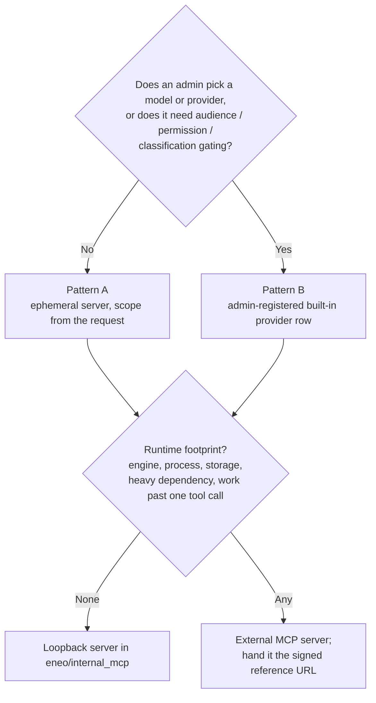

# Built-in Tool Servers

Eneo hosts a small set of Model Context Protocol (MCP) servers inside its own
backend, reached over a loopback HTTP route during a completion. This page
records what exists, the two ways such a server is attached to a completion,
the contract every built-in tool honours, and the standpoint on **what belongs
inside Eneo as a loopback tool and what belongs in an external MCP server**.

import { Callout } from "nextra/components";

<Callout type="info">
  For how loopback routing, scoped tokens and the shared proxy work, see
  [Knowledge Retrieval and MCP Interoperability](/docs/knowledge-retrieval-and-mcp).
  For the administrator view of web search and image generation, see [Web
  Search & Image Generation](/guides/capabilities).
</Callout>

## What exists today

All loopback servers live in `backend/src/eneo/internal_mcp/`, one module per
server plus shared scaffolding:

| Module | Role |
| --- | --- |
| `foundation.py` | Hosting and auth. Each server is a stateless FastMCP app mounted at `/internal-mcp/<name>/mcp`; the ask path connects back over HTTP through `INTERNAL_MCP_BASE_URL`. Scope never travels in tool arguments: a 15-minute JWT minted per completion carries `assistant_id` and, for built-in providers, `mcp_server_id`. `internal_tool_context` opens a DB transaction, authenticates the token as the user, and hands the tool a user-bound DI container so every load passes normal permission checks. |
| `registry.py` | The only hosting wiring. One tuple entry per server drives both the FastAPI mounts and the lifespan that runs each session manager. |
| `constants.py` | Server names and the `INTERNAL_MCP_SERVER_NAMES` set that bypasses per-call user approval. |
| `file_references.py` | The single resolver for signed attachment URLs. A URL is a capability handle: the token is verified locally and bytes come from the content store, never from an HTTP fetch. |
| `builtin_tools.py` | Swaps a persisted tool snapshot for the running server's live catalog so the model always sees the deployed definitions. |
| `availability.py` | The runtime gates for the ephemeral servers, in one place. |

Three servers are registered:

```text
/internal-mcp/knowledge/mcp          four tools
/internal-mcp/files/mcp              one tool  (read_file)
/internal-mcp/image_generation/mcp   one tool  (generate_image)
```

Web search has no loopback server. It is external-only.

## Two attachment patterns

### Pattern A: ephemeral, per completion

Used by **knowledge** and **files**. No database row, no admin surface, no
permission.

- The ask path checks `resolve_internal_mcp_availability`, calls
  `build_<x>_mcp_server` with a fresh token, and passes the entity into
  `Assistant.ask`, which prepends it so its tools lead the tool array and win
  name collisions.
- Tool calls are auto-approved by name.
- The tool description gets a per-completion suffix (source labels, attachment
  presence), but the docstring always leads.

This is the right shape for read-only helpers whose scope is fully derivable
from the request.

### Pattern B: admin-registered built-in provider

Used by **image generation**. An ordinary `mcp_servers` row with
`http_auth_type = "internal"`, a capability purpose, and an `image_model_id`
foreign key.

- It goes through the full capability machinery in `capability_resolver.py`:
  audiences and priority, role permission, space classification floor,
  backing-model health, and per-user resolution at ask time.
- The tool reads its configuration from the row named in the token, so the
  caller cannot choose it.
- Calls are **not** in the auto-approve set, so they honour the conversation's
  tool-approval setting.
- It has its own tool-call timeout in the proxy.

This is the shape for anything an admin must choose a provider or model for,
or that spends money.



## The shared contract

These invariants hold for both patterns and should be treated as the contract
for any new built-in tool:

- Tools return MCP content types: `TextContent`, `EmbeddedResource`,
  `ImageContent`, or a `CallToolResult` whose `_meta` uses OpenTelemetry GenAI
  attribute names. The proxy turns `image` blocks into generated files for any
  server, internal or external.
- Output is self-capped through `default_page_cap` with an `offset` parameter,
  because proxy truncation is destructive.
- Model-facing error strings are constants, and *not found* is
  indistinguishable from *out of scope*.
- External provider calls run after the DB transaction closes.
- Everything completes inside one tool call. No worker, no queue, no persistent
  state beyond what the ask path already persists.

## Standpoint: what should be a loopback tool

<Callout type="warning">
  **Rule.** A loopback tool is a pure function of the request, the tenant
  database, and at most one outbound provider call, finishing within a
  tool-call timeout, with no new process, storage, or heavyweight dependency.
  Use Pattern A when scope comes from the request and nothing needs
  configuring. Use Pattern B when an admin picks a backing model or provider,
  or when the feature needs audience, permission, or classification gating.
  Everything with a runtime footprint goes to an external MCP server.
</Callout>

Why the line sits there:

- The loopback route exists so internal and external tools share one
  execution boundary, not so Eneo becomes a host for arbitrary compute. The
  backend process is the chat API; a tool that needs memory proportional to a
  file or its own sandbox competes with every other request.
- An external server gets the same integration surface a built-in tool would:
  the signed file reference URL. Anything that can be expressed as "fetch this
  reference, do work, return MCP content" loses nothing by living outside.
- Built-in tools are deployed with Eneo, so their upgrade cadence, dependency
  set and security review are Eneo's. Keeping them thin keeps that surface
  small.

### Worked example: tabular querying

Tabular querying belongs **outside**. It needs an engine such as DuckDB, memory
proportional to the file, and most likely execution sandboxing. The integration
contract already exists: `read_file` tells the model to prefer "tabular or
spreadsheet analysis tools" from other servers and to pass them the same signed
URL. An external server receives the reference URL and fetches the bytes
through the signed download endpoint, which is the standard attachment surface
for all tools. See [How attachment references interoperate with external
MCP](/docs/knowledge-retrieval-and-mcp#how-attachment-references-interoperate-with-external-mcp).

### Worked example: image generation

Image generation stays **inside** as Pattern B: one outbound call to a provider
the admin already configured under model providers, credentials already
managed, output already handled by the proxy's image path. The only new
concept it needed was a purpose marker and a foreign key to the image model.
Image edits with reference images fit the same rule: the bytes come from the
content store through `file_references.py`, and the call is still one provider
request.

## Adding a new built-in server

The hosting side is one entry in `registry.py`. The rest depends on the
pattern:

| Step | Pattern A | Pattern B |
| --- | --- | --- |
| Module in `internal_mcp/` with a FastMCP app and `@mcp.tool` functions | Yes | Yes |
| Name in `constants.py` | Yes, and in `INTERNAL_MCP_SERVER_NAMES` if calls should be auto-approved | Yes; do not add to the auto-approve set |
| Availability gate | Extend `availability.py` and `build_<x>_mcp_server` | Capability purpose in `CAPABILITY_PURPOSES`, role permission, frontend descriptor (see the *Extending the capability set* section of `docs/CAPABILITIES.md` in the repo) |
| Token claims | `assistant_id` | `assistant_id` and `mcp_server_id` |
| Tests | `tests/unit/internal_mcp/` | `tests/unit/internal_mcp/` |

Things a new built-in server would hit that are not yet generic:

- The table check constraint ties internal auth to a non-null `image_model_id`,
  and the service validation is image-specific. A built-in provider without an
  image model needs that relaxed into a general backing-model concept; the
  `MCPServerBackingModel` projection is the generalisable half.
- Auto-approval is a name set in `constants.py` rather than a per-server
  attribute in the registry, and the per-server timeout in the proxy is keyed
  on the image generation purpose.
- Test placement is inconsistent: the newest server tests sit in
  `tests/unit/internal_mcp/`, the knowledge and files tests sit at
  `tests/unit/test_*_mcp_server.py`. New servers should use the former.
