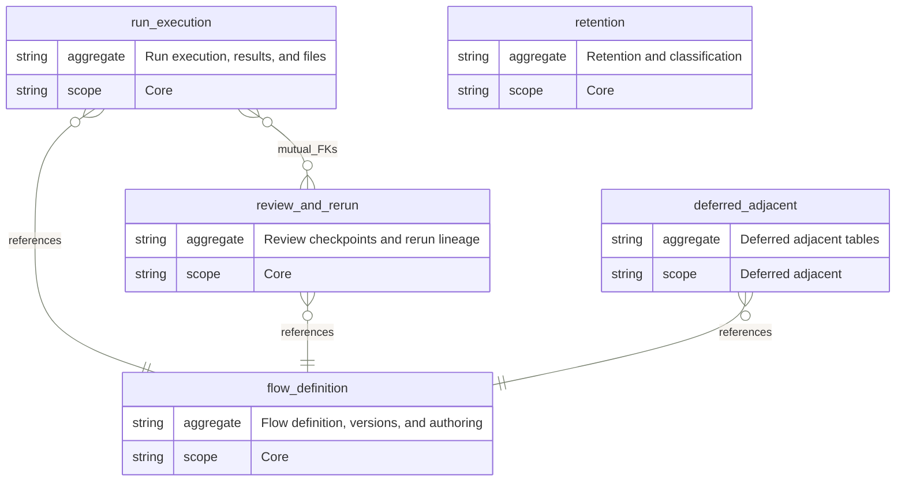
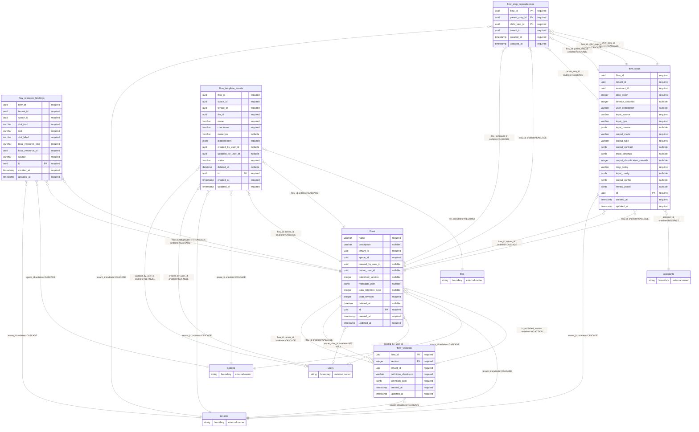
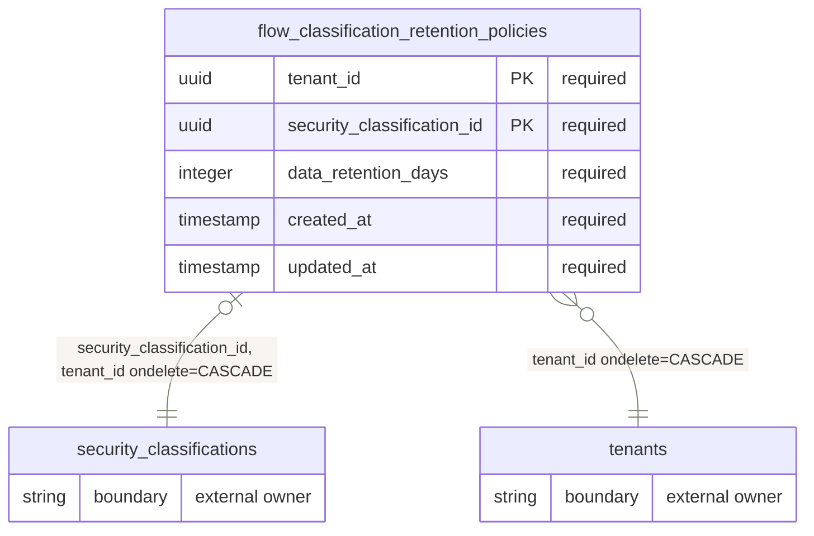
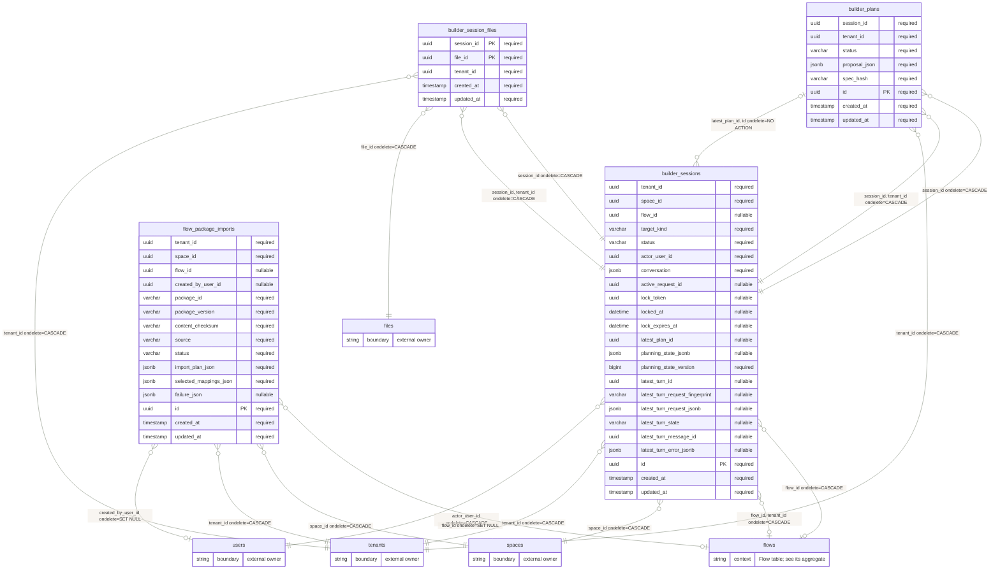

import { Cards } from "nextra/components";

# The data schema

Use this page before changing Flow tables, retention, or JSONB. It shows each database aggregate, delete rule, writer, and typed JSON owner.

This page is generated from SQLAlchemy metadata and the Flow JSONB ownership registry. Run `make docs:regen` from the repository root after schema or JSONB ownership changes; it includes the schema docs generator.

The ERDs are split by aggregate. Nodes marked `external owner` are platform-owned tables referenced by Flow foreign keys. Relationship labels show local FK columns and delete `ondelete` behavior; `NO ACTION` can be explicit or the SQL default.

## Aggregate map

Single-direction links point from the aggregate that owns the foreign key to the aggregate it references; mutual links combine foreign keys in both directions. Delete behavior stays on the ERD labels below.

### ERD shortcuts

Use these cards to jump to one aggregate ERD. The diagrams stay visible on the page so Mermaid can render them reliably.

<Cards num={3}>

<Cards.Card
  title="Flow definition, versions, and authoring"
  href="#flow-definition-versions-and-authoring"
  arrow
/>

<Cards.Card
  title="Run execution, results, and files"
  href="#run-execution-results-and-files"
  arrow
/>

<Cards.Card
  title="Review checkpoints and rerun lineage"
  href="#review-checkpoints-and-rerun-lineage"
  arrow
/>

<Cards.Card
  title="Retention and classification"
  href="#retention-and-classification"
  arrow
/>

<Cards.Card
  title="Deferred adjacent tables"
  href="#deferred-adjacent-tables"
  arrow
/>

</Cards>

### Tables by aggregate

| Aggregate                                | Scope             | What it owns                                                                                                                               | Tables                                                                                                                                                                                                   |
| ---------------------------------------- | ----------------- | ------------------------------------------------------------------------------------------------------------------------------------------ | -------------------------------------------------------------------------------------------------------------------------------------------------------------------------------------------------------- |
| Flow definition, versions, and authoring | Core              | Authoring tables define the draft Flow, immutable published versions, step graph, templates, and local resource bindings.                  | `flow_resource_bindings`, `flow_step_dependencies`, `flow_steps`, `flow_template_assets`, `flow_versions`, `flows`                                                                                       |
| Run execution, results, and files        | Core              | Runtime tables persist runs, attempts, current step results, runtime uploads, generated files, audit delivery, and outbound HTTP delivery. | `flow_run_audit_outbox`, `flow_run_step_input_files`, `flow_run_step_result_files`, `flow_run_webhook_deliveries`, `flow_runs`, `flow_runtime_uploaded_files`, `flow_step_attempts`, `flow_step_results` |
| Review checkpoints and rerun lineage     | Core              | Review and rerun tables preserve human checkpoints, rerun requests, and invalidation lineage without deleting earlier history.             | `flow_run_rerun_invalidated_steps`, `flow_run_rerun_operations`, `flow_run_review_checkpoints`                                                                                                           |
| Retention and classification             | Core              | Retention policy tables tighten run-history purge windows by tenant security classification.                                               | `flow_classification_retention_policies`                                                                                                                                                                 |
| Deferred adjacent tables                 | Deferred adjacent | Adjacent builder and import tables live near Flow persistence but are not core runtime/history aggregates.                                 | `builder_plans`, `builder_session_files`, `builder_sessions`, `flow_package_imports`                                                                                                                     |

## Aggregate entity relationship diagrams

### Flow definition, versions, and authoring

Authoring tables define the draft Flow, immutable published versions, step graph, templates, and local resource bindings.

### Run execution, results, and files

Runtime tables persist runs, attempts, current step results, runtime uploads, generated files, audit delivery, and outbound HTTP delivery.

```mermaid
%%{init: {"themeVariables": {"background": "#f8f6f0", "primaryColor": "#e8ded1", "primaryTextColor": "#242620", "primaryBorderColor": "#6f7b5d", "secondaryColor": "#d7e0d2", "tertiaryColor": "#f1ece4", "lineColor": "#78816f", "edgeLabelBackground": "#f8f6f0", "clusterBkg": "#f4efe7", "clusterBorder": "#9a8a73", "fontFamily": "Inter, ui-sans-serif, system-ui, sans-serif"}}}%%
erDiagram
  flow_run_audit_outbox {
    uuid tenant_id "required"
    uuid flow_id "required"
    uuid flow_run_id "required"
    integer run_revision "required"
    uuid review_checkpoint_id "nullable"
    integer checkpoint_revision "nullable"
    varchar description "required"
    varchar action "required"
    varchar entity_type "required"
    uuid entity_id "required"
    uuid actor_id "nullable"
    varchar actor_type "required"
    uuid actor_api_key_id "nullable"
    varchar source "required"
    varchar target_status "required"
    varchar error_code "nullable"
    varchar error_message "nullable"
    varchar delivery_status "required"
    integer delivery_attempts "required"
    timestamp next_delivery_at "nullable"
    timestamp delivered_at "nullable"
    timestamp dead_lettered_at "nullable"
    text delivery_last_error "nullable"
    uuid id PK "required"
    timestamp created_at "required"
    timestamp updated_at "required"
  }
  flow_run_step_input_files {
    uuid flow_run_id "required"
    uuid flow_id "required"
    uuid tenant_id "required"
    uuid step_id "required"
    integer step_order "required"
    integer attempt_no "required"
    uuid file_id "required"
    integer ordinal "required"
    uuid id PK "required"
    timestamp created_at "required"
    timestamp updated_at "required"
  }
  flow_run_step_result_files {
    uuid flow_run_id "required"
    uuid flow_id "required"
    uuid tenant_id "required"
    uuid step_result_id "required"
    uuid step_id "required"
    integer step_order "required"
    integer attempt_no "required"
    uuid file_id "required"
    integer ordinal "required"
    varchar source "required"
    uuid id PK "required"
    timestamp created_at "required"
    timestamp updated_at "required"
  }
  flow_run_webhook_deliveries {
    uuid tenant_id "required"
    uuid flow_id "required"
    uuid flow_run_id "required"
    uuid step_id "required"
    integer step_order "required"
    integer attempt_no "required"
    varchar idempotency_key "required"
    varchar payload_ref "required"
    varchar delivery_status "required"
    integer delivery_attempts "required"
    timestamp next_delivery_at "nullable"
    uuid claim_token "nullable"
    timestamp claimed_at "nullable"
    timestamp claim_expires_at "nullable"
    timestamp delivered_at "nullable"
    timestamp dead_lettered_at "nullable"
    text delivery_last_error "nullable"
    uuid id PK "required"
    timestamp created_at "required"
    timestamp updated_at "required"
  }
  flow_runs {
    uuid flow_id "required"
    integer flow_version "required"
    varchar principal_type "required"
    uuid principal_user_id "nullable"
    uuid principal_service_id "nullable"
    uuid created_by_api_key_id "nullable"
    varchar runtime_service_permission "nullable"
    uuid tenant_id "required"
    uuid trace_id "required"
    varchar idempotency_key "nullable"
    varchar request_fingerprint "nullable"
    integer revision "required"
    varchar status "required"
    datetime dispatch_pending_since "nullable"
    integer dispatch_attempt_count "required"
    datetime dispatch_last_attempt_at "nullable"
    jsonb dispatch_last_error "nullable"
    datetime dispatch_next_attempt_at "nullable"
    datetime dispatched_at "nullable"
    datetime dispatch_exhausted_at "nullable"
    datetime cancelled_at "nullable"
    datetime started_at "nullable"
    datetime finished_at "nullable"
    jsonb input_payload_json "nullable"
    jsonb output_payload_json "nullable"
    jsonb error_json "nullable"
    uuid job_id "nullable"
    uuid id PK "required"
    timestamp created_at "required"
    timestamp updated_at "required"
  }
  flow_runtime_uploaded_files {
    uuid file_id PK "required"
    uuid flow_id "required"
    uuid tenant_id "required"
    uuid uploaded_for_step_id "required"
    varchar owner_type "required"
    uuid owner_user_id "nullable"
    uuid owner_service_id "nullable"
    timestamp created_at "required"
    timestamp updated_at "required"
  }
  flow_step_attempts {
    uuid flow_run_id "required"
    uuid flow_id "required"
    uuid tenant_id "required"
    uuid step_id "required"
    integer step_order "required"
    integer attempt_no "required"
    uuid rerun_operation_id "nullable"
    uuid predecessor_attempt_id "nullable"
    uuid superseded_by_attempt_id "nullable"
    varchar celery_task_id "nullable"
    varchar status "required"
    varchar error_code "nullable"
    varchar error_message "nullable"
    varchar requested_model "nullable"
    varchar response_model "nullable"
    varchar provider "nullable"
    varchar finish_reason "nullable"
    varchar provider_response_id "nullable"
    integer num_tokens_input "nullable"
    integer num_tokens_output "nullable"
    jsonb provenance_json "nullable"
    jsonb input_payload_json "nullable"
    jsonb output_payload_json "nullable"
    varchar flow_step_execution_hash "nullable"
    datetime started_at "required"
    datetime finished_at "nullable"
    uuid id PK "required"
    timestamp created_at "required"
    timestamp updated_at "required"
  }
  flow_step_results {
    uuid flow_run_id "required"
    uuid flow_id "required"
    uuid tenant_id "required"
    uuid step_id "required"
    integer step_order "required"
    uuid assistant_id "nullable"
    integer current_attempt_no "nullable"
    jsonb input_payload_json "nullable"
    varchar effective_prompt "nullable"
    jsonb output_payload_json "nullable"
    jsonb model_parameters_json "nullable"
    integer num_tokens_input "nullable"
    integer num_tokens_output "nullable"
    varchar status "required"
    varchar error_code "nullable"
    varchar error_message "nullable"
    varchar flow_step_execution_hash "nullable"
    datetime started_at "nullable"
    datetime finished_at "nullable"
    uuid id PK "required"
    timestamp created_at "required"
    timestamp updated_at "required"
  }
  flow_run_rerun_operations {
    string context "Flow table; see its aggregate"
  }
  flow_run_review_checkpoints {
    string context "Flow table; see its aggregate"
  }
  flow_versions {
    string context "Flow table; see its aggregate"
  }
  flows {
    string context "Flow table; see its aggregate"
  }
  api_keys_v2 {
    string boundary "external owner"
  }
  assistants {
    string boundary "external owner"
  }
  files {
    string boundary "external owner"
  }
  jobs {
    string boundary "external owner"
  }
  service_principals {
    string boundary "external owner"
  }
  tenants {
    string boundary "external owner"
  }
  users {
    string boundary "external owner"
  }
  flow_run_audit_outbox }o--o| api_keys_v2 : "actor_api_key_id ondelete=SET NULL"
  flow_run_audit_outbox }o--o| flow_run_review_checkpoints : "review_checkpoint_id ondelete=RESTRICT"
  flow_run_audit_outbox }o--|| flow_runs : "flow_run_id, flow_id ondelete=RESTRICT"
  flow_run_audit_outbox }o--|| flow_runs : "flow_run_id, tenant_id ondelete=RESTRICT"
  flow_run_audit_outbox }o--|| flows : "flow_id ondelete=RESTRICT"
  flow_run_audit_outbox }o--|| tenants : "tenant_id ondelete=CASCADE"
  flow_run_audit_outbox }o--o| users : "actor_id ondelete=SET NULL"
  flow_run_step_input_files }o--|| files : "file_id ondelete=RESTRICT"
  flow_run_step_input_files }o--|| flow_runs : "flow_run_id, flow_id ondelete=CASCADE"
  flow_run_step_input_files }o--|| flow_runs : "flow_run_id, tenant_id ondelete=CASCADE"
  flow_run_step_input_files }o--|| flow_runtime_uploaded_files : "file_id, flow_id, tenant_id ondelete=RESTRICT"
  flow_run_step_input_files }o--|| flows : "flow_id ondelete=CASCADE"
  flow_run_step_input_files }o--|| tenants : "tenant_id ondelete=CASCADE"
  flow_run_step_result_files }o--|| files : "file_id ondelete=RESTRICT"
  flow_run_step_result_files }o--|| flow_runs : "flow_run_id, flow_id ondelete=CASCADE"
  flow_run_step_result_files }o--|| flow_runs : "flow_run_id, tenant_id ondelete=CASCADE"
  flow_run_step_result_files }o--|| flow_step_attempts : "flow_run_id, step_id, attempt_no ondelete=CASCADE"
  flow_run_step_result_files }o--|| flow_step_results : "step_result_id ondelete=CASCADE"
  flow_run_step_result_files }o--|| flows : "flow_id ondelete=CASCADE"
  flow_run_step_result_files }o--|| tenants : "tenant_id ondelete=CASCADE"
  flow_run_webhook_deliveries }o--|| flow_runs : "flow_run_id, flow_id ondelete=RESTRICT"
  flow_run_webhook_deliveries }o--|| flow_runs : "flow_run_id, tenant_id ondelete=RESTRICT"
  flow_run_webhook_deliveries |o--|| flow_step_attempts : "flow_run_id, step_id, attempt_no ondelete=RESTRICT"
  flow_run_webhook_deliveries }o--|| flows : "flow_id ondelete=RESTRICT"
  flow_run_webhook_deliveries }o--|| tenants : "tenant_id ondelete=CASCADE"
  flow_runs }o--o| api_keys_v2 : "created_by_api_key_id ondelete=SET NULL"
  flow_runs }o--|| flow_versions : "flow_id, flow_version ondelete=RESTRICT"
  flow_runs }o--|| flows : "flow_id ondelete=CASCADE"
  flow_runs }o--|| flows : "flow_id, tenant_id ondelete=CASCADE"
  flow_runs }o--o| jobs : "job_id ondelete=SET NULL"
  flow_runs }o--o| service_principals : "principal_service_id ondelete=RESTRICT"
  flow_runs }o--|| tenants : "tenant_id ondelete=CASCADE"
  flow_runs }o--o| users : "principal_user_id ondelete=RESTRICT"
  flow_runtime_uploaded_files |o--|| files : "file_id ondelete=CASCADE"
  flow_runtime_uploaded_files }o--|| flows : "flow_id, tenant_id ondelete=CASCADE"
  flow_runtime_uploaded_files }o--o| service_principals : "owner_service_id ondelete=RESTRICT"
  flow_runtime_uploaded_files }o--|| tenants : "tenant_id ondelete=CASCADE"
  flow_runtime_uploaded_files }o--o| users : "owner_user_id ondelete=RESTRICT"
  flow_step_attempts }o--o| flow_run_rerun_operations : "rerun_operation_id ondelete=SET NULL"
  flow_step_attempts }o--|| flow_runs : "flow_run_id ondelete=CASCADE"
  flow_step_attempts }o--|| flow_runs : "flow_run_id, flow_id ondelete=CASCADE"
  flow_step_attempts }o--|| flow_runs : "flow_run_id, tenant_id ondelete=CASCADE"
  flow_step_attempts }o--o| flow_step_attempts : "predecessor_attempt_id ondelete=SET NULL"
  flow_step_attempts }o--o| flow_step_attempts : "superseded_by_attempt_id ondelete=SET NULL"
  flow_step_attempts }o--|| flows : "flow_id ondelete=CASCADE"
  flow_step_attempts }o--|| tenants : "tenant_id ondelete=CASCADE"
  flow_step_results }o--o| assistants : "assistant_id ondelete=SET NULL"
  flow_step_results }o--|| flow_runs : "flow_run_id ondelete=CASCADE"
  flow_step_results }o--|| flow_runs : "flow_run_id, flow_id ondelete=CASCADE"
  flow_step_results }o--|| flow_runs : "flow_run_id, tenant_id ondelete=CASCADE"
  flow_step_results }o--|| flows : "flow_id ondelete=CASCADE"
  flow_step_results }o--|| tenants : "tenant_id ondelete=CASCADE"
```

### Review checkpoints and rerun lineage

Review and rerun tables preserve human checkpoints, rerun requests, and invalidation lineage without deleting earlier history.

```mermaid
%%{init: {"themeVariables": {"background": "#f8f6f0", "primaryColor": "#e8ded1", "primaryTextColor": "#242620", "primaryBorderColor": "#6f7b5d", "secondaryColor": "#d7e0d2", "tertiaryColor": "#f1ece4", "lineColor": "#78816f", "edgeLabelBackground": "#f8f6f0", "clusterBkg": "#f4efe7", "clusterBorder": "#9a8a73", "fontFamily": "Inter, ui-sans-serif, system-ui, sans-serif"}}}%%
erDiagram
  flow_run_rerun_invalidated_steps {
    uuid operation_id "required"
    uuid tenant_id "required"
    uuid flow_id "required"
    uuid flow_run_id "required"
    uuid step_id "required"
    integer step_order "required"
    integer invalidation_order "required"
    varchar role "required"
    jsonb dependency_sources_json "required"
    uuid prior_step_result_id "nullable"
    uuid prior_attempt_id "nullable"
    integer new_attempt_no "nullable"
    uuid new_attempt_id "nullable"
    uuid id PK "required"
    timestamp created_at "required"
    timestamp updated_at "required"
  }
  flow_run_rerun_operations {
    uuid tenant_id "required"
    uuid flow_id "required"
    uuid flow_run_id "required"
    uuid rerun_step_id "required"
    integer rerun_step_order "required"
    integer root_attempt_no "required"
    uuid root_attempt_id "nullable"
    varchar status "required"
    varchar request_fingerprint "required"
    integer expected_run_revision "required"
    integer accepted_run_revision "required"
    text reason "required"
    jsonb input_payload_json "nullable"
    boolean root_step_input_override_requested "required"
    varchar requested_by_principal_type "required"
    uuid requested_by_user_id "nullable"
    uuid requested_by_service_id "nullable"
    varchar failure_code "nullable"
    varchar failure_message "nullable"
    datetime started_at "nullable"
    datetime finished_at "nullable"
    uuid id PK "required"
    timestamp created_at "required"
    timestamp updated_at "required"
  }
  flow_run_review_checkpoints {
    uuid tenant_id "required"
    uuid flow_id "required"
    uuid flow_run_id "required"
    uuid step_id "required"
    integer step_order "required"
    integer attempt_no "required"
    varchar state "required"
    integer revision "required"
    integer schema_version "required"
    jsonb original_payload_json "nullable"
    jsonb current_payload_json "nullable"
    text step_label "nullable"
    varchar review_mode "required"
    varchar output_type "required"
    jsonb output_contract_json "nullable"
    uuid requester_user_id "nullable"
    uuid requester_service_id "nullable"
    varchar requester_principal_type "required"
    uuid decided_by_user_id "nullable"
    uuid decided_by_service_id "nullable"
    varchar decided_by_principal_type "nullable"
    jsonb next_step_ids_json "nullable"
    varchar resume_idempotency_key "nullable"
    datetime edited_at "nullable"
    datetime approved_at "nullable"
    datetime rejected_at "nullable"
    datetime resumed_at "nullable"
    datetime cancelled_at "nullable"
    datetime expires_at "nullable"
    datetime expired_at "nullable"
    uuid id PK "required"
    timestamp created_at "required"
    timestamp updated_at "required"
  }
  flow_runs {
    string context "Flow table; see its aggregate"
  }
  flow_step_attempts {
    string context "Flow table; see its aggregate"
  }
  flow_step_results {
    string context "Flow table; see its aggregate"
  }
  flows {
    string context "Flow table; see its aggregate"
  }
  service_principals {
    string boundary "external owner"
  }
  tenants {
    string boundary "external owner"
  }
  users {
    string boundary "external owner"
  }
  flow_run_rerun_invalidated_steps }o--|| flow_run_rerun_operations : "operation_id ondelete=CASCADE"
  flow_run_rerun_invalidated_steps }o--|| flow_runs : "flow_run_id, flow_id ondelete=CASCADE"
  flow_run_rerun_invalidated_steps }o--|| flow_runs : "flow_run_id, tenant_id ondelete=CASCADE"
  flow_run_rerun_invalidated_steps }o--o| flow_step_attempts : "new_attempt_id ondelete=SET NULL"
  flow_run_rerun_invalidated_steps }o--o| flow_step_attempts : "prior_attempt_id ondelete=SET NULL"
  flow_run_rerun_invalidated_steps }o--o| flow_step_results : "prior_step_result_id ondelete=SET NULL"
  flow_run_rerun_invalidated_steps }o--|| flows : "flow_id ondelete=CASCADE"
  flow_run_rerun_invalidated_steps }o--|| tenants : "tenant_id ondelete=CASCADE"
  flow_run_rerun_operations }o--|| flow_runs : "flow_run_id, flow_id ondelete=CASCADE"
  flow_run_rerun_operations }o--|| flow_runs : "flow_run_id, tenant_id ondelete=CASCADE"
  flow_run_rerun_operations }o--o| flow_step_attempts : "root_attempt_id ondelete=SET NULL"
  flow_run_rerun_operations }o--|| flows : "flow_id ondelete=CASCADE"
  flow_run_rerun_operations }o--o| service_principals : "requested_by_service_id ondelete=RESTRICT"
  flow_run_rerun_operations }o--|| tenants : "tenant_id ondelete=CASCADE"
  flow_run_rerun_operations }o--o| users : "requested_by_user_id ondelete=RESTRICT"
  flow_run_review_checkpoints }o--|| flow_runs : "flow_run_id, flow_id ondelete=CASCADE"
  flow_run_review_checkpoints }o--|| flow_runs : "flow_run_id, tenant_id ondelete=CASCADE"
  flow_run_review_checkpoints |o--|| flow_step_attempts : "flow_run_id, step_id, attempt_no ondelete=RESTRICT"
  flow_run_review_checkpoints }o--|| flows : "flow_id ondelete=CASCADE"
  flow_run_review_checkpoints }o--o| service_principals : "decided_by_service_id ondelete=SET NULL"
  flow_run_review_checkpoints }o--o| service_principals : "requester_service_id ondelete=SET NULL"
  flow_run_review_checkpoints }o--|| tenants : "tenant_id ondelete=CASCADE"
  flow_run_review_checkpoints }o--o| users : "decided_by_user_id ondelete=SET NULL"
  flow_run_review_checkpoints }o--o| users : "requester_user_id ondelete=SET NULL"
```

### Retention and classification

Retention policy tables tighten run-history purge windows by tenant security classification.

### Deferred adjacent tables

Adjacent builder and import tables live near Flow persistence but are not core runtime/history aggregates.

## Tables

| Table                                    | Model                                 | Aggregate                                | What it stores                                | Primary writer                               | Why it exists                                                                |
| ---------------------------------------- | ------------------------------------- | ---------------------------------------- | --------------------------------------------- | -------------------------------------------- | ---------------------------------------------------------------------------- |
| `flow_resource_bindings`                 | `FlowResourceBindings`                | Flow definition, versions, and authoring | local resource bindings for a Flow.           | FlowRepository.                              | keep tenant-local resource ids outside portable flow packages.               |
| `flow_step_dependencies`                 | `FlowStepDependencies`                | Flow definition, versions, and authoring | explicit draft step dependency edges.         | FlowRepository.                              | keep authored graph constraints queryable and tenant-scoped.                 |
| `flow_steps`                             | `FlowSteps`                           | Flow definition, versions, and authoring | ordered draft step configuration.             | FlowRepository.                              | define the editable step graph before publish freezes a version.             |
| `flow_template_assets`                   | `FlowTemplateAssets`                  | Flow definition, versions, and authoring | DOCX template assets for a Flow.              | FlowTemplateAssetRepository.                 | bind uploaded template files and placeholder indexes to authoring.           |
| `flow_versions`                          | `FlowVersions`                        | Flow definition, versions, and authoring | immutable published Flow definitions.         | FlowRepository.                              | provide checksummed runtime snapshots for every run.                         |
| `flows`                                  | `Flows`                               | Flow definition, versions, and authoring | mutable Flow drafts and publish pointers.     | FlowRepository.                              | keep authoring state separate from immutable runtime versions.               |
| `flow_run_audit_outbox`                  | `FlowRunAuditOutbox`                  | Run execution, results, and files        | durable Flow lifecycle audit intents.         | FlowRunAuditOutboxRepository.                | deliver content-free audit logs while preserving run transaction order.      |
| `flow_run_step_input_files`              | `FlowRunStepInputFiles`               | Run execution, results, and files        | files bound as step inputs for a run attempt. | FlowRunRepository.                           | make runtime file override intent relational and auditable.                  |
| `flow_run_step_result_files`             | `FlowRunStepResultFiles`              | Run execution, results, and files        | files produced by step results.               | FlowRunRepository.                           | connect generated artifacts to the run, step, attempt, and file owner graph. |
| `flow_run_webhook_deliveries`            | `FlowRunWebhookDeliveries`            | Run execution, results, and files        | HTTP step delivery outbox rows.               | FlowRunWebhookDeliveryRepository.            | claim, retry, dead-letter, and finalize webhook deliveries durably.          |
| `flow_runs`                              | `FlowRuns`                            | Run execution, results, and files        | one execution of a published Flow version.    | FlowRunRepository.                           | persist principal, status, input, output, and lifecycle anchors.             |
| `flow_runtime_uploaded_files`            | `FlowRuntimeUploadedFiles`            | Run execution, results, and files        | reusable runtime upload files.                | FlowRuntimeUploadRepository.                 | bind pre-run uploads to a Flow, step, tenant, and principal.                 |
| `flow_step_attempts`                     | `FlowStepAttempts`                    | Run execution, results, and files        | individual step execution attempts.           | FlowRunRepository.                           | preserve retry diagnostics, timings, prompts, and raw attempt payloads.      |
| `flow_step_results`                      | `FlowStepResults`                     | Run execution, results, and files        | current per-step runtime results.             | FlowRunRepository.                           | keep step status, payloads, diagnostics, and output metadata per run.        |
| `flow_run_rerun_invalidated_steps`       | `FlowRunRerunInvalidatedSteps`        | Review checkpoints and rerun lineage     | step invalidation markers from reruns.        | FlowRunRerunRepository.                      | preserve rerun lineage without deleting earlier step history immediately.    |
| `flow_run_rerun_operations`              | `FlowRunRerunOperations`              | Review checkpoints and rerun lineage     | rerun requests for existing Flow runs.        | FlowRunRerunRepository.                      | record rerun intent, invalidation, and terminal rerun outcome.               |
| `flow_run_review_checkpoints`            | `FlowRunReviewCheckpoints`            | Review checkpoints and rerun lineage     | human review pauses for Flow runs.            | FlowRunReviewCheckpointRepository.           | track editable checkpoint state, revisions, decisions, and expiry.           |
| `flow_classification_retention_policies` | `FlowClassificationRetentionPolicies` | Retention and classification             | classification-scoped Flow retention windows. | FlowClassificationRetentionPolicyRepository. | tighten Flow run-history purge horizons by tenant security classification.   |
| `builder_plans`                          | `BuilderPlans`                        | Deferred adjacent tables                 | Flow AI Builder proposed plans.               | Flow AI Builder planner.                     | preserve one canonical proposal snapshot.                                    |
| `builder_session_files`                  | `BuilderSessionFiles`                 | Deferred adjacent tables                 | files attached to Flow AI Builder sessions.   | Flow AI Builder session service.             | keep uploaded builder context files tenant-scoped.                           |
| `builder_sessions`                       | `BuilderSessions`                     | Deferred adjacent tables                 | Flow AI Builder conversations.                | Flow AI Builder session service.             | keep builder chat, planning state, locks, and target Flow linkage.           |
| `flow_package_imports`                   | `FlowPackageImports`                  | Deferred adjacent tables                 | Flow package import attempts.                 | FlowPackageImportRepository.                 | keep import plans, selected mappings, and terminal import results auditable. |

## JSONB policy

| Column                                                     | Envelope                             | Owner                                                       | Category                | Version policy            | Corruption behavior         | Relational candidate | Rationale                                                                                                                                                                |
| ---------------------------------------------------------- | ------------------------------------ | ----------------------------------------------------------- | ----------------------- | ------------------------- | --------------------------- | -------------------- | ------------------------------------------------------------------------------------------------------------------------------------------------------------------------ |
| `builder_plans.proposal_json`                              | `FlowBuilderProposal`                | `eneo.flows.ai_builder.ai_builder_domain_models`            | `immutable_snapshot`    | `owner_validated_shape`   | `reject_before_write`       | no                   | Builder plans persist one immutable proposal snapshot validated through FlowBuilderProposal; spec_hash rejects silent row drift.                                         |
| `builder_sessions.conversation`                            | `ConversationMessage`                | `eneo.flows.ai_builder.ai_builder_domain_models`            | `builder_session_state` | `owner_validated_shape`   | `fail_session_load`         | no                   | Builder conversation history is stored as a JSON array of ConversationMessage entries; persisted rows fail session loading when required stable message ids are missing. |
| `builder_sessions.planning_state_jsonb`                    | `PlanningState`                      | `eneo.flows.ai_builder.planning_state`                      | `builder_session_state` | `embedded_schema_version` | `fail_session_load`         | no                   | Builder planning state is a full-snapshot PlanningState document with embedded FCM, planner-contract, and builder schema versions.                                       |
| `flow_package_imports.failure_json`                        | `FlowPackageImportFailure`           | `eneo.flow_packages.domain.flow_package_import_record`      | `import_state`          | `owner_validated_shape`   | `keep_auditable_failure`    | no                   | Failed imports need a structured failure snapshot while preserving the terminal import row for audit.                                                                    |
| `flow_package_imports.import_plan_json`                    | `FlowPackageImportPlan`              | `eneo.flow_packages.domain.flow_package_import_plan`        | `import_state`          | `embedded_schema_version` | `reject_before_write`       | no                   | Import plans are portable package decisions with their own schema version and are applied atomically, not queried field-by-field.                                        |
| `flow_package_imports.selected_mappings_json`              | `FlowPackageSelectedMappings`        | `eneo.flow_packages.domain.flow_package_import_record`      | `import_state`          | `owner_validated_shape`   | `reject_before_write`       | no                   | Selected mappings preserve the user's import choices for audit and replay without introducing package-specific relational tables.                                        |
| `flow_run_rerun_invalidated_steps.dependency_sources_json` | `RerunInvalidationDependencySources` | `eneo.flows.flow_run_rerun_graph`                           | `rerun_state`           | `owner_validated_shape`   | `reject_before_write`       | no                   | Dependency sources are a bounded string set derived from the rerun graph and stored with each invalidation row for reviewability.                                        |
| `flow_run_rerun_operations.input_payload_json`             | `FlowRunRerunInputEnvelope`          | `eneo.flows.application.flow_run_rerun_service`             | `rerun_state`           | `owner_validated_shape`   | `reject_before_write`       | no                   | Rerun input overrides are captured with the operation so replay and idempotency can be audited without changing the original run input.                                  |
| `flow_run_review_checkpoints.current_payload_json`         | `ReviewCheckpointCurrentPayload`     | `eneo.flows.infrastructure.flow_run_review_checkpoint_repo` | `review_checkpoint`     | `table_schema_version`    | `reject_before_write`       | no                   | Current reviewed output is checkpoint-local mutable state guarded by checkpoint revision and schema version.                                                             |
| `flow_run_review_checkpoints.next_step_ids_json`           | `ReviewCheckpointNextStepIds`        | `eneo.flows.infrastructure.flow_run_review_checkpoint_repo` | `review_checkpoint`     | `table_schema_version`    | `reject_before_write`       | no                   | Next-step ids are a small resume snapshot from the published graph; there is no separate row identity to constrain relationally.                                         |
| `flow_run_review_checkpoints.original_payload_json`        | `ReviewCheckpointOriginalPayload`    | `eneo.flows.infrastructure.flow_run_review_checkpoint_repo` | `review_checkpoint`     | `table_schema_version`    | `reject_before_write`       | no                   | The checkpoint keeps the original reviewed output next to its state revision so reviewer edits can be compared and audited.                                              |
| `flow_run_review_checkpoints.output_contract_json`         | `ReviewCheckpointOutputContract`     | `eneo.flows.infrastructure.flow_run_review_checkpoint_repo` | `review_checkpoint`     | `table_schema_version`    | `reject_before_write`       | no                   | The output contract is snapshotted with the checkpoint so review UI can validate edits against the published step contract.                                              |
| `flow_runs.error_json`                                     | `FlowRunError`                       | `eneo.flows.flow_run_error`                                 | `runtime_payload`       | `embedded_schema_version` | `keep_auditable_failure`    | no                   | Terminal error details are a public diagnostic envelope with an embedded schema version; invalid stored payloads read as one sanitized typed run error.                  |
| `flow_runs.input_payload_json`                             | `FlowRunInputEnvelope`               | `eneo.flows.flow_run_input_envelope`                        | `runtime_payload`       | `owner_validated_shape`   | `fail_run_or_step`          | no                   | Run input is caller-provided execution data with variable keys; the input envelope owns reserved keys and file binding semantics.                                        |
| `flow_runs.output_payload_json`                            | `FlowRunOutputPayload`               | `eneo.flows.runtime.run_outcome`                            | `runtime_payload`       | `owner_validated_shape`   | `keep_auditable_failure`    | no                   | Terminal run output mirrors the final runtime result and is read as one payload by run-contract projection code.                                                         |
| `flow_step_attempts.input_payload_json`                    | `FlowStepAttemptInputPayload`        | `eneo.flows.runtime.step_result_builder`                    | `runtime_payload`       | `owner_validated_shape`   | `fail_run_or_step`          | no                   | Attempt input is the immutable execution snapshot for a single try and differs from the current step result during reruns.                                               |
| `flow_step_attempts.output_payload_json`                   | `FlowStepAttemptOutputPayload`       | `eneo.flows.runtime.step_result_builder`                    | `runtime_payload`       | `owner_validated_shape`   | `keep_auditable_failure`    | no                   | Attempt output preserves each try's raw runtime result before the current step result is updated or superseded.                                                          |
| `flow_step_attempts.provenance_json`                       | `FlowStepAttemptProvenance`          | `eneo.flows.flow_run_provenance`                            | `provenance_evidence`   | `embedded_schema_version` | `mark_evidence_unavailable` | no                   | Attempt provenance records provider, retrieval, and evidence context whose shape is useful as one diagnostic document.                                                   |
| `flow_step_results.input_payload_json`                     | `FlowStepResultInputPayload`         | `eneo.flows.runtime.step_result_builder`                    | `runtime_payload`       | `owner_validated_shape`   | `fail_run_or_step`          | no                   | Step-result input is the resolved runtime input snapshot used to debug what the step saw.                                                                                |
| `flow_step_results.model_parameters_json`                  | `FlowStepModelParameters`            | `eneo.flows.flow_run_provenance`                            | `provenance_evidence`   | `provider_defined`        | `mark_evidence_unavailable` | no                   | Model parameters are provider-facing provenance, not relational business state, and may vary by model vendor.                                                            |
| `flow_step_results.output_payload_json`                    | `FlowStepResultOutputPayload`        | `eneo.flows.runtime.step_result_builder`                    | `runtime_payload`       | `owner_validated_shape`   | `keep_auditable_failure`    | no                   | Step-result output is mode-specific runtime data projected to API consumers as one typed result payload.                                                                 |
| `flow_steps.input_bindings`                                | `StepInputBindings`                  | `eneo.flows.runtime.step_definition_parser`                 | `authored_config`       | `owner_validated_shape`   | `reject_before_write`       | no                   | Bindings are authored graph references with mode-specific shapes; keeping them in JSON avoids artificial join tables for sparse forms.                                   |
| `flow_steps.input_config`                                  | `StepInputConfig`                    | `eneo.flows.runtime.step_definition_parser`                 | `authored_config`       | `owner_validated_shape`   | `reject_before_write`       | no                   | Input configuration is a mode-specific envelope validated at the authoring boundary and read as part of the step definition.                                             |
| `flow_steps.input_contract`                                | `StepInputContract`                  | `eneo.flows.runtime.step_definition_parser`                 | `authored_config`       | `owner_validated_shape`   | `reject_before_write`       | no                   | Step input contracts are authored per step and validated into the published runtime definition rather than queried relationally.                                         |
| `flow_steps.output_config`                                 | `StepOutputConfig`                   | `eneo.flows.runtime.step_definition_parser`                 | `authored_config`       | `owner_validated_shape`   | `reject_before_write`       | no                   | Output configuration is sparse and output-mode specific, so the typed parser is the correct boundary instead of relational tables.                                       |
| `flow_steps.output_contract`                               | `StepOutputContract`                 | `eneo.flows.runtime.step_definition_parser`                 | `authored_config`       | `owner_validated_shape`   | `reject_before_write`       | no                   | Output contracts are structured step configuration whose fields vary by output mode and are validated before publish.                                                    |
| `flow_steps.review_policy`                                 | `FlowReviewPolicy`                   | `eneo.flows.flow_review_policy`                             | `authored_config`       | `owner_validated_shape`   | `reject_before_write`       | no                   | Review policy is optional per step and parsed into a typed policy before it can pause runtime execution.                                                                 |
| `flow_template_assets.placeholders`                        | `TemplateAssetPlaceholders`          | `eneo.flows.flow_template_asset_service`                    | `derived_index`         | `owner_validated_shape`   | `reject_before_write`       | no                   | Extracted placeholder names are a small derived index for template validation and do not need row identity of their own.                                                 |
| `flow_versions.definition_json`                            | `PublishedFlowDefinition`            | `eneo.flows.published_definition`                           | `immutable_snapshot`    | `checksummed_snapshot`    | `reject_before_write`       | no                   | Published definitions are immutable, checksummed snapshots of the runtime contract and should be loaded as one versioned document.                                       |
| `flows.metadata_json`                                      | `FlowMetadata`                       | `eneo.flows.flow_metadata`                                  | `authored_config`       | `owner_validated_shape`   | `normalize_to_empty`        | no                   | Sparse authoring metadata changes independently from the core Flow row and is normalized by the Flow metadata parser before use.                                         |

## Related

<Cards num={2}>

<Cards.Card
  title="Key decisions"
  href="/docs/flows-for-developers/key-decisions"
  arrow
/>

<Cards.Card
  title="Reviewing Flows code"
  href="/docs/flows-for-developers/reviewing-flows-code"
  arrow
/>

</Cards>
