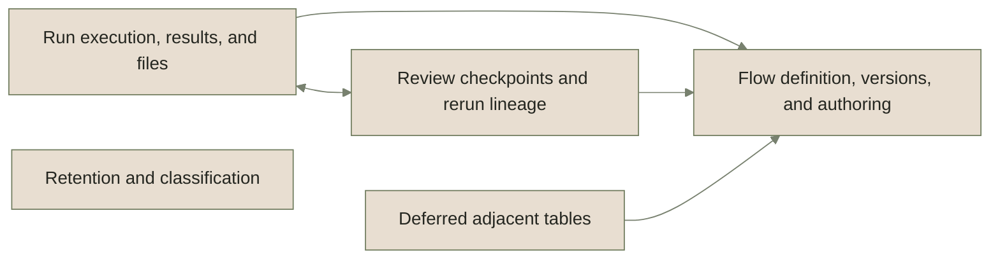
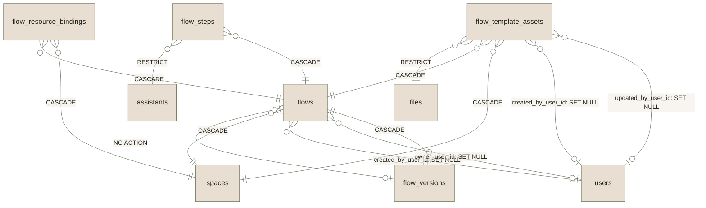
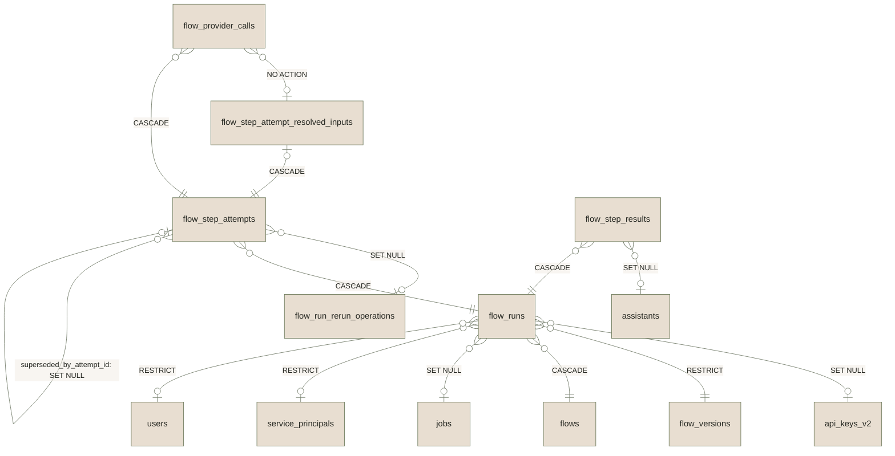
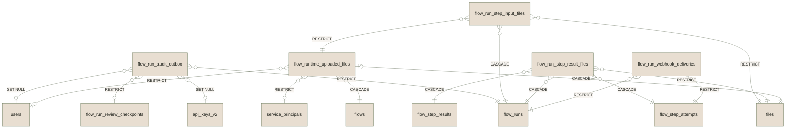
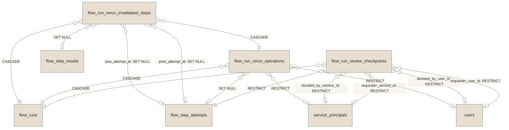
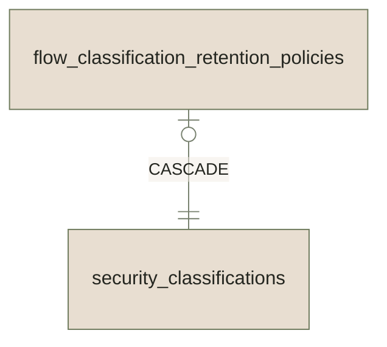
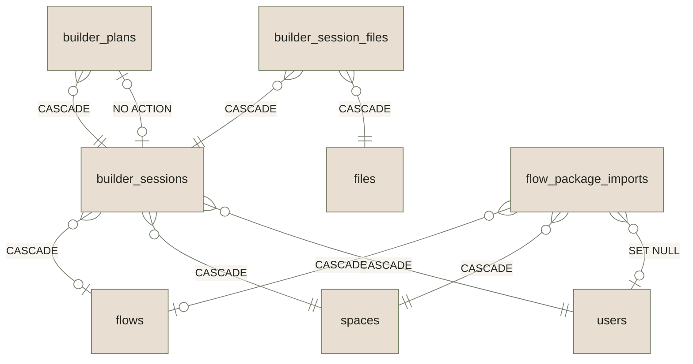

import { Cards } from "nextra/components";

# The data schema

Use this page before changing Flow tables, retention, or JSONB. It shows which tables belong together, how rows are deleted, which module writes each table, and which typed owner reads each JSONB column.

Generated from SQLAlchemy metadata and the Flow JSONB ownership registry; run `make docs:regen` from the repository root after a schema or JSONB ownership change. Model classes live in `backend/src/eneo/database/tables/` and are named after their tables (`flow_runs` is `FlowRuns`).

## How to read the diagrams

- One line per pair of tables. The label is the `ON DELETE` rule; when a table references the same target through more than one foreign key, the label also names the column. Composite foreign keys that repeat a simpler one (`flow_id` and `flow_id, tenant_id`) are drawn once, and the column lists show only the half that identifies the parent row; the other half pins the child to its parent's tenant or flow.
- Every table with a `tenant_id` column references `tenants` with `ON DELETE CASCADE`. Those lines are omitted; deleting a tenant deletes all of its Flow rows. Likewise, every table that references `flow_runs` also references `flows` with the same rule; only the run line is drawn.
- Crow's foot marks the side that holds the foreign key: `}o` many rows, `|o` at most one. On the referenced side `||` means the column is required and `o|` means it is nullable.
- Tables owned outside Flows (`users`, `files`, `spaces`, ...) and Flow tables from another aggregate are drawn as plain boxes. Every column, key, and foreign key is listed under **Columns** in each section.

## Aggregates

| Aggregate                                                                           | What it owns                                                                                                                                                                                         | Tables                                                                                                                                                                                                                                                               |
| ----------------------------------------------------------------------------------- | ---------------------------------------------------------------------------------------------------------------------------------------------------------------------------------------------------- | -------------------------------------------------------------------------------------------------------------------------------------------------------------------------------------------------------------------------------------------------------------------- |
| [Flow definition, versions, and authoring](#flow-definition-versions-and-authoring) | The draft Flow an author edits, the immutable published versions runs execute, the step graph, DOCX templates, and the tenant-local resources a Flow is bound to.                                    | `flow_resource_bindings`, `flow_steps`, `flow_template_assets`, `flow_versions`, `flows`                                                                                                                                                                             |
| [Run execution, results, and files](#run-execution-results-and-files)               | One row per run, per step result, per attempt, and per provider call, plus the files a run reads and produces, and the two outboxes (audit, webhook) that deliver after the run transaction commits. | `flow_provider_calls`, `flow_run_audit_outbox`, `flow_run_step_input_files`, `flow_run_step_result_files`, `flow_run_webhook_deliveries`, `flow_runs`, `flow_runtime_uploaded_files`, `flow_step_attempt_resolved_inputs`, `flow_step_attempts`, `flow_step_results` |
| [Review checkpoints and rerun lineage](#review-checkpoints-and-rerun-lineage)       | Human review checkpoints and rerun operations. Reruns invalidate downstream steps and link the new attempts to the old ones instead of deleting history.                                             | `flow_run_rerun_invalidated_steps`, `flow_run_rerun_operations`, `flow_run_review_checkpoints`                                                                                                                                                                       |
| [Retention and classification](#retention-and-classification)                       | Per-classification retention rules. `data_retention_days` activates automatic run-history deletion; `minimum_retention_days` and `no_purge` only block deletion, they never activate it.             | `flow_classification_retention_policies`                                                                                                                                                                                                                             |
| [Deferred adjacent tables](#deferred-adjacent-tables)                               | AI Builder sessions and Flow package imports. They reference Flow tables but are not part of the run or history model.                                                                               | `builder_plans`, `builder_session_files`, `builder_sessions`, `flow_package_imports`                                                                                                                                                                                 |

## Flow definition, versions, and authoring

The draft Flow an author edits, the immutable published versions runs execute, the step graph, DOCX templates, and the tenant-local resources a Flow is bound to.

| Table                    | Stores                                    | Written by                  | Why it exists                                                      |
| ------------------------ | ----------------------------------------- | --------------------------- | ------------------------------------------------------------------ |
| `flow_resource_bindings` | Local resource bindings for a Flow.       | FlowRepository              | Keep tenant-local resource ids outside portable flow packages.     |
| `flow_steps`             | Ordered draft step configuration.         | FlowRepository              | Define the editable step graph before publish freezes a version.   |
| `flow_template_assets`   | DOCX template assets for a Flow.          | FlowTemplateAssetRepository | Bind uploaded template files and placeholder indexes to authoring. |
| `flow_versions`          | Immutable published Flow definitions.     | FlowRepository              | Provide checksummed runtime snapshots for every run.               |
| `flows`                  | Mutable Flow drafts and publish pointers. | FlowRepository              | Keep authoring state separate from immutable runtime versions.     |

<code>flow_resource_bindings</code> columns (12)

| Column                | Type      | Nullable | Key                       |
| --------------------- | --------- | -------- | ------------------------- |
| `flow_id`             | uuid      |          | FK → `flows.id` CASCADE   |
| `tenant_id`           | uuid      |          | FK → `tenants.id` CASCADE |
| `space_id`            | uuid      |          | FK → `spaces.id` CASCADE  |
| `slot_kind`           | varchar   |          |                           |
| `slot`                | varchar   |          |                           |
| `slot_label`          | varchar   |          |                           |
| `local_resource_kind` | varchar   |          |                           |
| `local_resource_id`   | uuid      |          |                           |
| `source`              | varchar   |          |                           |
| `id`                  | uuid      |          | PK                        |
| `created_at`          | timestamp |          |                           |
| `updated_at`          | timestamp |          |                           |

<code>flow_steps</code> columns (20)

| Column                           | Type      | Nullable | Key                           |
| -------------------------------- | --------- | -------- | ----------------------------- |
| `flow_id`                        | uuid      |          | FK → `flows.id` CASCADE       |
| `tenant_id`                      | uuid      |          | FK → `tenants.id` CASCADE     |
| `assistant_id`                   | uuid      |          | FK → `assistants.id` RESTRICT |
| `step_order`                     | integer   |          |                               |
| `timeout_seconds`                | integer   | yes      |                               |
| `user_description`               | varchar   | yes      |                               |
| `input_source`                   | varchar   |          |                               |
| `input_type`                     | varchar   |          |                               |
| `input_contract`                 | jsonb     | yes      |                               |
| `output_mode`                    | varchar   |          |                               |
| `output_type`                    | varchar   |          |                               |
| `output_contract`                | jsonb     | yes      |                               |
| `input_bindings`                 | jsonb     | yes      |                               |
| `output_classification_override` | integer   | yes      |                               |
| `input_config`                   | jsonb     | yes      |                               |
| `output_config`                  | jsonb     | yes      |                               |
| `review_policy`                  | jsonb     | yes      |                               |
| `id`                             | uuid      |          | PK                            |
| `created_at`                     | timestamp |          |                               |
| `updated_at`                     | timestamp |          |                               |

<code>flow_template_assets</code> columns (15)

| Column               | Type      | Nullable | Key                       |
| -------------------- | --------- | -------- | ------------------------- |
| `flow_id`            | uuid      |          | FK → `flows.id` CASCADE   |
| `space_id`           | uuid      |          | FK → `spaces.id` CASCADE  |
| `tenant_id`          | uuid      |          | FK → `tenants.id` CASCADE |
| `file_id`            | uuid      |          | FK → `files.id` RESTRICT  |
| `name`               | varchar   |          |                           |
| `checksum`           | varchar   |          |                           |
| `mimetype`           | varchar   | yes      |                           |
| `placeholders`       | jsonb     |          |                           |
| `created_by_user_id` | uuid      | yes      | FK → `users.id` SET NULL  |
| `updated_by_user_id` | uuid      | yes      | FK → `users.id` SET NULL  |
| `status`             | varchar   |          |                           |
| `deleted_at`         | datetime  | yes      |                           |
| `id`                 | uuid      |          | PK                        |
| `created_at`         | timestamp |          |                           |
| `updated_at`         | timestamp |          |                           |

<code>flow_versions</code> columns (7)

| Column                | Type      | Nullable | Key                         |
| --------------------- | --------- | -------- | --------------------------- |
| `flow_id`             | uuid      |          | PK; FK → `flows.id` CASCADE |
| `version`             | integer   |          | PK                          |
| `tenant_id`           | uuid      |          | FK → `tenants.id` CASCADE   |
| `definition_checksum` | varchar   |          |                             |
| `definition_json`     | jsonb     |          |                             |
| `created_at`          | timestamp |          |                             |
| `updated_at`          | timestamp |          |                             |

<code>flows</code> columns (14)

| Column                | Type      | Nullable | Key                                        |
| --------------------- | --------- | -------- | ------------------------------------------ |
| `name`                | varchar   |          |                                            |
| `description`         | varchar   | yes      |                                            |
| `tenant_id`           | uuid      |          | FK → `tenants.id` CASCADE                  |
| `space_id`            | uuid      |          | FK → `spaces.id` CASCADE                   |
| `created_by_user_id`  | uuid      | yes      | FK → `users.id` SET NULL                   |
| `owner_user_id`       | uuid      | yes      | FK → `users.id` SET NULL                   |
| `published_version`   | integer   | yes      | FK → `flow_versions.version` NO ACTION     |
| `metadata_json`       | jsonb     | yes      |                                            |
| `data_retention_days` | integer   | yes      |                                            |
| `draft_revision`      | integer   |          |                                            |
| `deleted_at`          | datetime  | yes      |                                            |
| `id`                  | uuid      |          | PK; FK → `flow_versions.flow_id` NO ACTION |
| `created_at`          | timestamp |          |                                            |
| `updated_at`          | timestamp |          |                                            |

## Run execution, results, and files

One row per run, per step result, per attempt, and per provider call, plus the files a run reads and produces, and the two outboxes (audit, webhook) that deliver after the run transaction commits.

**Runs, step results, attempts, and provider calls**

**Files and delivery outboxes**

| Table                               | Stores                                                        | Written by                       | Why it exists                                                                                                                        |
| ----------------------------------- | ------------------------------------------------------------- | -------------------------------- | ------------------------------------------------------------------------------------------------------------------------------------ |
| `flow_provider_calls`               | One durable lifecycle row per Flow provider request.          | FlowProviderCallRepository       | Preserve credential-free request identity, terminal outcome, token or audio usage, and mapped source evidence outside attempt JSONB. |
| `flow_run_audit_outbox`             | Durable Flow lifecycle audit intents.                         | FlowRunAuditOutboxRepository     | Deliver content-free audit logs while preserving run transaction order.                                                              |
| `flow_run_step_input_files`         | Files bound as step inputs for a run attempt.                 | FlowRunRepository                | Make runtime file override intent relational and auditable.                                                                          |
| `flow_run_step_result_files`        | Files produced by step results.                               | FlowRunRepository                | Connect generated artifacts to the run, step, attempt, and file owner graph.                                                         |
| `flow_run_webhook_deliveries`       | HTTP step delivery outbox rows.                               | FlowRunWebhookDeliveryRepository | Claim, retry, dead-letter, and finalize webhook deliveries durably.                                                                  |
| `flow_runs`                         | One execution of a published Flow version.                    | FlowRunRepository                | Persist principal, status, input, output, and lifecycle anchors.                                                                     |
| `flow_runtime_uploaded_files`       | Reusable runtime upload files.                                | FlowRuntimeUploadRepository      | Bind pre-run uploads to a Flow, step, tenant, and principal.                                                                         |
| `flow_step_attempt_resolved_inputs` | One immutable resolved-input aggregate per Flow step attempt. | FlowRunRepository                | Preserve exact dependency evidence without widening the hot attempt row.                                                             |
| `flow_step_attempts`                | Individual step execution attempts.                           | FlowRunRepository                | Preserve retry diagnostics, timings, prompts, and raw attempt payloads.                                                              |
| `flow_step_results`                 | Current per-step runtime results.                             | FlowRunRepository                | Keep step status, payloads, diagnostics, and output metadata per run.                                                                |

<code>flow_provider_calls</code> columns (30)

| Column                        | Type      | Nullable | Key                                                                     |
| ----------------------------- | --------- | -------- | ----------------------------------------------------------------------- |
| `flow_step_attempt_id`        | uuid      |          | FK → `flow_step_attempts.id` CASCADE                                    |
| `resolved_inputs_attempt_id`  | uuid      | yes      | FK → `flow_step_attempt_resolved_inputs.flow_step_attempt_id` NO ACTION |
| `ordinal`                     | integer   |          |                                                                         |
| `call_kind`                   | varchar   |          |                                                                         |
| `status`                      | varchar   |          |                                                                         |
| `request_schema_version`      | smallint  |          |                                                                         |
| `provider_request_hash`       | varchar   |          |                                                                         |
| `requested_model`             | varchar   |          |                                                                         |
| `provider`                    | varchar   | yes      |                                                                         |
| `response_format`             | varchar   |          |                                                                         |
| `requested_capabilities`      | array     |          |                                                                         |
| `resolved_input_edge_indexes` | array     |          |                                                                         |
| `call_reason`                 | varchar   |          |                                                                         |
| `mapped_execution_mode`       | varchar   | yes      |                                                                         |
| `mapped_item_index`           | integer   | yes      |                                                                         |
| `mapped_source_index`         | integer   | yes      |                                                                         |
| `mapped_source_id`            | text      | yes      |                                                                         |
| `response_model`              | varchar   | yes      |                                                                         |
| `provider_response_id`        | varchar   | yes      |                                                                         |
| `num_tokens_input`            | integer   | yes      |                                                                         |
| `num_tokens_output`           | integer   | yes      |                                                                         |
| `audio_seconds`               | numeric   | yes      |                                                                         |
| `input_source`                | varchar   | yes      |                                                                         |
| `output_source`               | varchar   | yes      |                                                                         |
| `outcome_reason`              | varchar   | yes      |                                                                         |
| `requested_at`                | datetime  |          |                                                                         |
| `finished_at`                 | datetime  | yes      |                                                                         |
| `id`                          | uuid      |          | PK                                                                      |
| `created_at`                  | timestamp |          |                                                                         |
| `updated_at`                  | timestamp |          |                                                                         |

<code>flow_run_audit_outbox</code> columns (26)

| Column                 | Type      | Nullable | Key                                            |
| ---------------------- | --------- | -------- | ---------------------------------------------- |
| `tenant_id`            | uuid      |          | FK → `tenants.id` CASCADE                      |
| `flow_id`              | uuid      |          | FK → `flows.id` RESTRICT                       |
| `flow_run_id`          | uuid      |          | FK → `flow_runs.id` RESTRICT                   |
| `run_revision`         | integer   |          |                                                |
| `review_checkpoint_id` | uuid      | yes      | FK → `flow_run_review_checkpoints.id` RESTRICT |
| `checkpoint_revision`  | integer   | yes      |                                                |
| `description`          | varchar   |          |                                                |
| `action`               | varchar   |          |                                                |
| `entity_type`          | varchar   |          |                                                |
| `entity_id`            | uuid      |          |                                                |
| `actor_id`             | uuid      | yes      | FK → `users.id` SET NULL                       |
| `actor_type`           | varchar   |          |                                                |
| `actor_api_key_id`     | uuid      | yes      | FK → `api_keys_v2.id` SET NULL                 |
| `source`               | varchar   |          |                                                |
| `target_status`        | varchar   |          |                                                |
| `error_code`           | varchar   | yes      |                                                |
| `error_message`        | varchar   | yes      |                                                |
| `delivery_status`      | varchar   |          |                                                |
| `delivery_attempts`    | integer   |          |                                                |
| `next_delivery_at`     | timestamp | yes      |                                                |
| `delivered_at`         | timestamp | yes      |                                                |
| `dead_lettered_at`     | timestamp | yes      |                                                |
| `delivery_last_error`  | text      | yes      |                                                |
| `id`                   | uuid      |          | PK                                             |
| `created_at`           | timestamp |          |                                                |
| `updated_at`           | timestamp |          |                                                |

<code>flow_run_step_input_files</code> columns (11)

| Column        | Type      | Nullable | Key                                                                           |
| ------------- | --------- | -------- | ----------------------------------------------------------------------------- |
| `flow_run_id` | uuid      |          | FK → `flow_runs.id` CASCADE                                                   |
| `flow_id`     | uuid      |          | FK → `flows.id` CASCADE                                                       |
| `tenant_id`   | uuid      |          | FK → `tenants.id` CASCADE                                                     |
| `step_id`     | uuid      |          |                                                                               |
| `step_order`  | integer   |          |                                                                               |
| `attempt_no`  | integer   |          |                                                                               |
| `file_id`     | uuid      |          | FK → `files.id` RESTRICT; FK → `flow_runtime_uploaded_files.file_id` RESTRICT |
| `ordinal`     | integer   |          |                                                                               |
| `id`          | uuid      |          | PK                                                                            |
| `created_at`  | timestamp |          |                                                                               |
| `updated_at`  | timestamp |          |                                                                               |

<code>flow_run_step_result_files</code> columns (13)

| Column           | Type      | Nullable | Key                                                                        |
| ---------------- | --------- | -------- | -------------------------------------------------------------------------- |
| `flow_run_id`    | uuid      |          | FK → `flow_runs.id` CASCADE; FK → `flow_step_attempts.flow_run_id` CASCADE |
| `flow_id`        | uuid      |          | FK → `flows.id` CASCADE                                                    |
| `tenant_id`      | uuid      |          | FK → `tenants.id` CASCADE                                                  |
| `step_result_id` | uuid      |          | FK → `flow_step_results.id` CASCADE                                        |
| `step_id`        | uuid      |          | FK → `flow_step_attempts.step_id` CASCADE                                  |
| `step_order`     | integer   |          |                                                                            |
| `attempt_no`     | integer   |          | FK → `flow_step_attempts.attempt_no` CASCADE                               |
| `file_id`        | uuid      |          | FK → `files.id` RESTRICT                                                   |
| `ordinal`        | integer   |          |                                                                            |
| `source`         | varchar   |          |                                                                            |
| `id`             | uuid      |          | PK                                                                         |
| `created_at`     | timestamp |          |                                                                            |
| `updated_at`     | timestamp |          |                                                                            |

<code>flow_run_webhook_deliveries</code> columns (20)

| Column                | Type      | Nullable | Key                                                                          |
| --------------------- | --------- | -------- | ---------------------------------------------------------------------------- |
| `tenant_id`           | uuid      |          | FK → `tenants.id` CASCADE                                                    |
| `flow_id`             | uuid      |          | FK → `flows.id` RESTRICT                                                     |
| `flow_run_id`         | uuid      |          | FK → `flow_runs.id` RESTRICT; FK → `flow_step_attempts.flow_run_id` RESTRICT |
| `step_id`             | uuid      |          | FK → `flow_step_attempts.step_id` RESTRICT                                   |
| `step_order`          | integer   |          |                                                                              |
| `attempt_no`          | integer   |          | FK → `flow_step_attempts.attempt_no` RESTRICT                                |
| `idempotency_key`     | varchar   |          |                                                                              |
| `payload_ref`         | varchar   |          |                                                                              |
| `delivery_status`     | varchar   |          |                                                                              |
| `delivery_attempts`   | integer   |          |                                                                              |
| `next_delivery_at`    | timestamp | yes      |                                                                              |
| `claim_token`         | uuid      | yes      |                                                                              |
| `claimed_at`          | timestamp | yes      |                                                                              |
| `claim_expires_at`    | timestamp | yes      |                                                                              |
| `delivered_at`        | timestamp | yes      |                                                                              |
| `dead_lettered_at`    | timestamp | yes      |                                                                              |
| `delivery_last_error` | text      | yes      |                                                                              |
| `id`                  | uuid      |          | PK                                                                           |
| `created_at`          | timestamp |          |                                                                              |
| `updated_at`          | timestamp |          |                                                                              |

<code>flow_runs</code> columns (30)

| Column                       | Type      | Nullable | Key                                                            |
| ---------------------------- | --------- | -------- | -------------------------------------------------------------- |
| `flow_id`                    | uuid      |          | FK → `flow_versions.flow_id` RESTRICT; FK → `flows.id` CASCADE |
| `flow_version`               | integer   |          | FK → `flow_versions.version` RESTRICT                          |
| `principal_type`             | varchar   |          |                                                                |
| `principal_user_id`          | uuid      | yes      | FK → `users.id` RESTRICT                                       |
| `principal_service_id`       | uuid      | yes      | FK → `service_principals.id` RESTRICT                          |
| `created_by_api_key_id`      | uuid      | yes      | FK → `api_keys_v2.id` SET NULL                                 |
| `runtime_service_permission` | varchar   | yes      |                                                                |
| `tenant_id`                  | uuid      |          | FK → `tenants.id` CASCADE                                      |
| `trace_id`                   | uuid      |          |                                                                |
| `idempotency_key`            | varchar   | yes      |                                                                |
| `request_fingerprint`        | varchar   | yes      |                                                                |
| `revision`                   | integer   |          |                                                                |
| `status`                     | varchar   |          |                                                                |
| `dispatch_pending_since`     | datetime  | yes      |                                                                |
| `dispatch_attempt_count`     | integer   |          |                                                                |
| `dispatch_last_attempt_at`   | datetime  | yes      |                                                                |
| `dispatch_last_error`        | jsonb     | yes      |                                                                |
| `dispatch_next_attempt_at`   | datetime  | yes      |                                                                |
| `dispatched_at`              | datetime  | yes      |                                                                |
| `dispatch_exhausted_at`      | datetime  | yes      |                                                                |
| `cancelled_at`               | datetime  | yes      |                                                                |
| `started_at`                 | datetime  | yes      |                                                                |
| `finished_at`                | datetime  | yes      |                                                                |
| `input_payload_json`         | jsonb     | yes      |                                                                |
| `output_payload_json`        | jsonb     | yes      |                                                                |
| `error_json`                 | jsonb     | yes      |                                                                |
| `job_id`                     | uuid      | yes      | FK → `jobs.id` SET NULL                                        |
| `id`                         | uuid      |          | PK                                                             |
| `created_at`                 | timestamp |          |                                                                |
| `updated_at`                 | timestamp |          |                                                                |

<code>flow_runtime_uploaded_files</code> columns (9)

| Column                 | Type      | Nullable | Key                                   |
| ---------------------- | --------- | -------- | ------------------------------------- |
| `file_id`              | uuid      |          | PK; FK → `files.id` CASCADE           |
| `flow_id`              | uuid      |          | FK → `flows.id` CASCADE               |
| `tenant_id`            | uuid      |          | FK → `tenants.id` CASCADE             |
| `uploaded_for_step_id` | uuid      |          |                                       |
| `owner_type`           | varchar   |          |                                       |
| `owner_user_id`        | uuid      | yes      | FK → `users.id` RESTRICT              |
| `owner_service_id`     | uuid      | yes      | FK → `service_principals.id` RESTRICT |
| `created_at`           | timestamp |          |                                       |
| `updated_at`           | timestamp |          |                                       |

<code>flow_step_attempt_resolved_inputs</code> columns (5)

| Column                       | Type      | Nullable | Key                                      |
| ---------------------------- | --------- | -------- | ---------------------------------------- |
| `flow_step_attempt_id`       | uuid      |          | PK; FK → `flow_step_attempts.id` CASCADE |
| `resolved_input_edges_jsonb` | jsonb     |          |                                          |
| `resolved_input_edge_count`  | smallint  |          |                                          |
| `created_at`                 | timestamp |          |                                          |
| `updated_at`                 | timestamp |          |                                          |

<code>flow_step_attempts</code> columns (29)

| Column                     | Type      | Nullable | Key                                          |
| -------------------------- | --------- | -------- | -------------------------------------------- |
| `flow_run_id`              | uuid      |          | FK → `flow_runs.id` CASCADE                  |
| `flow_id`                  | uuid      |          | FK → `flows.id` CASCADE                      |
| `tenant_id`                | uuid      |          | FK → `tenants.id` CASCADE                    |
| `step_id`                  | uuid      |          |                                              |
| `step_order`               | integer   |          |                                              |
| `attempt_no`               | integer   |          |                                              |
| `rerun_operation_id`       | uuid      | yes      | FK → `flow_run_rerun_operations.id` SET NULL |
| `predecessor_attempt_id`   | uuid      | yes      | FK → `flow_step_attempts.id` SET NULL        |
| `superseded_by_attempt_id` | uuid      | yes      | FK → `flow_step_attempts.id` SET NULL        |
| `celery_task_id`           | varchar   | yes      |                                              |
| `status`                   | varchar   |          |                                              |
| `error_code`               | varchar   | yes      |                                              |
| `error_message`            | varchar   | yes      |                                              |
| `requested_model`          | varchar   | yes      |                                              |
| `response_model`           | varchar   | yes      |                                              |
| `provider`                 | varchar   | yes      |                                              |
| `finish_reason`            | varchar   | yes      |                                              |
| `provider_response_id`     | varchar   | yes      |                                              |
| `num_tokens_input`         | integer   | yes      |                                              |
| `num_tokens_output`        | integer   | yes      |                                              |
| `provenance_json`          | jsonb     | yes      |                                              |
| `input_payload_json`       | jsonb     | yes      |                                              |
| `output_payload_json`      | jsonb     | yes      |                                              |
| `flow_step_execution_hash` | varchar   | yes      |                                              |
| `started_at`               | datetime  |          |                                              |
| `finished_at`              | datetime  | yes      |                                              |
| `id`                       | uuid      |          | PK                                           |
| `created_at`               | timestamp |          |                                              |
| `updated_at`               | timestamp |          |                                              |

<code>flow_step_results</code> columns (22)

| Column                     | Type      | Nullable | Key                           |
| -------------------------- | --------- | -------- | ----------------------------- |
| `flow_run_id`              | uuid      |          | FK → `flow_runs.id` CASCADE   |
| `flow_id`                  | uuid      |          | FK → `flows.id` CASCADE       |
| `tenant_id`                | uuid      |          | FK → `tenants.id` CASCADE     |
| `step_id`                  | uuid      |          |                               |
| `step_order`               | integer   |          |                               |
| `assistant_id`             | uuid      | yes      | FK → `assistants.id` SET NULL |
| `current_attempt_no`       | integer   | yes      |                               |
| `input_payload_json`       | jsonb     | yes      |                               |
| `effective_prompt`         | varchar   | yes      |                               |
| `output_payload_json`      | jsonb     | yes      |                               |
| `model_parameters_json`    | jsonb     | yes      |                               |
| `num_tokens_input`         | integer   | yes      |                               |
| `num_tokens_output`        | integer   | yes      |                               |
| `status`                   | varchar   |          |                               |
| `error_code`               | varchar   | yes      |                               |
| `error_message`            | varchar   | yes      |                               |
| `flow_step_execution_hash` | varchar   | yes      |                               |
| `started_at`               | datetime  | yes      |                               |
| `finished_at`              | datetime  | yes      |                               |
| `id`                       | uuid      |          | PK                            |
| `created_at`               | timestamp |          |                               |
| `updated_at`               | timestamp |          |                               |

## Review checkpoints and rerun lineage

Human review checkpoints and rerun operations. Reruns invalidate downstream steps and link the new attempts to the old ones instead of deleting history.

| Table                              | Stores                                 | Written by                        | Why it exists                                                             |
| ---------------------------------- | -------------------------------------- | --------------------------------- | ------------------------------------------------------------------------- |
| `flow_run_rerun_invalidated_steps` | Step invalidation markers from reruns. | FlowRunRerunRepository            | Preserve rerun lineage without deleting earlier step history immediately. |
| `flow_run_rerun_operations`        | Rerun requests for existing Flow runs. | FlowRunRerunRepository            | Record rerun intent, invalidation, and terminal rerun outcome.            |
| `flow_run_review_checkpoints`      | Human review pauses for Flow runs.     | FlowRunReviewCheckpointRepository | Track editable checkpoint state, revisions, decisions, and expiry.        |

<code>flow_run_rerun_invalidated_steps</code> columns (16)

| Column                    | Type      | Nullable | Key                                         |
| ------------------------- | --------- | -------- | ------------------------------------------- |
| `operation_id`            | uuid      |          | FK → `flow_run_rerun_operations.id` CASCADE |
| `tenant_id`               | uuid      |          | FK → `tenants.id` CASCADE                   |
| `flow_id`                 | uuid      |          | FK → `flows.id` CASCADE                     |
| `flow_run_id`             | uuid      |          | FK → `flow_runs.id` CASCADE                 |
| `step_id`                 | uuid      |          |                                             |
| `step_order`              | integer   |          |                                             |
| `invalidation_order`      | integer   |          |                                             |
| `role`                    | varchar   |          |                                             |
| `dependency_sources_json` | jsonb     |          |                                             |
| `prior_step_result_id`    | uuid      | yes      | FK → `flow_step_results.id` SET NULL        |
| `prior_attempt_id`        | uuid      | yes      | FK → `flow_step_attempts.id` SET NULL       |
| `new_attempt_no`          | integer   | yes      |                                             |
| `new_attempt_id`          | uuid      | yes      | FK → `flow_step_attempts.id` SET NULL       |
| `id`                      | uuid      |          | PK                                          |
| `created_at`              | timestamp |          |                                             |
| `updated_at`              | timestamp |          |                                             |

<code>flow_run_rerun_operations</code> columns (28)

| Column                               | Type      | Nullable | Key                                   |
| ------------------------------------ | --------- | -------- | ------------------------------------- |
| `tenant_id`                          | uuid      |          | FK → `tenants.id` CASCADE             |
| `flow_id`                            | uuid      |          | FK → `flows.id` CASCADE               |
| `flow_run_id`                        | uuid      |          | FK → `flow_runs.id` CASCADE           |
| `rerun_step_id`                      | uuid      |          |                                       |
| `rerun_step_order`                   | integer   |          |                                       |
| `root_attempt_no`                    | integer   |          |                                       |
| `root_attempt_id`                    | uuid      | yes      | FK → `flow_step_attempts.id` SET NULL |
| `status`                             | varchar   |          |                                       |
| `request_fingerprint`                | varchar   |          |                                       |
| `expected_run_revision`              | integer   |          |                                       |
| `accepted_run_revision`              | integer   |          |                                       |
| `reason`                             | text      |          |                                       |
| `input_payload_json`                 | jsonb     | yes      |                                       |
| `root_step_input_override_requested` | boolean   |          |                                       |
| `prior_input_hash`                   | varchar   | yes      |                                       |
| `resulting_input_hash`               | varchar   | yes      |                                       |
| `changed_input_paths`                | jsonb     | yes      |                                       |
| `prior_input_payload_json`           | jsonb     | yes      |                                       |
| `requested_by_principal_type`        | varchar   |          |                                       |
| `requested_by_user_id`               | uuid      | yes      | FK → `users.id` RESTRICT              |
| `requested_by_service_id`            | uuid      | yes      | FK → `service_principals.id` RESTRICT |
| `failure_code`                       | varchar   | yes      |                                       |
| `failure_message`                    | varchar   | yes      |                                       |
| `started_at`                         | datetime  | yes      |                                       |
| `finished_at`                        | datetime  | yes      |                                       |
| `id`                                 | uuid      |          | PK                                    |
| `created_at`                         | timestamp |          |                                       |
| `updated_at`                         | timestamp |          |                                       |

<code>flow_run_review_checkpoints</code> columns (33)

| Column                      | Type      | Nullable | Key                                                                         |
| --------------------------- | --------- | -------- | --------------------------------------------------------------------------- |
| `tenant_id`                 | uuid      |          | FK → `tenants.id` CASCADE                                                   |
| `flow_id`                   | uuid      |          | FK → `flows.id` CASCADE                                                     |
| `flow_run_id`               | uuid      |          | FK → `flow_runs.id` CASCADE; FK → `flow_step_attempts.flow_run_id` RESTRICT |
| `step_id`                   | uuid      |          | FK → `flow_step_attempts.step_id` RESTRICT                                  |
| `step_order`                | integer   |          |                                                                             |
| `attempt_no`                | integer   |          | FK → `flow_step_attempts.attempt_no` RESTRICT                               |
| `state`                     | varchar   |          |                                                                             |
| `revision`                  | integer   |          |                                                                             |
| `schema_version`            | integer   |          |                                                                             |
| `original_payload_json`     | jsonb     | yes      |                                                                             |
| `current_payload_json`      | jsonb     | yes      |                                                                             |
| `step_label`                | text      | yes      |                                                                             |
| `review_mode`               | varchar   |          |                                                                             |
| `output_type`               | varchar   |          |                                                                             |
| `output_contract_json`      | jsonb     | yes      |                                                                             |
| `requester_user_id`         | uuid      | yes      | FK → `users.id` RESTRICT                                                    |
| `requester_service_id`      | uuid      | yes      | FK → `service_principals.id` RESTRICT                                       |
| `requester_principal_type`  | varchar   |          |                                                                             |
| `decided_by_user_id`        | uuid      | yes      | FK → `users.id` RESTRICT                                                    |
| `decided_by_service_id`     | uuid      | yes      | FK → `service_principals.id` RESTRICT                                       |
| `decided_by_principal_type` | varchar   | yes      |                                                                             |
| `next_step_ids_json`        | jsonb     | yes      |                                                                             |
| `resume_idempotency_key`    | varchar   | yes      |                                                                             |
| `edited_at`                 | datetime  | yes      |                                                                             |
| `approved_at`               | datetime  | yes      |                                                                             |
| `rejected_at`               | datetime  | yes      |                                                                             |
| `resumed_at`                | datetime  | yes      |                                                                             |
| `cancelled_at`              | datetime  | yes      |                                                                             |
| `expires_at`                | datetime  | yes      |                                                                             |
| `expired_at`                | datetime  | yes      |                                                                             |
| `id`                        | uuid      |          | PK                                                                          |
| `created_at`                | timestamp |          |                                                                             |
| `updated_at`                | timestamp |          |                                                                             |

`flow_run_review_checkpoints.schema_version` versions the persisted review payload
contract. An edit submits only the step's own value: a string for a `text` output
step, or a JSON object or array for a `json` output step, checked against the
snapshotted `output_contract_json`. The server rebuilds `current_payload_json`
around that value, deriving a JSON step's `text` from `structured` so the two
encodings cannot disagree, and carrying every runtime-owned key over from the
stored payload. A checkpoint whose `review_mode` is `view`, and an output whose
text overflowed into a generated file, refuse the edit; PDF and DOCX
artifact-producing steps may persist view checkpoints but cannot publish an
edit review policy.

## Retention and classification

Per-classification retention rules. `data_retention_days` activates automatic run-history deletion; `minimum_retention_days` and `no_purge` only block deletion, they never activate it.

| Table                                    | Stores                                                             | Written by                                  | Why it exists                                                                                                            |
| ---------------------------------------- | ------------------------------------------------------------------ | ------------------------------------------- | ------------------------------------------------------------------------------------------------------------------------ |
| `flow_classification_retention_policies` | Classification-scoped Flow delete-after and preservation barriers. | FlowClassificationRetentionPolicyRepository | Activate deletion for matching spaces only through delete-after and preserve data through minimum-retention or no-purge. |

<code>flow_classification_retention_policies</code> columns (7)

| Column                       | Type      | Nullable | Key                                            |
| ---------------------------- | --------- | -------- | ---------------------------------------------- |
| `tenant_id`                  | uuid      |          | PK; FK → `tenants.id` CASCADE                  |
| `security_classification_id` | uuid      |          | PK; FK → `security_classifications.id` CASCADE |
| `data_retention_days`        | integer   | yes      |                                                |
| `minimum_retention_days`     | integer   | yes      |                                                |
| `no_purge`                   | boolean   |          |                                                |
| `created_at`                 | timestamp |          |                                                |
| `updated_at`                 | timestamp |          |                                                |

## Deferred adjacent tables

AI Builder sessions and Flow package imports. They reference Flow tables but are not part of the run or history model.

| Table                   | Stores                                      | Written by                      | Why it exists                                                            |
| ----------------------- | ------------------------------------------- | ------------------------------- | ------------------------------------------------------------------------ |
| `builder_plans`         | Flow AI Builder proposed plans.             | Flow AI Builder planner         | Preserve one canonical proposal snapshot.                                |
| `builder_session_files` | Files attached to Flow AI Builder sessions. | Flow AI Builder session service | Keep uploaded builder context files tenant-scoped.                       |
| `builder_sessions`      | Flow AI Builder conversations.              | Flow AI Builder session service | Keep builder chat, planning state, locks, and target Flow linkage.       |
| `flow_package_imports`  | Flow package import outcomes.               | FlowPackageImportRepository     | Retain operational results only while their owning Flow or space exists. |

<code>builder_plans</code> columns (8)

| Column          | Type      | Nullable | Key                                |
| --------------- | --------- | -------- | ---------------------------------- |
| `session_id`    | uuid      |          | FK → `builder_sessions.id` CASCADE |
| `tenant_id`     | uuid      |          | FK → `tenants.id` CASCADE          |
| `status`        | varchar   |          |                                    |
| `proposal_json` | jsonb     |          |                                    |
| `spec_hash`     | varchar   |          |                                    |
| `id`            | uuid      |          | PK                                 |
| `created_at`    | timestamp |          |                                    |
| `updated_at`    | timestamp |          |                                    |

<code>builder_session_files</code> columns (5)

| Column       | Type      | Nullable | Key                                    |
| ------------ | --------- | -------- | -------------------------------------- |
| `session_id` | uuid      |          | PK; FK → `builder_sessions.id` CASCADE |
| `file_id`    | uuid      |          | PK; FK → `files.id` CASCADE            |
| `tenant_id`  | uuid      |          | FK → `tenants.id` CASCADE              |
| `created_at` | timestamp |          |                                        |
| `updated_at` | timestamp |          |                                        |

<code>builder_sessions</code> columns (23)

| Column                            | Type      | Nullable | Key                               |
| --------------------------------- | --------- | -------- | --------------------------------- |
| `tenant_id`                       | uuid      |          | FK → `tenants.id` CASCADE         |
| `space_id`                        | uuid      |          | FK → `spaces.id` CASCADE          |
| `flow_id`                         | uuid      | yes      | FK → `flows.id` CASCADE           |
| `target_kind`                     | varchar   |          |                                   |
| `status`                          | varchar   |          |                                   |
| `actor_user_id`                   | uuid      |          | FK → `users.id` CASCADE           |
| `conversation`                    | jsonb     |          |                                   |
| `active_request_id`               | uuid      | yes      |                                   |
| `lock_token`                      | uuid      | yes      |                                   |
| `locked_at`                       | datetime  | yes      |                                   |
| `lock_expires_at`                 | datetime  | yes      |                                   |
| `latest_plan_id`                  | uuid      | yes      | FK → `builder_plans.id` NO ACTION |
| `planning_state_jsonb`            | jsonb     | yes      |                                   |
| `planning_state_version`          | bigint    |          |                                   |
| `latest_turn_id`                  | uuid      | yes      |                                   |
| `latest_turn_request_fingerprint` | varchar   | yes      |                                   |
| `latest_turn_request_jsonb`       | jsonb     | yes      |                                   |
| `latest_turn_state`               | varchar   | yes      |                                   |
| `latest_turn_message_id`          | uuid      | yes      |                                   |
| `latest_turn_error_jsonb`         | jsonb     | yes      |                                   |
| `id`                              | uuid      |          | PK                                |
| `created_at`                      | timestamp |          |                                   |
| `updated_at`                      | timestamp |          |                                   |

<code>flow_package_imports</code> columns (15)

| Column                   | Type      | Nullable | Key                       |
| ------------------------ | --------- | -------- | ------------------------- |
| `tenant_id`              | uuid      |          | FK → `tenants.id` CASCADE |
| `space_id`               | uuid      |          | FK → `spaces.id` CASCADE  |
| `flow_id`                | uuid      | yes      | FK → `flows.id` CASCADE   |
| `created_by_user_id`     | uuid      | yes      | FK → `users.id` SET NULL  |
| `package_id`             | varchar   |          |                           |
| `package_version`        | varchar   |          |                           |
| `content_checksum`       | varchar   |          |                           |
| `source`                 | varchar   |          |                           |
| `status`                 | varchar   |          |                           |
| `import_plan_json`       | jsonb     |          |                           |
| `selected_mappings_json` | jsonb     |          |                           |
| `failure_json`           | jsonb     | yes      |                           |
| `id`                     | uuid      |          | PK                        |
| `created_at`             | timestamp |          |                           |
| `updated_at`             | timestamp |          |                           |

## JSONB columns

Every Flow JSONB column has one typed owner. `Invalid payload` says what a reader does with a stored value the owner cannot parse.

| Column                                                         | Envelope and owner                                                                                 | Category                | Versioning                                                          | Invalid payload                                                   | Why JSON                                                                                                                                                                                                                                                                                                                                                                             |
| -------------------------------------------------------------- | -------------------------------------------------------------------------------------------------- | ----------------------- | ------------------------------------------------------------------- | ----------------------------------------------------------------- | ------------------------------------------------------------------------------------------------------------------------------------------------------------------------------------------------------------------------------------------------------------------------------------------------------------------------------------------------------------------------------------ |
| `builder_plans.proposal_json`                                  | `FlowBuilderProposal` `eneo.flows.ai_builder.ai_builder_domain_models`                        | `immutable_snapshot`    | embedded_schema_version                                             | fail_plan_load                                                    | Builder plans persist one current-version-only immutable proposal snapshot. Writes and reads validate the typed envelope and 1 MiB payload cap; invalid stored proposals fail plan hydration, while spec_hash rejects silent row drift.                                                                                                                                              |
| `builder_sessions.conversation`                                | `ConversationMessage` `eneo.flows.ai_builder.ai_builder_domain_models`                        | `builder_session_state` | owner_validated_shape                                               | fail_session_load                                                 | Builder conversation history is stored as a JSON array of ConversationMessage entries; persisted rows fail session loading when required stable message ids are missing.                                                                                                                                                                                                             |
| `builder_sessions.latest_turn_error_jsonb`                     | `AIBuilderPublicError` `eneo.flows.ai_builder.ai_builder_error_contract`                      | `builder_session_state` | embedded_schema_version                                             | fail_session_load                                                 | A committed Builder turn may retain one typed public error for exact same-key replay; invalid stored errors fail session hydration.                                                                                                                                                                                                                                                  |
| `builder_sessions.latest_turn_request_jsonb`                   | `SendMessageRequest` `eneo.flows.ai_builder.ai_builder_api_models`                            | `builder_session_state` | owner_validated_shape                                               | fail_session_load                                                 | The latest accepted Builder turn retains one bounded strict request snapshot for same-key replay and explicit outcome-unknown recovery.                                                                                                                                                                                                                                              |
| `builder_sessions.planning_state_jsonb`                        | `PlanningState` `eneo.flows.ai_builder.planning_state`                                        | `builder_session_state` | embedded_schema_version                                             | fail_session_load                                                 | Builder planning state is a full-snapshot PlanningState document with embedded FCM, planner-contract, and builder schema versions.                                                                                                                                                                                                                                                   |
| `flow_package_imports.failure_json`                            | `FlowPackageImportFailure` `eneo.flow_packages.domain.flow_package_import_record`             | `import_state`          | owner_validated_shape                                               | keep_auditable_failure                                            | Failed imports need a structured failure snapshot while preserving the terminal import row for audit.                                                                                                                                                                                                                                                                                |
| `flow_package_imports.import_plan_json`                        | `FlowPackageImportPlan` `eneo.flow_packages.domain.flow_package_import_plan`                  | `import_state`          | owner_validated_shape                                               | reject_before_write                                               | Import plans are owner-validated auditable snapshots of the exact portable package and destination decision; computed API fields are not persisted and the JSON is not a replay contract.                                                                                                                                                                                            |
| `flow_package_imports.selected_mappings_json`                  | `FlowPackageSelectedMappings` `eneo.flow_packages.domain.flow_package_import_record`          | `import_state`          | owner_validated_shape                                               | reject_before_write                                               | Selected mappings preserve the user's import choices for audit and replay without introducing package-specific relational tables.                                                                                                                                                                                                                                                    |
| `flow_run_rerun_invalidated_steps.dependency_sources_json`     | `RerunInvalidationDependencySources` `eneo.flows.flow_run_rerun_graph`                        | `rerun_state`           | owner_validated_shape                                               | reject_before_write                                               | Dependency sources are a bounded string set derived from the rerun graph and stored with each invalidation row for reviewability.                                                                                                                                                                                                                                                    |
| `flow_run_rerun_operations.changed_input_paths`                | `FlowRunInputRevision` `eneo.flows.domain.flow_run_input_revision`                            | `rerun_state`           | owner_validated_shape                                               | mark_evidence_unavailable                                         | The changed field paths are a flat list of strings derived from the two payloads, useful for showing what a rerun altered without reading either payload.                                                                                                                                                                                                                            |
| `flow_run_rerun_operations.input_payload_json`                 | `FlowRunRerunInputEnvelope` `eneo.flows.application.flow_run_rerun_service`                   | `rerun_state`           | owner_validated_shape                                               | reject_before_write                                               | Rerun input overrides are captured with the operation so replay and idempotency can be audited without changing the original run input.                                                                                                                                                                                                                                              |
| `flow_run_rerun_operations.prior_input_payload_json`           | `FlowRunInputRevision` `eneo.flows.domain.flow_run_input_revision`                            | `rerun_state`           | owner_validated_shape                                               | mark_evidence_unavailable                                         | The run row keeps only current inputs, so each rerun stores the payload it replaced; walking reruns in order rebuilds every input revision. Same data class as the run's own input payload, on a row that cascade-deletes with the run.                                                                                                                                              |
| `flow_run_review_checkpoints.current_payload_json`             | `ReviewCheckpointCurrentPayload` `eneo.flows.infrastructure.flow_run_review_checkpoint_repo`  | `review_checkpoint`     | schema_version is written as 1 but is not read by a payload parser. | There is no dedicated pre-write payload validation at this owner. | Current reviewed output is checkpoint-local mutable state guarded by checkpoint revision and schema version.                                                                                                                                                                                                                                                                         |
| `flow_run_review_checkpoints.next_step_ids_json`               | `ReviewCheckpointNextStepIds` `eneo.flows.infrastructure.flow_run_review_checkpoint_repo`     | `review_checkpoint`     | schema_version is written as 1 but is not read by a payload parser. | There is no dedicated pre-write payload validation at this owner. | Next-step ids are a small resume snapshot from the published graph; there is no separate row identity to constrain relationally.                                                                                                                                                                                                                                                     |
| `flow_run_review_checkpoints.original_payload_json`            | `ReviewCheckpointOriginalPayload` `eneo.flows.infrastructure.flow_run_review_checkpoint_repo` | `review_checkpoint`     | schema_version is written as 1 but is not read by a payload parser. | There is no dedicated pre-write payload validation at this owner. | The checkpoint keeps the original reviewed output next to its state revision so reviewer edits can be compared and audited.                                                                                                                                                                                                                                                          |
| `flow_run_review_checkpoints.output_contract_json`             | `ReviewCheckpointOutputContract` `eneo.flows.infrastructure.flow_run_review_checkpoint_repo`  | `review_checkpoint`     | schema_version is written as 1 but is not read by a payload parser. | There is no dedicated pre-write payload validation at this owner. | The output contract is snapshotted with the checkpoint so review UI can validate edits against the published step contract.                                                                                                                                                                                                                                                          |
| `flow_runs.dispatch_last_error`                                | `FlowRunDispatchError` `eneo.flows.flow_run_error`                                            | `runtime_payload`       | embedded_schema_version                                             | keep_auditable_failure                                            | The current dispatch epoch stores one bounded, secret-free typed diagnosis. Invalid persisted payloads read as the canonical non-retryable invalid-error diagnosis.                                                                                                                                                                                                                  |
| `flow_runs.error_json`                                         | `FlowRunError` `eneo.flows.flow_run_error`                                                    | `runtime_payload`       | embedded_schema_version                                             | keep_auditable_failure                                            | Terminal error details are a public diagnostic envelope with an embedded schema version; invalid stored payloads read as one sanitized typed run error.                                                                                                                                                                                                                              |
| `flow_runs.input_payload_json`                                 | `FlowRunInputEnvelope` `eneo.flows.flow_run_input_envelope`                                   | `runtime_payload`       | owner_validated_shape                                               | fail_run_or_step                                                  | Run input is caller-provided execution data with variable keys; the input envelope owns reserved keys and file binding semantics.                                                                                                                                                                                                                                                    |
| `flow_runs.output_payload_json`                                | `FlowRunOutputPayload` `eneo.flows.runtime.run_outcome`                                       | `runtime_payload`       | owner_validated_shape                                               | keep_auditable_failure                                            | Terminal run output mirrors the final runtime result and is read as one payload by run-contract projection code.                                                                                                                                                                                                                                                                     |
| `flow_step_attempt_resolved_inputs.resolved_input_edges_jsonb` | `FlowResolvedInputEdges` `eneo.flows.flow_run_provenance`                                     | `provenance_evidence`   | embedded_schema_version                                             | mark_evidence_unavailable                                         | Resolved input edges are one bounded immutable attempt aggregate read and written whole. A one-to-one evidence row keeps it off the hot attempt row. It is run-debug evidence and must be deleted at the attempt evidence retention boundary before a runtime writer is enabled. Per-edge rows are not needed without independent edge queries, transitions, or retention lifecycle. |
| `flow_step_attempts.input_payload_json`                        | `FlowStepAttemptInput` `eneo.flows.domain.flow_step_attempt_input`                            | `runtime_payload`       | embedded_schema_version                                             | fail_run_or_step                                                  | The strict immutable envelope freezes the resolved input, each call's question, prompt and context version, and one shared preferred/capability-safe fallback model configuration before provider work. Terminal paths add resolved input only when provider-call activation never occurred. It differs from the mutable current step result during reruns and review.               |
| `flow_step_attempts.output_payload_json`                       | `FlowStepAttemptOutputPayload` `eneo.flows.runtime.step_result_builder`                       | `runtime_payload`       | owner_validated_shape                                               | keep_auditable_failure                                            | Attempt output preserves each try's raw runtime result before the current step result is updated or superseded.                                                                                                                                                                                                                                                                      |
| `flow_step_attempts.provenance_json`                           | `FlowStepAttemptProvenance` `eneo.flows.flow_run_provenance`                                  | `provenance_evidence`   | embedded_schema_version                                             | mark_evidence_unavailable                                         | Attempt provenance v3 excludes facts reconstructed from immutable attempt payloads, relational result files, provider-call rows, or the published definition. Exact retrieval evidence and bounded completion, tool-call, and citation observations have no other reconstruction path.                                                                                               |
| `flow_step_results.input_payload_json`                         | `FlowStepResultInputPayload` `eneo.flows.runtime.step_result_builder`                         | `runtime_payload`       | No persisted schema version is currently recorded.                  | No dedicated corruption behavior is currently enforced.           | Step-result input is the resolved runtime input snapshot used to debug what the step saw.                                                                                                                                                                                                                                                                                            |
| `flow_step_results.model_parameters_json`                      | `FlowStepResultModelParametersProjection` `eneo.flows.runtime.step_result_builder`            | `runtime_payload`       | provider_defined                                                    | No dedicated corruption behavior is currently enforced.           | The mutable current-result projection exposes model parameters to the existing evidence UI. The immutable attempt input is the forensic owner; this projection is removed with the later column-convergence migration.                                                                                                                                                               |
| `flow_step_results.output_payload_json`                        | `FlowStepResultOutputPayload` `eneo.flows.runtime.step_result_builder`                        | `runtime_payload`       | No persisted schema version is currently recorded.                  | No dedicated corruption behavior is currently enforced.           | Step-result output is mode-specific runtime data projected to API consumers as one typed result payload.                                                                                                                                                                                                                                                                             |
| `flow_steps.input_bindings`                                    | `StepInputBindings` `eneo.flows.runtime.step_definition_parser`                               | `authored_config`       | owner_validated_shape                                               | reject_before_write                                               | Bindings are authored graph references with mode-specific shapes; keeping them in JSON avoids artificial join tables for sparse forms.                                                                                                                                                                                                                                               |
| `flow_steps.input_config`                                      | `StepInputConfig` `eneo.flows.runtime.step_definition_parser`                                 | `authored_config`       | owner_validated_shape                                               | reject_before_write                                               | Input configuration is a mode-specific envelope validated at the authoring boundary and read as part of the step definition.                                                                                                                                                                                                                                                         |
| `flow_steps.input_contract`                                    | `StepInputContract` `eneo.flows.runtime.step_definition_parser`                               | `authored_config`       | owner_validated_shape                                               | reject_before_write                                               | Step input contracts are authored per step and validated into the published runtime definition rather than queried relationally.                                                                                                                                                                                                                                                     |
| `flow_steps.output_config`                                     | `StepOutputConfig` `eneo.flows.runtime.step_definition_parser`                                | `authored_config`       | owner_validated_shape                                               | reject_before_write                                               | Output configuration is sparse and output-mode specific, so the typed parser is the correct boundary instead of relational tables.                                                                                                                                                                                                                                                   |
| `flow_steps.output_contract`                                   | `StepOutputContract` `eneo.flows.runtime.step_definition_parser`                              | `authored_config`       | owner_validated_shape                                               | reject_before_write                                               | Output contracts are structured step configuration whose fields vary by output mode and are validated before publish.                                                                                                                                                                                                                                                                |
| `flow_steps.review_policy`                                     | `FlowReviewPolicy` `eneo.flows.flow_review_policy`                                            | `authored_config`       | owner_validated_shape                                               | reject_before_write                                               | Review policy is optional per step and parsed into a typed policy before it can pause runtime execution.                                                                                                                                                                                                                                                                             |
| `flow_template_assets.placeholders`                            | `TemplateAssetPlaceholders` `eneo.flows.runtime.docx_template_runtime`                        | `derived_index`         | owner_validated_shape                                               | reject_before_write                                               | Extracted placeholder names are a small derived index for template validation and do not need row identity of their own.                                                                                                                                                                                                                                                             |
| `flow_versions.definition_json`                                | `PublishedFlowDefinition` `eneo.flows.published_definition`                                   | `immutable_snapshot`    | checksummed_snapshot                                                | keep_auditable_failure                                            | Published definitions are immutable, checksummed snapshots of the runtime contract. Functional reads fail closed through the verified parser, while authorized evidence retains the raw snapshot as an auditable invalid artifact.                                                                                                                                                   |
| `flows.metadata_json`                                          | `FlowMetadata` `eneo.flows.flow_metadata`                                                     | `authored_config`       | owner_validated_shape                                               | normalize_to_empty                                                | Sparse authoring metadata changes independently from the core Flow row and is normalized by the Flow metadata parser before use.                                                                                                                                                                                                                                                     |
| `tenants.flow_settings`                                        | `TenantFlowSettings` `eneo.flows.flow_settings`                                               | `authored_config`       | owner_validated_shape                                               | reject_before_write                                               | Tenant Flow settings are one bounded object whose top-level keys and nested policies are normalized on read and validated before writes.                                                                                                                                                                                                                                             |

## Related

<Cards num={2}>

<Cards.Card
  title="Key decisions"
  href="/docs/flows-for-developers/key-decisions"
  arrow
/>

<Cards.Card
  title="Reviewing Flows code"
  href="/docs/flows-for-developers/reviewing-flows-code"
  arrow
/>

</Cards>
