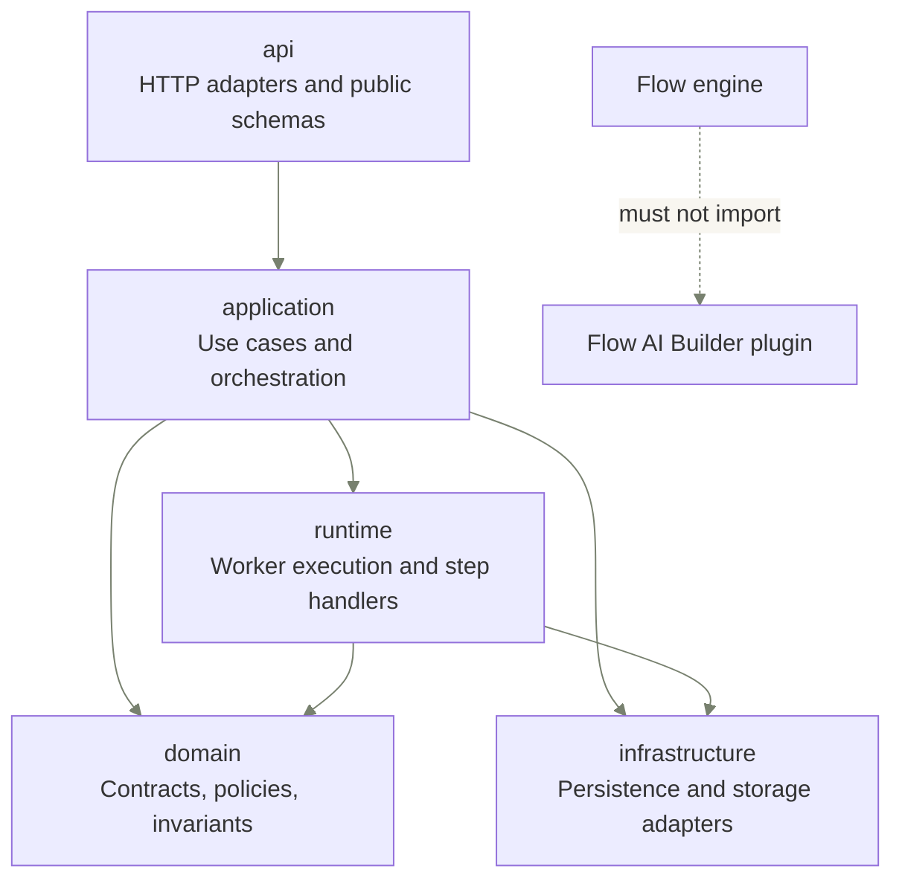

import { Cards } from "nextra/components";

# How Flows is built

Start here when you need to change Flow code. The layer map shows the package owner, import boundary, and first module to open.

## Layer map

This map is a target ownership model, not a promise that every module already lives under that directory. Use the grouped module tables below for the current root entry and its target-home group.

## Import boundaries

Import-linter enforces package dependency boundaries. Runtime policies enforce tenant and principal access before data leaves the backend.

| Contract                                                 | Type        | Source                                | Forbidden                           | Ignored edges                                                           |
| -------------------------------------------------------- | ----------- | ------------------------------------- | ----------------------------------- | ----------------------------------------------------------------------- |
| `Flows engine must not import AI Builder`                | `forbidden` | 78 Flow engine root entries           | `eneo.flows.ai_builder`             | `eneo.flows.api.flow_router -> eneo.flows.ai_builder.ai_builder_router` |
| `FCM must not import AI Builder`                         | `forbidden` | `eneo.flows.flow_capability_manifest` | `eneo.flows.ai_builder`             | none                                                                    |
| `Flow package application must not import AI Builder`    | `forbidden` | `eneo.flow_packages.application`      | `eneo.flows.ai_builder`             | none                                                                    |
| `Flow package domain must not import AI Builder`         | `forbidden` | `eneo.flow_packages.domain`           | `eneo.flows.ai_builder`             | none                                                                    |
| `Flow package domain must not import infrastructure`     | `forbidden` | `eneo.flow_packages.domain`           | `eneo.flow_packages.infrastructure` | none                                                                    |
| `Flow package infrastructure must not import AI Builder` | `forbidden` | `eneo.flow_packages.infrastructure`   | `eneo.flows.ai_builder`             | none                                                                    |
| `AI Builder must not import MCP`                         | `forbidden` | `eneo.flows.ai_builder`               | `eneo.mcp_servers`                  | none                                                                    |

## Runtime access enforcement

`FlowRunAccessPolicy` is the first owner to inspect when a run read, cancel, rerun, artifact, or evidence path changes.

- Run loads pass `tenant_id` into `FlowRunRepository.get`, so missing tenant-scoped rows stay `404`.
- `FlowRunAccessPolicy.ensure_can_access_run` denies cross-tenant rows and mismatched service-key principals.
- Denied access raises `flow_run_access_denied` with an `auth_layer` context value, so API consumers get a typed error instead of an internal invariant.
- Runtime upload ownership uses `FlowPrincipal` and tenant-scoped repositories; do not reintroduce synthetic `UserInDB` identity in Flow runtime code.

## Target homes

| Target home          | Use it for                                                        |
| -------------------- | ----------------------------------------------------------------- |
| `api`                | HTTP adapters, API schemas, OpenAPI-facing errors, and presenters |
| `application`        | use-case services and request-independent orchestration           |
| `canonical-home`     | an existing top-level package that is already a stable home       |
| `domain`             | typed contracts, policies, value objects, and invariants          |
| `infrastructure`     | persistence and external storage adapters                         |
| `plugin`             | Flow-adjacent plugin boundary                                     |
| `remove-merge-later` | duplicate or temporary root import surface to delete              |
| `runtime`            | worker, executor, step execution, and runtime adapter code        |

## AI Builder create compile spine

Create-mode AI Builder is a plugin boundary that assembles deterministic Flow mechanics before lowering. The model owns semantic intent; `FlowAssemblyPlan` owns topology, underlag channel, fixed renderer/transcription/template steps, form-field placement, source exposure, source-reader obligations, and result-contract fields that must feed the final writer.

```mermaid
%%{init: {"themeVariables": {"background": "#f8f6f0", "primaryColor": "#e8ded1", "primaryTextColor": "#242620", "primaryBorderColor": "#6f7b5d", "secondaryColor": "#d7e0d2", "tertiaryColor": "#f1ece4", "lineColor": "#78816f", "edgeLabelBackground": "#f8f6f0", "clusterBkg": "#f4efe7", "clusterBorder": "#9a8a73", "fontFamily": "Inter, ui-sans-serif, system-ui, sans-serif"}}}%%
flowchart LR
  intent["CreateFlowIntent<br/>semantic steps"] --> context["CreateCompileContext<br/>server-owned architecture"]
  context --> assemble["ai_builder_assembly.create<br/>topology admission"]
  assemble --> plan["FlowAssemblyPlan<br/>validated mechanics"]
  plan --> lower["lower_assembly_plan<br/>single writer"]
  lower --> spec["FlowDraftSpecCore<br/>Flow authoring contract"]
  spec --> runtime["Flow validators + runtime contracts"]
```

- `compile_create_intent_to_spec` is the entry point; if assembly cannot support a create intent it raises `architecture_materialization_failed` instead of falling back to legacy create rewrites.
- `ai_builder_assembly/create.py` admits supported topology and source exposure, `plan.py` validates `FlowAssemblyPlan`, `fixed_steps.py` owns zero-LLM planned steps, and `lower.py` is the only create-path writer of `FlowDraftSpecCore` bindings.
- Do not add create-mode normalizers after `lower_assembly_plan`; update assembly rules and the API battle harness when a new Flow capability becomes authorable.
- Edit mode still uses its per-step compiler path separately; do not use edit compatibility needs to reintroduce create-mode post-processing.

## Change index

This is the coarse module index. Use [Reviewing Flows code](/docs/flows-for-developers/reviewing-flows-code) for the ordered procedure and validation sequence.

| Change type                          | Start in                             | Then check                                                  |
| ------------------------------------ | ------------------------------------ | ----------------------------------------------------------- |
| AI Builder create compile shape      | `ai_builder_assembly`                | FCM, Flow validators, runtime contracts, API battle harness |
| API router or response schema        | `api`                                | `application`, error metadata, generated consumer docs      |
| Runtime executor or worker behavior  | `application`, `runtime`             | `domain`, persistence owner, lifecycle docs                 |
| Step handler or output mode          | `runtime`                            | capability manifest, parser, output processing, tests       |
| Runtime file or upload binding       | `application`, `infrastructure`      | file services, run contract, consumer files guide           |
| Schema, migration, or JSONB boundary | `infrastructure`                     | SQLAlchemy table, JSONB owner registry, schema docs         |
| FlowApiErrorCode or failure path     | `api`                                | error metadata, localization, consumer error reference      |
| Review checkpoint lifecycle          | `application`, `infrastructure`      | checkpoint repository, service, lifecycle docs              |
| Developer docs or guarded contract   | `backend/scripts`, docs-site content | docs generator, docs contract test, `make docs:regen`       |

## Module ownership

<code>api</code> (3 entries)

| Entry                 | Kind     | Owns / start here                                           |
| --------------------- | -------- | ----------------------------------------------------------- |
| `flow_api_error_code` | `module` | Public Flow error catalog is API-facing.                    |
| `flow_api_exceptions` | `module` | Public Flow error helpers are API-facing.                   |
| `flow_error_taxonomy` | `module` | Public Flow error taxonomy is API consumer-facing metadata. |

<code>application</code> (11 entries)

| Entry                               | Kind     | Owns / start here                                             |
| ----------------------------------- | -------- | ------------------------------------------------------------- |
| `flow_access_policy`                | `module` | Access policy supports use-case authorization decisions.      |
| `flow_run_contract_service`         | `module` | Run-contract assembly is an application use case.             |
| `flow_run_evidence`                 | `module` | Evidence assembly spans runtime records into consumer output. |
| `flow_run_evidence_bundle`          | `module` | Evidence bundle shape supports evidence assembly.             |
| `flow_run_evidence_export_manifest` | `module` | Export manifest belongs with evidence export assembly.        |
| `flow_run_evidence_export_summary`  | `module` | Export summaries belong with evidence export assembly.        |
| `flow_run_export_json`              | `module` | Evidence JSON export is application-level presentation.       |
| `flow_run_rerun_request`            | `module` | Rerun request normalization belongs with the rerun use case.  |
| `flow_run_step_inputs`              | `module` | Step-input resolution is run-creation/rerun orchestration.    |
| `flow_runtime_file_service`         | `module` | Runtime-file operations are application use cases.            |
| `flow_template_asset_service`       | `module` | Template asset operations are application use cases.          |

<code>canonical-home</code> (5 entries)

| Entry            | Kind      | Owns / start here                                          |
| ---------------- | --------- | ---------------------------------------------------------- |
| `api`            | `package` | HTTP adapters and API schemas already live here.           |
| `application`    | `package` | Flow use cases and application services already live here. |
| `domain`         | `package` | Domain entities and invariants already live here.          |
| `infrastructure` | `package` | Persistence and storage adapters already live here.        |
| `runtime`        | `package` | Worker and execution concerns already live here.           |

<code>domain</code> (47 entries)

| Entry                               | Kind     | Owns / start here                                                             |
| ----------------------------------- | -------- | ----------------------------------------------------------------------------- |
| `assistant_authoring_snapshot`      | `module` | Assistant authoring snapshot is a typed published-definition value.           |
| `citation_sidecar`                  | `module` | Citation sidecar is a typed Flow data contract.                               |
| `enums`                             | `module` | Shared Flow vocabularies belong with domain contracts.                        |
| `flow_authoring_name`               | `module` | Authoring name normalization is a domain value rule.                          |
| `flow_authoring_runtime_input`      | `module` | Runtime-input authoring rules are Flow contract rules.                        |
| `flow_authoring_spec`               | `module` | Authoring spec is a domain contract.                                          |
| `flow_authoring_transcription`      | `module` | Transcription authoring config is a domain contract.                          |
| `flow_authoring_variable_rewriting` | `module` | Variable rewrite rules are authoring-domain rules.                            |
| `flow_capability_manifest`          | `module` | Capability vocabulary is a Flow domain contract.                              |
| `flow_document_limits`              | `module` | Document limits are Flow policy values.                                       |
| `flow_evidence_policy`              | `module` | Evidence policy is a Flow domain policy.                                      |
| `flow_input_limits`                 | `module` | Runtime input limits are Flow policy values.                                  |
| `flow_metadata`                     | `module` | Flow metadata is a domain contract.                                           |
| `flow_resource_bindings`            | `module` | Resource bindings are Flow domain relationships.                              |
| `flow_retention_policy`             | `module` | Retention policy is a data/domain policy.                                     |
| `flow_retention_tombstone`          | `module` | Retention tombstones are domain audit records.                                |
| `flow_review_expiry_policy`         | `module` | Review expiry rules are Flow domain policy.                                   |
| `flow_review_policy`                | `module` | Review requirements are Flow domain policy.                                   |
| `flow_run_error`                    | `module` | Run error payloads are Flow domain contracts.                                 |
| `flow_run_input_envelope`           | `module` | Run input envelope is a typed Flow contract.                                  |
| `flow_run_input_payload`            | `module` | Run input payload is a typed Flow contract.                                   |
| `flow_run_payload_validation`       | `module` | Payload validation enforces Flow contract invariants.                         |
| `flow_run_provenance`               | `module` | Provenance is Flow run domain metadata.                                       |
| `flow_run_redaction`                | `module` | Redaction policy belongs with privacy/domain rules.                           |
| `flow_run_rerun_graph`              | `module` | Rerun graph rules are domain lifecycle rules.                                 |
| `flow_run_step_input_file`          | `module` | Step input file references are domain contracts.                              |
| `flow_run_step_result_file`         | `module` | Step result file references are domain contracts.                             |
| `flow_runtime_policy`               | `module` | Runtime policy is a Flow domain policy.                                       |
| `flow_security_classification`      | `module` | Security classification is a domain policy value.                             |
| `flow_settings`                     | `module` | Flow settings are typed domain configuration.                                 |
| `flow_validators`                   | `module` | Cross-field validators enforce domain contracts.                              |
| `flow_validators_form`              | `module` | Form validators enforce domain contracts.                                     |
| `flow_validators_http`              | `module` | HTTP-step validators enforce domain contracts.                                |
| `flow_validators_template`          | `module` | Template validators enforce domain contracts.                                 |
| `flow_variable_definitions`         | `module` | Variable definitions are Flow domain contracts.                               |
| `input_binding_contract_rules`      | `module` | Input binding rules are contract invariants.                                  |
| `output_modes`                      | `module` | Output modes are Flow domain vocabulary.                                      |
| `principal`                         | `module` | Flow principal identity is a domain contract.                                 |
| `published_definition`              | `module` | Published definition parsing owns snapshot invariants.                        |
| `source_display`                    | `module` | Source display values are Flow domain presentation.                           |
| `source_identity`                   | `module` | Runtime source identity fields and schema projection are Flow contract rules. |
| `step_chain_rules`                  | `module` | Step chain rules are domain invariants.                                       |
| `step_item_map`                     | `module` | Item-map configuration and validation are Flow step contract rules.           |
| `step_lineage`                      | `module` | Step lineage is domain metadata.                                              |
| `template_reference_analyzer`       | `module` | Template reference analysis enforces domain contracts.                        |
| `transcription_config`              | `module` | Transcription config is a domain contract.                                    |
| `type_policies`                     | `module` | Type policy is a domain contract.                                             |

<code>infrastructure</code> (2 entries)

| Entry                      | Kind     | Owns / start here                             |
| -------------------------- | -------- | --------------------------------------------- |
| `flow_runtime_upload_repo` | `module` | Runtime upload persistence is infrastructure. |
| `flow_template_asset_repo` | `module` | Template asset persistence is infrastructure. |

<code>plugin</code> (2 entries)

| Entry                             | Kind      | Owns / start here                                                                     |
| --------------------------------- | --------- | ------------------------------------------------------------------------------------- |
| `flow_ai_builder_budget_settings` | `module`  | Builder budget settings should live with the builder boundary.                        |
| `ai_builder`                      | `package` | Flow AI Builder plugin boundary; only shared contracts should cross into Flow proper. |

<code>runtime</code> (9 entries)

| Entry                          | Kind      | Owns / start here                                              |
| ------------------------------ | --------- | -------------------------------------------------------------- |
| `assistant_execution_snapshot` | `module`  | Assistant execution snapshot is consumed by runtime execution. |
| `execution_backend`            | `module`  | Execution backend selection is runtime behavior.               |
| `flow_run_dispatch_request`    | `module`  | Dispatch payload is a worker/runtime command.                  |
| `flow_runtime_file_integrity`  | `module`  | Runtime file integrity is execution/runtime safety.            |
| `output_processing`            | `module`  | Output processing is runtime execution behavior.               |
| `published_runtime`            | `module`  | Published runtime parsing feeds execution.                     |
| `runtime_input`                | `module`  | Runtime input resolution feeds execution.                      |
| `variable_resolver`            | `module`  | Variable resolution is runtime execution behavior.             |
| `http_transport`               | `package` | HTTP transport belongs under runtime step handling.            |

## Source guards

| Guarded source                                                 | Guard                                                                                                  |
| -------------------------------------------------------------- | ------------------------------------------------------------------------------------------------------ |
| `docs/flows/package-layout.md`                                 | `test_flow_package_layout.py::test_flow_root_layout_decision_matches_filesystem`                       |
| `backend/.importlinter` source modules                         | `test_importlinter_boundary.py::test_source_modules_cover_every_flows_sibling`                         |
| this generated docs-site page                                  | `test_flow_docs_site_contract.py::test_flow_developer_docs_how_built_is_generated_from_layout_sources` |
| `backend/src/eneo/flows/application/flow_run_access_policy.py` | Runtime access text names the canonical tenant and principal enforcement owner.                        |

## Related

<Cards num={2}>

<Cards.Card
  title="The run lifecycle"
  href="/docs/flows-for-developers/run-lifecycle"
  arrow
/>

<Cards.Card
  title="Reviewing Flows code"
  href="/docs/flows-for-developers/reviewing-flows-code"
  arrow
/>

</Cards>
