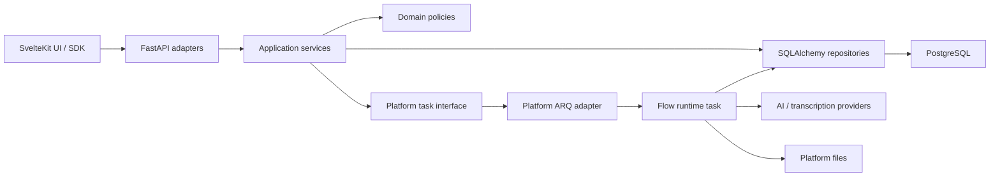

# How Flows is built

Flows is a versioned application feature on top of shared Eneo identity, files,
models, audit, task, and retention primitives. It does not deploy a separate
application stack.

## Request and execution path

The HTTP transaction creates and commits a queued run. Dispatch then uses the
platform task interface. The worker opens a fresh database session and claims
the run through compare-and-swap before executing its immutable published
definition.

## Backend layers

| Package | Owns |
| --- | --- |
| `eneo.flows.api` | HTTP parsing, response models, public errors, auth dependencies |
| `eneo.flows.application` | use cases, authorization decisions, lifecycle orchestration |
| `eneo.flows.domain` | policies, typed contracts, invariants, lifecycle exceptions |
| `eneo.flows.infrastructure` | tenant-scoped repositories, locking, SQL projections |
| `eneo.flows.runtime` | task entry points, executor, step handlers, tracing, delivery loops |
| `eneo.flow_packages` | portable archive mechanics and Flow package adapter |
| `eneo.worker.platform_tasks` | current ARQ registration, queue capacity, schedules, health |

The domain layer may not import API, infrastructure, or runtime packages.
Transport-specific ARQ imports stay in the platform worker package, outside
Flow domain/application code.

## Frontend layers

The generated Eneo SDK owns API types. `src/lib/features/flows` owns Flow
state/presentation helpers and components. SvelteKit routes assemble those
components for manual authoring and run/review views.

The stacked Builder PR additionally owns:

- `src/lib/features/flows/ai-builder`;
- the `flows/ai-builder` route subtree;
- Builder-only settings, permissions, translations, and tests.

Core manual authoring does not import Builder code. Builder commits through the
same backend draft-validation/materialization boundary as manual authoring.

## Persistence boundaries

- Mutable drafts live in `flows` and `flow_steps`.
- Immutable executable snapshots live in `flow_versions`.
- Runtime lifecycle and evidence live in run/result/attempt/provider-call rows.
- Files remain platform Files; Flow tables record binding and provenance.
- Review, audit, and webhook effects have their own relational lifecycle rows.
- JSONB payloads are parsed by registered typed owners.

See [The data schema](/docs/flows-for-developers/data-schema) for aggregate
ownership and the final three-revision stacked migration shape.

## Process model

Flows adds zero private processes. The deployment's platform execution worker
runs long Flow tasks, while the platform maintenance worker schedules recovery
and delivery jobs. Both use the existing ARQ/Redis platform runtime. Execution
saturation cannot consume maintenance capacity.

## Source guards

Architecture tests enforce meaningful boundaries: domain import direction,
portable-package independence, runtime ownership, and Builder absence from the
core branch. They do not require developer prose to match generated output or
freeze schema details already covered by migration/repository behavior tests.

## Related

- [The run lifecycle](/docs/flows-for-developers/run-lifecycle)
- [Key decisions](/docs/flows-for-developers/key-decisions)
- [Reviewing Flows code](/docs/flows-for-developers/reviewing-flows-code)
- [Flow package layout](https://github.com/eneo-ai/eneo/blob/develop/docs/flows/package-layout.md)
