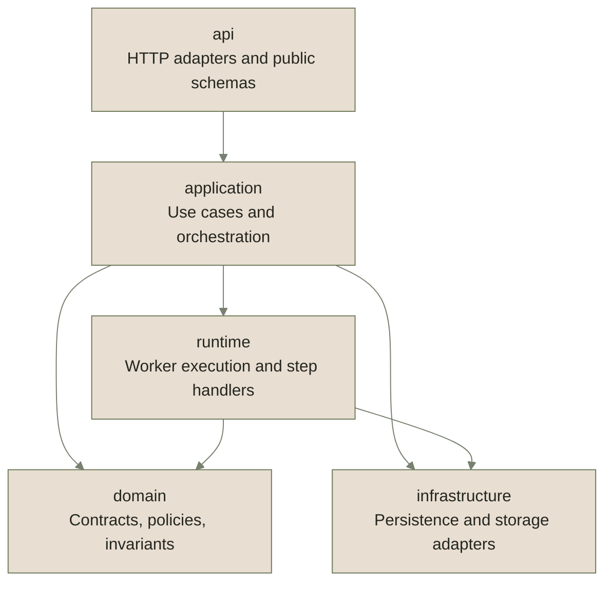

import { Cards } from "nextra/components";

# How Flows is built

Start here when you need to change Flow code. The layer map shows the package owner, import boundary, and first module to open.

## Layer map

This map is a target ownership model, not a promise that every module already lives under that directory. The module ownership table below lists each current root entry and its target-home group.

## Import boundaries

Import-linter enforces package dependency boundaries. Runtime policies enforce tenant and principal access before data leaves the backend.

| Contract                                             | Type        | Source                      | Forbidden                           | Ignored edges |
| ---------------------------------------------------- | ----------- | --------------------------- | ----------------------------------- | ------------- |
| `Flow package domain must not import infrastructure` | `forbidden` | `eneo.flow_packages.domain` | `eneo.flow_packages.infrastructure` | none          |

## Runtime access enforcement

`FlowRunAccessPolicy` is the first owner to inspect when a run read, cancel, rerun, artifact, or evidence path changes.

- Run loads pass `tenant_id` into `FlowRunRepository.get`, so missing tenant-scoped rows stay `404`.
- `FlowRunAccessPolicy.ensure_can_access_run` denies cross-tenant rows and mismatched service-key principals.
- Denied access raises `flow_run_access_denied` with an `auth_layer` context value, so API consumers get a typed error instead of an internal invariant.
- Runtime upload ownership uses `FlowPrincipal` and tenant-scoped repositories; do not reintroduce synthetic `UserInDB` identity in Flow runtime code.

## Change index

This is the coarse module index. Use [Reviewing Flows code](/docs/flows-for-developers/reviewing-flows-code) for the ordered procedure and validation sequence.

| Change type                          | Start in                             | Then check                                             |
| ------------------------------------ | ------------------------------------ | ------------------------------------------------------ |
| API router or response schema        | `api`                                | `application`, error metadata, generated consumer docs |
| Runtime executor or worker behavior  | `application`, `runtime`             | `domain`, persistence owner, lifecycle docs            |
| Step handler or output mode          | `runtime`                            | capability manifest, parser, output processing, tests  |
| Runtime file or upload binding       | `application`, `infrastructure`      | file services, run contract, consumer files guide      |
| Schema, migration, or JSONB boundary | `infrastructure`                     | SQLAlchemy table, JSONB owner registry, schema docs    |
| FlowApiErrorCode or failure path     | `api`                                | error metadata, localization, consumer error reference |
| Review checkpoint lifecycle          | `application`, `infrastructure`      | checkpoint repository, service, lifecycle docs         |
| Developer docs or guarded contract   | `backend/scripts`, docs-site content | docs generator, docs contract test, `make docs:regen`  |

## Module ownership

Root entries under `backend/src/eneo/flows/` grouped by the home they belong to; `canonical-home` marks the packages that already are the stable home. `docs/flows/package-layout.md` is the source of this table.

| Target home      | Use it for                                                        | Root entries                                                                                                                                                                                                                                                                                                                                                                                                                                                                                                                                                                                                                                                                                                                                                                                                                                                                                                                                                                                                                                                                                                                                     |
| ---------------- | ----------------------------------------------------------------- | ------------------------------------------------------------------------------------------------------------------------------------------------------------------------------------------------------------------------------------------------------------------------------------------------------------------------------------------------------------------------------------------------------------------------------------------------------------------------------------------------------------------------------------------------------------------------------------------------------------------------------------------------------------------------------------------------------------------------------------------------------------------------------------------------------------------------------------------------------------------------------------------------------------------------------------------------------------------------------------------------------------------------------------------------------------------------------------------------------------------------------------------------ |
| `api`            | HTTP adapters, API schemas, OpenAPI-facing errors, and presenters | `flow_api_error_code`, `flow_api_exceptions`, `flow_error_taxonomy`                                                                                                                                                                                                                                                                                                                                                                                                                                                                                                                                                                                                                                                                                                                                                                                                                                                                                                                                                                                                                                                                              |
| `application`    | use-case services and request-independent orchestration           | `flow_access_policy`, `flow_run_contract_service`, `flow_run_rerun_request`, `flow_run_step_inputs`, `flow_runtime_file_service`, `flow_template_asset_service`                                                                                                                                                                                                                                                                                                                                                                                                                                                                                                                                                                                                                                                                                                                                                                                                                                                                                                                                                                                  |
| `canonical-home` | an existing top-level package that is already a stable home       | packages `api/`, `application/`, `domain/`, `infrastructure/`, `runtime/`                                                                                                                                                                                                                                                                                                                                                                                                                                                                                                                                                                                                                                                                                                                                                                                                                                                                                                                                                                                                                                                                        |
| `domain`         | typed contracts, policies, value objects, and invariants          | `assistant_authoring_snapshot`, `citation_sidecar`, `enums`, `flow_authoring_name`, `flow_authoring_runtime_input`, `flow_authoring_spec`, `flow_authoring_transcription`, `flow_authoring_variable_rewriting`, `flow_capability_manifest`, `flow_document_limits`, `flow_evidence_policy`, `flow_input_limits`, `flow_metadata`, `flow_resource_bindings`, `flow_retention_policy`, `flow_retention_tombstone`, `flow_review_expiry_policy`, `flow_review_policy`, `flow_run_error`, `flow_run_input_envelope`, `flow_run_input_payload`, `flow_run_payload_validation`, `flow_run_provenance`, `flow_run_redaction`, `flow_run_rerun_graph`, `flow_run_step_input_file`, `flow_run_step_result_file`, `flow_runtime_policy`, `flow_security_classification`, `flow_settings`, `flow_validators`, `flow_validators_form`, `flow_validators_http`, `flow_validators_template`, `flow_variable_definitions`, `input_binding_contract_rules`, `output_modes`, `principal`, `published_definition`, `source_display`, `source_identity`, `step_chain_rules`, `step_lineage`, `template_reference_analyzer`, `transcription_config`, `type_policies` |
| `infrastructure` | persistence and external storage adapters                         | `flow_runtime_upload_repo`, `flow_template_asset_repo`                                                                                                                                                                                                                                                                                                                                                                                                                                                                                                                                                                                                                                                                                                                                                                                                                                                                                                                                                                                                                                                                                           |
| `runtime`        | worker, executor, step execution, and runtime adapter code        | packages `http_transport/`; `assistant_execution_snapshot`, `execution_backend`, `flow_run_dispatch_request`, `flow_runtime_file_integrity`, `output_processing`, `published_runtime`, `variable_resolver`                                                                                                                                                                                                                                                                                                                                                                                                                                                                                                                                                                                                                                                                                                                                                                                                                                                                                                                                       |

## Source guards

| Guarded source                                                 | Guard                                                                                                  |
| -------------------------------------------------------------- | ------------------------------------------------------------------------------------------------------ |
| `docs/flows/package-layout.md`                                 | `test_flow_package_layout.py::test_flow_root_layout_decision_matches_filesystem`                       |
| `backend/.importlinter` source modules                         | `test_importlinter_boundary.py::test_source_modules_cover_every_flows_sibling`                         |
| this generated docs-site page                                  | `test_flow_docs_site_contract.py::test_flow_developer_docs_how_built_is_generated_from_layout_sources` |
| `backend/src/eneo/flows/application/flow_run_access_policy.py` | Runtime access text names the canonical tenant and principal enforcement owner.                        |

## Related

<Cards num={2}>

<Cards.Card
  title="The run lifecycle"
  href="/docs/flows-for-developers/run-lifecycle"
  arrow
/>

<Cards.Card
  title="Reviewing Flows code"
  href="/docs/flows-for-developers/reviewing-flows-code"
  arrow
/>

</Cards>
