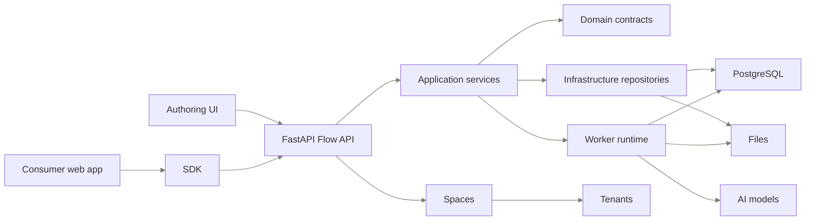

# Flows in 5 minutes

Start here when you need to review or change the Flow implementation. You will see where Flows sits in Eneo, which layer owns each kind of change, and which page to open before you read source code.

Flows are Eneo's versioned AI workflow runtime. The useful mental model is:
authoring creates a draft, publish freezes a version, run executes that version,
review can pause a run, and rerun can invalidate work after a completed step.

## The code layers

| Layer            | Owns                                                                  | Start here when                                                      |
| ---------------- | --------------------------------------------------------------------- | -------------------------------------------------------------------- |
| `api`            | HTTP adapters, OpenAPI-facing schemas, and response assembly          | A route, status code, or public error changes                        |
| `application`    | Use cases and request-independent orchestration                       | A flow, run, review, rerun, evidence, or retention operation changes |
| `domain`         | Typed contracts, policies, value objects, and invariants              | A lifecycle rule or authored/runtime contract changes                |
| `infrastructure` | SQLAlchemy repositories and storage adapters                          | Persistence, tenant scope, locks, or schema usage changes            |
| `runtime`        | Worker tasks, executor, step handlers, output formatting, and tracing | Step execution, retries, terminalization handoff, or OTel changes    |

Keep changes inside the owning layer unless the public contract truly crosses a
boundary. A route should parse and delegate. A repository should persist. A
domain module should make invalid states hard to express.
Terminal run-state writes live in `application` through `FlowRunTerminalizer`;
runtime code decides when to hand off.

## The three objects

| Object            | What changes                                                                  | What stays stable                               |
| ----------------- | ----------------------------------------------------------------------------- | ----------------------------------------------- |
| Draft flow        | Authors edit steps, metadata, inputs, policies, and assets                    | Draft revision tracks optimistic updates        |
| Published version | Publish writes the executable snapshot and checksum                           | Runs use this snapshot, not mutable draft steps |
| Flow run          | Runtime stores principal, status, step results, attempts, evidence, and files | Step identity comes from the published version  |

This split is the first review check. If runtime code reads mutable draft state,
or authoring code mutates run history, the boundary is probably wrong.

## Review path

| First-read goal                        | Start with                                                                                            | You should be able to verify                                       |
| -------------------------------------- | ----------------------------------------------------------------------------------------------------- | ------------------------------------------------------------------ |
| Understand product behavior            | [Flows](/docs/flows)                                                                                  | What authors and consumers expect from Eneo Flows                  |
| Build against the public API           | [Flows API Guide](/guides/flows-api-guide)                                                            | Request and response shapes for consumer integrations              |
| Review module ownership                | [How Flows is built](/docs/flows-for-developers/how-built)                                            | Which layer and source module owns the change                      |
| Review persistence or retention        | [The data schema](/docs/flows-for-developers/data-schema)                                             | Which tables, foreign keys, delete rules, and JSONB owners apply   |
| Review run or rerun lifecycle behavior | [The run lifecycle](/docs/flows-for-developers/run-lifecycle)                                         | Which service owns each state transition and recovery path         |
| Review error behavior                  | [When things fail](/docs/flows-for-developers/when-things-fail)                                       | Which typed error reaches the API consumer and what action follows |
| Review architecture decisions          | [Key decisions](/docs/flows-for-developers/key-decisions)                                             | Which long-term tradeoffs the implementation depends on            |
| Prepare or review a Flow PR            | [Reviewing Flows code](/docs/flows-for-developers/reviewing-flows-code)                               | Which files to touch and which validation command proves the work  |
| Read the full maintainer evidence map  | [docs/flows/architecture.md](https://github.com/eneo-ai/eneo/blob/develop/docs/flows/architecture.md) | Source-file evidence behind the architecture                       |
