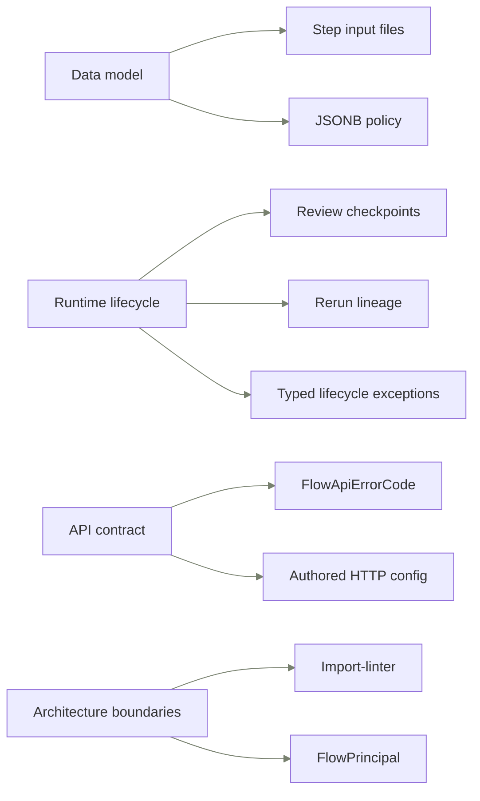

import { Cards } from "nextra/components";

# Key decisions

Read this page before changing a Flow boundary. It summarizes the decisions that should shape code, tests, and review.

## Decision map

## How to read this page

The refactor journal is the append-only audit trail. Code, schema, and tests are the enforceable truth. This page is the curated reviewer view for decisions that change how a new Flow reviewer should read the system.

## Decisions

### 1. Relational step-input files over rerun JSON blobs

**Context.** Runtime files need auditability, tenant scoping, and file foreign keys.

**Decision.** `FlowRunStepInputFiles` is the canonical owner for step-file bindings.

**Consequences.**

- Reject new step-input JSON side channels that duplicate relational file rows.
- Keep rerun override intent explicit with `root_step_input_override_requested`.

**Source refs.** Step input rows: `backend/src/intric/database/tables/flow_tables.py`, Rerun operation rows: `backend/src/intric/database/tables/flow_tables.py`, Rerun accept path: `backend/src/intric/flows/application/flow_run_rerun_service.py`.

### 2. Typed lifecycle exceptions over HTTP-shaped lower layers

**Context.** Repositories and runtime code must report state races without knowing HTTP.

**Decision.** Domain exception types own lifecycle failure vocabulary below the API boundary.

**Consequences.**

- Translate failures to Flow API errors only in application or router adapters.
- Reject `BadRequestException` leaks from repositories and runtime invariants.

**Source refs.** Review checkpoint exceptions: `backend/src/intric/flows/domain/review_checkpoint_exceptions.py`, Rerun service translation: `backend/src/intric/flows/application/flow_run_rerun_service.py`.

### 3. Explicit Flow principals over synthetic runtime users

**Context.** Runtime ownership needs to support users and service keys without fake user rows.

**Decision.** `FlowPrincipal` carries the execution principal across runtime, audit, and ownership checks.

**Consequences.**

- Reject new `UserInDB` synthesis in Flow runtime paths.
- Tenant-scoped repositories should receive tenant and principal fields explicitly.
- Review tenant filters and cross-principal denial tests together.

**Source refs.** Flow principal: `backend/src/intric/flows/principal.py`, Runtime actor: `backend/src/intric/flows/runtime/flow_run_actor.py`, Run access policy: `backend/src/intric/flows/application/flow_run_access_policy.py`.

### 4. Authored HTTP config only

**Context.** Legacy flat HTTP config created two input shapes for the same authored step.

**Decision.** HTTP steps accept authored config with an auth block and reject legacy flat config.

**Consequences.**

- Reject fallback reads for `body_template`, `body_json`, or flat auth fields.
- Keep secrets and request previews behind the authored config model.

**Source refs.** HTTP validator: `backend/src/intric/flows/flow_validators_http.py`, HTTP transport package: `backend/src/intric/flows/http_transport/__init__.py`, HTTP runtime: `backend/src/intric/flows/runtime/http_runtime.py`.

### 5. One persistence owner for review checkpoint state

**Context.** Checkpoint writes touch both the checkpoint row and parent run status.

**Decision.** `FlowRunReviewCheckpointRepository` owns checkpoint persistence and locks the run first.

**Consequences.**

- Reject checkpoint state writes through `FlowRunRepository` or ad hoc SQL.
- Keep run await and resume transitions in the same transaction owner.

**Source refs.** Checkpoint repository: `backend/src/intric/flows/infrastructure/flow_run_review_checkpoint_repo.py`, Checkpoint service: `backend/src/intric/flows/application/flow_run_review_checkpoint_service.py`.

### 6. Bounded JSONB policy

**Context.** Some Flow data is intentionally semi-structured, but hidden schema is technical debt.

**Decision.** Every Flow JSONB column must have an owner, envelope, category, and corruption behavior.

**Consequences.**

- Reject new Flow JSONB columns without ownership metadata and tests.
- Move relational candidates out of JSON when queryability or integrity requires it.

**Source refs.** JSONB owner registry: `backend/src/intric/flows/infrastructure/flow_jsonb_ownership.py`, Schema docs exporter: `backend/src/intric/flows/infrastructure/flow_schema_docs_exporter.py`, Data schema docs: `frontend/apps/docs-site/src/content/docs/flows-for-developers/data-schema.mdx`.

### 7. One public Flow API error-code vocabulary

**Context.** API consumers need stable machine codes while users need localized recovery text.

**Decision.** `FlowApiErrorCode` owns public codes and the failure taxonomy owns developer recovery detail.

**Consequences.**

- Reject uncataloged Flow API codes and internal invariant strings in public responses.
- Update the failure taxonomy page when a public Flow code changes.

**Source refs.** Error-code enum: `backend/src/intric/flows/flow_api_error_code.py`, Failure taxonomy: `backend/src/intric/flows/flow_error_taxonomy.py`, Developer failure page: `frontend/apps/docs-site/src/content/docs/flows-for-developers/when-things-fail.mdx`.

### 8. Import boundaries and Flow AI Builder isolation

**Context.** Flow proper and Flow AI Builder evolve together but should not share orchestration internals.

**Decision.** Import-linter blocks Flow engine imports from the AI Builder plugin boundary.

**Consequences.**

- Reject new engine dependencies on `ai_builder` modules outside the explicit router bridge.
- Update package-layout docs and import-linter together when root modules move.

**Source refs.** Import-linter contract: `backend/.importlinter`, Package layout: `docs/flows/package-layout.md`.

### 9. Review checkpoint as a revisioned state machine

**Context.** Human review is a sub-lifecycle with edits, approval, rejection, expiry, and resume.

**Decision.** Review checkpoints keep their own state and revision instead of adding run statuses.

**Consequences.**

- Reject modeling review edits as run-status transitions.
- Keep resume idempotency tied to checkpoint revision and decision state.

**Source refs.** Checkpoint states: `backend/src/intric/flows/enums.py`, Checkpoint table: `backend/src/intric/database/tables/flow_tables.py`, Lifecycle docs: `frontend/apps/docs-site/src/content/docs/flows-for-developers/run-lifecycle.mdx`.

### 10. Rerun lineage and invalidation ownership

**Context.** Reruns rebuild one root step and every downstream result that depends on it.

**Decision.** The rerun service plans invalidation and the rerun repository persists operation lineage.

**Consequences.**

- Reject direct executor writes that bypass rerun operation lineage.
- Preserve root attempt numbers, invalidated-step rows, and request fingerprints together.

**Source refs.** Rerun service: `backend/src/intric/flows/application/flow_run_rerun_service.py`, Rerun repository: `backend/src/intric/flows/infrastructure/flow_run_rerun_repo.py`, Rerun graph: `backend/src/intric/flows/flow_run_rerun_graph.py`.

## Source guards

- Source references are file paths only, not line-number citations.
- New decisions land in the refactor journal first and promote here only when they change the architecture story.

## Related

<Cards num={2}>

<Cards.Card
  title="The data schema"
  href="/docs/flows-for-developers/data-schema"
  arrow
/>

<Cards.Card
  title="When things fail"
  href="/docs/flows-for-developers/when-things-fail"
  arrow
/>

</Cards>
