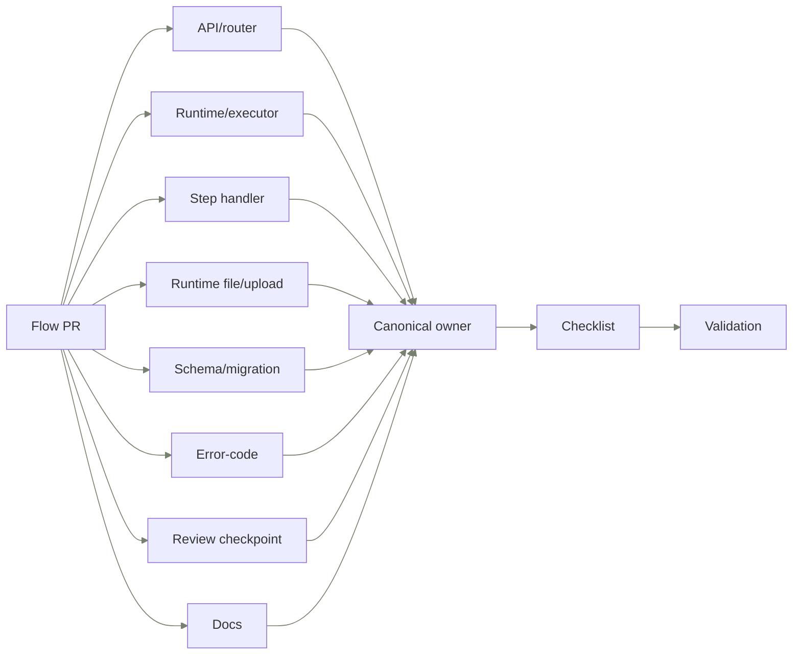

import { Cards, Steps } from "nextra/components";

# Reviewing Flows code

Use this page before reviewing or authoring a Flow PR. It gives the files to open, defects to reject, and commands that prove the change.

## Review route

Use the diagram first, then use the table for the exact source owner.

## Where to start

| Change type                          | Start here                                                                                                                         | Proof                                                                                                 | Source refs                                                                                                                                                                                                                                                                                                                                                                |
| ------------------------------------ | ---------------------------------------------------------------------------------------------------------------------------------- | ----------------------------------------------------------------------------------------------------- | -------------------------------------------------------------------------------------------------------------------------------------------------------------------------------------------------------------------------------------------------------------------------------------------------------------------------------------------------------------------------- |
| API router or response schema        | Start in `api/`, then follow the application service it delegates to.                                                              | Prove OpenAPI shape, FlowApiErrorCode mapping, and docs parity.                                       | Run router aggregate: `backend/src/eneo/flows/api/flow_run_router.py`, Run lifecycle router: `backend/src/eneo/flows/api/flow_run_lifecycle_router.py`, Run review router: `backend/src/eneo/flows/api/flow_run_review_router.py`, Run rerun router: `backend/src/eneo/flows/api/flow_run_rerun_router.py`, API design standard: `docs/engineering/api-design-standard.md` |
| Runtime executor or worker behavior  | Start in `runtime/`, then identify the persisted state owner.                                                                      | Prove idempotency, terminalization, retry behavior, and trace correlation.                            | Executor: `backend/src/eneo/flows/runtime/executor.py`, Runtime tasks: `backend/src/eneo/flows/runtime/tasks.py`, Worker contract tests: `backend/tests/integration/flows/test_flow_runtime_worker_contract.py`                                                                                                                                                            |
| Step handler or output mode          | Start runtime handler construction at `FlowRunExecutor._build_step_handler` and keep concrete behavior in `runtime/step_handlers/` | Prove parser validation, handler or output-processing behavior, and typed errors.                     | Handler construction: `backend/src/eneo/flows/runtime/executor.py`, Handler contract: `backend/src/eneo/flows/runtime/step_handlers/base.py`, Output modes: `backend/src/eneo/flows/output_modes.py`, Output processing: `backend/src/eneo/flows/output_processing.py`, Step definition parser: `backend/src/eneo/flows/runtime/step_definition_parser.py`                 |
| Runtime file or upload binding       | Start at `FlowRuntimeFileService`, then follow `step_inputs` validation and row inserts.                                           | Prove tenant/principal ownership, `lock_for_binding`, delete behavior, and run/rerun step-input rows. | Runtime file service: `backend/src/eneo/flows/flow_runtime_file_service.py`, Runtime upload repository: `backend/src/eneo/flows/flow_runtime_upload_repo.py`, Step input validation: `backend/src/eneo/flows/flow_run_step_inputs.py`, Step input row builder: `backend/src/eneo/flows/infrastructure/flow_run_step_input_file_rows.py`                                    |
| Schema, migration, or JSONB boundary | Start at the SQLAlchemy table, then find the typed boundary owner.                                                                 | Prove constraints, tenant scope, JSONB ownership, and generated schema docs.                          | Flow tables: `backend/src/eneo/database/tables/flow_tables.py`, JSONB ownership: `backend/src/eneo/flows/infrastructure/flow_jsonb_ownership.py`, Data schema docs: `frontend/apps/docs-site/src/content/docs/flows-for-developers/data-schema.mdx`                                                                                                                        |
| FlowApiErrorCode or failure path     | Start at the enum, then follow metadata, translations, and callers.                                                                | Prove the consumer sees a stable code, localized text, and recovery action.                           | Error-code enum: `backend/src/eneo/flows/flow_api_error_code.py`, Failure taxonomy: `backend/src/eneo/flows/flow_error_taxonomy.py`, Frontend messages: `frontend/apps/web/messages/en.json`                                                                                                                                                                               |
| Review checkpoint lifecycle          | Start at the checkpoint repository and service, then check run status effects.                                                     | Prove revision guards, idempotency, resume behavior, and typed exceptions.                            | Checkpoint repository: `backend/src/eneo/flows/infrastructure/flow_run_review_checkpoint_repo.py`, Checkpoint service: `backend/src/eneo/flows/application/flow_run_review_checkpoint_service.py`, Checkpoint exceptions: `backend/src/eneo/flows/domain/review_checkpoint_exceptions.py`                                                                                  |
| Developer docs or guarded contract   | Start at the generator, then inspect the parity test and rendered MDX.                                                             | Prove the generated page matches source-owned records and still renders.                              | Docs contract tests: `backend/tests/unittests/flows/test_flow_docs_site_contract.py`, Developer docs meta: `frontend/apps/docs-site/src/content/docs/flows-for-developers/_meta.ts`                                                                                                                                                                                        |

## Common changes

These procedures are attached to the change-type routes above, so the reviewer guide has one owner for where a Flow change starts and how to prove it.

### Change a run state

<Steps>

<h4>Update status vocabulary</h4>

Start in `backend/src/eneo/flows/enums.py` and update the status vocabulary plus capability mappings together.

<h4>Change the writer</h4>

Change the application or runtime owner that writes the state, such as `backend/src/eneo/flows/application/flow_run_terminalization.py` or `backend/src/eneo/flows/runtime/executor.py`.

<h4>Use canonical persistence</h4>

Update repository writes only through the canonical persistence owner, not ad hoc SQL.

<h4>Test lifecycle behavior</h4>

Add lifecycle behavior tests, then run `make docs:regen` and the Flow docs contract test.

</Steps>

### Add a step capability

<Steps>

<h4>Define capability shape</h4>

Start in `backend/src/eneo/flows/flow_capability_manifest.py` and define the supported input, output, and artifact shape.

<h4>Add runtime support</h4>

Update executor handler construction when the capability needs a runtime handler; keep behavior in `runtime/step_handlers/`.

<h4>Update parsing and output</h4>

Update parser or output ownership in `backend/src/eneo/flows/runtime/step_definition_parser.py`, `backend/src/eneo/flows/output_modes.py`, or `backend/src/eneo/flows/output_processing.py`.

<h4>Test and regenerate docs</h4>

Add behavior tests for the capability and run `make docs:regen` plus the Flow docs contract test.

</Steps>

### Add a JSONB field

<Steps>

<h4>Start at the table</h4>

Start at the SQLAlchemy column in `backend/src/eneo/database/tables/flow_tables.py` or the table module that owns the row.

<h4>Register the typed owner</h4>

Add the typed owner in `backend/src/eneo/flows/infrastructure/flow_jsonb_ownership.py` with version, corruption behavior, and rationale.

<h4>Validate at the boundary</h4>

Parse and validate the envelope at the application or API boundary that first accepts the value.

<h4>Test corruption behavior</h4>

Add corruption and migration behavior tests, then run `make docs:regen` and the Flow docs contract test.

</Steps>

### Add an error code

<Steps>

<h4>Add the public code</h4>

Add the public code in `backend/src/eneo/flows/flow_api_error_code.py`.

<h4>Add recovery metadata</h4>

Add metadata and recovery actions in `backend/src/eneo/flows/flow_error_taxonomy.py`.

<h4>Update localizations</h4>

Add or update localization in `frontend/apps/web/messages/en.json` and the matching Swedish message file.

<h4>Test the failure path</h4>

Prove the failure path with a behavior test, then run `make docs:regen` and the Flow docs contract test.

</Steps>

## Review checklist

| Topic                      | Check                                                                                                           | Reject                                                                                                  | Source refs                                                                                                                                                                                                                                                           |
| -------------------------- | --------------------------------------------------------------------------------------------------------------- | ------------------------------------------------------------------------------------------------------- | --------------------------------------------------------------------------------------------------------------------------------------------------------------------------------------------------------------------------------------------------------------------- |
| Single owner               | Name the module that owns the changed Flow concept.                                                             | Reject parallel owners, pass-through services, and duplicate state.                                     | Maintainability standard: `docs/engineering/maintainability-standards.md`, Layer map: `frontend/apps/docs-site/src/content/docs/flows-for-developers/how-built.mdx`, Key decisions: `frontend/apps/docs-site/src/content/docs/flows-for-developers/key-decisions.mdx` |
| Typed errors               | Translate Flow failures through typed domain or API error codes.                                                | Reject public 400s that expose internal invariant text.                                                 | API standard: `docs/engineering/api-design-standard.md`, Error-code enum: `backend/src/eneo/flows/flow_api_error_code.py`, Review exceptions: `backend/src/eneo/flows/domain/review_checkpoint_exceptions.py`                                                         |
| Tenant and principal scope | Tenant filters use tenant_id, and runtime ownership checks use FlowPrincipal plus cross-principal denial tests. | Reject synthetic users, tenant-free queries, and tests that skip service-key or cross-principal denial. | Flow principal: `backend/src/eneo/flows/principal.py`, Run access policy: `backend/src/eneo/flows/application/flow_run_access_policy.py`, Runtime actor: `backend/src/eneo/flows/runtime/flow_run_actor.py`                                                           |
| Behavior tests             | Tests prove user-visible behavior, lifecycle rules, or public contracts.                                        | Reject tests that only preserve mocks, wiring, or deleted legacy paths.                                 | Testing standard: `docs/engineering/testing-standard.md`, Docs contract tests: `backend/tests/unittests/flows/test_flow_docs_site_contract.py`, Runtime worker contract: `backend/tests/integration/flows/test_flow_runtime_worker_contract.py`                       |
| No legacy reintroduction   | Pre-production legacy paths stay deleted unless a current contract requires them.                               | Reject compatibility bridges, dual-read paths, and hidden fallbacks.                                    | HTTP validator: `backend/src/eneo/flows/flow_validators_http.py`, HTTP runtime: `backend/src/eneo/flows/runtime/http_runtime.py`, Key decisions: `frontend/apps/docs-site/src/content/docs/flows-for-developers/key-decisions.mdx`                                    |
| Docs parity                | Guarded Flow docs change in the same commit as guarded concepts.                                                | Reject docs that can drift from schemas, errors, modules, or lifecycle states.                          | Docs contract tests: `backend/tests/unittests/flows/test_flow_docs_site_contract.py`, Developer docs section: `frontend/apps/docs-site/src/content/docs/flows-for-developers/index.mdx`                                                                               |
| API consumer clarity       | A consumer can see what failed, why, and the next action.                                                       | Reject vague errors, undocumented response shape changes, and source-only contracts.                    | API guide: `frontend/apps/docs-site/src/content/guides/flows-api-guide.mdx`, Failure taxonomy: `frontend/apps/docs-site/src/content/docs/flows-for-developers/when-things-fail.mdx`, Error taxonomy: `backend/src/eneo/flows/flow_error_taxonomy.py`                  |
| Observability              | Runtime changes preserve low-cardinality spans and run-step correlation.                                        | Reject span names with dynamic IDs and uncorrelated runtime failures.                                   | Runtime trace helpers: `backend/src/eneo/flows/runtime/flow_runtime_trace.py`, Lifecycle events: `backend/src/eneo/flows/application/flow_run_lifecycle_events.py`, Lifecycle docs: `frontend/apps/docs-site/src/content/docs/flows-for-developers/run-lifecycle.mdx` |

## Validation commands

| Category                | Workdir     | Command                                                                                                                                                                        | Checked refs                                                                                                                                                                               | When                                                                                                               |
| ----------------------- | ----------- | ------------------------------------------------------------------------------------------------------------------------------------------------------------------------------ | ------------------------------------------------------------------------------------------------------------------------------------------------------------------------------------------ | ------------------------------------------------------------------------------------------------------------------ |
| Flow docs regeneration  | `repo root` | `make docs:regen`                                                                                                                                                              | `backend/scripts/generate_flow_docs.py`                                                                                                                                                    | Run after changing Flow docs generators, source catalogs, schemas, error codes, lifecycle states, or guarded docs. |
| Developer docs contract | `backend`   | `set -a; source .env.template; set +a; uv run pytest tests/unittests/flows/test_flow_docs_site_contract.py -q`                                                                 | `backend/tests/unittests/flows/test_flow_docs_site_contract.py`                                                                                                                            | Run after changing guarded Flow developer docs, error codes, tables, lifecycle states, or modules.                 |
| Python lint             | `backend`   | `uv run ruff check scripts/flow_developer_reviewer_guide_docs.py scripts/generate_flow_developer_reviewer_guide_docs.py tests/unittests/flows/test_flow_docs_site_contract.py` | `backend/scripts/flow_developer_reviewer_guide_docs.py`, `backend/scripts/generate_flow_developer_reviewer_guide_docs.py`, `backend/tests/unittests/flows/test_flow_docs_site_contract.py` | Run after changing the reviewer-guide generator or docs contract tests.                                            |
| Python type check       | `backend`   | `uv run pyright scripts/flow_developer_reviewer_guide_docs.py scripts/generate_flow_developer_reviewer_guide_docs.py tests/unittests/flows/test_flow_docs_site_contract.py`    | `backend/scripts/flow_developer_reviewer_guide_docs.py`, `backend/scripts/generate_flow_developer_reviewer_guide_docs.py`, `backend/tests/unittests/flows/test_flow_docs_site_contract.py` | Run after changing typed docs generator records or contract protocols.                                             |
| Docs-site format        | `frontend`  | `bun prettier --check apps/docs-site/src/content/docs/flows-for-developers/reviewing-flows-code.mdx apps/docs-site/src/content/docs/flows-for-developers/_meta.ts`             | `frontend/apps/docs-site/src/content/docs/flows-for-developers/reviewing-flows-code.mdx`, `frontend/apps/docs-site/src/content/docs/flows-for-developers/_meta.ts`                         | Run after changing the rendered reviewer guide page or docs-site section metadata.                                 |
| Focused Flow tests      | `backend`   | `set -a; source .env.template; set +a; uv run pytest tests/unittests/flows/test_flow_docs_site_contract.py tests/unittests/flows/test_flow_package_layout.py -q`               | `backend/tests/unittests/flows/test_flow_docs_site_contract.py`, `backend/tests/unittests/flows/test_flow_package_layout.py`                                                               | Run for Flow docs, package layout, module ownership, or boundary changes.                                          |
| Import boundary         | `backend`   | `uv run lint-imports --no-cache`                                                                                                                                               | `backend/.importlinter`                                                                                                                                                                    | Run after changing Flow package layout or dependencies across the engine and AI Builder boundary.                  |

## Debugging a stuck run

Flow runtime spans and worker logs are worker-root signals. Correlate by searchable Flow attributes, especially the persisted Flow `trace_id` exposed as `flow.run.trace_id`, not by OpenTelemetry trace-id navigation.

| Step | Inspect                                                                                                  | Signals                                                                                                                                                                                                                                              | Next                                                                                                                    | Source refs                                                                                                                                                                                                                                                                                                                                                          |
| ---- | -------------------------------------------------------------------------------------------------------- | ---------------------------------------------------------------------------------------------------------------------------------------------------------------------------------------------------------------------------------------------------- | ----------------------------------------------------------------------------------------------------------------------- | -------------------------------------------------------------------------------------------------------------------------------------------------------------------------------------------------------------------------------------------------------------------------------------------------------------------------------------------------------------------- |
| 1    | Start from `FlowRunPublic` in the API response or evidence export.                                       | `FlowRunPublic.id`, `FlowRunPublic.status`, `FlowRunPublic.trace_id`, `FlowRunPublic.revision`                                                                                                                                                       | Use `trace_id` as the persisted Flow correlation token, not as the OpenTelemetry protocol trace id.                     | Run API model: `backend/src/eneo/flows/api/flow_models.py`, Evidence export: `backend/src/eneo/flows/application/flow_run_export_json.py`                                                                                                                                                                                                                            |
| 2    | If a queued run has no worker span, inspect dispatch and redispatch state first.                         | `can_request_redispatch`, `flow_dispatch_failed`, `redispatched_count`                                                                                                                                                                               | Redispatch only when the status-capability endpoint allows it and repeated dispatch failures are operator alerts.       | Run service: `backend/src/eneo/flows/application/flow_run_service.py`, Runtime tasks: `backend/src/eneo/flows/runtime/tasks.py`, Status capabilities: `backend/src/eneo/flows/api/flow_run_status_capability_models.py`                                                                                                                                              |
| 3    | Find the worker-root run span or worker log by run id first, then by persisted trace token when present. | `flow.run.execute`, `flow.celery.retry_count`, `flow.celery.task_id`, `flow.id`, `flow.run.id`, `flow.run.result.reason`, `flow.run.result.status`, `flow.run.trace_id`, `flow.tenant.id`                                                            | If the trace-token attribute is absent, the task failed before loading the run row; continue with the run-id attribute. | Runtime trace helpers: `backend/src/eneo/flows/runtime/flow_runtime_trace.py`, Runtime tasks: `backend/src/eneo/flows/runtime/tasks.py`, Trace tests: `backend/tests/unittests/flows/test_flow_runtime_trace.py`                                                                                                                                                     |
| 4    | Inspect step spans when the run span reached execution but a step did not finish.                        | `flow.step.execute`, `flow.id`, `flow.run.id`, `flow.run.trace_id`, `flow.step.attempt_no`, `flow.step.id`, `flow.step.input_type`, `flow.step.order`, `flow.step.output_mode`, `flow.step.output_type`, `flow.step.result.status`, `flow.tenant.id` | Use step id, order, attempt number, and result status to match the span to persisted step rows.                         | Executor: `backend/src/eneo/flows/runtime/executor.py`, Executor trace tests: `backend/tests/unittests/flows/test_flow_executor_runtime.py`                                                                                                                                                                                                                          |
| 5    | Check terminalization logs only after the run reaches a terminal state.                                  | `flow_run_lifecycle_event`, `flow_run.lifecycle`, `terminalize_run`, `trace_id`, `error_code`, `audit_outbox_id`                                                                                                                                     | Absence of this event means terminalization has not completed or logging dropped the structured extra fields.           | Lifecycle events: `backend/src/eneo/flows/application/flow_run_lifecycle_events.py`, Lifecycle event tests: `backend/tests/unittests/flows/test_flow_run_lifecycle_events.py`                                                                                                                                                                                        |
| 6    | Compare persisted run, step, review checkpoint, and rerun states before changing recovery code.          | `FlowRunStatus`, `FlowStepResultStatus`, `FlowRunReviewCheckpointState`, `FlowRunRerunOperationStatus`, `steps_requiring_review`                                                                                                                     | Change the module that owns the stale state, then prove terminalization or redispatch behavior with focused tests.      | Run lifecycle docs: `frontend/apps/docs-site/src/content/docs/flows-for-developers/run-lifecycle.mdx`, Run repository: `backend/src/eneo/flows/infrastructure/flow_run_repo.py`, Checkpoint repository: `backend/src/eneo/flows/infrastructure/flow_run_review_checkpoint_repo.py`, Rerun repository: `backend/src/eneo/flows/infrastructure/flow_run_rerun_repo.py` |
| 7    | End the investigation at the public error code and consumer recovery action.                             | `run.error.code`, `flow_worker_stalled`, `flow_task_failure`, `flow_step_execution_failed`                                                                                                                                                           | Update error taxonomy, localization, and consumer docs when the public recovery action changes.                         | Error taxonomy: `backend/src/eneo/flows/flow_error_taxonomy.py`, Failure docs: `frontend/apps/docs-site/src/content/docs/flows-for-developers/when-things-fail.mdx`                                                                                                                                                                                                  |

## Source guards

- Source references are repo-relative file paths only, not line-number citations.
- Validation commands must name the checked file paths unless the tool reads its own config.
- Add or update this page when a Flow PR changes guarded modules, errors, statuses, schemas, or docs contracts.

## Related

<Cards num={2}>

<Cards.Card
  title="How Flows is built"
  href="/docs/flows-for-developers/how-built"
  arrow
/>

<Cards.Card
  title="The data schema"
  href="/docs/flows-for-developers/data-schema"
  arrow
/>

</Cards>
