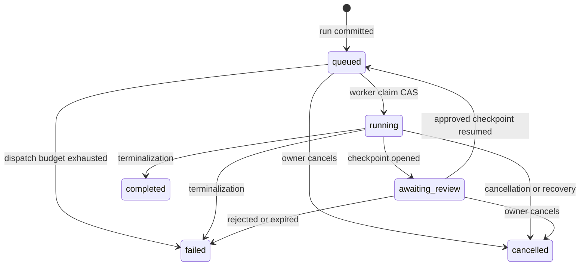

# The run lifecycle

Use this page when changing dispatch, execution, review, recovery, or
terminalization. A run always executes one immutable published version.

## Run states

| Status | Meaning |
| --- | --- |
| `queued` | Committed and waiting for a platform execution worker. Dispatch may be pending, accepted, outcome-unknown, or exhausted. |
| `running` | Claimed by the worker for the current revision. Duplicate deliveries lose the compare-and-swap claim. |
| `awaiting_review` | Execution is paused at one active review checkpoint. |
| `completed` | Every required step and review completed successfully. |
| `failed` | A typed terminal failure was recorded. |
| `cancelled` | The run was cancelled through the lifecycle owner. |

`completed`, `failed`, and `cancelled` are terminal. A new attempt never makes a
terminal run active again. To repeat work, create a new run.

## Create and dispatch

1. The API validates the published version, principal, inputs, files, capacity,
   and optimistic version.
2. The run and its input/file bindings commit as `queued`.
3. `FlowRunDispatch` claims a dispatch generation in a new transaction.
4. `PlatformFlowExecutionBackend` sends a typed task through the platform task
   runtime.
5. The platform ARQ adapter invokes `execute_flow_run_task` on the execution
   queue.

Broker acceptance is not treated as exactly-once delivery. The database keeps
the authoritative dispatch epoch, attempt count, recovery deadline, and
diagnosis. An unknown send outcome remains recoverable; duplicate workers are
rejected by status-and-revision CAS.

## Step execution and evidence

The executor resolves each published step in order. For each execution attempt
it records:

- immutable attempt-start input and resolved-input lineage;
- selected model/provider configuration;
- provider-call lifecycle and token usage;
- result payload, diagnostics, and generated files;
- current step-result projection.

Attempts are an append-only evidence ledger. They support task retries and
crash recovery, not a user-facing partial-rerun operation. Mapped inputs execute
within the same attempt contract and bounded provider-call policy.

## Review checkpoints

When a step's published review policy requires review:

1. the completed step result is captured in a revisioned checkpoint;
2. the run moves to `awaiting_review` in the same lifecycle transaction;
3. the reviewer may view, edit when allowed, approve, or reject;
4. approval plus a resume idempotency key queues the same run at its next step;
5. rejection or expiry terminalizes the run through `FlowRunTerminalizer`.

The repository owns checkpoint locks and revision CAS. The service owns
authorization and transition policy. The runtime opens/resumes checkpoints but
does not write terminal run state directly.

## Terminalization

`FlowRunTerminalizer` is the only owner of terminal run transitions. The same
transaction closes active attempts/results, cancels active checkpoints when
required, finalizes webhook intent, and writes the lifecycle audit outbox.

This atomic boundary prevents a terminal run from retaining open attempts or
missing its audit intent. Delivery of audit and webhook effects happens later
on the platform maintenance queue.

## Recovery and maintenance

The platform maintenance worker schedules five Flow jobs:

- stale-running reconciliation;
- expired-review reconciliation;
- stale-queued redispatch;
- audit-outbox delivery;
- webhook-outbox delivery.

There is no Flow-specific worker, scheduler, Celery application, or transport
setting. `eneo.worker.platform_tasks` owns ARQ registration; Flow application
and domain modules contain no ARQ imports.

## Starting again

The removed partial-rerun and invalidation APIs do not exist in the final
product. “Run again” means creating a new run from a published Flow. This keeps
the old run and its evidence immutable and makes repeated provider effects
explicit to the caller.

## Source of truth

- Statuses and capabilities: `backend/src/eneo/flows/enums.py`
- Run creation: `backend/src/eneo/flows/application/flow_run_service.py`
- Dispatch: `backend/src/eneo/flows/application/flow_dispatch.py`
- Execution task: `backend/src/eneo/flows/runtime/tasks.py`
- Executor: `backend/src/eneo/flows/runtime/executor.py`
- Review service: `backend/src/eneo/flows/application/flow_run_review_checkpoint_service.py`
- Terminalization: `backend/src/eneo/flows/application/flow_run_terminalization.py`
- Platform registration: `backend/src/eneo/worker/platform_tasks.py`
