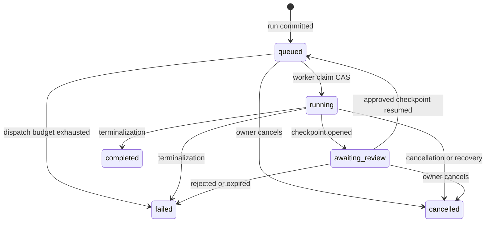

# The run lifecycle

Use this page when changing dispatch, execution, review, recovery, or
terminalization. A run always executes one immutable published version.

## Run states

| Status | Meaning |
| --- | --- |
| `queued` | Committed and waiting for a platform execution worker. Dispatch may be pending, accepted, outcome-unknown, or exhausted. |
| `running` | Claimed by the worker for the current revision. Duplicate deliveries lose the compare-and-swap claim. |
| `awaiting_review` | Execution is paused at one active review checkpoint. |
| `completed` | Every required step and review completed successfully. |
| `failed` | A typed terminal failure was recorded. |
| `cancelled` | The run was cancelled through the lifecycle owner. |

`completed`, `failed`, and `cancelled` are terminal. A new attempt never makes a
terminal run active again. To repeat work, create a new run.

## Create and dispatch

1. The API validates the published version, principal, inputs, files, capacity,
   and optimistic version.
2. The run and its input/file bindings commit as `queued`.
3. `FlowRunDispatch` claims a dispatch generation in a new transaction.
4. `PlatformFlowExecutionBackend` sends a typed task through the platform task
   runtime.
5. The platform ARQ adapter invokes `execute_flow_run_task` on the execution
   queue.

Broker acceptance is not treated as exactly-once delivery. The database keeps
the authoritative dispatch epoch, attempt count, recovery deadline, and
diagnosis. An unknown send outcome remains recoverable; duplicate workers are
rejected by status-and-revision CAS.

## Step execution and evidence

The executor resolves each published step in order. For each execution attempt
it records:

- immutable attempt-start input and resolved-input lineage;
- selected model/provider configuration;
- provider-call lifecycle and token usage;
- result payload, diagnostics, and generated files;
- current step-result projection.

Attempts are an append-only evidence ledger. They support task retries and
crash recovery, not a user-facing partial-rerun operation. Mapped inputs execute
within the same attempt contract and bounded provider-call policy.

## Review checkpoints

When a step's published review policy requires review:

1. the completed step result is captured in a revisioned checkpoint;
2. the run moves to `awaiting_review` in the same lifecycle transaction;
3. the reviewer may view, edit when allowed, approve, or reject;
4. approval plus a resume idempotency key queues the same run at its next step;
5. rejection or expiry terminalizes the run through `FlowRunTerminalizer`.

The repository owns checkpoint locks and revision CAS. The service owns
authorization and transition policy. The runtime opens/resumes checkpoints but
does not write terminal run state directly.

An approved checkpoint must be resumed within 30 days of `approved_at`. Approval
may outlive the original review submission deadline, but it no longer permits an
unbounded wait to resume. After 30 days, an approval the sweep has not yet
processed refuses resume with `flow_run_abandoned` without writing terminal
state. The maintenance sweep owns that write. After it fails the run and
cancels the checkpoint, resume returns `flow_review_cancelled`.

Automatic abandonment fails the run and cancels its approved checkpoint through
the existing system cancellation path. The checkpoint keeps `approved_at` and
the approval's `decided_by_*` fields, and the cancellation receives its own system
audit entry. This preservation applies to automatic abandonment; it does not
change how explicit user cancellation records its actor.

## Terminalization

`FlowRunTerminalizer` is the only owner of terminal run transitions. The same
transaction closes active attempts/results, cancels active checkpoints when
required, finalizes webhook intent, and writes the lifecycle audit outbox.

This atomic boundary prevents a terminal run from retaining open attempts or
missing its audit intent. Delivery of audit and webhook effects happens later
on the platform maintenance queue.

## Recovery and maintenance

Claiming a run atomically records `execution_heartbeat_at`. Each execution
worker renews its active runs every 30 seconds, using the run revision as the
ownership fence. Renewals use database time and leave `updated_at` and the
revision unchanged. A worker that loses ownership stops its invocation and
cancels in-flight provider work; three consecutive renewal failures also stop
execution.

A heartbeat expires after 180 seconds. The maintenance worker checks every
60 seconds, so recovery normally occurs about 3–4 minutes after the last
renewal. A backlog, unavailable database, or unavailable maintenance worker can
delay recovery. Health becomes unhealthy once an expired heartbeat is older
than 240 seconds. The invocation timeout does not determine worker liveness.

Recovery processes a bounded set across tenants, rechecks the heartbeat,
revision, and pending-delivery exclusion in the terminal update, and records
`flow_worker_stalled`. Its `details.recovery` object contains the typed
`reason: "execution_heartbeat_expired"`, `heartbeat_at`, and `expires_at` facts.
Open provider-call receipts become `outcome_unknown` with reason
`stale_started`. Run history is retained. A run waiting for pending outbound
delivery belongs to the delivery worker and is excluded from stalled-worker
recovery and its health signal.

The same finite sweep also handles approved reviews waiting to resume and queued
runs whose dispatch attempts are exhausted. Both have a 30-day limit, measured
from `approved_at` and `dispatch_pending_since` respectively. A backlog or an
unavailable maintenance worker can delay terminalization. Resume and redrive
refuse overdue waits even before the sweep reaches them. Review inspection
pages awaiting-review parents by creation time within the global sweep budget,
then reads checkpoints only for that page. Healthy parents advance the cursor
too; approval deadlines remain anchored at `approved_at`.

Abandonment locks the parent run and rechecks its revision, wait state, and exact
anchor timestamp in the terminal update. A competing resume, redrive, or worker
claim makes a stale candidate a no-op. The run fails with `flow_run_abandoned`;
`details.abandonment` records `wait`, `anchor_at`, `deadline`, and the review's
`checkpoint_id` when applicable. Heartbeat facts remain in `details.recovery`.

An `awaiting_review` run with no active checkpoint is reported as
`missing_review_checkpoint` and counted separately. It receives no invented
deadline and is not terminalized. Abandonment never purges history or files,
resumes a run, or replays provider work. Its error has `retryable: false` because
neither wait proves that earlier work had no external effects.

The migration initializes existing running heartbeats from `updated_at`;
older running rows can therefore be recovered on the first sweep after
cutover. Running rows require a heartbeat. During a rolling deployment, stop
old execution workers before starting the new reconciler: legacy workers
cannot renew the heartbeat field. Otherwise, expect their expired runs to be
recovered on the first sweep, even if those workers are still executing.

The platform maintenance worker schedules five Flow jobs:

- stale-running reconciliation;
- expired-review reconciliation;
- stale-queued redispatch;
- audit-outbox delivery;
- webhook-outbox delivery.

There is no Flow-specific worker, scheduler, Celery application, or transport
setting. `eneo.worker.platform_tasks` owns ARQ registration; Flow application
and domain modules contain no ARQ imports.

## Starting again

The removed partial-rerun and invalidation APIs do not exist in the final
product. “Run again” means creating a new run from a published Flow. This keeps
the old run and its evidence immutable and makes repeated provider effects
explicit to the caller.

## Source of truth

- Statuses and capabilities: `backend/src/eneo/flows/enums.py`
- Run creation: `backend/src/eneo/flows/application/flow_run_service.py`
- Dispatch: `backend/src/eneo/flows/application/flow_dispatch.py`
- Execution task: `backend/src/eneo/flows/runtime/tasks.py`
- Executor: `backend/src/eneo/flows/runtime/executor.py`
- Review service: `backend/src/eneo/flows/application/flow_run_review_checkpoint_service.py`
- Terminalization: `backend/src/eneo/flows/application/flow_run_terminalization.py`
- Platform registration: `backend/src/eneo/worker/platform_tasks.py`
