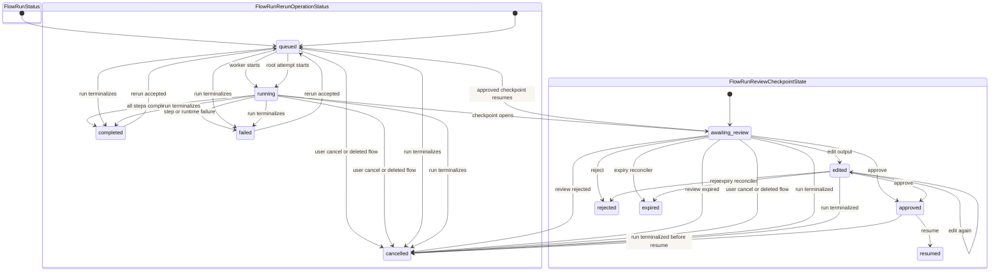
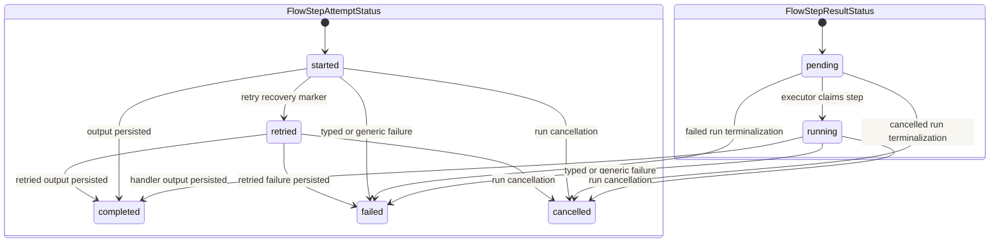
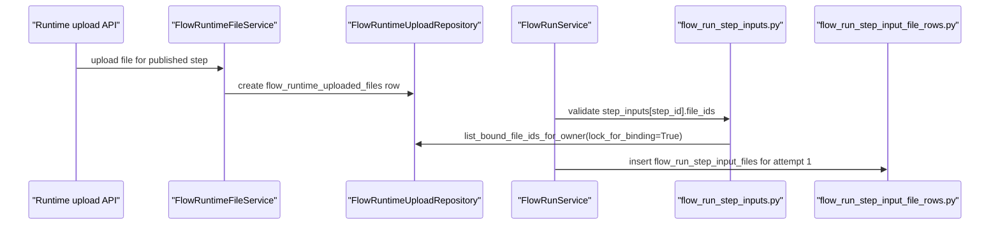
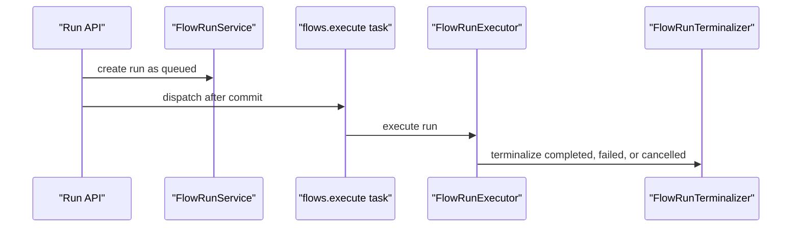
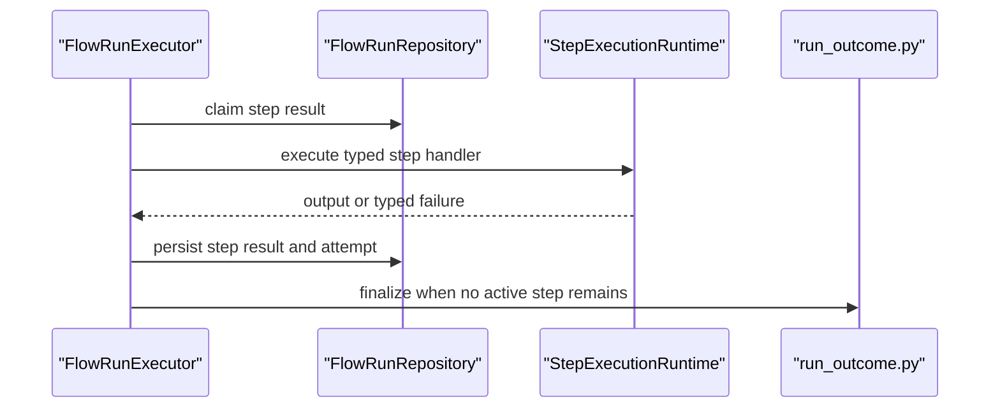
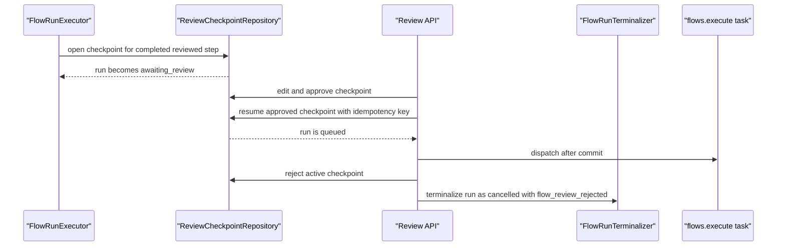
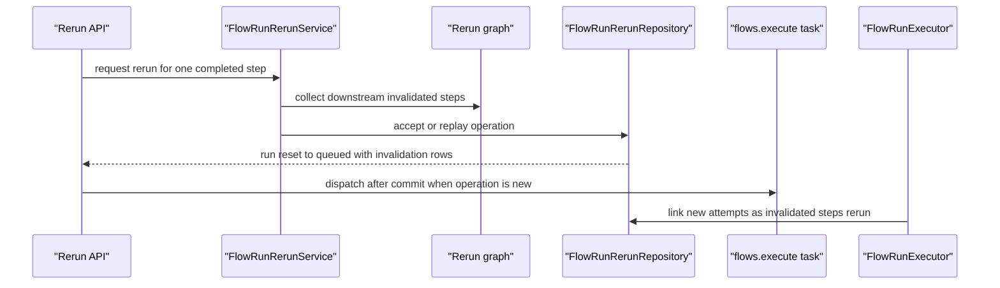

import { Cards } from "nextra/components";

# The run lifecycle

Use this page when a run pauses, reruns, fails, or needs a new status. It shows which module owns each transition before you edit code.

## State map

## Run status capabilities

| Status            | Active | Poll | Terminal | Cancellable | Awaiting review | Redispatch | Rerun eligible |
| ----------------- | ------ | ---- | -------- | ----------- | --------------- | ---------- | -------------- |
| `queued`          | yes    | yes  | no       | yes         | no              | yes        | no             |
| `running`         | yes    | yes  | no       | yes         | no              | no         | no             |
| `awaiting_review` | no     | yes  | no       | yes         | yes             | no         | no             |
| `completed`       | no     | no   | yes      | no          | no              | no         | yes            |
| `failed`          | no     | no   | yes      | no          | no              | no         | yes            |
| `cancelled`       | no     | no   | yes      | no          | no              | no         | no             |

### Run capability meanings

| Capability        | Meaning                                                        |
| ----------------- | -------------------------------------------------------------- |
| `Active`          | run occupies active execution capacity while queued or running |
| `Poll`            | API consumers should keep polling for user-visible progress    |
| `Terminal`        | runtime execution is over for this run state                   |
| `Cancellable`     | the cancel path may still transition the run                   |
| `Awaiting review` | the active review-checkpoint API is the next user action       |
| `Redispatch`      | stale queued runs may be claimed and dispatched again          |
| `Rerun eligible`  | the rerun API can accept a completed or failed run             |

## Step result states

| Status      | Active | Meaning                                                        |
| ----------- | ------ | -------------------------------------------------------------- |
| `pending`   | yes    | preseeded result waiting for its upstream inputs               |
| `running`   | yes    | executor claimed the step and is dispatching the handler       |
| `completed` | no     | handler output and result files were persisted for an attempt  |
| `failed`    | no     | typed or generic step failure was persisted and the run failed |
| `cancelled` | no     | run cancellation or terminalization closed an active result    |

## Step attempt states

| Status      | Open | Meaning                                                        |
| ----------- | ---- | -------------------------------------------------------------- |
| `started`   | yes  | attempt row was opened before handler dispatch                 |
| `retried`   | yes  | open retry-recovery state in the unfinished-attempt vocabulary |
| `failed`    | no   | attempt finished with a typed or generic error                 |
| `completed` | no   | attempt finished with persisted output                         |
| `cancelled` | no   | attempt was closed because the run was cancelled               |

## Step failure and runtime file binding

### Step failure

- `backend/src/intric/flows/runtime/executor.py` claims the step result, opens a step attempt, dispatches the handler, and handles typed or generic failures.
- Typed failures go through `_handle_typed_step_failure`; generic exceptions go through `_handle_generic_step_failure`.
- Both failure paths finish the open attempt, save a failed step result, and call `FlowRunTerminalizer` with a run error code.
- Downstream steps do not continue after a failed step because terminalization moves the run to `failed`.
- When the run fails, the terminalizer closes active `pending` or `running` step results and open attempts as failed; when the run is cancelled, it closes them as cancelled. Completed results stay unchanged.
- Attempt-start failures have no attempt number, so the executor saves the failed result with `attempt_no=None` and terminalizes the run.
- No current runtime writer sets `retried`; it is owned by the step-attempt vocabulary and open-attempt readers, which treat it as unfinished if encountered.

### Runtime upload binding

- `FlowRuntimeFileService` validates upload MIME type and size for a published runtime step before the file can be reused in a run.
- `FlowRuntimeUploadRepository` writes `flow_runtime_uploaded_files` with the flow, tenant, step, and principal owner.
- Run creation accepts `step_inputs[step_id].file_ids`; `flow_run_step_inputs.py` checks file access, limits, and existing upload binding.
- Binding validation calls `list_bound_file_ids_for_owner(..., lock_for_binding=True)` before relational `flow_run_step_input_files` rows are inserted.
- Reruns copy or replace `flow_run_step_input_files` rows for rerun attempts; there is no JSON step-input branch.

## Review checkpoint states

`Open` means a checkpoint can still receive a decision, be resumed, or be reconciled by expiry.

| State             | Open | Expires | Meaning                                                                    |
| ----------------- | ---- | ------- | -------------------------------------------------------------------------- |
| `awaiting_review` | yes  | yes     | newly opened checkpoint; review UI can edit, approve, or reject            |
| `edited`          | yes  | yes     | reviewer changed the proposed step output before deciding                  |
| `approved`        | yes  | no      | checkpoint can be resumed with an idempotency key                          |
| `rejected`        | no   | no      | terminal checkpoint decision; run is cancelled with `flow_review_rejected` |
| `resumed`         | no   | no      | decision replay is idempotent and the run has moved back to queued         |
| `cancelled`       | no   | no      | terminal checkpoint state after run terminalization or cancellation        |
| `expired`         | no   | no      | terminal checkpoint state written by `FlowReviewExpiryReconciler`          |

## Rerun operation states

| Status      | Active | Meaning                                                                        |
| ----------- | ------ | ------------------------------------------------------------------------------ |
| `queued`    | yes    | accepted operation waiting for the worker to execute the root invalidated step |
| `running`   | yes    | root rerun attempt started and downstream invalidated steps are being rebuilt  |
| `completed` | no     | run terminalized successfully while the rerun operation was active             |
| `failed`    | no     | run terminalized failed while the rerun operation was active                   |
| `cancelled` | no     | run terminalized cancelled while the rerun operation was active                |

## Golden paths

### Create and execute a run

- `backend/src/intric/flows/api/flow_run_execution_router.py` parses the request and schedules dispatch after commit.
- `backend/src/intric/flows/application/flow_run_service.py` creates the run and dispatch request.
- `backend/src/intric/flows/runtime/tasks.py` resolves the runtime actor and constructs the executor.
- `backend/src/intric/flows/infrastructure/flow_run_repo.py` writes queued to running through `mark_running_if_claimable`.
- `backend/src/intric/flows/runtime/executor.py` runs steps and hands terminal outcomes to the terminalizer.
- `backend/src/intric/flows/application/flow_run_terminalization.py` writes terminal run state.

### Step execution and handler dispatch

- `backend/src/intric/flows/runtime/executor.py` owns the step loop and failure handling.
- `backend/src/intric/flows/runtime/step_execution_runtime.py` owns handler dispatch.
- `backend/src/intric/flows/runtime/run_outcome.py` chooses the terminal run outcome from step results.

### Review checkpoint pause, decision, and resume

- `backend/src/intric/flows/runtime/executor.py` requests checkpoint opening after a reviewed step completes.
- `backend/src/intric/flows/infrastructure/flow_run_review_checkpoint_repo.py` writes checkpoint states and run await/resume transitions.
- `backend/src/intric/flows/application/flow_run_review_checkpoint_service.py` validates review API use cases.
- `backend/src/intric/flows/runtime/tasks.py` executes the queued run after resume dispatch.
- `backend/src/intric/flows/application/flow_review_expiry_reconciliation.py` expires active checkpoints and cancels the run through the terminalizer; `runtime/tasks.py` owns the `flows.reconcile_review_expiry` task.

### Rerun with invalidation

- `backend/src/intric/flows/application/flow_run_rerun_service.py` normalizes request payloads and fingerprinting.
- `backend/src/intric/flows/flow_run_rerun_graph.py` owns downstream invalidation graph construction.
- `backend/src/intric/flows/infrastructure/flow_run_rerun_repo.py` persists rerun operations and resets the run to queued.
- `backend/src/intric/flows/runtime/executor.py` links rerun invalidated steps to new attempts.

## Source guards

| Source                                                                       | Guarded lifecycle role                                                                                                         |
| ---------------------------------------------------------------------------- | ------------------------------------------------------------------------------------------------------------------------------ |
| `backend/src/intric/flows/enums.py`                                          | Run status vocabulary: run statuses, step statuses, status capabilities, review checkpoint states, and rerun operation states. |
| `backend/src/intric/flows/api/flow_run_execution_router.py`                  | Run API adapter: HTTP request parsing, authorization, response assembly, and dispatch scheduling.                              |
| `backend/src/intric/flows/application/flow_run_service.py`                   | Run service: run creation and dispatch request construction.                                                                   |
| `backend/src/intric/flows/infrastructure/flow_run_repo.py`                   | Run repository: run claim, queued-to-running transition, active step-result closure, and open-attempt closure.                 |
| `backend/src/intric/flows/runtime/tasks.py`                                  | Runtime task: worker entrypoint, actor resolution, tracing, and executor construction.                                         |
| `backend/src/intric/flows/runtime/executor.py`                               | Executor: step claim, step execution, review pause, rerun attempt linking, and finalization handoff.                           |
| `backend/src/intric/flows/application/flow_run_terminalization.py`           | Terminalizer: terminal run status writes, run error writes, active checkpoint cancellation, and active rerun closure.          |
| `backend/src/intric/flows/runtime/run_outcome.py`                            | Run outcome: final run outcome selection from current step results.                                                            |
| `backend/src/intric/flows/infrastructure/flow_run_review_checkpoint_repo.py` | Review checkpoint repository: review checkpoint persistence, state transitions, and run await/resume transitions.              |
| `backend/src/intric/flows/application/flow_run_review_checkpoint_service.py` | Review checkpoint service: review API use cases and domain-error to API-error translation.                                     |
| `backend/src/intric/flows/application/flow_review_expiry_reconciliation.py`  | Review expiry reconciler: expired review checkpoint reconciliation and run cancellation handoff.                               |
| `backend/src/intric/flows/application/flow_run_rerun_service.py`             | Rerun service: rerun request normalization, validation, fingerprinting, and command creation.                                  |
| `backend/src/intric/flows/flow_run_rerun_graph.py`                           | Rerun graph: downstream invalidation graph construction.                                                                       |
| `backend/src/intric/flows/infrastructure/flow_run_rerun_repo.py`             | Rerun repository: rerun operation persistence, invalidated-step rows, input overrides, and run reset to queued.                |
| `backend/src/intric/flows/flow_run_step_inputs.py`                           | Step input validation: runtime step input normalization, upload access validation, and binding locks.                          |
| `backend/src/intric/flows/flow_runtime_file_service.py`                      | Runtime file service: runtime upload validation and reusable upload registration.                                              |
| `backend/src/intric/flows/flow_runtime_upload_repo.py`                       | Runtime upload repository: runtime upload owner, tenant, flow, and step binding checks.                                        |
| `backend/src/intric/flows/infrastructure/flow_run_step_input_file_rows.py`   | Step input file rows: relational run step-input file row construction and insertion.                                           |
| `backend/tests/unittests/flows/test_flow_docs_site_contract.py`              | Committed lifecycle page parity, enum coverage, and source-reference drift guard.                                              |

## Related

<Cards num={2}>

<Cards.Card
  title="Key decisions"
  href="/docs/flows-for-developers/key-decisions"
  arrow
/>

<Cards.Card
  title="When things fail"
  href="/docs/flows-for-developers/when-things-fail"
  arrow
/>

</Cards>
