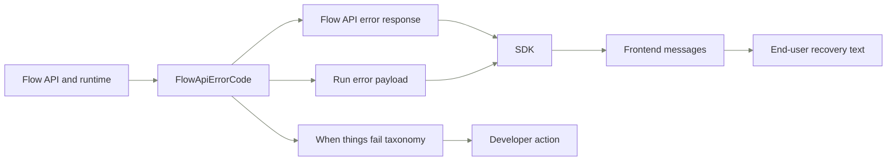

import { Cards } from "nextra/components";

# When things fail

Use this page when a Flow error reaches an API consumer or end user. It maps each code to the handling phase, source surface, and recovery action.

## Error delivery map

## How to use this page

- `API error response` means the request failed before or during the HTTP operation.
- `Run error payload` means the run reached a terminal state with a structured `run.error.code`.
- `API response and run error payload` means the same code may be seen either synchronously or after runtime terminalization.
- API consumers should poll the run, branch on `run.error.code`, and localize `flow_error_<code>`.
- `run.dispatch_last_error.retryable` means internal recovery may retry the current dispatch epoch before terminalization.
- `run.error.retryable` means a consumer may safely submit a new logical run after terminalization. Neither retryable field starts work automatically.
- For create-run backpressure, branch on HTTP `429` plus `flow_run_concurrency_limit_reached`, honor `Retry-After`, and do not branch on legacy numeric code `9007`.
- Use `/guides/flows-api-guide` for the polling, review, rerun, evidence, and artifact API paths.
- Run `make docs:regen` from the repository root after changing Flow error codes, metadata, or localization.
- End users should see the user action, not backend internals or invariant names.

## Failure triage

| Symptom                                | Start with category                | Public surface     | Next check                                                                      |
| -------------------------------------- | ---------------------------------- | ------------------ | ------------------------------------------------------------------------------- |
| Request rejected before the run starts | Run input or Flow access           | API error response | Validate request shape, tenant access, idempotency, and published version.      |
| Step failed during execution           | Step runtime or Typed input/output | Run error payload  | Open the failed step, handler diagnostics, and typed IO contract.               |
| Run stopped after queueing             | Run lifecycle                      | Run error payload  | Check worker dispatch, timeout, stalled-run recovery, and terminalization logs. |
| Review or rerun action failed          | Review checkpoint or Rerun         | API error response | Check revision, idempotency key, checkpoint state, and rerun fingerprint.       |
| Evidence or artifact cannot be read    | Evidence and artifacts             | API error response | Check permission, retention, audit reason, and listed artifact ids.             |

## Failure taxonomy

### Flow access

6 error codes

| Code                                       | Surface            | Cause                                                                       | Consumer action                                                              | User action                                                         |
| ------------------------------------------ | ------------------ | --------------------------------------------------------------------------- | ---------------------------------------------------------------------------- | ------------------------------------------------------------------- |
| `flow_not_published`                       | API error response | The caller used a runtime action before the flow had a published version.   | Publish the flow or refetch the runtime contract before retrying.            | Publish the flow, then start the run again.                         |
| `flow_deleted`                             | Run error payload  | The flow was deleted while the run was queued or executing.                 | Stop polling this run and require a restored or new flow before retrying.    | Restore or recreate the flow before starting another run.           |
| `flow_owner_required`                      | API error response | The draft mutation needs an owner, tenant admin, or space owner.            | Retry with a principal that can own or administer the draft.                 | Ask an owner or administrator to change the flow.                   |
| `flow_service_key_admin_required`          | API error response | A service key tried to read a draft definition without admin role.          | Use an admin service key or call the published runtime endpoint.             | Use an administrator service key or the published runtime contract. |
| `flow_service_key_principal_not_supported` | API error response | The endpoint requires a user principal rather than a service-key principal. | Call with a user session or choose a service-key-supported runtime endpoint. | Sign in as a user with access.                                      |
| `flow_run_access_denied`                   | API error response | The caller cannot access the requested run.                                 | Check tenant, space, service-key scope, and run ownership before retrying.   | Ask for access to the run.                                          |

### Run input

27 error codes

| Code                                        | Surface            | Cause                                                                      | Consumer action                                                               | User action                                                              |
| ------------------------------------------- | ------------------ | -------------------------------------------------------------------------- | ----------------------------------------------------------------------------- | ------------------------------------------------------------------------ |
| `flow_run_invalid_idempotency_key`          | API error response | The retry key is empty or longer than the accepted limit.                  | Send a stable idempotency key between 1 and 255 characters.                   | Retry the request with a valid retry key.                                |
| `flow_run_stale_version`                    | API error response | The published flow version changed before the run was accepted.            | Refetch the runtime contract and submit against the current version.          | Reload the flow and submit again.                                        |
| `flow_run_required_step_input_missing`      | API error response | One or more required runtime files were not attached to a step.            | Read the run contract and attach files to every required runtime-input step.  | Add the required files and start the run again.                          |
| `flow_run_runtime_input_disabled`           | API error response | A request attached files to a step that does not accept runtime input.     | Refetch the run contract and only attach files to compatible steps.           | Attach files to a step that accepts runtime files.                       |
| `flow_run_top_level_file_ids_not_supported` | API error response | The request used the removed top-level file_ids shape.                     | Send files through step_inputs keyed by runtime step id.                      | Use the current file-upload flow and try again.                          |
| `flow_run_idempotency_conflict`             | API error response | The retry key was reused with different run input.                         | Retry with the original payload or choose a new idempotency key.              | Start a new run or retry the exact original request.                     |
| `flow_run_concurrency_limit_reached`        | API error response | The tenant or flow already has too many active runs.                       | Back off and retry after another run reaches a terminal status.               | Wait for another run to finish, then try again.                          |
| `flow_run_invalid_step_inputs`              | API error response | The step_inputs payload has invalid shape or file identifiers.             | Validate step_inputs against the runtime contract before submitting.          | Check the selected files and try again.                                  |
| `flow_run_unknown_step_input`               | API error response | The request references a step id outside the published run contract.       | Refetch the runtime contract and remove stale step ids.                       | Reload the flow contract and try again.                                  |
| `flow_run_step_input_max_files_exceeded`    | API error response | A runtime-input step received more files than its policy allows.           | Limit attached files per step to the contract max_files value.                | Remove extra files and try again.                                        |
| `flow_run_file_not_accessible`              | API error response | The caller cannot read one or more selected runtime files.                 | Upload the file through the same caller context or choose an accessible file. | Upload the files again or choose files you can access.                   |
| `flow_run_file_not_bound_to_flow`           | API error response | A selected runtime file belongs to another flow.                           | Upload files through the target flow before binding them to a run.            | Upload the file through this flow and try again.                         |
| `flow_run_step_input_file_too_large`        | API error response | An attached runtime file exceeds the step size limit.                      | Check max file size in the run contract before upload or binding.             | Choose a smaller file.                                                   |
| `flow_run_step_input_mimetype_rejected`     | API error response | An attached runtime file has a MIME type the step rejects.                 | Check accepted MIME types in the run contract before upload or binding.       | Choose a compatible file type.                                           |
| `flow_run_aggregate_max_files_exceeded`     | API error response | The run exceeds the total runtime-file count allowed across steps.         | Reduce the total attached files before creating or rerunning the run.         | Remove files and try again.                                              |
| `flow_run_reserved_input_payload_key`       | API error response | The input payload used a key reserved for Flow orchestration.              | Rename caller-owned payload fields that collide with reserved keys.           | Rename the input field and try again.                                    |
| `flow_run_input_payload_too_large`          | API error response | The submitted run input payload exceeds the allowed size.                  | Reduce text, JSON fields, or file-derived payload before retrying.            | Submit less text or fewer fields.                                        |
| `flow_input_required_field_missing`         | API error response | A required form field is absent from the run input payload.                | Read the form schema and send every required field before retrying.           | Complete the required field and try again.                               |
| `flow_input_required_field_empty`           | API error response | A required form field is empty after input normalization.                  | Send a non-empty value that matches the field contract.                       | Enter a value in the required field and try again.                       |
| `flow_input_type_mismatch`                  | API error response | A form field value has a different type than its field contract.           | Send the field value using the type declared in the form schema.              | Correct the field value and try again.                                   |
| `flow_input_invalid_number`                 | API error response | A number field cannot be parsed as a finite number.                        | Send a finite integer or decimal value for the number field.                  | Enter a valid number and try again.                                      |
| `flow_input_invalid_date`                   | API error response | A date field is not a valid ISO date.                                      | Send the date in YYYY-MM-DD format.                                           | Enter a valid date and try again.                                        |
| `flow_input_invalid_option`                 | API error response | A select or multiselect field contains an option outside its contract.     | Send only options listed in the published form schema.                        | Choose one of the available options and try again.                       |
| `flow_input_invalid_multiselect_value`      | API error response | A multiselect field contains a value that is not a string.                 | Send every multiselect value as a string.                                     | Correct the selected values and try again.                               |
| `flow_input_invalid_multiselect_type`       | API error response | A multiselect field has neither an array nor comma-separated string value. | Send an array of strings or a comma-separated string.                         | Correct the selected values and try again.                               |
| `flow_runtime_file_empty`                   | API error response | The uploaded runtime file has no content.                                  | Reject empty files client-side before uploading when possible.                | Choose a file with content and upload it again.                          |
| `flow_runtime_file_attached`                | API error response | The runtime file is already attached to persisted run state.               | Do not delete files that are bound to run history.                            | Keep the file or purge the related run history through retention policy. |

### Run lifecycle

12 error codes

| Code                                    | Surface                            | Cause                                                                             | Consumer action                                                                                                         | User action                                           |
| --------------------------------------- | ---------------------------------- | --------------------------------------------------------------------------------- | ----------------------------------------------------------------------------------------------------------------------- | ----------------------------------------------------- |
| `flow_run_redispatch_conflict`          | API error response                 | The accepted dispatch-exhaustion generation is missing or changed.                | Refresh the run and retry with its current dispatch_exhausted_at value.                                                 | Refresh the run before requesting redispatch again.   |
| `flow_run_redispatch_audit_unavailable` | API error response                 | Required audit logging was unavailable, so the redispatch was not armed.          | Retry later with the same observed dispatch_exhausted_at value.                                                         | Wait and try redispatch again later.                  |
| `flow_run_cancelled`                    | Run error payload                  | The run reached cancelled before all steps completed.                             | Stop polling and create a new run only if the user still needs output.                                                  | Start a new run if you still need the result.         |
| `flow_run_user_cancelled`               | Run error payload                  | A user cancelled the run while it was active.                                     | Treat the terminal state as intentional and do not auto-retry.                                                          | Start a new run if you still need the result.         |
| `flow_dispatch_failed`                  | API response and run error payload | The run could not be queued for worker execution.                                 | Retry with backoff and alert an operator if dispatch keeps failing.                                                     | Retry the run or contact an administrator.            |
| `flow_missing_principal`                | Run error payload                  | The runtime could not resolve the principal that owns execution.                  | Check service-key ownership and tenant principal state before retrying.                                                 | Ask an administrator to check flow ownership.         |
| `flow_service_principal_disabled`       | Run error payload                  | The service principal for the run is disabled.                                    | Choose an enabled service principal or re-enable the configured one.                                                    | Ask an administrator to enable the service principal. |
| `flow_runtime_actor_invalid`            | Run error payload                  | The runtime actor resolved from the run is no longer valid.                       | Refresh service-key or owner configuration before retrying.                                                             | Ask an administrator to check execution permissions.  |
| `flow_task_timeout`                     | Run error payload                  | The worker task exceeded its execution deadline.                                  | Retry with smaller input or inspect worker capacity and timeout settings.                                               | Retry with smaller input or try again later.          |
| `flow_task_failure`                     | Run error payload                  | The worker task failed outside a more specific Flow error.                        | Inspect run logs and trace ids before retrying or escalating.                                                           | Retry the run or contact support with the run ID.     |
| `flow_worker_stalled`                   | Run error payload                  | The worker stopped updating an active run within the recovery window.             | Inspect worker and run health, then use the capability-gated rerun path or create a new run; escalate recurring stalls. | Retry or contact support with the run ID.             |
| `flow_run_error_payload_invalid`        | Run error payload                  | The stored run error payload is invalid or no longer matches the public contract. | Treat the run as failed and contact support with the run ID.                                                            | Contact support with the run ID.                      |

### Evidence and artifacts

8 error codes

| Code                                     | Surface            | Cause                                                                       | Consumer action                                                            | User action                                               |
| ---------------------------------------- | ------------------ | --------------------------------------------------------------------------- | -------------------------------------------------------------------------- | --------------------------------------------------------- |
| `flow_run_evidence_forbidden`            | API error response | The caller lacks permission to view run evidence.                           | Request evidence access with a principal allowed by run and policy checks. | Ask for permission to view run evidence.                  |
| `flow_run_evidence_raw_export_forbidden` | API error response | Policy blocks raw evidence export for this run.                             | Use the allowed evidence view or request a policy change.                  | Use the available evidence view or ask an administrator.  |
| `flow_run_artifact_not_found`            | API error response | The requested artifact is absent from the run or not visible to the caller. | Refresh run evidence and only request listed artifact ids.                 | Reload the run and choose an available artifact.          |
| `flow_run_artifact_content_unavailable`  | API error response | The artifact content was purged or is otherwise unavailable.                | Show retention-aware messaging and avoid retry loops for purged content.   | The artifact content is no longer available.              |
| `flow_audit_outbox_delivery_not_found`   | API error response | The requested lifecycle audit delivery no longer exists.                    | List dead letters again and verify the environment before retrying.        | Ask an operator to refresh the dead-letter list.          |
| `flow_audit_outbox_redrive_conflict`     | API error response | The lifecycle audit delivery state or dead-letter generation changed.       | List dead letters again and use the latest generation token.               | Ask an operator to refresh and verify the delivery state. |
| `flow_evidence_audit_logging_failed`     | API error response | Evidence access could not be audited before returning protected data.       | Retry later and alert operators if audit logging remains unavailable.      | Try again later.                                          |
| `flow_evidence_export_reason_required`   | API error response | Raw evidence export was requested without an audit reason.                  | Collect and send a specific export reason with the request.                | Enter a specific reason before exporting raw evidence.    |

### Published definition

10 error codes

| Code                                         | Surface                            | Cause                                                                       | Consumer action                                                                                                 | User action                                                                       |
| -------------------------------------------- | ---------------------------------- | --------------------------------------------------------------------------- | --------------------------------------------------------------------------------------------------------------- | --------------------------------------------------------------------------------- |
| `flow_definition_checksum_mismatch`          | API response and run error payload | The stored published snapshot no longer matches its recorded checksum.      | Do not retry the pinned version; publish a valid version, start a new run, and retain the old run for evidence. | Ask a flow editor to publish a valid version, then start a new run.               |
| `flow_definition_invalid`                    | Run error payload                  | The published flow definition failed runtime validation.                    | Block new runs until an editor fixes and republishes the flow.                                                  | Ask a flow editor to fix and republish the flow.                                  |
| `flow_definition_schema_version_missing`     | API response and run error payload | The published definition is missing its schema version.                     | Require republish through the current editor, then start a new run against the new version.                     | Ask a flow editor to republish the flow, then start a new run.                    |
| `flow_definition_schema_version_unsupported` | API response and run error payload | The published definition uses a schema version this runtime cannot execute. | Republish with the current editor or upgrade runtime support, then start a new run.                             | Ask a flow editor to republish with the current editor, then start a new run.     |
| `flow_definition_flow_id_invalid`            | API response and run error payload | The published snapshot references an invalid flow id.                       | Treat the publication as corrupt, republish a valid version, then start a new run.                              | Ask a flow editor to republish the flow, then start a new run.                    |
| `flow_definition_steps_invalid`              | API response and run error payload | The published snapshot has invalid step definitions.                        | Block the pinned version, fix and republish the steps, then start a new run.                                    | Ask a flow editor to fix and republish the steps, then start a new run.           |
| `flow_definition_no_executable_steps`        | Run error payload                  | The published snapshot contains no executable steps.                        | Prevent run creation until at least one executable step is published.                                           | Add an executable step, republish, and run again.                                 |
| `flow_assistant_snapshot_drift`              | Run error payload                  | An assistant snapshot changed relative to the published flow snapshot.      | Republish the flow so runtime dependencies match the stored snapshot.                                           | Republish the flow and start a new run.                                           |
| `flow_input_contract_inapplicable`           | API response and run error payload | A step input contract conflicts with its authored question binding.         | Remove the conflicting contract or question binding, republish the flow, then start a new run.                  | Ask a flow editor to fix the step input settings, republish, and start a new run. |
| `flow_published_form_schema_invalid`         | API error response                 | The published flow form configuration is invalid.                           | Ask an editor to fix form fields and republish before running.                                                  | Ask a flow editor to fix the form fields.                                         |

### Step runtime

4 error codes

| Code                             | Surface           | Cause                                                              | Consumer action                                                                                                                 | User action                                                   |
| -------------------------------- | ----------------- | ------------------------------------------------------------------ | ------------------------------------------------------------------------------------------------------------------------------- | ------------------------------------------------------------- |
| `flow_step_missing`              | Run error payload | The runtime referenced a step missing from the published snapshot. | Require republish and do not retry the stale run.                                                                               | Ask a flow editor to republish the flow.                      |
| `flow_step_attempt_start_failed` | Run error payload | The executor could not start the next step attempt.                | Inspect run diagnostics and retry only after transient storage issues clear.                                                    | Retry the run or contact support with the run ID.             |
| `flow_step_execution_failed`     | Run error payload | A step handler failed without a more specific typed error.         | Open step details and use the stored message to guide rerun or support.                                                         | Open the failed step, fix input or configuration, then rerun. |
| `flow_webhook_delivery_failed`   | Run error payload | The run completed but outbound webhook delivery failed.            | Read the result through run and step endpoints because delivery retries are exhausted and no public redelivery endpoint exists. | Check the webhook destination, then read the result in Eneo.  |

### Typed input/output

44 error codes

| Code                                        | Surface                            | Cause                                                                     | Consumer action                                                                               | User action                                                                                      |
| ------------------------------------------- | ---------------------------------- | ------------------------------------------------------------------------- | --------------------------------------------------------------------------------------------- | ------------------------------------------------------------------------------------------------ |
| `flow_llm_request_timeout`                  | Run error payload                  | The model request for a step exceeded the runtime timeout.                | Retry with smaller input or route the flow to a faster model.                                 | Retry with smaller input or choose a faster model.                                               |
| `flow_runtime_input_not_consumed`           | Run error payload                  | Runtime files were attached but the step input did not reference them.    | Update the authored step to consume step_input data or omit the files.                        | Ask a flow editor to connect the uploaded files to the step.                                     |
| `flow_unsupported_output_mode`              | Run error payload                  | The step uses an output mode the runtime cannot execute.                  | Change the output mode and republish before starting another run.                             | Ask a flow editor to choose a supported output mode.                                             |
| `flow_unsupported_output_type`              | Run error payload                  | The step uses an output type the runtime cannot render.                   | Choose a supported output type and republish the flow.                                        | Ask a flow editor to choose a supported output type.                                             |
| `typed_io_contract_violation`               | API response and run error payload | A submitted or generated value does not match the step output contract.   | Fix the JSON shape against the contract before saving or rerunning.                           | Fix the structured output and save again.                                                        |
| `typed_io_validation_failed`                | Run error payload                  | The step input or output failed validation without a more specific code.  | Open step diagnostics and correct the input, schema, or configuration.                        | Open the step details, fix input or configuration, and rerun.                                    |
| `typed_io_variable_resolution_failed`       | Run error payload                  | A runtime variable reference names a missing or invalid path.             | Use the precise run error to correct the variable path, then republish or rerun.              | Ask a flow editor to correct the variable reference and republish.                               |
| `typed_io_audio_invalid_file_type`          | Run error payload                  | An audio step received a file type it cannot transcribe.                  | Validate accepted audio types before upload or rerun.                                         | Upload a supported audio file and start again.                                                   |
| `typed_io_audio_missing_file`               | Run error payload                  | An audio step expected a runtime file but none was available.             | Attach the required audio file to the step before creating the run.                           | Attach the required audio file and start again.                                                  |
| `typed_io_audio_source_unsupported`         | Run error payload                  | An audio step uses an input source that runtime does not support.         | Configure the step for runtime files or a supported previous step output.                     | Ask a flow editor to change the audio input source.                                              |
| `typed_io_audio_too_many_files`             | Run error payload                  | An audio step received more files than it can process.                    | Attach exactly the allowed number of audio files before starting the run.                     | Remove extra audio files and start again.                                                        |
| `typed_io_document_source_unsupported`      | Run error payload                  | A document step uses an input source runtime cannot read.                 | Configure the document step for a supported runtime input source.                             | Ask a flow editor to change the document input source.                                           |
| `typed_io_empty_extraction`                 | Run error payload                  | Text extraction produced no readable content from the submitted file.     | Prompt the user for a readable file before rerunning.                                         | Use a file with readable content and start again.                                                |
| `typed_io_file_not_found`                   | Run error payload                  | A required runtime file could not be found during step execution.         | Upload the file again and bind it through the current run contract.                           | Upload the file again and rerun the step.                                                        |
| `typed_io_file_source_unsupported`          | Run error payload                  | A file step uses an input source runtime cannot read.                     | Configure the file step for runtime files or a supported previous output.                     | Ask a flow editor to change the file input source.                                               |
| `typed_io_http_connection_error`            | Run error payload                  | The HTTP step could not connect to the target service.                    | Check target availability, DNS, and network allow rules before rerunning.                     | Check the target service and try again.                                                          |
| `typed_io_http_invalid_config`              | Run error payload                  | The authored HTTP step configuration is invalid.                          | Fix URL, method, headers, body, authentication, or response settings.                         | Ask a flow editor to fix the HTTP step configuration.                                            |
| `typed_io_http_invalid_url`                 | Run error payload                  | The HTTP step URL is not a valid absolute http or https URL.              | Store a valid absolute URL and republish the flow.                                            | Ask a flow editor to fix the HTTP URL.                                                           |
| `typed_io_http_malformed_response`          | Run error payload                  | The HTTP response could not be parsed into the expected format.           | Adjust the endpoint response or the step response parser settings.                            | Ask a flow editor to check the HTTP response format.                                             |
| `typed_io_http_non_success`                 | Run error payload                  | The HTTP step received a non-success status code.                         | Handle the upstream status or change the target endpoint behavior.                            | Check the target endpoint and try again.                                                         |
| `typed_io_http_response_too_large`          | Run error payload                  | The HTTP response exceeded the step response-size limit.                  | Request less data or expose a narrower endpoint for the flow.                                 | Ask a flow editor to reduce the HTTP response size.                                              |
| `typed_io_http_ssrf_blocked`                | Run error payload                  | The HTTP URL was blocked by network safety rules.                         | Use an allowed public endpoint or request an administrator policy review.                     | Use an allowed endpoint or ask an administrator.                                                 |
| `typed_io_http_timeout`                     | Run error payload                  | The HTTP request exceeded the step timeout.                               | Reduce the request scope or increase upstream responsiveness before rerun.                    | Try again later or ask a flow editor to reduce the request.                                      |
| `typed_io_input_exceeds_model_window`       | Run error payload                  | The packaged step input exceeds the selected model context window.        | Use a larger-context model, split the source document, or reduce the step input before rerun. | Use a smaller source, split the document, or ask a flow editor to choose a larger-context model. |
| `typed_io_input_too_large`                  | Run error payload                  | The step input exceeds the runtime processing limit.                      | Reduce text, files, extracted content, or prompt context before rerun.                        | Submit smaller input and try again.                                                              |
| `typed_io_invalid_file_type`                | Run error payload                  | A runtime file has a type unsupported by the step.                        | Validate file type against the step contract before upload or rerun.                          | Upload a compatible file and start again.                                                        |
| `typed_io_invalid_input_source_combination` | Run error payload                  | The step combines input sources that cannot run together.                 | Change the step input-source settings and republish.                                          | Ask a flow editor to fix the input sources.                                                      |
| `typed_io_invalid_input_source_position`    | Run error payload                  | The step reads from a prior step position that cannot supply the input.   | Reorder or reconfigure the flow before republishing.                                          | Ask a flow editor to fix the step order or input source.                                         |
| `typed_io_invalid_json_input`               | Run error payload                  | The step expected JSON but received invalid JSON input.                   | Validate the JSON value before rerunning the step.                                            | Fix the JSON input and try again.                                                                |
| `typed_io_invalid_output_mode_combination`  | Run error payload                  | The output mode conflicts with the current step input or output settings. | Change the output mode combination and republish the flow.                                    | Ask a flow editor to adjust the output settings.                                                 |
| `typed_io_invalid_schema`                   | Run error payload                  | The step output schema is invalid.                                        | Fix the JSON schema and republish before rerunning.                                           | Ask a flow editor to fix the output schema.                                                      |
| `typed_io_missing_required_files`           | Run error payload                  | A typed runtime step did not receive required files.                      | Attach required files according to the step contract before rerun.                            | Attach the required files and start again.                                                       |
| `typed_io_output_parse_failed`              | Run error payload                  | The model output could not be parsed into the expected JSON shape.        | Adjust prompt or schema, then rerun the failed step.                                          | Ask a flow editor to adjust the prompt or schema.                                                |
| `typed_io_render_failed`                    | Run error payload                  | The generated document or rich output could not be rendered.              | Inspect output content and document settings before rerunning.                                | Ask a flow editor to check output formatting.                                                    |
| `typed_io_template_checksum_mismatch`       | Run error payload                  | The DOCX template changed after the flow was published.                   | Republish the flow with the current template before rerunning.                                | Republish the flow with the current template.                                                    |
| `typed_io_template_render_failed`           | Run error payload                  | The DOCX template could not be rendered with the step output.             | Check placeholders and referenced step outputs before rerunning.                              | Ask a flow editor to fix the template placeholders.                                              |
| `typed_io_transcript_too_large`             | Run error payload                  | The audio transcript is too large for the step.                           | Use shorter audio or split the task into smaller runs.                                        | Use a shorter recording or split the audio.                                                      |
| `typed_io_transcription_config_invalid`     | Run error payload                  | The transcription step has invalid language or model settings.            | Fix transcription settings and republish before rerunning.                                    | Ask a flow editor to fix transcription settings.                                                 |
| `typed_io_transcription_empty`              | Run error payload                  | Transcription completed but produced no text.                             | Ask for audio with clear speech before rerunning.                                             | Use an audio file with speech and start again.                                                   |
| `typed_io_transcription_failed`             | Run error payload                  | The transcription provider failed while processing audio.                 | Retry after checking audio quality and provider availability.                                 | Check the audio quality and try again.                                                           |
| `typed_io_transcription_model_missing`      | Run error payload                  | The transcription step has no configured model.                           | Choose an available transcription model and republish.                                        | Ask a flow editor to choose a transcription model.                                               |
| `typed_io_transcription_model_unavailable`  | Run error payload                  | The configured transcription model is unavailable.                        | Choose another model or retry after provider recovery.                                        | Choose another model or try again later.                                                         |
| `typed_io_transcription_not_enabled`        | Run error payload                  | Transcription is disabled for the tenant or step.                         | Enable transcription or change the step input type before republish.                          | Enable transcription or ask a flow editor to change the step.                                    |
| `typed_io_unsupported_type`                 | Run error payload                  | The step uses an input type runtime cannot execute.                       | Change the input type and republish the flow.                                                 | Ask a flow editor to choose a supported input type.                                              |

### Review checkpoint

16 error codes

| Code                                                     | Surface                            | Cause                                                                        | Consumer action                                                                         | User action                                                               |
| -------------------------------------------------------- | ---------------------------------- | ---------------------------------------------------------------------------- | --------------------------------------------------------------------------------------- | ------------------------------------------------------------------------- |
| `flow_review_policy_invalid`                             | API response and run error payload | A reviewed step has an invalid review policy.                                | Fix the review policy on the executable step, republish the flow, then start a new run. | Ask a flow editor to fix review settings, republish, and start a new run. |
| `flow_review_stale_revision`                             | API error response                 | The checkpoint changed after the caller loaded it.                           | Refetch the checkpoint and retry with the latest revision.                              | Reload the review and try again.                                          |
| `flow_review_expired`                                    | API response and run error payload | The checkpoint deadline passed before the review finished.                   | Refetch the run and stop attempting review actions on the expired checkpoint.           | Reload the run because the review deadline passed.                        |
| `flow_review_not_active`                                 | API error response                 | The checkpoint is no longer in a state that accepts this action.             | Reload the run and branch on the latest checkpoint state.                               | Reload the run before continuing.                                         |
| `flow_review_step_result_not_found`                      | API error response                 | The step result linked to the checkpoint is no longer available.             | Reload evidence and avoid editing or approving a missing result.                        | Reload the run and try again.                                             |
| `flow_review_checkpoint_not_found`                       | API error response                 | The requested review checkpoint id does not exist for the run.               | Refetch run review links and use a current checkpoint id.                               | Reload the run and try again.                                             |
| `flow_review_reject_reason_required`                     | API error response                 | The reject request did not include a non-empty reason.                       | Require a review rejection reason before submitting.                                    | Enter a reason before rejecting the review.                               |
| `flow_review_reject_reason_too_long`                     | API error response                 | The rejection reason exceeded the accepted length.                           | Truncate or ask the user to shorten the reject reason.                                  | Shorten the rejection reason and try again.                               |
| `flow_review_idempotency_key_required`                   | API error response                 | The resume request did not include an idempotency key.                       | Generate a stable retry key for each resume request.                                    | Reload the run and try again.                                             |
| `flow_review_not_approved`                               | API error response                 | The checkpoint has not been approved and cannot resume.                      | Submit approve before resume, then retry resume with a retry key.                       | Approve the review before resuming.                                       |
| `flow_review_already_resumed`                            | API error response                 | The approved checkpoint was already resumed.                                 | Treat duplicate resume as completed and reload the run status.                          | Reload the run to see the latest status.                                  |
| `flow_review_rejected`                                   | API response and run error payload | The checkpoint was rejected and the run cannot continue.                     | Stop resume attempts and show the rejection reason if available.                        | The review was rejected and the run cannot resume.                        |
| `flow_review_cancelled`                                  | API error response                 | The checkpoint was cancelled by run terminalization or cancellation.         | Reload the run and stop actions against the cancelled checkpoint.                       | Reload the run before continuing.                                         |
| `flow_review_open_active_conflict_invariant`             | Run error payload                  | The run already had an active checkpoint when runtime tried to open another. | Reload the run and escalate with the run ID if the conflict remains.                    | Reload the run and contact support if the problem remains.                |
| `flow_review_open_step_result_incomplete_invariant`      | Run error payload                  | Runtime tried to open review before the step result was complete.            | Reload the run and escalate with the run ID if the state remains invalid.               | Reload the run and contact support if the problem remains.                |
| `flow_review_open_multiple_active_checkpoints_invariant` | Run error payload                  | The run had multiple active checkpoints during review opening.               | Reload the run and escalate with the run ID if multiple active rows remain.             | Reload the run and contact support if the problem remains.                |

### Template asset

9 error codes

| Code                                   | Surface            | Cause                                                               | Consumer action                                                        | User action                                                          |
| -------------------------------------- | ------------------ | ------------------------------------------------------------------- | ---------------------------------------------------------------------- | -------------------------------------------------------------------- |
| `flow_template_invalid_archive`        | API error response | The uploaded file is not a valid DOCX archive.                      | Validate DOCX archives before upload when possible.                    | Choose a valid DOCX file and try again.                              |
| `flow_template_corrupted_archive`      | API error response | The DOCX archive appears corrupted.                                 | Ask the user to reopen and resave the file before upload.              | Open and save the file again in Word, then retry.                    |
| `flow_template_macro_not_allowed`      | API error response | The uploaded template is macro-enabled and not allowed.             | Accept only non-macro DOCX templates for Flow templates.               | Save the file as DOCX without macros and try again.                  |
| `flow_template_missing_required_parts` | API error response | The DOCX file lacks required document parts.                        | Reject the file and ask for a complete Word document template.         | Choose a complete DOCX template and try again.                       |
| `flow_template_not_accessible`         | API error response | The template file is not accessible to the caller or runtime actor. | Use a template stored in the flow or space with the right permissions. | Choose a template you can access.                                    |
| `flow_template_read_only`              | API error response | The caller can run the flow but cannot replace its template.        | Hide template replacement for read-only callers.                       | Ask a flow editor to change the template.                            |
| `flow_template_unsupported_extension`  | API error response | The uploaded template file extension is not supported.              | Allow only DOCX files for template upload.                             | Choose a DOCX file and try again.                                    |
| `flow_template_missing_content`        | API error response | The selected template record has no readable binary content.        | Ask for a new upload or restore the template file content.             | Choose or upload the template again.                                 |
| `flow_template_in_use`                 | API error response | A published flow definition still references the template asset.    | Keep the template asset available while published versions can use it. | Unpublish or replace the published flow template before deleting it. |

### Rerun

9 error codes

| Code                                                  | Surface            | Cause                                                                           | Consumer action                                                                   | User action                                                |
| ----------------------------------------------------- | ------------------ | ------------------------------------------------------------------------------- | --------------------------------------------------------------------------------- | ---------------------------------------------------------- |
| `flow_run_rerun_reason_required`                      | API error response | The rerun request did not include a non-empty reason.                           | Require a reason before submitting a rerun request.                               | Enter a reason before rerunning the step.                  |
| `flow_run_rerun_reason_too_long`                      | API error response | The rerun reason exceeded the accepted length.                                  | Truncate or ask the user to shorten the rerun reason.                             | Shorten the rerun reason and try again.                    |
| `flow_run_rerun_stale_revision`                       | API error response | The run changed after the caller loaded it.                                     | Refetch the run and submit rerun against the latest revision.                     | Reload the run and try rerun again.                        |
| `flow_run_rerun_invalid_transition`                   | API error response | The run status cannot accept a step rerun.                                      | Check status capabilities before showing or submitting rerun.                     | Reload the run before trying again.                        |
| `flow_run_rerun_step_not_found`                       | API error response | The selected rerun step is absent from the published snapshot.                  | Refetch run steps and only offer rerun for current step ids.                      | Reload the run and choose an available step.               |
| `flow_run_rerun_step_incomplete`                      | API error response | The selected rerun step or dependency does not have a completed current result. | Offer rerun only for completed current step results.                              | Choose a completed step and try again.                     |
| `flow_run_rerun_step_inputs_invalid`                  | API error response | Rerun file overrides targeted a step other than the rerun root.                 | Attach rerun files only to the step being rerun.                                  | Remove files from other steps and try again.               |
| `flow_run_rerun_multiple_active_operations_invariant` | Run error payload  | The run had multiple active rerun operations during execution.                  | Reload the run and escalate with the run ID if multiple active operations remain. | Reload the run and contact support if the problem remains. |
| `flow_run_rerun_attempt_lineage_conflict_invariant`   | Run error payload  | The rerun attempt history conflicted with an existing invalidated-step link.    | Reload the run and escalate with the run ID if lineage remains inconsistent.      | Reload the run and contact support if the problem remains. |

## Source guards

| Source                                                                               | Guard                                                           |
| ------------------------------------------------------------------------------------ | --------------------------------------------------------------- |
| `backend/src/eneo/flows/flow_api_error_code.py`                                      | Every `FlowApiErrorCode` value must have one taxonomy entry.    |
| `backend/src/eneo/flows/flow_error_taxonomy.py`                                      | Every taxonomy entry must stay short, categorized, and typed.   |
| `frontend/apps/web/messages/en.json`                                                 | Every code must have a `flow_error_*` English localization key. |
| `frontend/apps/docs-site/src/content/docs/flows-for-developers/when-things-fail.mdx` | The committed page must equal regenerated output.               |

## Related

<Cards num={2}>

<Cards.Card
  title="The run lifecycle"
  href="/docs/flows-for-developers/run-lifecycle"
  arrow
/>

<Cards.Card
  title="Key decisions"
  href="/docs/flows-for-developers/key-decisions"
  arrow
/>

</Cards>
