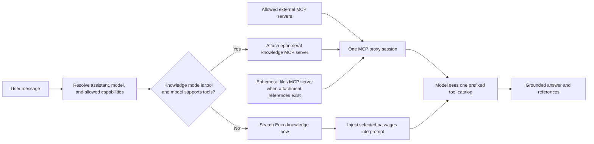
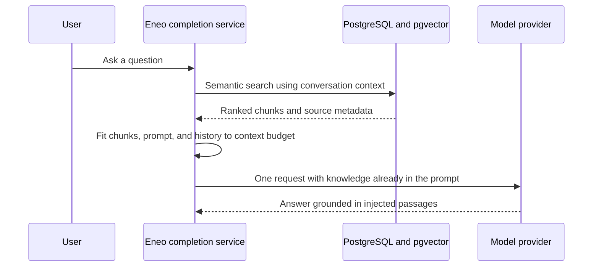
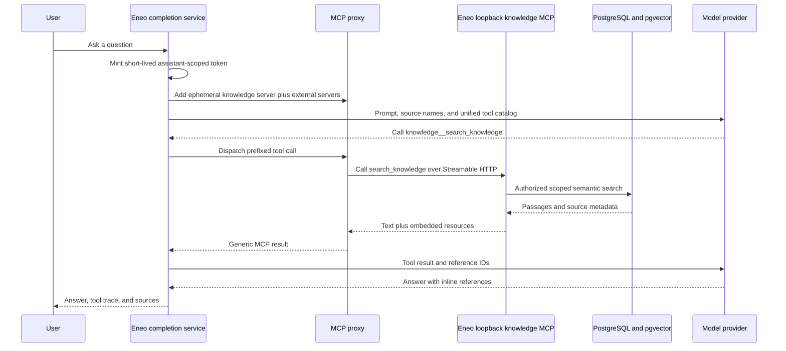

# Knowledge Retrieval and MCP Interoperability

Eneo has two ways to give a model access to an assistant's knowledge: retrieve
passages before the model runs and inject them into its prompt, or let a
tool-capable model retrieve knowledge on demand. The on-demand path uses Eneo's
built-in, loopback Model Context Protocol (MCP) server. That server and
administrator-configured external MCP servers then travel through the same
proxy, naming, execution, result, and citation pipeline.

import { Callout } from "nextra/components";

<Callout type="info">
  This page is the engineering reference for how the pieces fit together. For
  administrator-facing setup and tool-catalog approval, see [MCP
  Servers](/guides/mcp-servers). For knowledge ingestion, see [Document
  Processing](/guides/document-processing).
</Callout>

## The short version

The setting on an assistant is `knowledge_mode`, with two values:

| Stored mode | Runtime behavior |
| --- | --- |
| `inject` | Eneo searches attached knowledge on every turn, selects passages, and puts them into the model prompt before generation starts. |
| `tool` | Eneo exposes built-in knowledge tools. The model decides when to search, how to phrase each query, whether to narrow the scope, and whether to read a whole document. |

`tool` is conditional, not absolute. If the effective completion model does not
support tool calling, Eneo automatically uses the injected path for that turn.
An assistant therefore remains usable when a model is changed to one without
tool support.

The built-in knowledge server is called **loopback** because the Eneo backend
hosts its Streamable HTTP endpoint and also connects to that endpoint as an MCP
client during a completion. This is an intentional adapter around Eneo's own
authorized services; it is not a second knowledge store and it does not send
knowledge to a separate internal database.



## Keep four concepts separate

Several things are called "knowledge" or "integration" in normal conversation,
but they have different roles in the architecture.

| Concept | What it is | What it is not |
| --- | --- | --- |
| **Knowledge source** | A collection, website, or integration knowledge source attached to an assistant and indexed for retrieval. | An MCP server merely because its content came from an integration. |
| **Injected retrieval** | A backend search performed before the model is called. | A tool call or an MCP exchange. |
| **Internal/loopback MCP server** | A built-in Eneo Streamable HTTP endpoint, attached ephemerally to a completion and backed by Eneo services. | An administrator-created catalog record or a separate deployment. |
| **External MCP server** | A tenant-scoped Streamable HTTP service configured by an administrator and selected through organization, space, assistant, and conversation controls. | Automatically trusted because it uses MCP. |

An integration knowledge source is normalized into the same searchable
knowledge abstraction as collections and websites. It is searched by injected
retrieval or by the built-in knowledge MCP tools. An external MCP server is a
live tool provider. The two can coexist, but attaching one does not implicitly
attach the other.

## Inject mode

Inject mode is Eneo's original retrieval-augmented generation path and the
compatibility path for models without tool calling.

### Turn lifecycle

1. Eneo combines the current question with the preceding question-and-answer
   history to form the semantic search input.
2. It searches every knowledge source attached to the assistant: collections,
   websites, and integration knowledge.
3. The configured embedding model is selected from the attached sources and
   used for semantic search.
4. Retrieved chunks are admitted to the prompt within a bounded knowledge
   share of the model context window. Conversation history is reduced as needed
   to leave room for those chunks.
5. The model receives the selected text before it starts answering. The
   retrieved documents are also retained as answer references.



The search happens even for a greeting or a follow-up that does not need
knowledge. Conversely, it happens only once before generation: the model cannot
rephrase a weak query, split a multi-part question into several searches, or
open the rest of a document during that turn.

### Retrieval versions and relevance

The legacy retrieval version asks for up to 30 chunks and uses autocut to trim
the low-relevance tail. The newer path derives a candidate count from the
model's input window and then fits results into the prompt budget. Deployments
may set `INJECT_KNOWLEDGE_MIN_SCORE` to discard injected chunks below a cosine
similarity threshold. It is unset by default because score distributions vary
between embedding models.

<Callout type="warning">
  Treat a similarity threshold as embedding-model-specific configuration. A
  value calibrated for one model can remove useful passages or admit noise when
  used with another.
</Callout>

### When inject mode is a good fit

- The selected model cannot call tools.
- Every turn should get one predictable retrieval pass.
- The model or provider has unreliable tool-use behavior.
- Latency predictability matters more than iterative retrieval.
- The assistant has a small, focused corpus and questions are usually direct.

Its main cost is eager context use: passages are added before Eneo knows whether
the model needs them. Large retrieved contexts also leave less room for
conversation history and instructions.

## Tool mode

Tool mode moves retrieval control into the model's reasoning loop. Eneo puts a
short catalog of the assistant's source names into the prompt, but keeps source
content behind four built-in tools:

| Model-facing tool | Purpose |
| --- | --- |
| `knowledge__search_knowledge` | Semantic passage search across all knowledge, one source, or one document. |
| `knowledge__read_source` | Read a complete source document in bounded pages after a search result identifies it. |
| `knowledge__describe_source` | Survey what one source contains using document titles and representative excerpts, without inventing a semantic query. |
| `knowledge__list_knowledge_sources` | List collections, websites, and integration knowledge attached to the assistant, including stable source IDs. |

The `knowledge__` prefix is added by the shared MCP proxy. The unprefixed MCP
tool names are `search_knowledge`, `read_source`, `describe_source`, and
`list_knowledge_sources`.

### Search strategies

`search_knowledge` supports two explicit strategies:

| Strategy | Behavior | Typical question |
| --- | --- | --- |
| `specific` | Fetch a small candidate set, apply an autocut, keep a high-precision result set, and expand the best match with its neighboring document chunks. | "When does the recycling center open?" |
| `overview` | Over-fetch, diversify results across documents, and cap passages per document so one document does not dominate. | "Explain the municipality's approach to continuity planning." |

A specific search additionally returns the chunks immediately before and after
the highest-ranked match, read from the same active document version. These
neighbors restore context that chunking removed, such as the table header above
a matched row or the sentence that introduces a matched list. Semantic matches
keep their similarity `score`; a contextual neighbor instead carries a
`context_for_chunk` marker naming the anchor chunk it supports, so the model
never sees an artificial relevance score. Overview searches are not expanded.

The model can pass `within` with a source ID from
`list_knowledge_sources` or a document ID from an earlier result. This narrows
the same search machinery to one source or document. Within a document,
results are returned in reading order rather than relevance order.

For "what does this source contain?" questions, semantic search is the wrong
operation because there is no content query to embed. `describe_source` pages
through document titles and includes a thin sample of excerpts. The model is
instructed to finish the title listing before making a claim about the source's
coverage.

### Turn lifecycle

1. Eneo checks that the assistant is in `tool` mode, has at least one knowledge
   source, and the effective model supports tool calling.
2. It mints one short-lived, assistant-scoped bearer token for the completion.
3. It creates an ephemeral in-memory `MCPServer` representation of the built-in
   knowledge endpoint and derives its tool definitions directly from the
   built-in FastMCP application.
4. The knowledge server is prepended to the external server list and enters the
   normal MCP proxy.
5. Eneo sends the prefixed tool definitions and a small source catalog to the
   model. No knowledge chunks are retrieved yet.
6. The model calls one or more knowledge tools. Eneo sends their results back
   into the same model turn and continues the tool loop.
7. Search results are MCP embedded resources. Eneo captures them through the
   generic MCP-reference pipeline so the final answer can cite them.



### Bounds and context safety

The knowledge tools are deliberately paged and capped:

- a search call cannot return more than 20 semantically ranked chunks;
- specific search normally returns at most 6 semantic matches, plus up to two
  adjacent context chunks around the best match, bounding default output at 8
  chunks;
- overview search normally returns at most 15 diversified chunks;
- full documents, source descriptions, and attached files use offsets for
  continuation;
- each MCP result is also subject to the proxy's character limit;
- across a turn, tool results share an aggregate admission budget based on the
  same context-window share reserved for injected knowledge.

When the aggregate budget is exhausted, later results are replaced with an
explicit instruction to stop calling tools and answer from the information
already gathered. These layers prevent one call or a tool-happy model from
silently overflowing the provider context window.

### When tool mode is a good fit

- Questions are multi-part and benefit from several focused searches.
- The model should retry with different wording after a weak result.
- Users ask for broad corpus overviews as well as precise facts.
- The model sometimes needs a whole policy, procedure, or table after finding a
  relevant passage.
- Conserving context on turns unrelated to knowledge matters.

Tool mode depends more heavily on the model's ability to choose tools and obey
retrieval instructions. It can also add several model and HTTP round trips to a
single user turn.

## What "loopback MCP" means

Eneo registers built-in FastMCP applications under these backend routes:

```text
/internal-mcp/knowledge/mcp
/internal-mcp/files/mcp
```

During a completion, `INTERNAL_MCP_BASE_URL` is combined with one of those
paths. The backend then connects through its ordinary Streamable HTTP MCP
client, even though the destination is the same application deployment.

This apparently circular route provides a useful architectural property: after
attachment, an internal capability and an external MCP server use one
integration boundary. The completion adapter does not need separate execution
logic for "RAG tools" and "MCP tools." Prefixing, parallel calls, tool result
conversion, UI metadata, reference capture, output limits, retries, and cleanup
are shared.

<Callout type="info">
  Loopback describes the network path, not the authorization model. Every
  internal tool call still authenticates a bearer token and reconstructs a
  normal user-bound service container before reading data.
</Callout>

### Ephemeral client-side representation, permanent server-side route

The mounted HTTP applications live for the backend process lifetime. The
`MCPServer` entity added to a particular completion does not:

- it gets a new ID for that completion;
- it is never written to the MCP server catalog;
- its tool definitions come from the built-in FastMCP application;
- it carries that completion's short-lived bearer token;
- it is discarded when the request finishes.

The internal FastMCP applications use stateless HTTP. They do not assign an MCP
protocol session ID, so Eneo's per-conversation MCP session persistence
naturally has nothing to store for them. Any healthy backend worker can serve a
loopback call.

### Internal authentication and scope

The short-lived token authenticates the acting user and carries an
`assistant_id` claim. A built-in tool does not accept an assistant ID as a model
argument. Instead, it reads the fixed claim, authenticates the user, builds the
normal dependency-injection graph for that user, and loads the assistant through
the ordinary authorization services.

This design prevents a model from changing an argument to search another
assistant. Knowledge queries remain limited to the sources attached to the
token's assistant. Missing and inaccessible documents return the same response
so the tool does not become an existence oracle. Tenant checks also apply when
the files tool resolves an attachment.

### Attachment loopback server

The second built-in server, `files`, exposes `files__read_file`. It is attached
when the effective model supports tools and the conversation contains files for
which Eneo renders signed download-reference entries.

The model receives a reference object containing the filename, media type,
size, and URL. The built-in reader treats the URL as a signed capability handle:
it verifies the token, authorizes the file, and loads already-extracted text
from Eneo's durable content path. It does **not** fetch the URL over HTTP.

This matters in two cases:

- when attachment text is also inline, the reader can page through text that
  did not fit comfortably in the active reasoning context;
- when `inline_file_text` is disabled, the reference and reader provide the
  model's built-in path to the file text without eagerly placing it in the
  prompt.

Image files still reach vision-capable models as images. Audio references report
that their transcription, when available, is already represented in the
conversation.

## Internal and external MCP servers use one proxy

After availability and policy have been resolved, the proxy receives one
ordered list:

```text
[built-in knowledge, built-in files, allowed external server 1, ...]
```

Only servers that are actually needed are included. The knowledge server
requires tool mode plus attached knowledge. The files server requires attachment
references. External servers must survive the organization, space, assistant,
governance, per-message, and enabled-state filters.

### Comparison

| Property | Internal loopback MCP | External MCP |
| --- | --- | --- |
| Endpoint owner | Eneo backend | Another configured service |
| Catalog record | Ephemeral, never persisted | Persistent, tenant-scoped |
| Tool definitions | Derived from trusted built-in code | Synced, stored, and admin-approved |
| Credentials | Short-lived user and assistant-scoped bearer token | Configured public or encrypted bearer authentication |
| User identity | Encoded in Eneo's scoped token | Optional `X-Eneo-*` forwarding, off by default |
| Availability | Derived automatically from the current assistant, model, and files | Selected through admin, space, assistant/governance, and conversation controls |
| Per-call user approval | Always auto-approved because tools are read-only core capabilities | Controlled by the conversation's tool-approval setting |
| MCP protocol state | Stateless | Stateless or resumed per conversation and server |
| Circuit-breaker persistence | Throwaway server IDs mean failures remain request-local | Failures accumulate against the persistent server ID until cooldown |

### Naming and collision handling

Every exposed tool gets a model-facing name in this form:

```text
sanitized-lowercase-server-name__sanitized-tool-name
```

Examples are `knowledge__search_knowledge`, `files__read_file`, and
`ticketing__create_issue`. Prefixes allow different servers to expose an
unprefixed tool with the same name without ambiguity.

Server and tool names are sanitized to the function-name character set. If two
configured combinations collapse to the same prefixed name, the first
registered tool wins and the later one is skipped with a warning. Internal
servers are prepended, so the built-in tool wins an exact prefixed-name
collision. The knowledge prompt also tells the model to prefer the built-in
knowledge tools over similarly described tools when a question could be
answered from the assistant's attached knowledge.

This is precedence, not exclusivity. A single answer may legitimately combine:

- built-in knowledge for organizational policy;
- an external MCP tool for current operational state;
- another external tool for an action such as creating a ticket.

The model is instructed to attribute information from the appropriate tool and
not represent an external result as if it came from attached knowledge.

### Lazy connections and parallel execution

The proxy builds the initial model-facing registry from approved definitions
without opening every server connection. It connects lazily when the model
first calls a tool on a server and reuses that connection for later calls in
the same completion. Before parallel tool calls run, required connections are
opened on the proxy's owner task; the independent calls can then execute in
parallel safely.

When a progressive-discovery server advertises `tools.listChanged`, Eneo can
re-list after activation calls. It still intersects the live list with the
administrator-approved catalog. A remotely introduced or changed definition
does not become callable merely because it appeared mid-conversation.

## Two different kinds of approval

"Tool approval" can refer to two separate controls.

### Catalog approval

Catalog approval is an administrator trust decision about what an external
server is allowed to describe to the model. New tools and changed descriptions
or input schemas are staged for review. Until approval:

- a new tool is hidden;
- an existing tool keeps its previous approved definition;
- a live server cannot replace an approved schema in the current request.

Internal tools do not enter this workflow because their definitions are built
from the deployed Eneo code for each completion and are not remote catalog
input.

### Per-call user approval

Per-call approval happens after the model chooses an external tool. When the
conversation requires approval, Eneo pauses execution and asks the user to
approve or deny the proposed external calls. Built-in `knowledge` and `files`
calls bypass this prompt: they are read-only Eneo capabilities whose scope is
already fixed by the authenticated completion.

An external tool can still be read-only, but Eneo does not infer safety from
its name or description. It remains subject to the external approval policy.

## How attachment references interoperate with external MCP

Signed attachment references are deliberately useful beyond
`files__read_file`. A model can pass the same URL to an external MCP tool that
accepts a URL—for example, a spreadsheet analyzer or large-document service.
In that case:

1. Eneo mints a short-lived original-download reference.
2. The external MCP server receives the URL as a normal tool argument.
3. That server must be able to reach `FILE_REFERENCE_BASE_URL` and download the
   original before the reference expires.
4. The external server applies its own processing and returns an MCP result.

The built-in files server remains the authorized raw-text fallback. If another
tool fails while its arguments contain an Eneo reference URL, the proxy appends
a hint telling the model to retry the same URL with `files__read_file` instead
of repeatedly calling the failed service.

<Callout type="warning">
  Passing a reference URL to an external MCP server is data egress. The URL is
  short-lived and signed, but the remote service receives the file bytes if it
  redeems it. Enable only servers appropriate for the space's classification
  and the intended data handling.
</Callout>

`FILE_REFERENCE_BASE_URL` and `INTERNAL_MCP_BASE_URL` solve different routing
problems. The former must be reachable by URL-consuming tools that need file
bytes. The latter must be reachable by Eneo's own backend so it can call its
built-in MCP routes.

## Session state and conversation replay

External MCP servers may assign an `Mcp-Session-Id`. Eneo stores that ID per
Eneo conversation and external server, resumes it on later turns, and attempts
to terminate it when the conversation is deleted. A new HTTP transport can
therefore continue the same logical remote session.

Internal loopback servers are stateless, but their calls are still persisted in
the conversation's tool trace. Tool metadata records the exact prefixed name,
arguments, result status, and result text needed to replay prior tool use to the
model. MCP resource blocks are captured generically, regardless of whether the
provider was internal or external.

The distinction is:

| State | Internal loopback | External stateful server |
| --- | --- | --- |
| Conversation tool trace | Persisted | Persisted |
| Remote MCP protocol session | None | Persisted and resumed when assigned |
| Data authority | Current Eneo services and authorization | Remote server's session and authorization |

## Failure and degradation behavior

Eneo contains failures at the smallest useful boundary where possible.

| Situation | Result |
| --- | --- |
| Assistant is in `tool` mode but the effective model cannot call tools | Knowledge falls back to injected retrieval; internal MCP servers are not attached. |
| Assistant has no knowledge sources | No knowledge server is attached and no injected knowledge search runs. |
| No referenced conversation files | No files server is attached. |
| An external server is disabled for the organization or current message | It is removed before proxy construction and is never connected. |
| An external server connection fails | Its tools return an unavailable result; other servers and the model turn may continue. Repeated failures open a server-specific circuit breaker temporarily. |
| A loopback connection fails | That completion loses the affected built-in tool. Because its server entity is ephemeral, failure state does not accumulate across requests. |
| A tool result is too large | The proxy keeps bounded text and adds a truncation notice; built-in readers offer offset-based continuation. |
| The turn-wide tool-result budget is exhausted | Later results are withheld with an instruction to answer from material already gathered. |
| An external live definition is unknown or changed | It is staged for admin approval and omitted or kept at its prior approved version. |
| A knowledge document ID is missing or outside scope | The same not-found response is returned in both cases. |
| A signed attachment reference is invalid, expired, or inaccessible | The files tool returns a non-revealing error and asks for a fresh attachment when appropriate. |

## Configuration and deployment

The most relevant backend settings are:

| Setting | Purpose |
| --- | --- |
| `INTERNAL_MCP_BASE_URL` | Base URL the backend uses to reach its own mounted `/internal-mcp/...` endpoints. Development defaults to the local backend on port 8123; the packaged server sets its local port 8000 default. |
| `FILE_REFERENCE_BASE_URL` | Base URL placed in signed file references for URL-consuming MCP tools. It must resolve from those tools' network. |
| `FILE_REFERENCE_URL_EXPIRY_SECONDS` | Lifetime of a minted file reference, capped by the original-download maximum. |
| `INJECT_KNOWLEDGE_MIN_SCORE` | Optional embedding-model-specific relevance floor for inject mode. |
| `MCP_TOOL_OUTPUT_MAX_CHARS` | Per-call character cap used by the MCP proxy and to derive safe built-in page sizes. |
| `MCP_CLIENT_CONNECT_TIMEOUT_SECONDS` | Connection deadline for an MCP endpoint. |
| `MCP_CLIENT_LIST_TOOLS_TIMEOUT_SECONDS` | Deadline for external tool discovery. |
| `MCP_CLIENT_CALL_TIMEOUT_SECONDS` | Deadline for an MCP tool call. |
| `MCP_CIRCUIT_BREAKER_FAILURE_THRESHOLD` | Failures before a persistent external server's circuit opens. |
| `MCP_CIRCUIT_BREAKER_COOLDOWN_SECONDS` | How long that circuit remains open before retry. |

For a normal single-process development backend, the default loopback URL works
without configuration. In production, it must point to an address reachable
from the backend container or process. If a reverse proxy intentionally blocks
`/internal-mcp`, keep the loopback base on the backend's private service address
rather than the public origin.

The loopback endpoints require their scoped bearer tokens, but operators should
still avoid exposing internal routes unnecessarily. Network isolation is an
additional boundary, not a replacement for application authentication.

## Observability

The backend emits structured log messages that distinguish retrieval and proxy
decisions:

- `[RAG]` records the stored knowledge mode, attached source counts, model tool
  capability, chosen runtime path, search mode, scope, and result counts;
- `[FILES]` records files-server attachment and paged reads without logging file
  contents;
- `[MCP]` and `[MCPProxy]` record proxy creation, registry size, connections,
  catalog refresh, collisions, tool timing, and failure containment.

Useful diagnosis order:

1. Confirm the assistant has knowledge and the expected stored mode.
2. Confirm the **effective** model advertises tool calling.
3. Look for the `[RAG] ... -> knowledge tool attached` or `legacy inject
   retrieval` decision.
4. If tool mode was selected, confirm `INTERNAL_MCP_BASE_URL` is reachable from
   the backend process.
5. Inspect proxy registry and connection logs for `knowledge`, `files`, and any
   external server involved.
6. For missing external tools, check organization, space, assistant, per-message,
   catalog approval, live identity catalog, and security-classification filters
   in that order.

## Choosing a mode

| Requirement | Prefer `inject` | Prefer `tool` |
| --- | :---: | :---: |
| Model has no tool-calling support | Yes | No; runtime falls back anyway |
| One retrieval pass on every turn is desired | Yes | No |
| Minimize unnecessary knowledge tokens | No | Yes |
| Split broad questions into several searches | No | Yes |
| Retry or refine a weak search during the same turn | No | Yes |
| Read a whole source document on demand | No | Yes |
| Predictable number of retrieval round trips | Yes | No |
| Combine knowledge search and live/action tools in one reasoning loop | Limited | Yes |

A practical default for a capable tool-calling model is `tool`, especially for
large or varied knowledge bases. Use `inject` when compatibility and a simple,
predictable path are more important than iterative retrieval. Because fallback
is automatic, selecting `tool` does not make the assistant unusable with a
non-tool model; it changes the preferred path when the model can support it.

## Worked examples

### Knowledge only

The user asks, "What is our retention period for case notes?" The assistant has
the records policy attached and is in tool mode.

1. The model calls `knowledge__search_knowledge` with a focused query in the
   source language.
2. The search returns a policy passage as an embedded MCP resource.
3. If the passage is sufficient, the model answers with its reference. If it
   names an exception elsewhere in the policy, the model calls
   `knowledge__read_source` for more context.

No external server is needed, even if one happens to expose a generic document
search tool.

### Knowledge plus live external data

The user asks, "What does our incident procedure require, and are there open
incidents right now?"

1. The model searches built-in knowledge for the procedure.
2. It calls the external incident system for current status.
3. Eneo can execute independent calls in parallel after their connections are
   ready.
4. The final answer attributes procedure claims to knowledge sources and live
   status to the incident tool.

### Attachment plus specialized external processing

The user attaches a spreadsheet and asks for an analysis. Eneo provides a
signed attachment reference and the built-in files server.

1. The model may pass the reference to an approved spreadsheet-analysis MCP
   tool.
2. If that tool cannot retrieve or process the file, the proxy points the model
   to `files__read_file` as the raw-text fallback.
3. The model answers from the successful tool result and the persisted tool
   trace shows which path it used.

## Implementation map

For contributors, the main boundaries are:

| Responsibility | Backend area |
| --- | --- |
| Stored retrieval mode and assistant prompt catalog | `eneo/assistants` |
| Legacy retrieve-and-inject orchestration | `eneo/assistants/references.py` and `eneo/completion_models/infrastructure/context_builder.py` |
| Built-in FastMCP servers and scoped authentication | `eneo/internal_mcp` |
| External catalog, client, identity forwarding, and proxy | `eneo/mcp_servers` |
| Tool loop, approval separation, result budgets, and MCP resource capture | `eneo/completion_models/infrastructure/adapters` |
| Internal route mounting and lifespan | `eneo/server` and `eneo/server/dependencies` |

The central invariant is that internal and external MCP capabilities converge at
the proxy only **after** each kind has applied its own availability,
authorization, and trust decisions. Sharing execution plumbing does not erase
their different security and lifecycle boundaries.
